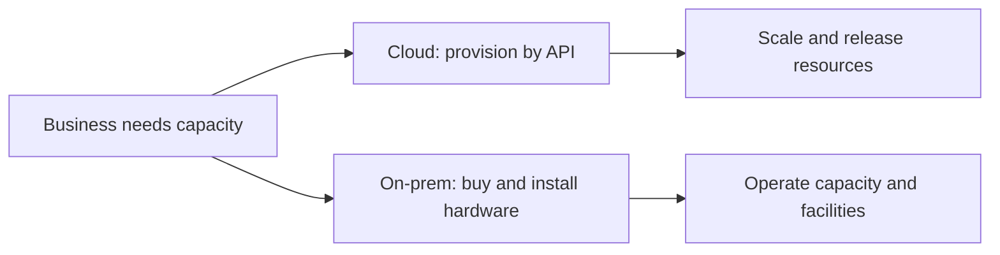
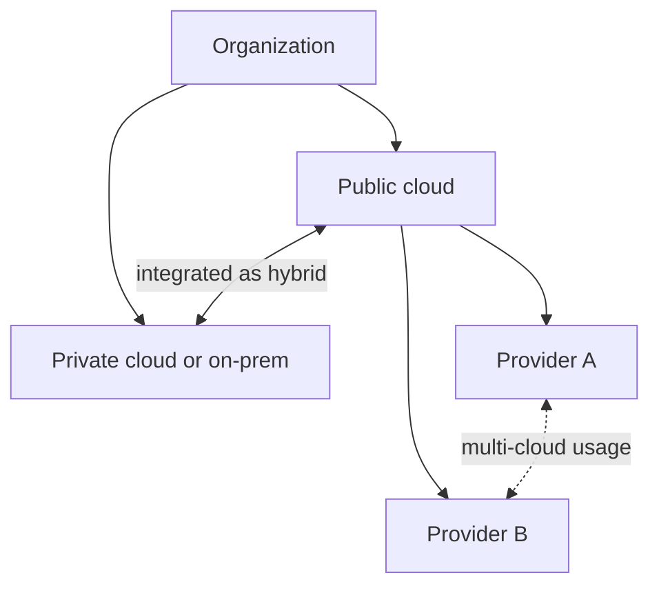
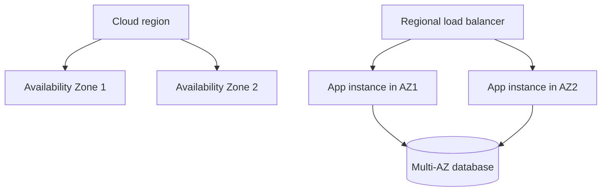
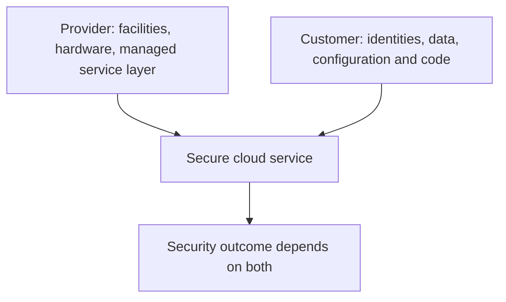
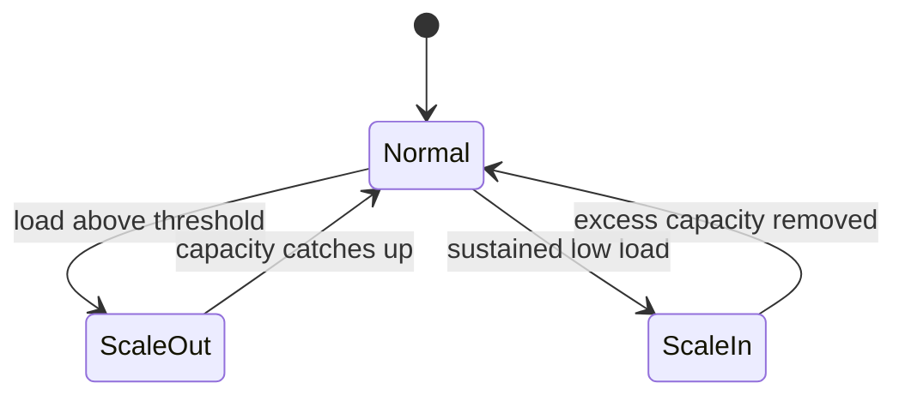

## 1. What is cloud computing, and how is it different from traditional on-premise infrastructure?



**Cloud Computing** হলো এমন একটা মডেল যেখানে computing resources (যেমন servers, storage, database, networking, software) internet-এর মাধ্যমে on-demand সরবরাহ করা হয়, একটা third-party provider (যেমন AWS, Azure, Google Cloud) এর data center থেকে। ইউজারকে নিজে hardware কিনতে বা maintain করতে হয় না — শুধু ব্যবহার অনুযায়ী payment করতে হয়।

অন্যদিকে, **On-premise infrastructure**-এ organization নিজেই hardware (servers, storage devices, networking equipment) কিনে, নিজস্ব data center বা office-এ install করে এবং নিজেরাই maintain, upgrade ও secure করে।

Traditional on-premise infrastructure এবং cloud-এর মূল পার্থক্য:

| বিষয় | Cloud Computing | On-premise |
|---|---|---|
| **Ownership** | Provider-এর মালিকানায় থাকে, ইউজার শুধু ব্যবহার করে | Organization নিজেই কিনে রাখে |
| **Cost Model** | OpEx (operational expenditure) — pay-as-you-go | CapEx (capital expenditure) — বড় upfront investment |
| **Setup Time** | মিনিটেই provision করা যায় | Hardware কেনা, বসানো, configure করতে সপ্তাহ/মাস লাগে |
| **Scalability** | Instantly scale up/down করা যায় | Physical hardware কিনে scale করতে হয়, সময়সাপেক্ষ |
| **Maintenance** | Provider দায়িত্বে থাকে (hardware, security patch ইত্যাদি) | নিজস্ব IT team দায়িত্বে থাকে |
| **Location** | যেকোনো জায়গা থেকে access করা যায় | সাধারণত নির্দিষ্ট location-bound |

---

### What are the core characteristics of cloud (on-demand self-service, elasticity, pay-as-you-go)?

Cloud computing-কে সাধারণত NIST-এর definition অনুযায়ী কয়েকটা core characteristic দিয়ে চেনা যায়:

- **On-demand Self-service**: ইউজার নিজেই, কোনো human interaction (provider-এর সাথে যোগাযোগ) ছাড়াই, প্রয়োজন অনুযায়ী compute power, storage বা network resource provision করতে পারে — একটা dashboard বা API-এর মাধ্যমে।

- **Elasticity**: Resource-কে demand অনুযায়ী automatically বা quickly scale up (বাড়ানো) বা scale down (কমানো) করা যায়। যেমন কোনো website-এ হঠাৎ traffic বাড়লে সাথে সাথে বেশি server allocate হয়ে যায়, আবার traffic কমলে resource release হয়ে যায়।

- **Pay-as-you-go (Pay-per-use)**: শুধু যতটুকু resource ব্যবহার করা হয়েছে (যেমন CPU hours, storage GB, data transfer) ততটুকুর জন্যই bill করা হয় — fixed upfront cost দিতে হয় না।

এছাড়াও আরও কিছু characteristic আছে:
- **Broad Network Access**: Internet থাকলেই যেকোনো device (laptop, mobile, tablet) থেকে access করা যায়।
- **Resource Pooling**: Provider multiple customer-এর মধ্যে resource share করে (multi-tenancy), যেটা cost efficient করে।
- **Measured Service**: Resource ব্যবহারের উপর automatic monitoring ও billing হয়, transparency থাকে।

---

### What are the risks/downsides of cloud adoption (vendor lock-in, security, compliance)?

Cloud-এ অনেক সুবিধা থাকলেও কিছু গুরুত্বপূর্ণ risk ও downside আছে:

- **Vendor Lock-in**: একবার কোনো specific cloud provider (যেমন AWS বা Azure)-এর proprietary service বা architecture-এর উপর নির্ভরশীল হয়ে গেলে, পরে অন্য provider-এ migrate করা কঠিন ও costly হয়ে যায়। Data format, API, বা tooling সব provider-specific হওয়ায় switching cost অনেক বেশি হতে পারে।

- **Security**: Data internet-এর মাধ্যমে transfer হয় এবং third-party-এর infrastructure-এ store হয়, তাই data breach, unauthorized access, বা misconfiguration-এর ঝুঁকি থাকে। যদিও provider infrastructure security দেয়, কিন্তু ইউজারকেই data ও access control (shared responsibility model) সামলাতে হয়।

- **Compliance**: বিভিন্ন industry বা country-তে data storage, privacy ও handling নিয়ে specific regulation থাকে (যেমন GDPR, HIPAA)। Data কোন geographic location-এ store হচ্ছে, সেটা regulation মেনে চলছে কিনা তা নিশ্চিত করা জটিল হতে পারে, বিশেষ করে multi-region cloud deployment-এ।

- **অন্যান্য risk**:
  - **Downtime/Availability**: Provider-এর outage হলে business affected হতে পারে (নিজের control নেই)।
  - **Hidden Costs**: Data transfer, egress fee, বা unused resource-এর কারণে বিল অপ্রত্যাশিতভাবে বেড়ে যেতে পারে।
  - **Limited Control/Customization**: Underlying infrastructure নিয়ন্ত্রণ কম থাকে, কিছু customization-এ সীমাবদ্ধতা থাকতে পারে।

আপনি যদি চান, এই টপিকগুলো নিয়ে একটা comparison diagram বা visual summary বানিয়ে দিতে পারি।

## 2. What is the difference between IaaS, PaaS, SaaS, and FaaS?


Cloud computing-এর এই চারটা model মূলত **responsibility-এর distribution**-এর উপর ভিত্তি করে আলাদা হয় — অর্থাৎ কতটুকু infrastructure customer manage করবে, আর কতটুকু provider manage করবে।


- **IaaS (Infrastructure as a Service)**: Provider শুধু raw infrastructure (virtual machines, storage, networking) দেয়। বাকি সব (OS, runtime, application) customer নিজে setup ও manage করে। উদাহরণ: AWS EC2, Azure VMs, Google Compute Engine।

- **PaaS (Platform as a Service)**: Provider infrastructure-এর পাশাপাশি OS, runtime, middleware ও development platform-ও দেয়। Customer শুধু নিজের application code লিখে deploy করে। উদাহরণ: Heroku, Google App Engine, AWS Elastic Beanstalk।

- **SaaS (Software as a Service)**: সম্পূর্ণ ready-made software application ব্যবহারের জন্য পাওয়া যায়, কোনো infrastructure বা code নিয়ে চিন্তা করতে হয় না। উদাহরণ: Gmail, Google Docs, Salesforce, Slack।

- **FaaS (Function as a Service)**: এটা serverless computing-এর একটা form, যেখানে customer শুধু individual function বা piece of code লিখে দেয়, আর provider সেটা event-trigger অনুযায়ী automatically run করে, scale করে এবং resource manage করে। উদাহরণ: AWS Lambda, Azure Functions, Google Cloud Functions।


### What does the customer manage in each model - which gives the most control, and which needs the least operational work?


| Layer | IaaS | PaaS | SaaS | FaaS |
|---|---|---|---|---|
| **Application/Data** | Customer manage করে | Customer manage করে | Provider manage করে | Customer manage করে (শুধু function code) |
| **Runtime** | Customer manage করে | Provider manage করে | Provider manage করে | Provider manage করে |
| **Middleware** | Customer manage করে | Provider manage করে | Provider manage করে | Provider manage করে |
| **Operating System** | Customer manage করে | Provider manage করে | Provider manage করে | Provider manage করে |
| **Virtualization** | Provider manage করে | Provider manage করে | Provider manage করে | Provider manage করে |
| **Servers/Storage/Networking** | Provider manage করে | Provider manage করে | Provider manage করে | Provider manage করে |

**Control ও Operational Work-এর দিক থেকে:**

- **সবচেয়ে বেশি Control**: **IaaS** — কারণ এখানে OS থেকে শুরু করে সব layer-এ customer-এর হাতে flexibility থাকে, নিজের মতো করে সব configure করা যায়।

- **সবচেয়ে কম Operational Work**: **SaaS** — কারণ এখানে customer শুধু software ব্যবহার করে, কোনো infrastructure, code, বা maintenance নিয়ে ভাবতে হয় না।

- **FaaS**-ও operational work-এর দিক থেকে খুব হালকা — শুধু function-level code লিখলেই হয়, server provisioning বা scaling নিয়ে কোনো চিন্তা নেই (তাই একে "serverless"ও বলা হয়)।

- **PaaS** এই দুই extreme-এর মাঝামাঝি — development-এ কিছুটা control থাকে (custom application logic লেখা যায়), কিন্তু underlying infrastructure নিয়ে ভাবতে হয় না।

**সংক্ষেপে control-এর order**: IaaS > PaaS > FaaS > SaaS
**Operational work কমার order**: IaaS > PaaS > FaaS > SaaS (একই order, কারণ বেশি control মানেই বেশি responsibility)

---

### When would you choose one over another?

- **IaaS বেছে নিন যখন**:
  - Full control দরকার OS, security configuration, বা custom software stack-এর উপর।
  - Existing on-premise application-কে cloud-এ migrate (lift-and-shift) করতে চান।
  - নিজস্ব specific compliance বা customization প্রয়োজন।
  - উদাহরণ: একটা company যারা নিজস্ব custom database engine বা legacy application চালাতে চায়।

- **PaaS বেছে নিন যখন**:
  - দ্রুত application develop ও deploy করতে চান, infrastructure management নিয়ে সময় নষ্ট করতে চান না।
  - Developer team-কে শুধু code-এ focus করাতে চান।
  - উদাহরণ: একটা startup যারা দ্রুত একটা web application বানিয়ে market-এ আনতে চায়।

- **SaaS বেছে নিন যখন**:
  - Ready-made solution দরকার, in-house development করার দরকার নেই।
  - Common business function (email, CRM, collaboration tool) দরকার।
  - উদাহরণ: একটা company যাদের CRM দরকার কিন্তু নিজে বানানোর সময়/resource নেই — তারা Salesforce ব্যবহার করবে।

- **FaaS বেছে নিন যখন**:
  - Event-driven, short-duration task করতে হবে (যেমন image processing, API request handling)।
  - Traffic unpredictable বা intermittent, তাই idle server-এর জন্য পয়সা দিতে চান না (শুধু execution time-এর জন্য বিল আসে)।
  - Microservices architecture-এ ছোট ছোট independent function চালাতে চান।
  - উদাহরণ: একটা e-commerce site যেখানে user image upload করলে automatically একটা thumbnail generate function trigger হয়।

---

## 3. What is the difference between public, private, hybrid, and multi-cloud?



- **Public Cloud**: এখানে computing resource (servers, storage, network) একটা third-party provider (যেমন AWS, Azure, Google Cloud) owned ও operate করে, এবং সেটা internet-এর মাধ্যমে multiple organization/customer-এর মধ্যে shared থাকে (multi-tenant)। কম cost, high scalability, কিন্তু control ও customization তুলনামূলক কম।

- **Private Cloud**: এখানে infrastructure একটা single organization-এর জন্য dedicated থাকে — হয় নিজস্ব data center-এ (on-premise), অথবা কোনো third-party provider hosted কিন্তু exclusively ব্যবহারের জন্য। বেশি control, security ও customization পাওয়া যায়, কিন্তু cost বেশি এবং scalability সীমিত।

- **Hybrid Cloud**: এটা public cloud এবং private cloud-এর একটা combination, যেখানে দুটো environment একসাথে **integrated** ও **interconnected** থাকে — data ও application দুই environment-এর মধ্যে seamlessly move করতে পারে। উদাহরণ: sensitive data private cloud-এ রাখা, আর variable workload public cloud-এ চালানো।

- **Multi-Cloud**: এটা মানে **একাধিক public cloud provider** (যেমন AWS + Azure + GCP) একসাথে ব্যবহার করা, বিভিন্ন কাজের জন্য বা redundancy-এর জন্য। এখানে providers-গুলো নিজেদের মধ্যে integrated থাকতেই হবে, এমন কোনো বাধ্যবাধকতা নেই।

### Why are hybrid and multi-cloud not the same thing?

এই দুটো term প্রায়ই গুলিয়ে ফেলা হয়, কিন্তু এদের মূল difference হলো **architecture-এর intent ও integration**-এর মধ্যে:

| বিষয় | Hybrid Cloud | Multi-Cloud |
|---|---|---|
| **সংজ্ঞা** | Private + Public cloud-এর মিশ্রণ | একাধিক Public cloud provider-এর ব্যবহার |
| **মূল উদ্দেশ্য** | Environment-এর মধ্যে integration ও workload portability | Provider diversity, vendor lock-in এড়ানো, best-of-breed service নেওয়া |
| **Integration** | Environments সাধারণত tightly connected (data/app move করতে পারে) | Providers একে অপরের সাথে connected নাও হতে পারে, independently কাজ করতে পারে |
| **উদাহরণ** | On-premise private cloud + AWS একসাথে ব্যবহার, data sync হয় | AWS-এ compute, GCP-তে machine learning, Azure-এ backup — আলাদা আলাদা কাজে |

**মূল কথা হলো**: Hybrid cloud সবসময় *private + public*-এর সমন্বয়, যেখানে integration একটা core requirement। কিন্তু multi-cloud মানে শুধু *একাধিক public provider* ব্যবহার করা — এখানে private cloud থাকা লাগবে এমন কোনো শর্ত নেই, এবং providers-গুলোর মধ্যে integration থাকাও বাধ্যতামূলক না।

একটা organization theoretically **hybrid এবং multi-cloud** — দুটোই একসাথে হতে পারে: যেমন তাদের private cloud + AWS + Azure — এই তিনটা মিলিয়ে ব্যবহার করলে সেটা hybrid multi-cloud approach হবে।

### What are the operational challenges of multi-cloud?

Multi-cloud ব্যবহার করলে flexibility ও vendor diversity পাওয়া যায় ঠিকই, কিন্তু operational দিক থেকে বেশ কিছু জটিলতা তৈরি হয়:

- **Complexity in Management**: প্রতিটা provider-এর নিজস্ব console, tools, API ও terminology থাকে। ফলে multiple environment একসাথে manage করা, monitor করা এবং orchestrate করা যথেষ্ট জটিল হয়ে যায়।

- **Skill Gap**: Team-কে একসাথে একাধিক provider-এর (AWS, Azure, GCP) architecture, service ও best practice জানতে হয়, যেটা training cost ও expertise requirement বাড়িয়ে দেয়।

- **Security ও Compliance Consistency**: প্রতিটা provider-এর security model, IAM (Identity and Access Management) system এবং compliance certification আলাদা হতে পারে। সব environment জুড়ে uniform security policy বজায় রাখা কঠিন হয়।

- **Data Integration ও Interoperability**: বিভিন্ন cloud-এর মধ্যে data transfer, synchronization এবং workflow integration করা কঠিন, কারণ প্রতিটা provider-এর data format, API ও networking model আলাদা।

- **Cost Management**: প্রতিটা provider-এর billing structure ও pricing model ভিন্ন হওয়ায়, overall cost track করা এবং optimize করা কঠিন হয়ে পড়ে। Cross-cloud data transfer (egress fee)-ও অতিরিক্ত খরচ যোগ করে।

- **Networking Complexity**: বিভিন্ন cloud environment-এর মধ্যে secure ও reliable connectivity স্থাপন করা (যেমন VPN বা dedicated interconnect সেটআপ) প্রযুক্তিগতভাবে জটিল এবং latency issue তৈরি করতে পারে।

- **Monitoring ও Observability**: Centralized logging, monitoring ও alerting সেটআপ করা কঠিন হয়, কারণ প্রতিটা provider-এর নিজস্ব monitoring tool (CloudWatch, Azure Monitor, Google Cloud Operations) থাকে যেগুলো একসাথে unify করতে অতিরিক্ত tooling দরকার হয়।

- **Tooling Fragmentation**: Automation ও deployment (যেমন CI/CD pipeline, Infrastructure as Code) provider-specific tool দিয়ে করতে হলে সেগুলো maintain করা কঠিন হয়ে যায়, যদি না কোনো cloud-agnostic tool (যেমন Terraform) ব্যবহার করা হয়।
---

## 4. What are Regions and Availability Zones?



**Region**: এটা একটা নির্দিষ্ট geographic location, যেখানে cloud provider (AWS, Azure, GCP) তাদের data center-গুলো স্থাপন করে। প্রতিটা region সাধারণত একটা দেশ বা শহরের নাম অনুযায়ী চিহ্নিত হয় — উদাহরণ: `us-east-1` (N. Virginia), `ap-southeast-1` (Singapore), `eu-west-1` (Ireland)। প্রতিটা region সম্পূর্ণভাবে independent এবং একে অপর থেকে physically ও logically আলাদা।

**Availability Zone (AZ)**: প্রতিটা region-এর ভেতরে একাধিক **isolated, physically separate data center** থাকে, যেগুলোকে Availability Zone বলা হয়। একটা region-এ সাধারণত ২-৬টা AZ থাকে। প্রতিটা AZ-এর নিজস্ব power, cooling, networking থাকে, কিন্তু একই region-এর মধ্যে AZ-গুলো low-latency, high-speed private network দিয়ে interconnected থাকে।

**সহজ ভাষায় বললে**: Region হলো একটা বড় geographic এলাকা, আর সেই এলাকার মধ্যে একাধিক আলাদা আলাদা "data center cluster" হলো Availability Zone।

```
Region (যেমন: ap-southeast-1, Singapore)
   ├── Availability Zone A (আলাদা data center)
   ├── Availability Zone B (আলাদা data center)
   └── Availability Zone C (আলাদা data center)
```

---

### Why should production systems span multiple AZs?

Production system single AZ-এ রাখলে সেই AZ-এর issue হলেই application down হতে পারে। Multi-AZ design করলে system বেশি available হয়।

Example architecture:

```text
Load Balancer
  -> App Server in AZ-1
  -> App Server in AZ-2
  -> App Server in AZ-3

Database
  -> Primary in AZ-1
  -> Standby/Replica in AZ-2
```

Multi-AZ benefits:

- AZ outage হলেও traffic অন্য AZ-এ route করা যায়
- Maintenance বা hardware failure-এর impact কমে
- Load distribution ভালো হয়
- Database failover possible হয়
- SLA improve হয়

কিন্তু শুধু multi-AZ করলেই সব problem solve হয় না। Application stateless হওয়া, shared session strategy, database failover, health check, retry logic - এগুলোও ঠিক থাকতে হবে।

### How does region selection affect latency/compliance?


#### Latency-এর উপর প্রভাব:

- **User-এর কাছাকাছি Region বেছে নেওয়া**: যত বেশি physical distance, তত বেশি network latency (data travel করতে সময় লাগে)। তাই end-user যেখানে বেশি আছে, তার কাছাকাছি region বেছে নিলে response time কম হয় এবং user experience ভালো হয়।
  - উদাহরণ: বাংলাদেশের বেশিরভাগ user-এর জন্য `ap-southeast-1` (Singapore) region ব্যবহার করলে `us-east-1` (Virginia)-এর তুলনায় অনেক কম latency পাওয়া যাবে।

- **Multi-region Deployment**: Global user base থাকলে একাধিক region-এ application deploy করে, geographic routing (যেমন CDN বা DNS-based routing) ব্যবহার করে user-কে নিকটতম region-এ পাঠানো যায় — এতে global latency কমে।

- **Data Replication Latency**: যদি একাধিক region-এর মধ্যে data sync করতে হয় (multi-region architecture), region-গুলোর মধ্যে physical distance বেশি হলে replication delay বেড়ে যায়, যেটা data consistency-কেও প্রভাবিত করতে পারে।

#### Compliance-এর উপর প্রভাব:

- **Data Residency/Sovereignty Law**: অনেক দেশে আইন আছে যে নাগরিকদের নির্দিষ্ট ধরনের data (যেমন personal data, financial data, health record) সেই দেশের ভৌগোলিক সীমানার মধ্যেই store করতে হবে। যেমন:
  - **GDPR** (European Union) — EU নাগরিকদের personal data EU-এর ভেতরে বা adequately protected জায়গায় রাখতে হয়।
  - নির্দিষ্ট কিছু দেশে **local data residency law** আছে যেখানে data সেই দেশের ভেতরেই রাখা বাধ্যতামূলক।

- **Industry-specific Regulation**: কিছু sector (যেমন banking, healthcare) নির্দিষ্ট region-এ data রাখার নিয়ম মেনে চলতে বাধ্য থাকে (যেমন HIPAA-এর মতো regulation-এ data handling নিয়ে বিধিনিষেধ থাকে)।

- **ভুল Region বাছলে Legal Risk**: যদি ভুল region বেছে নিয়ে regulation-বহির্ভূত জায়গায় sensitive data store করা হয়, তাহলে organization-কে আইনি জরিমানা বা penalty face করতে হতে পারে।

- **Region-specific Certification**: কিছু compliance certification (যেমন FedRAMP, ISO standard) সব region-এ প্রযোজ্য নাও হতে পারে — তাই compliance requirement অনুযায়ী সঠিক region বেছে নেওয়া জরুরি।

> Region selection করার সময় দুটো জিনিস balance করতে হয় — **user-এর কাছাকাছি থেকে best performance (low latency)** পাওয়া, এবং **আইনি ও regulatory requirement (compliance)** মেনে চলা। কখনো কখনো এই দুটো লক্ষ্য একে অপরের বিপরীতে যেতে পারে (যেমন compliance-এর কারণে দূরের একটা region বাধ্যতামূলকভাবে বেছে নিতে হতে পারে, যদিও সেটা latency-এর দিক থেকে ideal না), তাই architecture design করার সময় এই trade-off বিবেচনা করতে হয়।

---

## 5. What is the Shared Responsibility Model?



**Shared Responsibility Model** হলো একটা security framework, যেখানে cloud infrastructure-এর security ও compliance-এর দায়িত্ব **cloud provider** এবং **customer**-এর মধ্যে ভাগ করা থাকে। এটার মূল কথা হলো — cloud-এ কাজ করলেও পুরো security দায়িত্ব provider একা নেয় না, বরং কিছু অংশ customer-কেও নিতে হয়।

এটাকে সাধারণত দুইভাবে ভাগ করা হয়:

- **Security "OF" the Cloud** (Provider-এর দায়িত্ব): Physical infrastructure, data center security, hardware, networking, virtualization layer — অর্থাৎ cloud-টা নিজে যেভাবে তৈরি ও চালু থাকে, সেটার security প্রোভাইডার দেখে।

- **Security "IN" the Cloud** (Customer-এর দায়িত্ব): Customer যা cloud-এর ভেতরে রাখে বা করে — data, application configuration, access management, encryption — এসবের security customer-কেই নিশ্চিত করতে হয়।

**মূল কথা**: Provider infrastructure-কে secure রাখে, কিন্তু customer সেই infrastructure-এর ভেতরে নিজের data ও application কতটা সঠিকভাবে configure ও protect করছে, সেটা সম্পূর্ণ customer-এর নিজের দায়িত্ব। ভুল configuration (যেমন publicly-open storage bucket) হলে সেটার দায় customer-এরই, provider-এর না।

### How does the split of responsibility change across IaaS vs. PaaS vs. SaaS?

Deployment model যত বেশি "managed" হয় (IaaS → PaaS → SaaS), provider-এর দায়িত্ব তত বাড়ে এবং customer-এর দায়িত্ব তত কমে।

| Layer | IaaS | PaaS | SaaS |
|---|---|---|---|
| **Data ও Access Management** | Customer | Customer | Customer |
| **Application-level Security** | Customer | Customer | Provider |
| **Application Code/Logic** | Customer | Customer | Provider (customer শুধু configure করে) |
| **Runtime** | Customer | Provider | Provider |
| **Middleware** | Customer | Provider | Provider |
| **Operating System (patching, hardening)** | Customer | Provider | Provider |
| **Virtualization Layer** | Provider | Provider | Provider |
| **Physical Servers/Storage/Networking** | Provider | Provider | Provider |
| **Physical Data Center Security** | Provider | Provider | Provider |


- **একটা জিনিস সবসময় customer-এর দায়িত্বে থাকে** — সেটা হলো **Data** এবং **Access/Identity Management (IAM)**। প্রায় সব model-এ (এমনকি SaaS-এও) customer-কেই ঠিক করতে হয় কে কোন data access করতে পারবে, password/credential কীভাবে manage হবে, ইত্যাদি।

- **IaaS**-এ customer-এর দায়িত্ব সবচেয়ে বেশি — OS patching, network firewall configuration, application security সব customer-কেই সামলাতে হয়। Provider শুধু physical infrastructure ও virtualization পর্যন্ত দায়িত্ব নেয়।

- **PaaS**-এ OS ও runtime-এর security provider দেখে, কিন্তু customer-কে এখনো নিজের application code-এর security (যেমন vulnerable code, insecure API) এবং data protection দেখতে হয়।

- **SaaS**-এ provider প্রায় সবকিছুর দায়িত্ব নেয় (application, runtime, OS, infrastructure), customer-এর দায়িত্ব সবচেয়ে কম থাকে — মূলত শুধু **user access management** (কে login করতে পারবে, কী permission থাকবে) এবং **data-এর content** (কী data upload করা হচ্ছে) নিয়ন্ত্রণ করা।

---

#### একটা সাধারণ ভুল ধারণা (Common Misconception)

অনেকেই মনে করেন cloud ব্যবহার করলে security পুরোপুরি provider-এর দায়িত্ব হয়ে যায় — এটা ভুল ধারণা। বাস্তবে বেশিরভাগ cloud security breach ঘটে customer-side misconfiguration-এর কারণে, যেমন:
- Publicly accessible storage bucket রেখে দেওয়া
- দুর্বল বা leaked access credential
- সঠিকভাবে IAM policy সেট না করা
- Encryption ব্যবহার না করা

তাই, deployment model যাই হোক না কেন, customer-কে সবসময় নিজের অংশের দায়িত্ব সম্পর্কে সচেতন থাকতে হয়।


## 6. What is cloud elasticity and auto-scaling, and how does elasticity differ from scalability?



- **Elasticity**: এটা cloud-এর একটা core characteristic, যেখানে system automatically এবং দ্রুত resource-কে demand অনুযায়ী **বাড়াতে (scale up)** এবং **কমাতে (scale down)** পারে, real-time-এ। Traffic বাড়লে resource বাড়ে, traffic কমলে resource আবার কমে যায় — অর্থাৎ এটা একটা **dynamic, bidirectional** প্রক্রিয়া।

- **Auto-scaling**: এটা হলো সেই **mechanism বা tool** যেটা elasticity-কে বাস্তবায়ন করে। এটা predefined rule বা metric-এর ভিত্তিতে automatically resource (যেমন server instance) যোগ বা বাদ দেয়, কোনো manual intervention ছাড়াই। উদাহরণ: AWS Auto Scaling Group, Azure VM Scale Sets।

**সহজ ভাষায়**: Elasticity হলো "concept/capability", আর Auto-scaling হলো সেই concept-কে বাস্তবে কার্যকর করার "tool/mechanism"।

---


এই দুটো term প্রায়ই গুলিয়ে ফেলা হয়, কিন্তু এদের মধ্যে গুরুত্বপূর্ণ পার্থক্য আছে:

| বিষয় | Elasticity | Scalability |
|---|---|---|
| **সংজ্ঞা** | Short-term demand অনুযায়ী resource automatically বাড়ানো/কমানো | System-এর ক্ষমতা যে সে বড় পরিসরে load handle করার জন্য grow করতে পারে |
| **দিক (Direction)** | Bidirectional — বাড়ে এবং কমে, দুটোই | সাধারণত unidirectional — মূলত বৃদ্ধির (growth) দিকে focus করে |
| **সময়সীমা** | Short-term, real-time, temporary demand spike handle করে | Long-term, planned growth handle করে |
| **উদাহরণ** | একটা e-commerce site-এ Eid sale-এর সময় হঠাৎ traffic বাড়লে সাথে সাথে server বেড়ে যায়, sale শেষ হলে আবার কমে যায় | একটা startup ধীরে ধীরে বড় হচ্ছে, তাই তাদের ৫ বছরে infrastructure ১০ গুণ বড় করতে হচ্ছে |

> Scalability হলো system-এর সামগ্রিক **capacity বাড়ানোর সক্ষমতা** (একটা architectural property), আর Elasticity হলো সেই scalability-কে **automatically ও dynamically, real-time-এ** কাজে লাগানোর ক্ষমতা। সব scalable system elastic নাও হতে পারে (manual scaling হতে পারে), কিন্তু elastic system সবসময় scalable হতে হয়।

---

###  What's the difference between horizontal and vertical scaling (scale-out vs. scale-in)?

- **Horizontal Scaling (Scale-out / Scale-in)**: এখানে system-এ **আরও বেশি instance/machine/node যোগ করা** হয় (scale-out), অথবা কমানো হয় (scale-in) — অর্থাৎ resource-এর সংখ্যা পরিবর্তন হয়, প্রতিটা machine-এর size একই থাকে।
  - উদাহরণ: একটা web application-এ ৫টা server চলছে, traffic বাড়লে আরও ৩টা server যোগ করা হলো (মোট ৮টা)।
  - **সুবিধা**: প্রায় unlimited scaling সম্ভব, fault tolerance বেশি (একটা node down হলে বাকিগুলো চলতে থাকে), downtime ছাড়াই scale করা যায়।
  - **অসুবিধা**: Application-কে distributed architecture-এর জন্য design করতে হয় (load balancing, session management জটিল হতে পারে)।

- **Vertical Scaling (Scale-up / Scale-down)**: এখানে existing machine-এর **resource (CPU, RAM, storage) বাড়ানো বা কমানো** হয়, machine/instance-এর সংখ্যা একই থাকে।
  - উদাহরণ: একটা database server-এর RAM 16GB থেকে বাড়িয়ে 64GB করা হলো।
  - **সুবিধা**: Implement করা সহজ, application architecture পরিবর্তন করার দরকার নেই।
  - **অসুবিধা**: একটা physical/virtual machine-এর একটা limit থাকে (hardware limit), সেই limit-এর পরে আর বাড়ানো যায় না। এবং scale করার সময় সাধারণত downtime লাগে (server restart প্রয়োজন হতে পারে)।

**Note**: প্রশ্নে "scale-out vs. scale-in" লেখা থাকলেও, সাধারণত industry-তে এই টার্মগুলো এভাবে ব্যবহার হয়:
- **Scale-out** = Horizontal বৃদ্ধি (node যোগ করা)
- **Scale-in** = Horizontal হ্রাস (node কমানো)
- **Scale-up** = Vertical বৃদ্ধি (resource বাড়ানো)
- **Scale-down** = Vertical হ্রাস (resource কমানো)

---

### What metrics typically trigger auto-scaling?

Auto-scaling policy সাধারণত নির্দিষ্ট threshold অতিক্রম করলে trigger হয়। সবচেয়ে common metric-গুলো হলো:

- **CPU Utilization**: যদি average CPU usage কোনো নির্দিষ্ট percentage (যেমন 70%) অতিক্রম করে, তাহলে নতুন instance যোগ হয়; কমে গেলে instance কমানো হয়। এটা সবচেয়ে বেশি ব্যবহৃত metric।

- **Memory (RAM) Utilization**: Memory usage বেশি হয়ে গেলে (যেমন 80%-এর উপরে), scaling trigger হতে পারে।

- **Network Traffic/Throughput**: Incoming/outgoing network traffic-এর পরিমাণ বেড়ে গেলে (যেমন data transfer rate spike করলে) scaling হতে পারে।

- **Request Count / Requests Per Second**: Load balancer-এ আসা request-এর সংখ্যা বেড়ে গেলে (যেমন per-target request count), নতুন instance যোগ করা হয়।

- **Queue Length**: Message queue (যেমন SQS)-এ pending message/job-এর সংখ্যা বেড়ে গেলে, worker instance বাড়ানো হয় processing দ্রুত করার জন্য।

- **Response Time/Latency**: Application-এর average response time একটা নির্দিষ্ট threshold-এর বেশি হয়ে গেলে (user experience খারাপ হচ্ছে বোঝায়), scaling trigger হতে পারে।

- **Custom/Application-specific Metrics**: কিছু ক্ষেত্রে business-specific metric ব্যবহার করা হয়, যেমন active user সংখ্যা, database connection count, বা কোনো custom application-level indicator।

- **Scheduled Scaling**: Metric-based না হয়ে, নির্দিষ্ট সময়ের ভিত্তিতেও scaling সেট করা যায় — যেমন প্রতিদিন office hour শুরুর আগে বেশি instance চালু করে রাখা (predictable traffic pattern অনুযায়ী)।

> বেশিরভাগ auto-scaling policy CPU এবং Memory utilization-এর উপর ভিত্তি করে সেট করা হয়, কারণ এগুলো সহজে measure করা যায় এবং application performance-এর সাথে সরাসরি সম্পর্কিত। তবে বাস্তব production environment-এ প্রায়ই একাধিক metric একসাথে ব্যবহার করে (multi-metric scaling policy) আরও accurate scaling decision নেওয়া হয়।
