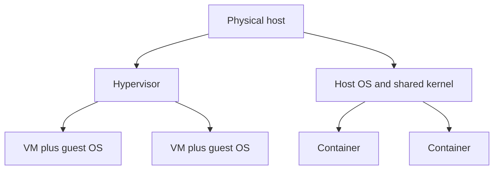
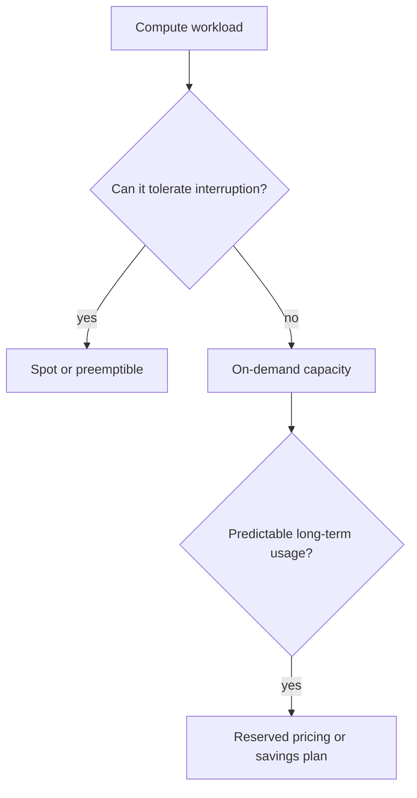
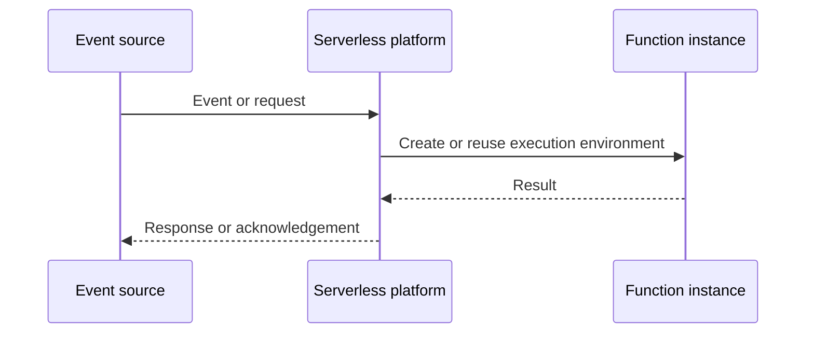
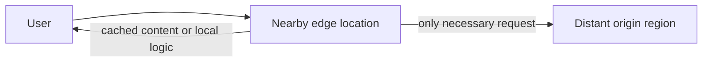

## 7. What is the difference between a virtual machine and a container?

**Virtual Machine (VM):** একটি VM হলো একটি ফিজিক্যাল সার্ভারের উপর **hypervisor** ব্যবহার করে তৈরি করা সম্পূর্ণ ভার্চুয়াল কম্পিউটার। প্রতিটি VM-এর নিজস্ব সম্পূর্ণ **guest operating system (OS)** থাকে, যেটা host OS থেকে সম্পূর্ণ আলাদা এবং independent। এর ফলে VM গুলো heavier হয় (কয়েক GB সাইজ), বুট হতে বেশি সময় লাগে (মিনিট), কিন্তু strong isolation দেয় কারণ প্রতিটি VM আলাদা kernel চালায়।

**Container:** Container গুলো host OS-এর **kernel share** করে, কিন্তু process, filesystem, network ইত্যাদির জন্য namespace ও cgroups ব্যবহার করে isolation তৈরি করে। ফলে এগুলো অনেক lightweight (কয়েক MB), সেকেন্ডের মধ্যে start হয়, এবং একই hardware-এ অনেক বেশি container চালানো যায়। কিন্তু isolation VM-এর তুলনায় দুর্বল, কারণ সব container একই kernel ব্যবহার করে।

**সংক্ষেপে:**
| বিষয় | VM | Container |
|---|---|---|
| Isolation | Strong (আলাদা kernel) | Weaker (shared kernel) |
| Startup time | ধীর (মিনিট) | দ্রুত (সেকেন্ড) |
| Size | বড় (GB) | ছোট (MB) |
| Resource overhead | বেশি | কম |
| Use case | Multi-tenant isolation, legacy apps | Microservices, CI/CD, scalable deployments |

### What do you consider when picking an instance type (CPU, memory, network)?

Instance type select করার আগে সাধারণত এই factor গুলো দেখা হয়:

- **Workload নেচার:** Application টা কি **CPU-bound** (যেমন video encoding, batch processing) নাকি **memory-bound** (যেমন in-memory cache, big data processing) নাকি **I/O-bound** — এর উপর ভিত্তি করে compute-optimized, memory-optimized, বা general-purpose instance family বেছে নেওয়া হয়।
- **CPU:** কতগুলো vCPU দরকার, clock speed, এবং কোনো specific architecture (যেমন ARM/Graviton vs x86) দরকার কিনা।
- **Memory:** RAM-to-vCPU ratio — যেমন database বা caching workload-এর জন্য memory-heavy instance (r-series) দরকার হতে পারে।
- **Network bandwidth:** high-throughput বা low-latency networking দরকার কিনা (যেমন distributed systems, video streaming) — এক্ষেত্রে enhanced networking বা higher bandwidth instance বেছে নিতে হয়।
- **Storage I/O:** local NVMe/SSD দরকার নাকি network-attached storage যথেষ্ট।
- **Cost:** performance আর budget-এর মধ্যে trade-off — over-provisioning এড়ানো এবং right-sizing করা।
- **Scalability:** auto-scaling group-এর সাথে compatible কিনা, এবং burstable (T-series) vs consistent performance instance দরকার কিনা।

---

## 8. What is the difference between spot/preemptible instances and reserved/savings-plan instances?

**Spot/Preemptible Instance:** এগুলো cloud provider-এর unused/spare capacity থেকে অনেক কম দামে (up to 70-90% discount) পাওয়া যায়। কিন্তু provider-এর যখন সেই capacity দরকার হয়, তখন সেই instance **যেকোনো সময় terminate/preempt** করে দিতে পারে, সাধারণত অল্প নোটিশ (যেমন AWS-এ ২ মিনিট) দিয়ে। এগুলো unpredictable availability-র কারণে **fault-tolerant, stateless, বা interruptible workload**-এর জন্য উপযুক্ত — যেমন batch processing, CI/CD job, big data analytics।

**Reserved Instance / Savings Plan:** এখানে আপনি একটা নির্দিষ্ট সময়ের জন্য (সাধারণত ১ বা ৩ বছর) compute usage-এর commitment দেন, বিনিময়ে on-demand price থেকে discount পান। এগুলো মূলত **pricing commitment**; সাধারণত capacity guarantee করে না। Capacity নিশ্চিত করতে provider-এর আলাদা capacity-reservation feature লাগতে পারে। এটা steady-state, predictable workload-এর জন্য ভালো।

**সংক্ষেপে:**
| বিষয় | Spot Instance | Reserved/Savings Plan |
|---|---|---|
| Cost | সবচেয়ে সস্তা | মাঝারি discount |
| Availability | Unpredictable, interruptible | Pricing commitment নিজে capacity guarantee নয় |
| Commitment | নেই | ১-৩ বছরের commitment |
| উপযুক্ত workload | Stateless, fault-tolerant, batch | Steady-state, critical, long-term |

### How should an application handle a spot instance interruption?

Spot interruption handle করার জন্য সাধারণত নিচের practice গুলো follow করা হয়:

- **Interruption notice listen করা:** Cloud provider সাধারণত termination-এর আগে একটা warning signal পাঠায় (যেমন AWS-এর ২ মিনিট আগে metadata endpoint-এ notice দেয়)। Application সেটা poll করে graceful shutdown শুরু করতে পারে।
- **Graceful shutdown/checkpointing:** কাজ interrupt হওয়ার আগে state বা progress **checkpoint** করে persistent storage-এ (যেমন S3, database) সেভ করে রাখা, যাতে পরে অন্য instance থেকে resume করা যায়।
- **Stateless design:** Application-কে যতটা সম্ভব stateless রাখা, যাতে কোনো instance হারিয়ে গেলেও কোনো data loss না হয় — state আলাদা persistent layer-এ রাখা।
- **Diversified instance pool:** একাধিক instance type/availability zone মিলিয়ে spot fleet ব্যবহার করা, যাতে একসাথে সব capacity হারানোর ঝুঁকি কমে।
- **Auto-scaling ও fallback:** Spot instance না পাওয়া গেলে automatically on-demand instance-এ fallback করার mechanism রাখা (যেমন mixed instance policy)।
- **Retry ও orchestration:** Job/task queue system (যেমন Kubernetes-এর pod rescheduling, বা job queue with retry logic) ব্যবহার করে interrupted কাজ automatically অন্য instance-এ পুনরায় শুরু করা।
- **Load balancer থেকে drain করা:** Terminate হওয়ার আগে instance-কে load balancer থেকে সরিয়ে নেওয়া (connection draining), যাতে চলমান request গুলো ঠিকভাবে শেষ হয়।

## 9. What is serverless compute (Lambda, Cloud Functions)?

**Serverless compute** হলো এমন একটি execution model যেখানে developer কে কোনো server provision, manage, বা scale করতে হয় না — শুধু code লিখে deploy করলেই cloud provider automatically সবকিছু handle করে। এখানে আপনি শুধু আপনার **function/code** লেখেন (যেমন AWS Lambda, Google Cloud Functions, Azure Functions), এবং সেটা কোনো event (HTTP request, database change, file upload, message queue) দ্বারা **trigger** হয়ে execute হয়।

মূল বৈশিষ্ট্য:
- **Event-driven:** কোনো event ঘটলেই function চলে, নাহলে idle থাকে।
- **Auto-scaling:** Request-এর সংখ্যা অনুযায়ী automatically scale up/down হয়, এমনকি zero পর্যন্ত।
- **Pay-per-use billing:** শুধু execution time এবং resource usage-এর জন্য pay করতে হয়, idle time-এর জন্য কোনো cost নেই (traditional server-এর মতো ২৪/৭ running cost নেই)।
- **No infrastructure management:** OS patching, server provisioning, capacity planning — এসব cloud provider handle করে।

### What is the cold start problem, and how do you reduce it (provisioned concurrency, smaller packages)?

**Cold start** হলো সেই latency যা তখন ঘটে যখন কোনো serverless function অনেকদিন idle থাকার পর নতুন request আসে, এবং provider-কে নতুন execution environment তৈরি করতে হয় — যেমন container/runtime initialize করা, code load করা, dependencies mount করা, এবং তারপর actual function execute করা। এতে সাধারণ (warm) execution-এর তুলনায় অনেক বেশি latency (কয়েকশ মিলিসেকেন্ড থেকে কয়েক সেকেন্ড) যোগ হয়।

Cold start কমানোর উপায়:

- **Provisioned concurrency:** AWS Lambda-এর মতো service-এ আপনি নির্দিষ্ট সংখ্যক execution environment **pre-warmed** রাখতে পারেন, যেগুলো সবসময় ready থাকে, ফলে cold start হয়ই না। কিন্তু এতে idle capacity-র জন্যও pay করতে হয়, তাই cost বাড়ে।
- **Smaller package size:** Deployment package (code + dependencies) যত ছোট রাখা যায়, initialization তত দ্রুত হয়। Unnecessary library/dependency বাদ দেওয়া, unused code trim করা।
- **Runtime choice:** কিছু runtime (যেমন Python, Node.js) অন্যদের (যেমন Java, .NET) তুলনায় দ্রুত start হয় — lighter runtime বেছে নেওয়া cold start কমায়।
- **Minimize initialization code:** Function-এর global/init scope-এ heavy operation (বড় object তৈরি, database connection setup) কম রাখা, বা lazy-load করা।
- **Keep functions warm:** Periodic ping/scheduled trigger (যেমন প্রতি কয়েক মিনিটে dummy invocation) দিয়ে function warm রাখা — যদিও এটা একটা workaround, native solution না।
- **Connection pooling/reuse:** External connection (DB connection ইত্যাদি) execution context-এর বাইরে cache করে পরের invocation-এ reuse করা।

### When should you avoid serverless?

- **Long-running workload:** Serverless function-এর সাধারণত execution time limit থাকে (যেমন Lambda-তে ১৫ মিনিট)। Long-running batch job বা video processing-এর জন্য এটা উপযুক্ত না।
- **Consistent, high-throughput traffic:** যদি application-এ predictable, steady, high volume traffic থাকে, তাহলে traditional VM/container (reserved instance সহ) বেশি cost-effective হতে পারে serverless-এর pay-per-invocation model-এর তুলনায়।
- **Latency-sensitive applications:** যেখানে cold start-এর কারণে সৃষ্ট latency acceptable না (যেমন real-time trading system), সেখানে serverless ঝুঁকিপূর্ণ।
- **Complex stateful applications:** Serverless function গুলো সাধারণত **stateless**, তাই যেসব application-এ heavy in-memory state maintain করা দরকার (যেমন in-memory caching, WebSocket-based long connection), সেখানে এটা suitable না।
- **Vendor lock-in concern:** Serverless platform-গুলোর proprietary API/architecture-এর উপর নির্ভরতা বেশি, migration করা কঠিন হতে পারে।
- **Fine-grained infrastructure control দরকার হলে:** যদি custom networking, specific OS-level configuration, বা specialized hardware (GPU-heavy workload) দরকার হয়, তাহলে VM/container-based approach বেশি flexible।
- **Heavy compute/resource-intensive tasks:** যেখানে predictable, dedicated, high-performance resource দরকার (যেমন ML model training), সেখানে dedicated instance বেশি উপযুক্ত ও cost-efficient।

---

## 10. What is edge computing, and why does it reduce latency?

**Edge computing** হলো এমন একটি computing paradigm যেখানে data processing এবং computation কেন্দ্রীয় (centralized) data center-এর পরিবর্তে **data source-এর কাছাকাছি** — অর্থাৎ "edge"-এ (যেমন local server, IoT device, বা user-এর কাছাকাছি অবস্থিত mini data center) সম্পন্ন করা হয়।

এটা latency কমায় কারণ:
- **Physical distance কমে যায়:** Data centralized cloud data center-এ (যা হয়তো ভৌগোলিকভাবে অনেক দূরে) পাঠানোর বদলে, নিকটবর্তী edge node-এই process হয়, ফলে **round-trip time (RTT)** কমে যায়।
- **Network hop কমে:** কম network hop, কম router/switch অতিক্রম করতে হয়, ফলে transmission delay কম হয়।
- **Bandwidth সাশ্রয়:** সব raw data central server-এ না পাঠিয়ে, edge-এ প্রাথমিক processing/filtering করে শুধু প্রয়োজনীয় data পাঠানো হয়, যা network congestion কমায় এবং response দ্রুত করে।
- **Real-time processing:** Autonomous vehicle, industrial IoT, AR/VR-এর মতো applications-এ millisecond-level response দরকার — edge computing সেটা সম্ভব করে কারণ processing local-এই হয়।

### How does edge computing differ from a traditional CDN?

**Traditional CDN (Content Delivery Network):** মূলত **static content caching**-এর জন্য ডিজাইন করা — যেমন image, video, HTML/CSS/JS file, ইত্যাদি geographically distributed server (edge location/PoP) -এ cache করে রাখা হয়, যাতে user-এর কাছাকাছি থেকে দ্রুত deliver করা যায়। CDN মূলত **content delivery**-তে focused, computation করে না (যদিও আধুনিক CDN-এ কিছু edge function/logic থাকে)।

**Edge Computing:** এটা শুধু static content serve করাই না, বরং **actual computation/processing** edge location-এ চালানো — যেমন real-time data analytics, ML inference, IoT sensor data processing, dynamic content generation। এখানে edge node শুধু cache না, বরং একটা **mini compute environment** হিসেবে কাজ করে যেটা logic execute করতে পারে, database query করতে পারে, বা device-এর সাথে সরাসরি interact করতে পারে।

**মূল পার্থক্য:**
| বিষয় | Traditional CDN | Edge Computing |
|---|---|---|
| Primary purpose | Static content caching/delivery | Data processing ও computation |
| Content type | Static (image, video, files) | Dynamic, real-time data |
| Processing capability | সীমিত (মূলত caching) | Full compute (logic, ML inference, ইত্যাদি) |
| Use case | Website acceleration, video streaming | IoT, autonomous systems, AR/VR, real-time analytics |
| Data flow | One-directional (server → user) | Bi-directional, interactive |

সহজভাবে বললে, CDN হলো edge computing-এর একটা **subset বা early form**, যেটা শুধু content delivery-তে সীমাবদ্ধ, আর edge computing হলো তার বিস্তৃত রূপ যেখানে actual computation ও intelligence edge-এ নিয়ে যাওয়া হয়।
