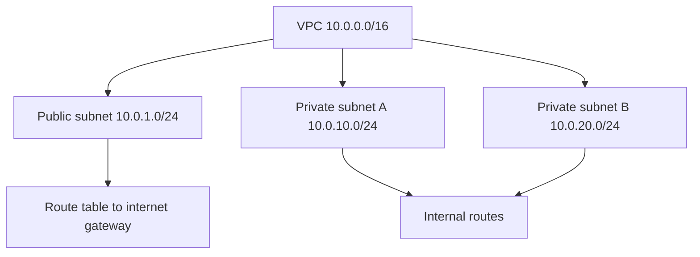
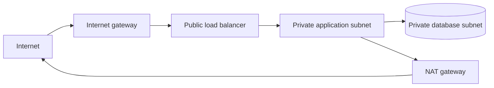
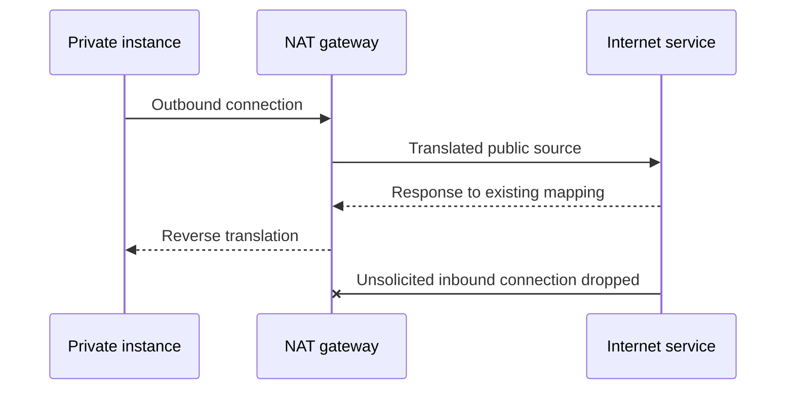
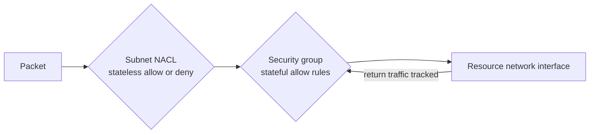
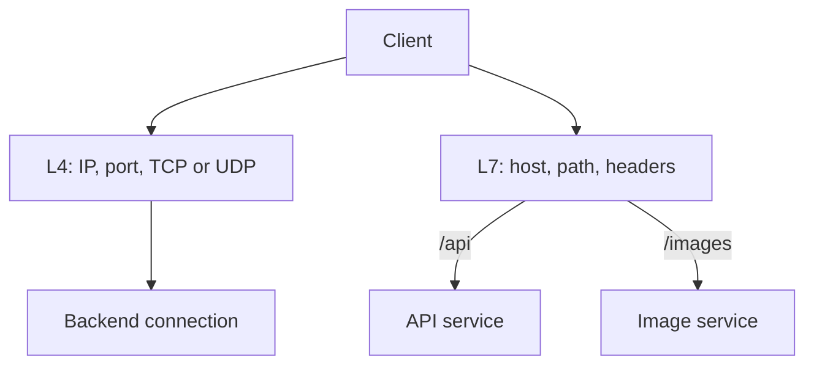
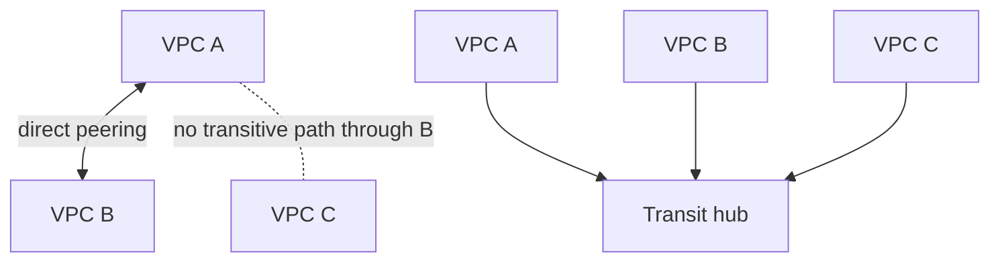
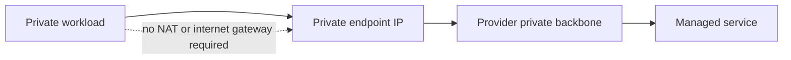
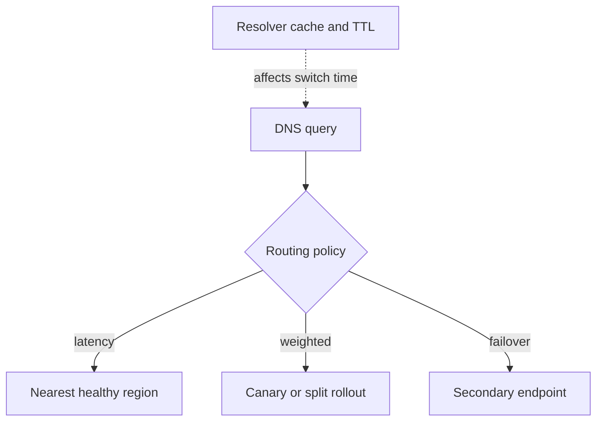
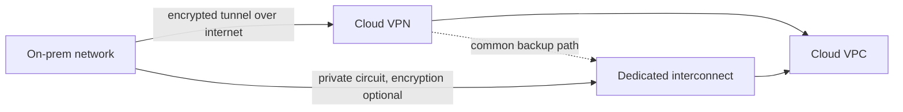

## 16. What is a VPC, and why is a CIDR block needed?

**VPC (Virtual Private Cloud):** এটা হলো cloud provider-এর মধ্যে একটা **logically isolated, virtual network environment**, যেখানে আপনি আপনার resource (VM/instance, database, load balancer ইত্যাদি) deploy করতে পারেন এবং সেই network-এর **IP addressing, subnet, routing, security** সম্পূর্ণভাবে নিজে control করতে পারেন — অনেকটা নিজের data center-এর private network-এর মতো, কিন্তু cloud-এ। VPC আপনার resource গুলোকে অন্য customer-এর resource থেকে সম্পূর্ণভাবে isolate করে রাখে।

VPC-এর মূল component গুলো হলো:
- **Subnet:** VPC-কে ছোট ছোট network segment-এ ভাগ করা (public subnet, private subnet)।
- **Route table:** Traffic কোন পথে যাবে সেটা নির্ধারণ করা।
- **Internet Gateway / NAT Gateway:** Internet access দেওয়ার জন্য।
- **Security Group / Network ACL:** Traffic filtering/firewall rule।

### How do you plan CIDR ranges to avoid overlap across environments/regions?

**CIDR (Classless Inter-Domain Routing) block** হলো একটা notation (যেমন `10.0.0.0/16`) যা একটা network-এর **IP address range** নির্ধারণ করে — কতগুলো IP address সেই network-এ available থাকবে এবং কীভাবে subnet-এ ভাগ করা যাবে।

CIDR block দরকার কারণ:
- **IP address allocation:** VPC তৈরি করার সময় আপনাকে বলতে হয় কোন IP range-এ আপনার resource গুলো থাকবে — এই range-টাই CIDR block নির্ধারণ করে।
- **Subnetting:** বড় CIDR block-কে ছোট ছোট subnet-এ ভাগ করা যায় (যেমন `10.0.0.0/16` কে `10.0.1.0/24`, `10.0.2.0/24` ইত্যাদিতে ভাগ করা), যাতে বিভিন্ন Availability Zone বা tier (public/private) আলাদা করা যায়।
- **Routing decision:** Network traffic কোন subnet/destination-এ যাবে তা CIDR range অনুযায়ী route table-এ নির্ধারিত হয়।
- **Scalability planning:** কত সংখ্যক resource/IP address ভবিষ্যতে দরকার হতে পারে, সেটা আগে থেকে হিসাব করে যথেষ্ট বড় CIDR range বরাদ্দ করা দরকার।

### Environment/Region জুড়ে Overlap এড়াতে কীভাবে CIDR Range Plan করবেন?

CIDR overlap একটা common এবং গুরুত্বপূর্ণ সমস্যা, বিশেষত যখন **VPC peering, VPN, বা Transit Gateway** দিয়ে একাধিক VPC connect করতে হয় — কারণ overlapping CIDR range থাকলে routing ambiguous হয়ে যায় এবং connectivity সম্ভব হয় না। এটা এড়াতে যা করা যায়:

- **Centralized IP Address Management (IPAM):** একটা কেন্দ্রীয় system বা tool (যেমন AWS IPAM, বা spreadsheet/documentation) ব্যবহার করে সব environment/region-এর CIDR allocation track করা, যাতে কেউ ভুলবশত duplicate range assign না করে।

- **আগে থেকে বড় range এলোকেট করে ভাগ করা:** একটা বড় private IP range (যেমন RFC 1918-এর `10.0.0.0/8`) নিয়ে সেটাকে environment ও region অনুযায়ী পরিকল্পিতভাবে ভাগ করা। উদাহরণস্বরূপ:
  - `10.0.0.0/16` → Production, us-east-1
  - `10.1.0.0/16` → Production, eu-west-1
  - `10.2.0.0/16` → Staging, us-east-1
  - `10.3.0.0/16` → Development, us-east-1
  
  এভাবে প্রতিটা environment/region-এর জন্য আলাদা, non-overlapping block reserve করে রাখলে ভবিষ্যতে peering বা connectivity করার সময় কোনো conflict হয় না।

- **Environment অনুযায়ী separate octet/range রাখা:** যেমন second octet দিয়ে environment বোঝানো (production = `10.0.x.x`, staging = `10.1.x.x`, dev = `10.2.x.x`), যাতে visually এবং logically সহজে distinguish করা যায় কোনটা কোন environment-এর।

- **Future growth-এর জন্য margin রাখা:** বর্তমান ও সম্ভাব্য subnet/IP demand, provider-reserved address এবং connected network বিবেচনা করে যথেষ্ট room রাখতে হবে। সব ক্ষেত্রে `/16` নেওয়া ঠিক নয়; অতিরিক্ত বড় allocation address space নষ্ট ও overlap risk বাড়াতে পারে।

- **RFC 1918 private range-এর মধ্যেই থাকা, কিন্তু non-overlapping segment ব্যবহার করা:** `10.0.0.0/8`, `172.16.0.0/12`, `192.168.0.0/16` — এই তিনটা private range-এর মধ্যে থেকেই প্রতিটা environment/region-এর জন্য আলাদা, অনতিক্রান্ত (non-overlapping) subrange বরাদ্দ করা।

- **On-premises network-এর সাথেও conflict চেক করা:** যদি cloud VPC-কে on-premises data center-এর সাথে VPN/Direct Connect দিয়ে সংযুক্ত করতে হয়, তাহলে on-prem network-এর existing CIDR range-এর সাথেও conflict না হয় তা নিশ্চিত করা জরুরি।

- **Documentation ও governance:** একটা clear naming convention এবং allocation policy তৈরি করা, এবং নতুন VPC তৈরি করার সময় সেই policy অনুযায়ী approval/review process রাখা, যাতে ভবিষ্যতে কেউ ভুল করে duplicate/overlapping range ব্যবহার না করে।

## 17. What is the difference between a public subnet and a private subnet?

**Public Subnet:** এমন একটা subnet যার route table-এ সরাসরি একটা **Internet Gateway (IGW)**-এর route থাকে (যেমন `0.0.0.0/0 → IGW`)। এর ফলে এই subnet-এ থাকা resource (যেমন EC2 instance) যদি একটা **public IP address** পায়, তাহলে সেটা সরাসরি internet থেকে accessible হয়, এবং instance নিজেও সরাসরি internet-এ outbound traffic পাঠাতে পারে। সাধারণত **load balancer, bastion host, web server (যা সরাসরি user request receive করে)** এই ধরনের resource public subnet-এ রাখা হয়।

**Private Subnet:** এমন একটা subnet যার route table-এ সরাসরি Internet Gateway-এর route নেই। এই subnet-এ থাকা resource-এর কোনো public IP address থাকে না, ফলে internet থেকে সরাসরি এগুলোতে **inbound access সম্ভব না**। তবে outbound internet access দরকার হলে (যেমন software update download করা), সেটা একটা **NAT Gateway/NAT instance**-এর মাধ্যমে করা যায় — যেখানে outbound connection allow করা হয়, কিন্তু বাইরে থেকে কেউ initiate করে ভিতরে ঢুকতে পারে না। সাধারণত **database, application backend server, internal service** এই ধরনের resource private subnet-এ রাখা হয়।

**সংক্ষেপে:**
| বিষয় | Public Subnet | Private Subnet |
|---|---|---|
| Internet Gateway route | আছে | নেই |
| Public IP | থাকতে পারে | সাধারণত থাকে না |
| Inbound internet access | সম্ভব | সম্ভব না (default) |
| Outbound internet access | সরাসরি IGW দিয়ে | NAT Gateway-এর মাধ্যমে (optional) |
| সাধারণ ব্যবহার | Load balancer, bastion host, web server | Database, backend app server, internal microservice |

### Why are databases usually placed in private subnets?

- **Attack surface কমানো (Security):** Database-এ সাধারণত সবচেয়ে sensitive এবং critical data থাকে (user information, financial data ইত্যাদি)। এটাকে internet থেকে সরাসরি unreachable রাখলে, বাইরের কোনো attacker সরাসরি database-এ connect করার চেষ্টাই করতে পারবে না — এটা attack surface অনেকখানি কমিয়ে দেয়।

- **Defense in depth:** Security-র একটা মূল principle হলো একাধিক layer of protection রাখা। শুধু firewall/security group-এর উপর নির্ভর না করে, network architecture-এই database-কে isolate করে রাখা একটা অতিরিক্ত protection layer তৈরি করে — এমনকি যদি কোনোভাবে security group misconfigure হয়েও যায়, তাও database internet থেকে সরাসরি reachable না।

- **Controlled access flow:** Private subnet-এ থাকা database-এ শুধুমাত্র **application/backend server** (যেটা একই VPC-এর মধ্যে থাকে, সাধারণত সেটাও private subnet-এ) থেকেই access করা যায়। এতে একটা clear, controlled traffic flow তৈরি হয়: `User → Load Balancer (public) → App Server (private) → Database (private)` — কোনো layer skip করে সরাসরি database-এ পৌঁছানো যায় না।

- **Compliance এবং best practice:** অনেক security standard এবং compliance framework (যেমন PCI-DSS, HIPAA) database-কে private/isolated network-এ রাখা explicitly recommend বা require করে, কারণ sensitive data protection-এর জন্য এটা industry-standard practice।

- **Reduced exposure to common attacks:** Internet-facing না থাকার কারণে database সরাসরি common network-based attack (যেমন port scanning, brute-force login attempt, DDoS) থেকে অনেকটাই সুরক্ষিত থাকে, কারণ attacker-এর কাছে database-এর কোনো direct network path-ই নেই।

Outbound access (যদি দরকার হয়, যেমন patch update বা external API call) NAT Gateway দিয়ে controlled ভাবে দেওয়া যায়, কিন্তু inbound-এ কেউ বাইরে থেকে initiate করে ঢুকতে পারে না — এটাই মূল security benefit যা private subnet database-কে দেয়।

## 18. What is the difference between an internet gateway and a NAT gateway?

**Internet Gateway (IGW):** এটা VPC-কে internet-এর সাথে bidirectional route দেয়। Resource reachable হতে route-এর পাশাপাশি public address, firewall/security rule এবং listening service-ও দরকার। Public IPv4 mapping/NAT-এর implementation provider-specific; তাই “IGW কখনো NAT করে না” generic cloud rule নয়। Managed gateway scale করলেও quota ও downstream bandwidth limit থাকতে পারে।

**NAT Gateway:** এটা এমন একটা component যা **private subnet**-এ থাকা resource-কে internet-এ **outbound connection** করতে দেয় (যেমন software update download, external API call), কিন্তু বাইরে থেকে internet-এর কেউ সেই private resource-এ সরাসরি **inbound connection initiate** করতে পারে না। NAT Gateway private instance-এর **private IP address**-কে NAT Gateway-এর নিজস্ব **public/elastic IP**-তে translate করে, যাতে internet-এ request পাঠানো যায়, এবং response আসলে সেটা আবার সঠিক private instance-এ ফেরত পাঠায় — কিন্তু এই connection সবসময় **internal resource থেকেই initiate** হতে হয়।

**সংক্ষেপে:**
| বিষয় | Internet Gateway | NAT Gateway |
|---|---|---|
| Traffic direction | Bidirectional (inbound + outbound) | শুধু outbound-initiated (response ফেরত আসে) |
| ব্যবহৃত হয় | Public subnet resource-এর জন্য | Private subnet resource-এর জন্য |
| IP translation | করে না (public IP সরাসরি ব্যবহৃত হয়) | করে (private IP → NAT-এর public IP) |
| Inbound connection allow করে কিনা | হ্যাঁ | না |
| Cost | Free (data transfer cost ছাড়া) | Hourly + data processing charge আছে |

### Why does a NAT gateway only allow outbound, not inbound, initiated traffic?

এর মূল কারণ হলো NAT Gateway একটা **stateful** device হিসেবে কাজ করে, এবং এটা ডিজাইন করাই হয়েছে শুধু "**internal resource protect রাখা, কিন্তু তাদের বাইরের সাথে যোগাযোগের সুযোগ দেওয়া**" — এই নির্দিষ্ট purpose-এ:

- **Connection tracking (stateful behavior):** যখন private subnet-এর কোনো instance NAT Gateway-এর মাধ্যমে বাইরে কোনো request পাঠায় (যেমন `GET https://update-server.com`), NAT Gateway সেই connection-এর একটা **entry (source IP, port, destination) তার connection tracking table**-এ রেখে দেয়। এরপর যখন সেই request-এর response ফিরে আসে, NAT Gateway সেই table দেখে বুঝতে পারে এই response টা কোন internal instance-এর জন্য প্রাপ্য, এবং সেটাকেই forward করে দেয়। কিন্তু যদি বাইরে থেকে কেউ **নতুন, unsolicited connection** শুরু করার চেষ্টা করে (যার কোনো matching entry connection table-এ নেই), NAT Gateway সেটা **drop** করে দেয় — কারণ এটা কোনো pre-established session-এর part না।

- **Security by design (implicit firewall behavior):** এই stateful nature-টাই effectively private subnet-এর resource-কে একটা built-in security layer দেয় — internet থেকে কেউ সরাসরি স্ক্যান করে বা connect করে private instance-এ পৌঁছাতে পারে না, কারণ NAT Gateway-এর কাছে সেই instance-এর কোনো publicly routable/discoverable address-ই নেই (শুধু NAT Gateway-এর নিজের public IP-ই বাইরে visible, individual private instance-গুলোর না)।

- **Purpose-driven design:** NAT Gateway তৈরিই করা হয়েছে "private resource-কে বাইরের সাথে সীমিত, নিয়ন্ত্রিতভাবে (শুধু outbound) communicate করার সুযোগ দেওয়ার" জন্য, এটা IGW-এর মতো general-purpose bidirectional gateway না। যদি inbound access দরকার হয় (যেমন কোনো external service-কে internal server-এ পৌঁছাতে হবে), তার জন্য আলাদা মেকানিজম ব্যবহার করা হয় — যেমন **Load Balancer, port forwarding, বা explicit reverse proxy** — কিন্তু NAT Gateway সেই purpose-এর জন্য না।

এই design-এর ফলে private subnet-এর resource (যেমন application server, database) নিরাপদে বাইরের প্রয়োজনীয় resource-এর (updates, third-party API) সাথে communicate করতে পারে, অথচ নিজেরা কখনো বাইরের কারো কাছে সরাসরি **attack surface/entry point** হয়ে ওঠে না।

## 19. What is the difference between a security group and a network ACL — stateful vs. stateless?

**Security Group (SG):** এটা একটা **instance/resource-level** (যেমন EC2 instance, ENI) virtual firewall, যা সেই নির্দিষ্ট resource-এর inbound এবং outbound traffic control করে। এটা **stateful** — অর্থাৎ যদি কোনো inbound traffic allow করা হয়, তাহলে সেই connection-এর response (outbound) traffic **automatically allow** হয়ে যায়, কোনো explicit outbound rule না থাকলেও। Security Group শুধু **"allow" rule** support করে (কোনো explicit "deny" rule নেই — যা list করা নেই, সেটাই implicitly deny)।

**Network ACL (NACL):** এটা একটা **subnet-level** firewall, যা পুরো subnet-এ প্রবেশ/বহির্গমন করা সব traffic-এর উপর প্রযোজ্য হয়। এটা **stateless** — অর্থাৎ inbound এবং outbound traffic সম্পূর্ণ **independently** evaluate হয়; কোনো inbound traffic allow করলেই তার response automatically allow হয় না, response traffic-এর জন্যও explicit outbound rule দিতে হয়। NACL-এ **allow এবং deny (explicit)** উভয় ধরনের rule সেট করা যায়, এবং rule গুলো **numbered order** অনুযায়ী (lowest number আগে) evaluate হয়।

**সংক্ষেপে:**
| বিষয় | Security Group | Network ACL |
|---|---|---|
| Level | Instance/resource-level | Subnet-level |
| State | Stateful (return traffic auto-allow) | Stateless (return traffic explicitly allow করতে হয়) |
| Rule type | শুধু Allow | Allow ও explicit Deny দুটোই |
| Rule evaluation | সব rule একসাথে evaluate হয় (no order) | Rule number অনুযায়ী ক্রমান্বয়ে evaluate হয় |
| প্রযোজ্য হয় | নির্দিষ্ট instance/ENI-এর উপর | Subnet-এর সব resource-এর উপর |
| Default behavior | Default-এ সব inbound deny, outbound allow | Default NACL সব traffic allow করে |

### Why do you need both layers instead of relying on just one?

- **Defense in depth (স্তরবিন্যস্ত নিরাপত্তা):** এটা network security-র একটা মূল principle — কোনো একটা layer-এর উপর সম্পূর্ণ নির্ভর না করে একাধিক independent layer রাখা, যাতে একটা layer misconfigure হয়ে গেলেও অন্য layer সেই ভুল থেকে protect করতে পারে। যদি কেউ ভুলবশত কোনো Security Group-এ overly permissive rule (যেমন `0.0.0.0/0` সব port-এ open) দিয়ে দেয়, তাহলে subnet-level NACL সেটাকে block করে দিতে পারে একটা backup/secondary control হিসেবে।

- **ভিন্ন granularity-তে control:** Security Group instance-specific fine-grained control দেয় (প্রতিটা resource-এর নিজস্ব rule set থাকতে পারে, এমনকি একই subnet-এর মধ্যে বিভিন্ন instance-এর জন্য ভিন্ন ভিন্ন rule)। কিন্তু NACL subnet-level-এ একটা broader, blanket policy enforce করতে পারে — যেমন পুরো একটা subnet-এর জন্য নির্দিষ্ট known-malicious IP range block করে দেওয়া, যা প্রতিটা individual security group-এ আলাদা করে সেট করার চেয়ে অনেক efficient।

- **Explicit "Deny" rule-এর দরকার:** Security Group-এ কোনো explicit deny rule নেই — যদি আপনি কোনো নির্দিষ্ট malicious IP বা port block করতে চান, সেটা SG দিয়ে সম্ভব না (কারণ SG শুধু allow list, বাকি সব implicit deny)। কিন্তু NACL দিয়ে specific IP/range/port-কে explicitly deny করা যায় — এটা emergency situation-এ (যেমন কোনো known attacker IP block করা) দ্রুত এবং কার্যকর একটা tool।

- **Stateless layer অতিরিক্ত protection দেয়:** যেহেতু NACL stateless, প্রতিটা direction-এর traffic আলাদাভাবে evaluate হয় — এটা কিছু নির্দিষ্ট ধরনের attack (যেমন port scanning বা unexpected traffic pattern) ধরতে বেশি strict এবং predictable behavior দেয়, যা শুধুমাত্র stateful SG দিয়ে সবসময় সম্ভব হয় না।

- **Blast radius কমানো:** যদি কোনো instance compromise হয়ে যায় এবং attacker সেই instance-এর security group পরিবর্তন করার চেষ্টা করে (misconfiguration বা privilege escalation দিয়ে), তাহলে subnet-level NACL তখনো একটা independent boundary হিসেবে কাজ করে, যেটা individual instance-level access দিয়ে সরাসরি bypass করা যায় না।

সংক্ষেপে বলা যায়: **Security Group** হলো fine-grained, stateful, instance-level protection — দৈনন্দিন traffic control-এর জন্য প্রধান tool, আর **NACL** হলো broader, stateless, subnet-level backup layer — বিশেষ পরিস্থিতিতে (যেমন explicit block, broad policy) ব্যবহারের জন্য। দুটো layer একসাথে ব্যবহার করলে security posture অনেক বেশি robust হয়, single point of failure এড়ানো যায়।

## 20. What is the difference between Layer 4 and Layer 7 load balancing (ALB vs. NLB)?

Load balancer OSI model-এর কোন **layer**-এ কাজ করে তার উপর ভিত্তি করে এই দুই ধরনের load balancing আলাদা হয়:

**Layer 4 Load Balancing (Transport Layer) — Network Load Balancer (NLB):** এটা **TCP/UDP** level-এ কাজ করে, অর্থাৎ শুধু **IP address এবং port**-এর তথ্য দেখে traffic route করে — packet-এর ভিতরের actual content (HTTP header, URL path, cookie ইত্যাদি) দেখে না বা বোঝে না। এটা মূলত connection-কে backend server-এ forward করে দেয়, কোনো **application-level intelligence** ছাড়াই।
- **অত্যন্ত দ্রুত এবং কম latency**, কারণ packet inspect/parse করতে হয় না।
- **Millions of requests per second** handle করতে পারে, high-throughput workload-এর জন্য উপযুক্ত।
- **Static IP / Elastic IP** support করে, যা কিছু firewall whitelist scenario-তে দরকার হয়।
- Protocol-agnostic — TCP, UDP, বা এমনকি raw socket-based application-এর জন্যও কাজ করে (যেমন gaming server, IoT, real-time streaming)।

**Layer 7 Load Balancing (Application Layer) — Application Load Balancer (ALB):** এটা **HTTP/HTTPS** protocol-এর content বুঝে কাজ করে — অর্থাৎ URL path, hostname, HTTP header, cookie, query string ইত্যাদি দেখে **intelligent routing decision** নিতে পারে।
- **Content-based routing:** যেমন `/api/*` request একটা backend-এ, আর `/images/*` request আরেকটা backend-এ পাঠানো যায়।
- **Host-based routing:** একই load balancer দিয়ে একাধিক domain (যেমন `app1.example.com`, `app2.example.com`) আলাদা backend-এ route করা যায়।
- **SSL/TLS termination:** HTTPS traffic decrypt করে backend-এ plain HTTP পাঠাতে পারে, backend server-এর load কমায়।
- **Advanced feature:** WebSocket support, sticky session (cookie-based), request/response modification, WAF integration ইত্যাদি সহজে করা যায়।
- Layer 4-এর তুলনায় একটু বেশি latency (কারণ content parse করতে হয়), কিন্তু modern web application-এর জন্য অনেক বেশি flexible।

**সংক্ষেপে:**
| বিষয় | Layer 4 (NLB) | Layer 7 (ALB) |
|---|---|---|
| OSI Layer | Transport (TCP/UDP) | Application (HTTP/HTTPS) |
| Routing basis | IP + Port | URL path, host, header, cookie |
| Performance | অত্যন্ত দ্রুত, high throughput | তুলনামূলক বেশি latency, কিন্তু intelligent |
| Use case | High-performance, non-HTTP traffic, gaming, IoT | Web application, microservices, API routing |
| SSL termination | সীমিত | পূর্ণ support |
| Content-aware routing | না | হ্যাঁ |

### How do health checks affect routing?

**Health check** হলো load balancer-এর একটা periodic mechanism যা প্রতিটা backend target (instance/container)-এর **status/health** যাচাই করে, যাতে শুধুমাত্র **healthy** target-এই traffic route করা হয়।

এটা কীভাবে কাজ করে এবং routing-কে affect করে:

- **Periodic probing:** Load balancer নির্দিষ্ট interval-এ প্রতিটা backend target-এ একটা health check request পাঠায় — Layer 4-তে এটা সাধারণত একটা TCP connection attempt, আর Layer 7-এ এটা সাধারণত একটা নির্দিষ্ট HTTP path-এ (যেমন `/health`) GET request পাঠিয়ে expected status code (যেমন 200 OK) check করা।

- **Healthy/Unhealthy threshold:** পরপর কতবার check fail/success হলে target-কে "unhealthy" বা "healthy" ধরা হবে, সেটা configure করা যায় (যেমন consecutive ২টা failed check হলে unhealthy মার্ক করা)। এটা momentary/transient issue-এর কারণে অকারণে target বাদ দেওয়া এড়ায়।

- **Traffic routing থেকে বাদ দেওয়া:** যদি কোনো target unhealthy হিসেবে চিহ্নিত হয়, load balancer automatically সেই target-কে **active routing pool থেকে সরিয়ে দেয়** — নতুন কোনো request সেই target-এ পাঠানো হয় না, যতক্ষণ না সেটা আবার healthy হয়ে ফিরে আসে। এতে user কখনো একটা broken/crashed instance-এর সাথে connect হয় না।

- **Automatic recovery/re-inclusion:** Target আবার healthy হয়ে গেলে (consecutive successful check-এর পর), load balancer সেটাকে আবার automatically routing pool-এ যোগ করে দেয়, কোনো manual intervention ছাড়াই।

- **Auto Scaling-এর সাথে integration:** Health check শুধু routing না, বরং **Auto Scaling Group**-এর সাথেও কাজ করে — যদি কোনো instance বারবার unhealthy হয়, Auto Scaling সেটাকে **terminate করে নতুন একটা replacement instance** launch করতে পারে, self-healing infrastructure তৈরি করে।

- **Zero-downtime deployment-এ সাহায্য করে:** Deployment বা rolling update-এর সময়, নতুন version-এর instance যতক্ষণ না health check pass করছে, ততক্ষণ পুরনো version-এই traffic route হতে থাকে — এতে deployment-এর সময় user কোনো downtime বা error experience করে না।

সংক্ষেপে, health check হলো load balancer-এর "চোখ" যা backend-এর real-time status monitor করে এবং শুধুমাত্র properly functioning target-গুলোতেই traffic পাঠানো নিশ্চিত করে — এটা high availability এবং fault tolerance-এর একটা মূল উপাদান।

## 21. What is the difference between VPC peering and a transit gateway, and when do you need each?

**VPC Peering:** এটা দুটি VPC-এর মধ্যে একটা **point-to-point (one-to-one) network connection** তৈরি করে, যা তাদের মধ্যে **private IP address** দিয়ে সরাসরি যোগাযোগ করতে দেয়, যেন তারা একই network-এর অংশ। এটা একটা simple, direct connection, কোনো intermediate hop বা gateway device ছাড়াই।
- প্রতিটা peering connection আলাদা আলাদা ভাবে setup এবং manage করতে হয়।
- **Transitive routing support করে না** (নিচে বিস্তারিত)।
- Small সংখ্যক VPC (যেমন ২-৫টা) connect করার জন্য সহজ ও cost-effective।

**Transit Gateway:** এটা একটা **centralized, hub-and-spoke model**-এর networking hub, যা একইসাথে অনেকগুলো VPC, on-premises network (VPN/Direct Connect দিয়ে), এবং অন্যান্য account-কে একটা single central point-এর মাধ্যমে সংযুক্ত করে। প্রতিটা VPC শুধু Transit Gateway-এর সাথে একবার connect হয়, এবং Transit Gateway নিজেই routing manage করে সব connected network-এর মধ্যে।
- **Transitive routing native ভাবে support করে** — অর্থাৎ VPC A এবং VPC C যদি দুটোই Transit Gateway-এর সাথে connected থাকে, তারা একে অপরের সাথে communicate করতে পারবে, এমনকি direct peering না থাকলেও।
- Centralized route table management, যা বড় স্কেলে (dozens/hundreds of VPC) অনেক সহজ এবং scalable।
- সামান্য বেশি latency এবং cost (hourly + data processing charge) থাকে, কারণ এটা একটা managed, feature-rich hub service।

**সংক্ষেপে:**
| বিষয় | VPC Peering | Transit Gateway |
|---|---|---|
| Topology | Point-to-point (mesh প্রয়োজন হলে) | Hub-and-spoke (centralized) |
| Transitive routing | সমর্থন করে না | সমর্থন করে |
| Scalability | ছোট সংখ্যক VPC-তে ভালো | বড় সংখ্যক VPC/account-এ ভালো |
| Management complexity | VPC সংখ্যা বাড়লে জটিল হয় (N² connections) | Centralized, সহজে manage করা যায় |
| Cost | তুলনামূলক কম | তুলনামূলক বেশি (hourly + data charge) |
| On-premises connectivity | সরাসরি সমর্থন করে না | VPN/Direct Connect-এর সাথে সহজে integrate হয় |

### কখন কোনটা দরকার?

- **VPC Peering:** যখন মাত্র হাতে গোনা কয়েকটা (২-৫টা) VPC connect করতে হবে, এবং সরল, direct connectivity যথেষ্ট — যেমন dev এবং staging environment-এর মধ্যে সংযোগ, বা দুটো team-এর VPC-কে সংযুক্ত করা।
- **Transit Gateway:** যখন অনেকগুলো VPC (dozens বা তার বেশি), multiple AWS account, এবং/অথবা on-premises network একসাথে centralized ভাবে connect ও manage করতে হবে — বিশেষত বড় enterprise বা multi-account architecture-এ, যেখানে transitive connectivity এবং centralized routing policy দরকার।

### Why is transitive routing usually not supported over peering?

VPC Peering-এর design principle-ই হলো একটা **strictly point-to-point, non-transitive** connection তৈরি করা — অর্থাৎ যদি VPC A, VPC B-এর সাথে peered থাকে, এবং VPC B, VPC C-এর সাথে peered থাকে, তাহলে VPC A **automatically** VPC C-এর সাথে communicate করতে পারবে না, যদি না A এবং C-এর মধ্যে **আলাদা, direct peering connection** explicitly তৈরি করা হয়।

এর কারণ:

- **Routing simplicity ও predictability:** প্রতিটা peering connection স্বাধীনভাবে তার নিজস্ব route table entry-তে define করা থাকে। যদি transitive routing automatically allow করা হতো, তাহলে একটা VPC-এর owner অনিচ্ছাকৃতভাবে তার network-কে অন্য একটা VPC-এর (যেটার সাথে তার direct সম্পর্কই নেই) কাছে expose করে ফেলতে পারতো — এটা একটা বড় **security ও access-control ঝুঁকি**।
- **Explicit consent/control বজায় রাখা:** Non-transitive design নিশ্চিত করে যে প্রতিটা connection-এর জন্য সব পক্ষের **explicit approval** দরকার — কেউ চাইলেই তার VPC-কে অজান্তে একটা বড় network mesh-এর অংশ বানিয়ে ফেলতে পারবে না।
- **Technical limitation (routing loop এড়ানো):** Peering connection একটা flat, direct routing mechanism ব্যবহার করে যেটাতে complex multi-hop routing logic (BGP-এর মতো dynamic routing protocol) নেই। এই সরলতা বজায় রাখতে এবং সম্ভাব্য routing loop/conflict এড়াতে ইচ্ছাকৃতভাবে transitive routing বাদ দেওয়া হয়েছে।

যদি transitive connectivity দরকার হয় শুধু peering দিয়ে, তাহলে **full mesh** তৈরি করতে হয় (প্রতিটা VPC-কে প্রতিটা VPC-এর সাথে আলাদা করে peer করা), যা VPC সংখ্যা বাড়ার সাথে সাথে exponentially (N(N-1)/2) জটিল হয়ে যায় — এই সমস্যার সমাধানই হলো **Transit Gateway**, যেখানে centralized routing দিয়ে transitive connectivity native ভাবে পাওয়া যায়।

---

## 22. What is a private endpoint/private link, and why is it more secure than a public endpoint?

**Private Endpoint (বা AWS-এ PrivateLink, Azure-এ Private Link/Private Endpoint)** হলো একটা mechanism যা কোনো cloud service (যেমন S3, database service, বা কোনো SaaS/third-party service)-কে আপনার VPC-এর **ভিতরে একটা private IP address** হিসেবে expose করে দেয়, যাতে আপনি সেই service-এ access করতে পারেন **internet, NAT Gateway, বা Internet Gateway ব্যবহার না করেই** — সব traffic cloud provider-এর নিজস্ব **private, internal network backbone**-এর মধ্য দিয়ে যায়।

সাধারণত এটা কাজ করে একটা **ENI (Elastic Network Interface)** তৈরি করে, যেটা আপনার VPC-এর subnet-এর একটা private IP নেয় এবং সেই IP-তে connect করলেই backend service-এ পৌঁছে যায় — provider-এর internal network দিয়ে, public internet স্পর্শ না করেই।

#### কেন এটা Public Endpoint-এর চেয়ে বেশি Secure?

- **Public internet exposure নেই:** Public endpoint ব্যবহার করলে traffic internet-এর মধ্য দিয়ে ভ্রমণ করে (এমনকি HTTPS দিয়ে encrypted হলেও), যা theoretically **interception, DDoS attack, বা routing-based attack**-এর ঝুঁকিতে থাকে। Private endpoint দিয়ে traffic কখনো public internet-এ যায়ই না, ফলে এই ধরনের ঝুঁকি সম্পূর্ণভাবে দূর হয়।
- **Reduced attack surface:** Public endpoint সাধারণত একটা publicly resolvable DNS name এবং public IP-তে থাকে, যা anyone scan/probe করতে পারে। Private endpoint শুধু আপনার VPC-এর ভিতর থেকেই accessible, বাইরের কেউ এর অস্তিত্বই জানতে পারে না বা reach করতে পারে না।
- **IAM/network-level access control একসাথে প্রয়োগ করা যায়:** Private endpoint-এর সাথে security group, IAM policy, এবং endpoint policy একত্রে ব্যবহার করে granular access control সেট করা যায় — কে, কোন resource, কোন action করতে পারবে তা সূক্ষ্মভাবে নিয়ন্ত্রণ করা যায়।
- **Data exfiltration ঝুঁকি কমে:** যেহেতু traffic কখনো public internet-এ বের হয় না, তাই কোনো compromised instance-এর মাধ্যমে data বাইরে পাঠানোর (exfiltration) সুযোগও সীমিত হয়ে যায়, বিশেষত যদি NAT Gateway/Internet Gateway একেবারেই না থাকে।
- **No public IP দরকার হয় না:** আপনার resource-এর কোনো public IP address লাগে না সেই service access করার জন্য, যা overall network-এর public exposure আরও কমায়।

### How does it help avoid traffic going over the public internet?

- **Provider-এর internal backbone ব্যবহার:** Private Link/Private Endpoint traffic-কে cloud provider-এর নিজস্ব **high-speed, private internal network** দিয়ে route করে — এই network কখনো public internet infrastructure (ISP, public router) স্পর্শ করে না। এটা অনেকটা provider-এর নিজস্ব data center-এর মধ্যে internal "highway" ব্যবহার করার মতো, যেটা বাইরের কোনো public road-এ বের হয় না।
- **VPC endpoint-এর মাধ্যমে direct resolution:** যখন আপনি সেই service-এর hostname resolve করেন, DNS সেটাকে **private IP address**-এ resolve করে (public IP-তে না) — ফলে connection শুরু থেকেই private network path ধরে যায়, কখনো internet gateway বা NAT gateway-এর দরকারই পড়ে না।
- **NAT Gateway/Internet Gateway সম্পূর্ণ bypass হয়:** সাধারণত private subnet থেকে কোনো external AWS service (যেমন S3) access করতে হলে NAT Gateway দিয়ে internet-এ বের হয়ে তারপর সেই service-এ পৌঁছাতে হতো। Private endpoint ব্যবহার করলে এই পুরো internet-bound path সম্পূর্ণভাবে এড়ানো যায় — connection পুরোপুরি private network-এর মধ্যেই থেকে যায়, শুরু থেকে শেষ পর্যন্ত।
- **Cross-VPC/cross-account হলেও private থাকে:** এমনকি যদি service provider আলাদা VPC বা আলাদা account-এ থাকে (যেমন একটা SaaS vendor আপনাকে PrivateLink endpoint অফার করছে), তাও পুরো connection provider-এর backbone-এর মধ্যেই থেকে যায়, public internet-এ কখনো expose হয় না।

সংক্ষেপে, Private Endpoint মূলত traffic-এর **route** পরিবর্তন করে দেয় — public, shared internet infrastructure থেকে সরিয়ে cloud provider-এর নিজস্ব, isolated, private network-এ নিয়ে আসে, যা security, performance (কম latency, predictable bandwidth), এবং compliance — তিনটার জন্যই উপকারী।

## 23. What is DNS-based routing (latency-based, weighted, failover)?

**DNS-based routing** হলো একটা mechanism যেখানে DNS service (যেমন AWS Route 53, Cloudflare, Azure Traffic Manager) কোনো domain name query-এর জবাবে, নির্দিষ্ট **routing policy** অনুযায়ী বিভিন্ন IP address/endpoint return করে — client কোন server-এ connect করবে তা DNS resolution level-এই নির্ধারিত হয়ে যায়, connection establish হওয়ার আগেই।

কিছু গুরুত্বপূর্ণ routing policy:

- **Latency-based Routing:** DNS service user-এর location থেকে বিভিন্ন region-এর **network latency** measure করে (বা প্রাক-পরিমাপিত latency data ব্যবহার করে), এবং যে region থেকে সবচেয়ে কম latency পাওয়া যাবে, সেই region-এর endpoint IP return করে। এতে user সবসময় সবচেয়ে দ্রুত response পাওয়া যায় এমন server-এর সাথে connect হয় — যেমন Asia-এর user Asia region-এর server-এ, US-এর user US region-এর server-এ যায়।

- **Weighted Routing:** এখানে একাধিক endpoint-কে নির্দিষ্ট **weight/percentage** assign করা হয় (যেমন 70% traffic Server A-তে, 30% traffic Server B-তে), এবং DNS সেই অনুপাতে traffic split করে দেয়। এটা মূলত **A/B testing, canary deployment, বা gradual rollout**-এর জন্য ব্যবহৃত হয়।

- **Failover Routing:** এখানে একটা **primary** এবং একটা **secondary (backup)** endpoint define করা হয়। DNS service নিয়মিত primary endpoint-এর **health check** করে, এবং যতক্ষণ primary healthy থাকে, ততক্ষণ সব traffic primary-তে যায়। কিন্তু primary unhealthy/down হয়ে গেলে, DNS automatically secondary endpoint-এর IP return করা শুরু করে দেয়।

### How is DNS failover different from load balancer-based failover?

**DNS Failover:** এটা **DNS resolution layer**-এ কাজ করে। যখন কোনো primary endpoint fail করে, DNS service নতুন query-গুলোর জবাবে নতুন (secondary) IP address দেওয়া শুরু করে। কিন্তু একটা গুরুত্বপূর্ণ limitation হলো — **DNS caching (TTL - Time To Live)**। Client/resolver-রা DNS response একটা নির্দিষ্ট সময়ের জন্য cache করে রাখে, তাই TTL শেষ না হওয়া পর্যন্ত অনেক client পুরনো (failed) IP-তেই request পাঠাতে থাকতে পারে — এতে failover সম্পন্ন হতে **সেকেন্ড থেকে মিনিট** (এমনকি বেশি, যদি কোনো resolver TTL সঠিকভাবে respect না করে) সময় লাগতে পারে। এটা মূলত **cross-region বা cross-datacenter** failover-এর জন্য ব্যবহৃত হয়, যেখানে দুই endpoint সম্পূর্ণ আলাদা network/infrastructure-এ থাকে।

**Load Balancer-based Failover:** এটা **connection/routing layer**-এ কাজ করে, DNS-এর সম্পূর্ণ বাইরে। Load balancer একবার resolve হয়ে গেলে, তার নিজস্ব health check অনুযায়ী **real-time**-এ backend target pool থেকে unhealthy target বাদ দিয়ে দেয় এবং শুধু healthy target-এই traffic route করে — এখানে DNS caching-এর কোনো delay সমস্যা নেই, কারণ client শুধু load balancer-এর (স্থির) IP/hostname-এ connect হয়, load balancer নিজেই ভিতরে ভিতরে backend routing পরিবর্তন করে দেয়। এটা সাধারণত **seconds-এর মধ্যেই** (health check interval অনুযায়ী) failover সম্পন্ন করতে পারে।

**সংক্ষেপে:**
| বিষয় | DNS Failover | Load Balancer Failover |
|---|---|---|
| Layer | DNS resolution | Connection/routing (L4/L7) |
| Failover speed | ধীর (TTL caching-এর কারণে delay) | দ্রুত (real-time health check) |
| Scope | Cross-region/datacenter | সাধারণত একই region/cluster-এর মধ্যে |
| Client dependency | Client/resolver-এর TTL respect করার উপর নির্ভরশীল | Client-এর কোনো caching involvement নেই |
| Use case | Multi-region DR, global traffic management | Application-level, single-region high availability |

বাস্তবে, বড় production system-এ প্রায়ই দুটোই একসাথে ব্যবহার করা হয় — **within-region failover** এর জন্য Load Balancer, এবং **cross-region/disaster recovery** failover-এর জন্য DNS-based routing।

---

## 24. What is the difference between a site-to-site VPN and a dedicated interconnect (e.g., Direct Connect)?

**Site-to-Site VPN:** এটা on-premises network এবং cloud VPC-এর মধ্যে একটা **secure, encrypted tunnel** তৈরি করে, যা **public internet**-এর মধ্য দিয়েই traffic পাঠায় (তবে IPsec-এর মতো protocol দিয়ে encrypted থাকে বলে data secure থাকে)। এটা তুলনামূলক দ্রুত setup করা যায় (ঘণ্টা/দিনের মধ্যে), এবং cost কম।
- Bandwidth সীমিত এবং internet-নির্ভর, তাই **latency ও throughput unpredictable** (internet congestion-এর উপর নির্ভরশীল)।
- Setup সহজ, কোনো physical infrastructure দরকার নেই — শুধু network configuration।

**Dedicated Interconnect (যেমন AWS Direct Connect, Azure ExpressRoute, GCP Cloud Interconnect):** এটা on-premises data center এবং cloud provider-এর মধ্যে একটা **physical, dedicated network connection** স্থাপন করে (সাধারণত একটা colocation facility-তে fiber optic cable দিয়ে), যা **সম্পূর্ণভাবে public internet bypass করে**। 
- **Consistent, predictable performance:** নির্দিষ্ট bandwidth (যেমন 1 Gbps, 10 Gbps, 100 Gbps) guaranteed থাকে, এবং latency stable ও predictable হয় কারণ কোনো internet congestion বা routing variability নেই।
- Setup করতে সময় লাগে (সপ্তাহ থেকে মাস), কারণ physical cross-connect স্থাপন করতে হয় (telecom provider, colocation facility involve থাকে)।
- Cost বেশি (fixed port-hour charge + data transfer), কিন্তু high-volume data transfer-এ per-GB cost VPN/internet-এর চেয়ে অনেক কম হতে পারে।

**সংক্ষেপে:**
| বিষয় | Site-to-Site VPN | Dedicated Interconnect |
|---|---|---|
| Connection type | Encrypted tunnel over public internet | Physical, dedicated private connection |
| Setup time | দ্রুত (ঘণ্টা/দিন) | ধীর (সপ্তাহ/মাস) |
| Performance | Variable, unpredictable (internet-নির্ভর) | Consistent, guaranteed bandwidth |
| Cost | কম (initial), কিন্তু high volume-এ data transfer cost বেশি হতে পারে | বেশি (initial/fixed), কিন্তু high volume-এ per-GB সস্তা |
| Security | Encrypted, কিন্তু public internet দিয়ে যায় | Private path, internet-ই স্পর্শ করে না |
| Complexity | সহজ | জটিল (physical infrastructure প্রয়োজন) |

### What factors would push you toward a dedicated interconnect?

- **High, consistent bandwidth প্রয়োজন:** যদি প্রতিদিন বিশাল পরিমাণ data transfer করতে হয় (যেমন large-scale data migration, continuous data replication, big data analytics workload), তাহলে dedicated interconnect অনেক বেশি cost-effective এবং reliable, কারণ internet-based VPN-এ এত বড় volume-এ bandwidth guarantee করা যায় না।

- **Latency-sensitive application:** যদি application-এ consistent, low, predictable latency দরকার হয় (যেমন real-time financial trading system, hybrid database replication যেখানে sync consistency প্রয়োজন), সেখানে internet-এর variable latency অগ্রহণযোগ্য — dedicated connection সেই predictability দেয়।

- **Compliance ও data sensitivity:** যদি regulatory/compliance requirement (যেমন financial বা healthcare sector) থাকে যে sensitive data কখনো public internet স্পর্শ করতে পারবে না, তাহলে dedicated interconnect বাধ্যতামূলক পছন্দ হয়ে দাঁড়ায়।

- **Hybrid cloud architecture-এ heavy, continuous traffic:** যদি organization একটা **hybrid cloud model**-এ কাজ করে যেখানে on-premises data center এবং cloud-এর মধ্যে continuous, heavy, bidirectional traffic থাকে (যেমন hybrid database, distributed application যেখানে on-prem এবং cloud component একসাথে কাজ করে), সেখানে dedicated connection-এর reliability ও performance গুরুত্বপূর্ণ হয়ে ওঠে।

- **Long-term cost optimization:** যদিও initial setup cost বেশি, কিন্তু sustained high-volume data transfer-এ per-GB cost VPN-এর চেয়ে উল্লেখযোগ্যভাবে কম হয় — তাই দীর্ঘমেয়াদী, বড় স্কেলের ব্যবহারে এটা financially বেশি sensible।

- **SLA (Service Level Agreement) প্রয়োজনীয়তা:** যদি business-critical application-এর জন্য একটা guaranteed uptime/performance SLA দরকার হয়, dedicated interconnect provider থেকে সেই ধরনের formal guarantee পাওয়া যায়, যা shared public internet-নির্ভর VPN দিয়ে সম্ভব না।

**প্রায়োগিক practice:** অনেক organization dedicated interconnect-এর সাথে একটা **backup Site-to-Site VPN** ও রাখে — যদি primary dedicated connection কোনো কারণে (fiber cut, hardware failure) down হয়ে যায়, তাহলে traffic automatically VPN-এ failover করে, যা redundancy ও resilience নিশ্চিত করে।
