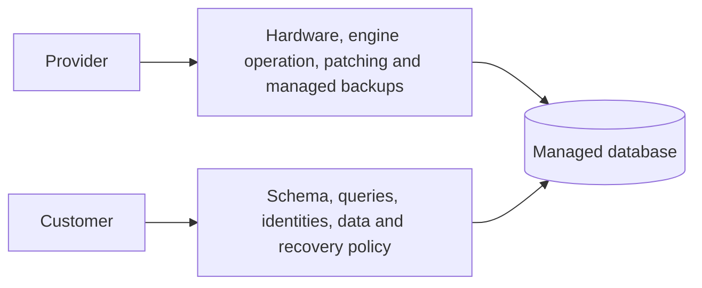
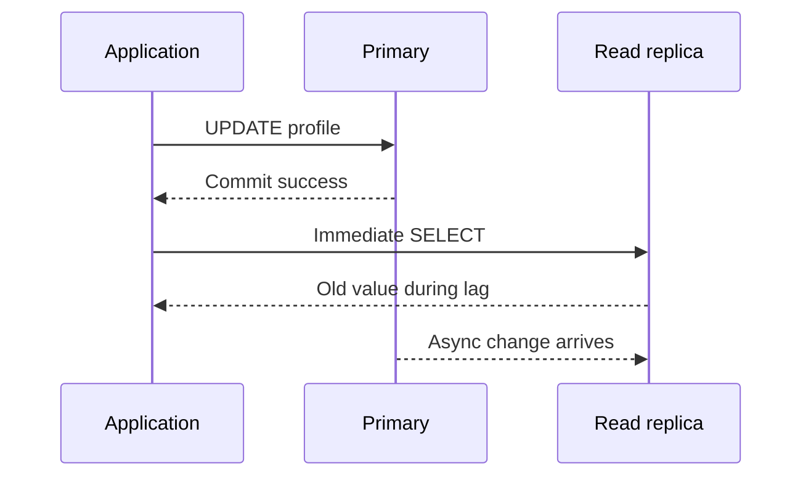
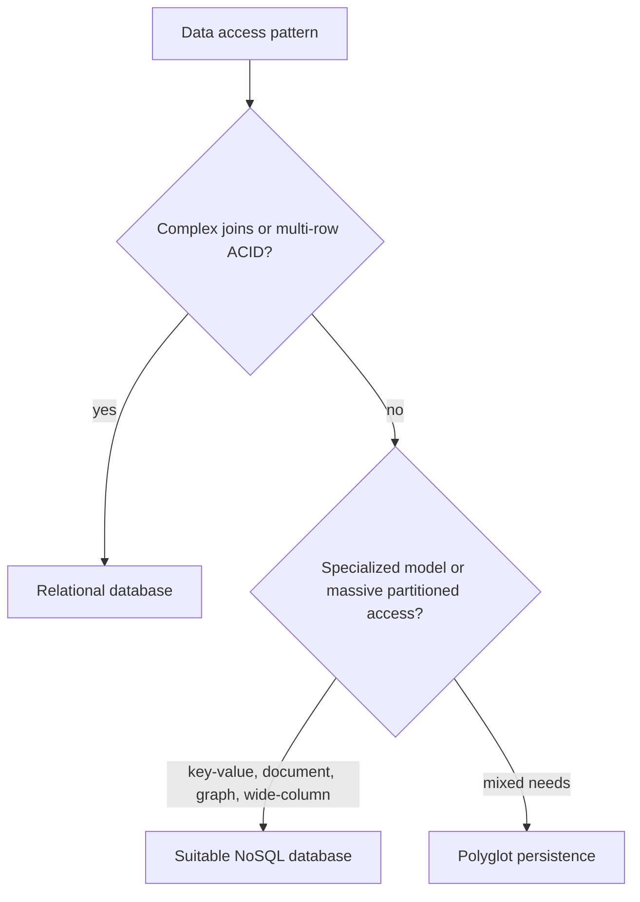
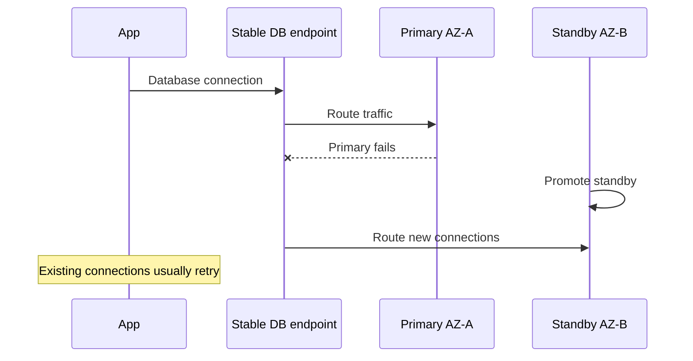
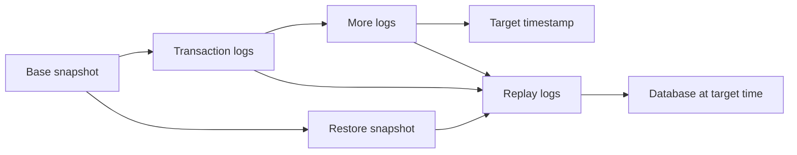
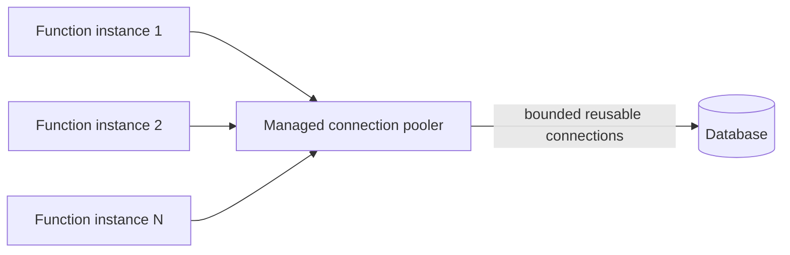
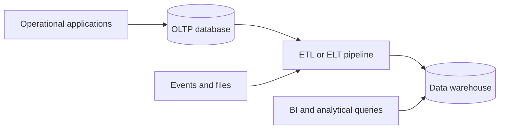

## 25. What are the benefits of a managed database service, and what do you still have to manage yourself?

**Managed Database Service** (যেমন AWS RDS, Aurora, Google Cloud SQL, Azure SQL Database, MongoDB Atlas) হলো এমন একটা service যেখানে cloud provider database software-এর **infrastructure এবং routine operational task**-গুলো handle করে দেয়, আর user শুধু database ব্যবহার এবং data নিয়েই focus করতে পারে।

#### Managed Database Service-এর মূল সুবিধা:

- **Automated backup ও point-in-time recovery:** নিয়মিত backup ও transaction log রাখা হয়; configured retention window এবং latest-restorable-time সীমার মধ্যে point-in-time restore করা যায়। Exact granularity ও recovery lag provider/engine অনুযায়ী ভিন্ন। Restore drill এখনও customer-এর দায়িত্ব।

- **Automatic patching ও version upgrade:** Database engine-এর security patch, minor version update automatically (বা নির্দিষ্ট maintenance window-এ) apply হয়ে যায়, যা manual patch management-এর ঝামেলা এবং vulnerability risk কমায়।

- **High availability ও automatic failover:** Multi-AZ deployment configure করলে, primary database instance fail করলে provider automatically একটা standby replica-তে failover করে দেয় (সাধারণত কয়েক মিনিটের মধ্যে), কোনো manual intervention ছাড়াই।

- **Automated monitoring ও alerting:** Built-in monitoring dashboard, performance metrics (CPU, memory, IOPS, connection count), এবং alert/notification system থাকে, যা আলাদা করে monitoring tool setup করার দরকার কমায়।

- **Easy scaling:** Compute (CPU/RAM) বা storage scale up/down করা অনেক সহজ — সাধারণত কয়েকটা click বা API call-এই vertical scaling সম্ভব, এবং read replica যোগ করে horizontal read scaling-ও সহজে করা যায়।

- **Built-in security features:** Encryption at rest/in transit, IAM integration, network isolation (VPC-এর মধ্যে) সহজে enable করা যায়, প্রায়ই default configuration-এই কিছু security best practice built-in থাকে।

- **Reduced operational overhead:** OS-level maintenance, hardware provisioning, storage management — এসব provider handle করে, ফলে DevOps/DBA team-এর সময় বাঁচে এবং তারা higher-level কাজে (query optimization, schema design) focus করতে পারে।

### তারপরও যা নিজে Manage করতে হয়:

- **Schema design ও data modeling:** Table structure, relationship, normalization/denormalization strategy — এটা সম্পূর্ণভাবে application/business logic-নির্ভর, provider এটা করে দেয় না।

- **Query optimization ও indexing:** Slow query identify করা, proper index তৈরি করা, query plan analyze করা — এসব এখনও user/DBA-কেই করতে হয়। Managed service শুধু infrastructure দেয়, query performance tuning না।

- **Access control ও IAM policy:** কে কোন database/table-এ কী permission পাবে, সেটা define এবং maintain করা user-এর দায়িত্ব — provider শুধু mechanism (IAM, database user/role) দেয়, policy design না।

- **Capacity planning:** কতটা compute/storage/IOPS দরকার হবে ভবিষ্যতে, সেটা traffic pattern দেখে অনুমান করে সঠিক instance type/storage size বেছে নেওয়া এখনও user-এর কাজ (যদিও কিছু service-এ auto-scaling সাহায্য করে)।

- **Application-level connection management:** Connection pooling, retry logic, timeout handling — এগুলো application code-এর মধ্যেই implement করতে হয়, database service নিজে থেকে এটা করে দেয় না।

- **Data migration ও versioning:** Schema migration script লেখা, data migrate করা, backward compatibility maintain করা — এসব user-এর দায়িত্ব (যদিও tool available থাকে সাহায্যের জন্য)।

- **Cost optimization:** সঠিক instance size, storage tier, reserved capacity বেছে নেওয়া, unused resource clean up করা — এসব active monitoring এবং decision-making user-কেই করতে হয়।

- **Application-specific backup/retention policy:** Backup তো automated, কিন্তু কোন data কতদিন রাখতে হবে (regulatory/business requirement অনুযায়ী), সেই policy define করা user-এর দায়িত্ব।

### What operational burden does it remove versus self-hosting?

Self-hosted database-এ (নিজের VM/on-premises server-এ database চালানো) নিচের কাজগুলো সম্পূর্ণভাবে নিজে করতে হতো, যা managed service দূর করে দেয়:

- **OS ও hardware management:** Server provisioning, OS installation, kernel/OS patching, hardware failure handling — সম্পূর্ণভাবে provider handle করে।
- **Database software installation ও configuration:** Database engine install করা, initial configuration tune করা, replication manually setup করা — managed service-এ এটা কয়েক click-এ হয়ে যায়।
- **Manual backup scripting ও testing:** নিজে cron job লিখে backup নেওয়া, backup storage manage করা, restore process test করা — সব automated হয়ে যায়।
- **Manual failover orchestration:** Primary fail করলে নিজে script/process দিয়ে standby-কে promote করা, DNS/connection string update করা — এটা automatic হয়ে যায় managed service-এ।
- **24/7 on-call monitoring infrastructure তৈরি করা:** নিজে monitoring stack (Prometheus, Grafana ইত্যাদি) বসানো এবং maintain করা প্রয়োজন হতো, এখন built-in dashboard/alerting পাওয়া যায়।
- **Security patching cycle maintain করা:** নিয়মিত manually vulnerability check করে patch apply করা, downtime schedule করা — automated হয়ে যায়।
- **Disaster recovery infrastructure নিজে বানানো:** Cross-region replication, DR site setup — নিজে থেকে জটিল architecture বানানোর বদলে built-in feature হিসেবে enable করা যায়।

সংক্ষেপে, managed database service **"undifferentiated heavy lifting"** — অর্থাৎ যেসব কাজ business value তৈরি করে না কিন্তু করতেই হয় (patching, backup, failover, hardware management) — সেগুলো দূর করে দেয়, যাতে team **data modeling, query optimization, এবং application logic**-এর মতো সরাসরি business value যোগ করে এমন কাজে সময় দিতে পারে।

## 26. What is a read replica, and what is replication lag?

**Read Replica:** এটা একটা primary/master database-এর একটা **copy**, যেটা primary থেকে data automatically replicate করে নিজেকে সবসময় update রাখে। Read replica সাধারণত শুধুমাত্র **read query** (SELECT) handle করার জন্য ব্যবহৃত হয়, write operation (INSERT/UPDATE/DELETE) primary database-এই করতে হয়। এর মূল উদ্দেশ্য হলো **read traffic-কে distribute করা** — একটা single primary database-এর উপর সব load না দিয়ে, একাধিক replica-তে read query ছড়িয়ে দিয়ে overall throughput বাড়ানো এবং primary database-এর load কমানো।

**Replication Lag:** Primary database-এ কোনো write operation হওয়ার পর, সেই change replica-তে **propagate/sync** হতে যে সময় লাগে, সেটাই replication lag। যেহেতু বেশিরভাগ read replica **asynchronous replication** ব্যবহার করে (performance-এর কারণে), তাই primary-তে write হওয়া এবং replica-তে সেটা reflect হওয়ার মধ্যে একটা সময়ের **gap (কয়েক মিলিসেকেন্ড থেকে সেকেন্ড, কখনো কখনো বেশি)** থাকে।

### How can replication lag cause stale reads, and how do you mitigate it?

যদি কোনো application:
1. প্রথমে primary database-এ একটা write করে (যেমন user profile update করে),
2. এবং তারপর সাথে সাথেই সেই data একটা **read replica** থেকে read করার চেষ্টা করে (যেমন updated profile দেখানোর জন্য),

তাহলে যদি সেই write টা এখনো replica-তে replicate না হয়ে থাকে (replication lag-এর কারণে), user **পুরনো (stale) data** দেখতে পাবে — যেন update-টাই হয়নি। এই সমস্যা বিশেষত **read-after-write consistency** প্রয়োজন এমন scenario-তে সমস্যাজনক — যেমন user কোনো form submit করার সাথে সাথেই confirmation page-এ সেই updated data দেখতে চাইছে।

### Replication Lag কীভাবে Mitigate করবেন?

- **Read-after-write critical path-এ primary থেকে read করা:** যেসব operation-এ সাথে সাথেই সদ্য-লেখা data দেখানো জরুরি (যেমন user নিজের সদ্য করা update দেখছে), সেই read গুলো replica-এর বদলে **সরাসরি primary database** থেকে করা — অন্তত সেই নির্দিষ্ট session/request-এর জন্য।

- **Session-based routing (sticky session):** নির্দিষ্ট সময় ধরে (যেমন ৫-১০ সেকেন্ড, write-এর পরপরই) একই user-এর সব read request primary-তে বা একই replica-তে route করা, যতক্ষণ না নিশ্চিত হয় replication সম্পন্ন হয়েছে।

- **Replication lag monitor করা এবং threshold set করা:** Application/load balancer-কে replica-এর lag metric monitor করতে দেওয়া, এবং যদি কোনো replica-এর lag একটা নির্দিষ্ট threshold-এর বেশি হয়ে যায়, তাহলে সেই replica-কে সাময়িকভাবে traffic routing থেকে বাদ দেওয়া।

- **Synchronous replication ব্যবহার করা (যেখানে critical):** যেসব critical workload-এ zero data loss/lag একদম acceptable না, সেখানে asynchronous-এর বদলে synchronous replication ব্যবহার করা যায় — যদিও এতে write latency বেড়ে যায় (trade-off)।

- **Causal consistency/versioning ব্যবহার করা:** কিছু advanced system-এ একটা "version token" বা timestamp সাথে পাঠানো হয়, এবং replica-কে বলা হয় যে সেই version-এর data না পাওয়া পর্যন্ত response না দিতে, বা fallback করে primary থেকে read করতে।

- **Application design-এ eventual consistency মেনে নেওয়া (যেখানে সম্ভব):** যেসব ক্ষেত্রে সাথে সাথেই সর্বশেষ data দেখানো critical না (যেমন analytics dashboard, social media feed), সেখানে সামান্য staleness acceptable ধরে নিয়ে replica ব্যবহার চালিয়ে যাওয়া — trade-off হিসেবে performance-এর সুবিধা নেওয়া।

---

## 27. When would you choose a relational database over NoSQL, or vice versa?

#### Relational Database (RDBMS) বেছে নেওয়া উচিত যখন:

- **Data-এর মধ্যে জটিল relationship থাকে:** Multiple entity-র মধ্যে complex relationship (foreign key, join) থাকলে — যেমন e-commerce-এ order, customer, product, inventory-এর মধ্যে সম্পর্ক।
- **Strong consistency ও ACID transaction প্রয়োজন:** যেখানে data integrity অত্যন্ত জরুরি — যেমন banking/financial system, যেখানে একটা transaction পুরোপুরি সম্পন্ন হবে অথবা একদমই হবে না (atomicity)।
- **Schema stable এবং well-defined:** Data structure আগে থেকে জানা এবং সময়ের সাথে খুব একটা পরিবর্তন হবে না।
- **Complex query ও reporting দরকার:** SQL-এর মাধ্যমে জটিল query, aggregation, multi-table join, ad-hoc reporting করতে হবে।

#### NoSQL বেছে নেওয়া উচিত যখন:

- **Massive scale ও high throughput দরকার:** যেখানে horizontal scaling (অনেক server জুড়ে data distribute করা) প্রয়োজন — যেমন social media platform, IoT sensor data, real-time analytics।
- **Flexible/evolving schema:** Data structure ঘন ঘন পরিবর্তন হয় বা প্রতিটা record-এর ভিন্ন field থাকতে পারে (যেমন product catalog যেখানে বিভিন্ন category-র product-এর ভিন্ন attribute থাকে) — Document DB (MongoDB) এক্ষেত্রে সুবিধাজনক।
- **Specific data model প্রয়োজন:** 
  - **Key-Value** (Redis, DynamoDB) — দ্রুত lookup, caching, session storage।
  - **Document** (MongoDB) — semi-structured, nested data।
  - **Wide-column** (Cassandra) — huge volume, time-series data, high write throughput।
  - **Graph** (Neo4j) — highly interconnected data, যেমন social network, recommendation engine।
- **Eventual consistency acceptable:** যেখানে সাথে সাথেই সব node-এ consistent data দেখা critical না (CAP theorem অনুযায়ী availability/partition tolerance-কে priority দেওয়া)।

**সংক্ষেপে:** Relational DB → structured, relational, transactional, consistency-critical data-এর জন্য। NoSQL → large-scale, flexible-schema, high-velocity, horizontally-scalable workload-এর জন্য। বাস্তবে অনেক system **polyglot persistence** ব্যবহার করে — একই application-এ বিভিন্ন প্রয়োজনের জন্য বিভিন্ন database ব্যবহার করা (যেমন transactional data-এর জন্য PostgreSQL, caching-এর জন্য Redis, search-এর জন্য Elasticsearch)।

### How does partition key design affect performance?

NoSQL database-এ (বিশেষত DynamoDB, Cassandra-এর মতো distributed system-এ) **partition key** নির্ধারণ করে data physically কোন node/partition-এ store হবে। এই design সরাসরি performance-কে গভীরভাবে প্রভাবিত করে:

- **Data distribution/uniformity:** যদি partition key ভালোভাবে design করা হয় (high cardinality, uniformly distributed values), data সব partition-এ সমানভাবে ছড়িয়ে যায়, ফলে read/write load-ও সব node-এ evenly distribute হয় — এটা optimal performance দেয়।

- **Hot partition problem:** যদি partition key খারাপভাবে বাছাই করা হয় — যেমন কম cardinality-র field ব্যবহার করা (যেমন `status: active/inactive` মাত্র দুটো value), বা এমন key যেখানে বেশিরভাগ traffic একটাই value-তে concentrate হয় (যেমন সব user-এর জন্য same `date` key ব্যবহার করা কোনো time-series data-তে) — তাহলে একটা মাত্র partition/node-এই বেশিরভাগ request যায়, যা সেই node-কে overload করে দেয় (**hot partition**), অথচ বাকি node গুলো idle থাকে। এতে overall throughput কমে যায় এবং latency বেড়ে যায়, even যদি cluster-এ যথেষ্ট total capacity থাকে।

- **Query pattern-এর সাথে alignment:** Partition key এমনভাবে design করা উচিত যাতে বেশিরভাগ common query একটা মাত্র partition-এ hit করে যায় (efficient), বরং পুরো cluster জুড়ে scan করার (scatter-gather, যা ধীর এবং resource-intensive) দরকার না হয়। যেমন, যদি বেশিরভাগ query "একটা নির্দিষ্ট user-এর সব order" চায়, তাহলে `user_id`-কে partition key হিসেবে ব্যবহার করলে সেই query একটা partition-এই efficient ভাবে সম্পন্ন হবে।

- **Composite key ব্যবহার (partition key + sort key):** অনেক NoSQL DB-তে (যেমন DynamoDB) একটা **composite primary key** ব্যবহার করা যায় — partition key দিয়ে data distribute করা, আর sort key দিয়ে সেই partition-এর মধ্যে data order/range query করা। যেমন `user_id` (partition key) + `order_timestamp` (sort key) — এতে একটা user-এর সব order দ্রুত পাওয়া যায়, এবং সেগুলো time অনুযায়ী range query-ও করা যায়, অথচ overall data cluster জুড়ে ভালোভাবে distributed থাকে।

- **Scalability-র উপর দীর্ঘমেয়াদী প্রভাব:** ভুল partition key design শুরুতে নাও ধরা পড়তে পারে (কম data থাকলে), কিন্তু data ও traffic বাড়ার সাথে সাথে hot partition সমস্যা প্রকট হয়ে ওঠে, এবং তখন এটা fix করা (existing data re-partition/migrate করা) অনেক costly এবং জটিল একটা কাজ হয়ে দাঁড়ায় — তাই শুরুতেই সঠিক partition key strategy পরিকল্পনা করা গুরুত্বপূর্ণ।

সংক্ষেপে, ভালো partition key design **even load distribution, efficient querying, এবং horizontal scalability**-র মূল ভিত্তি — এটা ভুল হলে পুরো distributed database-এর performance এবং scalability মারাত্মকভাবে ক্ষতিগ্রস্ত হতে পারে, এমনকি অসংখ্য node থাকা সত্ত্বেও।

## 28. How does database high availability (multi-AZ, failover) work?

**Multi-AZ deployment** হলো database high availability achieve করার একটা common architecture, যেখানে একটা **primary database instance** একটা Availability Zone (AZ)-এ থাকে, এবং একটা **standby replica** ভিন্ন একটা AZ-এ (একই region-এর মধ্যে, কিন্তু আলাদা physical data center)-এ রাখা হয়।

এটা কীভাবে কাজ করে:

- **Synchronous replication:** Primary থেকে standby-তে data সাধারণত **synchronously replicate** করা হয় — অর্থাৎ primary-তে যেকোনো write commit হওয়ার আগে standby-তেও সেটা write হয়ে যেতে হয় (নির্দিষ্ট configuration-এর উপর নির্ভর করে)। এতে zero (বা near-zero) data loss নিশ্চিত হয়।

- **Continuous health monitoring:** Database service নিয়মিতভাবে primary instance-এর health monitor করে — instance status, storage status, network connectivity, ইত্যাদি check করা হয়।

- **Automatic failure detection:** যদি primary instance fail করে (hardware failure, AZ outage, storage issue, বা manual maintenance-এর কারণে), monitoring system সেটা detect করে।

- **Automatic failover:** Failure detect হওয়ার পর, provider automatically standby replica-কে **নতুন primary** হিসেবে **promote** করে। এই পুরো প্রক্রিয়া সাধারণত **৬০-১২০ সেকেন্ডের মধ্যে** সম্পন্ন হয় (provider ভেদে ভিন্ন হতে পারে)।

- **DNS/Endpoint switch:** Failover-এর সময়, database-এর **connection endpoint (DNS name/CNAME)** পরিবর্তন করে নতুন primary-এর IP-তে point করানো হয় — application-কে কোনো connection string পরিবর্তন করতে হয় না, কারণ endpoint একই থাকে, শুধু ভিতরে target IP পরিবর্তন হয়।

- **New standby তৈরি:** Failover-এর পর, provider automatically একটা নতুন standby replica তৈরি করে দেয় (আগের primary-এর জায়গায় বা অন্য কোনো healthy AZ-এ), যাতে system আবার fully redundant অবস্থায় ফিরে আসে।

###  What happens to open connections during a failover event?

Failover ঘটার সময় open connection-গুলোর সাথে সাধারণত যা ঘটে:

- **Connection drop হয়ে যায়:** Failover-এর মুহূর্তে সব existing/active database connection **abruptly terminate/drop** হয়ে যায়, কারণ underlying primary instance পরিবর্তন হচ্ছে এবং সেই TCP connection আর valid থাকে না। এই কয়েক সেকেন্ডের window-এ database সাময়িকভাবে **unavailable** থাকে।

- **In-flight transaction fail হতে পারে:** যদি কোনো transaction failover-এর সময় চলমান অবস্থায় থাকে (commit হয়নি), সেটা fail/rollback হয়ে যেতে পারে — application-কে সেই transaction retry করতে হবে।

- **DNS TTL এবং caching সমস্যা:** যদিও endpoint DNS নতুন primary-তে point করে দেওয়া হয়, কিছু client/connection pool পুরনো IP **cache** করে রাখতে পারে (DNS TTL অনুযায়ী), ফলে সাময়িকভাবে কিছু client পুরনো (এখন অকার্যকর) IP-তে connect করার চেষ্টা করতে পারে যতক্ষণ না তারা নতুন IP resolve করে।

- **Application-level reconnection logic প্রয়োজন:** এই কারণে application-এ **robust retry এবং reconnection logic** থাকা অত্যন্ত জরুরি — যেমন exponential backoff দিয়ে retry করা, connection pool-কে failed connection detect করে নতুন connection তৈরি করতে বাধ্য করা।

- **Connection pooling/driver support:** অনেক modern database driver এবং connection pooling library (যেমন JDBC-এর retry mechanism) failover-aware — তারা automatically failed connection detect করে নতুন connection request করে, যা application developer-এর জন্য এই জটিলতা কিছুটা কমায়।

- **Read replica-তে সাময়িক inconsistency:** যদি অন্য read replica থাকে (Multi-AZ standby ছাড়াও), সেগুলোও সাময়িকভাবে নতুন primary-এর সাথে re-sync হতে কিছুটা সময় নিতে পারে।

সংক্ষেপে, Multi-AZ failover **data loss prevent করে (synchronous replication-এর কারণে) এবং downtime কমায় (automatic detection ও promotion দিয়ে)**, কিন্তু এটা সম্পূর্ণভাবে **zero-downtime/zero-disruption** না — application-কে অবশ্যই connection failure handle করার জন্য প্রস্তুত থাকতে হবে।

---

## 29. What is the difference between snapshot backup and continuous backup? What is point-in-time recovery?

**Snapshot Backup:** এটা database/storage-এর একটা **নির্দিষ্ট মুহূর্তের (point-in-time) সম্পূর্ণ copy**, যা নির্দিষ্ট **interval**-এ (যেমন প্রতিদিন একবার, বা প্রতি ৬ ঘণ্টায়) নেওয়া হয়। দুটো snapshot-এর মধ্যবর্তী সময়ের কোনো change যদি data loss ঘটে, সেটা recover করা যায় না — শুধুমাত্র সর্বশেষ snapshot পর্যন্ত data restore করা সম্ভব।

**Continuous Backup:** এখানে শুধু periodic snapshot না নিয়ে, database-এর **transaction log/write-ahead log (WAL)** ক্রমাগতভাবে (continuously) capture এবং store করা হয় — প্রতিটা write operation-ই effectively backup-এ record হয়ে যায়, real-time-এর কাছাকাছি একটা granularity-তে।

#### Point-in-Time Recovery (PITR) কী?

**Point-in-Time Recovery** হলো একটা feature যা আপনাকে database-কে **অতীতের যেকোনো নির্দিষ্ট মুহূর্তের (second-level granularity পর্যন্ত)** অবস্থায় restore করতে দেয় — শুধু নির্দিষ্ট snapshot time-এ না, বরং দুই snapshot-এর মাঝামাঝি যেকোনো সময়েও। এটা সাধারণত কাজ করে একটা **base snapshot** নিয়ে, তারপর সেই snapshot-এর পর থেকে সব **transaction log/WAL entry** sequentially **replay** করে, যতক্ষণ না চাওয়া নির্দিষ্ট timestamp পর্যন্ত পৌঁছায়।

উদাহরণ: যদি কোনো ভুলবশত DELETE query চালানো হয়ে থাকে দুপুর ২:৪৭ মিনিটে, PITR দিয়ে database-কে দুপুর ২:৪৬:৫৯-এর অবস্থায় (ঠিক সেই ভুল query চালানোর আগ মুহূর্তে) restore করা যায় — একটা পুরো দিনের snapshot হারানোর দরকার নেই।

### How does continuous backup enable a lower RPO than periodic snapshots?

**RPO (Recovery Point Objective)** বোঝায় — কোনো disaster/failure হলে, সর্বোচ্চ কতটুকু data loss হওয়া acceptable (অর্থাৎ শেষ backup point থেকে failure-এর মুহূর্ত পর্যন্ত সময়ের data হারানোর ঝুঁকি)।

- **Periodic Snapshot-এ RPO বেশি (খারাপ):** যদি snapshot প্রতি ২৪ ঘণ্টায় একবার নেওয়া হয়, এবং failure ঘটে পরবর্তী snapshot নেওয়ার ঠিক আগে, তাহলে **সর্বোচ্চ ২৪ ঘণ্টার data হারিয়ে যেতে পারে** — কারণ সর্বশেষ snapshot-এর পর থেকে যা কিছু change হয়েছে, তার কোনো record নেই। RPO এখানে backup interval-এর সমান বা তার কাছাকাছি।

- **Continuous Backup-এ RPO অনেক কম (ভালো):** যেহেতু প্রতিটা transaction/write log continuously capture হচ্ছে (প্রায় real-time-এ, সাধারণত কয়েক সেকেন্ড থেকে কয়েক মিনিটের মধ্যে transaction log storage-এ ship হয়ে যায়), তাই failure ঘটলেও শুধু সেই সাম্প্রতিকতম, এখনো-log-না-হওয়া কয়েক সেকেন্ড/মিনিটের data-ই হারানোর ঝুঁকি থাকে। এতে RPO সেকেন্ড বা কয়েক মিনিটের মধ্যে নেমে আসে, যেখানে snapshot-based approach-এ এটা ঘণ্টা বা দিনের মধ্যে থাকত।

**সংক্ষেপে:**
| বিষয় | Snapshot Backup | Continuous Backup |
|---|---|---|
| Backup granularity | নির্দিষ্ট interval-এ (যেমন daily) | Continuous (transaction log ভিত্তিক) |
| RPO | বেশি (backup interval-এর সমান) | কম (সেকেন্ড/মিনিট) |
| Recovery granularity | শুধু snapshot timestamp-এ | যেকোনো second-level timestamp-এ (PITR) |
| Storage overhead | কম (শুধু periodic full copy) | তুলনামূলক বেশি (continuous log storage) |
| জটিলতা | সহজ, straightforward | তুলনামূলক জটিল (base + log replay mechanism) |

মূলত, continuous backup একটা base snapshot এবং তারপর অবিচ্ছিন্ন transaction log-এর সমন্বয়ে কাজ করে বলেই এটা **granular, near-continuous recovery point** দিতে পারে — যেখানে শুধু periodic snapshot-এ recovery point গুলোর মধ্যে বড় বড় "gap" থেকে যায়, যেটার মধ্যে ঘটা যেকোনো change permanently হারিয়ে যাওয়ার ঝুঁকিতে থাকে।

## 30. Why is connection pooling important, especially with serverless functions? How do managed poolers help?

**Connection Pooling** হলো একটা technique যেখানে database-এর সাথে একবার connection তৈরি করে সেটাকে একটা **pool**-এ রেখে দেওয়া হয়, এবং নতুন query আসলে প্রতিবার নতুন connection তৈরি না করে সেই pool থেকে একটা **reusable connection** ব্যবহার করা হয়, কাজ শেষে সেটা আবার pool-এ ফেরত যায়।

Connection pooling গুরুত্বপূর্ণ কারণ:

- **Connection তৈরি করা expensive:** একটা নতুন database connection establish করা (TCP handshake, authentication, SSL negotiation) একটা তুলনামূলক **costly এবং time-consuming** operation — এটা বারবার করলে overall latency এবং resource usage বাড়ে।
- **Database-এর connection limit সীমিত:** প্রতিটা database instance-এর একটা **maximum concurrent connection limit** থাকে (memory ও CPU resource-এর কারণে)। এই limit ছাড়িয়ে গেলে database নতুন connection reject করা শুরু করে, এবং application error পেতে শুরু করে।

### Serverless Function-এর সাথে এটা কেন বিশেষভাবে গুরুত্বপূর্ণ?

Serverless architecture-এ (যেমন AWS Lambda, Google Cloud Functions) connection pooling একটা **বিশেষ সমস্যা** তৈরি করে, কারণ traditional server-এর মতো এখানে একটা persistent process নেই যেটা connection pool maintain করে রাখবে:

- **প্রতিটা function invocation সম্ভাব্যভাবে নতুন execution environment:** যদি traffic বেশি হয়, cloud provider automatically **অনেকগুলো concurrent function instance** spin up করে দেয় — প্রতিটা instance-এর নিজস্ব execution environment থাকে, এবং যদি প্রতিটা invocation নিজের database connection তৈরি করে, তাহলে হাজার হাজার concurrent invocation মানে **হাজার হাজার simultaneous database connection**।
- **Connection reuse কঠিন:** যেহেতু execution environment ephemeral (স্বল্পস্থায়ী) এবং automatically scale/terminate হয়, তাই traditional in-application connection pool (যেমন একটা persistent server process-এর মধ্যে maintain করা pool) এখানে effectively কাজ করে না — প্রতিটা "cold" invocation নতুন connection তৈরি করতে বাধ্য হয়।

### What happens if you don't pool connections in a highly concurrent serverless workload?

- **Database connection exhaustion:** যদি হাজার হাজার concurrent Lambda invocation একসাথে চলে এবং প্রতিটা নিজের database connection তৈরি করে, তাহলে খুব দ্রুত database-এর **maximum connection limit** পৌঁছে যায় (যেমন PostgreSQL-এর default limit প্রায় ১০০-৫০০)।
- **"Too many connections" error:** Limit ছাড়িয়ে গেলে database নতুন connection request **reject** করা শুরু করে, ফলে নতুন Lambda invocation-গুলো fail হতে থাকে — এমনকি legitimate traffic-ও affected হয়।
- **Performance degradation:** প্রতিটা invocation-এ নতুন connection তৈরি করার overhead (handshake, auth) যোগ হওয়ায় প্রতিটা request-এর latency বেড়ে যায়, বিশেষত cold start-এর সাথে মিলে এটা আরও worse হয়ে যায়।
- **Database resource overload:** প্রতিটা connection database-এর memory এবং CPU resource ব্যবহার করে (এমনকি idle থাকলেও), তাই অতিরিক্ত connection database-এর overall performance-কেও খারাপ করে দেয়, যা অন্য legitimate connection-কেও প্রভাবিত করে।
- **Cascading failure:** Database overload হয়ে গেলে existing connection-গুলোও slow/timeout হতে শুরু করতে পারে, যা পুরো system-এ একটা cascading failure তৈরি করতে পারে।

#### Managed Pooler কীভাবে সাহায্য করে?

**Managed connection pooler** (যেমন AWS RDS Proxy, PgBouncer as a managed service, Supabase-এর pooler) হলো একটা **intermediate layer** যা application (Lambda function) এবং actual database-এর মাঝখানে বসে:

- **Centralized connection management:** সব Lambda invocation database-এ সরাসরি connect না করে, pooler-এর সাথে connect করে। Pooler নিজে database-এর সাথে একটা **সীমিত, managed সংখ্যক persistent connection** maintain করে রাখে।
- **Connection multiplexing:** হাজার হাজার client (Lambda) connection-কে pooler অল্প কয়েকটা actual database connection-এর মধ্যে **multiplex** করে দেয় — যখন কোনো client-এর query দরকার, pooler pool থেকে একটা available connection ধার দেয়, কাজ শেষ হলে সেটা আবার pool-এ ফেরত যায়, অন্য client ব্যবহার করতে পারে।
- **Database-কে overload থেকে protect করা:** যেহেতু database শুধু pooler-এর সাথে সীমিত সংখ্যক connection দেখে (হাজার হাজার Lambda সরাসরি না), তাই connection limit exhaustion-এর ঝুঁকি দূর হয়।
- **Faster connection acquisition:** Lambda function-এর জন্য pooler থেকে connection পাওয়া, সরাসরি database-এ নতুন connection তৈরি করার চেয়ে অনেক দ্রুত, কারণ pooler ইতিমধ্যে warm connection maintain করে রাখে।
- **Automatic scaling ও failover handling:** কিছু managed pooler automatically traffic অনুযায়ী scale করে এবং database failover-এর সময় connection routing smooth ভাবে handle করে, application-কে সেই জটিলতা থেকে মুক্ত রাখে।

সংক্ষেপে, managed pooler serverless-এর "many ephemeral clients, few database connections" সমস্যার সমাধান দেয় — এটা database-কে protect করে, connection overhead কমায়, এবং overall system-কে অনেক বেশি scalable ও resilient করে তোলে।

---

## 31. What is a data warehouse, and how is it different from an OLTP database?

**Data Warehouse** হলো একটা centralized repository যেখানে বিভিন্ন উৎস (multiple source system) থেকে আসা বড় পরিমাণ **historical, structured data** একত্রিত করে রাখা হয়, মূলত **analytical query, reporting, এবং business intelligence (BI)**-এর উদ্দেশ্যে। উদাহরণ: **Amazon Redshift, Google BigQuery, Snowflake, Azure Synapse**।

**OLTP (Online Transaction Processing) Database** হলো traditional relational database যা **day-to-day, real-time transactional operation** handle করার জন্য ডিজাইন করা — যেমন e-commerce order placement, banking transaction, user registration। উদাহরণ: **PostgreSQL, MySQL, Oracle**।

#### মূল পার্থক্য (OLTP vs. OLAP/Data Warehouse):

| বিষয় | OLTP Database | Data Warehouse (OLAP) |
|---|---|---|
| **উদ্দেশ্য** | Real-time transaction processing | Historical data analysis, reporting |
| **Query pattern** | ছোট, frequent, simple query (single row read/write) | বড়, complex query (aggregation, multi-table join, বিশাল data scan) |
| **Data volume per query** | অল্প (কয়েকটা row) | বিশাল (millions/billions of row) |
| **Schema design** | Normalized (redundancy কমানো, storage efficiency) | Denormalized (star/snowflake schema — query performance-এর জন্য optimized) |
| **Data freshness** | Real-time, up-to-date | সাধারণত batch/periodic ভাবে load করা (কিছুটা delay থাকতে পারে) |
| **Read vs. Write ratio** | Read এবং Write উভয়ই ঘন ঘন (balanced) | মূলত Read-heavy (write সাধারণত bulk ETL load-এর মাধ্যমে হয়) |
| **Data structure** | Current, transactional state | Historical, time-series, aggregated data |
| **Storage engine optimization** | Row-based storage (single record দ্রুত access-এর জন্য) | Column-based storage (aggregation/analytical query-র জন্য optimized) |

### Why are OLAP workloads typically separated from OLTP systems?

- **Resource contention এড়ানো:** OLAP query (বড় aggregation, full table scan) অনেক বেশি CPU, memory, এবং I/O resource ব্যবহার করে, এবং সম্পন্ন হতে অনেক সময় (সেকেন্ড থেকে মিনিট) নিতে পারে। যদি এই ধরনের heavy query একই database-এ চালানো হয় যেখানে OLTP transaction চলছে, তাহলে সেটা OLTP-এর performance-কে গুরুতরভাবে **degrade** করে দিতে পারে — real-time transaction (যেমন checkout process) ধীর হয়ে যেতে পারে, এমনকি timeout হয়ে যেতে পারে।

- **ভিন্ন optimization requirement:** OLTP database **row-based storage**-এ optimize করা থাকে (দ্রুত single-record read/write-এর জন্য), যেখানে OLAP **column-based storage**-এ optimize করা হয় (নির্দিষ্ট column-এর উপর বিশাল aggregation দ্রুত করার জন্য)। এই দুই ধরনের workload-এর জন্য একই database engine/architecture দিয়ে একসাথে সর্বোচ্চ performance পাওয়া কঠিন — তাই আলাদা, specialized system ব্যবহার করা হয়।

- **Locking ও concurrency issue:** OLTP database-এ transaction-এর জন্য row-level locking ব্যবহৃত হয় consistency বজায় রাখতে। যদি একই সময়ে কোনো বড় analytical query চলে (যেটা অনেক row scan/lock করতে পারে), সেটা OLTP transaction-কে block করে দিতে পারে, deadlock বা significant delay তৈরি করতে পারে।

- **Schema design conflict:** OLTP-এর normalized schema (data redundancy কমানোর জন্য অনেকগুলো ছোট table এবং join) analytical query-র জন্য অদক্ষ (কারণ বহু table join করতে হয়), যেখানে data warehouse-এর denormalized schema (star schema) analytical query দ্রুত করার জন্য designed, কিন্তু এটা transactional write-এর জন্য অদক্ষ (redundancy বেশি, update anomaly-র ঝুঁকি)। এই দুই বিপরীতমুখী design goal একসাথে একটা system-এ optimize করা কঠিন।

- **Scalability এবং cost optimization:** OLTP system-কে সাধারণত high-availability, low-latency-এর জন্য optimize করা হয়, যেখানে data warehouse-কে **massive parallel processing (MPP)** architecture দিয়ে বিশাল data scan efficiently করার জন্য design করা হয় — এদের infrastructure requirement সম্পূর্ণ ভিন্ন, তাই আলাদা রাখলে প্রতিটা system তার নিজস্ব workload-এর জন্য সর্বোত্তমভাবে scale এবং cost-optimize করা যায়।

- **ETL/data pipeline-এর মাধ্যমে সংযোগ:** সাধারণত একটা **ETL (Extract, Transform, Load)** বা ELT process ব্যবহার করে OLTP system থেকে data periodically (বা near-real-time streaming দিয়ে) extract করে data warehouse-এ load করা হয় — এতে দুই system স্বাধীনভাবে নিজের কাজের জন্য optimize থাকতে পারে, অথচ analytical insight পাওয়ার জন্য প্রয়োজনীয় data warehouse-এ available থাকে।

সংক্ষেপে, OLTP এবং OLAP-এর **workload characteristic, optimization goal, এবং resource requirement সম্পূর্ণ ভিন্ন** — একটাকে অন্যটার সাথে মিশিয়ে ফেললে উভয়ের performance এবং reliability-ই ক্ষতিগ্রস্ত হয়, তাই আলাদা রাখাই best practice।
