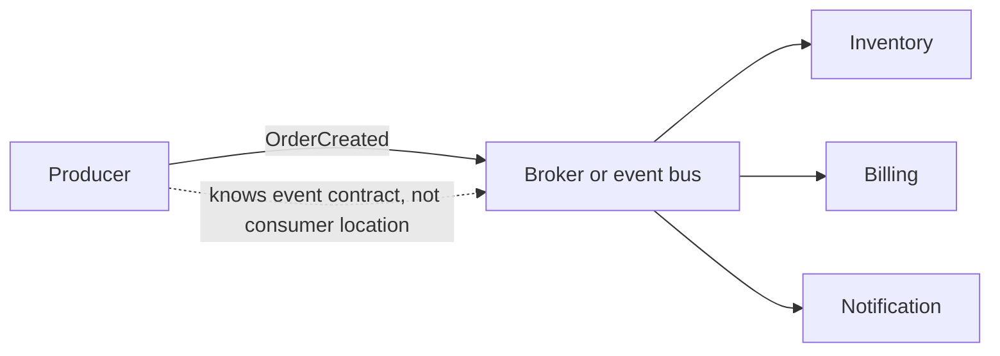
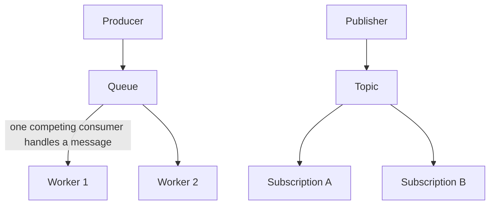
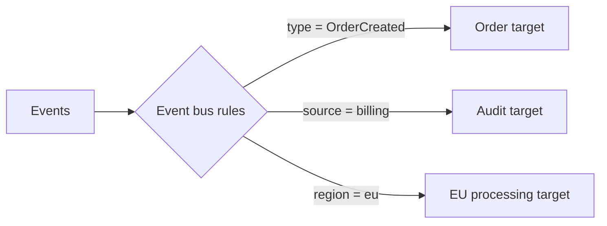
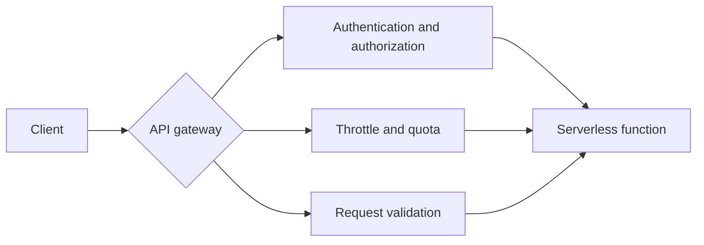
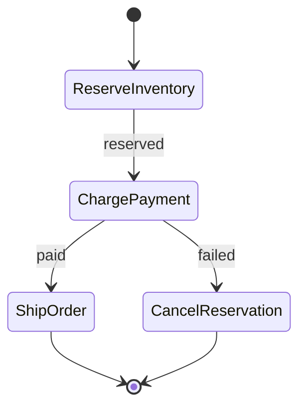

## 42. What is event-driven architecture, and how does it decouple producers and consumers?

**Event-Driven Architecture (EDA)** হলো একটা software design paradigm যেখানে system-এর বিভিন্ন component **event** (কোনো কিছু ঘটার notification, যেমন "OrderCreated", "PaymentProcessed", "UserRegistered") তৈরি এবং প্রক্রিয়া করার মাধ্যমে একে অপরের সাথে communicate করে, সরাসরি একে অপরকে call না করে। এখানে মূলত তিনটা component থাকে:

- **Producer (Event Publisher):** যে component event তৈরি করে এবং একটা **event broker/message queue**-তে পাঠিয়ে দেয় (যেমন Kafka, SQS, SNS, EventBridge)।
- **Event Broker/Message Queue:** Event গুলো receive করে, store করে (temporarily বা persistently), এবং interested consumer-দের কাছে deliver করে।
- **Consumer (Event Subscriber):** যে component সেই event-এ **subscribe** করে থাকে এবং event আসলে সেটা অনুযায়ী নিজের logic execute করে।

### এটা কীভাবে Producer এবং Consumer-কে Decouple করে?

- **Producer, Consumer-এর অস্তিত্ব সম্পর্কে জানে না:** Traditional synchronous architecture-এ (যেমন direct API call), Service A-কে জানতে হয় Service B ঠিক কোথায় আছে (endpoint, address), এবং সরাসরি call করতে হয়, সাথে সাথে response-এর জন্য wait করতে হয়। EDA-তে Producer শুধু event টা broker-এ publish করে দেয় — কে (কতগুলো consumer) সেটা receive করবে, বা আদৌ কেউ receive করছে কিনা, Producer-এর সেটা জানার দরকারই নেই।

- **Temporal decoupling (সময়গত স্বাধীনতা):** Producer event পাঠানোর সাথে সাথেই Consumer-এর সেটা process করার দরকার নেই — event broker/queue-তে event টা থেকে যায়, এবং Consumer যখন ready হয় (বা তার নিজস্ব gति অনুযায়ী) তখন সেটা process করে। এটা Producer এবং Consumer-কে **সময়ের দিক থেকেও স্বাধীন** করে দেয়।

- **Multiple consumer সহজে যোগ করা যায়:** একটা event একাধিক consumer subscribe করতে পারে (যেমন "OrderCreated" event-এ একইসাথে Inventory Service, Notification Service, এবং Analytics Service subscribe থাকতে পারে) — Producer-এর কোনো code পরিবর্তন ছাড়াই নতুন consumer যোগ/বাদ দেওয়া যায়। এটা system-কে অনেক বেশি **extensible** করে তোলে।

- **Independent scaling:** যেহেতু Producer এবং Consumer সরাসরি সংযুক্ত না, প্রতিটা component নিজের প্রয়োজন অনুযায়ী independently scale করতে পারে — Consumer slow হলেও Producer block হয়ে যায় না (queue buffer হিসেবে কাজ করে)।

- **Technology/implementation independence:** Producer এবং Consumer সম্পূর্ণ ভিন্ন programming language, technology stack, বা এমনকি ভিন্ন team দিয়ে তৈরি হতে পারে — শুধু event format/contract (schema) মিলে গেলেই হয়, তাদের internal implementation একে অপরের থেকে সম্পূর্ণ স্বাধীন।

### What trade-offs does decoupling introduce (eventual consistency, debugging complexity)?

- **Eventual Consistency:** যেহেতু Consumer গুলো asynchronously event process করে, তাই system-এর বিভিন্ন অংশের data একই সময়ে সবসময় consistent নাও থাকতে পারে। যেমন, "OrderCreated" event publish হওয়ার সাথে সাথেই Inventory Service-এর stock count update নাও হতে পারে — কিছু milliseconds বা seconds-এর জন্য একটা "inconsistency window" থাকে, যেখানে system-এর বিভিন্ন অংশ ভিন্ন ভিন্ন "সত্য" দেখাতে পারে। Application design-কে এই eventual consistency মেনে নিয়েই কাজ করতে হয় — যেমন immediate strong consistency-র বদলে UI-তে "processing..." state দেখানো।

- **Debugging জটিলতা বেড়ে যায়:** Synchronous system-এ একটা request-এর পুরো execution path (call stack) সরাসরি trace করা সহজ। কিন্তু EDA-তে একটা event অনেকগুলো decoupled consumer-এর মধ্য দিয়ে asynchronously flow করে, যাদের execution আলাদা আলাদা সময়ে, আলাদা আলাদা service-এ ঘটে — কোনো bug বা failure হলে সেটা **কোথায়, কেন ঘটল তা track করা কঠিন হয়ে যায়**। এই জন্য **distributed tracing** (যেমন correlation ID, trace ID প্রতিটা event-এ propagate করা), centralized logging, এবং observability tooling আলাদা করে ইনভেস্ট করতে হয়, যা নিজেই একটা অতিরিক্ত operational overhead।

- **Message ordering ও duplication সমস্যা:** অনেক message queue system-এ strict ordering guarantee করা কঠিন (বিশেষত horizontally scaled consumer-এর ক্ষেত্রে), এবং at-least-once delivery guarantee-র কারণে একই event **duplicate** ভাবে process হয়ে যেতে পারে। এর ফলে Consumer-কে **idempotent** (একই event একাধিকবার process হলেও একই ফলাফল আসবে এমন) ভাবে design করতে হয়, যা extra complexity যোগ করে।

- **Error handling ও retry জটিলতা:** যদি কোনো Consumer কোনো event process করতে fail করে, সেটা কীভাবে handle হবে (retry, dead-letter queue, alert) তা আলাদা করে design করতে হয়। Synchronous call-এ error সাথে সাথেই caller-কে জানানো যায়, কিন্তু asynchronous event-এ failure invisible থেকে যেতে পারে যদি proper monitoring/alerting না থাকে।

- **Testing জটিলতা:** পুরো end-to-end flow টেস্ট করা কঠিন হয়ে যায়, কারণ multiple decoupled service একসাথে, asynchronously interact করছে — একটা traditional integration test-এর মতো সহজে পুরো flow simulate করা যায় না, event timing এবং ordering নিয়ে বাড়তি সতর্কতা দরকার হয়।

- **Increased operational overhead:** Event broker/message queue নিজেই একটা অতিরিক্ত infrastructure component, যেটাকে নিজে manage, monitor, এবং scale করতে হয় (যদিও managed service ব্যবহার করলে এই burden অনেকটা কমে যায়)।

**সংক্ষেপে:** Event-driven architecture system-কে অনেক বেশি **flexible, scalable, এবং resilient** করে তোলে producer ও consumer-কে decouple করার মাধ্যমে, কিন্তু এর বিনিময়ে **strong consistency-র নিশ্চয়তা** এবং **সহজ, linear debuggability**-র মতো সুবিধা কিছুটা sacrifice করতে হয় — এটা মূলত একটা **complexity trade-off**: architectural flexibility বনাম operational/cognitive simplicity।

## 43. What is the difference between a message queue and pub/sub?

**Message Queue:** এখানে একটা producer message পাঠায় একটা **queue**-তে, এবং সেই message সাধারণত শুধুমাত্র **একটা consumer** দ্বারা receive এবং process করা হয় (point-to-point model)। একবার কোনো consumer message টা process করে ফেললে (এবং acknowledge করলে), সেই message queue থেকে **মুছে যায়** — অন্য কোনো consumer সেটা আবার পাবে না। যদি একাধিক consumer একই queue-তে listen করে, তাহলে তারা মূলত **load balance** করে message গুলো ভাগ করে নেয় (প্রতিটা message যেকোনো একজন consumer পায়, সবাই না)। উদাহরণ: **Amazon SQS, RabbitMQ (queue mode)**।

**Pub/Sub (Publish/Subscribe):** এখানে publisher একটা **topic**-এ message পাঠায়, এবং সেই topic-এ subscribe করা **প্রতিটা subscriber (consumer)-ই সেই message-এর একটা copy পায়** — এটা one-to-many broadcasting model। একটা message একাধিক independent consumer একসাথে, স্বাধীনভাবে process করতে পারে, একজনের processing অন্যজনকে প্রভাবিত করে না। উদাহরণ: **Amazon SNS, Google Pub/Sub, Kafka (consumer group ছাড়া raw broadcast অর্থে)**।

**সংক্ষেপে:**
| বিষয় | Message Queue | Pub/Sub |
|---|---|---|
| Delivery model | Point-to-point (একটা consumer message পায়) | One-to-many (সব subscriber copy পায়) |
| ব্যবহার | Task distribution, work queue | Event broadcasting, notification fan-out |
| Message consumption-এর পর | Queue থেকে মুছে যায় | প্রতিটা subscriber-এর জন্য আলাদা delivery |
| উদাহরণ | SQS, RabbitMQ | SNS, Google Pub/Sub |

### What is a dead-letter queue, and what is visibility timeout?

**Dead-Letter Queue** হলো একটা বিশেষ, secondary queue যেখানে সেই message গুলো পাঠানো হয় যেগুলো **বারবার process করার চেষ্টা করা সত্ত্বেও fail হচ্ছে** (একটা নির্দিষ্ট **maxReceiveCount/retry limit** ছাড়িয়ে গেলে)। এর উদ্দেশ্য হলো:

- **"Poison pill" message আলাদা করা:** কোনো malformed বা problematic message যদি বারবার consumer-কে crash করায় বা fail করায়, সেটাকে main queue-তে infinite loop-এ আটকে না রেখে DLQ-তে সরিয়ে দেওয়া হয়, যাতে সেটা বাকি normal message processing-কে block না করে।
- **Debugging ও investigation:** DLQ-তে জমে থাকা message গুলো পরে manually inspect করা যায়, কেন সেগুলো fail হলো তা analyze করা যায়, এবং প্রয়োজনে fix করে আবার reprocess করা যায়।
- **Data loss prevent করা:** Fail হওয়া message সম্পূর্ণভাবে discard/হারিয়ে না ফেলে DLQ-তে সংরক্ষিত থাকে, যাতে কোনো important data একেবারে হারিয়ে না যায়।
- **Alerting:** DLQ-তে message জমা হওয়া শুরু করলে সেটা একটা alert trigger করতে পারে, যা টিম-কে সমস্যা সম্পর্কে সচেতন করে দ্রুত root cause খুঁজে বের করতে সাহায্য করে।

#### Visibility Timeout কী?

**Visibility Timeout** হলো একটা mechanism (মূলত SQS-এর মতো queue service-এ) যা নিশ্চিত করে একই message একইসাথে একাধিক consumer দ্বারা process না হয়। যখন কোনো consumer queue থেকে একটা message **receive/pull** করে, সেই message সাথে সাথেই delete হয়ে যায় না — বরং সেটা একটা নির্দিষ্ট সময়ের (visibility timeout period, যেমন ৩০ সেকেন্ড) জন্য queue-তে **"invisible"** হয়ে যায়, যাতে অন্য কোনো consumer সেই একই message আবার pull করতে না পারে।

- যদি consumer সেই timeout period-এর মধ্যে message process সম্পন্ন করে এবং explicitly **delete/acknowledge** করে, তাহলে message permanently queue থেকে সরে যায়।
- কিন্তু যদি consumer সেই সময়ের মধ্যে process করতে ব্যর্থ হয় (crash করে, বা timeout-এর আগে acknowledge না করে), তাহলে visibility timeout শেষ হওয়ার পর message আবার queue-তে **visible** হয়ে যায়, এবং অন্য কোনো (বা একই) consumer সেটা আবার pick up করতে পারে — retry mechanism হিসেবে কাজ করে।
- Visibility timeout-এর মান সঠিকভাবে সেট করা জরুরি: খুব কম হলে consumer কাজ শেষ করার আগেই message আবার visible হয়ে duplicate processing হতে পারে; খুব বেশি হলে fail হওয়া message retry হতে অনেক দেরি হয়ে যায়।

---

## 44. What is an event bus, and how is it different from pub/sub?

**Event Bus** হলো একটা centralized, intelligent messaging infrastructure (যেমন AWS EventBridge, Azure Event Grid) যা বিভিন্ন producer থেকে আসা event গ্রহণ করে এবং **content/attribute-এর ভিত্তিতে বুদ্ধিমত্তার সাথে route** করে সঠিক consumer/target-এর কাছে পাঠায়। এটা অনেকটা pub/sub-এরই একটা **advanced, বেশি flexible version**, যেখানে routing logic অনেক বেশি sophisticated এবং configurable।

| বিষয় | Traditional Pub/Sub | Event Bus |
|---|---|---|
| Routing mechanism | Topic-based (subscriber একটা নির্দিষ্ট topic-এ subscribe করে, সেই topic-এর সব message পায়) | Content-based/rule-based (event-এর ভিতরের data দেখে route করা হয়, শুধু topic name না) |
| Granularity | Coarse-grained (পুরো topic subscribe করতে হয়) | Fine-grained (নির্দিষ্ট field/pattern-এর ভিত্তিতে filter করা যায়) |
| Multiple source integration | সাধারণত একটা নির্দিষ্ট application-এর মধ্যে সীমাবদ্ধ | বহু source (SaaS application, AWS service, custom application) থেকে event একসাথে গ্রহণ করতে পারে |
| Schema/event structure management | সাধারণত basic | Built-in schema registry, event discovery, transformation feature থাকে |
| Target flexibility | সাধারণত একটাই delivery mechanism | একাধিক ধরনের target (Lambda, queue, API endpoint, workflow) সরাসরি support করে, প্রায়ই কোনো extra code ছাড়াই |

মূলত, pub/sub-এ subscriber বলে "আমাকে এই **topic**-এর সব event দাও," কিন্তু event bus-এ consumer বলতে পারে "আমাকে শুধু সেই event গুলো দাও যেখানে **এই নির্দিষ্ট condition** পূরণ হয়" — এটা routing-কে অনেক বেশি granular ও intelligent করে তোলে।

### How does content-based routing/filtering work on an event bus?

- **Event pattern/rule define করা:** Event bus-এ consumer (বা administrator) একটা **rule** তৈরি করে, যেখানে বলা থাকে event-এর কোন field-এ কোন value/pattern থাকলে সেই event এই target-এ route হবে। যেমন: `{"source": "order-service", "detail-type": "OrderCreated", "detail": {"amount": {"numeric": [">", 1000]}}}` — এই rule শুধু সেই order event route করবে যেগুলোর amount ১০০০-এর বেশি।

- **Event payload-এর ভিতরে দেখা (introspection):** Traditional pub/sub শুধু topic name দেখে route করে, কিন্তু event bus **event-এর actual content/attribute** (JSON payload-এর নির্দিষ্ট field) পরীক্ষা করে route করার সিদ্ধান্ত নেয় — এই জন্য এটাকে "content-based routing" বলা হয়।

- **Multiple condition combine করা:** Rule-এ একাধিক condition একসাথে ব্যবহার করা যায় (AND/OR logic-এর মতো) — যেমন "source = payment-service AND status = failed AND amount > 500" — শুধু সেই খুব নির্দিষ্ট event-ই match করবে এবং route হবে।

- **Selective delivery, কম noise:** যেহেতু consumer শুধু তার প্রাসঙ্গিক event-ই receive করে (পুরো topic-এর সব event না), এটা unnecessary processing কমায় এবং consumer-এর logic সহজ রাখে — তাকে নিজে থেকে প্রতিটা event filter/discard করার code লিখতে হয় না, event bus-ই সেই কাজ আগে থেকে করে দেয়।

- **Multiple target-এ একই event route করা:** একটা single event, একাধিক ভিন্ন rule match করলে, একাধিক ভিন্ন target-এ (একটা Lambda function-এ, একটা SQS queue-তে, এবং একটা third-party API-তে) একসাথে route হতে পারে — প্রতিটা target তার নিজস্ব rule অনুযায়ী প্রাসঙ্গিক event পায়।

- **Schema-aware transformation:** কিছু advanced event bus event-কে target-এ পাঠানোর আগে তার structure/format **transform** করতে পারে (input transformer), যাতে target system তার প্রত্যাশিত format-এই data পায়, কোনো অতিরিক্ত adapter code ছাড়াই।

সংক্ষেপে, Event Bus পুরো organization/system জুড়ে একটা **centralized, intelligent nervous system**-এর মতো কাজ করে, যেখানে event content দেখেই dynamically সঠিক গন্তব্যে route হয়ে যায় — এটা microservices architecture বা multi-source SaaS integration-এর জন্য pub/sub-এর তুলনায় অনেক বেশি flexible এবং scalable একটা সমাধান।

## 45. What role does an API Gateway play in serverless architecture (auth, throttling)?

**API Gateway** হলো একটা managed service (যেমন AWS API Gateway, Azure API Management) যা client (web/mobile app) এবং backend serverless function (যেমন Lambda)-এর মধ্যে একটা **single entry point** হিসেবে কাজ করে। এটা HTTP request গ্রহণ করে, প্রয়োজনীয় processing/validation করে, এবং সঠিক backend service-এ route করে দেয়।

Serverless architecture-এ API Gateway-এর মূল ভূমিকা:

- **Authentication ও Authorization:** API Gateway request পৌঁছানোর আগেই caller-এর **identity verify** করতে পারে — যেমন API key check করা, JWT token validate করা, বা IAM/Cognito-এর মাধ্যমে user authenticate করা। এটা centrally handle হয় বলে প্রতিটা individual Lambda function-এ আলাদা করে authentication logic লিখতে হয় না — unauthorized request Lambda পর্যন্ত পৌঁছানোর আগেই reject হয়ে যায়, যা compute resource-ও বাঁচায়।

- **Throttling ও Rate Limiting:** API Gateway প্রতি client/API key-এর জন্য **request rate limit** (যেমন প্রতি সেকেন্ডে সর্বোচ্চ ১০০টা request) এবং **burst limit** সেট করতে দেয়। এটা backend system-কে হঠাৎ traffic spike থেকে protect করে, এবং অতিরিক্ত ব্যবহারকারীর কারণে DDoS-এর মতো situation বা unexpected billing spike প্রতিরোধ করে।

- **Request routing:** ভিন্ন ভিন্ন URL path/HTTP method অনুযায়ী request-কে সঠিক backend Lambda function বা service-এ route করে দেয়।

- **Response caching:** কিছু ক্ষেত্রে API Gateway নিজেই response cache করে রাখতে পারে (নির্দিষ্ট TTL সহ), যাতে বারবার একই request-এর জন্য Lambda invoke না করে সরাসরি cached response ফেরত দেওয়া যায় — এটা latency কমায় এবং cost বাঁচায়।

- **Logging ও monitoring:** সব request-এর centralized log এবং metric (latency, error rate, status code) automatically capture হয়, যা troubleshooting এবং observability-তে সাহায্য করে।

###  How does it help with request validation and centralizing cross-cutting concerns?

- **Schema-based request validation:** API Gateway একটা নির্দিষ্ট **request schema** (JSON Schema) define করার সুযোগ দেয় — যেমন কোন field required, কোন data type expected। যদি incoming request সেই schema মেনে না চলে (যেমন কোনো required field missing, বা ভুল data type), তাহলে request **Lambda পর্যন্ত পৌঁছানোর আগেই reject** হয়ে যায় (400 Bad Request)। এতে backend function-এ বারবার একই validation logic লেখার দরকার হয় না, এবং invalid request-এর কারণে অপ্রয়োজনীয় Lambda invocation (এবং তার cost) এড়ানো যায়।

- **Cross-cutting concern centralize করা:** Authentication, rate limiting, logging, CORS handling, SSL/TLS termination — এই ধরনের concern গুলো যেগুলো **প্রতিটা endpoint/function-এই সাধারণত প্রয়োজন হয়**, সেগুলো যদি প্রতিটা individual Lambda function-এ আলাদা করে implement করতে হয়, তাহলে code duplication এবং inconsistency-র ঝুঁকি বাড়ে। API Gateway এই সব concern-কে একটা **single, centralized layer**-এ handle করে দেয় — ফলে প্রতিটা backend function শুধু তার **core business logic**-এ focus করতে পারে, cross-cutting concern নিয়ে ভাবতে হয় না।

- **Consistency নিশ্চিত করা:** যেহেতু সব request একই gateway দিয়ে যায়, security policy, rate limit, বা logging format পুরো API জুড়ে সবসময় **consistent** থাকে — কোনো developer ভুলবশত কোনো একটা function-এ security check বাদ দিয়ে দিতে পারে না, কারণ সেটা gateway level-এই enforce হয়।

- **Backend simplification:** যেহেতু validation, auth, ও throttling gateway-তেই হয়ে যায়, backend Lambda code অনেক ছোট, cleaner, এবং maintainable থাকে — এটা শুধু valid, authenticated request-ই receive করে, তাই defensive coding-এর প্রয়োজন কমে যায়।

---

## 46. What is a serverless workflow/state-machine service (orchestration vs. choreography)?

**Serverless Workflow/State-Machine Service** (যেমন AWS Step Functions, Azure Durable Functions) হলো একটা managed service যা একাধিক serverless function/task-কে একটা নির্দিষ্ট **sequence/logic** অনুযায়ী coordinate করে চালানোর সুযোগ দেয় — যেমন conditional branching, parallel execution, retry logic, error handling, এবং long-running process-এর state track করা। এটা একটা **visual workflow (state machine)** হিসেবে define করা হয়, যেখানে প্রতিটা step একটা "state" এবং তাদের মধ্যে transition rule দিয়ে define করা।

এই ধরনের multi-step process manage করার দুইটা মূল architectural approach আছে: **Orchestration** এবং **Choreography**।

#### Orchestration:

এখানে একটা **central coordinator/orchestrator** (যেমন Step Functions state machine) থাকে যেটা পুরো workflow-এর **control নিজের হাতে রাখে** — কোন step-এর পর কোন step চলবে, কোন condition-এ কী হবে, error হলে কী করতে হবে — সব logic এই central orchestrator-এ define করা থাকে। প্রতিটা individual service/function শুধু orchestrator-এর নির্দেশ অনুযায়ী কাজ করে এবং result ফেরত পাঠায়, নিজে থেকে পরবর্তী step সম্পর্কে কিছু জানে না।

#### Choreography:

এখানে কোনো central controller নেই। প্রতিটা service স্বাধীনভাবে **event listen করে এবং নিজে event publish করে** — যখন একটা service তার কাজ শেষ করে, সেটা একটা event publish করে (যেমন "OrderProcessed"), এবং পরবর্তী service সেই event-এ subscribe করে থাকে, নিজে থেকেই trigger হয়ে পরবর্তী কাজ করে। কোনো একক জায়গায় পুরো flow-এর logic define করা নেই — flow টা emergent behavior হিসেবে বিভিন্ন independent service-এর event-driven interaction থেকে তৈরি হয় (আগের প্রশ্নের Event-Driven Architecture-এর সাথে সম্পর্কিত)।

**সংক্ষেপে:**
| বিষয় | Orchestration | Choreography |
|---|---|---|
| Control | Centralized (একজন coordinator পুরো flow নিয়ন্ত্রণ করে) | Decentralized (প্রতিটা service নিজে decide করে) |
| Visibility | পুরো workflow এক জায়গায় দেখা যায় | Flow বিভিন্ন service জুড়ে ছড়িয়ে থাকে |
| Coupling | Service গুলো orchestrator-এর সাথে coupled | Service গুলো একে অপরের থেকে সম্পূর্ণ decoupled |
| Error handling/retry | Centrally define করা সহজ | প্রতিটা service-কে নিজের error handling নিজে করতে হয় |
| Scalability/flexibility | নতুন step যোগ করতে central definition পরিবর্তন করতে হয় | নতুন service সহজে যোগ করা যায় (শুধু event subscribe করলেই হয়) |

### When would you prefer orchestration over choreography for a multi-step process?

- **Complex, well-defined business process থাকলে:** যদি একটা process-এ অনেকগুলো step, conditional branching, এবং নির্দিষ্ট order-এ execution দরকার হয় (যেমন loan approval process: credit check → risk assessment → approval/rejection → notification), তাহলে orchestration ভালো, কারণ পুরো flow টা **এক জায়গায় explicitly visible এবং manageable** থাকে।

- **Centralized visibility ও monitoring গুরুত্বপূর্ণ হলে:** Orchestration-এ পুরো workflow-এর **current state** (কোন step-এ আছে, কোনটা fail হয়েছে) একটা single dashboard/service থেকে দেখা যায়। Choreography-তে এই visibility পাওয়া কঠিন, কারণ flow টা multiple service-এর মধ্যে ছড়িয়ে আছে — কোনো central জায়গা থেকে "প্রক্রিয়াটা এখন কোথায় আছে" জানা কঠিন হয়ে যায়।

- **Complex error handling/compensation logic দরকার হলে:** যদি কোনো step fail করলে নির্দিষ্ট **rollback/compensation logic** (যেমন Saga pattern-এ "যদি payment fail হয়, তাহলে inventory reservation cancel করো") দরকার হয়, orchestration-এ এটা central জায়গায় explicitly define করা সহজ। Choreography-তে এই ধরনের complex compensation logic manage করা অনেক বেশি জটিল হয়ে যায়, কারণ কোনো একটা service জানে না পুরো chain-এ আর কী কী ঘটেছে।

- **Long-running process-এর জন্য state management দরকার হলে:** যে process ঘণ্টা/দিন ধরে চলতে পারে (যেমন human approval step সহ কোনো workflow), orchestration service (Step Functions-এর মতো) automatically সেই **state persist** করে রাখে, timeout/wait handle করে — যা choreography-তে নিজে থেকে implement করা কঠিন।

- **Predictability এবং debuggability priority হলে:** যেহেতু orchestration-এ flow টা explicitly, linearly define করা থাকে, debugging এবং testing তুলনামূলক সহজ — ঠিক কোন step-এ সমস্যা হয়েছে তা সরাসরি দেখা যায়। Choreography-তে (আগের প্রশ্নে আলোচিত event-driven architecture-এর মতোই) debugging জটিল হয়ে যায়, কারণ flow টা implicit এবং distributed।

**কখন Choreography ভালো:** যখন system-এর component গুলো একে অপরের থেকে **সম্পূর্ণ স্বাধীন এবং loosely coupled** থাকা জরুরি (যেমন অনেকগুলো independent microservice team পরিচালনা করছে), এবং প্রতিটা service শুধু "কিছু একটা ঘটেছে" জানলেই যথেষ্ট, কে সেটা নিয়ে কী করবে সেটা জানার দরকার নেই — যেমন simple event notification/fan-out scenario, যেখানে কোনো central coordination logic-এর প্রয়োজনই নেই।

সংক্ষেপে: **complex, sequential, error-handling-heavy business process** → Orchestration; **simple, loosely-coupled, independent reaction-based flow** → Choreography।
