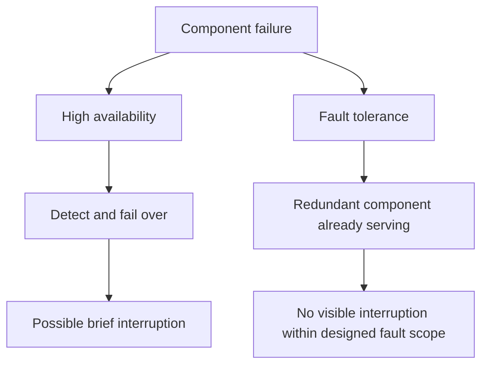
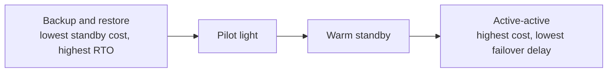
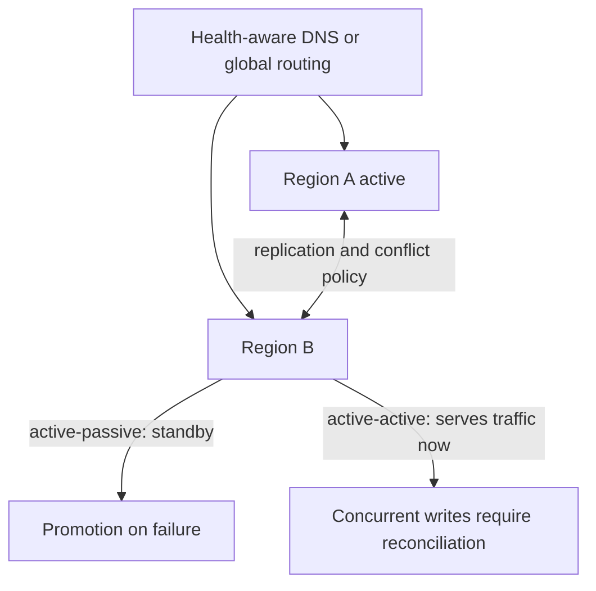
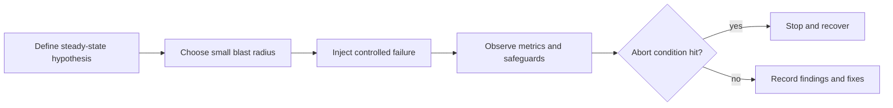
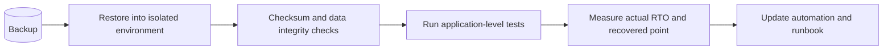
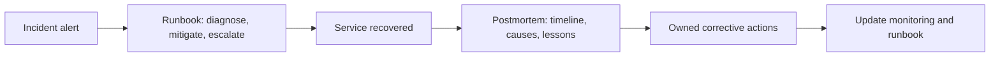

## 72. High Availability এবং Fault Tolerance-এর মধ্যে পার্থক্য কী?

**High Availability (HA):** এটা একটা system-এর সেই বৈশিষ্ট্য যা নিশ্চিত করে system **সর্বোচ্চ পরিমাণ সময় uptime/accessible** থাকবে, downtime যতটা সম্ভব কমিয়ে আনা হবে। HA সাধারণত achieve করা হয় **redundancy** এবং **automatic failover** এর মাধ্যমে — কোনো component fail করলে দ্রুত (কিছু সেকেন্ড/মিনিটের মধ্যে) backup component সেই জায়গা নিয়ে নেয়, ফলে সামান্য downtime হলেও overall system বেশিরভাগ সময় available থাকে। এটা measure করা হয় "**nines**" দিয়ে (যেমন 99.9%, 99.99% uptime)।

**Fault Tolerance (FT):** এটা একটা system-এর সেই বৈশিষ্ট্য যা নিশ্চিত করে কোনো component fail করলেও system **কোনো interruption/downtime ছাড়াই** নিরবচ্ছিন্নভাবে কাজ চালিয়ে যেতে পারে — user কোনো disruption বা delay একদমই টের পায় না। Fault tolerance achieve করার জন্য সাধারণত **সম্পূর্ণ redundant, parallel-running component** থাকে (active-active mode-এ), যেগুলো একই সময়ে একই কাজ করে, তাই একটা fail করলেও instant, seamless continuation ঘটে — কোনো failover delay বা visible interruption নেই।

**মূল পার্থক্য:**
| বিষয় | High Availability | Fault Tolerance |
|---|---|---|
| লক্ষ্য | Downtime minimize করা | Downtime সম্পূর্ণভাবে eliminate করা |
| Failure-এর সময় | সংক্ষিপ্ত failover delay হতে পারে (seconds/minutes) | কোনো visible interruption হয় না (instant/seamless) |
| Redundancy mode | সাধারণত active-passive (standby waiting) | সাধারণত active-active (সব সময় parallel চলমান) |
| Cost | তুলনামূলক কম | অনেক বেশি (duplicate infrastructure সবসময় active রাখতে হয়) |
| উদাহরণ | Multi-AZ database with automatic failover | Redundant flight control system, RAID storage array |

### একটা System কি Highly Available না হয়েও Fault-Tolerant হতে পারে, বা উল্টোটা?

**হ্যাঁ, সম্ভব — এই দুইটা independent concept।**

- **Fault-tolerant কিন্তু highly available না — এমনটা সাধারণত বিরল/অসম্ভাব্য practical scenario-তে**, কারণ fault tolerance সংজ্ঞাগতভাবেই একটা খুব উচ্চমানের availability guarantee করে (যেহেতু কোনো interruption-ই হয় না)। তবে theoretically, যদি কোনো system শুধুমাত্র **hardware-level fault** (যেমন একটা disk fail) থেকে seamlessly recover করতে পারে (fault tolerance), কিন্তু network connectivity বা external dependency-র উপর নির্ভরশীলতার কারণে মাঝে মাঝে সম্পূর্ণ unreachable হয়ে যায় (যেমন পুরো data center-এর power outage যেটা তার fault-tolerance design cover করে না), তাহলে সেটা কিছু ক্ষেত্রে fault-tolerant হয়েও পুরোপুরি highly available না হতে পারে।

- **Highly available কিন্তু fault-tolerant না — এটা অনেক বেশি common এবং practical scenario।** উদাহরণস্বরূপ: একটা Multi-AZ database যেখানে primary fail করলে standby automatically promote হয় (এটা HA)। কিন্তু failover-এর সময় **একটা সংক্ষিপ্ত downtime window (৬০-১২০ সেকেন্ড)** থাকে, যেখানে existing connection drop হয়ে যায় এবং কিছু in-flight transaction fail হতে পারে (আগের প্রশ্নে যেমন আলোচনা করা হয়েছে)। এটা fault-tolerant না, কারণ user সেই brief interruption টা টের পায় — কিন্তু overall system-এর uptime percentage অনেক ভালো (99.9%+) থাকে বলে এটাকে highly available বলা যায়।

সংক্ষেপে বলা যায়: **Fault tolerance হলো High Availability-র একটা "উচ্চতর, কঠোর form"** — সব fault-tolerant system automatically highly available (কারণ zero downtime), কিন্তু সব highly available system fault-tolerant না (কারণ HA সংক্ষিপ্ত downtime allow করে, শুধু সেটা minimize করে)। Fault tolerance অর্জন করতে অনেক বেশি cost এবং engineering complexity লাগে, তাই বেশিরভাগ business application-এর জন্য "highly available (with brief acceptable downtime)" ই যথেষ্ট এবং practical — সত্যিকারের fault tolerance সাধারণত mission-critical system-এ (aviation, medical device, financial trading) ব্যবহৃত হয় যেখানে even এক সেকেন্ডের disruption unacceptable।

---

## 73. RPO এবং RTO কী, এবং এগুলো কীভাবে Backup Design-কে Shape করে?

**RPO (Recovery Point Objective):** এটা নির্ধারণ করে কোনো disaster/failure ঘটলে, **সর্বোচ্চ কতটুকু data loss হওয়া acceptable** — অর্থাৎ শেষ backup/recovery point থেকে failure-এর মুহূর্ত পর্যন্ত সময়ের data হারানোর সর্বোচ্চ সীমা। এটা মূলত একটা **"সময়"** metric — যেমন "RPO = ১ ঘণ্টা" মানে হলো, disaster হলে সর্বোচ্চ ১ ঘণ্টার data হারানো acceptable, তার বেশি না।

**RTO (Recovery Time Objective):** এটা নির্ধারণ করে disaster ঘটার পর, system-কে আবার fully operational অবস্থায় ফিরিয়ে আনতে **সর্বোচ্চ কতটুকু সময় লাগা acceptable** — অর্থাৎ downtime-এর সর্বোচ্চ সীমা। যেমন "RTO = ৪ ঘণ্টা" মানে হলো, disaster হলে ৪ ঘণ্টার মধ্যে system পুরোপুরি restore করে চালু করতে হবে।

**সহজ পার্থক্য:** RPO জিজ্ঞেস করে "**কতটুকু data হারাতে পারি?**" (data loss tolerance), আর RTO জিজ্ঞেস করে "**কতক্ষণ down থাকতে পারি?**" (downtime tolerance)।

### RPO এবং RTO কীভাবে Backup Design Shape করে?

- **Backup frequency নির্ধারণ করে (RPO থেকে):** RPO সরাসরি নির্ধারণ করে কত ঘন ঘন backup নিতে হবে। যদি RPO = ২৪ ঘণ্টা হয়, তাহলে daily snapshot backup যথেষ্ট। কিন্তু যদি RPO = ৫ মিনিট হয়, তাহলে periodic snapshot দিয়ে সম্ভব না — continuous backup (transaction log shipping) বা synchronous replication দরকার হবে।

- **Backup method নির্ধারণ করে (RPO থেকে):** কম RPO মানে **continuous backup/point-in-time recovery (PITR)** বা **synchronous replication** ব্যবহার করতে হবে (আগের প্রশ্নে আলোচিত), যেখানে বেশি RPO acceptable হলে সাধারণ **periodic snapshot backup** যথেষ্ট।

- **Recovery mechanism/architecture নির্ধারণ করে (RTO থেকে):** RTO নির্ধারণ করে কী ধরনের recovery infrastructure দরকার। যদি RTO কম হয় (যেমন কয়েক মিনিট), তাহলে **hot standby/Multi-AZ automatic failover** দরকার হবে, যেখানে standby আগে থেকেই running থাকে এবং instant promote হতে পারে। কিন্তু যদি RTO বেশি acceptable হয় (যেমন কয়েক ঘণ্টা), তাহলে **cold standby** বা backup থেকে manually restore করাও যথেষ্ট হতে পারে (যেটা সময় নেয় কিন্তু cost কম)।

- **Disaster Recovery (DR) strategy নির্ধারণ করে:** RPO এবং RTO একসাথে ঠিক করে দেয় আপনি কোন DR pattern বেছে নেবেন — **Backup & Restore** (উচ্চ RPO/RTO, কম cost), **Pilot Light** (মাঝারি), **Warm Standby** (কম RPO/RTO, বেশি cost), নাকি **Multi-site Active-Active** (প্রায় zero RPO/RTO, সবচেয়ে বেশি cost)।

### কম RPO Requirement কীভাবে Backup Frequency এবং Cost পরিবর্তন করে?

- **Backup frequency অনেক বেড়ে যায়:** RPO যত কম হবে (যেমন সেকেন্ড/মিনিটের স্তরে), backup তত বেশি ঘন ঘন (বা continuously) নিতে হবে। "Daily backup" থেকে "প্রতি ঘণ্টায়" থেকে "continuous transaction log streaming"-এ যেতে হয়।

- **Storage cost বৃদ্ধি পায়:** বেশি ঘন ঘন backup নেওয়া মানে বেশি data point store করতে হয় (যদিও incremental backup/log-based approach এটা কিছুটা কমায়), যা overall storage cost বাড়ায়।

- **Infrastructure/architecture cost বৃদ্ধি পায়:** খুবই কম RPO (near-zero) achieve করতে সাধারণত **synchronous replication** দরকার হয়, যেখানে primary এবং replica-কে একসাথে, একই সময়ে write commit করতে হয় — এতে অতিরিক্ত compute/network resource লাগে, এবং যদি cross-region synchronous replication দরকার হয়, network cost এবং latency আরও বেড়ে যায় (এবং write performance-এও প্রভাব ফেলে, আগের প্রশ্নে যেমন আলোচনা হয়েছে sync vs async trade-off-এ)।

- **Complexity বৃদ্ধি পায়:** Continuous backup/log shipping system implement এবং maintain করা periodic snapshot-এর চেয়ে technically অনেক বেশি জটিল — এতে dedicated engineering effort এবং monitoring লাগে (log shipping fail হচ্ছে কিনা, replication lag কতটুকু, ইত্যাদি track করা)।

- **Operational overhead বৃদ্ধি পায়:** কম RPO maintain করতে হলে backup system-এর নিজস্ব health/reliability সবসময় monitor করতে হয় — যদি backup pipeline নিজেই fail করে, RPO target miss হয়ে যেতে পারে, তাই dedicated alerting/redundancy দরকার হয় backup system-এর জন্যও।

**সংক্ষেপে trade-off:** RPO যত কম করার চেষ্টা করবেন (কম data loss tolerance), backup **frequency, infrastructure sophistication, এবং overall cost তত বেশি বাড়বে** — তাই practical backup design সবসময় business-এর actual প্রয়োজন (কতটুকু data loss সত্যিই acceptable, কতটুকু budget আছে) বিবেচনা করে RPO/RTO target ঠিক করে, এবং সেই অনুযায়ী সবচেয়ে cost-effective backup strategy বেছে নেওয়া হয় — সব critical system-এর জন্য "সবচেয়ে কম RPO/RTO" চাওয়া বাস্তবসম্মত না, বরং **business impact vs. cost**-এর ভারসাম্য রক্ষা করাই মূল লক্ষ্য।

## 74. What's the difference between backup/restore, pilot light, warm standby, and active-active DR strategies?

Disaster Recovery (DR)-এর এই চারটা strategy মূলত একটা **spectrum** তৈরি করে — যেখানে একদিকে কম cost, বেশি RTO/RPO (Backup/Restore), এবং অন্যদিকে বেশি cost, প্রায় zero RTO/RPO (Active-Active)।

**1. Backup/Restore:** এখানে শুধু নিয়মিত **backup** নেওয়া হয় (secondary region-এ store করা), কিন্তু disaster হওয়ার আগে সেখানে কোনো running infrastructure থাকে না। Disaster ঘটলে, backup থেকে সম্পূর্ণ infrastructure **from scratch provision** করতে হয় (server তৈরি, database restore, application deploy) — এটা সবচেয়ে ধীর কিন্তু সবচেয়ে সস্তা।
- RTO: ঘণ্টা থেকে দিন। RPO: শেষ backup-এর সময় অনুযায়ী (ঘণ্টা/দিন)।

**2. Pilot Light:** এখানে secondary region-এ শুধু **core, critical component** (যেমন database) minimal scale-এ সবসময় running/replicating থাকে — বাকি সব (application server, load balancer) বন্ধ থাকে। এটা অনেকটা একটা গ্যাস চুলার "pilot light"-এর মতো — একদম ছোট একটা flame সবসময় জ্বলছে, যেটাকে দরকার হলে দ্রুত পুরো আগুনে (full system-এ) rupantor করা যায়। Disaster হলে, বাকি component গুলো (compute, app server) দ্রুত provision/scale up করে পুরো system চালু করতে হয়।
- RTO: মিনিট থেকে ঘণ্টা। RPO: মিনিট (database continuously replicate হচ্ছে বলে)।

**3. Warm Standby:** এখানে secondary region-এ পুরো application stack-এর একটা **scaled-down কিন্তু fully functional version** সবসময় running থাকে (কম capacity/instance count-এ)। এটা সবসময় live traffic কিছুটা handle করতে পারে বা readily available থাকে। Disaster হলে, এই standby environment-কে দ্রুত **scale up** করে full production capacity-তে নিয়ে যাওয়া হয়।
- RTO: কয়েক মিনিট। RPO: সেকেন্ড থেকে মিনিট।

**4. Active-Active (Multi-Site):** এখানে দুই (বা ততোধিক) region-এ **সম্পূর্ণ identical, full-capacity production environment** একসাথে চলমান থাকে, এবং উভয় region-ই **একইসাথে live traffic serve করে** (কোনো একটা "standby" না, দুটোই "active")। একটা region fail করলে, traffic automatically বাকি healthy region(গুলো)-এ চলে যায়, কোনো "startup/scale-up" সময়ের প্রয়োজন নেই কারণ সেটা আগে থেকেই full-scale চলছিল।
- RTO: প্রায় শূন্য (সেকেন্ড)। RPO: প্রায় শূন্য (near real-time replication)।

**সংক্ষেপে:**
| Strategy | RTO | RPO | Standby infrastructure |
|---|---|---|---|
| Backup/Restore | ঘণ্টা-দিন | ঘণ্টা-দিন | নেই |
| Pilot Light | মিনিট-ঘণ্টা | মিনিট | শুধু core data (minimal) |
| Warm Standby | মিনিট | সেকেন্ড-মিনিট | Scaled-down full stack |
| Active-Active | প্রায় শূন্য | প্রায় শূন্য | Full-scale, fully running |

### How does cost scale as you move from backup/restore toward active-active?

Cost বৃদ্ধি পায় মূলত কারণ **প্রতিটা পরবর্তী strategy-তে বেশি বেশি infrastructure "idle বসিয়ে না রেখে, সবসময় running" রাখতে হয়**:

- **Backup/Restore:** শুধু storage cost (backup data রাখার জন্য) — সবচেয়ে সস্তা, কারণ কোনো compute resource সবসময় চলমান না।
- **Pilot Light:** সামান্য বেশি — শুধু core database replica চলমান রাখতে হয়, যা তুলনামূলক কম resource ব্যবহার করে।
- **Warm Standby:** উল্লেখযোগ্যভাবে বেশি — পুরো application stack (যদিও reduced capacity-তে) সবসময় running রাখতে হয়, যার মানে সবসময় compute cost দিতে হচ্ছে, এমনকি ব্যবহার না হলেও।
- **Active-Active:** সবচেয়ে বেশি — দুই region-েই **full production-grade capacity** সবসময় চলমান রাখতে হয়, এবং সাথে যোগ হয় cross-region data synchronization/replication-এর জন্য অতিরিক্ত network/bandwidth cost, এবং conflict resolution-এর মতো architectural জটিলতার engineering cost।

মূলত এটা একটা **classic trade-off**: **কম RTO/RPO পেতে চাইলে বেশি "idle redundancy" এর জন্য pay করতে হবে** — Backup/Restore-এ আপনি শুধু "ব্যবহারের সময়" pay করেন, কিন্তু Active-Active-এ আপনি "সবসময় প্রস্তুত থাকার" জন্য ক্রমাগত pay করছেন, disaster ঘটুক বা না ঘটুক।

---

## 75. What's the difference between active-active and active-passive multi-region architecture? How does DNS failover work?

**Active-Passive:** এখানে একটা region **primary/active** (সব live traffic handle করে), এবং অন্য region(গুলো) **passive/standby** (traffic serve করে না, শুধু data replicate/sync হয়ে prepared থাকে)। Primary fail করলে, traffic manually বা automatically secondary region-এ **failover** করা হয়, যা তখন নতুন active হয়ে যায়। এটা মূলত আগের প্রশ্নে আলোচিত **Warm Standby বা Pilot Light** pattern-এর সাথে সামঞ্জস্যপূর্ণ।

**Active-Active:** এখানে একাধিক region **একইসাথে** live traffic serve করে — সব region-ই "active", কোনোটাই idle standby না। User-দের বিভিন্ন region-এ (সাধারণত geographic proximity/latency অনুযায়ী) route করা হয়, এবং প্রতিটা region independently request handle করতে সক্ষম।

**সংক্ষেপে:**
| বিষয় | Active-Passive | Active-Active |
|---|---|---|
| Traffic handling | শুধু primary region | একাধিক region একসাথে |
| Resource utilization | Secondary largely idle (waste) | সব region-ই productively ব্যবহৃত হয় |
| Failover প্রয়োজন | হ্যাঁ (explicit switch দরকার) | কার্যত না (একটা region গেলে বাকিগুলো চলতেই থাকে) |
| Cost efficiency | কম efficient (standby resource-এর জন্য pay কিন্তু ব্যবহার হয় না) | বেশি efficient (সব resource কাজে লাগে) |
| জটিলতা | তুলনামূলক সহজ | অনেক বেশি জটিল (data consistency, conflict) |

### DNS Failover কীভাবে কাজ করে এই Context-এ?

DNS-based routing (Route 53-এর মতো service) ব্যবহার করে:

- **Active-Passive-এ:** DNS-এ একটা **failover routing policy** সেট করা থাকে — primary endpoint-এর health check চলে, এবং primary healthy থাকা পর্যন্ত সব DNS query primary-এর IP return করে। Primary unhealthy হয়ে গেলে, DNS automatically secondary endpoint-এর IP return করা শুরু করে। যদিও, আগে আলোচিত হয়েছে, এতে **DNS TTL caching**-এর কারণে failover সম্পূর্ণ হতে কিছুটা delay (সেকেন্ড-মিনিট) হতে পারে।

- **Active-Active-এ:** DNS-এ সাধারণত **latency-based বা geolocation-based routing** ব্যবহার করা হয় — প্রতিটা query-র জন্য DNS user-এর অবস্থান অনুযায়ী সবচেয়ে কাছের/দ্রুততম region-এর IP return করে। যদি কোনো region fail করে, DNS-এর health check সেটা detect করে সেই region-কে rotation থেকে বাদ দিয়ে দেয়, এবং traffic automatically বাকি healthy region-গুলোতে redirect হতে থাকে — এখানে কোনো "promotion" প্রয়োজন নেই কারণ বাকি region আগে থেকেই সমানভাবে active এবং ready।

### What data consistency challenges does active-active introduce?

- **Write conflict:** যেহেতু একাধিক region একইসাথে write handle করতে পারে, দুই ভিন্ন region-এ **একই data-র উপর একই সময়ে ভিন্ন ভিন্ন write** হতে পারে (যেমন একজন user তার profile দুই ভিন্ন region থেকে প্রায় একই সময়ে update করছে)। কোন write টা "জয়ী" হবে, সেটা নির্ধারণ করার জন্য একটা **conflict resolution strategy** দরকার হয় — যেমন "last write wins" (timestamp-ভিত্তিক), vector clock, বা custom merge logic।

- **Replication lag এবং eventual consistency:** Region-গুলোর মধ্যে data sync হতে কিছুটা সময় লাগে (network distance-এর কারণে), তাই একটা region-এ write হওয়ার সাথে সাথে অন্য region-এ সেটা সাথে সাথেই দেখা নাও যেতে পারে — এটা **eventual consistency** তৈরি করে, যেখানে সাময়িকভাবে বিভিন্ন region ভিন্ন ভিন্ন "সত্য" (stale data) দেখাতে পারে (আগের প্রশ্নে আলোচিত replication lag/stale read সমস্যার মতোই, কিন্তু এখানে bidirectional এবং আরও জটিল, কারণ উভয় দিকেই write হচ্ছে)।

- **Split-brain scenario:** যদি দুই region-এর মধ্যে network connectivity (network partition) সাময়িকভাবে বিচ্ছিন্ন হয়ে যায়, উভয় region স্বাধীনভাবে writes গ্রহণ করতে থাকতে পারে, এবং পরে connectivity ফিরে এলে **conflicting data reconcile করা** একটা জটিল সমস্যা হয়ে দাঁড়ায় — কোন version রাখা হবে, কোনটা বাদ দেওয়া হবে তা নির্ধারণ করা কঠিন এবং কখনো কখনো data loss ছাড়া সমাধান সম্ভব হয় না।

- **Global uniqueness নিশ্চিত করা কঠিন:** Auto-incrementing ID-এর মতো mechanism, যেটা single-region system-এ সহজ, multi-region active-active-এ সমস্যাজনক হয়ে যায় — কারণ দুই region একই সময়ে একই ID generate করে ফেলতে পারে। এর সমাধান হিসেবে সাধারণত **UUID, region-prefixed ID, বা distributed ID generator** (যেমন Snowflake ID) ব্যবহার করা হয়।

- **Application design জটিলতা:** Developer-দের এখন এই সব consistency issue সম্পর্কে সচেতন থেকে application design করতে হয় — যেমন idempotent operation design করা, conflict-tolerant data structure (CRDT - Conflict-free Replicated Data Type) ব্যবহার করা, বা business logic-এই "কোন কনফ্লিক্ট acceptable, কোনটা না" তা define করা।

- **Testing ও operational complexity:** Multi-region active-active system টেস্ট করা এবং debug করা single-region system-এর তুলনায় অনেক বেশি কঠিন, কারণ timing, network partition, এবং concurrent write scenario simulate করা জটিল।

**সংক্ষেপে:** Active-Active সর্বোচ্চ availability এবং performance (geographic proximity-এর কারণে কম latency) দেয়, কিন্তু এর বিনিময়ে **strong consistency বজায় রাখা কঠিন হয়ে যায়** — এটা মূলত CAP theorem-এর একটা practical manifestation, যেখানে **Availability এবং Partition tolerance-কে priority দিতে গিয়ে strict Consistency-তে ছাড় দিতে হয়**, এবং সেই trade-off সামলানোর জন্য বাড়তি architectural ও application-level জটিলতা মেনে নিতে হয়।

## 76. What is chaos engineering, and what is a game day?

**Chaos Engineering** হলো একটা discipline/practice যেখানে ইচ্ছাকৃতভাবে (deliberately) একটা production system-এ **controlled failure/disruption inject করা হয়** (যেমন কোনো server বন্ধ করে দেওয়া, network latency বাড়িয়ে দেওয়া, dependency unavailable করে দেওয়া), যাতে system সেই unexpected condition-এ কীভাবে behave করে তা পর্যবেক্ষণ করা যায় এবং system-এর **resilience/weakness** সম্পর্কে জানা যায় — বাস্তব disaster ঘটার আগেই। এর মূল দর্শন হলো: "Failure হবেই, তাই সেটা নিয়ন্ত্রিতভাবে (controlled manner-এ), আমাদের নির্বাচিত সময়ে ঘটিয়ে শিখে নেওয়া ভালো, বরং যখন সেটা অপ্রত্যাশিতভাবে, worst possible time-এ নিজে থেকে ঘটবে তখন ভোগান্তির চেয়ে।" জনপ্রিয় tool: **Netflix-এর Chaos Monkey**, AWS Fault Injection Simulator।

**Game Day:** এটা একটা **planned, scheduled event** যেখানে পুরো team (engineering, ops, on-call) একসাথে বসে একটা নির্দিষ্ট disaster scenario simulate করে (যেমন "মূল database region সম্পূর্ণভাবে down হয়ে গেছে") এবং তারা সেই scenario-তে **কীভাবে respond করে** তা practice করে — incident response process, communication, runbook follow করা, এবং actual technical recovery সবকিছুই টেস্ট করা হয়। এটা অনেকটা fire drill-এর মতো — একটা controlled, pre-announced exercise যেখানে team-এর readiness এবং process-এর কার্যকারিতা যাচাই করা হয়।

**সংক্ষেপে পার্থক্য:** Chaos Engineering মূলত **system-এর technical resilience** টেস্ট করে (automated বা semi-automated), আর Game Day মূলত **মানুষ/team-এর response process এবং preparedness** টেস্ট করে (organized, human-centric exercise) — যদিও দুটো প্রায়ই একসাথে ব্যবহার করা হয় (Game Day-এ chaos engineering tool দিয়ে failure inject করা হতে পারে)।

### Why might mature teams run carefully scoped chaos experiments in production?

- **Staging environment বাস্তব production traffic/scale reflect করে না:** Staging-এ সাধারণত কম traffic, কম data volume, এবং সরলীকৃত (simplified) infrastructure থাকে। বাস্তব production-এ যে জটিল interaction, race condition, বা load-related issue দেখা দেয়, সেগুলো staging-এ পুনরায় তৈরি (reproduce) করা প্রায় অসম্ভব — real user traffic pattern, real concurrent load, real network condition এর মতো factor গুলো staging-এ মিস হয়ে যায়।

- **Configuration drift:** Staging এবং production environment-এর মধ্যে প্রায়ই সূক্ষ্ম কিন্তু গুরুত্বপূর্ণ পার্থক্য (configuration, dependency version, scaling policy) থেকে যায় — এই পার্থক্যের কারণে staging-এ একটা experiment successfully pass করলেও production-এ একই ধরনের failure সম্পূর্ণ ভিন্নভাবে (এমনকি অনেক worse ভাবে) manifest হতে পারে।

- **প্রকৃত dependency এবং integration point:** Production-এ third-party service, external API, real network topology, এবং actual data volume-এর সাথে system interact করে — এই real-world complexity staging-এ পুরোপুরি replicate করা কঠিন, এবং অনেক critical failure mode শুধুমাত্র সেই real interaction-এর মধ্যেই প্রকাশ পায়।

- **Real confidence build করা:** Staging test production behavior পুরোপুরি প্রমাণ করে না। তবে production experiment বাধ্যতামূলক নয়—প্রথমে staging-এ শেখা, তারপর maturity, business approval, observability ও rollback capability থাকলে production-এ ছোট blast radius দিয়ে validation করা নিরাপদ progression।

- **Controlled এবং সীমিত blast radius দিয়ে risk manage করা:** এটা ঠিক যে production-এ experiment চালানো ঝুঁকিপূর্ণ শোনায়, কিন্তু chaos engineering practice-এ এই ঝুঁকি **carefully controlled** করা হয় — ছোট, সীমিত scope (blast radius) দিয়ে শুরু করা, off-peak hour-এ চালানো, monitoring রাখা, এবং যেকোনো সময় দ্রুত experiment বন্ধ (abort) করার mechanism রাখা — যাতে actual user impact minimal থাকে, কিন্তু insight টা real এবং actionable হয়।

---

## 77. Why is backup testing important, and how do you run a restore drill?

**Backup Testing** হলো নিয়মিতভাবে যাচাই করা যে আপনার নেওয়া backup **আসলেই কাজ করে** — অর্থাৎ সেটা থেকে সত্যিই সম্পূর্ণ, ব্যবহারযোগ্য (usable) data সফলভাবে restore করা যায় কিনা। এটা গুরুত্বপূর্ণ কারণ:

- **"Backup exists" এবং "Backup works" এক জিনিস না:** শুধু backup file তৈরি হচ্ছে, বা backup job "success" status দেখাচ্ছে — এর মানে এই না যে সেই backup থেকে data actually restore করা সম্ভব। Corruption, incomplete backup, wrong configuration, বা missing dependency (যেমন encryption key হারিয়ে যাওয়া)-এর কারণে backup **silently broken** হয়ে থাকতে পারে, যেটা শুধু backup log দেখে ধরা পড়ে না।

- **Recovery process নিজেই জটিল এবং error-prone হতে পারে:** শুধু data থাকলেই হয় না, সেটা সঠিকভাবে restore করার জন্য সঠিক procedure, tool access, এবং permission দরকার — এই পুরো process যদি আগে থেকে টেস্ট না করা থাকে, তাহলে actual emergency-তে অপ্রত্যাশিত বাধা (unexpected obstacle) সামনে আসতে পারে।

- **RTO/RPO commitment verify করা:** শুধু backup নিলেই RTO/RPO target পূরণ হয় না — restore আসলে কতটুকু সময় নেয় (এবং সেটা প্রতিশ্রুত RTO-এর মধ্যে পড়ে কিনা) তা শুধুমাত্র বাস্তবে restore করে দেখলেই জানা যায়।

#### Restore Drill কীভাবে চালাবেন?

- **নির্দিষ্ট, নিয়মিত schedule রাখা:** Restore drill কোনো একবারের কাজ না — নিয়মিত interval-এ (যেমন প্রতি quarter-এ) চালানো উচিত, কারণ system, data, এবং infrastructure সময়ের সাথে পরিবর্তন হয়।

- **Isolated environment-এ restore করা:** Production system-কে disturb না করে, একটা আলাদা, isolated environment (staging বা dedicated test environment)-এ backup থেকে সম্পূর্ণ restore করা — এতে production কোনোভাবে affected হয় না, অথচ পুরো restore process বাস্তবে test করা যায়।

- **End-to-end verify করা:** শুধু data file restore হলো কিনা তা না, বরং restore হওয়া system/database **actually functional এবং data সঠিক/consistent** কিনা তা যাচাই করা — যেমন application চালিয়ে দেখা কোনো error আসছে কিনা, নির্দিষ্ট record গুলো সঠিকভাবে আছে কিনা (checksum/sample query দিয়ে data integrity verify করা)।

- **Time measure করা:** পুরো restore process সম্পন্ন হতে ঠিক কতক্ষণ সময় লাগলো তা record করা, এবং সেটাকে প্রতিশ্রুত RTO-এর সাথে তুলনা করা — যদি actual restore time RTO-এর চেয়ে বেশি হয়, তাহলে backup strategy পুনর্বিবেচনা করা দরকার।

- **Documentation/runbook অনুসরণ করে test করা:** যে procedure/runbook actual disaster-এর সময় ব্যবহার হবে, ঠিক সেই একই procedure ব্যবহার করে drill চালানো — এতে procedure নিজেই সঠিক এবং up-to-date কিনা তাও verify হয়ে যায়।

- **বিভিন্ন failure scenario cover করা:** শুধু "সম্পূর্ণ database হারিয়ে গেছে" না, বরং বিভিন্ন ধরনের scenario টেস্ট করা — যেমন specific point-in-time-এ restore করা (PITR), partial data corruption থেকে recover করা, বা cross-region restore করা।

- **ফলাফল থেকে শেখা এবং improve করা:** Drill-এ কোনো সমস্যা পাওয়া গেলে (documentation ভুল, permission missing, সময় বেশি লাগা), সেটা ঠিক করে backup strategy/procedure update করা — এবং পরবর্তী drill-এ আবার যাচাই করা।

### What's the risk of never testing a restore before you actually need it?

- **সবচেয়ে খারাপ সময়ে ব্যর্থতা আবিষ্কার হওয়া:** যদি backup আসলে broken/unusable হয়ে থাকে, এটা আপনি জানতে পারবেন ঠিক তখনই যখন আপনার সবচেয়ে বেশি প্রয়োজন — একটা actual disaster-এর মাঝখানে। এই মুহূর্তে backup fail করার মানে হলো **সত্যিকারের, permanent data loss**, ঠিক যখন সেই data সবচেয়ে বেশি মূল্যবান।

- **False confidence:** "আমরা তো backup নিচ্ছি" এই ধারণা একটা মিথ্যা নিরাপত্তাবোধ (false sense of security) তৈরি করে — team মনে করে তারা DR-এর জন্য প্রস্তুত, কিন্তু বাস্তবে তারা untested, potentially broken একটা safety net-এর উপর নির্ভর করছে।

- **Restore process নিজেই সময়ের চাপে ব্যর্থ হতে পারে:** এমনকি যদি data ঠিকঠাক থাকে, কিন্তু restore procedure আগে কখনো practice না করা থাকলে, actual emergency-র high-pressure মুহূর্তে ভুল করার সম্ভাবনা অনেক বেশি — missing credential, ভুল configuration, বা অজানা step-এর কারণে recovery আরও দেরি হয়ে যেতে পারে, যা RTO ভেঙে দিতে পারে।

- **Business-critical impact:** এই ব্যর্থতার ফলাফল শুধু technical সমস্যা না — এটা সরাসরি business-এর উপর প্রভাব ফেলে: financial loss, customer trust হারানো, compliance violation, এমনকি কিছু ক্ষেত্রে ব্যবসা একেবারে বন্ধ হয়ে যাওয়ার মতো পরিস্থিতিও তৈরি হতে পারে। একটা common industry উক্তি হলো: "**Untested backup is not a backup, it's just a hope (আশা)**।"

---

## 78. What is a runbook, and how does it help incident response? How is it different from a postmortem?

**Runbook** হলো একটা **step-by-step, actionable document/guide** যা নির্দিষ্ট করে দেয়, কোনো নির্দিষ্ট ধরনের incident/situation ঘটলে **ঠিক কী কী করতে হবে**, কোন order-এ — যেমন "database CPU 90%-এর বেশি হলে কী করতে হবে", বা "payment service down হলে কীভাবে troubleshoot এবং mitigate করতে হবে"। এটা সাধারণত আগে থেকে (proactively, incident ঘটার আগে) তৈরি করা হয়, based on পূর্ববর্তী অভিজ্ঞতা, known failure mode, এবং best practice-এর উপর ভিত্তি করে।

### Runbook কীভাবে Incident Response-এ সাহায্য করে?

- **দ্রুত, consistent response নিশ্চিত করা:** Incident-এর সময় guess করার বা from-scratch চিন্তা করার দরকার নেই — runbook সরাসরি বলে দেয় কী step নিতে হবে, ফলে response time অনেক কমে যায়।
- **Knowledge democratize করা:** সবচেয়ে experienced engineer সবসময় available নাও থাকতে পারে (রাত/ছুটির দিন)। Runbook থাকলে on-call-এ থাকা যেকোনো engineer (even কম অভিজ্ঞ কেউ) সেই documented procedure follow করে effectively response দিতে পারে।
- **Human error কমানো:** High-pressure situation-এ মানুষ ভুল করে বা গুরুত্বপূর্ণ step মিস করে ফেলতে পারে — runbook একটা checklist-এর মতো কাজ করে যা এই ঝুঁকি কমায়।
- **Escalation path স্পষ্ট করা:** কখন, কাকে escalate করতে হবে তা runbook-এ define করা থাকে, ফলে সময় নষ্ট হয় না।

### Runbook এবং Postmortem-এর মধ্যে পার্থক্য কী?

**Runbook** হলো **forward-looking, prescriptive** — এটা ভবিষ্যতে ঘটবে এমন incident-এর জন্য "কী করতে হবে" তা আগে থেকে define করে রাখে, incident-এর **সময়** ব্যবহার হয়।

**Postmortem (বা Incident Retrospective)** হলো **backward-looking, analytical** — এটা কোনো incident **ঘটে যাওয়ার পর** লেখা হয়, যেখানে বিশ্লেষণ করা হয় কী ঘটেছিল (timeline), কেন ঘটেছিল (root cause), কী impact হয়েছিল, response কেমন হয়েছিল, এবং ভবিষ্যতে একই সমস্যা এড়াতে কী action item নিতে হবে (যেমন নতুন monitoring যোগ করা, বা runbook update করা)।

**সংক্ষেপে:**
| বিষয় | Runbook | Postmortem |
|---|---|---|
| Timing | Incident-এর আগে তৈরি, incident-এর সময় ব্যবহৃত | Incident-এর পরে লেখা |
| উদ্দেশ্য | কী করতে হবে তা guide করা (prescriptive) | কী ঘটেছিল তা বিশ্লেষণ করা (analytical) |
| Focus | Action/procedure | Root cause, learning, prevention |
| Output | Step-by-step instruction | Timeline, findings, action item |

আসলে এই দুইটা একে অপরের সাথে **সংযুক্ত** — postmortem-এর ফলাফল প্রায়ই নতুন runbook তৈরি করে বা existing runbook-কে update/improve করে, যাতে ভবিষ্যতে একই ধরনের incident আরও দ্রুত এবং effectively handle করা যায়।

### What makes a runbook effective during a high-pressure incident?

- **সংক্ষিপ্ত, স্পষ্ট, এবং scannable:** High-pressure মুহূর্তে কেউ লম্বা paragraph পড়ার সময়/ধৈর্য রাখে না — runbook-কে numbered step, bullet point, এবং bold করা critical warning দিয়ে সহজে scan করার মতো করে লেখা উচিত।
- **Actionable এবং specific:** অস্পষ্ট নির্দেশনা ("check the database") এর বদলে exact command, exact dashboard link, exact query দেওয়া থাকা উচিত — যাতে চিন্তা না করে সরাসরি execute করা যায়।
- **Up-to-date রাখা:** পুরনো, outdated runbook (যেমন যেটা এখন আর exist না করা server-এর reference দেয়) confusion তৈরি করে এবং সময় নষ্ট করে — নিয়মিত review/update করা জরুরি, বিশেষত প্রতিটা postmortem-এর পর।
- **সহজে accessible হওয়া:** Incident-এর সময় engineer-কে runbook খুঁজতে সময় নষ্ট করতে হবে না — এটা centralized, সহজে searchable জায়গায় থাকা উচিত, এবং ideally alert/monitoring tool থেকে সরাসরি link করা থাকা উচিত।
- **Decision tree/branching logic থাকা:** বাস্তব incident গুলো সবসময় exactly একই রকম হয় না — একটা ভালো runbook বিভিন্ন সম্ভাব্য scenario অনুযায়ী branching guidance দেয় ("যদি X দেখা যায়, তাহলে A করো; যদি Y দেখা যায়, তাহলে B করো")।
- **Verified/tested:** যে runbook কখনো practice/test করা হয়নি (যেমন game day-এর মাধ্যমে), সেটাও actual emergency-তে ভুল বা অকার্যকর প্রমাণিত হতে পারে — নিয়মিতভাবে runbook-কে বাস্তবে চালিয়ে verify করা প্রয়োজন।
- **Rollback/safety consideration included:** প্রতিটা step-এ যদি কিছু ভুল হয়ে যায়, তাহলে কীভাবে rollback/undo করা যাবে তার guidance থাকা উচিত, যাতে কোনো step নিলে situation আরও worse না হয়ে যায়।
