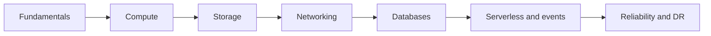

# Cloud Computing Interview Guide

Cloud computing হলো demand অনুযায়ী infrastructure ও managed capability ব্যবহার করার operating model। এই section vendor-specific service list-এর বদলে compute, storage, networking, database, event-driven design এবং reliability-এর transferable concepts শেখায়।

## Chapters

1. [Cloud Fundamentals](./cloud-fundamentals/)
2. [Compute](./compute/)
3. [Storage](./storage/)
4. [Networking](./networking/)
5. [Databases](./databases/)
6. [Serverless and Event-Driven Architecture](./serverless-and-event-driven-architecture/)
7. [Reliability, High Availability, and Disaster Recovery](./reliability-high-availability-and-disaster-recovery/)

## What you should be able to explain

- Elasticity, scalability, availability এবং durability-এর পার্থক্য
- Virtual machine, container, serverless function ও managed service নির্বাচন
- Object, block ও file storage-এর workload fit
- Public/private network boundary এবং traffic flow
- Backup, replication, failover, RPO ও RTO-এর সম্পর্ক

## How to study

প্রতিটি chapter শেষে একই workload—যেমন একটি file-processing API—বিভিন্নভাবে design করুন। কোন component stateful, কোথায় scale হবে, failure হলে কী হবে, এবং cost কোন dimension-এর সঙ্গে বাড়বে তা লিখুন। এতে definition মুখস্থ করার বদলে architecture decision নেওয়ার দক্ষতা তৈরি হবে।
