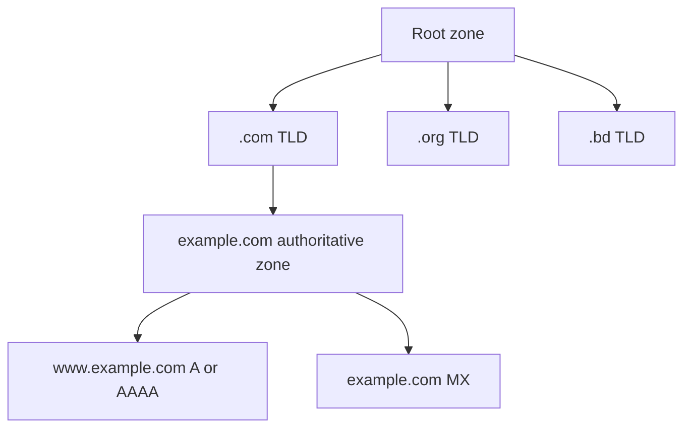
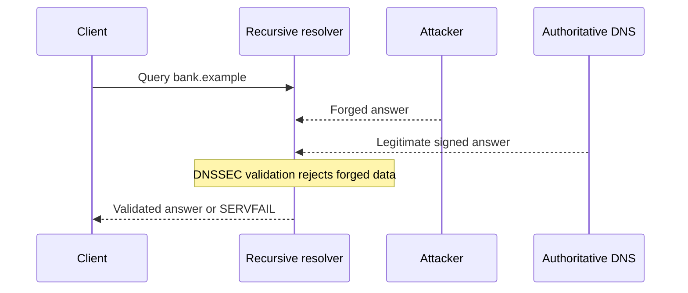
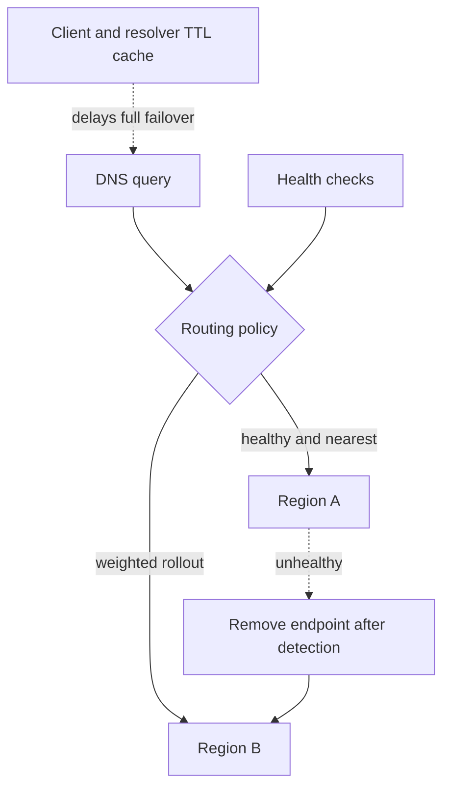

## 8. What is the Domain Name System (DNS)?
**DNS (Domain Name System)** হলো ইন্টারনেটের একটি ডিস্ট্রিবিউটেড ডেটাবেস সিস্টেম, যা মানুষের পড়ার উপযোগী ডোমেইন নেমকে (যেমন: `google.com`) মেশিনের পড়ার উপযোগী IP অ্যাড্রেসে (যেমন: `142.250.190.46`) রূপান্তর করে। সহজ কথায়, এটি ইন্টারনেটের ডিরেক্টরি হিসেবে কাজ করে।

### 🤔 Why was DNS created instead of using IP addresses directly?
মানুষের মস্তিষ্কের পক্ষে হাজার হাজার ওয়েবসাইটের জটিল সংখ্যার IP অ্যাড্রেস মুখস্থ রাখা প্রায় অসম্ভব। কিন্তু কোনো ওয়েবসাইটের নাম (যেমন `facebook.com`) মনে রাখা খুব সহজ। মানুষের এই সুবিধার জন্যই IP অ্যাড্রেসের বিকল্প হিসেবে ডোমেইন নেম এবং এদের রেজল্যুশনের জন্য DNS সিস্টেম তৈরি করা হয়েছে।

### ⚖️ How does DNS help with load balancing and fault tolerance?
DNS শুধুমাত্র নামকে আইপিতেই রূপান্তর করে না, এটি ট্রাফিক ম্যানেজমেন্টেও সাহায্য করে:
* **Load Balancing (Round-Robin DNS):** একটি ডোমেইনের বিপরীতে একাধিক IP অ্যাড্রেস অ্যাসাইন করা যায়। যখন ইউজাররা ওই ডোমেইনে রিকোয়েস্ট পাঠায়, DNS তখন পর্যায়ক্রমে (round-robin) ভিন্ন ভিন্ন IP রিটার্ন করে, ফলে ট্রাফিক একাধিক সার্ভারে ভাগ হয়ে যায়।
* **Fault Tolerance/Failover:** যদি কোনো সার্ভার ডাউন বা অফলাইন হয়ে যায়, ব্যাকএন্ড ডেভেলপাররা DNS রেকর্ড আপডেট করে ট্রাফিক অন্য একটি সুস্থ (healthy) সার্ভারের IP-তে রিডাইরেক্ট করে দিতে পারেন।

### 📂 What is the difference between a DNS zone and a DNS record?

| বৈশিষ্ট্য | 📝 DNS Record | 🗂️ DNS Zone |
| :--- | :--- | :--- |
| **সংজ্ঞা** | এটি হলো DNS ডেটাবেসের একটি সিঙ্গেল এন্ট্রি বা তথ্য (যেমন A রেকর্ড, MX রেকর্ড)। | এটি হলো একটি ডোমেইন স্পেসের অংশ, যার পরিচালনার দায়িত্ব নির্দিষ্ট কোনো অ্যাডমিনিস্ট্রেটরের কাছে থাকে। |
| **কাজ** | এটি নির্দিষ্ট একটি ডোমেইনের কোনো একটি প্রপার্টি ডিফাইন করে। | একটি DNS Zone-এর ভেতরে ওই ডোমেইন এবং তার সাবডোমেইনের সমস্ত DNS Record গুলোকে একটি ফাইলে (Zone File) সংগঠিত রাখা হয়। |

### 📖 Why is DNS often called the "Phonebook of the Internet"?
টেলিফোন ডিরেক্টরিতে যেমন মানুষের নামের পাশে তাদের ফোন নম্বর লেখা থাকে, ঠিক তেমনি DNS সার্ভারে ওয়েবসাইটের ডোমেইন নেমের পাশে তাদের IP অ্যাড্রেস লেখা থাকে। আপনি নাম খুঁজলে DNS আপনাকে রিয়েল আইপি অ্যাড্রেস বা নম্বরটা বের করে দেয়। এ কারণেই একে ইন্টারনেটের ফোনবুক বলা হয়।

### 🔄 What is the difference between forward and reverse DNS lookup?
* **▶️ Forward DNS Lookup:** ডোমেইন নেম (যেমন `google.com`) থেকে IP অ্যাড্রেস বের করার প্রক্রিয়াকে ফরোয়ার্ড লুকআপ বলে। এটিই সবচেয়ে বেশি ব্যবহৃত হয়।
* **◀️ Reverse DNS Lookup (rDNS):** IP অ্যাড্রেস (যেমন `142.250.190.46`) থেকে সেই আইপিটি কোন ডোমেইনের সাথে যুক্ত, তা বের করার প্রক্রিয়াকে রিভার্স লুকআপ বলে। এটি স্প্যাম চেকিং এবং ট্রাবলশুটিং-এর কাজে ব্যবহৃত হয়।

---

## 9. How does DNS resolve domain names to IP addresses?


> DNS রেজল্যুশন ফ্লো (Browser Cache -> Resolver -> Root -> TLD -> Authoritative -> Cache)

### Step-by-step DNS Resolution

1. **Browser -> Local Cache**  
   প্রথমে OS বা ব্রাউজারের ক্যাশে খোঁজে। আগে ভিজিট করা থাকলে এখানেই পাওয়া যায়, বাকি ধাপের দরকার হয় না।

2. **Recursive Resolver**  
   না পেলে ISP-এর বা পাবলিক রিজলভারের (যেমন Google-এর `8.8.8.8`) কাছে যায়। এটি পুরো চেইনটি পরিচালনা করে।

3. **Root Server -> TLD ঠিকানা**  
   রিজলভার Root Server-কে জিজ্ঞেস করে। Root Server জানে না `example.com`-এর IP, কিন্তু জানে `.com`-এর TLD সার্ভার কোথায়, সেটি দিয়ে দেয়।

4. **TLD Server -> Authoritative ঠিকানা**  
   `.com` TLD সার্ভার জানে `example.com` কোন Authoritative Server ব্যবহার করে, সেটির ঠিকানা দেয়।

5. **Authoritative Server -> চূড়ান্ত IP**  
   এটিই আসল উত্তর দেয়। Domain-এর DNS রেকর্ড এখানেই থাকে।

6. **ক্যাশ করা হয়**  
   পুরো উত্তরটি TTL (Time to Live) সময়ের জন্য ক্যাশে সংরক্ষিত হয়, যাতে পরের বার আবার পুরো চেইন না ঘুরতে হয়।

> Tip: বাস্তবে পুরো প্রক্রিয়াটি মাত্র **কয়েক মিলিসেকেন্ডে** শেষ হয়।

### 🏢 What is the difference between an authoritative DNS server and a recursive resolver?

| সার্ভার | 🛡️ Authoritative DNS Server | 🕵️‍♂️ Recursive Resolver |
| :--- | :--- | :--- |
| **সংজ্ঞা** | এটি হলো ডেটাবেসের সেই অরিজিনাল সার্ভার, যার কাছে নির্দিষ্ট ডোমেইনটির জন্য সর্বশেষ এবং সঠিক DNS রেকর্ডগুলো জমা থাকে। এটিই চূড়ান্ত উত্তর দেয়। | এটি হলো ইউজারের ডিভাইস (বা ISP) থেকে পাঠানো রিকোয়েস্ট গ্রহণকারী সার্ভার। |
| **কাজের ধরন** | এর কাছে সব রেকর্ড সেভ করা থাকে। | এর নিজের কাছে সব উত্তর থাকে না, বরং ইউজারের হয়ে এটি অন্যান্য সার্ভারকে পর্যায়ক্রমে প্রশ্ন করে আইপি অ্যাড্রেসটি খুঁজে এনে ইউজারকে দেয়। |

### 🕵️‍♂️ What is the role of a DNS resolver in the DNS resolution process?

**DNS Resolver** (বা Recursive Resolver) হলো ক্লায়েন্ট এবং DNS ইনফ্রাস্ট্রাকচারের মধ্যকার **মধ্যস্থতাকারী (Middleman)**। পুরো DNS রেজোলিউশন প্রক্রিয়ায় এটিই সবচেয়ে সক্রিয় ভূমিকা পালন করে।

যখন আপনি ব্রাউজারে `www.example.com` টাইপ করেন:

**১. ব্রাউজার শুধু Resolver-কে চেনে**  
ব্রাউজার সরাসরি কোনো Root বা TLD সার্ভারের সঙ্গে কথা বলে না — শুধু Resolver-এর কাছে প্রশ্ন পাঠায়।

**২. Resolver নিজে তদন্ত শুরু করে**  
Resolver তখন একে একে তিনটি জায়গায় যায়:

| ধাপ | কার কাছে যায় | কী জানতে চায় |
| --- | --- | --- |
| ১ | **Root Server** | `.com`-এর TLD সার্ভার কোথায়? |
| ২ | **TLD Server** | `example.com`-এর Authoritative সার্ভার কোথায়? |
| ৩ | **Authoritative Server** | `www.example.com`-এর IP কত? |

**৩. উত্তর Cache করে রাখে**  
চূড়ান্ত IP পেলে সেটি নির্দিষ্ট সময় (TTL) পর্যন্ত Cache-এ সংরক্ষণ করে। পরবর্তীতে একই প্রশ্ন এলে সব ধাপ না ঘুরে সরাসরি Cache থেকেই উত্তর দেয় — এতে সময় ও ব্যান্ডউইথ দুটোই বাঁচে।

### 🔄 Describe the difference between an Iterative and a Recursive DNS query.

DNS রেজোলিউশনে দুটি ভিন্ন পদ্ধতিতে প্রশ্ন করা যায় — **Recursive** এবং **Iterative**। মূল পার্থক্য হলো **কে কাজটা করে।**

#### Recursive Query — "তুমিই খুঁজে দাও"

এখানে ক্লায়েন্ট Resolver-কে বলে: *"আমি শুধু চূড়ান্ত উত্তর চাই, বাকিটা তুমি সামলাও।"*

Resolver তখন নিজেই Root → TLD → Authoritative সার্ভারে গিয়ে পুরো কাজ শেষ করে ক্লায়েন্টকে শুধু IP ফেরত দেয়।

```
Client ──► Resolver ──► Root Server
                    ◄──
                    ──► TLD Server
                    ◄──
                    ──► Authoritative Server
                    ◄──
Client ◄── Resolver (চূড়ান্ত IP)
```

> ক্লায়েন্ট একটাই প্রশ্ন করে, একটাই উত্তর পায়। মাঝের সব ঝামেলা Resolver-এর।

#### Iterative Query — "যতটুকু জানো বলো"

এখানে Resolver প্রতিটি সার্ভারকে জিজ্ঞেস করে, আর সার্ভার সম্পূর্ণ উত্তর না দিয়ে বলে: *"আমি জানি না, তবে এই সার্ভারকে জিজ্ঞেস করো।"*

Resolver নিজেই পর্যায়ক্রমে এগিয়ে যায়।

```
Resolver ──► Root Server
         ◄── "জানি না, TLD-কে জিজ্ঞেস করো"
Resolver ──► TLD Server
         ◄── "জানি না, Authoritative-কে জিজ্ঞেস করো"
Resolver ──► Authoritative Server
         ◄── "IP হলো 93.184.216.34" ✅
```

> প্রতিটি সার্ভার শুধু **পরের ঠিকানা** দেয় — চূড়ান্ত উত্তর নয়।

### 👣 Can you walk through a full DNS resolution step by step?
ধরা যাক একজন ইউজার `example.com` ভিজিট করতে চাইছে:
1. **💾 Local Cache Check:** প্রথমে ব্রাউজার এবং ওএস (OS) তাদের নিজেদের ক্যাশ চেক করবে। না পেলে রিকোয়েস্ট যাবে ISP-এর Recursive Resolver-এর কাছে।
2. **🌐 Recursive Resolver to Root Server:** রিসলভারের ক্যাশেও উত্তর না থাকলে, সে প্রথমে একটি গ্লোবাল **Root DNS Server**-কে প্রশ্ন করবে।
3. **🏷️ Root to TLD Server:** রুট সার্ভার আইপি জানে না, কিন্তু সে `.com`-এর দায়িত্বে থাকা **TLD (Top-Level Domain) Server**-এর ঠিকানা বলে দেবে।
4. **🏢 Resolver to TLD Server:** রিসলভার এবার TLD সার্ভারকে প্রশ্ন করবে। TLD সার্ভার `example.com`-এর ডোমেইন প্রোপাইডার বা **Authoritative Name Server**-এর ঠিকানা বলে দেবে।
5. **🛡️ Resolver to Authoritative Server:** রিসলভার এবার অথরিটেটিভ সার্ভারকে প্রশ্ন করবে। এই সার্ভার তার ডেটাবেস থেকে `example.com`-এর আইপি অ্যাড্রেসটি রিসলভারকে দেবে।
6. **✅ Return to User:** রিসলভার আইপিটি পেয়ে ব্রাউজারকে রিটার্ন করবে এবং ভবিষ্যতের জন্য নিজের কাছে ক্যাশ করে রাখবে।

---

## 10. What are the types of DNS records (A, CNAME, MX, and more)?

DNS Record হলো DNS ডেটাবেজে সংরক্ষিত নির্দেশিকা, যা বলে দেয় একটি ডোমেইনের সাথে কোন IP বা সার্ভার যুক্ত। প্রতিটি রেকর্ডের আলাদা উদ্দেশ্য আছে।

#### A Record — Address Record

একটি ডোমেইনকে **IPv4 ঠিকানার** সাথে যুক্ত করে। সবচেয়ে মৌলিক এবং বহুল ব্যবহৃত রেকর্ড।

```
example.com  →  93.184.216.34
```

> ব্রাউজারে ডোমেইন লিখলে শেষ পর্যন্ত এই রেকর্ডই কাজে আসে।

#### AAAA Record — IPv6 Address Record

A Record-এর মতোই, তবে **IPv6 ঠিকানার** জন্য।

```
example.com  →  2606:2800:220:1:248:1893:25c8:1946
```

#### CNAME Record — Canonical Name Record

একটি ডোমেইনকে অন্য একটি ডোমেইনের দিকে **নির্দেশ করে** (IP-র দিকে নয়)।

```
www.example.com  →  example.com
blog.example.com →  example.com
```

> একটি মূল ডোমেইনের একাধিক Alias তৈরি করতে ব্যবহার হয়। CNAME কখনো সরাসরি IP ধরে না।

#### MX Record — Mail Exchange Record

ডোমেইনের **ইমেইল কোন সার্ভারে যাবে** তা নির্ধারণ করে। Priority নম্বর দিয়ে কোন সার্ভার আগে ব্যবহার হবে তা ঠিক করা যায়।

```
example.com  →  Priority 10  →  mail1.example.com
example.com  →  Priority 20  →  mail2.example.com  (backup)
```

> Priority সংখ্যা যত কম, সার্ভার তত বেশি অগ্রাধিকার পায়।

#### TXT Record — Text Record

ডোমেইন সম্পর্কে যেকোনো **টেক্সট তথ্য** সংরক্ষণ করে। মূলত যাচাইকরণ ও নিরাপত্তার কাজে ব্যবহৃত হয়।

```
example.com  →  "v=spf1 include:_spf.google.com ~all"
```

সাধারণ ব্যবহার:

| উদ্দেশ্য | উদাহরণ |
| --- | --- |
| SPF | ইমেইল স্প্যাম রোধ |
| DKIM | ইমেইল সত্যতা যাচাই |
| Domain Verification | Google, Facebook সাইট যাচাই |

#### NS Record — Name Server Record

ডোমেইনের জন্য কোন **Authoritative Name Server** দায়িত্বপ্রাপ্ত তা জানায়।

```
example.com  →  ns1.hostingprovider.com
example.com  →  ns2.hostingprovider.com
```

> ডোমেইন কিনলে এই রেকর্ড দিয়েই DNS কোথায় পরিচালিত হবে তা ঠিক করা হয়।

#### PTR Record — Pointer Record

A Record-এর **বিপরীত কাজ** করে — IP ঠিকানা থেকে ডোমেইন নাম খোঁজে বের করে। এটিকে Reverse DNS-ও বলা হয়।

```
93.184.216.34  →  example.com
```

> ইমেইল সার্ভার যাচাই এবং নেটওয়ার্ক ট্রাবলশুটিংয়ে কাজে আসে।

#### SOA Record — Start of Authority Record

একটি DNS Zone-এর **প্রাথমিক তথ্য** ধারণ করে। প্রতিটি Zone-এ একটিমাত্র SOA Record থাকে।

ধারণ করে: Primary Name Server, Admin ইমেইল, Serial Number, Refresh/Retry/Expire সময়।

#### SRV Record — Service Record

নির্দিষ্ট **সার্ভিসের** (যেমন VoIP, গেমিং) হোস্ট ও পোর্ট নম্বর নির্ধারণ করে।

```
_sip._tcp.example.com  →  Priority 10, Port 5060, sip.example.com
```

### 🔢 What is the difference between an A record and an AAAA record?

| রেকর্ড | 🔹 IPv4 (A Record) | 🔹 IPv6 (AAAA Record) |
| :--- | :--- | :--- |
| **সংজ্ঞা** | ডোমেইন নেমকে 32-bit **IPv4** অ্যাড্রেসের সাথে যুক্ত করে। | ডোমেইন নেমকে 128-bit **IPv6** অ্যাড্রেসের সাথে যুক্ত করে। |
| **উদাহরণ** | `192.168.1.1` | `2001:0db8::8a2e:0370:7334` |

### 🔙 What is a PTR record and when is it used?
**PTR (Pointer) Record** হলো A Record-এর ঠিক উল্টো। এটি একটি আইপি অ্যাড্রেসকে ডোমেইন নেমের সাথে যুক্ত করে এবং **Reverse DNS Lookup**-এর কাজে ব্যবহৃত হয়।
* **ব্যবহার:** মূলত অ্যান্টি-স্প্যাম ভেরিফিকেশনে এটি বেশি ব্যবহৃত হয়। ইমেইল রিসিভিং সার্ভার চেক করে যে আইপি থেকে ইমেইল এসেছে, সেই আইপির পিটিআর রেকর্ডে ডোমেইনটি উল্লেখ আছে কি না, যাতে স্প্যামারদের ব্লক করা যায়।

### 📄 What is a TXT record used for in backend configurations?
**TXT (Text) Record** মূলত ডোমেইনের সাথে সম্পর্কিত কোনো টেক্সট বা মেশিন-রিডেবল ডেটা স্টোর করতে ব্যবহৃত হয়। ব্যাকএন্ড এবং ডেভপ্সে এর ব্যাপক ব্যবহার রয়েছে:
* **Domain Verification:** Google Workspace, Office 365, বা AWS-এর মতো সার্ভিস ভেরিফাই করতে যে আপনি ডোমেইনের মালিক।
* **Email Security:** SPF, DKIM, এবং DMARC পলিসি সেট করতে, যা ইমেইল স্পুফিং রোধ করে।

### 🔀 When would you use an ALIAS record instead of a CNAME?
* **CNAME-এর সীমাবদ্ধতা:** DNS রুলস অনুযায়ী, রুট বা এপেক্স ডোমেইনে (যেমন শুধু `example.com`) কোনো CNAME রেকর্ড বসানো যায় না, CNAME শুধু সাবডোমেইনে (যেমন `www.example.com`) ব্যবহার করা যায়। 
* **ALIAS-এর সুবিধা:** ALIAS বা ANAME রেকর্ড এই সীমাবদ্ধতা দূর করে। এটি রুট ডোমেইনেই বসানো যায় এবং ব্যাকএন্ডে এটি CNAME এর মতই আরেকটি ডোমেইন বা সার্ভিসকে (যেমন AWS CloudFront, Heroku) পয়েন্ট করে, কিন্তু ক্লায়েন্ট যখন রিকোয়েস্ট করে তখন এটি ফাইনাল IP অ্যাড্রেসটাই রিটার্ন করে (যেন এটি একটি A রেকর্ড)।

---

## 11. What is the DNS hierarchy (Root DNS servers, TLDs, and authoritative DNS servers)?



DNS একটি **Tree-shaped** হায়ারার্কি অনুসরণ করে। একদম উপরে Root, তারপর TLD, তারপর Authoritative — এভাবে ধাপে ধাপে নিচে নামে।

#### Root DNS Server

DNS হায়ারার্কির একদম **শীর্ষে** অবস্থান। এটিকে `.` (dot) দিয়ে প্রকাশ করা হয়। বিশ্বে মাত্র **১৩টি Root Server cluster** আছে (A থেকে M পর্যন্ত), যদিও আসল সার্ভারের সংখ্যা ১০০০+।

এটি কোনো IP জানে না — শুধু জানে কোন TLD-র দায়িত্ব কোন সার্ভারের।

```
প্রশ্ন: "google.com কোথায়?"
উত্তর: "জানি না, .com TLD সার্ভারকে জিজ্ঞেস করো → 192.5.6.30"
```

#### TLD Server

TLD মানে **Top-Level Domain**। Root-এর নিচের স্তর।

| TLD ধরন | উদাহরণ | পরিচালক |
| --- | --- | --- |
| Generic (gTLD) | `.com`, `.org`, `.net` | ICANN |
| Country Code (ccTLD) | `.bd`, `.uk`, `.jp` | সংশ্লিষ্ট দেশ |
| Sponsored (sTLD) | `.edu`, `.gov`, `.mil` | নির্দিষ্ট সংস্থা |
| New gTLD | `.app`, `.shop`, `.xyz` | বেসরকারি প্রতিষ্ঠান |

TLD সার্ভারও IP জানে না — শুধু জানে কোন ডোমেইনের Authoritative সার্ভার কোথায়।

```
প্রশ্ন: "google.com কোথায়?"
উত্তর: "জানি না, এর Authoritative সার্ভার → ns1.google.com"
```

#### Authoritative DNS Server

এটিই DNS হায়ারার্কির **চূড়ান্ত উত্তরদাতা**। কোনো ডোমেইনের সব DNS Record এখানেই সংরক্ষিত থাকে।

```
প্রশ্ন: "google.com-এর IP কত?"
উত্তর: "142.250.185.46" ✅  ← চূড়ান্ত উত্তর
```

দুই ধরনের Authoritative Server:

**Primary** — মূল সার্ভার, যেখানে রেকর্ড সরাসরি সম্পাদনা হয়।  
**Secondary** — Primary-র কপি, Redundancy ও Load Balancing-এর জন্য।

```
ব্রাউজার → Resolver → Root ("কোথায়?")
                     ↓
              TLD Server ("কোথায়?")
                     ↓
         Authoritative Server ("এই নাও IP") ✅
                     ↓
              Resolver → ব্রাউজার
```

> 💡 **মূল কথা:** Root জানে শুধু TLD-কে, TLD জানে শুধু Authoritative-কে, আর Authoritative জানে আসল উত্তর। এই তিন স্তরের মিলিত কাজেই DNS রেজোলিউশন সম্পন্ন হয়।

### 🌍 How many root DNS servers exist, and how are they managed?
এখানে একটি গুরুত্বপূর্ণ পার্থক্য বোঝা দরকার:

| বিষয় | সংখ্যা |
| --- | --- |
| **Root Server পরিচয়** (A–M) | ১৩টি |
| **আসল ভৌগোলিক সার্ভার** | ১০০০+ (সারা বিশ্বে) |

এই ১৩টি নাম ঐতিহাসিকভাবে root-hints response-কে classic ৫১২-byte DNS/UDP সীমার মধ্যে রাখার design constraint থেকে এসেছে। আধুনিক DNS-এ EDNS(0) এবং TCP থাকায় “DNS সর্বোচ্চ ৫১২ byte”—এটি বর্তমানের absolute limit নয়; ১৩টি হলো logical root-server identity, physical instance নয়।

### 🌍 Anycast — ১০০০+ সার্ভারের রহস্য

১৩টি পরিচয় থাকলেও প্রতিটি পরিচয়ের পেছনে শত শত ভৌগোলিক সার্ভার আছে — এই কৌশলের নাম **Anycast Routing**।

```
তুমি বাংলাদেশ থেকে "F-Root" জিজ্ঞেস করলে
        ↓
Anycast সবচেয়ে কাছের F-Root সার্ভারে পাঠায়
        ↓
হয়তো সিঙ্গাপুর বা মুম্বাইয়ের সার্ভার উত্তর দেয়
        ↓
তুমি জানোই না কোনটি উত্তর দিল ✅
```

ফলে বিশ্বের যেকোনো প্রান্ত থেকে Root Server দ্রুত ও নির্ভরযোগ্যভাবে পাওয়া যায়।

### 🏢 ১৩টি Root Server ও তাদের পরিচালক

| নাম | IP ঠিকানা | পরিচালক |
| --- | --- | --- |
| **A** | 198.41.0.4 | Verisign |
| **B** | 199.9.14.201 | USC-ISI |
| **C** | 192.33.4.12 | Cogent Communications |
| **D** | 199.7.91.13 | University of Maryland |
| **E** | 192.203.230.10 | NASA |
| **F** | 192.5.5.241 | Internet Systems Consortium (ISC) |
| **G** | 192.112.36.4 | US DoD (NIC) |
| **H** | 198.97.190.53 | US Army Research Lab |
| **I** | 192.36.148.17 | Netnod (Sweden) |
| **J** | 192.58.128.30 | Verisign |
| **K** | 193.0.14.129 | RIPE NCC (Europe) |
| **L** | 199.7.83.42 | ICANN |
| **M** | 202.12.27.33 | WIDE Project (Japan) |

### ⚙️ কীভাবে পরিচালিত হয়?

**ICANN (Internet Corporation for Assigned Names and Numbers)** সামগ্রিক তত্ত্বাবধান করে, তবে প্রতিটি Root Server আলাদা প্রতিষ্ঠান পরিচালনা করে।

পরিচালনার মূল স্তম্ভ তিনটি:

**১. বিকেন্দ্রীভূত নিয়ন্ত্রণ**  
কোনো একটি সরকার বা কোম্পানির একক নিয়ন্ত্রণ নেই। NASA, বিশ্ববিদ্যালয়, বেসরকারি প্রতিষ্ঠান — সবাই মিলে পরিচালনা করে।

**২. Root Zone File**  
সব Root Server একটি কেন্দ্রীয় ফাইল অনুসরণ করে — **Root Zone File** — যেখানে সব TLD-র তথ্য থাকে। ICANN এটি নিয়ন্ত্রণ করে, Verisign বিতরণ করে।

**৩. DNSSEC**  
Root Zone File-এ ডিজিটাল স্বাক্ষর যোগ করে নিরাপত্তা নিশ্চিত করা হয়, যাতে কেউ ভুয়া তথ্য ঢোকাতে না পারে।

### 🛡️ যদি Root Server ডাউন হয়?

```
একটি Root Server ডাউন
        ↓
Anycast স্বয়ংক্রিয়ভাবে
পরবর্তী কাছের সার্ভারে রুট করে
        ↓
ব্যবহারকারী কিছুই টের পায় না ✅
```

তাছাড়া Resolver-এ **Cache** থাকে — তাই Root Server ছাড়াও কিছুক্ষণ ইন্টারনেট চলতে পারে।

> 💡 **সহজ কথা:** Root Server ১৩টি *নামে*, কিন্তু ১০০০+ *শরীরে* — বিশ্বজুড়ে ছড়িয়ে আছে। ICANN তত্ত্বাবধান করে, কিন্তু একা নিয়ন্ত্রণ করে না — এটাই ইন্টারনেটের শক্তি।

---

## 14. What happens when a DNS query fails, and how is it handled?

### DNS Query Fail হলে কী হয়?

DNS query বিভিন্ন কারণে fail করতে পারে। প্রতিটি ব্যর্থতার নিজস্ব কারণ এবং সমাধান আছে।

#### ব্যর্থতার ধাপগুলো বিস্তারিত

#### ১. Timeout — সময়সীমা শেষ

Resolver নির্দিষ্ট সময়ের মধ্যে উত্তর না পেলে **Timeout** হয়। সাধারণত ২–৫ সেকেন্ড অপেক্ষা করে।

```
Resolver → Root Server (কোনো সাড়া নেই)
         → ২ সেকেন্ড পর আবার চেষ্টা
         → আবার নেই → পরের ধাপ
```

#### ২. Retry — পুনরায় চেষ্টা

Timeout হলে Resolver **একই সার্ভারে ২–৩ বার** পুনরায় চেষ্টা করে। তারপরও ব্যর্থ হলে **Fallback Resolver**-এ যায়।

| ধাপ | কী হয় |
| --- | --- |
| ১ম চেষ্টা | Primary Resolver |
| ২য় চেষ্টা | একই Resolver, retry |
| ৩য় চেষ্টা | Fallback Resolver (যেমন `8.8.8.8`) |

#### ৩. Cache — শেষ ভরসা

Resolver প্রথমে TTL-valid cached answer ব্যবহার করতে পারে—এটি normal cache hit, stale নয়। TTL শেষ হলে সাধারণত answer expire হয়; কেবল resolver-এর **serve-stale** policy enabled থাকলে সীমিত সময়ের জন্য expired answer দেওয়া হতে পারে।

#### ৪. Error Response — চূড়ান্ত ব্যর্থতা

Cache-ও না থাকলে দুটি Error আসতে পারে:

**`NXDOMAIN` — Non-Existent Domain**  
ডোমেইনটি DNS-এ নিবন্ধিত নেই। টাইপো বা মুছে ফেলা ডোমেইনের ক্ষেত্রে হয়।
```
"www.examplee.com" → NXDOMAIN
```

**`SERVFAIL` — Server Failure**  
ডোমেইন আছে, কিন্তু Authoritative সার্ভার সাড়া দিচ্ছে না।
```
"example.com" → SERVFAIL (সার্ভার ডাউন)
```

#### ৫. অন্যান্য সাধারণ DNS Error

| Error | কারণ | সমাধান |
| --- | --- | --- |
| `REFUSED` | সার্ভার query প্রত্যাখ্যান করেছে | অন্য DNS ব্যবহার |
| `FORMERR` | Query-র গঠন ভুল | ক্লায়েন্ট বাগ |
| `NOTIMP` | সার্ভার এই query বোঝে না | DNS আপগ্রেড |
| `TIMEOUT` | নেটওয়ার্ক বিচ্ছিন্ন | সংযোগ পরীক্ষা |

#### ব্যবহারিক সমাধান

যদি DNS ব্যর্থ হয়, নিচের পদ্ধতিতে ঠিক করা যায়:

**DNS ফ্লাশ করো** — পুরনো Cache মুছে নতুন করে শুরু:
```bash
# Windows
ipconfig /flushdns

# macOS
sudo dscacheutil -flushcache

# Linux
sudo systemd-resolve --flush-caches
```

**বিকল্প DNS ব্যবহার করো:**
```
Google DNS  → 8.8.8.8 / 8.8.4.4
Cloudflare  → 1.1.1.1 / 1.0.0.1
```

> 💡 **মূল কথা:** DNS ব্যর্থতা মানে ইন্টারনেট বন্ধ নয় — শুধু নাম-থেকে-IP রূপান্তরে সমস্যা। Retry → Fallback → Cache → Error — এই ধাপেই সব সমাধান হয় বা ব্যর্থ হয়।

#### 🛡️ How do applications handle DNS failures gracefully?

* **🔁 Retry Logic:** ব্যাকএন্ড অ্যাপ্লিকেশনগুলো অনেক সময় কোনো থার্ড-পার্টি এপিআই (API) কল করার সময় DNS ফেইলিউর হলে একটি নির্দিষ্ট সময় পর পুনরায় বা এক্সপোনেনশিয়াল ব্যাকঅফ (Exponential Backoff) এর মাধ্যমে আবার রিকোয়েস্ট করার চেষ্টা করে।
* **🔀 Secondary endpoint:** Critical system আলাদা hostname/provider-এর tested secondary endpoint রাখতে পারে। সাধারণ HTTPS service-এর IP hardcode করা ঝুঁকিপূর্ণ—IP বদলাতে পারে এবং virtual hosting/TLS certificate validation ভেঙে যেতে পারে।
* **⚖️ Multiple Resolvers:** সার্ভার লেভেলে প্রাইমারি এবং সেকেন্ডারি DNS কনফিগার (যেমন `8.8.8.8` এবং `1.1.1.1`) করা থাকে যাতে একটি রিসলভার কাজ না করলে অন্যটি কাজ করে।

#### 🔄 What is DNS failover and how is it configured?

**DNS Failover** হলো এমন একটি মেকানিজম, যেখানে যদি আপনার মূল বা প্রাইমারি সার্ভার কোনো কারণে ডাউন হয়ে যায়, তবে DNS স্বয়ংক্রিয়ভাবে ট্রাফিককে বিকল্প বা সেকেন্ডারি সার্ভারে পাঠিয়ে দেয়।

* **কনফিগারেশন:** এই সার্ভিসের জন্য থার্ড পার্টি DNS প্রোভাইডার (যেমন Route 53, Cloudflare) সার্ভারগুলোর হেলথ চেক (Health Check) করে। যদি প্রাইমারি সার্ভার ডেড বা আনরেসপন্সিভ হয়, তখন প্রোভাইডার অটোমেটিক তাদের A রেকর্ড পরিবর্তন করে ব্যাকআপ সার্ভারের আইপি বসিয়ে দেয়।

---

## 15. What is DNS security, and how do attacks like DNS spoofing work?



DNS তৈরি করার সময় সিকিউরিটি নিয়ে তেমন মাথা ঘামানো হয়নি, এর ডেটাগুলো সাধারণত প্লেইন টেক্সট বা ওপেন ফর্মে আদান-প্রদান হয়। এই দুর্বলতার সুযোগে দুষ্কৃতিকারীরা বিভিন্ন আক্রমণ করে।

* **🏴‍☠️ DNS Spoofing (বা Cache Poisoning):** এই আক্রমণে হ্যাকার কোনোভাবে একটি রিসলভার এর ক্যাশে ভুয়া বা ফেক আইপি (Fake IP) ঢুকিয়ে দেয়। এর ফলে ইউজার যখন বৈধ ডোমেইনে (যেমন `bank.com`) ভিজিট করতে চায়, রিসলভার ক্যাশ থেকে হ্যাকারের বসানো ভুয়া আইপি দেয় এবং ইউজার ওই ফেক ওয়েবসাইটে গিয়ে পাসওয়ার্ড দিয়ে দিলে হ্যাকার তা পেয়ে যায়।

### 🔐 What is DNSSEC and how does it protect DNS records?
**DNSSEC (Domain Name System Security Extensions)** হলো একটি সিকিউরিটি প্রোটোকল যা DNS রেকর্ডগুলোর অথেন্টিসিটি বা অরিজিনালিটি নিশ্চিত করে।

* এটি ক্রিপ্টোগ্রাফিক ডিজিটাল সিগনেচার (Digital Signature) ব্যবহার করে।
* যখন রিসলভার কোনো আইপি উত্তর হিসেবে পায়, তখন সে ওই সিগনেচার চেক করে নিশ্চিত হয় যে উত্তরটি সঠিক অথরিটেটিভ সার্ভার থেকে এসেছে নাকি মাঝপথে কোনো হ্যাকার তা পরিবর্তন করে দিয়েছে। এতে DNS Spoofing থেকে রক্ষা পাওয়া যায়।

### 💥 What is a DNS amplification attack and how is it mitigated?
এটি এক ধরণের মারাত্মক DDoS (Distributed Denial of Service) আক্রমণ।

* হ্যাকার ইন্টারনেট জুড়ে থাকা ওপেন রিসলভারগুলোর কাছে টার্গেট সার্ভারের (যেমন ভিকটিমের আইপি) নামে একটি ভুয়া বা স্পুফড (Spoofed) রিকোয়েস্ট পাঠায়।
* রিকোয়েস্টটি থাকে মাত্র ৬০-৭০ বাইটের, কিন্তু এর উত্তরে রিসলভারগুলো পুরো DNS রেকর্ড (৩০০০-৪০০০ বাইট বা এর চেয়ে বড়) ভিকটিমের কম্পিউটারে পাঠায়। 
* এভাবে অল্প ব্যান্ডউইথ ব্যবহার করে হ্যাকার ভিকটিমের ওপর বিশাল পরিমাণের ডেটা অ্যামপ্লিফাই করে বা আছড়ে ফেলে, ফলে সার্ভার বসে যায়।
* **প্রতিকার:** ওপেন রিসলভার বন্ধ করা বা কনফিগারেশন চেঞ্জ করা, রেট লিমিটিং (Rate Limiting) এবং অ্যান্টি ডিডস সার্ভিস (যেমন Cloudflare) ব্যবহার করা।

---

## 16. How do backend developers configure DNS for load balancing or failover?



ব্যাকএন্ড ডেভেলপার বা ডেভপস ইঞ্জিনিয়াররা ক্লায়েন্টদের রিকোয়েস্টগুলো একাধিক সার্ভারে ভাগ করে দেওয়ার জন্য DNS কনফিগার করেন, যেন কোনো একটি সার্ভারে ওভারলোড না পড়ে।

### 🌍 What is DNS-based global server load balancing (GSLB)?
**GSLB** হলো বিশ্বব্যাপী ছড়িয়ে থাকা সার্ভারগুলোর মধ্যে ট্রাফিক শেয়ারিং করার অত্যাধুনিক একটি পদ্ধতি।

* যখন বিশ্বের বিভিন্ন প্রান্ত থেকে ইউজাররা রিকোয়েস্ট করে, তখন GSLB ইউজারের লোকেশন, সার্ভারের স্বাস্থ্য, এবং সার্ভারের লোড ক্যালকুলেট করে ঠিক করে যে কোন ইউজারের রিকোয়েস্ট কোন সার্ভারের আইপিতে পাঠানো হবে।
* এর মাধ্যমে ল্যাটেন্সি কমে এবং ফেলওভার ব্যালেন্স করা সহজ হয়।

### 🎠 How does round-robin DNS work and what are its limitations?
**Round-Robin DNS** হলো একাধিক সার্ভারের আইপিকে একটি ডোমেইনের জন্য লিস্ট করা।

* যখন ইউজাররা রিকোয়েস্ট করে, DNS পর্যায়ক্রমে লিস্ট থেকে একটি করে আইপি দেয়। প্রথম জনের কাছে IP-1, দ্বিতীয় জনের কাছে IP-2, তৃতীয় জনকে IP-3 এভাবে।
* **সীমাবদ্ধতা:** এটি সার্ভারের হেলথ বা স্বাস্থ্যের খবর রাখতে পারে না। যদি IP-2 এর সার্ভার ক্র্যাশ করে, তবুও সে অনেক ইউজারকে IP-2 দিতে থাকবে এবং সেই ইউজাররা সাইটে ঢুকতে পারবে না। এছাড়াও এটি জানতে পারে না কোন সার্ভারের ওপর লোড বা চাপ বেশি।

### 📍 What is GeoDNS and when would you use it?
**GeoDNS (Geolocation-based DNS)** হলো ইউজারের ভৌগোলিক অবস্থানের ভিত্তিতে সবচেয়ে কাছের বা ভালো সার্ভারের আইপি অ্যাড্রেস প্রদান করা।

* **ব্যবহার:** ধরুন আপনার একটি ওয়েবসাইট আছে যার ইউজার এশিয়া এবং ইউরোপ দুই জায়গাতেই আছে। আপনার দুটি সার্ভার আছে—একটি সিঙ্গাপুরে, অন্যটি জার্মানিতে। 
* GeoDNS ব্যবহার করলে, এশিয়া থেকে কেউ রিকোয়েস্ট করলে সে সিঙ্গাপুর সার্ভারের আইপি পাবে, আর ইউরোপ থেকে করলে জার্মানি সার্ভারের আইপি পাবে। এটি পেজ লোডিং স্পিড অনেক বাড়িয়ে দেয় এবং ডেটা প্রাইভেসি রক্ষা করতে ও লেটেন্সি কমাতে ব্যবহৃত হয়।

---

### 🔧 What happens if a TLD server goes down?

DNS সার্ভারগুলো সব সময় ক্লাস্টার বা একাধিক সার্ভারের সেটআপে কাজ করে। কোনো একটি TLD সার্ভার (যেমন `.com`-এর একটি সার্ভার) ডাউন হয়ে গেলে, অন্যান্য বিকল্প TLD সার্ভারগুলো সেই রিকোয়েস্ট হ্যান্ডেল করে। তাছাড়া বিশ্বব্যাপী এর রেপ্লিকা ও Anycast রাউটিং থাকায় এমনটা বাস্তবে খুব একটা প্রভাব ফেলে না।
