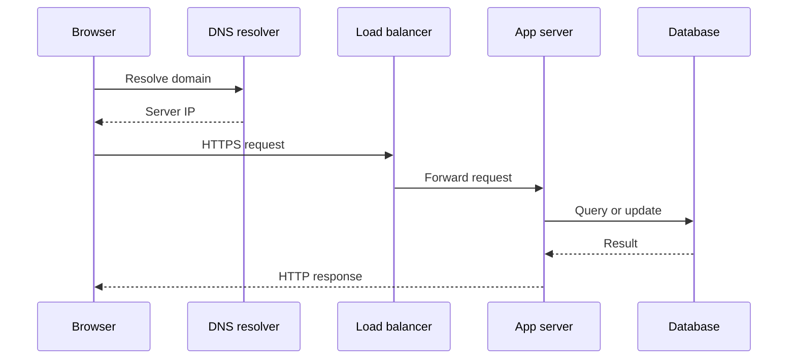
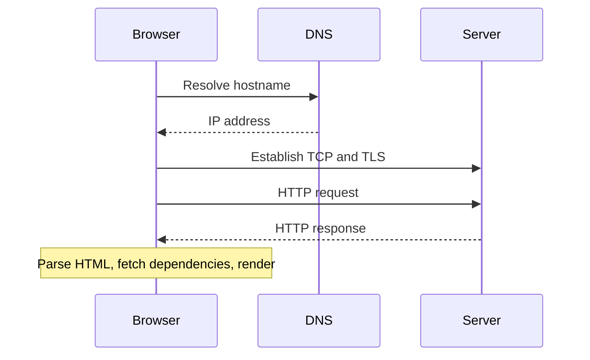
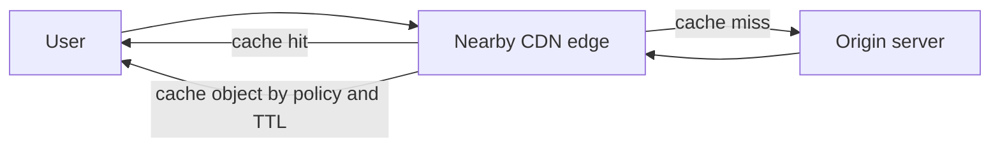
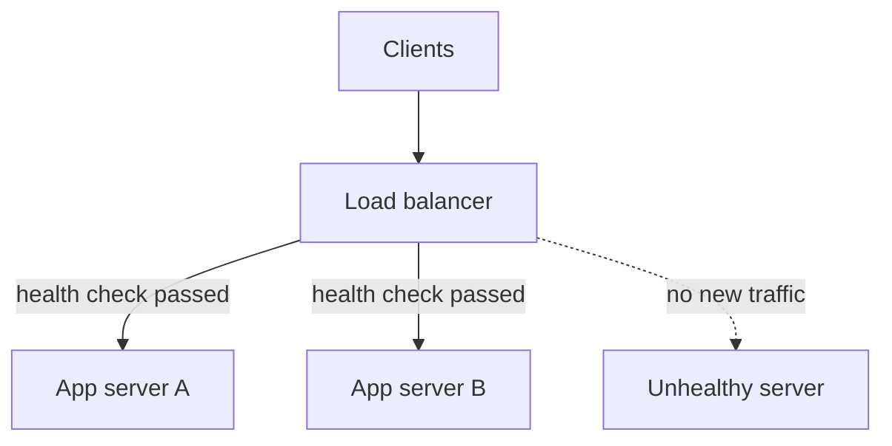
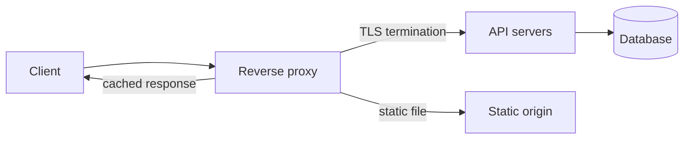

## 17. What is the Client-Server model?



**Client-Server model** হলো একটি distributed application structure যেখানে tasks বা workloads দুইটা party এর মধ্যে ভাগ করা হয়:

- **Client** — যে service বা resource **request** করে
- **Server** — যে সেই request **process** করে এবং response পাঠায়

```
Client  ──── Request ────►  Server
Client  ◄─── Response ────  Server
```

- Client একটা **request** পাঠায় (যেমন একটা webpage দেখতে চাওয়া)
- Server সেই request **process** করে
- Server একটা **response** পাঠায় (যেমন HTML page, data, etc.)

#### 🌍 Real-life Example

তুমি যখন browser এ `google.com` লেখো:
- তোমার **browser = Client**
- Google এর machine = **Server**
- Browser টা HTTP **request** পাঠায়, server **response** এ webpage পাঠিয়ে দেয়

#### ⚙️ Client-Server এর বৈশিষ্ট্য

| বিষয় | বিবরণ |
|---|---|
| **Scalability** | অনেক client একসাথে একটা server এ connect করতে পারে |
| **Centralized control** | Data এবং security server এ manage হয় |
| **Separation of concern** | Client UI নিয়ে কাজ করে, server logic ও data নিয়ে |
| **Protocol** | Communication এর জন্য HTTP, FTP, TCP/IP ব্যবহার হয় |

---

### 🔄 How does the peer-to-peer model differ from client-server?

ইন্টারনেট বা নেটওয়ার্কিং মডেলে **Client-Server** এবং **Peer-to-Peer (P2P)** হলো দুটি সম্পূর্ণ ভিন্ন মেকানিজম। আমরা এতক্ষণ DNS বা ISP নিয়ে যা আলোচনা করেছি, তার বেশিরভাগই ছিল Client-Server মডেল। কিন্তু P2P-র ধারণাটি একেবারেই আলাদা।

নিচে এদের পার্থক্য টেকনিক্যাল টার্মসহ সহজভাবে ব্যাখ্যা করা হলো:

---

#### ১. Client-Server Model (সেন্ট্রালাইজড মডেল)

এটি ইন্টারনেটের সবচেয়ে প্রচলিত মডেল। এখানে কাজের ভূমিকা স্পষ্ট দুই ভাগে বিভক্ত:

* **Server:** এটি একটি শক্তিশালী কম্পিউটার যা ডাটা বা সার্ভিস স্টোর করে রাখে এবং সবসময় অন থাকে। (যেমন: Google বা Facebook-এর সার্ভার)।
* **Client:** আপনার ফোন বা ল্যাপটপ যা সার্ভারের কাছে রিকোয়েস্ট পাঠায় এবং ডাটা গ্রহণ করে।
* **কাজের ধরন:** এখানে সব নিয়ন্ত্রণ থাকে সার্ভারের হাতে। আপনি যদি ফেসবুক ব্যবহার করতে চান, তবে আপনাকে অবশ্যই ফেসবুকের সার্ভারের সাথে যুক্ত হতে হবে।

> **অ্যানালজি:** এটি অনেকটা একটি **রেস্টুরেন্টের** মতো। আপনি হলেন **Client** (অর্ডার দেন), আর রেস্টুরেন্টের কিচেন হলো **Server** (খাবার তৈরি করে দেয়)। আপনি নিজে কিচেনে গিয়ে রান্না করতে পারবেন না।

---

#### ২. Peer-to-Peer (P2P) Model (ডিসেন্ট্রালাইজড মডেল)

এখানে কোনো ফিক্সড বা ডেডিকেটেড সার্ভার নেই। নেটওয়ার্কে যুক্ত প্রতিটি কম্পিউটার বা ডিভাইস একই সাথে **Client** এবং **Server** হিসেবে কাজ করে।

* **Peers:** নেটওয়ার্কে যুক্ত প্রতিটি ডিভাইসকে বলা হয় 'Peer'।
* **কাজের ধরন:** আপনি যখন একটি ফাইল ডাউনলোড করেন, তখন আপনি অন্য কারো কম্পিউটার থেকে নিচ্ছেন। আবার একই সাথে আপনার কম্পিউটারে থাকা ফাইলের অংশ অন্য কেউ আপনার কাছ থেকে নিচ্ছে।
* **উদাহরণ:** BitTorrent, Skype (আগে ছিল), এবং বর্তমানের **Blockchain** বা Bitcoin নেটওয়ার্ক।

> **অ্যানালজি:** এটি একটি **পটলক ডিনার (Potluck Party)**-এর মতো। যেখানে সবাই কিছু না কিছু খাবার নিয়ে আসে এবং সবাই সবার সাথে ভাগ করে খায়। এখানে কেউ আলাদা করে 'ওয়েটার' বা 'কুক' নয়।

---

#### ৩. প্রধান পার্থক্যসমূহ (Comparison Table)

| বৈশিষ্ট্য | Client-Server Model | Peer-to-Peer (P2P) Model |
| :--- | :--- | :--- |
| **Hierarchy** | এখানে একটি হায়ারার্কি বা স্তর থাকে (সার্ভার উপরে, ক্লায়েন্ট নিচে)। | এখানে সবাই সমান (**Equal Status**)। |
| **Control** | এটি **Centralized** (এক জায়গা থেকে নিয়ন্ত্রিত)। | এটি **Decentralized** (বিক্ষিপ্ত বা ছড়িয়ে থাকা)। |
| **Scalability** | ইউজার বাড়লে সার্ভারের ওপর চাপ বাড়ে এবং সার্ভার আপগ্রেড করতে হয়। | ইউজার যত বাড়ে, নেটওয়ার্ক তত বেশি শক্তিশালী এবং ফাস্ট হয়। |
| **Dependency** | সার্ভার ডাউন হলে পুরো নেটওয়ার্ক অকেজো হয়ে যায়। | একটি বা দুটি ডিভাইস (Node) বন্ধ হলেও নেটওয়ার্ক চালু থাকে। |
| **Cost** | সার্ভার মেইনটেইন করা বেশ ব্যয়বহুল। | এটি মেইনটেইন করা সস্তা, কারণ কোনো মেইন সার্ভার নেই। |

---

#### কেন আমরা P2P ব্যবহার করি?
২০২৬ সালের এই যুগে, P2P মডেলটি **Data Privacy** এবং **Resilience**-এর জন্য অত্যন্ত জনপ্রিয়। বিশেষ করে ডিসেন্ট্রালাইজড স্টোরেজ এবং ক্রিপ্টোকারেন্সির ক্ষেত্রে এর কোনো বিকল্প নেই। কারণ এখানে কোনো "Central Authority" নেই যে আপনার ডাটা বন্ধ করে দিতে পারবে।

তবে সিকিউরিটির দিক থেকে **Client-Server** বেশি নির্ভরযোগ্য, কারণ সেখানে ডাটা ম্যানেজমেন্ট এবং সিকিউরিটি প্যাচগুলো এক জায়গা থেকেই নিয়ন্ত্রণ করা যায়।

#### 🎯 কখন কোনটা ব্যবহার হয়?

- **Client-Server** → Banking system, websites, email server — যেখানে **security ও central control** দরকার।
- **P2P** → File sharing, **blockchain**, video calling (যেমন older Skype) — যেখানে **decentralization** দরকার।

> 💡 **সহজ কথায়:** Client-Server এ power একজনের হাতে, আর P2P তে power সবার মধ্যে ভাগ করা।

---

### ⚖️ What are the trade-offs between thin and thick clients?

**Thin Client** এবং **Thick Client** (যাকে **Fat Client** বা **Rich Client**ও বলে) — দুটোরই নিজস্ব সুবিধা ও অসুবিধা আছে। কোনটা ব্যবহার করবে সেটা নির্ভর করে তোমার **use case** এর উপর।

**Thin Client কী?**  
যে client নিজে খুব কম কাজ করে — বেশিরভাগ **processing** server এ হয়। এটা basically একটা "dumb terminal"। 
- **উদাহরণ:** Google Docs, web-based apps।

**Thick Client কী?**  
যে client নিজেই বেশিরভাগ **processing** করতে পারে, server এর উপর কম নির্ভরশীল। 
- **উদাহরণ:** Microsoft Word, Photoshop, desktop games।

#### 📊 Trade-offs এক নজরে:

| বিষয় | Thin Client | Thick Client |
|---|---|---|
| **Processing** | Server এ হয় | Locally হয় |
| **Hardware requirement** | কম powerful device চলে | Powerful device লাগে |
| **Internet dependency** | সবসময় internet লাগে | Offline এও কাজ করে |
| **Maintenance** | সহজ, server এ update দিলেই হয় | প্রতিটা device এ আলাদা update লাগে |
| **Security** | Data server এ থাকে, বেশি secure | Data locally থাকে, risk বেশি |
| **Performance** | Network slow হলে lag করে | Network ছাড়াও fast |
| **Cost** | কম খরচ (সস্তা hardware চলে) | বেশি খরচ (powerful hardware লাগে) |

#### 🎯 কখন Thin Client ভালো?
- Office environment যেখানে সবাই **web-based tools** use করে
- **Large organization** যেখানে central management দরকার
- যেখানে **security** অনেক গুরুত্বপূর্ণ (data কখনো local device এ যাবে না)

#### 🎯 কখন Thick Client ভালো?
- **High-performance** কাজ যেমন video editing, gaming, 3D rendering
- যেখানে **offline** কাজ করতে হবে
- যেখানে **low latency** দরকার, network এর উপর নির্ভর করা যাবে না

#### 🏢 Real-life উদাহরণ:
- **Thin Client** → Chromebook এ Google Docs চালানো। Device দুর্বল হলেও চলে কারণ সব কাজ Google এর server করে।
- **Thick Client** → তোমার PC তে Adobe Premiere চালানো। Internet ছাড়াও কাজ করে কারণ সব processing তোমার machine করে।

> 💡 **সহজ কথায়:** **Thin Client** সুবিধাজনক ও সস্তা কিন্তু internet এর উপর পুরোপুরি নির্ভরশীল। আর **Thick Client** powerful ও independent কিন্তু maintain করা কঠিন ও ব্যয়বহুল।

---

## 18. What are the differences between Client and Server in web applications?

ওয়েব অ্যাপ্লিকেশনে ক্লায়েন্ট এবং সার্ভারের আলাদা দায়িত্ব থাকে:

- **Client (Frontend):** ইউজারের সাথে সরাসরি ইন্টারঅ্যাক্ট করে। এটি HTML, CSS এবং JavaScript ব্যবহার করে ব্রাউজারে UI রেন্ডার করে।
- **Server (Backend):** এটি ইউজারের আড়ালে (behind the scenes) কাজ করে। এটি ডেটাবেস ম্যানেজ করে, সিকিউরিটি নিশ্চিত করে, এপিআই (API) হ্যান্ডেল করে এবং ব্যবসায়িক লজিক (Business Logic) প্রসেস করে।

---

### 🖥️ What is the difference between server-side rendering (SSR) and client-side rendering (CSR)?

| বৈশিষ্ট্য | Server-Side Rendering (SSR) | Client-Side Rendering (CSR) |
|---|---|---|
| **রেন্ডারিং কোথায় হয়** | সার্ভারে পুরো HTML পেজটি তৈরি হয়ে ব্রাউজারে পাঠানো হয়। | সার্ভার শুধু একটি ফাঁকা HTML এবং জাভাস্ক্রিপ্ট বান্ডেল পাঠায়, বাকিটা ব্রাউজারে রেন্ডার হয়। |
| **প্রাথমিক লোড টাইম (First Paint)** | খুব ফাস্ট, কারণ ব্রাউজার রেডিমেড পেজ দেখতে পায়। | কিছুটা স্লো, কারণ ব্রাউজারকে আগে JS ডাউনলোড এবং রান করতে হয়। |
| **SEO ফ্রেন্ডলি** | হ্যাঁ, সার্চ ইঞ্জিন ক্রলার খুব সহজেই পেজের কনটেন্ট রেডি অবস্থায় পেয়ে যায়। | আগে সমস্যা ছিল, তবে আধুনিক ক্রলারগুলো এখন JS রেন্ডার করতে পারে, তবুও SSR এর চেয়ে কঠিন। |
| **সার্ভার লোড** | বেশি থাকে, কারণ রিকোয়েস্ট এলেই সার্ভারকে পেজ জেনারেট করতে হয়। | অনেক কম, কারণ সার্ভার শুধু JSON ডাটা পাঠায়। |

---

### 💧 How does hydration work in modern full-stack frameworks?

**Hydration** হলো এমন একটি প্রক্রিয়া, যেখানে সার্ভার থেকে পাঠানো একটি স্ট্যাটিক HTML পেজকে ব্রাউজারে জাভাস্ক্রিপ্ট ব্যবহার করে ইন্টারঅ্যাক্টিভ (যেমন বাটনে ক্লিক করলে বা ইভেন্ট লিসেনার অ্যাড করে) করা হয়। 

Next.js বা Nuxt.js এর মতো ফ্রেমওয়ার্কে প্রথমে SSR এর মাধ্যমে দ্রুত স্ট্যাটিক পেজ দেখানো হয় এবং পরে Hydration এর মাধ্যমে পেজটিকে একটি পূর্ণাঙ্গ সিঙ্গেল পেজ অ্যাপ্লিকেশন (SPA) বানিয়ে ফেলা হয়।

---

## 19. What is the HTTP request-response cycle?



**HTTP Request-Response Cycle** হলো সেই process যার মাধ্যমে তোমার **browser** (client) এবং **web server** এর মধ্যে communication হয়। তুমি যখনই কোনো website visit করো, এই cycle টা ঘটে।

#### ⚙️ Step-by-step কিভাবে কাজ করে:

1. **URL Enter করা:** তুমি browser এ `www.example.com` লেখো। Browser প্রথমে **DNS lookup** করে — মানে domain name টাকে **IP address** এ convert করে।
2. **TCP Connection তৈরি:** Browser server এর সাথে একটা **TCP connection** establish করে। এটাকে বলে **3-way handshake** (SYN → SYN-ACK → ACK)।
3. **HTTP Request পাঠানো:** Browser server এ একটা **HTTP request** পাঠায়। এই request এ থাকে:
   - **Method** → `GET`, `POST`, `PUT`, `DELETE` ইত্যাদি
   - **Headers** → browser এর info, accepted content type ইত্যাদি
   - **Body** → (optional) POST request এ data থাকে
4. **Server Request Process করে:** Server request টা receive করে, প্রয়োজনমতো **database** থেকে data নেয় বা file খোঁজে, তারপর response তৈরি করে।
5. **HTTP Response পাঠানো:** Server client কে **HTTP response** পাঠায়। এতে থাকে:
   - **Status Code** → request সফল হয়েছে কিনা
   - **Headers** → content type, caching info ইত্যাদি
   - **Body** → actual HTML, JSON, image ইত্যাদি
6. **Browser Response Render করে:** Browser response পেয়ে **HTML, CSS, JavaScript** parse করে এবং তোমার সামনে webpage টা display করে।

#### 🚫 Stateless Protocol:
HTTP হলো **stateless** — মানে প্রতিটা request সম্পূর্ণ আলাদা। Server আগের request মনে রাখে না। এই সমস্যা সমাধানের জন্য **Cookies** এবং **Sessions** ব্যবহার করা হয়।

> 💡 **সহজ কথায়:** HTTP Request-Response Cycle হলো — তুমি **চাইলে**, server **দিলো**। এই পুরো process টা সাধারণত মাত্র কয়েক **milliseconds** এ শেষ হয়।

---

### 🌐 What happens at each layer of the OSI model during an HTTP request?

আপনি যখন ব্রাউজারে একটি URL লিখে এন্টার চাপেন, তখন সেই **HTTP Request** টি আপনার কম্পিউটার থেকে বের হওয়ার আগে **OSI Model**-এর ৭টি লেয়ারের মধ্য দিয়ে যায়। এই প্রক্রিয়াকে বলা হয় **Encapsulation**। 

নিচে প্রতিটি লেয়ারে ঠিক কী ঘটে তা ধাপে ধাপে ব্যাখ্যা করা হলো:

---

#### ১. Application Layer (Layer 7)
এটি ইউজারের সবচেয়ে কাছের লেয়ার। 
* **কী ঘটে:** আপনি যখন ব্রাউজারে `www.google.com` লেখেন, তখন এই লেয়ারে একটি **HTTP GET Request** তৈরি হয়। এখানে ডাটার সাথে বিভিন্ন Header (যেমন- User-Agent, Accept-Language) যুক্ত হয়।

#### ২. Presentation Layer (Layer 6)
এই লেয়ারটি ডাটার ফরম্যাট এবং সিকিউরিটি নিশ্চিত করে।
* **কী ঘটে:** এখানে ডাটাকে **Encryption** (যেমন- SSL/TLS ব্যবহার করে HTTPS-এ রূপান্তর) করা হয় যেন হ্যাকাররা তা পড়তে না পারে। এছাড়া ডাটা **Compression** বা ফরম্যাটিংও এখানেই হয়।

#### ৩. Session Layer (Layer 5)
এটি দুই ডিভাইসের মধ্যে সংযোগ তৈরি এবং বজায় রাখে।
* **কী ঘটে:** এটি আপনার কম্পিউটার এবং সার্ভারের মধ্যে একটি **Session** তৈরি করে। এটি নিশ্চিত করে যে একটি রিকোয়েস্টের উত্তর যেন সঠিক সেশনেই ফিরে আসে।


#### ৪. Transport Layer (Layer 4)
এখানেই ঠিক হয় ডাটা কীভাবে পৌঁছাবে।
* **কী ঘটে:** HTTP-র জন্য এখানে **TCP (Transmission Control Protocol)** ব্যবহার করা হয়। 
    * ডাটাকে ছোট ছোট **Segments**-এ ভাগ করা হয়।
    * এর সাথে **Source Port** এবং **Destination Port** (যেমন- HTTP-র জন্য ৮০ বা HTTPS-এর জন্য ৪৪৩) যুক্ত করা হয়।
    * এখানে **Three-way Handshake** সম্পন্ন হয়ে একটি নির্ভরযোগ্য কানেকশন তৈরি হয়।

#### ৫. Network Layer (Layer 3)
এই লেয়ারে ঠিক হয় ডাটা কোন রাস্তা দিয়ে যাবে।
* **কী ঘটে:** এখানে সেগমেন্টগুলো **Packets**-এ পরিণত হয়। 
    * প্যাকেটের সাথে **Source IP Address** এবং **Destination IP Address** যুক্ত করা হয়। 
    * **Routing** এর মাধ্যমে ইন্টারনেটের সেরা পথটি নির্ধারণ করা হয়।


#### ৬. Data Link Layer (Layer 2)
এটি ফিজিক্যাল কানেকশনের ঠিক উপরের স্তর।
* **কী ঘটে:** এখানে প্যাকেটগুলো **Frames**-এ রূপান্তর করা হয়। 
    * এখানে ডিভাইসের হার্ডওয়্যার অ্যাড্রেস বা **MAC Address** যুক্ত করা হয়। 
    * এরর চেক করার জন্য একটি **FCS (Frame Check Sequence)** যোগ করা হয় যেন ডাটা ভুল না যায়।

#### ৭. Physical Layer (Layer 1)
এটি একদম শেষ ধাপ যেখানে ডাটা তার বা বাতাসের মাধ্যমে যাতায়াত করে।
* **কী ঘটে:** উপরের সব লেয়ারের কাজ শেষ হওয়ার পর ডিজিটাল ডাটা (0s and 1s) **Bits**-এ রূপান্তরিত হয়। এরপর এই বিটগুলো ইলেক্ট্রিক্যাল সিগন্যাল (তারে), লাইট সিগন্যাল (ফাইবারে) বা রেডিও ওয়েভ (ওয়াইফাইতে) হিসেবে প্রবাহিত হয়।

>সার্ভার যখন এই রিকোয়েস্টটি পায়, তখন সে নিচ থেকে উপরে (Layer 1 থেকে Layer 7) উল্টোভাবে কাজ করে ডাটাটি পড়ে (যাকে বলা হয় **Decapsulation**)। এরপর সার্ভার তার **HTTP Response** তৈরি করে আবার একইভাবে লেয়ার ১ দিয়ে পাঠিয়ে দেয়।
----

#### 🛤️ পুরো Journey এক নজরে:

```text
তুমি URL লিখলে
        ↓
[L7] HTTP Request তৈরি
        ↓
[L6] TLS Encryption
        ↓
[L5] Session তৈরি
        ↓
[L4] TCP Segments + Port নির্ধারণ
        ↓
[L3] IP Packets + Route নির্ধারণ
        ↓
[L2] Ethernet Frames + MAC Address
        ↓
[L1] Electrical/Radio Signals
        ↓
    🌐 Internet
        ↓
Server এ উল্টো দিকে L1 → L7
        ↓
Server Response পাঠায়
        ↓
তোমার Browser Webpage দেখায়
```

---

### ⏳ How does HTTP keep-alive affect the request-response cycle?

সাধারণত প্রতিটি HTTP রিকোয়েস্টের জন্য সার্ভারের সাথে নতুন করে TCP কানেকশন তৈরি করতে হয়, যা বেশ সময়সাপেক্ষ। **HTTP Keep-Alive** চালু থাকলে, আগের কানেকশনটি সঙ্গে সঙ্গে বন্ধ না হয়ে কিছুক্ষণ খোলা (persistent) থাকে। 

ফলে ব্রাউজার একই কানেকশন ব্যবহার করে পর পর কয়েকটি রিকোয়েস্ট (যেমন HTML এর পর CSS ও ছবি) পাঠাতে পারে, এতে ল্যাটেন্সি অনেক কমে যায়।

---

### 🤔 What is the difference between a "stateless" and "stateful" protocol in this cycle?

**Stateless Protocol কী?**  
প্রতিটা **request সম্পূর্ণ independent**। Server আগের কোনো request মনে রাখে পণ্ডিত করে না। প্রতিবার নতুন request আসলে server তাকে একজন **সম্পূর্ণ নতুন visitor** মনে করে। **HTTP by default stateless।**

**Stateful Protocol কী?**  
Server **previous interactions মনে রাখে**। Client এবং Server এর মধ্যে একটা ongoing **"conversation"** চলতে থাকে। State বা context সংরক্ষিত থাকে।

#### 🔑 তাহলে HTTP Stateless হলে Login কিভাবে কাজ করে?
এটাই মূল প্রশ্ন। HTTP stateless হওয়ার কারণে তোমাকে প্রতিটা request এ নতুন করে চিনতে পারার জন্য কিছু **workaround** use করা হয়:

1. **Cookies:** Server তোমার browser এ একটা ছোট **cookie** রেখে দেয়। পরের request এ browser সেই cookie পাঠায় — server তখন তোমাকে চিনতে পারে।
2. **Sessions:** Server এর side এ একটা **session** তৈরি হয় এবং একটা unique **session ID** দেওয়া হয়। সেই ID cookie তে রাখা হয়।
3. **JWT (JSON Web Token):** Modern apps এ **JWT token** use হয়। Token এ encrypted আকারে user এর info থাকে, প্রতিটা request এ সেই token পাঠানো হয়।

#### 🎯 কোনটা কখন ভালো?

- **Stateless ভালো যখন:** High traffic website (যেমন REST API, CDN), Scalability দরকার।
- **Stateful ভালো যখন:** Real-time communication (যেমন online gaming, live chat), Long-running transactions।

> 💡 **সহজ কথায়:** **Stateless** মানে server এর কোনো স্মৃতি নেই। আর **Stateful** মানে server সব মনে রাখে। HTTP stateless হলেও **Cookies, Sessions এবং Tokens** দিয়ে আমরা কৃত্রিমভাবে state তৈরি করি।

---

## 20. How do browsers act as clients that request resources from web servers?

Browser হলো একটা sophisticated **HTTP Client** যে web server থেকে resources request করে এবং display করে।

#### ⚙️ কিভাবে কাজ করে

1. **URL Parse** — `https://example.com/page` → Protocol, Domain, Path এ ভাগ হয়
2. **DNS Resolution** — Domain name কে IP address এ convert করে
3. **TCP + TLS Handshake** — Server এর সাথে secure connection তৈরি করে
4. **HTTP Request পাঠায়** — Method, Headers, Body সহ request যায়
5. **Response Receive** — Server HTML/CSS/JS/images পাঠায়
6. **Render করে** — Browser content parse করে screen এ display করে

#### 🧩 Browser এর Main Components

| Component | কাজ |
|---|---|
| **Rendering Engine** | HTML/CSS parse করে (Chrome: Blink, Firefox: Gecko) |
| **JS Engine** | JavaScript execute করে (Chrome: V8) |
| **Network Layer** | HTTP requests handle করে |
| **Storage** | Cookies, Cache, LocalStorage manage করে |

> 💡 Browser একটাই page load এ **80-100টা** resource request করে — CSS, JS, images, fonts সব parallel এ।

---

### 🎨 What is the browser's critical rendering path?

CRP হলো সেই steps যা browser follow করে HTML/CSS/JS কে screen এ **pixels এ** convert করতে।

#### 🛤️ Steps:
```text
HTML → DOM Tree
CSS  → CSSOM Tree
         ↓
DOM + CSSOM → Render Tree
         ↓
       Layout      ← কোথায়, কত বড়?
         ↓
       Paint       ← pixels draw করে
         ↓
    Compositing    ← GPU দিয়ে layers merge
         ↓
    Screen Display 🖥️
```

#### 🚧 Render Blocking Resources:

| Resource | Blocking? | সমাধান |
|---|---|---|
| **CSS** | ✅ Render blocking | Critical CSS inline করো |
| **JS (normal)** | ✅ Parser blocking | `defer` বা `async` use করো |
| **JS (defer)** | ❌ Non-blocking | ✅ Best practice |
| **Images** | ❌ Non-blocking | `loading="lazy"` use করো |

> ⚠️ CSS এবং JS হলো **render-blocking** — এগুলো load না হওয়া পর্যন্ত browser rendering শুরু করে না।

---

### ⚡ How do browsers handle concurrent requests to the same server?

Browser একসাথে অনেক resource request করে — HTTP version অনুযায়ী এটা আলাদাভাবে handle হয়।

#### 📈 HTTP Version Evolution:

- **HTTP/1.0** — প্রতিটা request এ আলাদা TCP connection, শেষ হলে বন্ধ। সবচেয়ে ধীর।
- **HTTP/1.1** — Persistent connection এলো, একই TCP reuse হয়। কিন্তু **Head-of-Line Blocking** সমস্যা ছিল — বড় file আটকে থাকলে বাকি সব অপেক্ষায়। সমাধান হিসেবে browser **6টা parallel TCP connection** খোলে।
- **HTTP/2** — **Multiplexing** এলো — একটাই TCP connection এ অনেক request একসাথে। আরো আছে Header Compression (HPACK), Server Push, Stream Prioritization।
- **HTTP/3** — TCP এর বদলে **QUIC (UDP)** protocol। একটা stream এ packet loss হলেও বাকিগুলো চলে। Built-in TLS encryption।

#### 📊 Comparison:

| Feature | HTTP/1.1 | HTTP/2 | HTTP/3 |
|---|---|---|---|
| **Protocol** | TCP | TCP | QUIC (UDP) |
| **Connections** | Multiple (6) | একটা | একটা |
| **Multiplexing** | ❌ | ✅ | ✅ |
| **Header Compression** | ❌ | ✅ HPACK | ✅ QPACK |
| **HOL Blocking** | ✅ আছে | ⚠️ আংশিক | ❌ নেই |
| **Built-in Encryption** | ❌ | ❌ | ✅ |

#### 🚦 Request Priority Queue:

Browser সব request একসাথে পাঠায় না — priority অনুযায়ী সাজায়:
- 🔴 **Highest** — HTML, Critical CSS
- 🟠 **High** — Render-blocking JS, Fonts
- 🟡 **Medium** — Images (viewport এ আছে)
- 🟢 **Low** — Images (viewport এর বাইরে)
- ⚫ **Lowest** — Prefetch resources

> 💡 **Analogy:** HTTP/1.1 = একজন waiter একবারে একটা order। HTTP/2 = একজন দক্ষ waiter সব একসাথে। HTTP/3 = সেই waiter, একটা dish পুড়লেও বাকি সব deliver চলে।

---

## 21. What are web servers and web hosting?

- **Web Server:** এটি হলো ইন্টারনেট সংযুক্ত একটি কম্পিউটার এবং সফটওয়্যার (যেমন Apache বা Nginx), যা ক্লায়েন্ট থেকে আসা HTTP রিকোয়েস্টগুলো গ্রহণ করে এবং ওয়েবসাইটের ফাইল বা ডেটাগুলো ক্লায়েন্টকে সার্ভ করে।
- **Web Hosting:** এটি একটি সার্ভিস, যা ব্যক্তি বা প্রতিষ্ঠানকে ওয়েব সার্ভারে স্টোরেজ বা স্পেস ভাড়া দেয়, যাতে ওয়েবসাইট বা অ্যাপ্লিকেশনটি সার্বক্ষণিক ইন্টারনেটে লাইভ থাকে।

---

### 🏢 What is the difference between shared hosting, VPS, and dedicated servers?

| হোস্টিং টাইপ | ব্যাখ্যা | উদাহরণ |
|---|---|---|
| **Shared Hosting** | একটি ফিজিক্যাল সার্ভারের রিসোর্স (CPU, RAM) শত শত ওয়েবসাইটের সাথে শেয়ার করা হয়। | একটি ট্রেন বগির মতো। স্পিড কম হতে পারে, তবে সস্তা। |
| **VPS (Virtual Private Server)** | একটি সার্ভার ভারচুয়ালাইজেশনের মাধ্যমে কয়েকটি ভাগে বিভক্ত করা হয়। এখানে আপনার জন্য নির্দিষ্ট রিসোর্স বরাদ্দ থাকে। | অ্যাপার্টমেন্ট বিল্ডিংয়ের মতো। প্রাইভেসি ও কন্ট্রোল বেশি। |
| **Dedicated Server** | সম্পূর্ণ একটি ফিজিক্যাল সার্ভার শুধুমাত্র আপনার ওয়েবসাইটের জন্য বরাদ্দ থাকে। এখানে কেউ রিসোর্স শেয়ার করে পণ্ডিত করে না। | নিজের প্রাইভেট বাড়ির মতো। সবচেয়ে ফাস্ট এবং ব্যয়বহুল। |

---

### ☁️ What is serverless hosting and how does it differ from traditional hosting?

**Serverless Hosting (বা Serverless Computing)** হলো ক্লাউড প্রোভাইডারদের (যেমন AWS Lambda, Vercel) এমন একটি মডেল, যেখানে সার্ভারের ব্যবস্থাপনা বা স্কেলিং নিয়ে ডেভেলপারকে ভাবতে হয় না।

- **পার্থক্য:** ট্র্যাডিশনাল হোস্টিংয়ে সবসময় সার্ভার রানিং রাখতে হয় এবং ট্রাফিক না থাকলেও বিল দিতে হয়। কিন্তু সার্ভারলেস মডেলে অ্যাপ্লিকেশন বা ফাংশন শুধুমাত্র ট্রাফিক এলেই ট্রিগার হয়, এবং আপনি শুধু যতটুকু সময় কোড এক্সিকিউট হয়েছে, তার জন্যই বিল দেবেন (Pay-as-you-go)।

---

## 22. What is a Content Delivery Network (CDN), and how does it improve website performance?



**CDN (Content Delivery Network)** হলো বিশ্বব্যাপী ছড়িয়ে থাকা প্রক্সি সার্ভার বা ডেটা সেন্টারের একটি সিস্টেম।

- যদি আপনার মূল সার্ভার আমেরিকায় থাকে, তবে বাংলাদেশ বা সার্ভার থেকে দূরে অবস্থান করা কোনো ইউজারের সাইট লোড হতে অনেক সময় লাগবে। 
- CDN আপনার সাইটের স্ট্যাটিক কনটেন্টগুলো (ছবি, সিএসএস, জেএস) বিশ্বের বিভিন্ন স্থানে (যেমন ইন্ডিয়া বা সিঙ্গাপুরে) ক্যাশ করে রাখে। ফলে ইউজার যখন রিকোয়েস্ট করে, তখন তার সবচেয়ে কাছের CDN নোড বা "Edge Server" থেকে ডেটা সার্ভ করা হয়। এতে পারফরম্যান্স এবং স্পিড উল্লেখযোগ্যহারে বৃদ্ধি পায়।

---

### 📥 What is the difference between a pull CDN and a push CDN?

| বৈশিষ্ট্য | Pull CDN | Push CDN |
|---|---|---|
| **কীভাবে কাজ করে?** | যখন কোনো ইউজার প্রথমবার રিকোয়েস্ট করে, তখন CDN মূল সার্ভার থেকে ডেটা "টেনে" (pull) এনে নিজের কাছে রাখে এবং ইউজারকে দেয়। | ব্যাকএন্ড ডেভেলপার আপডেট করার সাথে সাথেই মূল সার্ভার থেকে ডেটা CDN-এ সরাসরি "ঠেলে" (push) পাঠিয়ে দেওয়া হয়। |
| **উপযোগিতা** | যেসব ওয়েবসাইটে প্রচুর ট্রাফিক থাকে এবং হাজার হাজার ছোট ফাইল থাকে, সেখানে ফাস্ট সেটআপের জন্য এটি দারুণ। | যেখানে ট্রাফিক কম, ফাইল সাইজ বড় বা যে কনটেন্টগুলো কদাচিৎ পরিবর্তন হয়, সেখানে এটি কাজে দেয়। |

---

### 🧹 How does cache invalidation work in a CDN?

CDN-এ একবার ফাইল রেখে দিলে সেটি নির্দিষ্ট সময় পর্যন্ত (TTL) স্টোর হয়ে থাকে। কিন্তু ডেভেলপার যদি ওই ফাইলটি আপডেট করেন, তখন ইউজাররা আগের ফাইলটি দেখতে থাকে। 

এর সমাধানে **Cache Invalidation (বা Purge / Eviction)** করা হয়, যার মাধ্যমে CDN থেকে জোরপূর্বক পুরোনো ফাইলটি মুছে দেওয়া হয় যাতে CDN আবার মূল সার্ভার থেকে নতুন আপডেট করা ফাইলটি ফেচ করতে বাধ্য হয়।

---

### ⚡ Edge Computing and its relation to CDNs

সাধারণত সব ধরনের প্রসেসিং বা কোড রান করানো হয় মূল সার্ভারে (Origin Server)। কিন্তু **Edge Computing** হলো সেই কনসেপ্ট যেখানে কাস্টম ফাংশন বা কিছু ব্যাকএন্ড লজিক (যেমন ইউজারের অথেন্টিকেশন বা রিডাইরেক্ট) ইউজারদের একদম কাছের বা "Edge" এ থাকা CDN সার্ভারে রান করা হয়। 

- Cloudflare Workers, AWS Lambda@Edge হলো এর উদাহরণ। এটি origin server-এর চাপ ও network round-trip কমিয়ে user-এর response latency অনেক ক্ষেত্রে milliseconds পর্যায়ে নামাতে পারে; actual latency workload ও network path-এর ওপর নির্ভর করে।

---

## 23. What is the role of load balancers in managing server traffic?



**Load Balancer (লোড ব্যালেন্সার)** হলো এমন একটি ডিভাইস বা সফটওয়্যার যা ইউজারের রিকোয়েস্ট এবং সার্ভারগুলোর মাঝখানে ট্রাফিক পুলিশের মতো দাঁড়িয়ে থাকে। 

একটি অতিরিক্ত ভিজিটর বা হাই ট্রাফিক সাইটে, রিকোয়েস্টগুলো কোনো একটি সলিড সার্ভারে না পাঠিয়ে, লোড ব্যালেন্সার সেটি একাধিক সার্ভারের মাঝে সমানভাবে বা নির্দিষ্ট নিয়মে ভাগ (distribute) করে দেয়। এতে কোনো একটি সার্ভার ওভারলোড বা ক্র্যাশ হওয়া থেকে রক্ষা পায় এবং অ্যাপ্লিকেশনটি সার্বক্ষণিক সচল (highly available) থাকে।

---

### ⚖️ What are the differences between Layer 4 and Layer 7 load balancing?

লোড ব্যালেন্সিং হলো একটি নেটওয়ার্কিং টেকনিক যা ইনকামিং ট্রাফিককে একাধিক সার্ভারের মধ্যে ভাগ করে দেয়। একজন ইঞ্জিনিয়ার হিসেবে **Layer 4 (L4)** এবং **Layer 7 (L7)** লোড ব্যালেন্সারের পার্থক্য বোঝা অত্যন্ত জরুরি।

নিচে এদের প্রধান পার্থক্যগুলো বিস্তারিতভাবে আলোচনা করা হলো:

#### ১. Layer 4 (L4) Load Balancing:
এটি OSI মডেলের **Transport Layer** বা লেয়ার ৪-এ কাজ করে।

* **ভিত্তি:** এটি ট্রাফিক ডিস্ট্রিবিউশন করার সময় শুধুমাত্র **IP Address** এবং **TCP/UDP Port Number**-এর ওপর ভিত্তি করে সিদ্ধান্ত নেয়।
* **প্যাকেট ইন্সপেকশন:** এটি ডাটা প্যাকেটের ভেতরে কী আছে তা খুলে দেখে না। অর্থাৎ, এটি জানে না যে কোনো ইউজার কোন নির্দিষ্ট ফাইল বা ইউআরএল (URL) রিকোয়েস্ট করেছেন。
* **পারফরম্যান্স:** যেহেতু এটি প্যাকেট এনালাইসিস করে না, তাই এটি অত্যন্ত দ্রুত কাজ করে এবং কম প্রসেসিং পাওয়ার ব্যবহার করে।

#### ২. Layer 7 (L7) Load Balancing:
এটি OSI মডেলের **Application Layer** বা লেয়ার ৭-এ কাজ করে।

* **ভিত্তি:** এটি অনেক বেশি "স্মার্ট" এবং ফ্লেক্সিবল। এটি রিকোয়েস্টের ভেতরের কন্টেন্ট যেমন— **URL**, **HTTP Headers**, **Cookies**, বা নির্দিষ্ট **Path**-এর ওপর ভিত্তি করে সিদ্ধান্ত নিতে পারে।
* **প্যাকেট ইন্সপেকশন:** এটি ডাটা প্যাকেটগুলো সম্পূর্ণভাবে বিশ্লেষণ করে দেখে। উদাহরণস্বরূপ, যদি কোনো রিকোয়েস্ট `/images` প্যাথের জন্য আসে, তবে এটি ইমেজ সার্ভারে পাঠাবে এবং যদি `/api` প্যাথের জন্য আসে, তবে এটি এপিআই সার্ভারে পাঠাবে 。
* **সুবিধা:** এর মাধ্যমে আরও উন্নত ট্রাফিক ম্যানেজমেন্ট এবং সিকিউরিটি নিশ্চিত করা সম্ভব, যেমন—নির্দিষ্ট ইউজারের জন্য সেশন পারসিস্টেন্স (Session Persistence) বজায় রাখা।

---

### 🧮 What load balancing algorithms are commonly used?

লোড ব্যালেন্সাররা বিভিন্ন অ্যালগরিদম ব্যবহার করে ট্রাফিক ডিস্ট্রিবিউট করে:

- **Round Robin:** খুব সিম্পল। প্রথম রিকোয়েস্ট সার্ভার-১ এ, দ্বিতীয়টি সার্ভার-২ এ, তৃতীয়টি সার্ভার-৩ এ.. এভাবে সাইক্লিক আকারে ঘুরতে থাকে।
- **Least Connections:** যেই সার্ভারের সাথে বর্তমানে সবচেয়ে কম ক্লায়েন্ট কানেক্টেড আছে বা যেই সার্ভারটি সবচেয়ে বেশি ফ্রি, তাকে রিকোয়েস্ট দেওয়া হয়।
- **IP Hash:** ক্লায়েন্টের IP অ্যাড্রেসটিকে হ্যাশ (Hash) করে নির্ধারণ করা হয় কোন সার্ভারের কাছে রিকোয়েস্ট পাঠাতে হবে। এর সুবিধা হচ্ছে, একজন ব্যবহারকারী সবসময় নির্দিষ্ট একটি সার্ভারে যায়, যা স্ট্যাট বা সেশন (Session) সংরক্ষণের জন্য বেশ গুরুত্বপূর্ণ।

---

## 24. What are reverse proxies, and how do they enhance backend server performance?



**Reverse Proxy** হলো এমন একটি সার্ভার, যা মূল ব্যাকএন্ড সার্ভারের সামনে বসে ক্লায়েন্ট থেকে আসা রিকোয়েস্টগুলোকে গ্রহণ করে। ক্লায়েন্ট কখনো ডিরেক্ট ব্যাকএন্ড সার্ভারের আইপি জানতে পারে না, তারা মনে করে রিভার্স প্রক্সিটিই মূল সার্ভার।

- **নিরাপত্তা প্রদান:** ব্যাকএন্ড সার্ভারের আসল আইপি লুকিয়ে রাখে, ফলে ডিরেক্ট হ্যাকিং থেকে রক্ষা পায়।
- **ক্যাশিং:** রিভার্স প্রক্সি প্রায়শই ডাইনামিক ডেটা বা ভারী রিপিট হওয়া রেসপন্স ক্যাশ করে রাখে যেন ব্যাকএন্ডকে কষ্ট করতে না হয়। 
- **কম্প্রেশন:** ব্যাকএন্ড টিমের পাঠানো ফাইলকে গিজিপ (Gzip/Brotli) কম্প্রেস করে ইউজারকে দেয়, এতে লোডিং টাইম অনেক কমে যায়।

---

### 🎭 What is the difference between a reverse proxy and a forward proxy?

| প্রক্সি টাইপ | কার জন্য কাজ করে? | উদাহরণ / কাজ |
|---|---|---|
| **Forward Proxy** | ক্লায়েন্টের (ইউজারের) জন্য। | আপনার অফিস বা স্কুলের প্রক্সি, যা আপনি ইন্টারনেটে কোথায় যাচ্ছেন তা নিয়ন্ত্রণ এবং ফিল্টার করে। ইন্টারনেট কখনোই জানতে পারে পণ্ডিত করে না আসল ইউজার কে (অনেকটা VPN এর মত)। |
| **Reverse Proxy** | সার্ভারের জন্য। | ব্যাকএন্ড সার্ভারের সামনে বসে ক্লায়েন্টের রিকোয়েস্টগুলো গ্রহণ করে এবং সার্ভার থেকে ডেটা এনে ক্লায়েন্টকে দেয়। ইউজার কখনোই জানতে পারে না পেছনের আসল সার্ভার কোনটি। |

---

### 🔄 How does Nginx function as both a reverse proxy and a web server?

Nginx একই সাথে চমৎকার ওয়েব সার্ভার এবং রিভার্স প্রক্সি হিসেবে কাজ করতে পারে:

- **ওয়েব সার্ভার হিসেবে:** এটি ডিস্ক থেকে সরাসরি স্ট্যাটিক ফাইল (HTML, CSS, Image) সার্ভ করতে পারে।
- **রিভার্স প্রক্সি হিসেবে:** যখন ইউজারের কোনো ডায়নামিক বা এপিআই (API) রিকোয়েস্ট আসে, Nginx সেটি রিসিভ করে পেছনের Node.js বা Python সার্ভারের কাছে ফরোওয়ার্ড করে দেয় এবং তাদের থেকে পাওয়া রেসপন্সগুলো ইউজারের কাছে ফেরত পাঠায়।

---

### 🔒 How do reverse proxies help with SSL termination and caching?

- **SSL Termination:** HTTPS কানেকশনগুলো প্রসেস এনক্রিপ্ট বা ডিক্রিপ্ট করতে প্রচুর CPU পাওয়ার দরকার হয়। রিভার্স প্রক্সি (যেমন Nginx, HAProxy) এই এনক্রিপশন কাজের দায়িত্ব নেয়। প্রক্সি পর্যন্ত ক্লায়েন্ট এবং প্রক্সির মধ্যে HTTPS থাকে, আর প্রক্সি থেকে ব্যাকেন্ড সার্ভারে কমিউনিকেশন সাধারণ HTTP-তে হয়। এর ফলে ব্যাকেন্ড সার্ভারগুলো শুধু ডেটা প্রসেসিংয়ে ফোকাস করতে পারে।��ল — বড় file আটকে থাকলে বাকি সব অপেক্ষায়। সমাধান হিসেবে browser **6টা parallel TCP connection** খোলে।

**HTTP/2** — **Multiplexing** এলো — একটাই TCP connection এ অনেক request একসাথে। আরো আছে Header Compression (HPACK), Server Push, Stream Prioritization।

**HTTP/3** — TCP এর বদলে **QUIC (UDP)** protocol। একটা stream এ packet loss হলেও বাকিগুলো চলে। Built-in TLS encryption।

#### Comparison

| Feature | HTTP/1.1 | HTTP/2 | HTTP/3 |
|---|---|---|---|
| **Protocol** | TCP | TCP | QUIC (UDP) |
| **Connections** | Multiple (6) | একটা | একটা |
| **Multiplexing** | ❌ | ✅ | ✅ |
| **Header Compression** | ❌ | ✅ HPACK | ✅ QPACK |
| **HOL Blocking** | ✅ আছে | ⚠️ আংশিক | ❌ নেই |
| **Built-in Encryption** | ❌ | ❌ | ✅ |

#### Request Priority Queue

Browser সব request একসাথে পাঠায় না — priority অনুযায়ী সাজায়:

- 🔴 **Highest** — HTML, Critical CSS
- 🟠 **High** — Render-blocking JS, Fonts
- 🟡 **Medium** — Images (viewport এ আছে)
- 🟢 **Low** — Images (viewport এর বাইরে)
- ⚫ **Lowest** — Prefetch resources

> 💡 **Analogy:** HTTP/1.1 = একজন waiter একবারে একটা order। HTTP/2 = একজন দক্ষ waiter সব একসাথে। HTTP/3 = সেই waiter, একটা dish পুড়লেও বাকি সব deliver চলে।
