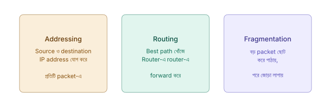
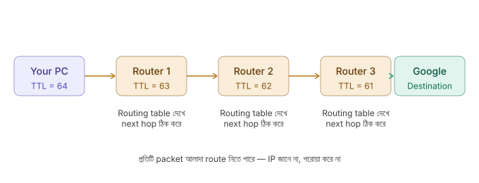
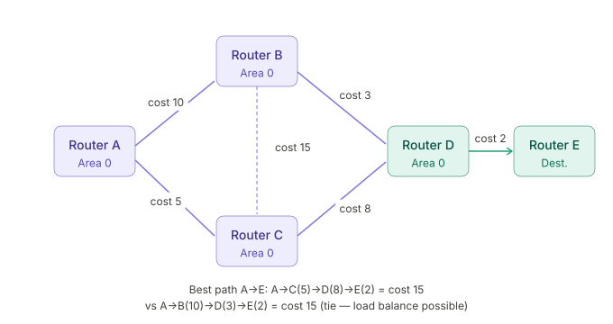
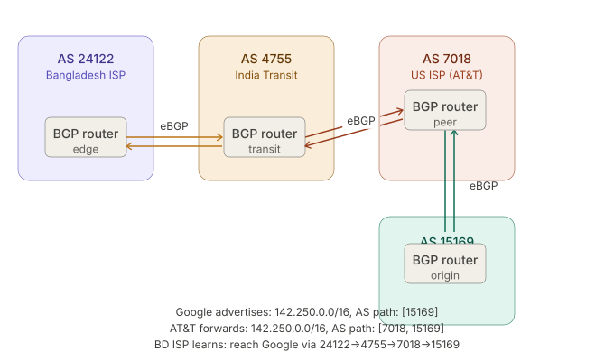

## 🌐 36. What is TCP/IP, and why is it fundamental for data transmission?
**TCP/IP** হলো দুটো protocol-এর সমন্বয়:
- 📦 **TCP** (Transmission Control Protocol) — data নির্ভরযোগ্যভাবে পাঠানোর নিয়ম
- 🏷️ **IP** (Internet Protocol) — data কোথায় পাঠাবে সেটা ঠিক করার নিয়ম

এই দুটো মিলে internet-এর **backbone** তৈরি করে। তোমার browser থেকে শুরু করে email, video call — সব কিছুই TCP/IP-এর উপর চলে।

#### 📊 TCP/IP Model — 4টি Layer



প্রতিটা layer-এর আলাদা কাজ আছে — একটা আরেকটার উপর নির্ভর করে।

#### 🛠️ প্রতিটি Layer কী করে?

##### Layer 1 — Network Access Layer (সবার নিচে)
Physical medium দিয়ে data পাঠানোর কাজ করে।
```text
কাজ: bits → electrical signal / radio wave / light pulse
উদাহরণ: Ethernet cable, Wi-Fi, fiber optic
```

##### Layer 2 — Internet Layer
Data কোন path দিয়ে যাবে সেটা ঠিক করে।
```text
কাজ: IP address দেখে সঠিক destination খোঁজে
IP packet তৈরি করে — source IP + destination IP যোগ করে
Router এই layer-এ কাজ করে
```

##### Layer 3 — Transport Layer
Data নির্ভরযোগ্যভাবে পৌঁছাচ্ছে কিনা নিশ্চিত করে।
```text
TCP: নিশ্চিত delivery, error check, order maintain
UDP: দ্রুত কিন্তু guarantee নেই
Port number এই layer-এ থাকে (80, 443, 22...)
```

##### Layer 4 — Application Layer (সবার উপরে)
User যা দেখে সেই data তৈরি হয় এখানে।
```text
HTTP → webpage
SMTP → email
DNS  → domain name lookup
FTP  → file transfer
```

#### 🔄 TCP কীভাবে Data পাঠায়?

##### ধাপ ১ — Three-Way Handshake (Connection স্থাপন)

```text
Client                    Server
  |                          |
  |——— SYN ————————————————→ |   "আমি connect করতে চাই"
  |                          |
  | ←——— SYN-ACK ————————————|   "ঠিক আছে, আমি প্রস্তুত"
  |                          |
  |——— ACK ————————————————→ |   "চমৎকার, শুরু করি"
  |                          |
  |====== Data Transfer ======|
```

##### ধাপ ২ — Data Segmentation (ভাগ করা)

বড় data একবারে পাঠানো যায় না — TCP সেটা ছোট ছোট **segment**-এ ভাগ করে:

```text
"Hello, how are you doing today?" (32 bytes)
         ↓ TCP ভাগ করে
Segment 1: "Hello, how"     [Seq: 1]
Segment 2: " are you do"    [Seq: 2]
Segment 3: "ing today?"     [Seq: 3]

প্রতিটা segment-এ থাকে:
  → Sequence number (order জানার জন্য)
  → Checksum (error detect করার জন্য)
  → Source & destination port
```

##### ধাপ ৩ — IP Routing (পথ খোঁজা)

TCP segment-এর উপর IP একটা **header** যোগ করে — এটাই **packet**:

```text
IP Packet:
┌─────────────────────────────────┐
│ Source IP:      192.168.1.5     │
│ Destination IP: 142.250.80.46   │
│ TTL:            64              │
├─────────────────────────────────┤
│       TCP Segment (data)        │
└─────────────────────────────────┘

Router এই destination IP দেখে packet forward করে
প্রতিটা packet আলাদা route নিতে পারে!
```

##### ধাপ ৪ — ACK ও Retransmission

```text
Sender:   Segment 1 পাঠালো →
Receiver: পেলো → ACK 1 পাঠালো ←
Sender:   Segment 2 পাঠালো →
Receiver: পেলো না! (lost)
Sender:   Timeout → Segment 2 আবার পাঠালো →
Receiver: এখন পেলো → ACK 2 ←
```

#### 🧩 ধাপ ৫ — Reassembly (জোড়া লাগানো)

```text
Receiver পেলো (out of order):
  Segment 3, Segment 1, Segment 2

Sequence number দেখে সঠিক order-এ সাজায়:
  Segment 1 + Segment 2 + Segment 3
         ↓
  "Hello, how are you doing today?" ✅
```


#### 🌍 একটা Webpage Load হওয়ার পুরো যাত্রা

```text
তুমি browser-এ লিখলে: google.com

1. DNS lookup:
   google.com → 142.250.80.46 (IP বের করা)

2. TCP Handshake:
   তোমার PC ↔ Google server (SYN/SYN-ACK/ACK)

3. TLS Handshake:
   Encrypted connection তৈরি (HTTPS-এর জন্য)

4. HTTP Request:
   "GET / HTTP/1.1" পাঠানো

5. IP Routing:
   Packet তোমার router → ISP → Google-এর server

6. HTTP Response:
   Google HTML পাঠালো → segments হয়ে আসলো

7. TCP Reassembly:
   Segments জোড়া লেগে পুরো HTML তৈরি হলো

8. Browser render:
   তুমি Google দেখতে পেলে ✅
```


#### 🎯 কেন TCP/IP "Fundamental"?

TCP/IP fundamental কারণ এটা একটা **universal standard** — যেকোনো device, যেকোনো OS, যেকোনো দেশ — সবাই একই নিয়মে কথা বলে।

```text
তোমার Android phone (Bangladesh)
        ↕  TCP/IP
Apple server (USA)
        ↕  TCP/IP
Linux server (Germany)

সবাই একই protocol বোঝে → interoperability ✅
```

TCP/IP ছাড়া প্রতিটা company-র আলাদা protocol থাকতো এবং তারা একে অপরের সাথে কথা বলতে পারতো না — ঠিক যেমন দুজন মানুষ সম্পূর্ণ আলাদা ভাষায় কথা বললে বোঝে না।

> 🏷️ **IP** = ঠিকানা লেখে (কোথায় যাবে)
>
> 📦 **TCP** = নিশ্চিত করে পৌঁছে দেয় (ঠিকমতো পৌঁছালো কিনা)
>
> 🌐 **TCP/IP একসাথে** = internet-এর ডাকবিভাগ — চিঠি ভাগ করে, ঠিকানা লিখে, নিশ্চিত করে পাঠায়, হারিয়ে গেলে আবার পাঠায়।

### 🔍 What does the IP layer actually do, and how does it relate to TCP?
```text
TCP = ডাকবিভাগের নিয়মকানুন
      (চিঠি নম্বর দাও, হারালে আবার পাঠাও, order ঠিক রাখো)

IP  = ডাকপিয়ন
      (ঠিকানা দেখে, রাস্তা খোঁজে, দরজায় পৌঁছে দেয়)

একা TCP কাজ করতে পারে না — জানে না কোথায় যাবে
একা IP কাজ করতে পারে না — জানে না পৌঁছালো কিনা
একসাথে TCP/IP = সম্পূর্ণ delivery system
```

#### 📌 IP Layer-এর মূল ৩টি কাজ



#### 📍 কাজ ১: Addressing — প্রতিটি Packet-এ ঠিকানা লেখা

TCP যখন data-কে segments-এ ভাগ করে, IP সেই প্রতিটি segment-এর উপর একটা **header** জুড়ে দেয়:

```text
TCP Segment (শুধু data):
┌──────────────────────────┐
│  Port 443 → Port 52341   │
│  Seq: 1, Data: "Hello"   │
└──────────────────────────┘

IP Header যোগ করার পর (IP Packet):
┌──────────────────────────────────────┐
│ Source IP:       192.168.1.5         │
│ Destination IP:  142.250.80.46       │
│ TTL:             64                  │
│ Protocol:        TCP (6)             │
├──────────────────────────────────────┤
│  TCP Segment ভেতরে আছে (payload)    │
└──────────────────────────────────────┘
```

**TTL (Time To Live)** একটা গুরুত্বপূর্ণ field — প্রতিটি router-এ এটা 1 করে কমে। শূন্য হলে packet মুছে যায় — এতে infinite loop বন্ধ হয়।

#### 🗺️ কাজ ২: Routing — সঠিক পথে পাঠানো



IP-এর সবচেয়ে গুরুত্বপূর্ণ কাজ হলো packet-কে সঠিক destination-এ পৌঁছে দেওয়া। এটা হয় **hop by hop** — router থেকে router: প্রতিটি router একটাই প্রশ্ন করে: **"এই destination IP-এর জন্য আমার next hop কে?"** — routing table দেখে সিদ্ধান্ত নেয়, তারপর forward করে।

IP-এর একটা গুরুত্বপূর্ণ বৈশিষ্ট্য হলো এটা **"best effort"** — packet পৌঁছাবে কিনা, কতক্ষণ লাগবে, order ঠিক থাকবে কিনা — এর কোনো guarantee নেই। এটা TCP-এর কাজ।

#### 🪓 কাজ ৩: Fragmentation — বড় Packet ভাঙা

প্রতিটি network link-এর একটা **MTU (Maximum Transmission Unit)** আছে — সর্বোচ্চ কত বড় packet পাঠানো যাবে।

```text
Ethernet MTU = 1500 bytes
তোমার packet = 4000 bytes → ধরে না!

IP ভেঙে ফেলে:
Fragment 1: bytes 1–1480    [offset: 0,   MF=1]
Fragment 2: bytes 1481–2960 [offset: 185, MF=1]
Fragment 3: bytes 2961–4000 [offset: 370, MF=0]

MF = More Fragments flag
MF=1 মানে আরো আসছে, MF=0 মানে শেষ fragment
```

Destination-এ IP সব fragment জোড়া লাগিয়ে আবার মূল packet তৈরি করে।


#### 🤝 TCP আর IP কীভাবে একসাথে কাজ করে

এটাই সবচেয়ে গুরুত্বপূর্ণ অংশ। দুটো layer-এর কাজ সম্পূর্ণ আলাদা কিন্তু একে অপরের পরিপূরক:

```text
তুমি browser-এ "Send" চাপলে:

Application Layer:
  HTTP request তৈরি: "GET /index.html"
         ↓
Transport Layer (TCP):
  Data-কে segments-এ ভাগ করে
  Sequence number দেয়: Seg-1, Seg-2, Seg-3
  Port number যোগ করে: 52341 → 443
         ↓
Internet Layer (IP):
  প্রতিটি segment-এ IP header যোগ করে
  Source: 192.168.1.5, Dest: 142.250.80.46
  Packet তৈরি হয়
         ↓
Network Layer:
  Binary bits হয়ে cable/Wi-Fi দিয়ে যায়

─────── Network পার হয়ে ───────

Receiver-এর Network Layer:
  Bits → packet
         ↑
IP Layer:
  Header খুলে দেখে — এটা কি আমার জন্য? হ্যাঁ!
  TCP segment বের করে উপরে দেয়
         ↑
TCP Layer:
  Sequence number দেখে order ঠিক করে
  ACK পাঠায়
  পুরো data জোড়া লাগায়
         ↑
Application:
  "GET /index.html" পেলো, response পাঠায়
```

#### 🕵️‍♂️ IP হলো "Stateless" — এটা কিছু মনে রাখে না

এটা TCP-এর সাথে IP-এর সবচেয়ে বড় পার্থক্য:

| বিষয় | IP | TCP |
|---|---|---|
| **State মনে রাখে?** | না — প্রতিটি packet আলাদা | হ্যাঁ — connection track করে |
| **Delivery guarantee** | নেই | আছে |
| **Order maintain** | নেই | আছে |
| **Error recovery** | নেই | আছে |
| **কাজের ধরন** | Just deliver করার চেষ্টা করো | Reliable connection maintain করো |

```text
IP ভাবে:
  "Packet 1 কোথায় গেছে জানি না, আমার কাজ ছিল forward করা"
  "Packet 2 আলাদা route নিয়েছে — ঠিক আছে"
  "Packet 3 হারিয়ে গেছে — আমার সমস্যা না"

TCP ভাবে:
  "Packet 3 এখনো ACK আসেনি — আবার পাঠাই"
  "Packet 2 আগে এসেছে, Packet 1 পরে — order ঠিক করি"
  "সব পেলাম, application-কে দিই"
```


#### 🧳 IP Packet-এর ভেতরে আসলে কী থাকে?

```text
IP Header (20 bytes minimum):
┌────────────────────────────────────┐
│ Version (4 bits): IPv4 = 4         │
│ Header Length (4 bits)             │
│ Total Length (16 bits)             │
│ TTL (8 bits): 64, 128...           │
│ Protocol (8 bits): TCP=6, UDP=17   │
│ Header Checksum (16 bits)          │
│ Source IP (32 bits)                │
│ Destination IP (32 bits)           │
├────────────────────────────────────┤
│ Payload = TCP Segment              │
│ (যেখানে actual data আছে)          │
└────────────────────────────────────┘
```

**Protocol field** টা বিশেষ গুরুত্বপূর্ণ — এটা দেখে destination জানে payload-এর ভেতরে কী আছে। `6` মানে TCP, `17` মানে UDP, `1` মানে ICMP (ping)।

> 📦 **TCP** বলে: "আমি নিশ্চিত করবো data ঠিকঠাক পৌঁছাবে"
>
> 🏷️ **IP** বলে: "আমি রাস্তা খুঁজে দেবো, বাকিটা তোমার দায়"
>
> দুজন মিলে কাজ করে — TCP-র **reliability** আর IP-র **routing** একসাথে internet-কে কাজ করায়।

### 🆚 What is the difference between the TCP/IP model and the OSI model?

| বৈশিষ্ট্য | OSI Model | TCP/IP Model |
|---|---|---|
| **উদ্দেশ্য** | এটি একটি থিওরেটিক্যাল গাইডলাইন বা রেফারেন্স মডেল। | এটি বাস্তবে ইন্টারনেটে ব্যবহৃত হওয়া ইমপ্লিমেন্টেশন মডেল। |
| **লেয়ার সংখ্যা** | ৭টি লেয়ার থাকে। | ৪টি লেয়ার থাকে (Application, Transport, Internet, Network Access)। |
| **উৎপত্তি** | ISO (International Organization for Standardization) তৈরি করেছে। | ARPANET-এর জন্য Department of Defense (DoD) তৈরি করেছে। |

---

## 🛡️ 37. How does TCP ensure reliable data transfer via packet acknowledgment and retransmission?
TCP হলো একটি Reliable বা অত্যন্ত নির্ভরযোগ্য প্রোটোকল। এটি ঠিকভাবে ডেটা পৌঁছানোর নিশ্চয়তা দিতে দুটি প্রধান পদ্ধতি ব্যবহার করে:
1. ✅ **Acknowledgment (ACK):** সেন্ডার (Sender) কোনো ডেটা প্যাকেট পাঠানোর পর রিসিভার (Receiver) সেটি ঠিকঠাক রিসিভ করলে, তার প্রমাণ হিসেবে ফিরতি একটি ছোট মেসেজ পাঠায়, যাকে ACK বলে।
2. 🔄 **Retransmission:** সেন্ডার প্যাকেট পাঠানোর পর একটি টাইমার (Timer) অন করে রাখে। যদি নির্দিষ্ট সময়ের মধ্যে রিসিভারের কাছ থেকে কোনো ACK না আসে, তখন সেন্ডার ধরে নেয় যে প্যাকেটটি মাঝপথে হারিয়ে গেছে। ফলে সে স্বয়ংক্রিয়ভাবে ওই প্যাকেটটি আবার রিট্রান্সমিট বা পুনরায় পাঠায়।

### 🪟 What is the sliding window protocol in TCP?

TCP-তে প্রতিটি packet পাঠানোর পর ACK-এর জন্য অপেক্ষা করলে কী হয়?

```text
Stop-and-Wait (naive approach):
Sender:  [Seg 1] ————→
                        ←———— [ACK 1]
         [Seg 2] ————→
                        ←———— [ACK 2]
         [Seg 3] ————→
                        ←———— [ACK 3]

প্রতিবার পাঠিয়ে বসে থাকো — network বেশিরভাগ সময় খালি!
এটা অনেক ধীর ❌
```

এই সমস্যার সমাধান হলো **Sliding Window Protocol** — একসাথে অনেকগুলো packet পাঠাও, ACK-এর জন্য বসে থেকো না।

#### 🖼️ Sliding Window-এর মূল Idea



#### 🎚️ Window Size কীভাবে কাজ করে

Window size মানে হলো **একবারে কতটুকু unacknowledged data "in flight"-এ থাকতে পারবে**।

```text
Window size = 4 segments:

Sender এই 4টা একসাথে পাঠাতে পারে:
[Seg 1][Seg 2][Seg 3][Seg 4] → → → network-এ উড়ছে

ACK 1 এলো → window সরলো:
[Seg 2][Seg 3][Seg 4][Seg 5] → Seg 5 এখন পাঠানো যাবে

ACK 2 এলো → আবার সরলো:
[Seg 3][Seg 4][Seg 5][Seg 6] → Seg 6 পাঠানো যাবে
```

Window সবসময় **fixed সংখ্যক unACKed segment** রাখে in-flight।

#### 🪟 দুই ধরনের Window

TCP-তে আসলে দুটো আলাদা window কাজ করে — এই দুটো মিলিয়েই actual window size ঠিক হয়:

#### ১. Receive Window (rwnd) — Flow Control
Receiver বলে: "আমার buffer-এ এখন এতটুকু জায়গা আছে, এর বেশি পাঠিও না।"

```text
Receiver-এর buffer: 16KB
ইতিমধ্যে ভরা:       4KB
rwnd = 16 - 4 = 12KB  ← ACK-এর সাথে sender-কে জানায়

Sender সর্বোচ্চ 12KB পাঠাতে পারবে
```

#### ২. Congestion Window (cwnd) — Congestion Control
Sender নিজে নিজে ঠিক করে: "network কতটুকু সামলাতে পারবে?"

```text
Actual window = min(rwnd, cwnd)

rwnd = 12KB (receiver বলেছে)
cwnd = 8KB  (sender মনে করে network এতটুকু নিতে পারবে)
→ Actual window = 8KB
```

#### 🚦 Congestion Control — Window কীভাবে বাড়ে-কমে

TCP চালু হলে সাথে সাথে বড় window দিয়ে শুরু করে না — ধীরে ধীরে বাড়ায়।

##### Slow Start
```text
শুরুতে cwnd = 1 segment
প্রতিটি ACK পেলে cwnd দ্বিগুণ হয়:

Round 1: cwnd = 1  → 1 segment পাঠায়
Round 2: cwnd = 2  → 2 segment পাঠায়
Round 3: cwnd = 4  → 4 segment পাঠায়
Round 4: cwnd = 8  → 8 segment পাঠায়
         (exponential growth!)
```

##### Congestion Avoidance (Threshold পার হলে)
```text
ssthresh = 16 (slow start threshold) পার হলে:
ধীরে বাড়ে — প্রতি round-এ +1:

cwnd = 17, 18, 19... (linear growth)
```

##### Packet Loss হলে
```text
Timeout হলে:
  ssthresh = cwnd / 2
  cwnd = 1 (আবার শুরু থেকে!)

3 duplicate ACK পেলে (Fast Retransmit):
  ssthresh = cwnd / 2
  cwnd = ssthresh (অতটা কমে না)
```

#### 🚨 Error হলে কী হয় — দুটো Strategy

##### Go-Back-N
```text
Seg 1 → ✅
Seg 2 → ✅
Seg 3 → ❌ হারিয়ে গেছে!
Seg 4 → ✅ (কিন্তু discard — order মানতে হবে)
Seg 5 → ✅ (কিন্তু discard)

Sender-কে Seg 3, 4, 5 আবার পাঠাতে হবে
→ অনেক wasteful কিন্তু simple
```

##### Selective Repeat (TCP যেটা ব্যবহার করে)
```text
Seg 1 → ✅
Seg 2 → ✅
Seg 3 → ❌ হারিয়ে গেছে!
Seg 4 → ✅ buffer-এ রেখে দাও
Seg 5 → ✅ buffer-এ রেখে দাও

শুধু Seg 3 আবার পাঠাও (SACK — Selective ACK)
→ দক্ষ, কম retransmission
```

#### 🆚 Stop-and-Wait vs Sliding Window — পার্থক্য

```text
Stop-and-Wait (window=1):
Time: |--Seg1--|--wait--|--Seg2--|--wait--|--Seg3--|
      Network বেশিরভাগ সময় idle

Sliding Window (window=4):
Time: |--Seg1-Seg2-Seg3-Seg4--|--Seg5-Seg6-Seg7-Seg8--|
      Network সবসময় ব্যস্ত → throughput অনেক বেশি
```

#### 📏 Bandwidth-Delay Product — Window কতটা বড় হওয়া উচিত?

Optimal window size বের করার একটা সহজ formula আছে:

```text
Bandwidth = 100 Mbps
Round Trip Time (RTT) = 100ms

Optimal window = 100 Mbps × 100ms = 10 Mb = 1.25 MB

মানে network সবসময় ব্যস্ত রাখতে
in-flight-এ সর্বদা 1.25MB data থাকা উচিত।

Window এর চেয়ে ছোট হলে: network খালি থাকে, ধীর
Window এর চেয়ে বড় হলে: congestion, packet loss
```

> 🚗 Sliding Window হলো highway-তে গাড়ি চালানোর মতো।
>
> 🛑 Stop-and-Wait = একটা গাড়ি পাঠাও, destination-এ পৌঁছানোর confirm পেলে পরেরটা পাঠাও। Highway বেশিরভাগ সময় ফাঁকা।
>
> 🛣️ Sliding Window = ৪টা গাড়ি একসাথে পাঠাও। প্রথমটার confirm পেলে ৫ম গাড়ি রওনা দাও। Highway সবসময় ভরা, কোনো সময় নষ্ট নেই।

### 🐢 What is TCP slow start and how does it affect initial connection speed?
**TCP Slow Start** হলো নেটওয়ার্কের কনজেশন (Congestion) বা যানজট এড়ানোর একটি অ্যালগরিদম।
- যখন একটি নতুন TCP কানেকশন শুরু হয়, তখন সেন্ডার জানে না যে নেটওয়ার্কের স্পিড কতটুকু। তাই সে প্রথমে খুব কম পরিমাণ (যেমন একটি) ডাটা প্যাকেট পাঠায়। 
- এর ফিডব্যাক ঠিকঠাক এলে সে স্পিড দ্বিগুণ করে (২টি, তারপর ৪টি, ৮টি.. এভাবে)। অর্থাৎ শুরুটা হয় ধীরগতিতে (Slow Start) এবং ধীরে ধীরে স্পিড বাড়ে। এ কারণেই কোনো বড় ফাইল ডাউনলোডের শুরুতে স্পিড কম থাকে এবং কয়েক সেকেন্ড পর তা ফুল স্পিডে ওঠে।

---

## 📍 38. What is the role of IP in addressing and routing data packets across networks?

```text
তুমি google.com-এ request পাঠালে:
  IP ছাড়া: "কোথায় যাবো?" — কেউ জানে না
  IP দিয়ে: "142.250.80.46-এ যাও" — সুনির্দিষ্ট ঠিকানা

IP হলো internet-এর postal system —
ঠিকানা ছাড়া চিঠি যেমন পৌঁছায় না,
IP ছাড়া packet-ও পৌঁছায় না।
```

#### 🏷️ Part 1: Addressing — প্রতিটি Device-এর পরিচয়

##### IP Address-এর গঠন (IPv4)

```text
IP Address: 192  .  168  .   1  .   5
             ↑       ↑       ↑      ↑
           8 bit   8 bit   8 bit  8 bit  = 32 bit মোট

প্রতিটি অংশ: 0–255
মানে: 0.0.0.0 থেকে 255.255.255.255
```

IP address-এর দুটো অংশ থাকে — **Network part** আর **Host part**:

```text
192.168.1.5  with subnet mask 255.255.255.0

Network part: 192.168.1   ← কোন network-এ আছো
Host part:    .5          ← সেই network-এ কোন device

Analogy:
  192.168.1  = ঢাকার মিরপুর এলাকা
  .5         = মিরপুরের ৫ নম্বর বাড়ি
```

##### Public vs Private IP


```text
Private IP ranges (শুধু local network-এ):
  10.0.0.0    – 10.255.255.255
  172.16.0.0  – 172.31.255.255
  192.168.0.0 – 192.168.255.255

Public IP: globally unique — internet-এ দেখা যায়
Private IP: locally unique — শুধু নিজের network-এ
```

#### ✂️ Part 2: Subnetting — Network ভাগ করা

IP address শুধু device চেনায় না — **কোন network-এ আছে** সেটাও বলে। এটা করে **subnet mask** দিয়ে।

```text
IP:          192.168.1.5
Subnet mask: 255.255.255.0  (বা /24 notation-এ)

Binary-এ:
IP:   11000000.10101000.00000001.00000101
Mask: 11111111.11111111.11111111.00000000
                                 ↑
                          এখানের পর থেকে host part

Network: 192.168.1.0
Host:    .5

এই network-এ থাকতে পারে: 192.168.1.1 – 192.168.1.254
মোট: 254টি host
```

#### 🗺️ Part 3: Routing — Packet কীভাবে পথ খোঁজে

Routing হলো IP-এর সবচেয়ে জটিল কাজ। একটা packet তার destination-এ পৌঁছানোর আগে অনেক router পার হয়।

##### Routing Table — Router-এর মানচিত্র

প্রতিটি router-এর একটা **routing table** থাকে — এটা দেখে সে সিদ্ধান্ত নেয় packet কোথায় পাঠাবে:

```text
Router-এর Routing Table:
┌─────────────────┬───────────────┬───────────┬────────┐
│ Destination     │ Subnet Mask   │ Next Hop  │ Interface│
├─────────────────┼───────────────┼───────────┼────────┤
│ 192.168.1.0     │ /24           │ directly  │ eth0   │
│ 10.0.0.0        │ /8            │ 203.1.1.1 │ eth1   │
│ 172.16.0.0      │ /16           │ 203.1.1.2 │ eth1   │
│ 0.0.0.0         │ /0 (default)  │ 103.45.1.1│ eth2   │
└─────────────────┴───────────────┴───────────┴────────┘

Packet আসলো destination: 10.5.3.2
→ 10.0.0.0/8 match করে → 203.1.1.1-এ পাঠাও
```

**Default route (0.0.0.0/0)** = "অন্য কোনো rule না মিললে এখানে পাঠাও" — এটা হলো gateway of last resort।

#### 🛣️ Routing-এর পুরো যাত্রা — Hop by Hop


#### 🚦 দুই ধরনের Routing Protocol

Router কীভাবে তার routing table তৈরি করে? দুটো উপায়:

##### Static Routing
```text
Admin নিজে manually route লেখে:
  "192.168.2.0/24 network-এর জন্য 10.0.0.1-এ পাঠাও"

সুবিধা: সহজ, predictable
অসুবিধা: network বদলালে manually update করতে হয়
ব্যবহার: ছোট network, simple topology
```

##### Dynamic Routing
Router গুলো নিজে নিজে অন্য router-এর সাথে কথা বলে route শেখে:

```text
OSPF (Open Shortest Path First):
  একই organization-এর মধ্যে
  "আমার কাছ থেকে কোন network কত দূরে?"
  সবচেয়ে কম cost-এর path বেছে নেয়

BGP (Border Gateway Protocol):
  Internet-এর backbone protocol
  ISP থেকে ISP-এ route শেখায়
  "Dhaka Telecom → BTCL → Global IX → Google"
  বিশ্বের সব router BGP দিয়ে কথা বলে
```

#### 📏 Longest Prefix Match — Router কোন Route বেছে নেয়?

একাধিক route match করলে **সবচেয়ে specific** (longest prefix) route বেছে নেওয়া হয়:

```text
Routing Table:
  10.0.0.0/8     → Router A
  10.5.0.0/16    → Router B
  10.5.3.0/24    → Router C
  0.0.0.0/0      → Router D (default)

Packet destination: 10.5.3.7

Matches:
  10.0.0.0/8   ✅ (8-bit match)
  10.5.0.0/16  ✅ (16-bit match)
  10.5.3.0/24  ✅ (24-bit match) ← সবচেয়ে specific!
  0.0.0.0/0    ✅ (সবসময় match)

Winner: 10.5.3.0/24 → Router C পাঠাও
```

#### 📄 IP Packet Header — ভেতরে কী থাকে

```text
 0       4       8      16             32 bits
 ┌───────┬───────┬───────────────────────┐
 │Version│  IHL  │  TOS  │ Total Length  │
 ├───────┴───────┼───────┴───────────────┤
 │ Identification│Flags  │ Fragment Offset│
 ├───────────────┼───────┴───────────────┤
 │      TTL      │Protocol│Header Checksum│
 ├───────────────┴────────────────────────┤
 │           Source IP Address            │
 ├────────────────────────────────────────┤
 │        Destination IP Address          │
 ├────────────────────────────────────────┤
 │              Payload (TCP/UDP)         │
 └────────────────────────────────────────┘

গুরুত্বপূর্ণ fields:
  TTL      → loop prevention
  Protocol → 6=TCP, 17=UDP, 1=ICMP
  Src IP   → কোথা থেকে এসেছে
  Dst IP   → কোথায় যাবে
```


##### IP "Best Effort" — এর মানে কী?

IP কোনো guarantee দেয় না:

```text
❌ Packet deliver হবেই — guarantee নেই
❌ Order ঠিক থাকবে — নেই
❌ Duplicate হবে না — নেই
❌ কতক্ষণ লাগবে — নেই

✅ চেষ্টা করবে deliver করতে
✅ TTL দিয়ে infinite loop রোধ করবে
✅ Checksum দিয়ে header corruption ধরবে
```

বাকি সব guarantee — order, reliability, error recovery — এগুলো TCP-এর কাজ। IP শুধু packet-কে সঠিক জায়গায় নিয়ে যাওয়ার চেষ্টা করে।

> IP-এর দুটোই কাজ আসলে একটাই লক্ষ্যে:
>
> 🏷️ **Addressing** = "তোমার নাম-ঠিকানা কী?" — প্রতিটি device-কে unique পরিচয় দেওয়া
>
> 🗺️ **Routing** = "সেই ঠিকানায় কীভাবে যাবো?" — hop by hop সঠিক পথ খোঁজা
>
> এই দুটো মিলেই IP পুরো internet-কে একটা connected network বানায় — যেখানে Bangladesh-এর একটা phone America-র একটা server-এর সাথে কথা বলতে পারে।

### 🔄 What is the difference between static routing and dynamic routing?
```text
Static Routing  = GPS ছাড়া পুরনো map দেখে গাড়ি চালানো
                  রাস্তা বন্ধ হলে নিজেই আটকে যাবে

Dynamic Routing = Real-time GPS (Google Maps)
                  যানজট হলে নিজেই alternative route খোঁজে নেয়
```

#### 📌 Static Routing কী?

Network admin **manually** প্রতিটি route লিখে দেয়। Router নিজে থেকে কিছু শেখে না।

```bash
Network admin manually configure করে:
ip route 192.168.2.0/24 via 10.0.0.1
ip route 172.16.0.0/16  via 10.0.0.2
ip route 0.0.0.0/0      via 203.1.1.1

Router শুধু এই fixed rules মেনে চলে।
নতুন network যোগ হলে → admin আবার manually লিখবে
কোনো link down হলে → router জানে না, ঐ route-ই try করে
```

#### 🔄 Dynamic Routing কী?

Router গুলো **নিজেরা নিজেরা কথা বলে** route শেখে এবং network পরিবর্তন হলে automatically update করে।

```text
Router A → Router B-কে বলে: "আমার কাছে 192.168.1.0/24 আছে"
Router B → Router C-কে বলে: "A-এর মাধ্যমে 192.168.1.0/24 যাওয়া যায়"
Router C → শিখলো: "192.168.1.0/24 পেতে হলে B-তে পাঠাও"

কোনো link হঠাৎ down হলে:
Router গুলো নিজেরাই নতুন route খুঁজে নেয় — admin লাগে না
```

------


- 📌 **Static Routing:** ডাটা কোন পথে যাবে, তা নেটওয়ার্ক অ্যাডমিনিস্ট্রেটর ম্যানুয়ালি রাউটারে কনফিগার করে দেন। পথ নষ্ট হলে অটোমেটিক অন্য পথ খুঁজে পায় না। ছোট নেটওয়ার্কে ভালো।
- 🔄 **Dynamic Routing:** রাউটারগুলো নিজেরাই বিভিন্ন প্রোটোকল ব্যবহার করে অটোমেটিক্যালি নেটওয়ার্কের অবস্থা, স্পিড, এবং ট্রাফিক হিসাব করে বেস্ট পথ খুঁজে নেয়। একটি পথ ডাউন হলে সে নিজেই বিকল্প পথ বেছে নেয়। বড় নেটওয়ার্ক বা ইন্টারনেটে এটিই ব্যবহৃত হয়।

### 🗺️ What is OSPF and BGP, and where are they used?

```text
OSPF = একটা organization-এর ভেতরের routing
       (তোমার অফিসের সব router নিজেরা কথা বলে)

BGP  = পৃথিবীর সব organization-এর মধ্যে routing
       (Grameenphone, Google, AT&T একে অপরকে route জানায়)
```

এই পার্থক্যটাকে বলে **IGP vs EGP**:
- **IGP** (Interior Gateway Protocol) → একটা AS-এর ভেতরে → OSPF
- **EGP** (Exterior Gateway Protocol) → AS-এর বাইরে → BGP

**AS (Autonomous System)** মানে একটা organization-এর পুরো network যেটা একজনের control-এ।

---

#### 🗺️ Part 1: OSPF বিস্তারিত


#### ⚙️ OSPF কীভাবে কাজ করে — ধাপে ধাপে

**ধাপ ১: Neighbor Discovery**
```text
Router চালু হলে সে "Hello" packet broadcast করে:
"আমি Router A, আমার IP 10.0.0.1, কে আছো পাশে?"

প্রতিবেশী router Hello-র reply দেয়:
"আমি Router B — চলো Neighbor হই"

Hello packet প্রতি 10 seconds-এ পাঠায়
40 seconds Hello না পেলে → neighbor dead ধরা হয়
```

**ধাপ ২: LSA Exchange (Link State Advertisement)**
```text
প্রতিটি router তার নিজের link-এর তথ্য পাঠায়:
Router A বলে: "আমার সাথে B আছে (cost 10), C আছে (cost 5)"
Router B বলে: "আমার সাথে A আছে (cost 10), D আছে (cost 3)"

এই তথ্যগুলো সব router-এ flood হয়
→ প্রতিটি router পুরো network-এর map পায়
এই map-কে বলে LSDB (Link State Database)
```

**ধাপ ৩: Dijkstra's Algorithm**
```text
প্রতিটি router নিজে LSDB দেখে
Dijkstra চালায় → shortest path tree বের করে
Routing table তৈরি হয়

A থেকে E যাওয়ার সব path:
  A→B→D→E = 10+3+2 = 15
  A→C→D→E = 5+8+2  = 15
  A→B→C→D→E = অনেক বেশি

দুটো tie → load balance করা যায়!
```

**ধাপ ৪: Link Failure হলে**
```text
B-D link হঠাৎ down:
  B সাথে সাথে নতুন LSA flood করে:
  "B-D link আর নেই!"

সব router নতুন তথ্য পেলো
নতুন Dijkstra চালালো
নতুন routing table: A→E এর জন্য A→C→D→E
~সেকেন্ডের মধ্যে converge!
```

##### 🏢 OSPF Area — বড় Network-কে ভাগ করা

```text
বড় network-এ সব router-এ সব LSA flood করলে:
  → অনেক CPU খরচ
  → অনেক bandwidth নষ্ট

সমাধান: Area দিয়ে ভাগ করো

Area 0 (Backbone):  সব Area-র hub
Area 1:             একটা department
Area 2:             আরেকটা department

Area 1-এর LSA শুধু Area 1-এ flood হয়
Area 0 শুধু summary জানে — details না
→ CPU ও bandwidth অনেক কম লাগে
```

---

##### 🌐 Part 2: BGP বিস্তারিত

BGP হলো internet-এর **language** — যার মাধ্যমে পৃথিবীর সব ISP ও organization একে অপরকে route জানায়।

##### 🏢 Autonomous System (AS) কী?

```text
AS = একটা organization-এর পুরো network
     যেটা তারা নিজেরা control করে

AS Number (ASN) দিয়ে চেনা যায়:
  Google:      AS15169
  Cloudflare:  AS13335
  BTCL:        AS17494
  Grameenphone:AS24122

প্রতিটি AS-এর ভেতরে OSPF/RIP চলে
AS-এর বাইরে BGP চলে
```


#### ⚙️ BGP কীভাবে কাজ করে

**ধাপ ১: TCP Connection স্থাপন**
```text
BGP router প্রথমে TCP port 179-এ connect করে
(OSPF multicast, BGP TCP — এটাই পার্থক্য)

Router A → Router B: TCP SYN (port 179)
Connection হলে → BGP session শুরু
```

**ধাপ ২: Route Advertisement**
```text
Google (AS15169) বলে:
"আমার কাছে 142.250.0.0/16 আছে
AS Path: [15169]"

AT&T (AS7018) শুনলো, নিজের AS যোগ করে forward করলো:
"142.250.0.0/16 পেতে হলে আমার দিয়ে যাও
AS Path: [7018, 15169]"

India Transit (AS4755) আবার forward করলো:
AS Path: [4755, 7018, 15169]

Bangladesh ISP শিখলো:
"Google-এ যেতে হলে: 4755→7018→15169"
```

**ধাপ ৩: AS Path Loop Prevention**
```text
BGP loop detect করে AS Path দিয়ে:

Router নিজের AS number পথে দেখলে:
"এই route আমার কাছ থেকেই এসেছে — loop!"
→ Route বাতিল করে

এটা OSPF-এর TTL-এর মতো কাজ করে
```

##### 🏆 BGP Best Path Selection

BGP shortest path দেখে না — অনেক কিছু দেখে:

```text
BGP decision process (উপর থেকে নিচে):

1. Weight (Cisco specific)     → বেশি = ভালো
2. Local Preference            → বেশি = ভালো
3. Locally originated?         → নিজের route = ভালো
4. AS Path length              → কম hop = ভালো
5. Origin type                 → IGP > EGP > incomplete
6. MED (metric)                → কম = ভালো
7. eBGP over iBGP              → external = ভালো
8. Router ID                   → কম = tiebreaker

Business policy এখানে অনেক গুরুত্বপূর্ণ:
"আমার competitor-এর AS দিয়ে traffic যাবে না"
→ Local Preference কমিয়ে সেই route avoid করা হয়
```

#### 🤔 কোথায় কোনটা ব্যবহার হয়?

```text
University of Dhaka campus:
  ভেতরে: OSPF
  (সব building-এর router একে অপরের সাথে OSPF)
  বাইরে: BGP
  (BTCL বা GP-এর সাথে BGP peering)

Google-এর network:
  ভেতরে: IS-IS (OSPF-এর alternative, বড় scale-এ ভালো)
  বাইরে: BGP (সব ISP-এর সাথে)

তোমার বাড়ির router:
  ভেতরে: Static route
  বাইরে: BGP (ISP-এর সাথে — তুমি দেখতে পাও না)
```


> 🗺️ **OSPF** = অফিসের ভেতরের intercom system
> সবাই সবার সাথে কথা বলে, shortest path জানে, কেউ কথা না বললে বুঝে সে চলে গেছে
>
> 🌐 **BGP** = দেশের মধ্যে diplomatic communication
> প্রতিটি দেশ (AS) নিজের নিয়মে চলে, শুধু border-এ কথা হয়, শুধু shortest না — political policy-ও মানে


- 🗺️ **OSPF (Open Shortest Path First):** এটি একটি ইন্টারনাল (IGP) ডাইনামিক রাউটিং প্রটোকল, যা একটি নির্দিষ্ট প্রতিষ্ঠান বা লোকাল নেটওয়ার্কের ভেতরে (যেমন একটি ভার্সিটি ক্যাম্পাস বা কর্পোরেট অফিস) রাউটারগুলোর মাঝে ডেটা পাঠানোর সবচেয়ে দ্রুততম বা শর্টেস্ট পাথ খুঁজে বের করতে ব্যবহৃত হয়।
- 🌐 **BGP (Border Gateway Protocol):** এটি এক্সটার্নাল (EGP) রাউটিং প্রটোকল। এটি পুরো ইন্টারনেটের "GPS" সিস্টেম হিসেবে কাজ করে। BGP বিশ্বের বড় বড় ISP এবং ডেটা সেন্টারগুলোর মাঝে ডেটা রাউট করতে কাজ করে। যখন ফেসবুক বা গুগলের গ্লোবাল নেটওয়ার্ক ডাউন হয়, তখন সাধারণত এই BGP error-কেই দায়ী করা হয়।

---

## 🚪 39. What are ports and sockets in TCP/IP communication?
ইন্টারনেটে ডাটা ট্রান্সফারের জন্য পোর্ট এবং সকেট অত্যন্ত গুরুত্বপূর্ণ কনসেপ্ট:
- 🚪 **Port:** আইপি অ্যাড্রেস দিয়ে আপনি একটি বাড়িতে পৌঁছাতে পারবেন, কিন্তু সেই বাড়ির কোন দরজায় যাবেন, তা নির্ধারণ করে পোর্ট। একটি আইপিতে অনেকগুলো পোর্ট (০ থেকে ৬৫,৫৩৫) থাকে, যা কম্পিউটারের ভেতরের নির্দিষ্ট সার্ভিস বা অ্যাপ্লিকেশনের প্রবেশদ্বার হিসেবে কাজ করে। (যেমন HTTP এর জন্য 80, HTTPS এর জন্য 443)।
- 🔌 **Socket:** সকেট হলো IP অ্যাড্রেস এবং পোর্ট নাম্বারের সমন্বয় (যেমন `192.168.1.1:80`)। এটি দুটি কম্পিউটারের মধ্যে যোগাযোগ স্থাপনকারী একটি লজিক্যাল শেষ প্রান্ত বা এন্ডপয়েন্ট (Endpoint)।

### 📌 What are well-known ports and ephemeral ports?
- ⭐ **Well-known Ports:** পোর্ট নাম্বার 0 থেকে 1023 পর্যন্ত পোর্টগুলোকে ওয়েল-নোন পোর্ট বলা হয়। এগুলো সিস্টেম বা গ্লোবালি পরিচিত সার্ভিসগুলোর জন্য রিজার্ভ করা থাকে। (যেমন: FTP-21, SSH-22, DNS-53, HTTP-80)।
- 🕒 **Ephemeral Ports:** এগুলোকে ডায়নামিক বা ক্ষণস্থায়ী পোর্ট বলা হয় (সাধারণত ৪৯১৫২ থেকে ৬৫৫৩৫ পর্যন্ত)। ক্লায়েন্ট যখন কোনো সার্ভারে রিকোয়েস্ট করে, তখন ক্লায়েন্ট বা ইউজার ডিভাইসের ওএস (OS) ওই সেশনের জন্য সাময়িকভাবে একটি র‍্যান্ডম এফিমেরাল পোর্ট খুলে দেয় এবং কাজ শেষে তা বন্ধ করে দেয়।

### 🔌 What is a socket and how is one created programmatically?
সকেট হলো একটি প্রোগ্রামিং ইন্টারফেস বা API, যা দিয়ে অপারেটিং সিস্টেম নেটওয়ার্ক কমিউনিকেশন হ্যান্ডেল করে।
- প্রোগ্রামিংয়ে সকেট তৈরি করতে (যেমন পাইথনে) `socket()` ফাংশন কল করতে হয়। এরপর সার্ভারে সেটিকে `bind()` করে নির্দিষ্ট পোর্টে লিসেন (`listen()`) করানো হয়, আর ক্লায়েন্টের ক্ষেত্রে সেটিতে সার্ভারের আইপি ও পোর্ট দিয়ে `connect()` করতে হয়।

### 🤔 Why do we need ports in TCP/IP communication?
কম্পিউটার একসাথে অনেকগুলো কাজ করে। আপনি একই সাথে ব্রাউজার দিয়ে ওয়েব সার্ফিং করছেন, আবার স্পটিফাইতে গান শুনছেন, আবার গেম খেলছেন। যখন বাইরে থেকে ডাটা কম্পিউটারে আসে, তখন কম্পিউটারকে বুঝতে হবে এই ডেটা কোন অ্যাপ্লিকেশনের জন্য এসেছে। পোর্ট নাম্বারগুলো দেখেই কম্পিউটার সঠিক ডেটাকে সঠিক অ্যাপ্লিকেশনের কাছে পৌঁছে দেয়। পোর্ট না থাকলে ইন্টারনেটে মাল্টিটাস্কিং করা সমস্যা হতো।

### ⚖️ What is the difference between a port and a socket?
- 🚪 **Port (পোর্ট):** এটি একটি লজিক্যাল নাম্বার, যা কম্পিউটারের একটি নির্দিষ্ট সার্ভিস বা প্রসেসকে আইডেন্টিফাই করে।
- 🔌 **Socket (সকেট):** সকেট হচ্ছে পুরো কানেকশনের একটা ঠিকানা এবং অবজেক্ট। এটি IP Address এবং Port Number এর মিশ্রণ। 

### 🚫 Can two different processes listen on the same port? Why or why not?
**না**, সাধারণ অবস্থায় দুটি ভিন্ন প্রসেস বা অ্যাপ্লিকেশন একই আইপি অ্যাড্রেস এবং একই পোর্টে লিসেন (listen) করতে পারে না। 
- কারণ বাইরে থেকে যখন ওই পোর্টে ডাটা আসবে, তখন অপারেটিং সিস্টেম কনফিউজড হয়ে যাবে যে ডেটাটি কোন প্রসেসকে দেবে। 
- তবে কিছু বিশেষ কনফিগারেশনে (যেমন `SO_REUSEPORT` ফ্ল্যাগ ব্যবহার করে মাল্টি-প্রসেসর আর্কিটেকচারে যেমন Nginx এর ওয়ার্কার প্রসেসগুলো) একই পোর্টে লিসেন করানো সম্ভব ট্রাফিক ডিস্ট্রিবিউশনের জন্য।

---

## 🤝 40. What are the three-way handshake, packet loss, and routing tables?
TCP তার কানেকশন, ডাটা ট্রান্সফার এবং পাথ সিলেকশনের জন্য কিছু গুরুত্বপূর্ণ মেকানিজম ব্যবহার করে:
- 🤝 **Three-Way Handshake:** ক্লায়েন্ট এবং সার্ভারের মধ্যে ডেটা আদান প্রদানের আগে তারা একে অপরের সাথে পরিচিত হতে এবং প্যারামিটার ঠিক করতে যে তিনটি মেসেজ (SYN, SYN-ACK, ACK) আদান প্রদান করে, সেটিই থ্রি-ওয়ে হ্যান্ডশেক। এটি TCP-র সিকিউর কানেকশন স্টাবলিশ করে।
- 📉 **Packet Loss:** ইন্টারনেটের রাউটারগুলো যখন অতিরিক্ত ট্রাফিকের কারণে ওভারলোডেড হয়ে যায় তখন তারা কিছু প্যাকেজ বাদ দিয়ে বা ড্রপ করে দেয়। এটিকে প্যাকেট লস বলে, যা TCP ঠিকমতো রিকভার করে নেয়।
- 📋 **Routing Table:** এটি হলো একটি ম্যাপ বা ডিরেক্টরি, যা প্রতিটি রাউটারের ভেতরে সেভ করা থাকে। রাউটার প্যাকেট রিসিভ করার পর এই টেবিল দেখে সিদ্ধান্ত নেয় যে প্যাকেটটি কোন নির্দিষ্ট পথে বা পোর্টে ফরওয়ার্ড করতে হবে।

### 📉 How does TCP detect and handle packet loss?
TCP প্রতিটি পাঠানো প্যাকেটে একটি সিকোয়েন্স নাম্বার (Sequence Number) বসিয়ে দেয়।
- যখন রিসিভার ডেটা রিসিভ করে, সে একটি নির্দিষ্ট সিকোয়েন্স নাম্বারের একনলেজমেন্ট (ACK) ফেরত পাঠায়।
- যদি সেন্ডার নির্দিষ্ট সময়ের মধ্যে (Retransmission Timeout) কোনো প্যাকেটের ACK না পায়, অথবা যদি সে পর পর একই নাম্বারের তিনটা ডুপ্লিকেট ACK (Duplicate ACK) রিসিভ করে, তখন সে বুঝতে পারে যে ওই প্যাকেটটা ড্রপ হয়েছে বা হারিয়ে গেছে।
- তখন সেন্ডার স্বয়ংক্রিয়ভাবে শুধু সেই হারানো প্যাকেটটিকে পুনরায় (Fast Retransmission) পাঠিয়ে দেয়।

### 📋 What is a routing table and how is it built?
**Routing Table** হলো ডেটা ফরওয়ার্ডিং এর ফর্মুলা শিট বা রুলবুক। এতে বিভিন্ন গন্তব্যের IP Network, Subnet Mask এবং লজিক্যাল গেটওয়ের ঠিকানা থাকে।
- এটি তৈরি হতে পারে **ম্যানুয়ালি (Static Routing)**: যেখানে নেটওয়ার্ক এডমিন নিজে হাতে বসে টেবিল ডাটা এন্ট্রি করে দেন।
- অথবা এটি তৈরি হতে পারে **অটোমেটিক্যালি (Dynamic Routing)**: যেখানে OSPF বা BGP এর মতো প্রোটোকলগুলো রাউটারকে শেখায় ওর আশেপাশের ডিভাইসগুলোর আইপি এবং পাথ, আর রাউটার নিজেই নিজের টেবিল বিল্ড এবং আপডেট করে।

---

## 🧱 41. How do firewalls use TCP/IP to protect networks?
**Firewall (ফায়ারওয়াল)** হলো একটি নেটওয়ার্ক সিকিউরিটি সিস্টেম, যা incoming (Incoming) এবং outgoing (Outgoing) ট্রাফিক মনিটর এবং নিয়ন্ত্রণ করে। 
- ফায়ারওয়াল TCP/IP লেয়ারের তথ্যগুলো (যেমন: সোর্স আইপি, ডেস্টিনেশন আইপি, সোর্স পোর্ট এবং ডেস্টিনেশন পোর্ট নাম্বার) এবং প্রোটোকল টাইপ (TCP/UDP) পড়ে। 
- সিস্টেম অ্যাডমিন কিছু রুলস বা পলিসি (Ruleset) ঠিক করে দেন, যার ওপর ভিত্তি করে ফায়ারওয়াল সিদ্ধান্ত নেয় যে প্যাকেজটিকে ঢুকতে দেওয়া হবে (Allow) নাকি ব্লক (Drop/Deny) করে দেওয়া হবে। 

### 🧠 What is the difference between a stateful and stateless firewall?
- 🧠 **Stateless Firewall:** এই ফায়ারওয়াল প্রতিটি প্যাকেটকে আলাদা আলাদা ভাবে বিচার করে। একটি প্যাকেট আগে কী অবস্থায় ছিল সেটার কোনো হিস্ট্রি বা স্মৃতি সে মনে রাখে না। এটি সাধারণ রুলস বেজড।
- 💾 **Stateful Firewall:** এটি প্যাকেটের পাশাপাশি পুরো কানেকশনের অবস্থা (State) বা প্রসঙ্গ মনে রাখে। যেমন: আপনি যদি ভেতর থেকে বাইরের কোনো সাইটে রিকোয়েস্ট পাঠান, তবে স্টেটফুল ফায়ারওয়াল মনে রাখবে যে আপনি এই কানেকশনটি শুরু করেছেন, তাই সে ওই সাইট থেকে আসা রিটার্ন বা রেসপন্স ডেটাকে ঢুকতে দেবে। এটি অনেক বেশি স্মার্ট এবং সুরক্ষিত।

### 🌐 What is a Web Application Firewall (WAF) and how does it differ from a network firewall?
- 🧱 **Network Firewall:** এটি কাজ করে OSI মডেলের ৩য় এবং ৪র্থ লেয়ারে (Network এবং Transport)। এর কাজ হলো নির্দিষ্ট আইপি বা পোর্ট ব্লক করা। এটি প্যাকেটের ভেতরে বা অ্যাপ্লিকেশনের ডেটার মধ্যে ঢুকতে পারে না।
- 🛡️ **WAF (Web Application Firewall):** এটি কাজ করে ৭ম লেয়ারে (Application Layer)। এটি স্পেশালভাবে ওয়েব অ্যাপের জন্য ডিজাইন করা। এটি HTTP ট্রাফিকের ভিতরের কনটেন্ট বা পেলোড (যেমন SQL ইনজেকশন স্ক্রিপ্ট, XSS ট্যাগ) রিড বা স্ক্যান করতে পারে এবং সন্দেহজনক হ্যাকিং অ্যাটেম্পট ধরতে ও ব্লক করতে পারে।

---

## 🎭 42. What is Network Address Translation (NAT), and how does it work in TCP/IP networks?
**NAT (Network Address Translation)** হলো রাউটারের এমন একটি প্রসেস, যা একটি সিস্টেম বা প্রাইভেট নেটওয়ার্কের অভ্যন্তরীণ আইপি অ্যাড্রেসগুলোকে একটিমাত্র পাবলিক আইপিতে পরিবর্তন (Translate) করে ইন্টারনেটের সাথে যুক্ত করতে সাহায্য করে।

### ↔️ What is the difference between SNAT and DNAT?
- 📤 **SNAT (Source NAT):** ভেতরের নেটওয়ার্ক (ল্যান) থেকে বাইরের ইন্টারনেটে যাওয়ার সময় সোর্স প্রাইভেট আইপি অ্যাড্রেসটি চেঞ্জ হয়ে রাউটারের পাবলিক আইপিতে রূপান্তরিত হয়। আমরা সাধারণত বাসা বা অফিসে এটাই ব্যবহার করি।
- 📥 **DNAT (Destination NAT) বা Port Forwarding:** যখন ইন্টারনেট থেকে কোনো রিকোয়েস্ট লোকাল ল্যানের ভেতরের সার্ভারে আসার দরকার হয়, তখন রাউটার বাইরের রিকোয়েস্টের পাবলিক ডেস্টিনেশন আইপি-কে পরিবর্তন করে ভেতরের প্রাইভেট আইপি ও পোর্টে ফরওয়ার্ড করে দেয়। এটি ওয়েব হোস্টিং ও গেম সার্ভারে লাগে।

### 🔗 How does NAT affect peer-to-peer connections and how is it worked around?
**সমস্যা:** P2P (Peer-to-Peer) নেটওয়ার্কে দুটি ডিভাইস সরাসরি যুক্ত হতে চায়। কিন্তু উভয় ডিভাইসই যদি নিজ নিজ বাড়ির NAT রাউটারের পেছনে থাকে (প্রাইভেট আইপিতে), তবে কেউই সরাসরি কাউকে এক্সেস করতে পারে না কারণ ইন্টারনেট প্রাইভেট আইপি চিনতে পারে না এবং ন্যাটের ফায়ারওয়াল আননোন ট্রাফিক ব্লক করে দেয়।
**সমাধান:** এই সমস্যা সমাধানে **NAT Traversal** টেকনিক (যেমন STUN, TURN, এবং ICE) ব্যবহার করা হয়, যা রাউটারের পোর্ট ওপেন করে অথবা মাঝে একটি রিলে (TURN) সার্ভার বসিয়ে দুই ডিভাইসের মাঝে ডিরেক্ট বা সেমি-ডিরেক্ট কানেকশন ঘটিয়ে দেয় (যা WebRTC, VoIP এ প্রচুর ব্যবহৃত হয়)।

### 🏠 How does NAT allow multiple devices in a home to share a single public IP?
এই বিশেষ ন্যাটের নাম হলো **PAT (Port Address Translation) বা NAT Overload**। 
- যখন বাসার মোবাইল, ল্যাপটপ, টিভি ইন্টারনেটে রিকোয়েস্ট পাঠায়, তখন রাউটার সব ডিভাইসের প্রাইভেট আইপি মুছে সেখানে নিজের আইপি বসায়। 
- কিন্তু প্রতিটি ডিভাইসের জন্য রাউটার একটি করে আলাদা লজিক্যাল পোর্ট নম্বর (যেমন `IP:5001`, `IP:5002`) তৈরি করে একটি ডিরেক্টরিতে (NAT Table) লিখে রাখে। 
- যখন ইন্টারনেট থেকে রেসপন্স ফিরে আসে, তখন রাউটার ওই পোর্ট নম্বর দেখে বুঝতে পারে যে এই ডেটাটি ল্যাপটপের জন্য নাকি মোবাইলের জন্য, আর সে তখন সেটি ঠিক ডিভাইসকে ফরওয়ার্ড করে দেয়।

---

## ⏱️ 43. How do backend developers handle TCP connection timeouts in API servers? 
ব্যাকএন্ড সার্ভারে (যেমন Node.js বা Python) অনেক বেশি কনকারেন্ট বা সমান্তরাল রিকোয়েস্ট এলে সার্ভার যেন হ্যাং না হয়, তাই ডেভেলপাররা বিভিন্ন লেয়ারে (Nginx, Application) টাইমআউট (Timeouts) সেট করে রাখেন। কোনো ক্লায়েন্ট যদি শুধু কানেক্ট করে বসে থাকে বা খুব ধীরগতিতে ডেটা সেন্ড করে, সার্ভার ওই নির্দিষ্ট টাইমআউট সময়ের পর কানেকশনটি ড্রপ করে দিয়ে মেমরি রিলিজ করে দেয়।

### ⏳ What is the difference between a connection timeout and a read timeout?
- 🔌 **Connection Timeout:** এটি হলো ক্লায়েন্ট এবং সার্ভারের মধ্যে প্রাথমিক TCP কানেকশন বা থ্রি-ওয়ে হ্যান্ডশেক সম্পন্ন হতে সর্বোচ্চ কতটুকু সময় নেবে তার একটি সীমা। এটি ফিজিক্যাল বা রাউটিং ইস্যুর কারণে হতে পারে।
- 📖 **Read Timeout:** কানেকশন স্টাবলিশ হওয়ার পর, ক্লায়েন্ট কতক্ষণ সময় নিয়ে ডেটা পাঠাবে বা সার্ভার কতক্ষণ অপেক্ষা করেও ক্লায়েন্টের কাছ থেকে কোনো ডাটা বা রেসপন্স পেল না, তার লিমিট। অর্থাৎ ডেটা আদান-প্রদানে কতক্ষণ বিলম্ব হলে কানেকশনটি বাতিল হবে, সেটিই রিড টাইমআউট।

### ⚙️ How do you configure idle connection timeouts in Nginx or a Node.js server?
- **Nginx এ:** `keepalive_timeout` (ডিফল্ট 75s) দিয়ে নির্ধারণ করা হয় একটি আইডল কানেকশন কতক্ষণ খোলা থাকবে। `client_body_timeout` এবং `send_timeout` দিয়ে রিড ও রাইট টাইমআউট সেট করা যায়।
- **Node.js (Express) এ:** সার্ভারের অবজেক্টে টাইমআউট ভ্যালু সেট করে দেওয়া যায়:
```javascript
const server = app.listen(3000);
server.keepAliveTimeout = 60000; // 60 seconds
server.headersTimeout = 65000; // should be > keepAliveTimeout
```

---

## 🚦 44. What is the impact of TCP congestion control on backend performance? 
**TCP Congestion Control** হলো নেটওয়ার্কে ট্রাফিক জ্যাম কমানোর একটি অ্যালগরিদম। যদি ইন্টারনেটের কোনো রাউটারে অতিরিক্ত ভিড় থাকে, তখন প্যাকেট লস শুরু হয়। এটি দেখে সেন্ডার বা ব্যাকএন্ড সার্ভারের TCP লেয়ার তার ডেটা পাঠানোর স্পিড নিজে থেকে রিকোয়েস্ট ছাড়াই স্লো বা কমিয়ে দেয়।
- **প্রভাব:** এর ফলে ব্যাকএন্ড সার্ভার থেকে ইউজারের ব্রাউজারে রেসপন্স যেতে বেশি সময় লাগে বা বাফারিং হয়। তাই আধুনিক সার্ভারগুলো সঠিক কনজেশন কন্ট্রোল অ্যালগরিদম ব্যবহার করে পারফরম্যান্স বুস্ট করে।

### 🧠 What are the main TCP congestion control algorithms (CUBIC, BBR)?
- 🧊 **CUBIC:** এটি লিনাক্স (Linux) ও বেশিরভাগ ওএসের ডিফল্ট অ্যালগরিদম। এটি মূলত প্যাকেট লস (Packet Loss) এর ওপর ভিত্তি করে কাজ করে। যদি একটি প্যাকেটও লস হয়, এটি মনে করে নেটওয়ার্কে জ্যাম আর তাই পাঠানোর গতি অর্ধেক করে দেয়।
- 🚀 **BBR (Bottleneck Bandwidth and Round-trip propagation time):** এটি গুগলের (Google) তৈরি আধুনিক অ্যালগরিদম। এটি প্যাকেট লস না দেখে বরং সরাসরি নেটওয়ার্কের লাইভ ব্যান্ডউইথ এবং ল্যাটেন্সি মেপে স্পিড নির্ধারণ করে।

### 🚀 How does TCP BBR improve performance for high-latency connections?
হাই-ল্যাটেন্সি কানেকশনে (যেমন স্যাটেলাইট ইন্টারনেট বা অনেক দূরের সার্ভার) অনেক সময় সাধারণ প্যাকেট লস হতেই পারে, কিন্তু তার মানে এই না যে নেটওয়ার্ক ওভারলোড হয়ে গেছে। 
- CUBIC সামান্য প্যাকেট লসেই স্পিড অনেক কমিয়ে দিত, যার কারণে হাই-ল্যাটেন্সি ইউজাররা খুব বাজে অভিজ্ঞতা পেত।
- অন্যদিকে **BBR** প্যাকেট লস ইগনোর করে এবং নেটওয়ার্কের একচুয়াল ক্যাপাসিটি ক্যালকুলেট করে। ফলে এটি স্পিড না কমিয়ে ক্রমাগত সর্বোচ্চ ব্যান্ডউইথ ব্যবহার করে ডাটা পুশ করতে থাকে। এতে হাই-ল্যাটেন্সি বা হাই-লস থাকা সত্ত্বেও পারফরম্যান্স এবং স্পিড উল্লেখযোগ্য হারে বৃদ্ধি পায়।
