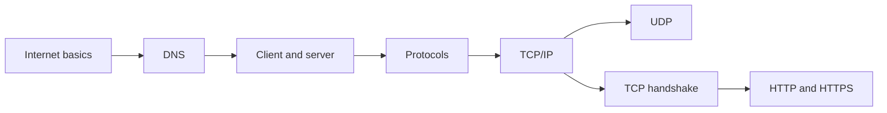

# 🌍 How the Internet Works: Backend Developer Interview Questions

## Chapters

1. [Introduction to the Internet](./1-introduction-to-internet/index.md)
2. [DNS Internals](./2-dns-internals/index.md)
3. [Server–Client Architecture](./3-server-client-architecture/index.md)
4. [Internet Protocols](./4-internet-protocols/index.md)
5. [TCP/IP](./5-tcp-ip/index.md)
6. [UDP](./6-udp/index.md)
7. [TCP Handshakes](./7-tcp-handshakes/index.md)
8. [HTTP and HTTPS](./8-http-https/index.md)

## Suggested study order

প্রথমে request কীভাবে Internet ও DNS পেরিয়ে server-এ পৌঁছায় তা বুঝুন। এরপর IP/TCP/UDP transport behavior এবং সবশেষে HTTP/HTTPS application flow পড়ুন।
