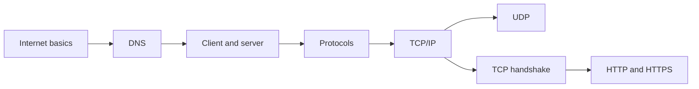

# Computer Networking Interview Guide

একটি browser request URL থেকে server response হওয়া পর্যন্ত DNS, IP routing, transport connection, TLS এবং HTTP—সব layer একসঙ্গে কাজ করে। এই section backend developer-এর দৃষ্টিতে সেই end-to-end flow এবং common failure points ব্যাখ্যা করে।

## Chapters

1. [Introduction to the Internet](./1-introduction-to-internet/index.md)
2. [DNS Internals](./2-dns-internals/index.md)
3. [Server–Client Architecture](./3-server-client-architecture/index.md)
4. [Internet Protocols](./4-internet-protocols/index.md)
5. [TCP/IP](./5-tcp-ip/index.md)
6. [UDP](./6-udp/index.md)
7. [TCP Handshakes](./7-tcp-handshakes/index.md)
8. [HTTP and HTTPS](./8-http-https/index.md)

## Suggested study order

প্রথমে Internet, client-server এবং DNS দিয়ে request-এর যাত্রা বুঝুন। এরপর IP addressing ও routing, TCP বনাম UDP এবং connection establishment পড়ুন। সবশেষে HTTP semantics, TLS handshake, certificate validation এবং timeout/failure scenario একসঙ্গে অনুশীলন করুন।

## Interview focus

- DNS resolve হলেও request কেন fail করতে পারে?
- TCP reliability কীভাবে ordering, acknowledgement ও retransmission নিশ্চিত করে?
- Connection, read এবং idle timeout কীভাবে আলাদা?
- HTTPS কোন threat প্রতিরোধ করে, আর কোনটি করে না?
