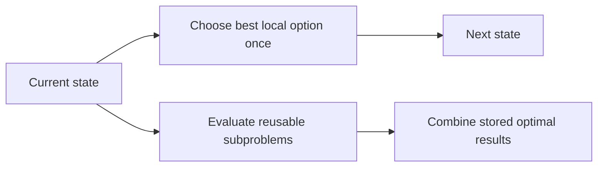
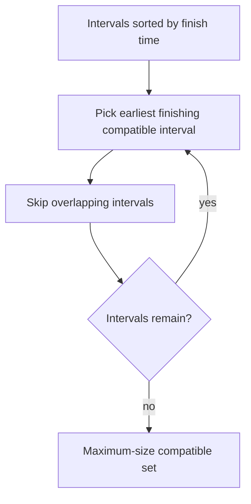
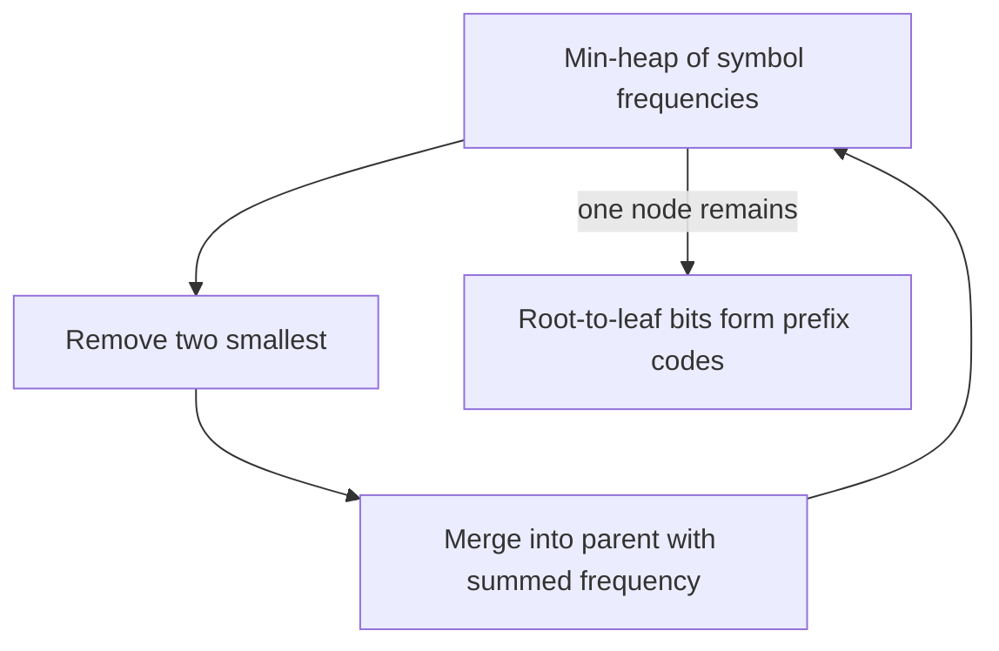
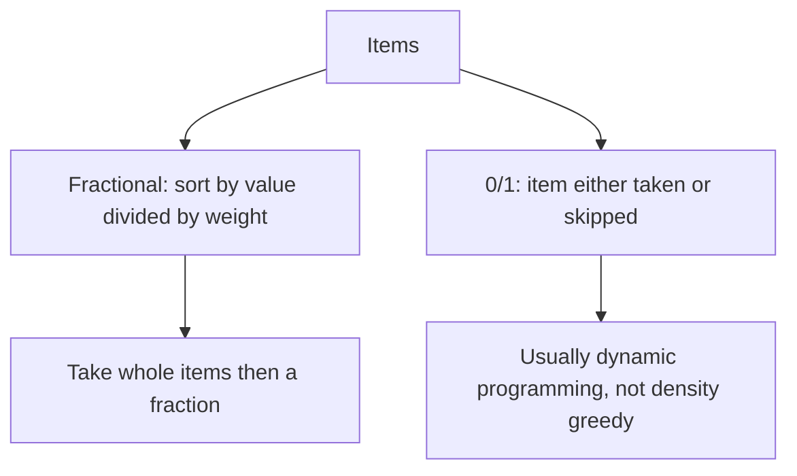
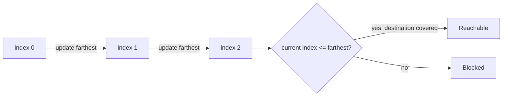

## 🎯 86. What is a greedy algorithm, and how does it differ from dynamic programming?



Greedy প্রতিটি ধাপে locally best choice নেয় এবং choice পুনর্বিবেচনা করে না। DP একাধিক state-এর result সংরক্ষণ করে। Greedy সঠিক হতে **greedy-choice property** ও **optimal substructure** দরকার; সাধারণত exchange argument দিয়ে correctness প্রমাণ করা হয়।

```cpp title="Complete example: minimum coins for canonical denominations"
#include <bits/stdc++.h>
using namespace std;

int main() {
    vector<int> coins{25, 10, 5, 1};
    int amount = 63;
    cout << "Coins for " << amount << ": ";
    for (int coin : coins) {
        int count = amount / coin;
        if (count) cout << coin << "x" << count << ' ';
        amount %= coin;
    }
    cout << '\n';
    return 0;
}
```

**Sample output**
```text
Coins for 63: 25x2 10x1 1x3
```

এই greedy logic `{1,5,10,25}`-এর জন্য optimal, কিন্তু `{1,3,4}` দিয়ে amount `6`-এ greedy `4+1+1` নেয়; optimal হলো `3+3`। তাই greedy সব coin system-এ সঠিক নয়।

## 📅 87. How does greedy interval selection work?



যে activity সবার আগে শেষ হয় সেটি নিলে পরবর্তী activity-র জন্য সর্বাধিক জায়গা থাকে। Meeting rooms-এর জন্য start time অনুযায়ী meeting process করে active end time-এর min-heap রাখা যায়।

```cpp title="Complete example: activity selection and meeting rooms"
#include <bits/stdc++.h>
using namespace std;

vector<pair<int, int>> selectActivities(vector<pair<int, int>> meetings) {
    sort(meetings.begin(), meetings.end(), [](auto a, auto b) {
        return a.second < b.second;
    });
    vector<pair<int, int>> chosen;
    int lastEnd = numeric_limits<int>::min();
    for (auto meeting : meetings)
        if (meeting.first >= lastEnd) {
            chosen.push_back(meeting);
            lastEnd = meeting.second;
        }
    return chosen;
}

int minimumRooms(vector<pair<int, int>> meetings) {
    sort(meetings.begin(), meetings.end());
    priority_queue<int, vector<int>, greater<int>> endTimes;
    int answer = 0;
    for (auto [start, finish] : meetings) {
        if (finish < start) throw invalid_argument("Meeting end must not precede start");
        while (!endTimes.empty() && endTimes.top() <= start) endTimes.pop();
        endTimes.push(finish);
        answer = max(answer, (int)endTimes.size());
    }
    return answer;
}

int main() {
    vector<pair<int, int>> meetings{{1, 3}, {2, 5}, {4, 7}, {6, 9}, {8, 10}};
    cout << "Selected: ";
    for (auto [start, finish] : selectActivities(meetings))
        cout << '(' << start << ',' << finish << ") ";
    cout << "\nMinimum rooms: " << minimumRooms(meetings) << '\n';
    return 0;
}
```

**Sample output**
```text
Selected: (1,3) (4,7) (8,10)
Minimum rooms: 2
```

Sorting-এর কারণে time `O(n log n)`।

## 🌳 88. How does Huffman encoding use a greedy approach?



Priority queue থেকে সর্বনিম্ন frequency-র দুই node বারবার merge করা হয়। এতে frequent character ছোট code পায় এবং optimal prefix-free code তৈরি হয়।

```cpp title="Complete example: Huffman coding"
#include <bits/stdc++.h>
using namespace std;

struct Node {
    char character;
    int frequency;
    shared_ptr<Node> left, right;
    Node(char c, int f, shared_ptr<Node> l = nullptr, shared_ptr<Node> r = nullptr)
        : character(c), frequency(f), left(l), right(r) {}
};

struct Compare {
    bool operator()(const shared_ptr<Node>& a, const shared_ptr<Node>& b) const {
        if (a->frequency != b->frequency) return a->frequency > b->frequency;
        return a->character > b->character;
    }
};

void printCodes(const shared_ptr<Node>& node, const string& code) {
    if (!node->left && !node->right) {
        cout << node->character << ": " << (code.empty() ? "0" : code) << '\n';
        return;
    }
    printCodes(node->left, code + '0');
    printCodes(node->right, code + '1');
}

int main() {
    vector<pair<char, int>> frequencies{{'a', 5}, {'b', 9}, {'c', 12}, {'d', 13}};
    priority_queue<shared_ptr<Node>, vector<shared_ptr<Node>>, Compare> heap;
    for (auto [c, frequency] : frequencies) heap.push(make_shared<Node>(c, frequency));
    if (heap.empty()) throw invalid_argument("At least one symbol is required");
    while (heap.size() > 1) {
        auto left = heap.top(); heap.pop();
        auto right = heap.top(); heap.pop();
        heap.push(make_shared<Node>('\0', left->frequency + right->frequency, left, right));
    }
    printCodes(heap.top(), "");
    return 0;
}
```

**Sample output**
```text
a: 00
b: 01
c: 10
d: 11
```

একই frequency থাকলে একাধিক ভিন্ন কিন্তু সমান optimal code সম্ভব। Time `O(k log k)`।

## 🎒 89. Fractional knapsack vs 0/1 knapsack



Fractional knapsack-এ item ভাগ করা যায়, তাই value/weight ratio অনুযায়ী নেওয়া optimal। 0/1 version-এ item ভাগ করা যায় না; ratio-greedy ভুল হতে পারে, তাই DP ব্যবহৃত হয়।

```cpp title="Complete example: fractional knapsack"
#include <bits/stdc++.h>
using namespace std;

struct Item { double weight, value; };

double fractionalKnapsack(vector<Item> items, double capacity) {
    if (capacity < 0) throw invalid_argument("Capacity must be non-negative");
    for (const Item& item : items)
        if (item.weight <= 0 || item.value < 0)
            throw invalid_argument("Weight must be positive and value non-negative");
    sort(items.begin(), items.end(), [](const Item& a, const Item& b) {
        return a.value / a.weight > b.value / b.weight;
    });
    double answer = 0;
    for (const Item& item : items) {
        double taken = min(capacity, item.weight);
        answer += taken * (item.value / item.weight);
        capacity -= taken;
        if (capacity == 0) break;
    }
    return answer;
}

int main() {
    vector<Item> items{{10, 60}, {20, 100}, {30, 120}};
    cout << fixed << setprecision(2)
         << "Maximum value: " << fractionalKnapsack(items, 50) << '\n';
    return 0;
}
```

**Sample output**
```text
Maximum value: 240.00
```

Time `O(n log n)`; sorting ছাড়া scan `O(n)`।

## 🔢 90. How would you solve Jump Game greedily?



বাম থেকে ডানে গিয়ে এ পর্যন্ত farthest reachable index রাখা হয়। Current index farthest-এর বাইরে গেলে destination unreachable। এই state-ই আগের সব reachable jump-এর প্রয়োজনীয় তথ্য ধরে রাখে।

```cpp title="Complete example: Jump Game"
#include <bits/stdc++.h>
using namespace std;

bool canReachEnd(const vector<int>& jumps) {
    if (jumps.empty()) return false;
    if (any_of(jumps.begin(), jumps.end(), [](int jump) { return jump < 0; }))
        throw invalid_argument("Jump lengths must be non-negative");
    int farthest = 0;
    for (int i = 0; i < (int)jumps.size(); ++i) {
        if (i > farthest) return false;
        farthest = max(farthest, i + jumps[i]);
        if (farthest >= (int)jumps.size() - 1) return true;
    }
    return false;
}

int main() {
    vector<int> first{2, 3, 1, 1, 4};
    vector<int> second{3, 2, 1, 0, 4};
    cout << boolalpha;
    cout << "[2,3,1,1,4]: " << canReachEnd(first) << '\n';
    cout << "[3,2,1,0,4]: " << canReachEnd(second) << '\n';
    return 0;
}
```

**Sample output**
```text
[2,3,1,1,4]: true
[3,2,1,0,4]: false
```

Greedy time `O(n)`, space `O(1)`; straightforward DP/BFS সাধারণত `O(n²)` পর্যন্ত নিতে পারে।
