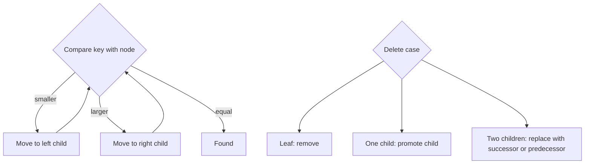
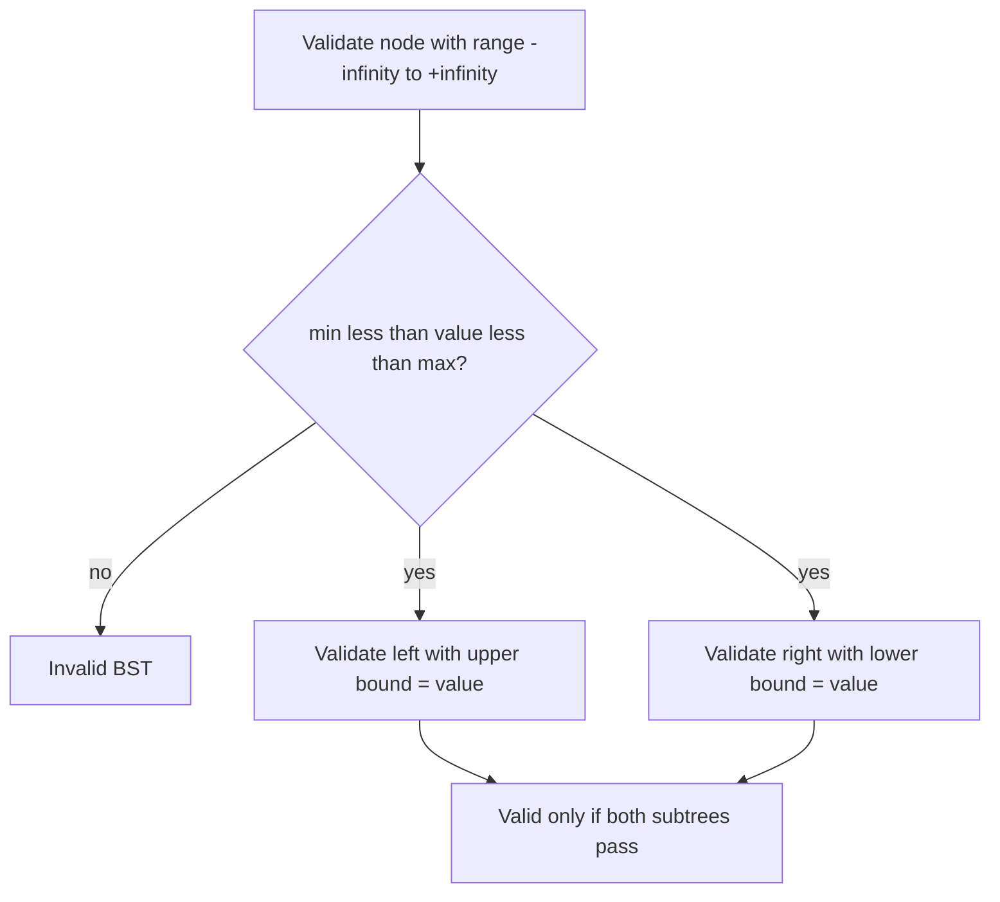

## 🌳 48. What is a BST, and what property must every node satisfy?

**Binary Search Tree (BST)** হলো একটি বিশেষ ধরনের **Binary Tree**, যেখানে প্রতিটি node একটি নির্দিষ্ট **ordering rule** মেনে চলে, যার ফলে data **efficient ভাবে search, insert, এবং delete** করা যায়।

**🔑 প্রতিটি Node-এর জন্য যে Property মেনে চলতে হয়:**

কোনো node **N**-এর জন্য:
- তার **left subtree**-এর সব node-এর value, **N**-এর value থেকে **ছোট** (`< N`) হতে হবে
- তার **right subtree**-এর সব node-এর value, **N**-এর value থেকে **বড়** (`> N`) হতে হবে
- এই একই rule তার **left subtree** এবং **right subtree**-এর প্রতিটি node-এর জন্যও **recursively** সত্য হতে হবে (শুধু immediate children-এর জন্য নয়, পুরো subtree-এর জন্য)

```
        8
       / \
      3   10
     / \    \
    1   6    14
       / \   /
      4   7 13
```

উপরের tree-টি একটি valid BST, কারণ প্রতিটি node-এর left subtree-এর সব value তার চেয়ে ছোট এবং right subtree-এর সব value তার চেয়ে বড়।

> ⚠️ **সাধারণ ভুল ধারণা:** শুধু কোনো node-এর **immediate children**-এর সাথে compare করলেই হবে না। পুরো **left/right subtree**-এর **প্রতিটি node**-কেই এই property মানতে হবে। উদাহরণস্বরূপ, একটি node তার grandparent-এর তুলনায়ও সঠিক position-এ থাকতে হবে।

---

### Why does an in-order traversal of a BST produce sorted output?

**In-order traversal**-এর ক্রম হলো: **Left → Root → Right**

BST-এর সংজ্ঞা অনুযায়ী, প্রতিটি node-এর **left subtree**-এর value গুলো তার চেয়ে ছোট এবং **right subtree**-এর value গুলো তার চেয়ে বড়। যখন in-order traversal করা হয়:

1. প্রথমে **left subtree**-এর সব (ছোট) value visit করা হয়
2. তারপর **root** (মাঝারি value) visit করা হয়
3. সবশেষে **right subtree**-এর সব (বড়) value visit করা হয়

এই ক্রম **recursively** প্রতিটি subtree-তেও একইভাবে প্রযোজ্য হয়, ফলে প্রতিটি ধাপে **ছোট → মাঝারি → বড়** ক্রম বজায় থাকে, এবং সামগ্রিকভাবে পুরো traversal-এর ফলাফল **ascending sorted order**-এ পাওয়া যায়।

```cpp
#include <bits/stdc++.h>
using namespace std;

struct Node {
    int value;
    Node* left;
    Node* right;
    explicit Node(int value) : value(value), left(nullptr), right(nullptr) {}
};

void inorder(Node* root, vector<int>& result) {
    if (root == nullptr) return;
    inorder(root->left, result);
    result.push_back(root->value);
    inorder(root->right, result);
}

int main() {
    Node* root = new Node(8);
    root->left = new Node(3);
    root->right = new Node(10);
    root->left->left = new Node(1);
    root->left->right = new Node(6);

    vector<int> result;
    inorder(root, result);
    for (int value : result) cout << value << ' ';
    cout << '\n';
    return 0;
}
```

**Sample output**

```text
1 3 6 8 10
```

> 💡 **মূল কারণ:** BST-এর ordering property (`left < node < right`) এবং in-order traversal-এর ক্রম (`Left → Root → Right`) মূলত **একই logic** অনুসরণ করে — তাই এই দুটি মিলে গেলে স্বাভাবিকভাবেই sorted sequence তৈরি হয়।

---
### What is the difference between a BST and a balanced BST?

BST শুধু ordering property maintain করে। Balanced BST ordering এর সাথে height balance ও maintain করে।

| বিষয় | সাধারণ BST | Balanced BST |
|---|---|---|
| **সংজ্ঞা** | শুধু **ordering property** (left < node < right) মেনে চলে | Ordering property + প্রতিটি node-এর left ও right subtree-এর **height পার্থক্য সীমিত** (সাধারণত সর্বোচ্চ 1) রাখে |
| **Structure** | যেকোনো shape-এ থাকতে পারে, এমনকি একদম **skewed** (linked-list-এর মতো) হতে পারে | সবসময় tুলনামূলকভাবে **সুষম (symmetric)** shape বজায় রাখে |
| **Worst Case Height** | **O(n)** — যদি sorted order-এ data insert করা হয়, তাহলে tree একদিকে skewed হয়ে যায় | **O(log n)** — balance বজায় রাখার কারণে height সবসময় নিয়ন্ত্রিত থাকে |
| **Search/Insert/Delete Time (Worst Case)** | **O(n)** | **O(log n)** |
| **অতিরিক্ত কাজ প্রয়োজন কিনা** | না, শুধু normal insert/delete করলেই হয় | হ্যাঁ, insert/delete-এর পর **rotation**-এর মাধ্যমে balance বজায় রাখতে হয় |
| **উদাহরণ** | সাধারণ, unbalanced BST | **AVL Tree**, **Red-Black Tree** |


---

## 🔍 49. How do you search, insert, and delete a node in a BST?



BST-এর তিনটি মূল operation-ই তার **ordering property** (`left < node < right`) ব্যবহার করে কাজ করে, যার কারণে প্রতিটি ধাপে **half of the tree** ignore করা যায় (অনেকটা Binary Search-এর মতো)।


**1️⃣ Search Operation**: Root থেকে শুরু করে, target value-এর সাথে current node-এর value compare করা হয়:
- যদি **equal** হয় → node পাওয়া গেছে
- যদি target **ছোট** হয় → **left subtree**-এ যাও
- যদি target **বড়** হয় → **right subtree**-এ যাও

```cpp
bool searchBST(Node* root, int key) {
    while (root != nullptr) {
        if (root->val == key) return true;
        if (key < root->val) root = root->left;
        else root = root->right;
    }
    return false;
}
```

**Time Complexity:** Balanced tree-তে **O(log n)**, Skewed tree-তে worst case **O(n)**


**2️⃣ Insert Operation**: Search-এর মতোই traverse করা হয়, কিন্তু যেখানে গিয়ে **None** (empty spot) পাওয়া যায়, সেখানেই নতুন node **leaf** হিসেবে যুক্ত করা হয়।

```cpp
Node* insertBST(Node* root, int key) {
    if (!root) return new Node(key);

    if (key < root->val) {
        root->left = insertBST(root->left, key);
    } else if (key > root->val) {
        root->right = insertBST(root->right, key);
    }
    return root;
}
```

**Time Complexity:** Balanced tree-তে **O(log n)**, Skewed tree-তে worst case **O(n)**

---

**3️⃣ Delete Operation**

Delete করা সবচেয়ে **জটিল (tricky)** operation, কারণ node মুছে ফেলার পরেও BST-এর **ordering property** বজায় রাখতে হয়। এখানে **৩টি case** হতে পারে:

```cpp
Node* findMin(Node* root) {
    while (root && root->left) root = root->left;
    return root;
}
```

**Case 1: Node-এর কোনো Child নেই (Leaf Node)**: সহজভাবে node-টি মুছে ফেলে তার parent-এর সাথে সংযোগ **None** করে দেওয়া হয়।

**Case 2: Node-এর একটি Child আছে**: Node-টি মুছে ফেলে তার **single child**-কে সরাসরি তার parent-এর সাথে যুক্ত করে দেওয়া হয় (node-টিকে তার child দিয়ে replace করা হয়)।

**Case 3: Node-এর দুইটি Child আছে (⭐ মূল প্রশ্ন)**

```cpp
Node* deleteBST(Node* root, int key) {
    if (!root) return nullptr;

    if (key < root->val) {
        root->left = deleteBST(root->left, key);
    } else if (key > root->val) {
        root->right = deleteBST(root->right, key);
    } else {
        if (!root->left) {
            Node* rightChild = root->right;
            delete root;
            return rightChild;
        }
        if (!root->right) {
            Node* leftChild = root->left;
            delete root;
            return leftChild;
        }

        Node* successor = findMin(root->right);
        root->val = successor->val;
        root->right = deleteBST(root->right, successor->val);
    }
    return root;
}
```

---

### What happens when you delete a node that has two children?

যখন যে node delete করতে হবে তার **দুইটি child** থাকে, তখন সরাসরি সেই node-টি মুছে ফেলা যায় না — কারণ তাহলে তার **left subtree** এবং **right subtree**-কে আবার নতুন করে যুক্ত করার সমস্যা তৈরি হয়। এর সমাধান হলো:

1. **In-order Successor** অথবা **In-order Predecessor** খুঁজে বের করা:
   - **In-order Successor** = right subtree-এর মধ্যে সবচেয়ে **ছোট (leftmost)** value
   - **In-order Predecessor** = left subtree-এর মধ্যে সবচেয়ে **বড় (rightmost)** value
   
2. Delete করতে চাওয়া node-এর value-কে সেই **successor** (বা predecessor)-এর value দিয়ে **replace** করা

3. এরপর সেই successor node-টিকে তার **আসল অবস্থান** থেকে delete করা (যেহেতু successor সবসময় leftmost হয়, তার **কোনো left child থাকে না**, তাই এটি delete করা সহজ — এটি হয় Case 1 নয়তো Case 2-তে পড়ে যায়)

#### কেন এটি কাজ করে:
**In-order Successor** (right subtree-এর সবচেয়ে ছোট value) সবসময় deleted node-এর জায়গায় বসালে BST-এর property বজায় থাকে, কারণ:
- এটি deleted node-এর **left subtree**-এর সব value থেকে **বড়** (যেহেতু right subtree-এর অংশ)
- এটি deleted node-এর **right subtree**-এর বাকি সব value থেকে **ছোট বা সমান** (যেহেতু এটি right subtree-এর মধ্যে সবচেয়ে ছোট)

```
Delete করার আগে:              Delete করার পরে (10 delete):
        10                              12
       /  \                            /  \
      5    15                         5    15
          /  \                            /
        12    20                        (12-এর জায়গায় বসলো,
                                          তারপর 12 নিজে delete হলো)
```

এখানে `10`-কে delete করতে হলে, তার **right subtree** (`15, 12, 20`)-এর মধ্যে সবচেয়ে ছোট value `12`-কে খুঁজে বের করে root-এর জায়গায় বসানো হয়েছে, এবং তারপর মূল `12` node-টিকে তার আসল জায়গা থেকে মুছে ফেলা হয়েছে।

> 🎯 **সারকথা:** দুই child থাকা node delete করার সময়, সরাসরি সেই node মুছে ফেলা যায় না। বরং তার **in-order successor** বা **predecessor** দিয়ে value replace করে, তারপর সেই successor/predecessor-কে তার মূল (এবং সহজ) অবস্থান থেকে delete করা হয় — এভাবে BST-এর **ordering property** সবসময় অক্ষুণ্ণ থাকে।

### What is the time complexity of these operations in a balanced vs. unbalanced BST?

| Operation | Balanced BST | Unbalanced/Skewed BST |
|---|---|---|
| Search | `O(log n)` | `O(n)` |
| Insert | `O(log n)` | `O(n)` |
| Delete | `O(log n)` | `O(n)` |

কারণ operation গুলো tree height `h` এর উপর depend করে: `O(h)`।

---

## ✅ 50. How would you validate whether a given binary tree is a valid BST?


একটি Binary Tree কে **valid BST** বলা যাবে তখনই, যখন তার **প্রতিটি node**-এর জন্য পুরো **left subtree**-এর সব value তার চেয়ে ছোট এবং পুরো **right subtree**-এর সব value তার চেয়ে বড় হয় — এই rule শুধু immediate children-এর জন্য নয়, বরং পুরো subtree-এর **প্রতিটি node**-এর জন্য সত্য হতে হবে।


### What is the common mistake when only comparing a node to its immediate children?

অনেকেই ভুলভাবে মনে করেন যে, কোনো node-এর BST property check করতে হলে শুধু তার **direct left child** এবং **direct right child**-এর সাথে compare করলেই যথেষ্ট। কিন্তু এটি একটি **ভুল ধারণা**।

```cpp
bool isValidBST_Wrong(TreeNode* root) {
    if (root == nullptr) return true;
    
    if (root->left && root->left->val >= root->val) return false;
    if (root->right && root->right->val <= root->val) return false;
    
    return isValidBST_Wrong(root->left) && isValidBST_Wrong(root->right);
}
```

```
        10
       /  \
      5    15
          /  \
         6    20
```

এই tree-টিতে:
- `10 → 5` (left): ঠিক আছে, `5 < 10` ✅
- `10 → 15` (right): ঠিক আছে, `15 > 10` ✅
- `15 → 6` (left): ঠিক আছে, `6 < 15` ✅ (শুধু immediate parent-এর সাথে compare করলে ঠিক মনে হবে)

কিন্তু আসলে এই tree-টি **Invalid BST**! কারণ node `6` আসলে root `10`-এর **right subtree**-তে আছে, তাই `6` অবশ্যই `10` থেকে **বড়** হতে হবে। কিন্তু `6 < 10`, তাই BST property **ভঙ্গ** হচ্ছে।

> 🔑 **মূল সমস্যা:** শুধু immediate parent-এর সাথে compare করলে node-টি তার **সব ancestor**-দের সাথে সঠিক সম্পর্কে আছে কিনা তা যাচাই হয় না। একটি node শুধু তার সরাসরি parent-এর সাথেই নয়, বরং তার **প্রতিটি ancestor**-এর সাথেও সঠিক সীমার (range) মধ্যে থাকতে হবে।

---

### How would you solve this using bounds (min/max range) passed down recursively?

প্রতিটি node-এর জন্য একটি বৈধ **range** (valid_min, valid_max) পাস করা হয় recursively। যখন **left subtree**-এ যাওয়া হয়, তখন **upper bound** (max) আপডেট হয়ে current node-এর value হয়ে যায়। যখন **right subtree**-এ যাওয়া হয়, তখন **lower bound** (min) আপডেট হয়ে current node-এর value হয়ে যায়।

```cpp
#include <bits/stdc++.h>
using namespace std;

bool isValidBST(TreeNode* root, long minVal = LONG_MIN, long maxVal = LONG_MAX) {
    // Base case: empty tree সবসময় valid
    if (root == nullptr) return true;
    
    // বর্তমান node-এর value valid range-এর মধ্যে আছে কিনা check করা
    if (root->val <= minVal || root->val >= maxVal) {
        return false;
    }
    
    // Left subtree: upper bound হবে current node-এর value
    // Right subtree: lower bound হবে current node-এর value
    return isValidBST(root->left, minVal, root->val) &&
           isValidBST(root->right, root->val, maxVal);
}
```

| Parameter | কী নির্দেশ করে |
|---|---|
| `minVal` | এই subtree-এর সব value-কে এর চেয়ে **বড়** হতে হবে |
| `maxVal` | এই subtree-এর সব value-কে এর চেয়ে **ছোট** হতে হবে |

- প্রথমে root-এর জন্য range হয় `(-infinity, +infinity)`
- যখন **left**-এ যাওয়া হয় → নতুন range হয় `(minVal, root->val)` — অর্থাৎ upper bound সংকুচিত হয়
- যখন **right**-এ যাওয়া হয় → নতুন range হয় `(root->val, maxVal)` — অর্থাৎ lower bound সংকুচিত হয়

**উপরের ভুল উদাহরণ এই পদ্ধতিতে কীভাবে সঠিকভাবে ধরা পড়ে:**

```
        10   range: (-∞, +∞)
       /  \
      5    15   range: (10, +∞)
    range:     /  \
    (-∞,10)   6    20
            range: (10, 15)  ← এখানেই সমস্যা ধরা পড়বে!
```

যখন node `6`-এ পৌঁছানো হবে, তখন তার valid range হবে `(10, 15)` — কারণ এটি `10`-এর right subtree-তে আছে (তাই `min = 10`) এবং `15`-এর left subtree-তে আছে (তাই `max = 15`)। কিন্তু `6`, এই range-এর মধ্যে পড়ে না (`6 <= 10`), তাই সাথে সাথে **`false`** return হবে।

---

## 🌀 51. Why can BST operations degrade to O(n) in the worst case, and how is this avoided?

```mermaid
flowchart LR
    Sorted[Insert 1, 2, 3, 4] --> Skewed[Skewed BST height n]
    Skewed --> Linear[Search O(n)]
    Sorted --> Balanced[AVL or Red-Black rotations]
    Balanced --> Log[Height O(log n), operations O(log n)]
```

সাধারণ **BST**-এর **search, insert, delete** operation-গুলোর efficiency সম্পূর্ণভাবে নির্ভর করে tree-এর **height**-এর উপর। প্রতিটি operation-এ root থেকে শুরু করে একটি **single path** ধরে নিচের দিকে নামতে হয়, এবং worst case-এ এই path-এর length-ই হলো সেই operation-এর **time complexity**।

- **Balanced tree**-এ height থাকে **O(log n)**, তাই operation-গুলো **O(log n)**-এ সম্পন্ন হয়
- কিন্তু BST-এর **insertion order**-এর উপর কোনো নিয়ন্ত্রণ না থাকায়, tree **skewed** (একদিকে হেলে যাওয়া) হয়ে যেতে পারে
- Skewed অবস্থায় tree-এর height হয়ে যায় **O(n)** — যা কার্যত একটি **linked list**-এর মতো আচরণ করে
- ফলে search/insert/delete-এর জন্য প্রতিটি node **একে একে** traverse করতে হয়, যা **O(n)** time নেয়

---

### What input pattern causes a BST to become a "skewed" tree?

যদি data **ascending** (অথবা **descending**) ক্রমে একের পর এক insert করা হয়, তাহলে প্রতিটি নতুন value আগের সব value থেকে বড় (বা ছোট) হওয়ায়, প্রতিটি node শুধু একটিমাত্র দিকে (right বা left) child হিসেবে যুক্ত হতে থাকে।

যদি values `1, 2, 3, 4, 5` এই ক্রমে BST-তে insert করা হয়:

```cpp
BST tree;
tree.insert(1);
tree.insert(2);
tree.insert(3);
tree.insert(4);
tree.insert(5);
```

তাহলে tree-টি এমন দেখাবে:

```
1
 \
  2
   \
    3
     \
      4
       \
        5
```

এটি **Right-Skewed Tree**, যার height = `n - 1` (এখানে n = 5টি node, height = 4)। এই ধরনের tree-তে value `5` খুঁজতে **5টি** ধাপ লাগবে — ঠিক যেমন একটি **linked list**-এ linear search করলে লাগত।

> 💡 **অন্যান্য কারণ:** শুধু পুরোপুরি sorted data-ই নয়, বরং যেকোনো এমন insertion pattern যেখানে বারবার একই দিকে (consistently left বা right) child যুক্ত হতে থাকে, তা skewed tree তৈরি করতে পারে। যেমন `5, 4, 3, 2, 1` (descending order) দিলে **Left-Skewed Tree** তৈরি হবে।

---

### How do self-balancing trees prevent this degradation?

**Self-Balancing Tree** (যেমন **AVL Tree**, **Red-Black Tree**) স্বয়ংক্রিয়ভাবে tree-এর **structure পুনর্বিন্যাস (restructure)** করে, যাতে insertion order যেমনই হোক না কেন, tree সবসময় **balanced** থাকে।

**1. Balance Factor Monitor করা:**
প্রতিবার **insert** বা **delete** করার পর, affected node থেকে root পর্যন্ত সব **ancestor**-দের **balance factor** (left ও right subtree-এর height পার্থক্য) check করা হয়।

**2. Rotation ব্যবহার করে Rebalance করা:**
যদি কোনো node-এর balance factor নির্ধারিত সীমা (সাধারণত **-1, 0, +1**) অতিক্রম করে, তাহলে **Rotation** (Left Rotation, Right Rotation, Left-Right Rotation, Right-Left Rotation) প্রয়োগ করে tree-টিকে পুনরায় balanced করা হয়।

উদাহরণ (AVL Tree-তে একই `1, 2, 3` insert করলে):

```cpp
// সাধারণ BST-তে:        // AVL Tree-তে (Rotation-এর পর):
1                                2
 \                              / \
  2                            1   3
   \
    3
```

যখন `1, 2, 3` একের পর এক insert করা হয়, সাধারণ BST-তে এটি একটি straight line তৈরি করত। কিন্তু AVL Tree-তে `3` insert করার সাথে সাথে balance factor limit অতিক্রম হয়ে যায়, তাই একটি **Left Rotation** স্বয়ংক্রিয়ভাবে ঘটে এবং tree পুনরায় balanced হয়ে যায় — যেখানে `2` root হয়ে যায়।

#### বিভিন্ন Self-Balancing Tree-এর পদ্ধতি:

| Tree Type | Balance বজায় রাখার পদ্ধতি | Height Guarantee |
|---|---|---|
| **AVL Tree** | প্রতিটি node-এর balance factor **strictly** `-1, 0, +1`-এর মধ্যে রাখে (strict balancing) | **O(log n)**, সবচেয়ে কড়া balance |
| **Red-Black Tree** | প্রতিটি node-কে **Red** বা **Black** হিসেবে **color** করে এবং কিছু **coloring rules** মেনে চলে (কিছুটা relaxed balancing) | **O(log n)**, তবে AVL-এর চেয়ে rotation কম লাগে |
| **B-Tree / B+ Tree** | একাধিক child ও key রাখার মাধ্যমে tree-কে **wide এবং shallow** রাখে | **O(log n)**, বিশেষভাবে disk-based storage-এর জন্য উপযোগী |

#### Time Complexity Guarantee:

| Operation | সাধারণ BST (Worst Case) | Self-Balancing Tree (Worst Case) |
|---|---|---|
| Search | O(n) | **O(log n)** |
| Insert | O(n) | **O(log n)** |
| Delete | O(n) | **O(log n)** |

> 🎯 **সারকথা:** সাধারণ BST-এর performance সম্পূর্ণভাবে **insertion order**-এর উপর নির্ভরশীল — sorted বা প্রায়-sorted data দিলে এটি skewed হয়ে **O(n)** performance-এ নেমে যায়। এই সমস্যার সমাধান হলো **Self-Balancing Tree**, যা প্রতিটি insert/delete-এর পর **rotation** ব্যবহার করে tree-এর height সবসময় **O(log n)**-এ বজায় রাখে, ফলে input pattern যাই হোক না কেন, performance সবসময় **guaranteed এবং predictable** থাকে।

## 🔄 52. What are self-balancing BSTs, such as AVL trees and Red-Black trees?

Self-balancing BST insert/delete-এর পরে structure adjust করে height `O(log n)` রাখে। AVL tree প্রতিটি node-এর balance factor `-1..1` রাখে; Red-Black Tree coloring rules দিয়ে তুলনামূলক relaxed balance রাখে। AVL search-heavy workload-এ ভালো, আর Red-Black Tree কম rotation-এর কারণে update-heavy general-purpose ordered map/set-এ common। C++ `std::map`/`std::set` সাধারণত Red-Black Tree-ভিত্তিক implementation ব্যবহার করে, যদিও standard নির্দিষ্ট tree বাধ্যতামূলক করে না।

```text
AVL imbalance and right rotation:

        30              20
       /               /  \
      20       →      10  30
     /
    10

LL case → right rotation
RR case → left rotation
LR case → left child left-rotate, then node right-rotate
RL case → right child right-rotate, then node left-rotate
```

```cpp title="Complete example: AVL insertion"
#include <bits/stdc++.h>
using namespace std;

struct AvlNode {
    int value, height;
    AvlNode* left;
    AvlNode* right;
    explicit AvlNode(int value) : value(value), height(1), left(nullptr), right(nullptr) {}
};

int nodeHeight(AvlNode* node) { return node ? node->height : 0; }

void updateHeight(AvlNode* node) {
    node->height = 1 + max(nodeHeight(node->left), nodeHeight(node->right));
}

AvlNode* rotateRight(AvlNode* root) {
    AvlNode* nextRoot = root->left;
    root->left = nextRoot->right;
    nextRoot->right = root;
    updateHeight(root);
    updateHeight(nextRoot);
    return nextRoot;
}

AvlNode* rotateLeft(AvlNode* root) {
    AvlNode* nextRoot = root->right;
    root->right = nextRoot->left;
    nextRoot->left = root;
    updateHeight(root);
    updateHeight(nextRoot);
    return nextRoot;
}

AvlNode* insertAvl(AvlNode* root, int value) {
    if (!root) return new AvlNode(value);
    if (value < root->value) root->left = insertAvl(root->left, value);
    else if (value > root->value) root->right = insertAvl(root->right, value);
    else return root;

    updateHeight(root);
    int balance = nodeHeight(root->left) - nodeHeight(root->right);
    if (balance > 1 && value < root->left->value) return rotateRight(root);
    if (balance < -1 && value > root->right->value) return rotateLeft(root);
    if (balance > 1) {
        root->left = rotateLeft(root->left);
        return rotateRight(root);
    }
    if (balance < -1) {
        root->right = rotateRight(root->right);
        return rotateLeft(root);
    }
    return root;
}

void printPreorder(AvlNode* root) {
    if (!root) return;
    cout << root->value << ' ';
    printPreorder(root->left);
    printPreorder(root->right);
}

int main() {
    AvlNode* root = nullptr;
    for (int value : {30, 20, 10, 25, 28}) root = insertAvl(root, value);
    cout << "AVL pre-order: ";
    printPreorder(root);
    cout << "\nHeight: " << nodeHeight(root) << '\n';
    return 0;
}
```

**Sample output**

```text
AVL pre-order: 20 10 28 25 30
Height: 3
```

| Property | AVL Tree | Red-Black Tree |
|---|---|---|
| Balance | stricter (`|balance factor| ≤ 1`) | relaxed color/black-height rules |
| Search | often slightly faster | guaranteed `O(log n)` |
| Updates | rotations বেশি হতে পারে | সাধারণত rotations কম |
| Common use | lookup-heavy indexes | ordered maps/sets, kernels, runtimes |

## 🥇 53. How do you find the kth smallest or kth largest element in a BST?

BST এর in-order traversal sorted order দেয়। তাই **kth smallest** পেতে in-order traversal করে `k` তম element নিতে হবে। **kth largest** এর জন্য reverse in-order: Right -> Root -> Left।

```text
BST:
        5
       / \
      3   8
     / \   \
    2   4   10

In-order: 2 3 4 5 8 10
3rd smallest = 4
2nd largest = 8
```

#### kth Smallest (Iterative, Stack ব্যবহার করে):

```cpp
int kthSmallest(TreeNode* root, int k) {
    stack<TreeNode*> st;
    TreeNode* current = root;
    
    while (current != nullptr || !st.empty()) {
        // সবচেয়ে বামের node পর্যন্ত push করতে থাকো
        while (current != nullptr) {
            st.push(current);
            current = current->left;
        }
        
        current = st.top();
        st.pop();
        
        k--;
        if (k == 0) return current->val;  // k-তম node পাওয়া গেলো
        
        current = current->right;
    }
    
    return -1;  // k tree-এর size থেকে বড় হলে
}
```

#### kth Largest:
**kth Largest** বের করতে হলে, শুধু traversal-এর ক্রম **Right → Root → Left** (reverse in-order) করে দিলেই হয়ে যায় — তাহলে data **descending order**-এ পাওয়া যাবে।

```cpp
int kthLargest(TreeNode* root, int k) {
    stack<TreeNode*> st;
    TreeNode* current = root;
    
    while (current != nullptr || !st.empty()) {
        while (current != nullptr) {
            st.push(current);
            current = current->right;  // এখানে right আগে
        }
        
        current = st.top();
        st.pop();
        
        k--;
        if (k == 0) return current->val;
        
        current = current->left;
    }
    
    return -1;
}
```

| Complexity | মান |
|---|---|
| **Time** | **O(h + k)** — worst case-এ **O(n)** (h = height, তবে k পর্যন্ত পৌঁছাতে extra traversal লাগে) |
| **Space** | **O(h)** — stack-এর জন্য |

**সমস্যা:** যদি বারবার (multiple queries) kth smallest/largest বের করতে হয়, তাহলে প্রতিবার **O(n)** সময় লাগবে, যা inefficient।

### How does subtree size support O(log n) order-statistic queries?

প্রতি node-এ `subtreeSize = 1 + size(left) + size(right)` রাখলে left subtree-এর size দেখে kth position কোন দিকে তা নির্ধারণ করা যায়। Balanced tree-তে প্রতিটি query `O(log n)`; insert/delete/rotation-এর সময় size update করতে হয়।

```text
             8(size=7)
           /           \
      4(size=3)      12(size=3)
      /     \         /      \
     2       6       10      14

Find 5th smallest at root 8:
left size = 3, root rank = 4
k=5 > 4 → right subtree-তে (5-4)=1st smallest → 10
```

```cpp
struct SizedNode {
    int value, subtreeSize = 1;
    SizedNode* left = nullptr;
    SizedNode* right = nullptr;
    explicit SizedNode(int value) : value(value) {}
};

int sizeOf(SizedNode* node) { return node ? node->subtreeSize : 0; }

int kthBySize(SizedNode* root, int k) {
    while (root) {
        int rootRank = sizeOf(root->left) + 1;
        if (k == rootRank) return root->value;
        if (k < rootRank) root = root->left;
        else { k -= rootRank; root = root->right; }
    }
    throw out_of_range("k is larger than the tree size");
}
```

### How do you find the in-order predecessor and successor?

Predecessor হলো target-এর ঠিক আগের smaller value; successor ঠিক পরের larger value। Search path-এ target-এর চেয়ে ছোট সর্বশেষ ancestor predecessor candidate এবং বড় সর্বশেষ ancestor successor candidate। Target-এর left/right subtree থাকলে যথাক্রমে rightmost/leftmost node final answer।

```cpp
struct SearchNode {
    int value;
    SearchNode* left = nullptr;
    SearchNode* right = nullptr;
};

pair<SearchNode*, SearchNode*> predecessorSuccessor(SearchNode* root, int target) {
    SearchNode *predecessor = nullptr, *successor = nullptr, *current = root;
    while (current && current->value != target) {
        if (target < current->value) {
            successor = current;
            current = current->left;
        } else {
            predecessor = current;
            current = current->right;
        }
    }
    if (!current) return {predecessor, successor};
    for (SearchNode* node = current->left; node; node = node->right) predecessor = node;
    for (SearchNode* node = current->right; node; node = node->left) successor = node;
    return {predecessor, successor};
}
```

## 🧪 Complete BST operations example

নিচের standalone program-এ insert, search, delete, validation এবং kth-smallest একই tree-তে দেখানো হয়েছে।

```cpp
#include <bits/stdc++.h>
using namespace std;

struct Node {
    int value;
    Node* left;
    Node* right;
    explicit Node(int value) : value(value), left(nullptr), right(nullptr) {}
};

Node* insertNode(Node* root, int value) {
    if (root == nullptr) return new Node(value);
    if (value < root->value) root->left = insertNode(root->left, value);
    else if (value > root->value) root->right = insertNode(root->right, value);
    return root;
}

bool contains(Node* root, int target) {
    while (root != nullptr) {
        if (target == root->value) return true;
        root = target < root->value ? root->left : root->right;
    }
    return false;
}

Node* minimumNode(Node* root) {
    while (root->left != nullptr) root = root->left;
    return root;
}

Node* deleteNode(Node* root, int target) {
    if (root == nullptr) return nullptr;
    if (target < root->value) root->left = deleteNode(root->left, target);
    else if (target > root->value) root->right = deleteNode(root->right, target);
    else {
        if (root->left == nullptr) {
            Node* next = root->right;
            delete root;
            return next;
        }
        if (root->right == nullptr) {
            Node* next = root->left;
            delete root;
            return next;
        }
        Node* successor = minimumNode(root->right);
        root->value = successor->value;
        root->right = deleteNode(root->right, successor->value);
    }
    return root;
}

bool valid(Node* root, long long low, long long high) {
    if (root == nullptr) return true;
    if (root->value <= low || root->value >= high) return false;
    return valid(root->left, low, root->value) &&
           valid(root->right, root->value, high);
}

int kthSmallestValue(Node* root, int k) {
    stack<Node*> pending;
    while (root != nullptr || !pending.empty()) {
        while (root != nullptr) {
            pending.push(root);
            root = root->left;
        }
        root = pending.top();
        pending.pop();
        if (--k == 0) return root->value;
        root = root->right;
    }
    throw out_of_range("k is larger than the tree size");
}

void printInorder(Node* root) {
    if (root == nullptr) return;
    printInorder(root->left);
    cout << root->value << ' ';
    printInorder(root->right);
}

int main() {
    Node* root = nullptr;
    for (int value : {8, 3, 10, 1, 6, 14, 4, 7, 13})
        root = insertNode(root, value);

    cout << boolalpha;
    cout << "In-order: ";
    printInorder(root);
    cout << "\nContains 7: " << contains(root, 7) << '\n';
    cout << "Valid BST: " << valid(root, LLONG_MIN, LLONG_MAX) << '\n';
    cout << "4th smallest: " << kthSmallestValue(root, 4) << '\n';

    root = deleteNode(root, 3);
    cout << "After deleting 3: ";
    printInorder(root);
    cout << '\n';
    return 0;
}
```

**Sample output**

```text
In-order: 1 3 4 6 7 8 10 13 14
Contains 7: true
Valid BST: true
4th smallest: 6
After deleting 3: 1 4 6 7 8 10 13 14
```

### BST operation flow

```text
Search/Insert/Delete target 7

             8
           /   \
          3     10
           \      \
            6      14
             \    /
             [7] 13

7 < 8  → left
7 > 3  → right
7 > 6  → right → found
```

### Delete cases

```text
Delete node
   │
   ├── 0 child → remove leaf
   ├── 1 child → connect parent directly to child
   └── 2 children
          ├── copy in-order successor
          └── delete successor from right subtree
```

### Balanced vs skewed height

```text
Balanced BST             Skewed BST
       4                 1
     /   \                \
    2     6                2
   / \   / \                \
  1   3 5   7                3
                                \
height = O(log n)                4   height = O(n)
```

---
