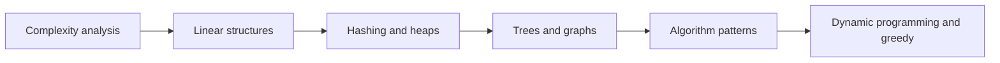

# 🧱 Data Structures and Algorithms Interview Guide

## Chapters

1. [Complexity Analysis](./1-complexity-analysis/index.md)
2. [Arrays](./2-arrays/index.md)
3. [Strings](./3-strings/index.md)
4. [Sliding Window and Two Pointers](./4-sliding-window-two-pointers/index.md)
5. [Linked Lists](./5-linked-list/index.md)
6. [Stacks and Queues](./6-stack-queue/index.md)
7. [Hash Tables](./7-hash-table/index.md)
8. [Trees](./8-trees-bst/index.md)
9. [Binary Search Trees](./8-trees-bst-binary/index.md)
10. [Heaps and Priority Queues](./9-heap-priority-queue/index.md)
11. [Graphs](./10-graphs/index.md)
12. [Sorting and Searching](./11-sorting-searching/index.md)
13. [Recursion and Backtracking](./12-recursion-backtracking/index.md)
14. [Divide and Conquer](./13-divide-and-conquer/index.md)
15. [Dynamic Programming](./13-dynamic-programming/index.md)
16. [Greedy Algorithms](./14-greedy/index.md)
17. [Bit Manipulation](./15-bit-manipulation/index.md)

## How to use this section

প্রতিটি topic-এ আগে operation ও complexity বুঝুন, তারপর provided C++ example নিজে run করুন। Problem-solving pattern chapter-গুলো পড়ার আগে arrays, hashing, trees এবং graphs-এর fundamentals শেষ করা সবচেয়ে কার্যকর।
