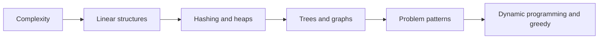

# Data Structures and Algorithms Interview Guide

Data structure নির্বাচন নির্ভর করে required operations, input size এবং time-space constraints-এর ওপর। এই section syntax মুখস্থ করার বদলে complexity analysis, invariant এবং reusable problem-solving pattern তৈরি করতে সাহায্য করে।

## Foundations and structures

1. [Complexity Analysis](./1-complexity-analysis/index.md)
2. [Arrays](./2-arrays/index.md) and [Strings](./3-strings/index.md)
3. [Linked Lists](./5-linked-list/index.md), [Stacks and Queues](./6-stack-queue/index.md)
4. [Hash Tables](./7-hash-table/index.md), [Heaps and Priority Queues](./9-heap-priority-queue/index.md)
5. [Trees](./8-trees-bst/index.md), [Binary Search Trees](./8-trees-bst-binary/index.md), [Graphs](./10-graphs/index.md)

## Problem-solving patterns

- [Sliding Window and Two Pointers](./4-sliding-window-two-pointers/index.md)
- [Sorting and Searching](./11-sorting-searching/index.md)
- [Recursion and Backtracking](./12-recursion-backtracking/index.md)
- [Divide and Conquer](./13-divide-and-conquer/index.md)
- [Dynamic Programming](./13-dynamic-programming/index.md)
- [Greedy Algorithms](./14-greedy/index.md)
- [Bit Manipulation](./15-bit-manipulation/index.md)

## How to practice

প্রতিটি problem-এর আগে constraints থেকে acceptable complexity নির্ধারণ করুন। তারপর brute-force idea, bottleneck, chosen data structure, invariant এবং edge case লিখুন। Solution শেষে time ও auxiliary-space complexity ব্যাখ্যা করুন এবং একই pattern-এর অন্তত একটি variation solve করুন।
