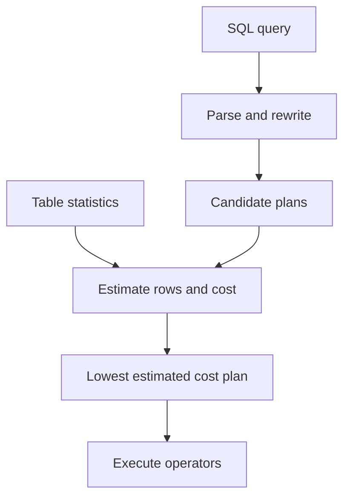
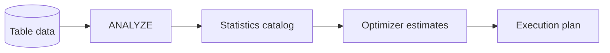

## **39. What is an Index?**

Index হল একটি database structure যা data retrieval operations এর speed বাড়ানোর জন্য ব্যবহৃত হয়। এটি একটি বইয়ের index এর মতো কাজ করে। যেমন বইয়ের শেষে index থাকে যেখানে বিষয়বস্তু এবং page number লেখা থাকে, ঠিক তেমনি database index এ column values এবং তাদের corresponding row locations থাকে।

**Technical definition:** Index হল একটি data structure (সাধারণত B-tree বা Hash table) যা table এর এক বা একাধিক column এর উপর তৈরি করা হয় এবং এটি সেই column(s) এর values এর সাথে actual table rows এর physical locations এর mapping রাখে।


###  Why do we need Indexes?

আমাদের Index দরকার কয়েকটি কারণে:

**1.Query Performance উন্নতি:**
- Index ছাড়া, database engine কে full table scan করতে হয় (প্রতিটি row check করা)
- Index দিয়ে database direct যেতে পারে target row এ
- Example: ১ মিলিয়ন records এর table এ specific user খুঁজতে index ছাড়া ১ মিলিয়ন comparison লাগবে, কিন্তু B-tree index দিয়ে মাত্র ~20 comparisons লাগবে

**2.Sorting এবং Ordering:**
- ORDER BY clauses faster execution হয়
- Index already sorted order এ data রাখে

**3.JOIN Operations:**
- Multiple tables এর মধ্যে JOIN করার সময় performance significantly improve হয়
- Foreign key constraints এর জন্য index essential

**4.Unique Constraints:**
- UNIQUE constraints enforce করার জন্য index ব্যবহৃত হয়
- Duplicate values খুব তাড়াতাড়ি detect করা যায়


###  Can indexes slow down write operations?

হ্যাঁ, index write operations slow করতে পারে। এর কারণগুলো:

**INSERT Operations:**
- নতুন row insert করার সময় সব related indexes এ entry add করতে হয়
- B-tree index এ নতুন node create বা existing node split করতে হতে পারে
- Multiple indexes থাকলে প্রতিটিতে update করতে হয়

**UPDATE Operations:**
- Indexed column এর value change হলে index এও update করতে হয়
- Old entry remove এবং new entry add করতে হয়
- Complex B-tree restructuring হতে পারে

**DELETE Operations:**
- Row delete করার সময় সব indexes থেকে corresponding entries remove করতে হয়
- B-tree node merge বা reorganization প্রয়োজন হতে পারে


###  How does database choose which index to use?

এটি **Query Optimizer** এর কাজ। এই process টি কয়েকটি ধাপে হয়:

**Query Analysis:**
- WHERE clause analyze করে
- JOIN conditions check করে  
- ORDER BY, GROUP BY clauses দেখে

**Available Indexes Identification:**
- Query এ ব্যবহৃত columns এর উপর কোন indexes আছে তা identify করে
- Composite indexes এর partial usage possibility check করে

**Cost-Based Decision:**
Database optimizer বিভিন্ন factors consider করে:

- **Selectivity:** Index কত selective (unique values এর percentage)
```sql
-- High selectivity (good for index)
SELECT * FROM users WHERE email = 'john@example.com'

-- Low selectivity (index may not be used)
SELECT * FROM users WHERE gender = 'M'
```

- **Cardinality:** Column এ কত unique values আছে

- **Table Size:** ছোট table এ index এর benefit কম

- **Index Size:** Large index memory এ fit না হলে disk I/O বেড়ে যায়

**Execution Plan Selection:**
Optimizer বিভিন্ন execution plans compare করে:
- Full table scan
- Index seek
- Index scan  
- Multiple index usage (Index intersection/union)


**Optimizer এখানে decide করবে:**
1. কোন index সবচেয়ে selective
2. Multiple indexes combine করা যায় কিনা
3. Index scan vs table scan কোনটা efficient

---

## **40.Difference between Clustered and Non-Clustered Index**

#### 1.Clustered Index
Clustered index ধারণাটি বিশেষ করে SQL Server-style terminology-তে table row-কে index leaf level-এ রাখে। PostgreSQL-এর `CLUSTER` স্থায়ী maintenance guarantee নয়, আর InnoDB primary key-কে clustered storage হিসেবে ব্যবহার করে—তাই behavior DBMS-specific।

**বৈশিষ্ট্যসমূহ:**

* Clustered index মানে হলো **table-এর actual data rows গুলো index-এর order অনুযায়ী সাজানো থাকে**।
* SQL Server/InnoDB-এর clustered structure-তে leaf-level row key order-এ organized থাকে; disk block physically contiguous থাকার guarantee নেই
* Table এবং index একই physical structure share করে
* Data retrieval এর জন্য additional lookup প্রয়োজন হয় না
* একটা table-এর data একটিই ভাবে সাজানো যায়, তাই **একটা table-এ সর্বোচ্চ ১টা clustered index থাকতে পারে**।
* SQL Server-এ primary key default-এ clustered হতে পারে যদি অন্যভাবে বলা না হয়; InnoDB primary key clustered। এটি universal SQL rule নয়।

**Example:**
ধরো একটা `Students` table আছে এবং `StudentID` column-এ clustered index আছে।
তাহলে table-এর সব row গুলো **StudentID এর increasing order** অনুযায়ী disk-এ physicaly stored থাকবে।


#### 2.Non-Clustered Index
Non-clustered index হল একটি separate structure যা table data এর reference রাখে কিন্তু actual data storage order পরিবর্তন করে না।

**বৈশিষ্ট্যসমূহ:**
* Table এর physical order পরিবর্তন করে না
* Table থেকে separate physical structure
* Additional lookup operation প্রয়োজন (Key Lookup)
* এটা actual data table-এর উপরে আলাদা structure হিসাবে তৈরি হয়।
* এক টেবিলে অনেকগুলো secondary/non-clustered index থাকতে পারে; exact limit DBMS, version ও storage engine-নির্ভর।

**Example:**
যদি `Name` column-এ non-clustered index বানাও, তাহলে index structure-এ নামগুলো sorted থাকবে কিন্তু actual table data সাজানো থাকবে না। Index থেকে pointer এর মাধ্যমে আসল row fetch করতে হবে।


###  Which is faster for SELECT queries?

* **Clustered index** সাধারণত **faster** হয় যখন range query করা হয় (যেমন `WHERE StudentID BETWEEN 100 AND 200`) কারণ data physicaly sorted থাকে।

* **Non-clustered index** ভালো কাজ করে যখন নির্দিষ্ট column-এ search করি, কিন্তু row fetch করার জন্য pointer ব্যবহার করতে হয় বলে একটু বেশি step লাগে।

**তবে:** কোনটা faster হবে তা নির্ভর করে query type, table size, এবং index usage pattern এর উপর।


###  How many clustered indexes can a table have?

* SQL Server terminology-তে একটি table-এ **একটি clustered index** থাকতে পারে, কারণ table row নিজেই তার leaf level।

কিন্তু non-clustered index অনেকগুলো হতে পারে।


### What determines the physical order of data?

* SQL Server-এ clustered key row-এর logical storage order নির্ধারণ করে।
* Clustered index না থাকলে SQL Server table heap হয়। PostgreSQL ও অন্য DBMS-এর storage terminology/behavior আলাদা।

অর্থাৎ:

* Clustered index থাকলে → data ওই index অনুযায়ী সাজানো।
* Clustered index না থাকলে → data unordered (heap table)।

---


## **41.What is a Composite Index?**

Composite index (Multi-column index বা Compound index) হল এমন একটি index যা একাধিক column এর combination এর উপর তৈরি করা হয়। এটি multiple columns এর values একসাথে consider করে index structure তৈরি করে।

```sql
CREATE INDEX idx_customer_name_age
ON customers (last_name, first_name, age);
```

এখানে `last_name`, `first_name`, এবং `age`—এই তিনটা column নিয়ে একটা **composite index** তৈরি হয়েছে।

এটার মানে হলো DBMS এই index ব্যবহার করে একসাথে এই তিনটি column এর উপর ভিত্তি করে দ্রুত search, filter বা sort করতে পারবে।


###  When is it useful?

Composite Index useful হয় যখন—

1. **Multiple columns frequently used in WHERE clause**
   উদাহরণ:

   ```sql
   SELECT * FROM customers
   WHERE last_name = 'Rahman' AND first_name = 'Mamun';
   ```

   এখানে একসাথে `last_name` এবং `first_name` filter হচ্ছে, তাই composite index সাহায্য করবে।

2. **JOIN operations এ multiple columns ব্যবহার হয়**
   যদি দুই টেবিলকে multiple key দিয়ে join করা হয়, composite index performance বাড়াবে।

3. **ORDER BY or GROUP BY multiple columns**
   যদি একাধিক column দিয়ে sort বা group করা হয়, composite index pre-sorted data দিয়ে query কে দ্রুত করে।


### Does order of columns matter in composite index?

হ্যাঁ, **column order খুব গুরুত্বপূর্ণ**।

কারণ DBMS **leftmost prefix rule** ফলো করে।

উদাহরণ: যদি index হয় `(last_name, first_name, age)`

* Query তে শুধু `last_name` ব্যবহার করলে index কাজ করবে ✅
* Query তে `last_name` + `first_name` ব্যবহার করলে index কাজ করবে ✅
* Query তে `first_name` একা ব্যবহার করলে index কাজ করবে না ❌
* Query তে `age` একা ব্যবহার করলেও index কাজ করবে না ❌

অর্থাৎ index প্রথম column থেকে শুরু করে যতোটা continuous portion ব্যবহার করা হবে, ততটাই index কাজে লাগবে।


###  What is Index Selectivity?

**Index Selectivity** হল একটি metric যা measure করে একটি index কত unique বা distinctive values contain করে। এটি database optimizer কে help করে decide করতে যে index ব্যবহার করা efficient হবে কিনা।

```
Index Selectivity = (Number of distinct values in column) / (Total number of rows)
```

* যদি **selectivity বেশি হয়** (মানে অনেক distinct values আছে), তাহলে index খুব effective।
  👉 উদাহরণ: National ID, Email, Phone Number কলামে index effective।

* যদি **selectivity কম হয়** (মানে অনেক rows এ একই value), তাহলে index তেমন কাজে আসে না।
  👉 উদাহরণ: Gender column (Male/Female), Boolean field (Yes/No) → এখানে index খুব useful না, কারণ প্রায় অর্ধেক rows স্ক্যান করতে হবে।

* Index selectivity সঠিকভাবে understand করা database performance optimization এর জন্য crucial।

---

## **42. What is a Covering Index?**

**Covering Index** হল এমন একটি index যাতে query এর জন্য প্রয়োজনীয় সব columns থাকে। অর্থাৎ, query execute করার জন্য database engine কে actual table data access করার দরকার হয় না - শুধু index থেকেই সব required data পেয়ে যায়।

**Technical Definition:** একটি index তখন "covering" হয় যখন query এর SELECT, WHERE, ORDER BY, GROUP BY clauses এ ব্যবহৃত সব columns সেই index এ present থাকে।

 Example: ধরা যাক টেবিল:

```sql
CREATE TABLE orders (
    order_id INT PRIMARY KEY,
    customer_id INT,
    order_date DATE,
    total_amount DECIMAL(10,2)
);
```

এখন query হলো:

```sql
SELECT customer_id, order_date 
FROM orders
WHERE order_id = 101;
```

যদি আমরা index বানাই:

```sql
CREATE INDEX idx_orders_covering 
ON orders (order_id, customer_id, order_date);
```

👉 এখন এই query এর জন্য DBMS শুধুমাত্র index থেকেই `customer_id` আর `order_date` বের করতে পারবে, main table এ যেতে হবে না।
এটাই **covering index** এর মূল সুবিধা।


###  How does it improve performance?

Covering Index performance improve করে কয়েকভাবে:

1. **Avoid Table Lookup (Index Only Scan)**

   * সাধারণত index কেবল key column রাখে, আর বাকি data আনতে DB কে table এ যেতে হয় (**table lookup** বা **bookmark lookup**)।
   * Covering index থাকলে দরকারি সব column index এ আগে থেকেই থাকে, তাই table এ যেতে হয় না → query অনেক দ্রুত হয়।

2. **Reduce I/O Operations**

   * Disk থেকে কম data read করতে হয়, কারণ সব কিছু index এ থাকে।
   * কম I/O মানে দ্রুত query execution।

3. **Better for Frequently Used Queries**

   * যদি কোনো query বারবার execute হয় এবং নির্দিষ্ট কিছু column দরকার হয়, covering index পারফরম্যান্স অনেক বাড়ায়।


###  What is the downside of too many covering indexes?

যদিও covering indexes performance improve করে, কিন্তু **too many covering indexes** তৈরি করলে বেশ কিছু সমস্যা হয়:

1. **Storage Overhead**

   * Index এ অনেক column রাখতে গেলে disk space অনেক বেশি খরচ হয়।
   * টেবিল বড় হলে covering index এর size-ও বিশাল হতে পারে।

2. **Slower Write Operations**

   * `INSERT`, `UPDATE`, `DELETE` করার সময় table এর পাশাপাশি সব covering index update করতে হয়।
   * যত বেশি covering index থাকবে, write operation তত ধীর হবে।

3. **Index Maintenance Cost**: Index যত বেশি, maintenance তত বেশি (যেমন `REBUILD INDEX` বা `ANALYZE`)।

4. **Diminishing Returns**

   * সব query এর জন্য covering index তৈরি করা সম্ভব না।
   * অনেক covering index থাকলেও কিছু query table lookup করতেই হবে।

---


## **43. What is a Unique Index?**

**Unique Index** হল এমন একটি database index যা নিশ্চিত করে যে indexed column(s) এ কোন duplicate values থাকবে না। এটি data integrity maintain করে এবং একইসাথে query performance improve করে।

**Technical Definition:** Unique index একটি constraint এবং performance optimization tool উভয়ই - এটি uniqueness enforce করে এবং faster data retrieval provide করে।

Example:

```sql
-- Single column unique index
CREATE UNIQUE INDEX idx_email ON users (email);

-- Composite unique index  
CREATE UNIQUE INDEX idx_username_domain ON users (username, domain);

-- Primary key automatically creates unique clustered index
CREATE TABLE employees (
    emp_id INT PRIMARY KEY,  -- Automatic unique index
    employee_code VARCHAR(10),
    email VARCHAR(100)
);
```

#### **Unique Index vs Regular Index:**
```sql
-- Regular index (allows duplicates)
CREATE INDEX idx_city ON users (city);
-- Multiple users can have same city: 'Dhaka', 'Dhaka', 'Dhaka'...

-- Unique index (no duplicates allowed)  
CREATE UNIQUE INDEX idx_phone ON users (phone_number);
-- Each phone number must be unique across all rows
```


### Difference between Unique Index and Unique Constraint?

#### **Conceptual Difference:**

**Unique Constraint:**
- Logical rule যা database level এ enforce করা হয়
- Business requirement represent করে
- Database schema এর part
- ANSI SQL standard

**Unique Index:** 
- Physical implementation mechanism
- Performance optimization tool যা uniqueness enforce করে
- Database engine specific
- Implementation detail

#### **Implementation Differences:**

```sql
-- Method 1: Unique Constraint
ALTER TABLE users 
ADD CONSTRAINT UK_users_email UNIQUE (email);
-- Creates unique non-clustered index automatically

-- Method 2: Unique Index  
CREATE UNIQUE INDEX idx_users_email ON users (email);
-- Creates index directly
```

**Behind the Scenes:**
```sql
-- When you create unique constraint:
-- 1. Database creates unique index automatically
-- 2. Constraint metadata stored in system tables
-- 3. Constraint name appears in error messages

-- When you create unique index directly:
-- 1. Only index is created
-- 2. No constraint metadata
-- 3. Generic error messages
```

**Error Messages:**
```sql
-- Unique Constraint violation
INSERT INTO users (email) VALUES ('existing@email.com');
-- Error: Violation of UNIQUE KEY constraint 'UK_users_email'

-- Unique Index violation  
INSERT INTO users (email) VALUES ('existing@email.com');
-- Error: Cannot insert duplicate key in object 'users'
```

**Metadata Visibility:**
```sql
-- Unique Constraints visible in:
SELECT * FROM INFORMATION_SCHEMA.TABLE_CONSTRAINTS 
WHERE CONSTRAINT_TYPE = 'UNIQUE';

-- Unique Indexes visible in:
SELECT * FROM sys.indexes WHERE is_unique = 1;
```

**Dependency Management:**
```sql
-- Unique Constraint:
-- - Referenced by foreign keys
-- - Part of table definition
-- - Cannot drop easily if referenced

-- Unique Index:
-- - More flexible for modifications
-- - Can drop and recreate without affecting constraints
-- - Performance tuning focused
```


###  Can you have NULL values in unique index?

এটা **Database System** এর উপর নির্ভর করে:

* **MySQL:**

  * `NULL` কে **distinct value** হিসেবে গণ্য করে।
  * তাই unique index থাকা সত্ত্বেও multiple `NULL` values insert করা যায়।

  ```sql
  CREATE UNIQUE INDEX idx_user_phone
  ON users (phone);
  ```

  এখন অনেকগুলো row এ `phone = NULL` থাকলেও error আসবে না।

* **PostgreSQL:**

  * PostgreSQL ও `NULL` কে distinct ধরে।
  * তাই একাধিক `NULL` allow করে।

* **SQL Server:**

  * SQL Server এ একটিমাত্র `NULL` allow করে (unique index এ multiple NULL সাধারণত allow হয় না)।

---

## **44. What is a Partial Index?**

**Partial Index** (বা Filtered Index) হল এমন একটি index যা table এর সব rows নয়, বরং নির্দিষ্ট condition অনুযায়ী selected rows এর উপর তৈরি করা হয়। এটি একটি WHERE clause দিয়ে define করা হয় যা নির্ধারণ করে কোন rows index এ include হবে।

**Technical Definition:** Partial index হল conditional index যা শুধুমাত্র predicate condition satisfy করে এমন rows এর জন্য index entries maintain করে।

সাধারণত PostgreSQL, Oracle এর মতো database systems এ partial index feature পাওয়া যায়।

**Example (PostgreSQL):**

```sql
CREATE INDEX idx_active_users
ON users (email)
WHERE is_active = true;
```

এখানে শুধু `is_active = true` rows গুলোর জন্য index তৈরি হবে। অন্য rows index এ থাকবে না।


###  When would you use it?

Partial Index useful হয় এই ক্ষেত্রে:

1. **Sparse Data (অনেক rows কিন্তু query নির্দিষ্ট subset এ চলে)**
   যেমন: `status = 'active'` users, `deleted = false` records, অথবা `is_published = true` posts।

2. **Filtering frequently on a condition**
   যখন query বারবার একই condition দিয়ে চলে।

   ```sql
   SELECT * FROM orders WHERE status = 'PENDING';
   ```

   → এখানে শুধু pending orders এর উপর partial index করলে query দ্রুত হবে।

3. **Better performance than full index**
   যেসব column এর উপর query সবসময় নির্দিষ্ট শর্তে চলে, partial index full index এর তুলনায় ছোট ও efficient।


###  How does it save storage space?

Partial Index storage space বাঁচায় কারণ:

1. **Not indexing all rows** → শুধুমাত্র শর্ত পূরণ করা rows index এ থাকে, তাই index এর size ছোট হয়।
   উদাহরণ: `orders` টেবিলে ১ কোটি row আছে, কিন্তু `status = 'PENDING'` row আছে মাত্র ৫০ হাজার।

   * Full index হলে ১ কোটি row index করতে হতো।
   * Partial index হলে শুধু ৫০ হাজার row index হবে → storage অনেক কম লাগবে।

2. **Less maintenance overhead** → যেহেতু ছোট index maintain করতে হয়, `INSERT`, `UPDATE`, `DELETE` operations এ performance impact কম হয়।

---


## **45.What is a Bitmap Index?**

**Bitmap Index**  হল একটি specialized index structure যা প্রতিটি distinct value এর জন্য একটি bitmap (0 এবং 1 এর sequence) maintain করে। প্রতিটি bit একটি table row কে represent করে - 1 মানে সেই row এ value টি আছে, 0 মানে নেই।

* প্রতিটি distinct value এর জন্য একটি **bitmap** তৈরি হয়।
* প্রতিটি bit নির্দেশ করে যে row এ সেই value আছে কি না।
* খুব কম distinct values (low cardinality) column এর জন্য বিশেষভাবে কার্যকর।

**Technical Structure:**
```sql
-- Example table: employees
-- Column: gender (values: 'M', 'F', 'X')
-- 5 rows: ['M', 'F', 'M', 'X', 'F']

-- Bitmap Index structure:
Gender Value 'M': [1, 0, 1, 0, 0]  -- Row 1 and 3 have 'M'
Gender Value 'F': [0, 1, 0, 0, 1]  -- Row 2 and 5 have 'F'  
Gender Value 'X': [0, 0, 0, 1, 0]  -- Row 4 has 'X'
```

#### **Detailed Example:**
```sql
CREATE TABLE customers (
    customer_id INT,
    name VARCHAR(100),
    gender CHAR(1),      -- Low cardinality
    city VARCHAR(50),    -- Medium cardinality  
    status VARCHAR(20),  -- Low cardinality
    age_group VARCHAR(10) -- Low cardinality
);

-- Sample data (10 rows):
-- ID | Gender | City    | Status  | Age_Group
-- 1  | M      | Dhaka   | Active  | Adult
-- 2  | F      | Chittagong | Active  | Adult  
-- 3  | M      | Dhaka   | Inactive| Senior
-- 4  | F      | Sylhet  | Active  | Youth
-- 5  | M      | Dhaka   | Active  | Adult

-- Bitmap index for Gender:
CREATE BITMAP INDEX bmp_gender ON customers (gender);

-- Internal structure:
-- Gender 'M': [1,0,1,0,1,0,0,1,0,1]
-- Gender 'F': [0,1,0,1,0,1,1,0,1,0]
```

#### **Bitmap Operations:**
```sql
-- Query: SELECT * FROM customers WHERE gender = 'M' AND status = 'Active';

-- Bitmap for gender = 'M':     [1,0,1,0,1,0,0,1,0,1]
-- Bitmap for status = 'Active':[1,1,0,1,1,1,0,1,1,0]
-- AND operation result:        [1,0,0,0,1,0,0,1,0,0]
-- Result: Rows 1, 5, 8 match the criteria
```


###  When is it used?

Bitmap Index সাধারণত ব্যবহৃত হয়:

1. **Low Cardinality Columns**

   * যেমন: Gender, Yes/No flags, Status fields।
   * কম distinct values থাকলে bitmap ছোট এবং efficient।

2. **Data Warehousing / OLAP Systems**

   * Large tables with analytical queries।
   * Multiple bitmap indexes combine করে complex AND/OR queries খুব দ্রুত execute হয়।
   * Example: `WHERE gender='Male' AND country='USA' AND status='Active'`

3. **Read-heavy Systems**

   * Mostly SELECT queries।
   * Aggregation বা reporting queries দ্রুত করতে bitmap index ভালো।


### Why is it not suitable for OLTP systems?

**OLTP (Online Transaction Processing)** systems এ bitmap index সাধারণত avoid করা হয়। কারণ:

1. **Write Overhead**

   * `INSERT`, `UPDATE`, `DELETE` operations খুব frequent।
   * Bitmap update করা expensive, কারণ bitmaps need to be modified carefully।

2. **Concurrency Issues**: Multiple transactions একসাথে bitmap update করলে locking conflicts বা contention হতে পারে।

3. **High Cardinality Columns**: যদি column এ অনেক distinct values থাকে, bitmap size অনেক বড় হয় → memory/IO problem।

💡 **Key point:** Bitmap index best suited for **read-heavy, low-cardinality columns**, not for high-frequency transactional systems (OLTP)।

---


## **46. What is Index Fragmentation?**

**Index Fragmentation** হল এমন একটি condition যখন index pages তাদের logical order অনুযায়ী physically stored থাকে না। Index fragmentation occurs when the logical order of data pages in an index no longer matches their physical order on disk. This misalignment can cause SQL Server to work harder to retrieve ordered data, negatively impacting performance.

* সহজভাবে বললে, index যখন **out-of-order pages** বা **non-contiguous blocks** এ store হয়।
* এটা ঘটে যখন table frequently **INSERT, UPDATE, DELETE** operations এর মধ্যে থাকে।
* Fragmentation দুই ধরনের হয়:

1. **Internal Fragmentation** – Page এর মধ্যে কিছু unused space বা empty slots থাকে।

   * যেমন: Row delete বা update হয়ে ছোট হয়ে গেলে page partially খালি থাকে।

2. **External Fragmentation** – Logical order এবং physical storage order match করে না।

   * যেমন: Sequential scan করলে index pages physically scattered থাকে।


###  How does it affect performance?

Index fragmentation database performance এ অনেকভাবে প্রভাব ফেলে:

1. **Potentially Slower Scans**: বিশেষ করে rotational disk-এ ordered range scan-এ non-contiguous page extra I/O করতে পারে; SSD, cache এবং workload অনুযায়ী impact ভিন্ন।

2. **Increased Disk I/O**: Fragmented index মানে disk থেকে বেশি blocks read করতে হবে।

3. **Inefficient Use of Cache**: Contiguous pages cache friendly হয়। Fragmented index cache miss probability বেশি।

4. **Write Performance Impact** : Inserts বা updates more expensive, কারণ page splits frequent হয়।


###  How do you rebuild fragmented indexes?

Fragmented indexes fix করতে **rebuild or reorganize** করা হয়।

1. **Rebuild Index**

   * পুরো index নতুন করে তৈরি হয়, logical এবং physical order restore হয়।
   * SQL Server Example:

   ```sql
   ALTER INDEX idx_customer_name ON customers REBUILD;
   ```

   * PostgreSQL Example:

   ```sql
   REINDEX INDEX idx_customer_name;
   ```

   * Oracle Example:

   ```sql
   ALTER INDEX idx_customer_name REBUILD;
   ```

2. **Reorganize Index (Online, lighter operation)**

   * Page compact করে fragmentation কমায়, কিন্তু full rebuild নয়।
   * SQL Server Example:

   ```sql
   ALTER INDEX idx_customer_name ON customers REORGANIZE;
   ```

3. **Automatic Maintenance**

   * কিছু DBMS (SQL Server, Oracle) তে **auto index maintenance** করতে পারে, যেখানে fragmentation threshold অনুযায়ী rebuild/reorganize হয়।

---


## **47. What is Query Optimization?**

**Query Optimization** হলো database system এর এমন একটি process, যেখানে **SQL query কে efficiently execute করার best plan** তৈরি করা হয়।

* যখন আমরা query লিখি, database engine multiple ways চিন্তা করে data access করার জন্য।
* Query optimizer **execution plan** নির্ধারণ করে, যাতে **CPU, memory, disk I/O, এবং network usage** কম হয়।
* মূল উদ্দেশ্য: **fast query execution**।

💡 সহজভাবে: এটা ঠিক যেমন তুমি কোনো শহরে shortest route খুঁজছ, database ও query execute করার জন্য shortest route খুঁজে নেয়।


###  What are some ways to optimize a slow query?

Slow query optimize করার জন্য বিভিন্ন technique আছে:

1. **Use Indexes Properly**

   * Column যা filter (`WHERE`) বা join এ frequent ব্যবহৃত হয়, সেখানে **Index** ব্যবহার করা।
   * Composite or covering index প্রয়োজনে ব্যবহার করা।

2. **Avoid unnecessary `SELECT *`**

   * শুধু প্রয়োজনীয় column select করা।
   * যেমন: `SELECT name, email FROM users` instead of `SELECT *`.

3. **Use Joins Efficiently**

   * Proper join order এবং **ON condition** ব্যবহার করা।
   * Avoid unnecessary Cartesian products.

4. **Filter Early (WHERE clause)**

   * Query এ যত দ্রুত সম্ভব rows reduce করা।

5. **Use Query Hints (DBMS Specific)**

   * কিছু DBMS এ **hints** দিয়ে optimizer কে guide করা যায়।

6. **Check Execution Plan**

   * Use `EXPLAIN` (MySQL/PostgreSQL) বা `EXPLAIN PLAN` (Oracle) দেখলে বুঝা যায় কোন part slow।

7. **Denormalization / Aggregation Tables**

   * OLAP system এ pre-aggregated tables ব্যবহার করলে queries দ্রুত হয়।

8. **Avoid Functions on Indexed Columns**

   * যেমন `WHERE YEAR(created_at) = 2025` → index ব্যবহার করতে পারবে না।
   * পরিবর্তে: `WHERE created_at >= '2025-01-01' AND created_at < '2026-01-01'`.

9. **Partitioning Large Tables**

   * বড় table partition করলে query শুধুমাত্র relevant partition scan করে।


###  Role of Database Optimizer

**Database Optimizer** হলো DBMS এর component যা query execution plan তৈরির জন্য দায়িত্বে থাকে।

* **Responsibilities:**

  1. Parse SQL query এবং syntax check।
  2. Generate multiple **execution plans**।
  3. Evaluate **cost** of each plan (CPU, I/O, memory)।
  4. Choose **least-cost plan** → fastest execution।
  5. Use **statistics** about table data (row counts, index selectivity, distribution) for decision making.

* Optimizer দুই ধরনের হতে পারে:

  1. **Rule-Based Optimizer (RBO)** – fixed rules অনুযায়ী plan নির্বাচন।
  2. **Cost-Based Optimizer (CBO)** – cost estimation করে plan বেছে নেয়।

---


## **48. What is a Query Execution Plan?**

Query execution plan দেখায় optimizer কোন access path, join algorithm এবং operation order বেছে নিয়েছে। `EXPLAIN` estimated plan দেয়; PostgreSQL-এর `EXPLAIN ANALYZE` query চালিয়ে actual timing ও row count-ও দেখায়। Production write query-তে `ANALYZE` ব্যবহারের আগে সতর্ক থাকতে হবে, কারণ statement সত্যিই execute হয়।

```sql
-- PostgreSQL example
EXPLAIN
SELECT order_id, order_date
FROM orders
WHERE customer_id = 42;
```

**Sample response (shape simplified):**

```text
Index Scan using idx_orders_customer on orders
  Index Cond: (customer_id = 42)
```

Plan পড়ার সময় outermost result থেকে child node দেখুন এবং বিশেষভাবে লক্ষ্য করুন:

- Sequential Scan বনাম Index Scan
- estimated rows বনাম actual rows
- join type: Nested Loop, Hash Join বা Merge Join
- expensive Sort, temporary spill এবং repeated loop

Cost-based optimizer table statistics, available indexes এবং cost parameters ব্যবহার করে সম্ভাব্য plan-এর estimated cost তুলনা করে। Cost কোনো millisecond value নয়; এটি optimizer-এর relative unit।



## **49. What are Database Statistics?**

Database statistics হলো table size, distinct value, NULL fraction, value distribution এবং column correlation-এর মতো summary metadata। Optimizer এগুলো দিয়ে predicate কত row ফেরাবে তা estimate করে।

```sql
-- PostgreSQL example: refresh planner statistics
ANALYZE orders;

-- MySQL example
ANALYZE TABLE orders;
```

**Sample response (MySQL):**

```text
Table      | Op      | Msg_type | Msg_text
orders     | analyze | status   | OK
```

Bulk load বা বড় data distribution change-এর পরে outdated statistics ভুল cardinality estimate তৈরি করতে পারে; ফলে optimizer ভুল join order বা scan বেছে নিতে পারে। Auto-analyze সাধারণত যথেষ্ট হলেও volatile table-এর threshold/schedule workload অনুযায়ী tune এবং plan দিয়ে verify করতে হয়।



## **50. What is Database Caching?**

**Database Caching** হলো এমন একটি technique যেখানে database frequently accessed data **memory বা cache layer** এ temporarily store করে, যাতে **query execution দ্রুত হয়**।

* মূল উদ্দেশ্য: **reduce disk I/O** এবং **improve performance**।
* যখন same query বা data পুনরায় access হয়, DBMS cache থেকে সরাসরি data return করে।

💡 সহজভাবে: মনে করো তুমি বই পড়ছো, প্রথমে shelf থেকে বই আনছো (slow), পরে table এ রাখলে বারবার shelf এ যেতে হয় না (fast) → এটিই caching।


###  Difference between DB Caching and Application-level Caching

| **Aspect**         | **Database Caching**                                           | **Application-level Caching**                                           |
| ------------------ | -------------------------------------------------------------- | ----------------------------------------------------------------------- |
| **Location**       | Database engine বা DB server memory (buffer pool, query cache) | Application layer (Redis, Memcached, in-memory object cache)            |
| **Scope**          | DB handles caching automatically                               | Application controls what/how to cache                                  |
| **Data Freshness** | Often automatically managed by DB                              | App decides TTL, invalidation                                           |
| **Examples**       | MySQL buffer pool, PostgreSQL shared_buffers, query cache      | Redis caching query results, computed objects, HTTP responses           |
| **Flexibility**    | Limited to DB operations                                       | Highly flexible, can cache anything (query result, API call, HTML page) |

**Summary:**

* DB caching = inside database, automatic, low-level optimization
* Application caching = in app or external cache, flexible, developer controlled


###  What is Query Result Caching?

**Query Result Caching** হলো একটি specific type of caching, যেখানে **SQL query execution result** memory বা cache layer এ store করা হয়।

* যখন একই query পুনরায় execute হয়, DBMS বা application **cache থেকে result** return করে, database re-execution avoid হয়।
* Query result caching **read-heavy workloads** এর জন্য খুব effective।


```sql
SELECT * FROM products WHERE category_id = 10;
```

* প্রথম execution → DB fetches from disk, stores result in cache
* দ্বিতীয় execution → DB returns result from cache → দ্রুত execution

**Implementation:**

* **DB-level:** MySQL query cache (deprecated), PostgreSQL extensions
* **App-level:** Redis/Memcached storing query results with a key

**Benefits:**

1. Reduce database load
2. Faster response time
3. Efficient resource utilization
