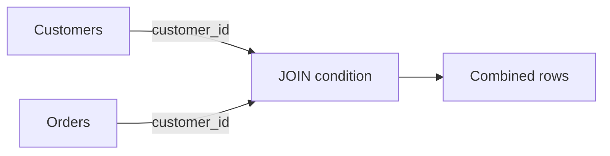

## **26. What are SQL joins?**

SQL joins হলো একটি পাওয়ারফুল technique যা দিয়ে আমরা দুই বা ততোধিক tables থেকে data কে একসাথে combine করতে পারি। এটি relational database এর সবচেয়ে গুরুত্বপূর্ণ features এর মধ্যে একটি।

- একাধিক tables এর মধ্যে relationship establish করে data retrieve করা
- Common column বা key এর মাধ্যমে tables গুলো connect করা
- Complex queries তৈরি করে comprehensive reports পাওয়া

#### **SQL Joins এর প্রকারভেদ:**
1. **INNER JOIN** - শুধুমাত্র matching records
2. **LEFT JOIN (LEFT OUTER JOIN)** - বাম table এর সব records + matching records
3. **RIGHT JOIN (RIGHT OUTER JOIN)** - ডান table এর সব records + matching records  
4. **FULL JOIN (FULL OUTER JOIN)** - দুই table এর সব records
5. **CROSS JOIN** - Cartesian product
6. **SELF JOIN** - Same table এর সাথে join


### Explain INNER JOIN with example?

**INNER JOIN** হলো সবচেয়ে common এবং widely used join। এটি শুধুমাত্র সেই records গুলো return করে যেগুলো দুই tables এ matching condition satisfy করে।

```sql
SELECT columns
FROM table1
INNER JOIN table2
ON table1.column = table2.column;
```

ধরি আমাদের দুইটি tables আছে:

**Students Table:**
```sql
CREATE TABLE Students (
    student_id INT,
    student_name VARCHAR(50),
    department_id INT
);

INSERT INTO Students VALUES
(1, 'রহিম', 101),
(2, 'করিম', 102),
(3, 'ফাতেমা', 101),
(4, 'আয়েশা', 103),
(5, 'আলী', NULL);
```

**Departments Table:**
```sql
CREATE TABLE Departments (
    department_id INT,
    department_name VARCHAR(50)
);

INSERT INTO Departments VALUES
(101, 'Computer Science'),
(102, 'Mathematics'),
(103, 'Physics'),
(104, 'Chemistry');
```

#### **INNER JOIN Query:**
```sql
SELECT s.student_name, d.department_name
FROM Students s
INNER JOIN Departments d
ON s.department_id = d.department_id;
```
| student_name | department_name |
|--------------|----------------|
| রহিম         | Computer Science |
| করিম         | Mathematics     |
| ফাতেমা       | Computer Science |
| আয়েশা        | Physics        |

**লক্ষ্য করুন:** 
- আলী এবং Chemistry department result এ নেই
- কারণ আলীর department_id NULL এবং Chemistry এর কোনো matching student নেই


### Difference between LEFT JOIN and RIGHT JOIN?

#### **LEFT JOIN (LEFT OUTER JOIN):**

- বাম table (FROM clause এ যে table আছে) এর **সব records** return করে
- ডান table থেকে শুধু matching records নেয়
- যদি match না হয় তাহলে ডান table এর columns এ NULL values দেয়

```sql
SELECT s.student_name, d.department_name
FROM Students s
LEFT JOIN Departments d
ON s.department_id = d.department_id;
```
| student_name | department_name |
|--------------|----------------|
| রহিম         | Computer Science |
| করিম         | Mathematics     |
| ফাতেমা       | Computer Science |
| আয়েশা        | Physics        |
| আলী          | NULL           |

#### **RIGHT JOIN (RIGHT OUTER JOIN):**

- ডান table (JOIN clause এর পরে যে table আছে) এর **সব records** return করে
- বাম table থেকে শুধু matching records নেয়
- যদি match না হয় তাহলে বাম table এর columns এ NULL values দেয়

```sql
SELECT s.student_name, d.department_name
FROM Students s
RIGHT JOIN Departments d
ON s.department_id = d.department_id;
```

| student_name | department_name |
|--------------|----------------|
| রহিম         | Computer Science |
| ফাতেমা       | Computer Science |
| করিম         | Mathematics     |
| আয়েশা        | Physics        |
| NULL         | Chemistry      |

#### **মূল পার্থক্য:**

| বিষয় | LEFT JOIN | RIGHT JOIN |
|-------|-----------|------------|
| **Priority** | বাম table এর সব data | ডান table এর সব data |
| **NULL values** | ডান table এর columns এ | বাম table এর columns এ |
| **Use case** | Master table এর সব records চাই | Reference table এর সব records চাই |


### What happens when join condition returns NULL?

SQL এ NULL values এর সাথে কোনো comparison operation **FALSE** return করে, এমনকি `NULL = NULL` ও FALSE।

#### **বিভিন্ন JOIN এ NULL এর প্রভাব:**

#### **1. INNER JOIN এ NULL:**
```sql
-- এই query তে আলী আসবে না কারণ NULL = কোনো value FALSE
SELECT s.student_name, d.department_name
FROM Students s
INNER JOIN Departments d
ON s.department_id = d.department_id;
```

#### **2. LEFT JOIN এ NULL:**
```sql
-- আলী আসবে কিন্তু department_name NULL হবে
SELECT s.student_name, d.department_name
FROM Students s
LEFT JOIN Departments d
ON s.department_id = d.department_id;
```

#### **3. NULL Values Handle করার উপায়:**

**COALESCE ব্যবহার:**
```sql
SELECT s.student_name, 
       COALESCE(d.department_name, 'No Department') as department_name
FROM Students s
LEFT JOIN Departments d
ON s.department_id = d.department_id;
```

**ISNULL/IFNULL ব্যবহার:**
```sql
-- SQL Server এর জন্য
SELECT s.student_name, 
       ISNULL(d.department_name, 'Unknown') as department_name
FROM Students s
LEFT JOIN Departments d
ON s.department_id = d.department_id;
```

#### **NULL এর সাথে Advanced Scenarios:**

#### **উভয় দিকে NULL:**
```sql
-- যদি উভয় table এ NULL values থাকে
INSERT INTO Students VALUES (6, 'নাদিয়া', NULL);
INSERT INTO Departments VALUES (NULL, 'Unknown Department');

-- INNER JOIN এ কোনোটাই match হবে না
-- LEFT/RIGHT JOIN এ NULL values আলাদাভাবে show হবে
```

#### **Multiple Columns এ NULL:**
```sql
SELECT s.student_name, d.department_name
FROM Students s
LEFT JOIN Departments d
ON s.department_id = d.department_id 
   AND s.student_name IS NOT NULL  -- Additional condition
   AND d.department_name IS NOT NULL;
```

#### **Best Practices NULL Handle করার জন্য:**

1. **Data Validation:** Insert/Update এর সময় NULL check করা
2. **Default Values:** Table design এ default values set করা
3. **COALESCE/ISNULL:** Query তে appropriate default values দেওয়া
4. **WHERE Clauses:** NULL values filter করার জন্য `IS NULL` বা `IS NOT NULL` ব্যবহার

#### **Performance Considerations:**
- NULL values index এ special handling প্রয়োজন
- Join operations এ NULL values extra processing time নিতে পারে
- Query optimization এর সময় NULL values consider করা জরুরি

এই সব concepts একসাথে ব্যবহার করে আপনি complex database queries efficiently handle করতে পারবেন।

----

## **27. What is FULL OUTER JOIN?**

**FULL OUTER JOIN** হলো SQL এর একটি advanced join type যা দুইটি tables এর **সব records** return করে, regardless of whether they match or not। এটি LEFT JOIN এবং RIGHT JOIN এর combination এর মতো কাজ করে।

- **বাম table** এর সব records return করে
- **ডান table** এর সব records return করে  
- **Matching records** একবারই show করে
- **Non-matching records** এর জন্য opposite side এ NULL values দেয়

```sql
SELECT columns
FROM table1
FULL OUTER JOIN table2
ON table1.column = table2.column;

-- অথবা শুধু
FULL JOIN table2
ON table1.column = table2.column;
```

আমাদের আগের **Students** এবং **Departments** tables ব্যবহার করি:

**Students Table:**
```sql
student_id | student_name | department_id
-----------|-------------|---------------
1          | রহিম         | 101
2          | করিম         | 102  
3          | ফাতেমা       | 101
4          | আয়েশা        | 103
5          | আলী          | NULL
6          | নাদিয়া       | 105  -- এই department exist করে না
```

**Departments Table:**
```sql
department_id | department_name
--------------|------------------
101           | Computer Science
102           | Mathematics
103           | Physics
104           | Chemistry      -- এই department এ কোনো student নেই
```

```sql
SELECT s.student_name, d.department_name
FROM Students s
FULL OUTER JOIN Departments d
ON s.department_id = d.department_id;
```

| student_name | department_name |
|--------------|-----------------|
| রহিম         | Computer Science |
| ফাতেমা       | Computer Science |
| করিম         | Mathematics     |
| আয়েশা        | Physics         |
| আলী          | NULL            |
| নাদিয়া       | NULL            |
| NULL         | Chemistry       |

**ব্যাখ্যা:**
- রহিম, ফাতেমা, করিম, আয়েশা → **Matching records**
- আলী, নাদিয়া → **Students without matching departments**
- Chemistry → **Department without any students**


### How is it different from UNION?

এটি একটি common confusion। অনেকে মনে করেন FULL OUTER JOIN এবং UNION same কাজ করে, কিন্তু এদের মধ্যে fundamental differences আছে।

#### **FULL OUTER JOIN:**
- **দুইটি tables** এর columns একসাথে রাখে
- **Horizontal combination** (columns side by side)
- Result এ both tables এর columns থাকে

#### **UNION:**
- **Same structure** এর tables এর rows একসাথে রাখে  
- **Vertical combination** (rows উপর নিচে)
- Result এ শুধু একটি table structure থাকে


#### **FULL OUTER JOIN Example:**
```sql
SELECT s.student_name, s.department_id as s_dept, 
       d.department_id as d_dept, d.department_name
FROM Students s
FULL OUTER JOIN Departments d
ON s.department_id = d.department_id;
```

| student_name | s_dept | d_dept | department_name |
|--------------|--------|--------|-----------------|
| রহিম         | 101    | 101    | Computer Science |
| করিম         | 102    | 102    | Mathematics     |

#### **UNION Example:**
```sql
SELECT student_name as name, 'Student' as type
FROM Students
UNION
SELECT department_name as name, 'Department' as type  
FROM Departments;
```

| name             | type       |
|------------------|------------|
| রহিম             | Student    |
| করিম             | Student    |
| Computer Science | Department |
| Mathematics      | Department |

#### **মূল পার্থক্য সারণি:**

| বিষয় | FULL OUTER JOIN | UNION |
|-------|-----------------|-------|
| **Purpose** | Related data combine করা | Similar data stack করা |
| **Structure** | Multi-table columns | Single table structure |
| **Relationship** | Foreign key based | Structure based |
| **Duplicates** | Handle করে (ON condition দিয়ে) | Remove করে (UNION) / Keep করে (UNION ALL) |
| **NULL Values** | Non-matching এর জন্য NULL | Column মিলতে হবে, NULL manually handle |
| **Performance** | JOIN operations | Set operations |

#### **কখন কোনটা ব্যবহার করবেন:**

##### **FULL OUTER JOIN ব্যবহার করুন যখন:**
- **Related tables** এর complete picture চান
- **Master-detail relationship** explore করতে চান
- **Missing data analysis** করতে চান
- **Data completeness report** তৈরি করতে চান

##### **UNION ব্যবহার করুন যখন:**
- **Similar structure** এর multiple sources combine করতে চান
- **Historical data** এবং **current data** একসাথে দেখতে চান
- **Reporting** এর জন্য different tables এর similar data চান


### Which databases support FULL OUTER JOIN?

#### **✅ FULL OUTER JOIN Support করে:**

- SQL Server
- PostgreSQL
- Oracle Database
- IBM DB2:
- SQLite (Version 3.39.0+)

#### **❌ FULL OUTER JOIN Support করে না:**

MySQL এ FULL OUTER JOIN directly support করে না। Alternative approach:

```sql
-- MySQL তে FULL OUTER JOIN এর বিকল্প
SELECT s.student_name, d.department_name
FROM Students s
LEFT JOIN Departments d ON s.department_id = d.department_id

UNION

SELECT s.student_name, d.department_name  
FROM Students s
RIGHT JOIN Departments d ON s.department_id = d.department_id
WHERE s.department_id IS NULL;
```


## **28. What is CROSS JOIN?**

**CROSS JOIN** হলো SQL এর একটি special type of join যা **Cartesian Product** তৈরি করে। এটি first table এর প্রতিটি row কে second table এর প্রতিটি row এর সাথে combine করে, **কোনো condition ছাড়াই**।

- কোনো JOIN condition প্রয়োজন নেই
- Cartesian Product তৈরি করে
- সব possible combinations return করে
- Mathematical operation এর মতো কাজ করে


```sql
-- Method 1: Explicit CROSS JOIN
SELECT columns
FROM table1
CROSS JOIN table2;

-- Method 2: Implicit (comma-separated)
SELECT columns  
FROM table1, table2;

-- Method 3: JOIN without condition (same as CROSS JOIN)
SELECT columns
FROM table1
JOIN table2;
```

**Table:**
```sql
student_id | student_name
-----------|-------------
1          | রহিম
2          | করিম
```

```sql
subject_id | subject_name
-----------|-------------
101        | Math
102        | Physics  
103        | Chemistry
```

```sql
SELECT s.student_name, sub.subject_name
FROM Students s
CROSS JOIN Subjects sub
ORDER BY s.student_name, sub.subject_name;
```

| student_name | subject_name |
|--------------|-------------|
| করিম         | Chemistry   |
| করিম         | Math        |
| করিম         | Physics     |
| রহিম          | Chemistry   |
| রহিম          | Math        |
| রহিম          | Physics     |

**Total Rows:** 2 × 3 = **6 rows**


### Why is it rarely used in practice?

#### **1. Performance Issues:**

```sql
-- Imagine করুন:
-- Table A: 1,000 rows
-- Table B: 1,000 rows  
-- CROSS JOIN Result: 1,000 × 1,000 = 1,000,000 rows!

SELECT *
FROM large_table_a
CROSS JOIN large_table_b;  -- ⚠️ Dangerous!
```
- **Memory**: বিশাল resultset memory তে load করতে হয়
- **CPU**: Processing time exponentially বাড়ে  
- **Storage**: Temporary storage প্রয়োজন
- **Network**: Data transfer overhead

#### **2. Practical Uselessness:**

##### **Most Combinations are Meaningless:**
```sql
-- একটি customer এর সাথে সব products এর combination
-- কিন্তু customer তো সব products buy করে না!
SELECT c.customer_name, p.product_name
FROM customers c
CROSS JOIN products p;  -- 😵 Meaningless data
```

##### **Business Logic Violation:**
```sql
-- Employee এবং Department এর CROSS JOIN
-- একই employee কি সব departments এ কাজ করে? না!
SELECT e.employee_name, d.department_name  
FROM employees e
CROSS JOIN departments d;  -- 🚫 Doesn't make sense
```

#### **3. Accidental Usage:**

Common Mistake - Missing JOIN Condition:
```sql
-- ভুলভাবে CROSS JOIN হয়ে যাওয়া
SELECT o.order_id, c.customer_name
FROM orders o
JOIN customers c;  -- ⚠️ Missing ON condition = CROSS JOIN!

-- সঠিক way:
SELECT o.order_id, c.customer_name  
FROM orders o
JOIN customers c ON o.customer_id = c.customer_id;
```

#### **4. Query Performance Impact:**

#### **Database Server Load:**
```sql
-- এই query server কে hang করতে পারে
SELECT *
FROM big_table1 bt1     -- 50,000 rows
CROSS JOIN big_table2 bt2    -- 30,000 rows  
CROSS JOIN big_table3 bt3;   -- 10,000 rows
-- Result: 50,000 × 30,000 × 10,000 = 15 trillion rows! 💥
```


### How many rows does CROSS JOIN return?

#### **Mathematical Formula:**
```
CROSS JOIN Result Rows = Table1 Rows × Table2 Rows × ... × TableN Rows
```
#### **Empty Tables এর Impact:**
```sql
-- Table A: 100 rows
-- Table B: 0 rows (empty)
SELECT * FROM table_a CROSS JOIN table_b;
-- Result: 100 × 0 = 0 rows
```

**Important:** যদি **কোনো একটি table empty** থাকে, তাহলে **result ও empty** হবে।


### CROSS JOIN এর Valid Use Cases

যদিও rarely used, কিছু specific scenarios আছে যেখানে CROSS JOIN useful:

#### **1. Data Generation:**
```sql
-- সব possible date এবং hour combinations
SELECT d.date_val, h.hour_val
FROM date_range d
CROSS JOIN hour_range h  
WHERE d.date_val BETWEEN '2024-01-01' AND '2024-01-07';
```

#### **2. Testing Data Creation:**
```sql
-- Test করার জন্য সব combinations
SELECT 
    t.test_case,
    e.environment,
    b.browser
FROM test_cases t
CROSS JOIN environments e  
CROSS JOIN browsers b;
```

#### **3. Report Templates:**
```sql
-- সব months এবং categories এর জন্য template
SELECT 
    m.month_name,
    c.category_name,
    0 as initial_value
FROM months m
CROSS JOIN categories c;
```

#### **4. Mathematical Calculations:**
```sql
-- Coordinate system generation
SELECT 
    x.value as x_coordinate,
    y.value as y_coordinate
FROM x_values x
CROSS JOIN y_values y
WHERE x.value BETWEEN 1 AND 10 
  AND y.value BETWEEN 1 AND 10;
```

#### **5. Configuration Combinations:**
```sql
-- সব server এবং service combinations monitoring এর জন্য
SELECT 
    s.server_name,
    srv.service_name
FROM servers s
CROSS JOIN services srv
WHERE s.active = 1 AND srv.monitored = 1;
```

---


## **29. What is SELF JOIN?**

**SELF JOIN** হলো একটি special type of join যেখানে একটি table নিজের সাথেই join করে। এটি technically কোনো আলাদা join type নয়, বরং **same table** কে দুইবার reference করে INNER JOIN বা LEFT JOIN করার technique।

- **Same table** দুইবার ব্যবহার করা হয়
- **Different aliases** দিয়ে table কে distinguish করতে হয়  
- **Hierarchical data** বা **related records** খুঁজে বের করতে ব্যবহার হয়
- **Recursive relationships** handle করার জন্য ideal

```sql
SELECT a.column1, b.column2
FROM table_name a
JOIN table_name b
ON a.column = b.related_column;
```

**গুরুত্বপূর্ণ:** SELF JOIN এ **table aliases** (a, b) ব্যবহার করা **mandatory**, নাহলে database engine confused হবে।


### Give a real-world use case (employee-manager relationship)?

এটি SELF JOIN এর সবচেয়ে classic এবং practical example।

#### **Employees Table Structure:**
```sql
CREATE TABLE Employees (
    employee_id INT PRIMARY KEY,
    employee_name VARCHAR(50),
    manager_id INT,
    salary DECIMAL(10,2),
    department VARCHAR(30)
);

INSERT INTO Employees VALUES
(1, 'রফিক আহমেদ', NULL, 80000, 'CEO Office'),        -- CEO (কোনো manager নেই)
(2, 'করিম উদ্দিন', 1, 60000, 'IT'),                   -- IT Head  
(3, 'ফাতেমা খাতুন', 1, 55000, 'HR'),                  -- HR Head
(4, 'আলী হাসান', 2, 45000, 'IT'),                     -- IT Developer
(5, 'আয়েশা বেগম', 2, 42000, 'IT'),                    -- IT Developer  
(6, 'নাদিয়া আক্তার', 3, 38000, 'HR'),                -- HR Executive
(7, 'রহিম মিয়া', 4, 35000, 'IT'),                     -- Junior Developer
(8, 'সালমা খান', 3, 40000, 'HR');                     -- HR Manager
```

#### **Hierarchy Visualization:**
```
রফিক আহমেদ (CEO)
├── করিম উদ্দিন (IT Head)
│   ├── আলী হাসান (Developer)
│   │   └── রহিম মিয়া (Junior)
│   └── আয়েশা বেগম (Developer)
└── ফাতেমা খাতুন (HR Head)
    ├── নাদিয়া আক্তার (HR Executive)
    └── সালমা খান (HR Manager)
```


#### **1. Employee এবং তাদের Manager এর তথ্য:**
```sql
SELECT 
    emp.employee_name AS 'কর্মচারী',
    emp.salary AS 'কর্মচারী_বেতন',
    mgr.employee_name AS 'ম্যানেজার',
    mgr.salary AS 'ম্যানেজার_বেতন'
FROM Employees emp
LEFT JOIN Employees mgr
ON emp.manager_id = mgr.employee_id
ORDER BY emp.employee_id;
```
| কর্মচারী | কর্মচারী_বেতন | ম্যানেজার | ম্যানেজার_বেতন |
|------------|-----------------|------------|-------------------|
| রফিক আহমেদ | 80000 | NULL | NULL |
| করিম উদ্দিন | 60000 | রফিক আহমেদ | 80000 |
| ফাতেমা খাতুন | 55000 | রফিক আহমেদ | 80000 |
| আলী হাসান | 45000 | করিম উদ্দিন | 60000 |
| আয়েশা বেগম | 42000 | করিম উদ্দিন | 60000 |
| নাদিয়া আক্তার | 38000 | ফাতেমা খাতুন | 55000 |
| রহিম মিয়া | 35000 | আলী হাসান | 45000 |
| সালমা খান | 40000 | ফাতেমা খাতুন | 55000 |

#### **2. যেসব কর্মচারী তাদের Manager এর চেয়ে বেশি বেতন পায়:**
```sql
SELECT 
    emp.employee_name AS 'কর্মচারী',
    emp.salary AS 'কর্মচারী_বেতন',
    mgr.employee_name AS 'ম্যানেজার', 
    mgr.salary AS 'ম্যানেজার_বেতন'
FROM Employees emp
INNER JOIN Employees mgr
ON emp.manager_id = mgr.employee_id
WHERE emp.salary > mgr.salary;
```

**Result:** (যদি কোনো এমন case থাকে)

#### **3. একই Manager এর অধীনে কাজ করা কর্মচারীদের তালিকা:**
```sql
SELECT 
    e1.employee_name AS 'কর্মচারী_১',
    e2.employee_name AS 'কর্মচারী_২',
    mgr.employee_name AS 'Common_Manager'
FROM Employees e1
INNER JOIN Employees e2 ON e1.manager_id = e2.manager_id
INNER JOIN Employees mgr ON e1.manager_id = mgr.employee_id
WHERE e1.employee_id < e2.employee_id  -- Duplicate avoid করার জন্য
ORDER BY mgr.employee_name;
```

**Result:**
| কর্মচারী_১ | কর্মচারী_২ | Common_Manager |
|-------------|-------------|----------------|
| আলী হাসান | আয়েশা বেগম | করিম উদ্দিন |
| নাদিয়া আক্তার | সালমা খান | ফাতেমা খাতুন |

#### **4. Manager এবং তাদের Direct Reports এর সংখ্যা:**
```sql
SELECT 
    mgr.employee_name AS 'ম্যানেজার',
    COUNT(emp.employee_id) AS 'Direct_Reports'
FROM Employees mgr
LEFT JOIN Employees emp ON mgr.employee_id = emp.manager_id
GROUP BY mgr.employee_id, mgr.employee_name
HAVING COUNT(emp.employee_id) > 0
ORDER BY Direct_Reports DESC;
```

**Result:**
| ম্যানেজার | Direct_Reports |
|-----------|----------------|
| করিম উদ্দিন | 2 |
| ফাতেমা খাতুন | 2 |
| রফিক আহমেদ | 2 |
| আলী হাসান | 1 |


### Why do we need table aliases in SELF JOIN?

#### **1. Ambiguity Resolution:**

##### **❌ Without Aliases (এটি Error দেবে):**
```sql
-- এই query কাজ করবে না
SELECT 
    employee_name,  -- কোন table এর employee_name?
    manager_id      -- কোন table এর manager_id?
FROM Employees
JOIN Employees
ON manager_id = employee_id;  -- কোনটা কার সাথে match?
```

```
Column 'employee_name' is ambiguous
Column 'manager_id' is ambiguous  
```

##### **✅ With Aliases (সঠিক approach):**
```sql
SELECT 
    emp.employee_name,    -- স্পষ্টভাবে emp table থেকে
    mgr.employee_name     -- স্পষ্টভাবে mgr table থেকে
FROM Employees emp        -- First reference (employee)
JOIN Employees mgr        -- Second reference (manager)
ON emp.manager_id = mgr.employee_id;  -- Clear relationship
```

#### **2. Database Engine এর Perspective:**

Database engine দুইটি **logically different tables** হিসেবে treat করে:
- **emp** → Current employees এর data
- **mgr** → Manager এর data (same physical table কিন্তু different logical role)

#### **3. Query Planning এবং Optimization:**

```sql
EXPLAIN SELECT 
    emp.employee_name AS employee,
    mgr.employee_name AS manager
FROM Employees emp
LEFT JOIN Employees mgr ON emp.manager_id = mgr.employee_id;
```

Database optimizer এই query কে **two separate table scan** হিসেবে treat করে optimization এর জন্য।

#### **4. Readability এবং Maintenance:**

##### **Good Alias Names:**
```sql
-- Meaningful aliases
SELECT 
    employee.name AS 'কর্মচারী_নাম',
    supervisor.name AS 'সুপারভাইজার_নাম'
FROM staff employee
LEFT JOIN staff supervisor 
ON employee.supervisor_id = supervisor.staff_id;
```

##### **Common Alias Patterns:**
```sql
-- Pattern 1: Short letters
FROM table_name a JOIN table_name b

-- Pattern 2: Descriptive
FROM employees emp JOIN employees mgr  

-- Pattern 3: Role-based  
FROM users follower JOIN users followed

-- Pattern 4: Numbered
FROM products p1 JOIN products p2
```

### SELF JOIN Best Practices

#### **1. Index Optimization:**
```sql
-- Manager lookup এর জন্য index
CREATE INDEX idx_manager_id ON Employees(manager_id);

-- Employee ID এর জন্য (usually primary key তে already আছে)  
CREATE INDEX idx_employee_id ON Employees(employee_id);
```

#### **2. NULL Handling:**
```sql
-- Manager নেই এমন employees ও include করতে LEFT JOIN ব্যবহার
SELECT 
    emp.employee_name,
    COALESCE(mgr.employee_name, 'কোনো ম্যানেজার নেই') AS manager
FROM Employees emp
LEFT JOIN Employees mgr ON emp.manager_id = mgr.employee_id;
```

#### **3. Circular Reference Prevention:**
```sql
-- Data integrity এর জন্য check constraint
ALTER TABLE Employees 
ADD CONSTRAINT chk_no_self_manager 
CHECK (employee_id != manager_id);
```

#### **4. Performance Monitoring:**
```sql
-- Large tables এর জন্য performance check
EXPLAIN ANALYZE 
SELECT emp.name, mgr.name
FROM large_employee_table emp
LEFT JOIN large_employee_table mgr 
ON emp.manager_id = mgr.employee_id;
```

SELF JOIN একটি অত্যন্ত powerful technique যা hierarchical এবং related data নিয়ে কাজ করার জন্য অপরিহার্য। Proper aliases এবং indexing এর মাধ্যমে এটি very efficient হতে পারে।

----


## **30. What is the difference between INNER JOIN and WHERE clause for joining tables?**

এটি একটি fundamental question যা অনেক developers এর মনে confusion তৈরি করে। আসলে দুইটা approach দিয়েই same result পাওয়া যায়, কিন্তু readability, maintainability এবং performance এর দিক থেকে পার্থক্য আছে।


#### **INNER JOIN Approach (Modern Standard):**
```sql
SELECT 
    s.student_name,
    d.department_name,
    s.roll_number
FROM Students s
INNER JOIN Departments d 
ON s.department_id = d.department_id
WHERE s.admission_year = 2023;
```

#### **WHERE Clause Approach (Old Style):**
```sql
SELECT 
    s.student_name,
    d.department_name,
    s.roll_number  
FROM Students s, Departments d
WHERE s.department_id = d.department_id
  AND s.admission_year = 2023;
```

**Important:** উপরের দুটি query **exactly same result** দেবে।

**Students Table:**
```sql
student_id | student_name | department_id | admission_year
-----------|-------------|---------------|---------------
1          | রহিম         | 101           | 2023
2          | করিম         | 102           | 2023  
3          | ফাতেমা       | 101           | 2022
4          | আয়েশা        | NULL          | 2023
5          | আলী          | 103           | 2023
```

**Departments Table:**
```sql
department_id | department_name
--------------|------------------
101           | Computer Science
102           | Mathematics  
103           | Physics
104           | Chemistry
```


#### Detailed Comparison

##### **INNER JOIN (Explicit Join):**
```sql
SELECT s.student_name, d.department_name
FROM Students s
INNER JOIN Departments d ON s.department_id = d.department_id;
```
- Clear separation between join conditions এবং filter conditions
- Explicit relationship definition
- Modern SQL standard
- Easy to understand table relationships

##### **WHERE Clause (Implicit Join):**
```sql
SELECT s.student_name, d.department_name  
FROM Students s, Departments d
WHERE s.department_id = d.department_id;
```

- Old-style syntax (SQL-89 standard)
- Comma-separated table list  
- Join condition mixed with filter conditions
- Less explicit about relationships


##### **Multiple Tables with INNER JOIN:**
```sql
SELECT 
    s.student_name,
    d.department_name,
    c.course_name,
    e.grade
FROM Students s
INNER JOIN Departments d ON s.department_id = d.department_id
INNER JOIN Enrollments e ON s.student_id = e.student_id  
INNER JOIN Courses c ON e.course_id = c.course_id
WHERE s.admission_year = 2023
  AND e.grade >= 'B';
```

##### **Same Query with WHERE Clause:**
```sql
SELECT 
    s.student_name,
    d.department_name, 
    c.course_name,
    e.grade
FROM Students s, Departments d, Enrollments e, Courses c
WHERE s.department_id = d.department_id
  AND s.student_id = e.student_id
  AND e.course_id = c.course_id  
  AND s.admission_year = 2023
  AND e.grade >= 'B';
```

Observation: JOIN syntax এ **join conditions** এবং **filter conditions** clearly আলাদা, যা readability বাড়ায়।


### Which is more readable?

#### **🏆 INNER JOIN বেশি Readable:**

##### **1. Clear Intent:**
```sql
-- এই query দেখলেই বুঝা যায় কোন tables join হচ্ছে
SELECT emp.name, dept.department_name
FROM employees emp
INNER JOIN departments dept ON emp.dept_id = dept.dept_id
WHERE emp.salary > 50000;  -- এটা filtering condition
```

##### **2. Easy Maintenance:**
```sql
-- নতুন table add করা সহজ
SELECT emp.name, dept.department_name, proj.project_name
FROM employees emp
INNER JOIN departments dept ON emp.dept_id = dept.dept_id
INNER JOIN projects proj ON emp.project_id = proj.project_id  -- নতুন join
WHERE emp.salary > 50000;
```

#### **❌ WHERE Clause কম Readable:**

##### **1. Mixed Conditions:**
```sql
-- Join এবং filter conditions একসাথে - confusing!
SELECT emp.name, dept.department_name
FROM employees emp, departments dept  
WHERE emp.dept_id = dept.dept_id  -- join condition
  AND emp.salary > 50000;         -- filter condition
```

##### **2. Error Prone:**
```sql
-- ভুলে join condition miss করলে CROSS JOIN হয়ে যাবে!
SELECT emp.name, dept.department_name
FROM employees emp, departments dept
WHERE emp.salary > 50000;  -- 😱 Missing join condition = Cartesian Product!
```


#### **3. Team Collaboration:**

##### **INNER JOIN Benefits:**
- New developers easily বুঝতে পারে  
- Code reviews সহজ হয়
- Documentation clear থাকে
- Industry standard following

##### **WHERE Clause Problems:**
- Legacy syntax - modern developers unfamiliar
- Debugging difficult in complex queries
- Accidental CROSS JOIN risk
- Mixed logic confusing


### Performance difference between them?

#### **🔍 Query Execution এর দিক থেকে:**

##### **Modern Database Optimizers:**

Good News আজকের database engines (MySQL 8.0+, PostgreSQL, SQL Server, Oracle) same execution plan তৈরি করে both approaches এর জন্য।

```sql
-- Both queries generate identical execution plans:

-- Query 1 (INNER JOIN):
EXPLAIN SELECT s.name, d.name  
FROM students s
INNER JOIN departments d ON s.dept_id = d.dept_id;

-- Query 2 (WHERE):  
EXPLAIN SELECT s.name, d.name
FROM students s, departments d  
WHERE s.dept_id = d.dept_id;
```

#### **Execution Plan Example (MySQL):**
```
+----+-------------+-------+--------+---------------+
| id | select_type | table | type   | key           |
+----+-------------+-------+--------+---------------+
|  1 | SIMPLE      | s     | ALL    | NULL          |
|  1 | SIMPLE      | d     | eq_ref | PRIMARY       |
+----+-------------+-------+--------+---------------+
```
**Same plan for both approaches!**


#### **Performance Factors যেগুলো Actually Matter:**

##### **1. Index Usage:**
```sql
-- Performance depends on proper indexing, not join syntax
CREATE INDEX idx_student_dept ON students(department_id);
CREATE INDEX idx_dept_primary ON departments(department_id);

-- Both syntaxes benefit equally from these indexes
```

##### **2. Query Complexity:**
```sql
-- Complex queries এ WHERE approach এ mistake হওয়ার সম্ভাবনা বেশি
SELECT *
FROM table1 t1, table2 t2, table3 t3, table4 t4
WHERE t1.id = t2.t1_id  
  AND t2.id = t3.t2_id
  AND t3.id = t4.t3_id    -- এক condition miss হলেই performance disaster!
  AND t1.active = 1;
```

**Conclusion:** Performance difference **negligible** (0.01 second difference)।

---


## **31. What is a cartesian product?**

**Cartesian Product** হলো একটি mathematical concept যা database এ তখন ঘটে যখন দুই বা ততোধিক tables এর **প্রতিটি row** অন্য table এর **সব rows** এর সাথে combine হয়। এটি **CROSS JOIN** এর result বা **accidental join** এর ফলাফল।

- **প্রতিটি row combination** তৈরি হয়
- **Result rows = Table1 rows × Table2 rows**
- **সাধারণত unintended** এবং problematic
- **Exponentially বড় resultset** তৈরি করে


**Set A (Students):**
```sql
CREATE TABLE Students (
    student_id INT,
    student_name VARCHAR(20)
);

INSERT INTO Students VALUES 
(1, 'রহিম'),
(2, 'করিম'), 
(3, 'ফাতেমা');
```

**Set B (Subjects):**
```sql
CREATE TABLE Subjects (
    subject_id INT,
    subject_name VARCHAR(20)  
);

INSERT INTO Subjects VALUES
(101, 'Math'),
(102, 'Physics');
```

```sql
SELECT *
FROM Students, Subjects;
-- অথবা
SELECT *  
FROM Students 
CROSS JOIN Subjects;
```

| student_id | student_name | subject_id | subject_name |
|------------|-------------|------------|-------------|
| 1          | রহিম         | 101        | Math        |
| 1          | রহিম         | 102        | Physics     |
| 2          | করিম         | 101        | Math        |
| 2          | করিম         | 102        | Physics     |
| 3          | ফাতেমা       | 101        | Math        |
| 3          | ফাতেমা       | 102        | Physics     |

**Total Rows:** 3 × 2 = **6 rows**

**ব্যাখ্যা:** Students table এর প্রতিটি student Subjects table এর প্রতিটি subject এর সাথে paired হয়েছে।


### When does it occur?

#### **1. Intentional CROSS JOIN:**
```sql
-- Deliberately cartesian product চাওয়া
SELECT *
FROM products 
CROSS JOIN colors;  -- সব products এর সব colors এর combination
```

#### **2. Missing JOIN Condition (Most Common):**

##### **❌ ভুল Query - Join Condition Missing:**
```sql
-- এই query cartesian product তৈরি করবে!
SELECT s.student_name, d.department_name
FROM Students s, Departments d;  -- কোনো WHERE condition নেই!
```

##### **❌ Another Common Mistake:**
```sql
-- JOIN keyword ব্যবহার করেছি কিন্তু ON condition missing!
SELECT s.student_name, d.department_name  
FROM Students s
JOIN Departments d;  -- ON condition missing = CROSS JOIN!
```

#### **3. Wrong JOIN Condition:**
```sql
-- ভুল column দিয়ে join করা
SELECT *
FROM orders o, customers c
WHERE o.order_date = c.registration_date;  -- এটি meaningful join না!
```

#### **4. Multiple Tables without Proper Conditions:**
```sql
-- Multiple tables কিন্তু insufficient join conditions
SELECT *
FROM table1 t1, table2 t2, table3 t3
WHERE t1.id = t2.t1_id;  -- t3 এর সাথে কোনো condition নেই!
-- Result: (t1 ⋈ t2) × t3 = Partial Cartesian Product
```


### Cartesian Product এর Dangerous Impact

#### **1. Exponential Growth:**

##### **Small Tables Example:**
```sql
-- Students: 5 rows, Departments: 4 rows
SELECT * FROM Students, Departments;
-- Result: 5 × 4 = 20 rows (manageable)
```

##### **Real-world Scenario:**
```sql
-- Orders: 10,000 rows, Products: 5,000 rows  
SELECT * FROM Orders, Products;  
-- Result: 10,000 × 5,000 = 50,000,000 rows! 😱
```

##### **Enterprise Scale:**
```sql
-- Users: 100,000 rows
-- Transactions: 1,000,000 rows
-- Logs: 10,000,000 rows
SELECT * FROM Users u, Transactions t, Logs l;
-- Result: 100,000 × 1,000,000 × 10,000,000 = 1 × 10^18 rows! 💥
-- এটি server crash করতে পারে!
```

#### **2. Resource Consumption:**

##### **Memory Impact:**
```sql
-- 1 million × 1 million = 1 trillion rows
-- Average row size 100 bytes
-- Total memory needed: 100 TB! 
-- কোনো server এ possible না!
```

##### **Processing Time:**
```sql
-- Simple calculation:
-- 10,000 rows × 10,000 rows = 100 million rows
-- Processing time: hours instead of seconds
```

##### **Network Traffic:**
```sql
-- Application এ data transfer করতে গেলে:
-- Network bandwidth exhaustion
-- Application crash
-- User experience disaster
```


#### **3. Real-world Horror Stories:**

##### **E-commerce Example:**
```sql
-- ভুল query যা production server crash করেছে
SELECT p.product_name, o.order_date
FROM products p, orders o  -- Missing join condition!
WHERE p.price > 100;

-- Products: 50,000, Orders: 2,000,000  
-- Result: 100 billion rows! 
-- Server memory: Exhausted
-- Query time: Never finished (killed after 6 hours)
```

##### **Analytics Disaster:**
```sql
-- Data analyst এর একটি ভুল query
SELECT *
FROM user_events ue, user_profiles up, user_sessions us;
-- 3 large tables, no join conditions
-- Result: Database server restart প্রয়োজন হয়েছে!
```


### How do you avoid it?

#### **1. সঠিক JOIN Syntax ব্যবহার করুন:**

##### **✅ Correct Way:**
```sql
SELECT s.student_name, d.department_name
FROM Students s
INNER JOIN Departments d ON s.department_id = d.department_id;
```

##### **❌ Avoid This:**
```sql
SELECT s.student_name, d.department_name
FROM Students s, Departments d;  -- No join condition!
```

#### **2. Multiple Tables এ সতর্ক থাকুন:**

##### **✅ Proper Multiple JOIN:**
```sql
SELECT s.student_name, d.department_name, c.course_name  
FROM Students s
INNER JOIN Departments d ON s.department_id = d.department_id
INNER JOIN Enrollments e ON s.student_id = e.student_id
INNER JOIN Courses c ON e.course_id = c.course_id;
```

##### **Rule of Thumb:**
```
N tables join করতে minimum (N-1) join conditions লাগবে
```

- 3 tables = minimum 2 join conditions
- 4 tables = minimum 3 join conditions  
- 5 tables = minimum 4 join conditions

#### **3. Query Validation Techniques:**

##### **Row Count Check করুন:**
```sql
-- প্রথমে individual table এর row count check করুন
SELECT COUNT(*) FROM Students;    -- 1000 rows
SELECT COUNT(*) FROM Departments; -- 10 rows  

-- এরপর join query run করুন
SELECT COUNT(*)
FROM Students s
INNER JOIN Departments d ON s.department_id = d.department_id;
-- Expected: ≤ 1000 rows (students এর count এর চেয়ে বেশি হবে না)

-- যদি result 10,000 rows হয়, তাহলে cartesian product!
```

##### **LIMIT দিয়ে Test করুন:**
```sql
-- নতুন query test করার আগে LIMIT ব্যবহার করুন
SELECT s.student_name, d.department_name
FROM Students s
INNER JOIN Departments d ON s.department_id = d.department_id  
LIMIT 10;  -- First 10 rows check করুন

-- যদি result reasonable লাগে, তাহলে LIMIT remove করুন
```

#### **4. Database Safety Measures:**

##### **Query Timeout Set করুন:**
```sql
-- MySQL
SET SESSION max_execution_time = 30000;  -- 30 seconds timeout

-- PostgreSQL  
SET statement_timeout = '30s';

-- SQL Server
SET QUERY_GOVERNOR_COST_LIMIT 120;  -- Resource limit
```

##### **Result Size Limit:**
```sql
-- Application level এ result size limit করুন
-- Example: Max 10,000 rows return করবে
SELECT TOP 10000 *  -- SQL Server
FROM Students s
INNER JOIN Departments d ON s.department_id = d.department_id;

SELECT * 
FROM Students s
INNER JOIN Departments d ON s.department_id = d.department_id  
LIMIT 10000;  -- MySQL/PostgreSQL
```

#### **5. Development Best Practices:**

##### **Code Review Checklist:**
```sql
-- ✅ প্রতিটি JOIN এর ON condition আছে কি?
-- ✅ Table count এবং join condition count match করে কি?  
-- ✅ JOIN conditions meaningful কি?
-- ✅ WHERE clause এ additional filters আছে কি?
-- ✅ Expected result size reasonable কি?
```

##### **Testing Strategy:**
```sql
-- 1. Development environment এ small dataset দিয়ে test
-- 2. EXPLAIN PLAN analyze করুন  
-- 3. Row count validation
-- 4. Performance testing with realistic data size
-- 5. Production deployment with monitoring
```

#### **6. Monitoring এবং Prevention:**

##### **Query Monitoring:**
```sql
-- Long-running queries identify করুন
SELECT 
    query,
    execution_time,
    rows_examined
FROM information_schema.processlist  
WHERE time > 60;  -- 1 minute এর বেশি running queries
```

##### **Automated Alerts:**
```sql
-- Database monitoring tools setup করুন:
-- - Query execution time alerts  
-- - Memory usage alerts
-- - CPU usage spikes
-- - Unusual result set sizes
```

Cartesian Product একটি dangerous concept যা production systems এ serious damage করতে পারে। Proper join syntax, testing, এবং monitoring এর মাধ্যমে এটি সফলভাবে avoid করা যায়।
