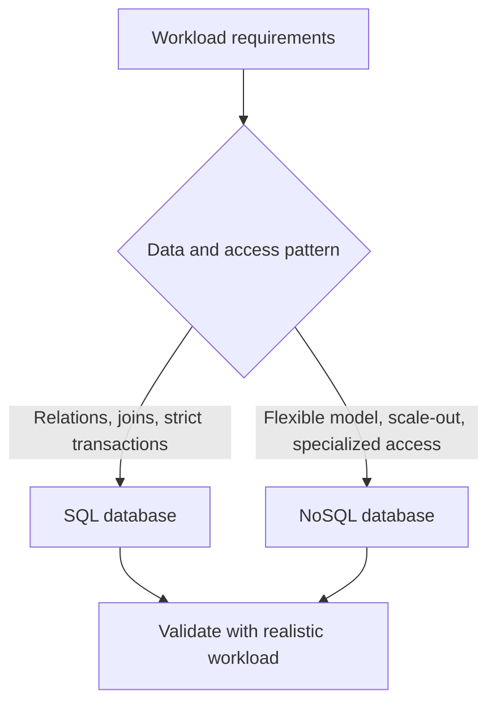

## 🏗️ **18. Architecture & Design Decisions**

## **159. When would you choose NoSQL over SQL database?**

NoSQL এবং SQL এর মধ্যে নির্বাচন করা সিস্টেম ডিজাইনের অন্যতম গুরুত্বপূর্ণ সিদ্ধান্ত। আপনি তখন NoSQL বেছে নেবেন যখন আপনার সিস্টেমে প্রথাগত রিলেশনাল ডাটাবেসের (SQL) সীমারেখা পার হয়ে যাওয়ার উপক্রম হয়।

**Specific use cases for each type:**
* **SQL (RDBMS):** ব্যাংকিং, ই-কমার্স পেমেন্ট, ইনভেন্টরি, একাউন্টিং—যেখানে ACID (Atomicity, Consistency, Isolation, Durability) এবং রিলেশনাল ডেটা (লক ও জয়েন) মাস্ট।
* **NoSQL (Document/Key-Value/Graph):** 
  * *High Write Velocity:* আইওটি (IoT), সেন্সর ডেটা বা রিয়েল-টাইম লগস (Cassandra বা Time-Series Database)।
  * *Flexible Schema:* কন্টেন্ট ম্যানেজমেন্ট সিস্টেম (CMS), ক্যাটালগ, যেখানে প্রতি আইটেমের বৈশিষ্ট্য আলাদা (MongoDB)।
  * *Graph Relationships:* সোশ্যাল মিডিয়া ফ্রেন্ডস নেটওয়ার্ক, ফ্রড ডিটেকশন (Neo4j)।
  * *High Read/Cache:* সেশন টোকেন, লিডারবোর্ড (Redis, Memcached)।

### Can you give examples of wrong choices?
* **ভুল পছন্দ ১:** একটি সোশ্যাল নেটওয়ার্কের `users`, `posts`, `comments`, এবং `likes` ট্র্যাকিং করার জন্য MySQL ব্যবহার করা এবং প্রতিদিন ৫-৬টি টেবিলে কমপ্লেক্স JOIN করা। এতে সিস্টেম খুব দ্রুত ক্র্যাশ করবে।
* **ভুল পছন্দ ২:** একটি ব্যাংকিং অ্যাপ্লিকেশনের টাকা ট্রান্সফারের কোর লজিক MongoDB তে রাখা। MongoDB এভেনচুয়াল কনসিস্টেন্সি ও ডেনর্মালাইজেশনের ওপর বেশি ফোকাসড, তাই হঠাৎ ফেইলওভারের কারণে ট্রানজেকশনে গড়মিল (Double Spending) হতে পারে।

### How do you handle transactions in NoSQL?
যদিও NoSQL সাধারণত জয়েন বা মাল্টি-টেবিল ট্রানজেকশন সাপোর্ট করে না, তারপরও ট্রানজেকশন হ্যান্ডেল করার কিছু উপায় আছে:
1. **Single-Document Atomicity:** MongoDB-তে একটি single-document write atomic। তাই bounded related data embed করলে এক operation-এ document update atomic রাখা যায়; multiple operation বা external side effect এতে atomic হয়ে যায় না।
2. **Two-Phase Commit (2PC) / Saga Pattern:** অ্যাপ্লিকেশন লেভেলে কোড লিখে একাধিক ডকুমেন্টে আপডেট চালানো এবং কোনো একটি ফেইল করলে কম্পেনসেটিং (Compensating) কোড লিখে আগেরগুলো রোলব্যাক করা (Two-phase commit)।

---

## **160. Microservices: shared database vs database per service?**

মাইক্রোসার্ভিসের দুনিয়ায় ডাটাবেস ডিজাইন একটি ক্লাসিক ডিলেমা।

### Trade-offs of each approach?

**১. Shared Database (সব সার্ভিসের জন্য ১টি ডাটাবেস):**
* **সুবিধা:** ডেভেলপ করা খুব সহজ। ডাটাবেসের মধ্যে সাধারণ JOIN ব্যবহার করে সহজেই সব ডেটা আনা যায়। ট্রানজেকশন (ACID) মেইনটেইন করা সহজ।
* **অসুবিধা:** এটি মাইক্রোসার্ভিসের মূল নীতি (Coupling)-এর পরিপন্থী। ডাটাবেস ক্র্যাশ করলে পুরো কোম্পানি ডাউন হয়ে যাবে (Single Point of Failure)। একটি টিমের স্কিমা পরিবর্তন অন্য টিমকে ভাঙতে পারে।

**২. Database-per-service (প্রতিটি সার্ভিসের আলাদা ডাটাবেস):**
* **সুবিধা:** সম্পূর্ণ ডিকাপলড (Decoupled)। `User Service` চাইলে MySQL ব্যবহার করতে পারে, আর `Search Service` চাইলে Elasticsearch ব্যবহার করতে পারে (Right tool for the right job)। এক সার্ভিসে সমস্যা হলে অন্য সার্ভিস চলতে থাকে।
* **অসুবিধা:** দুটি ভিন্ন সার্ভিসের ডেটা (যেমন: Order History এবং User details) একসাথে দেখার জন্য JOIN করা যায় না। API বা ইভেন্টের মাধ্যমে ডেটা যোগাড় করতে হয়, যা বেশ জটিল ও স্লো।

### How do you handle cross-service transactions?
ধরা যাক, ই-কমার্সে `Order Service` এ অর্ডার হলো, এরপর `Inventory Service` থেকে প্রোডাক্ট মাইনাস হতে হবে। যেহেতু ডাটাবেস ভিন্ন, তাই সাধারণ ট্রানজেকশন (SQL `COMMIT`) এখানে কাজ করবে না। 
* **সমাধান - Saga Pattern:** 
  1. `Order Service` অর্ডার তৈরি করে `Pending` স্ট্যাটাস দিয়ে Kafka তে ইভেন্ট পাঠায়।
  2. `Inventory Service` তা শুনে ইনভেন্টরি কমায় এবং `Success` ইভেন্ট পাঠায়।
  3. `Order Service` রেসপন্স পেয়ে অর্ডার `Confirmed` করে।
  * যদি ইনভেন্টরি না থাকে, সে `Failed` ইভেন্ট পাঠায় এবং `Order Service` তখন অর্ডারটিকে কম্পেনসেট করে `Cancelled` করে দেয় (যাকে Compensating Transaction বলে)।

---

## **161. How do you handle soft deletes vs hard deletes?**

**Soft Delete** মানে হলো ডাটাবেস থেকে ডেটা মুছে না ফেলে একটি ফ্ল্যাগ (`is_deleted=true` বা `deleted_at=timestamp`) সেট করে ডেটা হাইড করে রাখা। আর **Hard Delete** মানে হলো `DELETE FROM` কমান্ড চালিয়ে হার্ডডিস্ক থেকে চিরতরে ডেটা মুছে ফেলা।

### Which is better for auditing requirements?
* অডিটিং এবং হিস্ট্রি ট্র্যাকিংয়ের জন্য **Soft Delete** ই বেস্ট। এর মাধ্যমে বোঝা যায় কখন ডেটাটি ডিলিট করা হয়েছিল এবং প্রয়োজনে "Undo / Recover" করা সম্ভব হয়। 
* ব্যাংকিং ledger, invoice বা regulated record সাধারণত retention policy অনুযায়ী immutable/audited রাখা হয়। তবে privacy law, legal retention এবং archival policy দেখে hard delete বা cryptographic erasure-এর প্রয়োজন হতে পারে।

### Performance implications of soft deletes?
* **ইনডেক্সিং এবং কুয়েরি স্লো হয়:** ডাটাবেসে ডেটা জমতে জমতে বিশাল হয়ে যায়। এর ফলে সকল কুয়েরিতে `WHERE is_deleted = false` লাগাতে হয়, যা পারফরম্যান্সে বিরূপ প্রভাব ফেলে। 
* **ইউনিক কনস্ট্রেইন্ট সমস্যা:** যদি ইমেইল কলাম UNIQUE থাকে এবং ইউজার `test@mail.com` সফট ডিলিট করে নতুন করে আবার ওই ইমেইল দিয়ে একাউন্ট খুলতে চায়, তখন ডাটাবেস তাকে খুলতে দেবে না (Duplicate key error)। 

### How do you clean up old soft-deleted records?
সফট ডিলিট করা ডেটা চিরকাল মূল টেবিলে জমিয়ে রাখলে ডাটাবেস স্লো হয়ে যাবে। এ থেকে বাঁচতে:
* **Background Scrubbing Job:** একটি অটোমেটেড স্ক্রিপ্ট বা Cron Job থাকে, যা প্রতি রাতে রান করে এবং দেখে যেসব ডেটা `deleted_at` হওয়ার পর ৩০ বা ৯০ দিন পার হয়ে গেছে, সেগুলোকে পার্মানেন্টলি হার্ড ডিলিট করে দেয়, অথবা মূল টেবিল থেকে সরিয়ে সস্তা **Archive/Cold Storage** টেবিলে সেভ করে রাখে।

---

## **162. How do you design for multi-tenancy?**

Multi-tenancy হলো এমন একটি আর্কিটেকচার যেখানে একটিমাত্র অ্যাপ্লিকেশন ইনস্ট্যান্স একই সাথে একাধিক কাস্টমার (Tenant) কে সার্ভিস দেয় (যেমন: Shopify, Slack, Salesforce)।

### Shared database vs separate database per tenant?
মাল্টি-টেন্যান্ট সিস্টেম ডিজাইনের ৩টি মূল স্ট্র্যাটেজি আছে:

1. **Database per tenant (আইসোলেটেড):** প্রতিটি কাস্টমারের জন্য সম্পূর্ণ আলাদা আস্ত একটি ডাটাবেস।
   * *সুবিধা:* সর্বোচ্চ সিকিউরিটি এবং ডেটা প্রাইভেসি। এক কাস্টমারের ডেটা ক্র্যাশ করলে অন্যের কোনো সমস্যা নেই।
   * *অসুবিধা:* যদি ১০ হাজার কাস্টমার থাকে, তবে ১০ হাজার ডাটাবেস মেইনটেইন করা এবং স্কিমা আপডেট করা প্রায় অসম্ভব (High cost and ops payload)। 
2. **Schema per tenant:** সবার ডাটাবেস ১টিই থাকে, কিন্তু ডাটাবেসের ভেতরে প্রত্যেকের আলাদা স্কিমা বা নেমস্পেস থাকে।
   * *সুবিধা:* মেইনটেইন করা ইজি, আবার ডেটাও লজিক্যালি আইসোলেটেড থাকে।
3. **Shared Database, Shared Schema (Row-Level Security):** সব কাস্টমারের ডেটা একই টেবিলে থাকে। প্রতিটি রো (Row) তে একটি এক্সট্রা কলাম থাকে `tenant_id`। 
   * *সুবিধা:* খরচ সবচেয়ে কম, স্কেলিং করা খুব সহজ।
   * *অসুবিধা:* কুয়েরিতে ভুল করে `tenant_id` ফিল্টার দিতে ভুলে গেলে এক কাস্টমার অন্য কাস্টমারের ডেটা দেখে ফেলবে (Massive Data Leak)। 

### Row-level security implementation?
এই লিকেজ থেকে বাঁচতে আধুনিক RDBMS (যেমন PostgreSQL) এ **Row-Level Security (RLS)** ব্যবহার করা হয়। 
* RLS অন করলে আপনি ডাটাবেস লেভেলেই রুল বা পলিসি সেট করে দিতে পারেন যে, যে ইউজার লগইন করেছে, তার আইডির সাথে `tenant_id` ম্যাচ না করলে সে কোনোভাবেই ওই রো দেখতে বা এডিট করতে পারবে না। এতে অ্যাপ্লিকেশন লেভেলে কোডের ভুল হলেও লিকেজ হয় না।

---

## **163. How do you handle large file storage (images, videos)?**

ইউজার প্রোফাইল পিকচার, পিডিএফ বা ভিডিওর মতো ফাইলগুলোকে ডাটাবেসে সেভ করা উচিত কি না—এটি একটি গুরুত্বপূর্ণ ডিসিশন। 

### Database BLOB vs file system vs object storage?

1. **Database BLOB (Binary Large Object):**
   * *কীভাবে কাজ করে:* ইমেজটিকে বাইনারি ফাইলে কনভার্ট করে সরাসরি ডাটাবেস টেবিলের একটি কলামে সেভ রাখা।
   * *কেন এটা সবচেয়ে খারাপ চয়েস?* ফাইল সাইজে বড় হয়, যা ডাটাবেসের RAM, Cache এবং Backup-কে মারাত্মক স্লো করে দেয়। ডাটাবেস মূলত ছোট এবং রিলেশনাল ডেটার জন্য অপটিমাইজড, বাইনারি ফাইলের জন্য নয়। 
2. **File System (লোকাল ডিস্ক):**
   * *কীভাবে কাজ করে:* সার্ভারের হার্ডডিস্কে (যেমন `/var/www/uploads/`) সেভ করে রাখা এবং ডাটাবেসে ফাইলের পাথ বা নাম সেভ করা।
   * *সমস্যা:* সার্ভার স্কেল-আউট করলে (একাধিক সার্ভার বসালে) এক সার্ভারে আপলোড করা ফাইল অন্য সার্ভার থেকে পাওয়া যায় না। ব্যাকআপ নেয়াও কষ্টকর।
3. **Object Storage (Amazon S3, Google Cloud Storage):**
   * *কেন এটি সাধারণত ভালো সমাধান?* Object storage খুব বড় scale, lifecycle policy ও CDN integration দেয়। Capacity, request rate, cost এবং consistency behavior provider-ভেদে সীমাবদ্ধতা রাখে।

### How do you ensure consistency between database and file storage?
যদি AWS S3 তে ইমেজ আপলোড সাকসেসফুল হয় কিন্তু ডাটাবেসে সেই লিংক সেভ হওয়ার আগেই সিস্টেম ফেইল করে—তাহলে S3 তে একটি অনাথ (Orphan) ফাইল পড়ে থাকবে।
* **সমাধান:** 
  1. প্রথমে ডাটাবেসে `file_status = 'pending'` লিখে ডেটা এন্ট্রি করা হয়।
  2. এরপর S3 তে আপলোড করা হয়।
  3. সফল হলে ডাটাবেসে স্ট্যাটাস আপডেট করে `status = 'uploaded'` করা হয়। 
  4. একটি উইকলি স্ক্রিপ্ট (Cron) ডাটাবেস স্ক্যান করে পেন্ডিং থাকা অনাথ ফাইলগুলোকে S3 থেকে ডিলিট করে দেয়।

---

## **164. How do you implement audit trails in database?**

সিস্টেমে কে, কখন, কোন ডেটা চেঞ্জ করেছে তা ট্র্যাক করার জন্য Audit Trail ব্যবহার করা হয় (বিশেষ করে ফাইন্যান্স ও হেলথকেয়ারে)।

### Trigger-based vs application-level auditing?

**১. Trigger-based Auditing (Database Level):**
* *কীভাবে কাজ করে:* ডাটাবেসের টেবিলে AFTER INSERT, UPDATE, DELETE ট্রিগার লেখা থাকে। কেউ টেবিলে হাত দিলেই ট্রিগার নিজে থেকে ওই পরিবর্তনের আগের ও পরের ডেটাকে একটি `audit_logs` টেবিলে কপি করে রাখে।
* *সুবিধা:* অ্যাপ্লিকেশন কোড পাল্টাতে হয় না। কেউ সরাসরি ডাটাবেসে ঢুকে ম্যানুয়ালি ডেটা চেঞ্জ করলেও তা ট্র্যাক হয়ে যায়।
* *অসুবিধা:* প্রচুর পারফরম্যান্স ওভারহেড তৈরি হয়, কারণ প্রতিটি রাইটের জন্য ডাবল রাইট করতে হয়। 

**২. Application-level Auditing:**
* *কীভাবে কাজ করে:* ব্যাকএন্ড কোড (যেমন ORM) ডেটা সেভ করার পাশাপাশি অডিট ইভেন্ট তৈরি করে এবং তা ডাটাবেস বা এক্সটার্নাল লগে (যেমন Elasticsearch) সেভ করে।
* *সুবিধা:* অনেক বেশি কন্ট্রোল পাওয়া যায় (যেমন: কোন আইপি এড্রেস, কোন লগইন সেশন থেকে চেঞ্জ হয়েছে তা লগ করা সহজ)।
* *বেস্ট প্র্যাকটিস:* ডাটাবেস লেভেলে রাইট লোড কমাতে অডিট ডেটা মেসেজ ব্রোকারের (Kafka) মাধ্যমে এসিঙ্ক্রোনাসভাবে অন্য কোনো সিস্টেম বা Data Warehouse-এ পাঠানো। 

---

## **165. How do you handle time zones in global applications?**

আপনার সার্ভার আমেরিকায়, ইউজার বাংলাদেশে, আপনার ডাটাবেস সিঙ্গাপুরে—এই অবস্থায় সময়ের (Date & Time) হিসাব রাখা একটি ভয়ংকর অভিজ্ঞতা হতে পারে যদি আপনি সঠিক প্যাটার্ন ফলো না করেন। 

### Store UTC vs local time?
**সাধারণ নিয়ম:** ঘটে যাওয়া instant সাধারণত UTC-তে রাখুন। তবে ভবিষ্যৎ local schedule (যেমন “প্রতি দিন সকাল ৯টা, Asia/Dhaka”) বা আইনগত local timestamp-এর জন্য UTC instant-এর পাশাপাশি IANA timezone/মূল local value রাখতে হয়।
* **কেন?** কারণ আমেরিকা বা অন্যান্য দেশে ডে-লাইট সেভিং টাইম (DST) থাকে। ডাটাবেসে লোকাল টাইম রাখলে, কোন সময় ঘড়ির কাঁটা এগোল বা পেছাল তা ট্র্যাকিং করা অসম্ভব হয়ে যাবে এবং কুয়েরি ভুল রেজাল্ট দেবে (যেমন ২৪ ঘণ্টার ডাটাবেস রিপোর্টে ২৫ ঘণ্টা চলে আসবে)।

### How do you handle timezone conversion?
1. **Frontend (App/Browser):** ডাটাবেস API দিয়ে UTC টাইম স্ট্রিং পাঠাবে (যেমন: `2024-05-10T14:30:00Z`)। ইউজারের ব্রাউজার বা মোবাইল ফোন সেই ডেটা রিসিভ করে ইউজারের বর্তমান টাইম জোন অনুযায়ী রূপান্তর করে দেখাবে।
2. **Database Queries:** যদি ডাটাবেসের ভেতর কোনো মান্থলি রিপোর্ট জেনারেট করার জন্য টাইমজোন রূপান্তর করতে হয়, তবে ডাটাবেসের নিজস্ব ফাংশন (যেমন PostgreSQL এ `AT TIME ZONE`) ব্যবহার করে ওই নির্দিষ্ট কুয়েরির জন্য টাইমজোন কাস্ট করা হয়।

---

## **166. How do you implement database versioning for SaaS applications?**

SaaS (Software as a Service) অ্যাপ্লিকেশনে ৫ মিনিট ডাটাবেস ডাউন করাও অনেক সময় ক্ষতিকর হতে পারে। তাই Zero-downtime স্কিমা মাইগ্রেশন খুবই জরুরি। 

### How do you handle schema migrations with zero downtime?
ডাটাবেসে কলাম যোগ করা বা রিমুভ করার জন্য **"Expand and Contract Pattern"** ব্যবহার করা হয়। 

ধরা যাক, আপনি `first_name` এবং `last_name` কলাম দুটি বাদ দিয়ে `full_name` নামে ১টি কলাম রাখতে চান। 
* **ধাপ ১ (Expand):** ডাটাবেসে পুরোনো কলাম না ডিলিট করেই নতুন `full_name` কলাম যোগ করা হয়।
* **ধাপ ২ (Application Update):** ব্যাকএন্ড কোড আপডেট করে এমন করা হয় যে সে পুরোনো কলামগুলোতেও লিখবে, আবার নতুন কলামটিতেও ডেটা লিখবে (Dual writes)। 
* **ধাপ ৩ (Backfill):** ব্যাকগ্রাউন্ডে একটি স্ক্রিপ্ট চালিয়ে ডাটাবেসের সব পুরোনো ইউজারদের `first_name` ও `last_name` জোড়া লাগিয়ে `full_name` ঘরে বসানো হয়। 
* **ধাপ ৪ (Contract):** এবার কোড চেঞ্জ করে অ্যাপকে বলা হয় শুধু `full_name` থেকে পড়তে। এরপর কয়েকদিন সিস্টেম ঠিকভাবে চলার পর পুরোনো কলাম দুটো ডিলিট করে দেওয়া হয়। 
এতে ইউজার ১ সেকেন্ডের জন্যও টেরই পায় না যে সিস্টেম পাল্টেছে। 

### Rollback strategies for database changes?
স্কিমা চেঞ্জ করার জন্য **Flyway** বা **Liquibase** এর মতো ভার্সন কন্ট্রোল টুল ব্যবহার করা হয়। প্রতিটি SQL মাইগ্রেশন স্ক্রিপ্টের সাথে একটি `Up.sql` (নতুন চেঞ্জ) এবং একটি `Down.sql` (রোলব্যাক বা আগের অবস্থায় ফেরার চেঞ্জ) থাকে। প্রোডাকশনে ব্রেক করলে স্ক্রিপ্ট চালিয়ে মুহূর্তেই আগের ডেটাবেস স্কিমায় ফিরে যাওয়া যায়।

---

## **167. How do you design databases for high write throughput?**

যখন আপনার সিস্টেমে প্রতি সেকেন্ডে লাখ লাখ Write Operation আসবে, তখন ট্রেডিশনাল ডাটাবেস (B-Tree structure) কাজ করবে না, কারণ ডিস্কে রেন্ডমভাবে লেখা খুব স্লো (Random I/O)।

### Write-optimized storage engines?
হাই-রাইট সিস্টেম ডিজাইনের কোর আর্কিটেকচার হলো **LSM-Trees (Log-Structured Merge-Tree)**।
* Apache Cassandra, RocksDB, LevelDB এগুলো LSM-Tree ব্যবহার করে। 
* **কীভাবে কাজ করে?** ডেটা ডিস্কে সরাসরি না লিখে প্রথমে RAM এ (MemTable) বাফার করা হয়। RAM যখন ভরে যায়, তখন এটি হার্ডডিস্কে সিকুয়েনশিয়ালি ফ্ল্যাশ বা ডাম্প (SSTable) করে দেয়। হার্ডডিস্কে সিকুয়েনশিয়ালি লেখা (Sequential I/O) রেন্ডম রাইটের তুলনায় হাজার গুণ ফাস্ট। 

### Partitioning strategies for writes?
শুধু ইঞ্জিন ভালো হলেই হবে না, লোড ব্যালান্স করার জন্য ডাটাবেসকে ভাগ বা Sharding করতে হয়।
* **Consistent Hashing:** ডেটার কী-গুলোকে এমনভাবে হ্যাশ করে বিভিন্ন সার্ভারে ডিস্ট্রিবিউট করা হয়, যাতে সব সার্ভার (Node) সমানভাবে ট্রাফিক পায় এবং কোনো একটি সার্ভার ওভারলোড হয়ে ক্র্যাশ না করে।

### When to consider write-through vs write-back caching?
* **Write-through cache:** Application/cache layer write-টি backing store-এ synchronously persist হওয়ার পরে success দেয়। এটি cache ও database consistency সহজ করে, কিন্তু extra latency যোগ করে; suitability workload ও durability design-এর ওপর নির্ভর করে।
* **Write-back cache (Asynchronous):** ডেটা সরাসরি মেমরি ক্যাশে (Redis) লিখে সাথে সাথে ইউজারকে সাক্সেস দেখিয়ে দেয়। আর ব্যাকগ্রাউন্ডে কোনো ওয়ার্কার ধীরেসুস্থে হার্ডডিস্কে (ডাটাবেসে) সেটা সিঙ্ক করতে থাকে। এটি এক্সট্রিম লেভেলের রাইট থ্রুপুট দিতে পারে, তবে সার্ভার হঠাৎ ক্র্যাশ করলে মেমরির কিছু লেটেস্ট ডেটা হারিয়ে যাওয়ার রিস্ক থাকে।

---

## **175. How do you migrate from one database to another (e.g., Oracle to PostgreSQL)?**

ডাটাবেস মাইগ্রেশন (Migration) হলো বিশ্বের সবচেয়ে ভয়াবহ এবং হাই-রিস্ক ইঞ্জিনিয়ারিং কাজগুলোর একটি। 

### What are the main challenges?
* **ডেটা লস এবং লিকেজ:** মুভ করার সময় লাখো ডেটার মধ্যে ১টি রো মিস হলেও বড় ড্যামেজ হয়ে যায়। 
* **ডেটা টাইপ পার্থক্য:** Oracle এর স্পেসিফিক অনেক ডেটা টাইপ বা ফিচার PostgreSQL এ নেই, অথবা অন্যভাবে কাজ করে।
* **ডাউনটাইম:** টেরাবাইট সাইজের ডেটা ডাটাবেস থেকে ডাম্প করে অন্য ডাটাবেসে রিস্টোর করতে কয়েক ঘণ্টা থেকে দিন পর্যন্ত সময় লাগতে পারে, যা প্রডাকশন সিস্টেমে অসম্ভব। 

### How do you handle it with zero downtime?
প্রোডাকশন সিস্টেমে জিরো-ডাউনটাইম ডাটাবেস মাইগ্রেশন সাধারণত **CDC (Change Data Capture)** ব্যবহার করে করা হয়।

1. **Initial Snapshot & Sync:** প্রথমে Oracle ডাটাবেসের একটি স্ন্যাপশট নিয়ে সেটি ধীরে ধীরে PostgreSQL এ রিস্টোর করা হয়।
2. **Replication (CDC - Debezium):** এরপর **Debezium** বা **AWS DMS** এর মতো টুল ব্যবহার করে Oracle এর ট্রানজেকশনাল লগ (Redo Logs) রিড করা হয়। স্ন্যাপশট নেয়ার পর থেকে Oracle এ যত নতুন Read/Write হচ্ছে রিয়েল-টাইমে তা PostgreSQL এ সিঙ্ক হতে থাকে।
3. **Dual Writes:** অ্যাপ্লিকেশন লেভেলে কোড চেঞ্জ করে একই সাথে Oracle এবং PostgreSQL উভয় ডাটাবেসেই নতুন ডেটা লেখা শুরু হয় (Dual Writes)।
4. **Verification:** এরপর এক থেকে দুই সপ্তাহ দুটি ডাটাবেসের রেজাল্ট ব্যাকগ্রাউন্ডে ম্যাচ বা তুলনা (Shadow read) করা হয় দেখতে যে নতুন ডাটাবেস নির্ভুল রেজাল্ট দিচ্ছে কি না।
5. **Cut-over:** যখন কনফিডেন্স ১০০% আসে, তখন রুটিন পরিবর্তন করে অ্যাপ্লিকেশনের সব রিড/রাইট পুরোপুরি PostgreSQL এ রাউট করে দেয়া হয় এবং পুরোনো Oracle লিগ্যাসি ডাটাবেসটিকে টার্মিনেট করে দেয়া হয়। 

---
