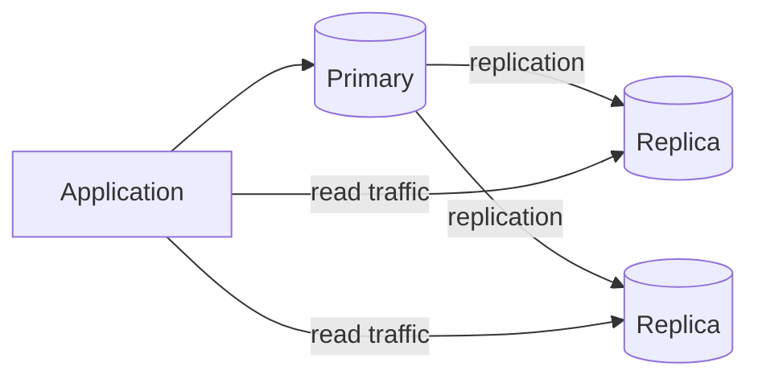

### Practical routing example

```text
POST /orders  -> primary database
GET /catalog  -> read replica
GET /orders/42 immediately after write -> primary or session-consistent replica
```

## 🏢 **9. High Availability & Scalability**

## **101. What is database clustering?**

**Database Clustering** হলো একাধিক সাধারণ ডাটাবেস সার্ভারকে (Node) এমনভাবে একত্রে যুক্ত করার একটি প্রযুক্তি, যাতে অ্যাপ্লিকেশন বা ইউজারের কাছে মনে হয় যে তারা একটি মাত্র শক্তিশালী ডাটাবেসের সাথেই যোগাযোগ করছে। এটি মূলত ডাটাবেসকে হাইলি এভেইল্যাবল (High Availability - HA) এবং স্কেলেবল করার জন্য ব্যবহৃত হয়। 

সহজ কথায়, একটি শক্তিশালী সার্ভার ব্যবহার করার পরিবর্তে, বেশ কয়েকটি সার্ভারকে একসাথে কানেক্ট করে একটি "ক্লাস্টার" (Cluster) তৈরি করা হয়। যদি কোনো একটি সার্ভার ডাউন হয়ে যায়, ক্লাস্টারের অন্য সার্ভারগুলো তখন দায়িত্ব নিতে পারে, ফলে সার্ভিস কখনো বন্ধ হয় না।

**Technical definition:** Database clustering is the process of connecting two or more database servers to function as a single, coordinated logical unit. It is primarily designed to achieve high availability, fault tolerance, and load balancing by distributing database transactions and storage across multiple nodes.

### Difference between active-active and active-passive clustering?

| Feature | Active-Active Clustering | Active-Passive Clustering |
|---------|-------------------------|---------------------------|
| **ওয়ার্কিং মডেল** | একাধিক active node traffic নেয়; সব node-এ write করা যাবে কি না product/topology-নির্ভর | একটি active primary traffic নেয়, standby promotion-এর জন্য প্রস্তুত থাকে |
| **লোড ব্যালেন্সিং** | Eligible traffic node-গুলোর মধ্যে ভাগ হয়; write conflict/coordination cost থাকতে পারে | Write primary-তে যায়; standby/read replica read traffic নিতে পারে |
| **ফেইলওভার (Failover)**| surviving node traffic নিতে পারে, তবে detection, routing ও retry-তে brief disruption হতে পারে | standby promotion ও client rerouting-এর সময় downtime হতে পারে |
| **রিসোর্স ব্যবহার** | বেশি node serve করে, কিন্তু replication/coordination overhead থাকে | standby health check, WAL replay, backup বা read workload-এ ব্যবহৃত হতে পারে |
| **কমপ্লেক্সিটি** | কনফ্লিক্ট ম্যানেজমেন্ট (data conflict) সামলানো বেশ জটিল ও ব্যয়বহুল। | ইমপ্লিমেন্ট করা অনেক সহজ এবং কম ব্যয়বহুল। |

### How does failover work in clusters?
**Failover** হলো কোনো নোড ক্র্যাশ করলে স্বয়ংক্রিয়ভাবে ট্রাফিক অন্য সচল নোডে ট্রান্সফার করার প্রক্রিয়া।

* একটি ক্লাস্টারে নোডগুলো নিজেদের মধ্যে রেগুলার **"Heartbeat"** সিগন্যাল আদান-প্রদান করে (যেমন: "আমি বেঁচে আছি, তুমি আছো তো?")।
* যদি কোনো নোডের হার্টবিট কয়েক সেকেন্ডের জন্য আসা বন্ধ হয়ে যায়, তখন ক্লাস্টার ম্যানেজমেন্ট সফটওয়্যার (যেমন: Zookeeper বা Pacemaker) ধরে নেয় যে নোডটি মারা গেছে বা ডাউন হয়েছে।
* তখন সাথে সাথেই ক্লাস্টারটি ওই মৃত নোডটিকে নেটওয়ার্ক থেকে সরিয়ে দেয় এবং সমস্ত রিকোয়েস্ট অন্য সচল নোডগুলোতে ফরওয়ার্ড করে। এটি এত দ্রুত হয় যে ইউজাররা কোনো বাধাই অনুভব করেন না।

---

## **102. What is database replication?**

**Database Replication** হলো একটি সার্ভার থেকে এক বা একাধিক অন্য সার্ভারে ডাটাবেসের হুবহু কপি বা ক্লোন (Clone) তৈরি করে রাখার প্রক্রিয়া। ক্লাস্টারিং যেখানে পারফরম্যান্স এবং লোড শেয়ারিংয়ের ওপর জোর দেয়, রেপ্লিকেশন সেখানে ডেটার ব্যাকআপ এবং রিডিং স্পিড বাড়ানোর ওপর জোর দেয়।

এর মূল সুবিধা হলো—যদি মেন ডাটাবেসে (Master) কোনো কারণে ডেটা ডিলিট হয়ে যায় বা হার্ডডিস্ক পুড়ে যায়, সার্ভারের অন্যান্য কপি (Slave) থেকে ডেটা খুব সহজেই উদ্ধার করা যায়।

**Technical definition:** Database replication is the continuous and automated copying of data changes from a primary database instance to one or more secondary database instances. It ensures data redundancy, increases query throughput (by scaling reads), and minimizes data loss.

### Types of replication (synchronous vs asynchronous)?

**১. Synchronous Replication (সিনক্রোনাস):**
* **কীভাবে কাজ করে:** যখন ইউজার মূল ডাটাবেসে (Master) কোনো ডেটা সেভ করে, তখন মাস্টার ডাটাবেস সেই ডেটা সাথে সাথে স্লেভ (Slave) ডাটাবেসগুলোতে পাঠায়। যতক্ষণ না অন্য স্লেভগুলো কনফার্ম করে যে "হ্যাঁ, আমরা আপডেট পেয়েছি", ততক্ষণ মাস্টার ইউজারকে 'Success' মেসেজ দেয় না।
* **সুবিধা:** Commit acknowledgement যথেষ্ট synchronous replica-এর durable write-এর জন্য অপেক্ষা করলে acknowledged data-loss window কমে। Quorum, failure mode ও configuration না দেখে “zero data loss” guarantee করা যায় না।
* **অসুবিধা:** সিস্টেম অনেক স্লো হয়ে যায়, কারণ একটি ডাটাবেস আপডেট করার জন্য অন্যগুলোর উত্তরের অপেক্ষায় থাকতে হয়।

**২. Asynchronous Replication (অ্যাসিনক্রোনাস):**
* **কীভাবে কাজ করে:** মাস্টার ডাটাবেসে ডেটা ঢোকা মাত্রই সে ইউজারকে 'Success' মেসেজ দিয়ে দেয়। এরপর সে আরামসে ব্যাকগ্রাউন্ডে নিজের সুবিধামতো সময়ে ডেটাগুলো স্লেভের কাছে পাঠায়।
* **সুবিধা:** অত্যন্ত ফাস্ট এবং হাই পারফরম্যান্স।
* **অসুবিধা:** যদি ব্যাকগ্রাউন্ডে সিঙ্ক হওয়ার আগেই মাস্টার ডাটাবেসটি ক্র্যাশ করে যায়, তবে সর্বশেষ ডেটাগুলো চিরতরে হারিয়ে যেতে পারে (Data Loss).

### What is replication lag and how to minimize it?
**Replication Lag** হলো মাস্টার ডাটাবেসে কোনো ডেটা আপডেট হওয়ার পর, সেটি স্লেভ ডাটাবেসে পৌঁছাতে এবং আপডেট হতে ঠিক যতটুকু সময় লাগে, সেই ডিলে (Delay) বা সময়ের পার্থক্যকে বোঝায়। 

* **কীভাবে কমাবেন?**
  1. **নেটওয়ার্ক ভালো করা:** ডাটাবেসগুলোর মধ্যে লেটেন্সি বা পিং টাইম (Ping time) কমানোর জন্য প্রাইভেট বা ডেডিকেটেড ফাস্ট নেটওয়ার্ক ব্যবহার করা।
  2. **প্যারালাল অ্যাপ্লিকেশন (Parallel Replication):** স্লেভ নোডে সিঙ্গেল-থ্রেডের বদলে মাল্টি-থ্রেড রেপ্লিকেশন চালু করা, যাতে একসাথে অনেক ডেটা আপডেট হতে পারে (MySQL ৫.৭+ এ এই ফিচারটি অসাধারণ কাজ করে)।
  3. **অপ্রয়োজনীয় ডেটা এড়ানো:** রেপ্লিকেশন লগে বড় বা জটিল কুয়েরি (যেমন পুরো টেবিল একসাথে আপডেট) না চালানো। 

---

## **103. What is database sharding?**

**Database Sharding** হলো একটি বিশাল ডাটাবেস টেবিলকে কেটে ছোট ছোট টুকরোতে (Shard) ভাগ করে আলাদা আলাদা সার্ভার মেশিনের হার্ডডিস্কে ছড়িয়ে রাখার পদ্ধতি। এটি মূলত স্কেলেবিলিটির (Scalability) চূড়ান্ত হাতিয়ার।

যখন একটি সার্ভারের পক্ষে লাখ লাখ ইউজারের ডেটা রাখা সম্ভব হয় না, তখন ডেটাগুলোকে শার্ডিং করে একাধিক সার্ভারের সাহায্য নেয়া হয়। 

**Technical definition:** Sharding is an architectural pattern for horizontal partitioning of databases. It divides a large unified dataset into smaller, distinct chunks (shards) across multiple autonomous servers to distribute the data storage and query processing load linearly.

### Horizontal vs vertical partitioning?

| Feature | Vertical Partitioning | Horizontal Partitioning (Sharding) |
|---------|-----------------------|-------------------------------------|
| **কীভাবে ভাগ করে?** | টেবিলকে **কলাম (Column)** অনুযায়ী ভাগ করা হয়। | টেবিলকে **রো (Row)** অনুযায়ী ভাগ করা হয়। |
| **উদাহরণ** | একটি ইউজার টেবিলে ২০০ কলাম থাকলে, "Login Info" ఒక সার্ভারে এবং "Profile Info" আরেক সার্ভারে রাখা। | ইউজারের লোকেশন অনুযায়ী—বাংলাদেশের ইউজার সার্ভার ১ এ এবং ইন্ডিয়ার ইউজার সার্ভার ২ এ রাখা। |
| **ব্যবহারের কারণ** | সিকিউরিটি (যেমন পাসওয়ার্ড আলাদা রাখা) বা যেসব কলাম মানুষ খুব কম পড়ে সেগুলো সরিয়ে নেয়া। | বিশাল ডেটাসেট এবং হাই ট্রাফিক লোড ম্যানেজ করার জন্য। |
| **স্কেলিং** | একটি node-এর CPU/RAM/storage limit পর্যন্ত; operationally সহজ | বড় scale সম্ভব, কিন্তু rebalance, cross-shard query ও hot-key limit থাকে—unlimited নয় |

### How do you handle cross-shard queries?
**Cross-shard Query** হলো এমন একটি কোয়ারি যা সম্পূর্ণ করার জন্য একাধিক সার্ভার বা Shard থেকে ডেটা আনতে হয়। (যেমন: "বিশ্বের সব দেশের ইউজারদের গড় বয়স কত?")। এগুলো সাধারণত খুব স্লো এবং ব্যয়বহুল হয়। 

* **এটি কীভাবে হ্যান্ডেল করবেন?**
  1. **Query Router:** ডাটাবেসের রাউটার (যেমন: Mongos) প্যারালালভাবে সমস্ত Shard এ কোয়ারি পাঠায়, এরপর সবার থেকে রেজাল্ট নিয়ে নিজের মেমরিতে জমা করে এবং একত্রিত (Merge/Aggregate) করে ক্লায়েন্টকে পাঠায়।
  2. **MapReduce/Aggregation:** ডিস্ট্রিবিউটেড ইনভায়রনমেন্টে MapReduce বা Aggregate ফ্রেমওয়ার্ক ব্যবহার করা, যাতে ডাটাবেসগুলো নিজেদের ডেটার সামারি করে পাঠায়।
  3. **Data Localization (Best Practice):** শার্ড মূল চাবিকাঠি এমনভাবে সিলেক্ট করা (যেমন `user_id` বা `country`), যাতে অধিকাংশ কুয়েরি সিঙ্গেল শার্ডেই সমাধান হয়ে যায়।

---

## **104. What is read replica?**

**Read Replica** হলো মূল ডাটাবেসের (Master) একটি কপি বা ক্লোন, যা শুধুমাত্র রিড অপারেশন (SELECT queries) করার জন্য তৈরি করা হয়। এখানে ডেটা শুধু মাস্টার থেকে আসে; কেউ এই রেপ্লিকাতে নতুন ডেটা Insert বা Update করতে পারে গঠনমূলক কাজ করতে পারে না।

**Technical definition:** Read replica হলো primary থেকে replication পাওয়া secondary instance, যা read-heavy traffic offload করে। Replication synchronous বা asynchronous হতে পারে; asynchronous replica lag-এর কারণে মুহূর্তে exact copy নাও হতে পারে।

### How does it improve read performance?
সাধারণত ওয়েব অ্যাপ্লিকেশনগুলোতে লেখার চেয়ে পড়ার (Read) পরিমাণ অনেক বেশি থাকে (যেমন: নিউজ ওয়েবসাইট বা ই-কমার্সে ১ জন পোস্ট করে আর ১০ হাজার জন তা পড়ে)। 

* যদি মূল ডাটাবেসে এসব পড়ার চাপ পড়ে, তবে এটি স্লো হয়ে যাবে এবং নতুন রাইট অপারেশনও বাধাগ্রস্ত হবে।
* Read replica ব্যবহার করলে অ্যাপ্লিকেশন তার সমস্ত `SELECT` কোয়ারি রেপ্লিকায় পাঠায়। 
* এর ফলে মাস্টার নোডটি শুধুমাত্র ডেটা সেভ (Write) করার কাজে পুরোপুরি ফোকাস করতে পারে, যা রাইট পারফরম্যান্স বাড়ায়। অন্যদিকে অনেকগুলো রেপ্লিকা থাকার কারণে হাজার হাজার ইউজার ফ্র্যাকশন-অফ-সেকেন্ডে ডেটা পড়তে পারে।

### What about eventual consistency issues?
যেহেতু Read Replica সাধারণত Asynchronous Replication ব্যবহার করে, তাই এর সবচেয়ে বড় সমস্যা হলো **Eventual Consistency** বা ডেটা দেরিতে সিঙ্ক হওয়া (Replication Lag)।

* **সমস্যা:** একজন ইউজার তার প্রোফাইল আপডেট করে (মাস্টার নোডে) সাথে সাথে রিফ্রেশ দিল। কিন্তু রিফ্রেশের রিকোয়েস্ট গেল Read Replica তে, যেখানে ডেটাটি এখনো সিঙ্ক হয়ে আসেনি। ফলে ইউজার তার পুরোনো প্রোফাইল ছবিই দেখতে পাবে।
* **সমাধান:** 
  1. **Critical Reads:** একাউন্ট ব্যালেন্স চেক বা ইউজার আপডেটের জাস্ট পরের রিকোয়েস্টগুলোকে জোরপূর্বক (Force) মাস্টার নোড থেকে পড়তে বলা (Read-after-write consistency)।
  2. **ক্যাশিং (Caching):** ইউজারের সেশন বা Redis এ ডেটা ক্যাশ করে রাখা, যাতে রেপ্লিকা আপডেট হওয়ার আগ পর্যন্ত ক্যাশ থেকে লেটেস্ট ডেটা দেখানো যায়।

---

## **105. What is load balancing for databases?**

**Load Balancing** হলো এমন একটি প্রক্রিয়া, যার মাধ্যমে ডাটাবেসের আগত ট্রাফিককে (কুয়েরি বা রিকোয়েস্ট) একাধিক ডাটাবেস সার্ভারের মধ্যে সুষমভাবে বন্টন (Distribute) করে দেয়া হয়। এর ফলে কোনো একক সার্ভারের ওপর অতিরিক্ত চাপ পড়ে না এবং ডাটাবেস ক্র্যাশ করার সম্ভাবনা অনেক কমে যায়।

**Technical definition:** Database load balancing is the seamless distribution of incoming client connections and query requests across a cluster of database instances to maximize throughput, minimize latency, and ensure high availability.

### How do you distribute read and write operations?
ডাটাবেস লোড ব্যালেন্সারগুলো (যেমন: ProxySQL, PgBouncer, HAProxy) ট্রাফিক 분 করার জন্য একটি স্মার্ট মেকানিজম ব্যবহার করে, যাকে **Read/Write Splitting** বলা হয়।

* **রাইট স্প্লিটিং (Write Routing):** লোড ব্যালেন্সার এসকিউএল (SQL) কোয়ারি পড়ে বুঝতে পারে এটি `INSERT`, `UPDATE` বা `DELETE` কোয়ারি কি না। যদি হয়, তবে সে এটিকে সরাসরি শুধু **Master** বা **Primary Node** এ পাঠিয়ে দেয়।
* **রিড স্প্লিটিং (Read Routing):** যদি এটি `SELECT` কোয়ারি হয়, তবে লোড ব্যালেন্সার Round-Robin বা Least-Connections অ্যালগরিদমের মাধ্যমে এটিকে বিভিন্ন **Read Replicas** বা Secondary Nodes এর মধ্যে ভাগ করে দেয়।

### What is connection pooling at load balancer level?
একটি কানেকশন তৈরি করা (Authentication এবং Memory allocation) ডাটাবেসের জন্য অনেক খরুচে (Expensive) কাজ। 

* **Connection Pooling:** যখন অ্যাপ্লিকেশন ডাটাবেস থেকে ডেটা নিয়ে কানেকশন ছেড়ে দেয়, লোড ব্যালেন্সার সেই কানেকশনটি ডাটাবেস থেকে পুরোপুরি বন্ধ না করে "পুল" (Pool) বা রিজার্ভে রেখে দেয়। 
* এরপর নতুন কেউ রিকোয়েস্ট করলে তাকে আগের সেই রেডিমেড কানেকশনটি ধরিয়ে দেয়। এতে বারবার কানেকশন খোলা এবং বন্ধ করার সময়টুকু বেঁচে যায় এবং ডাটাবেস হাজার হাজার রিকোয়েস্ট নিমিষেই হ্যান্ডেল করতে পারে।

---

## **106. What is failover and failback?**

**Failover** এবং **Failback** হলো ডাটাবেসের ইমার্জেন্সি রেসকিউ সিস্টেম। 

**Failover:**
এটি হলো মূল সার্ভার (Primary) কোনো কারণে ক্র্যাশ করলে বা ডাউন হয়ে গেলে, সম্পূর্ণ স্বয়ংক্রিয়ভাবে বা ম্যানুয়ালি সিস্টেমের সমস্ত দায়িত্ব এবং ট্রাফিক সেকেন্ডারি বা স্ট্যান্ডবাই (Standby) সার্ভারে শিফট করে দেয়ার প্রক্রিয়া।
* *উদাহরণ:* জেনারেটর চালু হওয়ার মতো। বিদ্যুৎ (Primary) চলে গেলে জেনারেটর (Secondary) স্বয়ংক্রিয়ভাবে চালু হয়ে যায়। 

**Failback:**
এটি হলো ডাউন হয়ে যাওয়া মূল সার্ভারটি আবার মেরামত বা রিকভার করার পর, দ্বিতীয় সার্ভার থেকে ট্রাফিক এবং দায়িত্বগুলো পূর্বের মূল সার্ভারে আবার ফিরিয়ে আনার প্রক্রিয়া।
* *উদাহরণ:* বিদ্যুৎ ফিরে আসার পর জেনারেটর বন্ধ হয়ে আবার বিদ্যুতে লাইন চলে যাওয়া।

### How does automatic failover work?
* ক্লাস্টারে থাকা নোডগুলো একে অপরের সাথে **Heartbeat Monitoring** এর মাধ্যমে নজরদারি রাখে। 
* এর পাশাপাশি একটি থার্ড-পার্টি টুল (যেমন: MHA For MySQL, Patroni for PostgreSQL) থাকে যাকে "Witness" বা পর্যবেক্ষক বলা হয়। 
* যখন Primary নোডটি ডাউন হয়, উইটনেস নোড তা নিশ্চিত করে। এরপর সে সবচেয়ে আপ-টু-ডেট Secondary নোডটিকে প্রমোশন দিয়ে (Promote) নতুন Primary বানিয়ে দেয় এবং লোড ব্যালেন্সারের মাধ্যমে অ্যাপ্লিকেশনের সমস্ত ট্রাফিক নতুন Primary তে ঘুরিয়ে দেয়।

### What is split-brain problem?
**Split-brain** হলো ক্লাস্টারের একটি চরম বিভীষিকাময় পরিস্থিতি (Disastrous state)। 

* **কীভাবে হয়?** অনেক সময় দুটি নোড (Master এবং Standby) বেঁচে থাকে, কিন্তু তাদের মধ্যকার নেটওয়ার্ক কেবলটি ছিঁড়ে যায়। তখন Standby নোড ভাবে যে Master মারা গেছে, এবং সে নিজেকে নতুন Master ঘোষণা করে কাজ শুরু করে। কিন্তু আসল Master তো তখনো জ্যান্ত থাকে এবং সেও ইউজারের রাইট অপারেশন এক্সেপ্ট করতে থাকে।
* **সমস্যা:** তখন সিস্টেমে একইসাথে দুটি Master তৈরি হয়ে স্বাধীনভাবে কাজ করতে শুরু করে, যা ডেটাকে চরমভাবে করাপ্ট বা কনফ্লিক্ট করে দেয় (কার ডেটা সঠিক, তা আর মেলানো যায় না)।
* **সমাধান:** এটি এড়াতে "Quorum" বা বিজোড় সংখ্যক (৩ বা ৫ টি) নোড রাখা হয়। যেদিকে বেশি নোড থাকে, শুধু তারাই Master হতে পারে। বাকিদের "Fencing" বা গুলি করে মারা (STONITH - Shoot The Other Node In The Head) হয়, অর্থাৎ পাওয়ার অফ করে দেয়া হয়।

---

## **107. What is disaster recovery (DR)?**

**Disaster Recovery (DR)** হলো একটি পূর্ব-পরিকল্পিত স্ট্র্যাটেজি। এটি প্রাকৃতিক দুর্যোগ (ভূমিকম্প, আগুন), সাইবার অ্যাটাক (Ransomware), বা বড় কোনো টেকনিক্যাল সমস্যার কারণে পুরো ডাটা সেন্টার ধ্বংস বা অফলাইন হয়ে গেলে, কীভাবে মূল ব্যবসায়িক কার্যক্রম (IT infrastructure) দ্রুত রিকভার বা পুনরুদ্ধার করা যায়, তার রোডম্যাপ। 

High Availability (HA) যেখানে একটি সার্ভার ডাউন হলে বাঁচায়, DR সেখানে পুরো ডেটা সেন্টার ডাউন হলে বাঁচার পথ দেখায়।

**Technical definition:** Disaster recovery involves a set of policies, tools, and procedures to enable the recovery or continuation of vital technology infrastructure and systems following a natural or human-induced disaster.

### Difference between RPO and RTO?

ডিজাস্টার রিকভারির দুটি অত্যন্ত গুরুত্বপূর্ণ প্যারামিটার হলো RPO এবং RTO:

| Metric | Recovery Point Objective (RPO) | Recovery Time Objective (RTO) |
|--------|--------------------------------|-------------------------------|
| **সরল অর্থ** | আপনি **কতটুকু ডেটা হারানো** মেনে নিতে পারবেন? | সার্ভিস ডাউন হওয়ার পর **কত সময়ের মধ্যে** আপনাকে আবার অনলাইনে ফিরে আসতে হবে? |
| **ফোকাস** | Data-loss বা ডেটার ব্যাকআপ. (যেমন: ১ ঘণ্টা আগের ডেটা হলেই হবে)। | Downtime বা সময়ের হিসাব. (যেমন: ১০ মিনিটের মধ্যেই ওয়েবসাইট লাইভ হতে হবে)। |
| **পরিমাপ** | এটি মাপা হয় অতীত বা পাস্ট টাইম দিয়ে (Past)। | এটি মাপা হয় ভবিষ্যৎ বা ফিউচার টাইম দিয়ে (Future)। |
| **উদাহরণ** | রাত ১২ টায় ব্যাকআপ নেয়া হয়েছে। সকাল ১০ টায় সার্ভার ক্র্যাশ করলো। আপনার ১০ ঘণ্টার ডেটা হারিয়ে গেল (RPO= 10 hrs)। | সকাল ১০ টায় ক্র্যাশ করার পর দুপুর ১২ টায় সিস্টেম লাইভ হলো (RTO= 2 hrs)। |

### What is cold, warm, and hot DR site?
ডাটা সেন্টার রিকভারির জন্য কোম্পানিগুলো সাধারণত ৩ ধরনের বিকল্প সাইট বা ব্যাকআপ সেন্টার ভাড়া নেয়:

**১. Cold Site:**
এটি শুধু একটি ফাঁকা জায়গা বা বিল্ডিং, যেখানে ইন্টারনেট এবং বিদ্যুতের লাইন টানা থাকে। দুর্যোগ হলে কোম্পানিকে নতুন করে সার্ভার কিনে, সেটআপ করে ব্যাকআপ রিস্টোর করতে হয়।
* *খরচ:* সবচেয়ে সস্তা। 
* *RTO:* কয়েক দিন থেকে কয়েক সপ্তাহ লাগতে পারে।

**২. Warm Site:**
এখানে সার্ভার এবং নেটওয়ার্ক রেডি করা থাকে, কিন্তু এগুলো লাইভ ডেটার সাথে সিঙ্ক করা থাকে না। দুর্যোগ হলে শুধুমাত্র লেটেস্ট ব্যাকআপ ফাইলটি রিস্টোর করলেই কাজ শুরু করা যায়।
* *খরচ:* মাঝারি। 
* *RTO:* কয়েক ঘণ্টা থেকে ১/২ দিন।

**৩. Hot Site:**
এটি মূল ডাটা সেন্টারের একদম হুবহু লাইভ মিরর (Mirror)। এখানে সার্ভার রেডি থাকে এবং সব সময় মূল সার্ভারের ডেটার সাথে রিয়েল-টাইম রেপ্লিকেশন চলতে থাকে। 
* *খরচ:* সবচেয়ে বেশি ব্যয়বহুল। 
* *RTO:* ফ্র্যাকশন-অফ-সেকেন্ড থেকে কয়েক মিনিট (প্রায় জিরো ডাউনটাইম)।

---

## **108. What is database federation?**

**Database Federation** (বা Federated Database System) হলো একাধিক আলাদা ও স্বাধীন ডাটাবেসকে একত্রে যুক্ত করে এমন একটি ভার্চুয়াল লেয়ার তৈরি করা, যেন অ্যাপ্লিকেশন বা ইউজারের কাছে মনে হয় তারা একটিমাত্র বিশাল ডাটাবেস থেকে ডেটা নিচ্ছে। 

এখানে আসল ডাটাবেসগুলো (যেগুলো ভিন্ন ভেন্ডর যেমন: একটি Oracle, আরেকটি PostgreSQL হতে পারে) তাদের নিজস্ব স্বায়ত্তশাসন (Autonomy) বজায় রাখে, অর্থাৎ তারা নিজেদের মতো স্বাধীনভাবে কাজ করতে পারে।

**Technical definition:** A federated database system is a type of meta-database management system (DBMS), which transparently maps multiple autonomous database systems into a single federated database keeping the local autonomy intact.

### When would you use federated databases?
**১. কোম্পানি কিনে নিলে (Mergers & Acquisitions):**
ধরা যাক `কোম্পানি A` (যারা MySQL ব্যবহার করে), তারা `কোম্পানি B` (যারা Oracle ব্যবহার করে) কে কিনে নিল। এখন দুই ডাটাবেস মিশিয়ে ফেলতে কয়েক বছর লাগবে। তার বদলে ফেডারেশন ব্যবহার করে দুটির ওপর একটি কমন লেয়ার বসিয়ে কাজ চালানো সহজ।

**২. ডাটা শেয়ারিং ও এনালাইটিক্স (Cross-organization sharing):**
একটি হাসপাতালের ডাটাবেস, পুলিশের ডাটাবেস এবং ইনস্যুরেন্স কোম্পানির ডাটাবেস সম্পূর্ণ স্বাধীন, কিন্তু ফেডারেশন লেয়ারের মাধ্যমে সরকার এক জায়গা থেকে এই তিনটার রিপোর্ট জেনারেট করতে পারে।

**৩. লিগ্যাসি সিস্টেম এক্সেস (Legacy Systems):**
পুরোনো দিনের মেইনফ্রেম ডাটাবেসের সাথে নতুন 클라우ಡ್ ডাটাবেসকে কানেক্ট করতে।

### Challenges with federated queries?
* **পারফরম্যান্স ইস্যু:** একটি ফেডারেটেড কোয়ারি কয়েকটি ভিন্ন ডাটাবেসে যায়। এদের মধ্যে কেউ হয়তো খুব স্লো, অথবা নেটওয়ার্ক লেটেন্সি অনেক বেশি। ফলে একটি রেজাল্ট আসতে অনেক সময় লাগে।
* **জটিল কোয়ারি অপ্টিমাইজেশন:** দুটি ভিন্ন ইঞ্জিন (যেমন MySQL এবং SQL Server) এর মধ্যে `JOIN` অপারেশন করা খুবই জটিল এবং ব্যয়বহুল (Expensive)। 
* **সিকিউরিটি এবং পারমিশন:** বিভিন্ন ডাটাবেসের সিকিউরিটি লেভেল আলাদা। সেগুলো একটি কমন লেয়ার দিয়ে ম্যানেজ করা কঠিন।

---

## **109. What is multi-master replication?**

**Multi-Master Replication** (যাকে Active-Active Replication ও বলা হয়) হলো এমন একটি আর্কিটেকচার, যেখানে ক্লাস্টারের শুধু একটি মাস্টার নয়, বরং একাধিক (বা প্রতিটি) নোডই মাস্টার হিসেবে আচরণ করে। 

এর মানে হলো, আপনার অ্যাপ্লিকেশনের সব ইউজার যেকোনো ডাটাবেস নোডে ডেটা Read এবং **Write (Insert/Update)** উভয় কাজই করতে পারবে। এরপর মাস্টারগুলো ব্যাকগ্রাউন্ডে নিজেদের মধ্যে ডেটা আদান-প্রদান করে সিঙ্ক করে নেয়।

**Technical definition:** Multi-master replication is a method of database replication which allows data to be stored by a group of computers, and updated by any member of the group. All members are responsive to client data queries and updates, effectively operating as masters.

### How do you handle write conflicts?
মাল্টি-মাস্টারের সবচেয়ে বড় বিভীষিকা হলো **Write Conflict**।
যেহেতু একাধিক নোডে রাইট করা যায়, তাই এমন হতে পারে গ্লোবাল সিস্টেমে ইউজার A আমেরিকার নোডে "row_5" আপডেট করলো, এবং একই সেকেন্ডে ইউজার B সিঙ্গাপুরের নোডে "row_5" আপডেট করলো। এখন ডাটাবেস কার আপডেটটা গ্রহণ করবে?

এগুলো সামলাতে সাধারণত নিচের পদ্ধতিগুলো ব্যবহার করা হয়:
1. **Last-Writer-Wins (LWW):** প্রতিটি ডেটার সাথে Timestamp বা ঘড়ির সময় সেভ করা থাকে। যার আপডেটটি (মিলি-সেকেন্ডে) সবচেয়ে পড়ে বা লেটে হয়েছে, ডাটাবেস শুধু তারটাই রাখে এবং আগেরটা মুছে দেয়। (Cassandra এটি ব্যাপকভাবে ব্যবহার করে)।
2. **Conflict-Free Replicated Data Types (CRDT):** এটি এক প্রকার ম্যাথমেটিকাল অ্যালগরিদম, যা নিশ্চিত করে যে সিরিয়াল মেইনটেইন না করে ডেটা সিঙ্ক করলেও, সব নোডের ক্যালকুলেশন শেষে রেজাল্ট সমান হবে। (যেমন: শপিং কার্ট আইটেম কাউন্টার)।
3. **Application Level Resolution:** ডাটাবেস নিজে সিদ্ধান্ত না নিয়ে, দুটি ভার্সনই অ্যাপ্লিকেশনে পাঠিয়ে দেয় এবং ডেভেলপার কোডের মাধ্যমে সিদ্ধান্ত নেয় কোনটি থাকবে।

### Examples of databases supporting multi-master?
* **NoSQL ডাটাবেসগুলো এতে সবচেয়ে পারদর্শী:** Apache Cassandra, Amazon DynamoDB, CouchDB, Riak.
* **SQL ডাটাবেসগুলোতেও এটি সম্ভব:** MySQL Group Replication (Galera Cluster), PostgreSQL (BDR - Bi-Directional Replication).

---

## **110. What is distributed database?**

**Distributed Database** হলো এমন একটি ডাটাবেস যা কোনো সিঙ্গেল কম্পিউটার বা মেশিনে আবদ্ধ থাকে না, বরং এটি নেটওয়ার্কের মাধ্যমে সংযুক্ত একাধিক সার্ভারে (বা ভৌগোলিক স্থানে) ফিজিক্যালি ছড়িয়ে বা ডিস্ট্রিবিউট করা থাকে। 

যদিও এগুলো বিভিন্ন স্থানে ছড়ানো থাকে, কিন্তু ইউজার বা অ্যাপ্লিকেশনের কাছে এগুলোকে একটিমাত্র বিশাল এবং নিরবচ্ছিন্ন ডাটাবেস হিসেবেই মনে হয়।

**Technical definition:** A distributed database system (DDBS) is a centralized application that manages a distributed database, acting as if the data were stored on the same, single computer locally. It transparently distributes data computing and storage across multiple network interconnected nodes.

### CAP theorem implications?
ডিস্ট্রিবিউটেড ডাটাবেসের সবচেয়ে বড় নিয়ামক হলো **CAP Theorem (Consistency, Availability, Partition Tolerance)**।

যেহেতু ডাটাবেসটি ফিজিক্যালি বিভিন্ন সার্ভারে ছড়ানো (Distributed), তাই একটি সার্ভার থেকে অন্য সার্ভারের মধ্যকার নেটওয়ার্ক তার ছিঁড়ে যাওয়া (Partition) খুবই স্বাভাবিক। তাই ডিস্ট্রিবিউটেড ডাটাবেসকে অবশ্যই "P" বা Partition Tolerance মেনে চলতে হয়। 

এর ইমপ্লিকেশন বা প্রভাব হলো—ডাটাবেস ডিজাইনারকে অবশ্যই ঠিক করতে হয় তারা কি পারফেক্ট "Consistency (C)" চায়, নাকি যেকোনো মূল্যে "Availability (A)" চায়। দুটো একসাথে পাওয়া অসম্ভব।

### What is distributed transaction (2PC)?
একটি সাধারণ ট্রানজেকশনে যদি টাকা ট্রান্সফার করতে হয়, তবে তা একটি ডাটাবেসেই হয়। কিন্তু ডিস্ট্রিবিউটেড ট্রানজেকশনে এমন হতে পারে যে, আপনার ব্যাংক একাউন্ট আছে ডাটাবেস A তে (আমেরিকা) এবং আপনি যাকে টাকা পাঠাচ্ছেন তার ব্যাংক একাউন্ট ডাটাবেস B তে (লন্ডনে)। 

এখন যদি আমেরিকা থেকে টাকা কেটে নেয়ার পর লন্ডন ডাটাবেসটি ডাউন হয়ে যায়, তবে ডেটা করাপ্ট হবে। এটি সামলানোর জন্য **Two-Phase Commit (2PC)** প্রোটোকল ব্যবহার করা হয়:

**১. Prepare Phase (প্রস্তুতি পর্ব):**
একটি ট্রানজেকশন ম্যানেজার (কোঅর্ডিনেটর) ডাটাবেস A এবং B দুজনকেই জিজ্ঞেস করে, "তোমরা কি ট্রানজেকশন সেভ করার জন্য রেডি?" তারা যদি হ্যাঁ বলে, তবে তারা ওই নির্দিষ্ট ডেটাগুলো লক করে রাখে।

**২. Commit Phase (চূড়ান্ত পর্ব):**
যদি ডাটাবেস A এবং B দুজনেই "হ্যাঁ" বলে, তবে কোঅর্ডিনেটর তাদের ফাইনাল "Commit" বা সেভ করতে বলে। যদি এদের মধ্যে একজনও "না" বলে বা রেসপন্স না দেয়, তবে কোঅর্ডিনেটর দুজনকেই "Rollback" বা বাতিল করতে নির্দেশ দেয়। 

ফলাফল: হয় দুটি ডাটাবেসেই ডেটা আপডেট হবে, অথবা কোনোটিতেই হবে না। এতে ডিস্ট্রিবিউটেড সিস্টেমেও ডেটার ইন্টিগ্রিটি (একাগ্রতা) বজায় থাকে।

---
