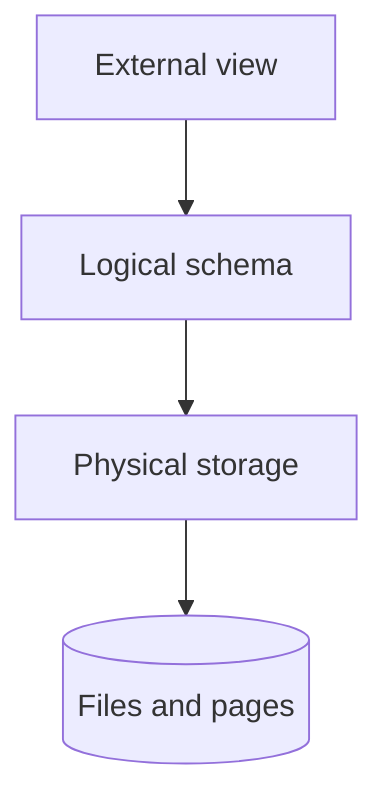

# Data Abstraction

Data abstraction হলো database system এর complexity hide করে user এবং application developer দের simplified view প্রদান করার mechanism।

## ৮. What is data abstraction?



**Data Abstraction** হলো database system এ data এর representation এবং access mechanism এর multiple layer তৈরি করা, যাতে user দের শুধুমাত্র প্রয়োজনীয় information access করতে হয় এবং underlying complexity hide থাকে।

#### Data Abstraction এর মূল উদ্দেশ্য:
- **Complexity Hiding**: Technical implementation detail user থেকে hide করা
- **Ease of Use**: User-friendly interface প্রদান করা
- **Data Security**: Sensitive information এর access control
- **Maintainability**: System modification সহজ করা
- **Modularity**: Independent layer যা separately maintain করা যায়

#### উদাহরণ:
```sql
-- Physical level: How data is actually stored
-- Files, indexes, storage structures

-- Logical level: What data is stored and relationships
CREATE TABLE customers (
    customer_id INT PRIMARY KEY,
    name VARCHAR(100),
    email VARCHAR(100),
    phone VARCHAR(15)
);

-- View level: User-specific data presentation
CREATE VIEW customer_contact AS
SELECT name, email, phone 
FROM customers 
WHERE status = 'active';

-- User interacts only with the view, not aware of:
-- - Physical storage details
-- - Full table structure  
-- - Implementation complexity
```

#### Benefits of Data Abstraction:
- **Simplified Development**: Developer দের data structure এর detail জানতে হয় না
- **Data Independence**: Physical changes যা logical structure affect করে না
- **Security**: Layer-wise access control implement করা যায়
- **Reusability**: Abstract interface multiple application এ use করা যায়

### What are the three levels of abstraction (physical, logical, view)?

Database system এ তিনটি distinct abstraction level আছে যা hierarchical structure follow করে:

#### ১. **Physical Level (Internal Level)**:

Physical level হলো সবচেয়ে lowest level যেখানে data actually storage device এ কিভাবে stored হয় তা define করা হয়।

```sql
-- Physical level concerns (typically handled by DBMS internally):

-- Storage structures
-- Data blocks, pages, extents
-- File organization (heap, sorted, hash, clustered)
-- Index structures (B-tree, hash index, bitmap index)
-- Compression algorithms
-- Buffer management
-- Disk layout optimization

-- Example: MySQL InnoDB storage engine details
-- Primary key clustering
-- Page size: 16KB
-- B+ tree indexes
-- Row format: COMPACT, DYNAMIC, COMPRESSED

-- Physical storage optimization example
CREATE TABLE large_table (
    id INT PRIMARY KEY,
    data TEXT,
    created_at TIMESTAMP
) ENGINE=InnoDB 
ROW_FORMAT=COMPRESSED 
KEY_BLOCK_SIZE=8;

-- Index creation with physical hints
CREATE INDEX idx_created_at ON large_table(created_at) 
USING BTREE;
```

#### ২. **Logical Level (Conceptual Level)**:

Logical level describe করে database এ কি data stored হয়, data এর structure এবং relationship।

```sql
-- Logical level: Database schema design
-- Tables, relationships, constraints, data types

-- Entity definition
CREATE TABLE customers (
    customer_id INT PRIMARY KEY AUTO_INCREMENT,
    first_name VARCHAR(50) NOT NULL,
    last_name VARCHAR(50) NOT NULL,
    email VARCHAR(100) UNIQUE NOT NULL,
    phone VARCHAR(15),
    address TEXT,
    registration_date TIMESTAMP DEFAULT CURRENT_TIMESTAMP,
    status ENUM('active', 'inactive', 'suspended') DEFAULT 'active'
);

CREATE TABLE orders (
    order_id INT PRIMARY KEY AUTO_INCREMENT,
    customer_id INT NOT NULL,
    order_date DATE NOT NULL,
    total_amount DECIMAL(10,2) NOT NULL,
    status ENUM('pending', 'confirmed', 'shipped', 'delivered') DEFAULT 'pending',
    FOREIGN KEY (customer_id) REFERENCES customers(customer_id)
);

CREATE TABLE products (
    product_id INT PRIMARY KEY AUTO_INCREMENT,
    name VARCHAR(200) NOT NULL,
    description TEXT,
    price DECIMAL(10,2) NOT NULL,
    category_id INT,
    stock_quantity INT DEFAULT 0,
    is_active BOOLEAN DEFAULT TRUE
);

-- Relationship definition
CREATE TABLE order_items (
    order_item_id INT PRIMARY KEY AUTO_INCREMENT,
    order_id INT NOT NULL,
    product_id INT NOT NULL,
    quantity INT NOT NULL,
    unit_price DECIMAL(10,2) NOT NULL,
    FOREIGN KEY (order_id) REFERENCES orders(order_id),
    FOREIGN KEY (product_id) REFERENCES products(product_id)
);
```

#### ৩. **View Level (External Level)**:

View level হলো highest level যেখানে different user group এর জন্য customized data presentation তৈরি করা হয়।

```sql
-- Different views for different user types

-- 1. Customer Service Representative View
CREATE VIEW customer_service_view AS
SELECT 
    c.customer_id,
    CONCAT(c.first_name, ' ', c.last_name) AS full_name,
    c.email,
    c.phone,
    c.status,
    COUNT(o.order_id) AS total_orders,
    COALESCE(SUM(o.total_amount), 0) AS lifetime_value
FROM customers c
LEFT JOIN orders o ON c.customer_id = o.customer_id
WHERE c.status = 'active'
GROUP BY c.customer_id;

-- 2. Sales Manager View  
CREATE VIEW sales_summary_view AS
SELECT 
    DATE(o.order_date) AS sale_date,
    COUNT(o.order_id) AS total_orders,
    SUM(o.total_amount) AS daily_revenue,
    AVG(o.total_amount) AS average_order_value
FROM orders o
WHERE o.status IN ('confirmed', 'shipped', 'delivered')
GROUP BY DATE(o.order_date)
ORDER BY sale_date DESC;

-- 3. Inventory Manager View
CREATE VIEW inventory_status_view AS
SELECT 
    p.product_id,
    p.name,
    p.stock_quantity,
    CASE 
        WHEN p.stock_quantity = 0 THEN 'Out of Stock'
        WHEN p.stock_quantity < 10 THEN 'Low Stock'
        ELSE 'In Stock'
    END AS stock_status,
    COALESCE(SUM(oi.quantity), 0) AS total_sold
FROM products p
LEFT JOIN order_items oi ON p.product_id = oi.product_id
WHERE p.is_active = TRUE
GROUP BY p.product_id;

-- 4. Financial Analyst View
CREATE VIEW financial_analysis_view AS
SELECT 
    YEAR(o.order_date) AS year,
    MONTH(o.order_date) AS month,
    SUM(o.total_amount) AS monthly_revenue,
    COUNT(DISTINCT o.customer_id) AS unique_customers,
    COUNT(o.order_id) AS total_orders,
    AVG(o.total_amount) AS avg_order_value
FROM orders o
WHERE o.status = 'delivered'
GROUP BY YEAR(o.order_date), MONTH(o.order_date);
```

#### **Three-Level Architecture Benefits**:

| Level | Purpose | Audience | Example |
|-------|---------|----------|---------|
| **Physical** | Storage optimization | Database Administrator | Index structures, file organization |
| **Logical** | Data structure | Database Designer, Developer | Table schema, relationships |
| **View** | User interface | End Users, Application | Custom reports, filtered data |

#### **Level Interaction Example**:

```sql
-- How levels work together:

-- LOGICAL LEVEL: Full employee table
CREATE TABLE employees (
    emp_id INT PRIMARY KEY,
    first_name VARCHAR(50),
    last_name VARCHAR(50),
    email VARCHAR(100),
    salary DECIMAL(10,2),
    department_id INT,
    hire_date DATE,
    performance_rating DECIMAL(3,2),
    social_security_number VARCHAR(11)
);

-- VIEW LEVEL 1: HR Manager View (access to salary, SSN)
CREATE VIEW hr_employee_view AS
SELECT emp_id, first_name, last_name, email, salary, 
       department_id, hire_date, social_security_number
FROM employees;

-- VIEW LEVEL 2: Department Manager View (no salary, no SSN)
CREATE VIEW manager_employee_view AS
SELECT emp_id, first_name, last_name, email, 
       department_id, hire_date, performance_rating
FROM employees
WHERE department_id = @current_user_department;

-- VIEW LEVEL 3: Employee Self-Service View
CREATE VIEW employee_self_view AS
SELECT emp_id, first_name, last_name, email, 
       department_id, hire_date
FROM employees  
WHERE emp_id = @current_user_id;

-- PHYSICAL LEVEL: Database automatically handles
-- - Index on emp_id for fast lookup
-- - Partitioning by department_id
-- - Compression of text fields
-- - Buffer management for frequent queries
```

### How does abstraction help in database design?

Data abstraction database design এ multiple significant benefit প্রদান করে:

#### ১. **Modularity এবং Separation of Concerns**:

```sql
-- Each layer has specific responsibility

-- LOGICAL LAYER: Business logic
CREATE TABLE users (
    user_id INT PRIMARY KEY,
    username VARCHAR(50) UNIQUE,
    email VARCHAR(100) UNIQUE,
    password_hash VARCHAR(255),
    profile_data JSON,
    created_at TIMESTAMP DEFAULT CURRENT_TIMESTAMP
);

-- VIEW LAYER: Security and presentation
CREATE VIEW public_user_profile AS
SELECT 
    user_id,
    username,
    JSON_EXTRACT(profile_data, '$.display_name') AS display_name,
    JSON_EXTRACT(profile_data, '$.bio') AS bio,
    DATE(created_at) AS member_since
FROM users
WHERE JSON_EXTRACT(profile_data, '$.is_public') = TRUE;

-- Application can use view without knowing internal structure
```

#### ২. **Data Security এবং Access Control**:

```sql
-- Role-based views for security
-- Database Admin View (full access)
CREATE VIEW admin_user_management AS
SELECT * FROM users;

-- Customer Service View (limited sensitive data)
CREATE VIEW cs_user_support AS
SELECT 
    user_id,
    username,
    email,
    created_at,
    JSON_EXTRACT(profile_data, '$.support_tier') AS support_tier
FROM users;

-- Public API View (minimal data)
CREATE VIEW api_user_basic AS
SELECT 
    user_id,
    username,
    JSON_EXTRACT(profile_data, '$.display_name') AS display_name
FROM users
WHERE JSON_EXTRACT(profile_data, '$.is_public') = TRUE;

-- Grant specific permissions
GRANT SELECT ON api_user_basic TO 'api_user'@'%';
GRANT SELECT ON cs_user_support TO 'support_team'@'%';
```

#### ৩. **Simplified Application Development**:

```sql
-- Complex business logic abstracted into views

-- Raw tables (logical level)
CREATE TABLE orders (order_id INT, customer_id INT, order_date DATE, status VARCHAR(20));
CREATE TABLE order_items (order_id INT, product_id INT, quantity INT, price DECIMAL(10,2));
CREATE TABLE products (product_id INT, name VARCHAR(200), category VARCHAR(50));
CREATE TABLE customers (customer_id INT, name VARCHAR(100), email VARCHAR(100));

-- Abstracted view for application use
CREATE VIEW order_summary AS
SELECT 
    o.order_id,
    c.name AS customer_name,
    c.email AS customer_email,
    o.order_date,
    o.status,
    COUNT(oi.product_id) AS item_count,
    SUM(oi.quantity * oi.price) AS total_amount,
    GROUP_CONCAT(p.name SEPARATOR ', ') AS product_names
FROM orders o
JOIN customers c ON o.customer_id = c.customer_id
JOIN order_items oi ON o.order_id = oi.order_id
JOIN products p ON oi.product_id = p.product_id
GROUP BY o.order_id;

-- Application code becomes simpler
-- SELECT * FROM order_summary WHERE order_id = ?
-- Instead of complex join queries
```

#### ৪. **Schema Evolution এবং Backward Compatibility**:

```sql
-- Original table structure
CREATE TABLE employees_v1 (
    id INT PRIMARY KEY,
    name VARCHAR(100),
    department VARCHAR(50),
    salary DECIMAL(10,2)
);

-- Create view for backward compatibility
CREATE VIEW employees AS
SELECT id, name, department, salary
FROM employees_v1;

-- Later: Schema evolution
-- Split name into first_name and last_name
ALTER TABLE employees_v1 
ADD COLUMN first_name VARCHAR(50),
ADD COLUMN last_name VARCHAR(50);

-- Update view to maintain compatibility
CREATE OR REPLACE VIEW employees AS
SELECT 
    id,
    CONCAT(first_name, ' ', last_name) AS name,
    department,
    salary
FROM employees_v1;

-- Existing applications continue to work without modification
```

#### ৫. **Performance Optimization through Abstraction**:

```sql
-- Materialized views for performance
CREATE TABLE sales_data (
    sale_id INT,
    product_id INT,
    customer_id INT,
    sale_date DATE,
    amount DECIMAL(10,2)
);

-- Abstract complex aggregation into materialized view
CREATE MATERIALIZED VIEW monthly_sales_summary AS
SELECT 
    YEAR(sale_date) AS year,
    MONTH(sale_date) AS month,
    product_id,
    COUNT(*) AS sale_count,
    SUM(amount) AS total_sales,
    AVG(amount) AS average_sale
FROM sales_data
GROUP BY YEAR(sale_date), MONTH(sale_date), product_id;

-- Applications get fast access to pre-computed aggregations
-- SELECT * FROM monthly_sales_summary WHERE year = 2024;
```

#### ৬. **Data Transformation এবং Presentation**:

```sql
-- Raw data in different formats
CREATE TABLE user_preferences (
    user_id INT,
    preference_key VARCHAR(50),
    preference_value TEXT
);

-- Abstract into user-friendly view
CREATE VIEW user_settings AS
SELECT 
    user_id,
    MAX(CASE WHEN preference_key = 'theme' THEN preference_value END) AS theme,
    MAX(CASE WHEN preference_key = 'language' THEN preference_value END) AS language,
    MAX(CASE WHEN preference_key = 'notifications' THEN preference_value END) AS notifications,
    MAX(CASE WHEN preference_key = 'timezone' THEN preference_value END) AS timezone
FROM user_preferences
GROUP BY user_id;

-- Application works with structured data instead of key-value pairs
```

#### ৭. **Multi-Application Support**:

```sql
-- Same data, different abstractions for different applications

-- E-commerce application view
CREATE VIEW ecommerce_products AS
SELECT 
    product_id,
    name,
    price,
    stock_quantity,
    category,
    description,
    is_active
FROM products
WHERE is_active = TRUE AND stock_quantity > 0;

-- Analytics application view
CREATE VIEW analytics_products AS
SELECT 
    product_id,
    name,
    category,
    price,
    stock_quantity,
    created_date,
    last_updated,
    total_sales_count,
    average_rating
FROM products p
LEFT JOIN product_statistics ps ON p.product_id = ps.product_id;

-- Inventory management view
CREATE VIEW inventory_products AS
SELECT 
    product_id,
    name,
    current_stock: stock_quantity,
    reorder_level,
    supplier_id,
    last_restocked,
    cost_price,
    selling_price
FROM products p
JOIN inventory_details i ON p.product_id = i.product_id;
```

#### **Best Practices for Database Abstraction**:

1. **Layer Responsibility**: প্রতিটি layer এর clear responsibility define করা
2. **Minimal Interface**: View এ শুধুমাত্র প্রয়োজনীয় data expose করা
3. **Security First**: Sensitive data view level এ filter করা
4. **Performance Consideration**: Complex view গুলো materialized করা
5. **Documentation**: প্রতিটি abstraction layer এর purpose document করা
6. **Version Control**: Schema change এর জন্য backward compatibility maintain করা
7. **Testing**: Different abstraction level আলাদা আলাদা test করা

#### **Summary**:
Data abstraction database design কে করে তোলে:
- **More Secure** - Role-based data access
- **More Maintainable** - Layer-wise modification
- **More Scalable** - Independent layer optimization  
- **More User-Friendly** - Simplified interface
- **More Flexible** - Multiple application support
