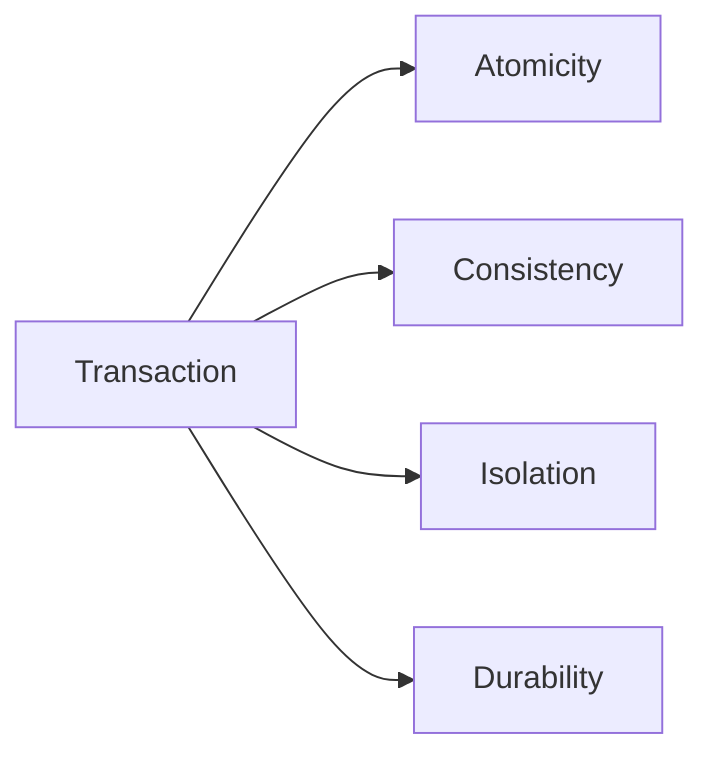

## ৩. What are ACID properties?


ACID properties হলো database transaction এর চারটি fundamental characteristic যা data integrity এবং reliability ensure করে।

Transaction হলো ডাটাবেসের এক বা একাধিক অপারেশনের একটি সিঙ্গেল লজিক্যাল ইউনিট। উদাহরণস্বরূপ, ব্যাংক থেকে টাকা ট্রান্সফার করার প্রক্রিয়ায় দুটি অপারেশন থাকে: একাউন্ট এ থেকে টাকা কাটা এবং একাউন্ট বি-তে টাকা যোগ করা। এই পুরো প্রক্রিয়াটি মিলে একটি Transaction তৈরি হয়।

**ACID** হলো database transaction এর চারটি essential property এর acronym:
- **A**tomicity (পরমাণুতা)
- **C**onsistency (সামঞ্জস্য)
- **I**solation (বিচ্ছিন্নতা)  
- **D**urability (স্থায়িত্ব)

এই properties ensure করে যে database transaction গুলো reliable, consistent এবং error-resistant হয়।

#### ১. **Atomicity (পরমাণুতা)**:

Atomicity নিশ্চিত করে যে একটি transaction-এর ভেতরের সবগুলো অপারেশন (SQL statements) সফলভাবে execute হবে, অথবা কোনোটিই হবে না। ডাটাবেস আংশিক (partial) আপডেট অ্যালাউ করে না।

ডাটাবেস সাধারণত **Undo Logs** বা **Rollback Segments** ব্যবহার করে। যদি transaction-এর মাঝপথে কোনো এরর বা সিস্টেম ক্র্যাশ হয়, তবে ডাটাবেস Undo log ব্যবহার করে আগের অবস্থায় (previous valid state) ফিরে যায়।

```sql
BEGIN TRANSACTION;

-- Step 1: Sender-এর একাউন্ট থেকে ১০০০ টাকা কাটা
UPDATE accounts SET balance = balance - 1000 WHERE account_id = 'A001';

-- Step 2: Receiver-এর একাউন্টে ১০০০ টাকা যোগ করা 
UPDATE accounts SET balance = balance + 1000 WHERE account_id = 'A002';

-- যদি উপরের দুটি কাজই সফল হয়, তবেই ডেটা সেভ হবে
COMMIT; 
-- কোনো ধাপ ব্যর্থ হলে application/error handler থেকে ROLLBACK করতে হবে।
-- Crash recovery-তে DBMS অসম্পূর্ণ transaction-এর persisted change undo করে।

```

#### ২. **Consistency (সামঞ্জস্য)**:

Consistency নিশ্চিত করে যে transaction একটি valid state থেকে আরেকটি valid state-এ যাবে। DBMS ঘোষিত constraints (Primary Key, Foreign Key, CHECK constraints) enforce করে; database-এ encode না করা business rule application/transaction logic-কেই enforce করতে হয়।

ডাটাবেস Constraints, Cascades এবং Triggers-এর মাধ্যমে Consistency নিশ্চিত করে। কোনো transaction যদি রুল ব্রেক করে, সিস্টেম তাৎক্ষণিক তা Rollback করে দেয়।

```sql
-- টেবিল তৈরিতে রুল: ব্যালেন্স কখনো ০-এর নিচে নামতে পারবে না
CREATE TABLE accounts (
    account_id VARCHAR(10) PRIMARY KEY,
    balance DECIMAL(10,2) CHECK (balance >= 0) 
);

BEGIN TRANSACTION;
-- যদি A001 এর ব্যালেন্স ৫০০ হয়, তবে ১০০০ টাকা কাটার এই রিকোয়েস্টটি
-- 'CHECK constraint' violation এর কারণে বাতিল হয়ে যাবে।
UPDATE accounts SET balance = balance - 1000 WHERE account_id = 'A001';
COMMIT;

```

#### ৩. **Isolation (বিচ্ছিন্নতা)**:

যখন ডাটাবেসে একই সাথে (concurrently) একাধিক ইউজার কাজ করে, তখন Isolation নিশ্চিত করে যে একটি transaction-এর কাজ অন্য transaction-কে প্রভাবিত করবে না। প্রতিটি transaction এমনভাবে execute হবে যেন সিস্টেমে ওই মুহূর্তে অন্য কোনো কাজ চলছে না।

ডাটাবেস **Locks** (Row-level, Table-level) এবং **MVCC** (Multi-Version Concurrency Control) ব্যবহার করে Isolation মেইনটেইন করে।

Isolation-এর অভাবে কিছু Read Phenomena (যেমন: Dirty Read, Phantom Read) তৈরি হতে পারে। এগুলো হ্যান্ডেল করতে SQL স্ট্যান্ডার্ডে ৪টি Isolation Level আছে:

| Isolation Level | বর্ণনা | Performance |
| --- | --- | --- |
| **Read Uncommitted** | DBMS support করলে অন্য transaction-এর uncommitted ডেটা পড়তে পারে। | কম isolation; fastest হবে এমন guarantee নেই। |
| **Read Committed** | শুধুমাত্র committed ডেটা পড়তে পারে। (PostgreSQL/Oracle এর ডিফল্ট)। | ব্যালেন্সড (ভালো পারফরম্যান্স ও একুরেসি)। |
| **Repeatable Read** | একই row পুনরায় পড়লে পরিবর্তিত committed value দেখা ঠেকায়; phantom handling DBMS-ভেদে ভিন্ন। | Lock বা MVCC implementation অনুযায়ী খরচ ভিন্ন। |
| **Serializable** | Concurrent ফলকে কোনো serial order-এর সমতুল্য রাখে; transaction বাস্তবে একটির পর একটি চলতেই হবে এমন নয়। | সবচেয়ে কঠোর; conflict হলে wait/retry/serialization failure হতে পারে। |


```sql
-- PostgreSQL-style example
BEGIN;
SET TRANSACTION ISOLATION LEVEL SERIALIZABLE;
SELECT balance FROM accounts WHERE account_id = 'A001' FOR UPDATE;
-- FOR UPDATE selected row-এ conflicting writer-কে wait করায়।
UPDATE accounts SET balance = balance - 500 WHERE account_id = 'A001';
COMMIT;

```

#### ৪. **Durability (স্থায়িত্ব)**:

Durability গ্যারান্টি দেয় যে সফল `COMMIT`-এর ফল configured durability contract অনুযায়ী crash recovery-র পরও থাকবে। এটি সাধারণত WAL/redo log ও durable flush দিয়ে করা হয়; asynchronous commit বা relaxed `fsync` setting ব্যবহার করলে guarantee দুর্বল হতে পারে।

ডাটাবেস **WAL (Write-Ahead Logging)** বা **Redo Logs** মেকানিজম ব্যবহার করে। মূল ডেটা ফাইলে পরিবর্তন লেখার আগেই ডাটাবেস একটি লগ ফাইলে পরিবর্তনের রেকর্ড লিখে রাখে (fsync)। সিস্টেম রিস্টার্ট হলে ডাটাবেস এই লগ ফাইল পড়ে ডেটা রিকভার করে।

```sql
BEGIN TRANSACTION;
INSERT INTO orders (order_id, amount) VALUES (999, 50.00);
COMMIT; 
-- Commit কমান্ড এক্সিকিউট হওয়ার মানে হলো ডেটা এখন ডিস্কে (Disk) সুরক্ষিত। 
-- সিস্টেম ক্র্যাশ করলেও রিস্টার্টের পর এই অর্ডারটি ডাটাবেসে পাওয়া যাবে।

```

### Why are they important?

ACID properties business-critical application এর জন্য absolutely essential:

#### ১. **Data Integrity Protection**:

ACID transaction failure ও concurrency-এর মধ্যেও declared invariant রক্ষা করতে সাহায্য করে; application/database-এ encode না করা rule নিজে থেকে সঠিক করে না।
* **কেন দরকার:** যদি **Atomicity** না থাকত, তবে বড় কোনো লেনদেনের অর্ধেক সম্পন্ন হতো আর অর্ধেক হারিয়ে যেত। যেমন: টাকা ট্রান্সফারের সময় আপনার একাউন্ট থেকে টাকা কেটে যেত কিন্তু প্রাপক পেত না।
* **প্রভাব:** এটি নিশ্চিত করে যে ডাটাবেসে কোনো "অর্ধ-সমাপ্ত" বা "ভুল" তথ্য থাকবে না।

#### ২. **Business Rule Enforcement**:

প্রতিটি ব্যবসার নিজস্ব কিছু নিয়ম থাকে যেমন: ইনভেন্টরি 0-এর নিচে নামবে না।
* **কেন দরকার:** **Consistency** নিশ্চিত করে যে ডাটাবেস প্রোগ্রামার বা ইউজারের কোনো ভুল ইনপুট গ্রহণ করবে না যা সিস্টেমের মূল নিয়ম ভঙ্গ করে।
* **প্রভাব:** এটি ডাটাবেসকে একটি "Valid State" থেকে আরেকটি "Valid State"-এ নিয়ে যায়।

#### ৩. Concurrent User Support
আজকের দিনে একটি অ্যাপ বা ওয়েবসাইট একই সময়ে হাজার হাজার মানুষ ব্যবহার করে।

* **কেন দরকার:** যদি **Isolation** না থাকত, তবে দুজন ইউজার একই সাথে কোনো ট্রেনের শেষ টিকিটটি বুক করার চেষ্টা করলে সিস্টেম দুজনেই টিকিট দিয়ে দিত (Double Booking)।
* **প্রভাব:** এটি কনকারেন্ট ইউজারদের লেনদেনকে এমনভাবে আলাদা রাখে যেন তারা একজন একজন করে কাজ করছে, ফলে ডেটা ওভারল্যাপ বা ভুল হওয়ার ঝুঁকি থাকে না।

#### ৪. System Reliability

software or hardware যেকোনো সময় ক্র্যাশ করতে পারে।

* **কেন দরকার:** **Durability** গ্যারান্টি দেয় যে, একবার ট্রানজেকশন সফল হলে সেটি চিরস্থায়ী। বিদ্যুৎ চলে গেলে বা সার্ভার পুড়ে গেলেও ডেটা হারানোর ভয় থাকে না।
* **প্রভাব:** এটি সিস্টেমকে "Error-Resistant" বা দুর্যোগ সহনীয় করে তোলে।


### Which ACID property is most critical in banking systems?
ব্যাংকিং সিস্টেমে ACID-এর প্রতিটি প্রপার্টি গুরুত্বপূর্ণ হলেও, বাস্তব প্রেক্ষাপটে **Atomicity** এবং **Consistency**-কে সবচেয়ে বেশি ক্রিটিক্যাল বা গুরুত্বপূর্ণ হিসেবে বিবেচনা করা হয়। নিচে বিস্তারিত কারণ দেওয়া হলো:

#### ১. Atomicity

ব্যাংকিং লেনদেনে একটি সাধারণ ফান্ড ট্রান্সফার (Fund Transfer) অন্তত দুটি ধাপের সমষ্টি:

* **ধাপ ১:** আপনার অ্যাকাউন্ট থেকে টাকা কাটা (Debit)।
* **ধাপ ২:** প্রাপকের অ্যাকাউন্টে টাকা জমা হওয়া (Credit)।

**কেন এটি সবচেয়ে ক্রিটিক্যাল:** যদি Atomicity না থাকত এবং ধাপ ১ সফল হওয়ার পর সিস্টেম ক্র্যাশ করত, তবে আপনার অ্যাকাউন্ট থেকে টাকা কেটে যেত কিন্তু প্রাপক তা পেত না। টাকাটি মাঝপথে "গায়েব" হয়ে যেত। Atomicity নিশ্চিত করে যে, দুটি ধাপই সফল হতে হবে; একটি ফেইল করলে পুরো ট্রানজেকশন বাতিল হয়ে যাবে এবং আপনার টাকা আপনার অ্যাকাউন্টে ফিরে আসবে।

**২.Consistency**

ব্যাংকিং সিস্টেম কঠোর কিছু বিজনেস রুলের ওপর চলে। যেমন:

* একাউন্ট ব্যালেন্স কখনোই নেগেটিভ হতে পারবে না (যদি না সেটি ক্রেডিট কার্ড হয়)।
* সিস্টেমের মোট টাকার পরিমাণ (Total Sum) লেনদেনের আগে ও পরে সমান থাকতে হবে।

**কেন এটি সবচেয়ে ক্রিটিক্যাল:** Consistency নিশ্চিত করে যে একটি ট্রানজেকশন শেষ হওয়ার পর ডাটাবেসের কোনো রুল ব্রেক হবে না। যদি আপনার ব্যালেন্স ৫০০ টাকা থাকে এবং আপনি ১০০০ টাকা তোলার চেষ্টা করেন, তবে ডাটাবেসের `CHECK` constraint সেই ট্রানজেকশনটি আটকে দেবে। এটি না থাকলে ব্যাংকের হিসাব মিলানো অসম্ভব হয়ে পড়ত।


#### ৩. কেন Isolation এবং Durability-ও কম নয়?

যদিও উপরে দুটি সবচেয়ে ক্রিটিক্যাল, বাকি দুটিও ব্যাংকিংয়ের জন্য অপরিহার্য:

* **Isolation:** এটি নিশ্চিত করে যে যখন আপনি এবং আপনার নমিনি একই সাথে দুটি আলাদা এটিএম থেকে একই একাউন্টের টাকা তোলার চেষ্টা করবেন, তখন সিস্টেম যেন ভুল করে দুবার টাকা না দিয়ে দেয় (Concurrency control)।
* **Durability:** এটি গ্যারান্টি দেয় যে, একবার আপনার স্ক্রিনে "Transaction Successful" মেসেজ আসার পর ব্যাংক সার্ভার পুড়ে গেলেও আপনার জমানো টাকার রেকর্ড হারাবে না।
### Can you give an example where each property is violated?

| Property |  Real-world Impact | Business Impact |
| --- | --- | --- |
| **Atomicity** | ব্যাংক থেকে টাকা কাটা গেল, কিন্তু অন্য একাউন্টে জমা হলো না। | গ্রাহকের টাকা গায়েব, লিগ্যাল ইস্যু। |
| **Consistency** | ইনভেন্টরিতে প্রোডাক্ট নেই, তারপরও কাস্টমার অর্ডার প্লেস করতে পারল। | কাস্টমার অসন্তুষ্টি, সাপ্লাই চেইন সমস্যা। |
| **Isolation** | ট্রেনের একটি সিট একই সময়ে দুজন ভিন্ন ইউজার বুক করে ফেলল। | অপারেশনাল কনফ্লিক্ট, ডাবল বুকিং। |
| **Durability** | কাস্টমার পেমেন্ট করার পর সিস্টেম রিস্টার্ট হলো এবং অর্ডারের ডেটা মুছে গেল। | ডেটা লস, কাস্টমার ট্রাস্ট নষ্ট হওয়া। |
