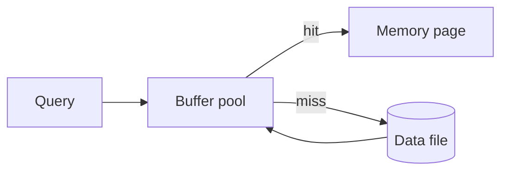

# Database Buffer Pool

Database buffer pool হলো main memory এর একটি allocated area যেখানে frequently accessed database page গুলো cache করা হয় disk I/O reduce করার জন্য।

## ১০. What is a database buffer pool?



**Database Buffer Pool** হলো database management system এর একটি core component যা main memory (RAM) এ database page গুলোর cache হিসেবে কাজ করে। এটি disk storage এবং application এর মধ্যে intermediate layer হিসেবে কাজ করে।

#### Buffer Pool এর মূল কাজ:
- **Page Caching**: Frequently accessed data page গুলো memory তে রাখা
- **I/O Optimization**: Disk read/write operation কমানো
- **Performance Enhancement**: Query response time significantly improve করা
- **Memory Management**: Available RAM efficiently utilize করা

#### Buffer Pool এর গঠন:
```sql
-- Buffer Pool Structure (Conceptual)
-- +------------------+
-- | Buffer Pool      |
-- +------------------+
-- | Page 1 (Data)    | <- Table data pages
-- | Page 2 (Index)   | <- Index pages  
-- | Page 3 (Data)    | <- Recently accessed data
-- | Page 4 (Log)     | <- Transaction log pages
-- | ...              |
-- | Page N           |
-- +------------------+

-- Example: MySQL InnoDB Buffer Pool configuration
-- my.cnf file
[mysqld]
innodb_buffer_pool_size = 1G          -- Total buffer pool size
innodb_buffer_pool_instances = 4       -- Number of buffer pool instances
innodb_page_size = 16K                 -- Size of each page
```

#### Key Components:
- **Data Pages**: Table row data stored in pages
- **Index Pages**: B-tree index structure pages  
- **Log Pages**: Transaction log এবং undo log pages
- **Metadata Pages**: System catalog এবং metadata information

#### উদাহরণ:
```sql
-- When you run this query:
SELECT * FROM customers WHERE customer_id = 12345;

-- Buffer Pool Process:
-- 1. Check if page containing customer_id 12345 is in buffer pool
-- 2. If found (cache hit): Return data immediately from memory
-- 3. If not found (cache miss): 
--    a. Read page from disk into buffer pool
--    b. Return data to application
--    c. Keep page in buffer pool for future access
```

### How does it improve performance?

Buffer pool dramatically improves database performance through multiple mechanisms:

#### ১. **Reduced Disk I/O**:

```sql
-- Performance comparison example

-- WITHOUT Buffer Pool (Direct disk access):
-- Query: SELECT * FROM products WHERE category = 'Electronics';
-- Process:
-- 1. Read index page from disk (10ms)
-- 2. Read data pages from disk (50ms per page)
-- 3. Total for 10 pages: 10ms + (50ms × 10) = 510ms

-- WITH Buffer Pool (Memory access):
-- First time (cold cache):
-- 1. Read index page from disk to buffer pool (10ms)
-- 2. Read data pages from disk to buffer pool (50ms × 10 = 500ms)
-- 3. Return result: 510ms
-- 
-- Subsequent times (warm cache):
-- 1. Find index page in buffer pool (0.1ms)
-- 2. Find data pages in buffer pool (0.1ms × 10 = 1ms)
-- 3. Return result: 1.1ms
-- 
-- Performance improvement: 500x faster!
```

#### ২. **Cache Hit Ratio Optimization**:

```sql
-- Monitor buffer pool performance
-- MySQL example:
SHOW STATUS LIKE 'Innodb_buffer_pool%';

-- Key metrics:
-- Innodb_buffer_pool_read_requests: Total logical reads
-- Innodb_buffer_pool_reads: Physical disk reads
-- 
-- Cache Hit Ratio = (read_requests - reads) / read_requests * 100
-- 
-- Example results:
-- Buffer_pool_read_requests: 1,000,000
-- Buffer_pool_reads: 50,000
-- Cache Hit Ratio = (1,000,000 - 50,000) / 1,000,000 * 100 = 95%
-- 
-- 95% cache hit means 95% queries served from memory!
```

#### ৩. **Write Optimization**:

```sql
-- Buffer pool also optimizes write operations

-- WITHOUT Buffer Pool:
UPDATE customers SET status = 'active' WHERE city = 'Dhaka';
-- Process:
-- 1. Read each affected page from disk
-- 2. Modify in memory
-- 3. Write each page back to disk immediately
-- 4. Multiple disk I/O for each page

-- WITH Buffer Pool:
UPDATE customers SET status = 'active' WHERE city = 'Dhaka';
-- Process:
-- 1. Read pages into buffer pool (if not already there)
-- 2. Modify pages in buffer pool (memory operation)
-- 3. Mark pages as "dirty"
-- 4. Background process writes dirty pages to disk in batches
-- 5. Much more efficient I/O pattern
```

#### ৪. **Query Processing Optimization**:

```sql
-- Complex query example
SELECT c.name, COUNT(o.order_id) as order_count, SUM(o.total) as total_spent
FROM customers c
LEFT JOIN orders o ON c.customer_id = o.customer_id
WHERE c.registration_date >= '2024-01-01'
GROUP BY c.customer_id, c.name
ORDER BY total_spent DESC
LIMIT 10;

-- Buffer pool helps by:
-- 1. Caching customer table pages
-- 2. Caching order table pages  
-- 3. Caching index pages for joins
-- 4. Keeping intermediate result pages
-- 5. Subsequent similar queries run much faster
```

#### ৫. **Real-world Performance Example**:

```sql
-- E-commerce product catalog scenario

-- Table structure:
CREATE TABLE products (
    product_id INT PRIMARY KEY,
    name VARCHAR(200),
    category VARCHAR(50),
    price DECIMAL(10,2),
    description TEXT,
    stock_quantity INT,
    rating DECIMAL(3,2),
    INDEX idx_category (category),
    INDEX idx_price (price),
    INDEX idx_rating (rating)
);

-- Common queries:
-- 1. Category browsing
SELECT * FROM products WHERE category = 'Electronics' ORDER BY rating DESC LIMIT 20;

-- 2. Price filtering  
SELECT * FROM products WHERE price BETWEEN 100 AND 500 ORDER BY name;

-- 3. Search functionality
SELECT * FROM products WHERE name LIKE '%laptop%' OR description LIKE '%laptop%';

-- Performance with buffer pool:
-- First query execution: Loads relevant pages into buffer pool
-- Subsequent executions: Served from memory
-- 
-- Results:
-- - Category browsing: 500ms → 5ms (100x improvement)
-- - Price filtering: 300ms → 3ms (100x improvement)  
-- - Search queries: 800ms → 8ms (100x improvement)
```

### What happens when buffer pool is full?

Buffer pool এর memory শেষ হয়ে গেলে DBMS various strategy ব্যবহার করে space management করে:

#### ১. **Page Replacement Algorithms**:

```sql
-- Most common algorithm: LRU (Least Recently Used)

-- Buffer Pool Status:
-- [Page A][Page B][Page C][Page D][Page E] <- All slots full
--   ↑        ↑        ↑        ↑        ↑
-- Recent   Recent   Old     Older   Oldest

-- New page F needs to be loaded:
-- 1. Identify least recently used page (Page E)
-- 2. If Page E is "dirty" (modified), write it to disk first
-- 3. Replace Page E with Page F
-- 4. Result: [Page A][Page B][Page C][Page D][Page F]
```

#### ২. **Dirty Page Handling**:

```sql
-- When a page needs to be evicted:

-- Case 1: Clean page (not modified)
-- - Simply replace with new page
-- - No disk write needed
-- - Fast operation

-- Case 2: Dirty page (modified but not yet written to disk)
-- - Must write dirty page to disk first
-- - Then replace with new page  
-- - Slower operation

-- Example dirty page scenario:
UPDATE products SET price = price * 1.1 WHERE category = 'Electronics';
-- This modifies pages in buffer pool, marking them as "dirty"
-- Pages stay in memory until:
-- 1. Checkpoint process writes them to disk, OR
-- 2. They need to be evicted for new pages
```

#### ৩. **Buffer Pool Management Strategies**:

```sql
-- Strategy 1: Background Flushing
-- MySQL InnoDB example configuration:
[mysqld]
innodb_max_dirty_pages_pct = 75        -- Trigger flush when 75% pages are dirty
innodb_io_capacity = 200               -- Background I/O rate
innodb_flush_neighbors = 1             -- Flush adjacent pages together

-- Strategy 2: Adaptive Replacement
-- PostgreSQL uses "Clock Sweep" algorithm
-- - Each page has a "usage bit"
-- - When full, scan pages and clear usage bits
-- - Evict first page with usage bit = 0

-- Strategy 3: Multiple Buffer Pools
-- MySQL InnoDB multiple buffer pool instances:
innodb_buffer_pool_instances = 8       -- 8 separate buffer pools
-- Reduces contention and improves parallel access
```

#### ৪. **Buffer Pool Full Scenarios**:

#### **Scenario 1: Large Table Scan**:
```sql
-- Query that reads entire large table:
SELECT COUNT(*) FROM large_orders_table; -- 10GB table, 2GB buffer pool

-- What happens:
-- 1. Query starts loading pages into buffer pool
-- 2. Buffer pool fills up quickly
-- 3. Older pages get evicted using LRU
-- 4. If table > buffer pool, some pages loaded multiple times
-- 5. Performance degrades for other queries during scan

-- Mitigation:
-- Use LIMIT or WHERE clause to reduce data access:
SELECT COUNT(*) FROM large_orders_table WHERE order_date >= '2024-01-01';
```

#### **Scenario 2: Concurrent High Load**:
```sql
-- Multiple applications accessing different data sets:

-- Application 1: Customer management
SELECT * FROM customers WHERE region = 'Asia';

-- Application 2: Order processing  
SELECT * FROM orders WHERE status = 'pending';

-- Application 3: Analytics
SELECT product_id, SUM(quantity) FROM order_items GROUP BY product_id;

-- Buffer pool contention:
-- 1. Each application loads different pages
-- 2. Pages compete for buffer pool space
-- 3. Frequently eviction and reloading
-- 4. Cache hit ratio decreases

-- Solutions:
-- 1. Increase buffer pool size
-- 2. Use multiple buffer pool instances
-- 3. Query optimization to reduce data access
-- 4. Application-level caching
```

#### ৫. **Monitoring Buffer Pool Efficiency**:

```sql
-- MySQL monitoring queries:
-- Check buffer pool utilization
SELECT 
    @@innodb_buffer_pool_size / 1024 / 1024 / 1024 AS buffer_pool_size_gb,
    pages_data * @@innodb_page_size / 1024 / 1024 / 1024 AS data_size_gb,
    pages_free * @@innodb_page_size / 1024 / 1024 / 1024 AS free_size_gb,
    (pages_data * @@innodb_page_size / @@innodb_buffer_pool_size) * 100 AS utilization_pct
FROM information_schema.innodb_buffer_pool_stats;

-- Check cache hit ratio
SELECT 
    ROUND((1 - (Innodb_buffer_pool_reads / Innodb_buffer_pool_read_requests)) * 100, 2) AS cache_hit_ratio
FROM 
    (SELECT variable_value AS Innodb_buffer_pool_reads 
     FROM information_schema.global_status 
     WHERE variable_name = 'Innodb_buffer_pool_reads') r,
    (SELECT variable_value AS Innodb_buffer_pool_read_requests 
     FROM information_schema.global_status 
     WHERE variable_name = 'Innodb_buffer_pool_read_requests') rr;

-- PostgreSQL monitoring:
SELECT 
    buffers_hit,
    buffers_read,
    round(buffers_hit * 100.0 / (buffers_hit + buffers_read), 2) AS cache_hit_ratio
FROM pg_stat_database 
WHERE datname = current_database();
```

#### ৬. **Buffer Pool Optimization Strategies**:

#### **Strategy 1: Right-sizing Buffer Pool**:
```sql
-- Calculate optimal buffer pool size
-- Rule of thumb: 70-80% of available RAM for dedicated database server

-- Example calculation:
-- Server RAM: 16GB
-- OS and other processes: 2GB  
-- Available for database: 14GB
-- Optimal buffer pool: 10-12GB

-- MySQL configuration:
[mysqld]
innodb_buffer_pool_size = 12G
```

#### **Strategy 2: Query Optimization**:
```sql
-- Optimize queries to be buffer pool friendly

-- ❌ Bad: Unnecessary large result set
SELECT * FROM orders; -- Loads entire table

-- ✅ Good: Filtered query
SELECT * FROM orders WHERE order_date >= CURDATE() - INTERVAL 7 DAY;

-- ❌ Bad: No index usage
SELECT * FROM products WHERE UPPER(name) LIKE '%LAPTOP%';

-- ✅ Good: Index-friendly query
SELECT * FROM products WHERE name LIKE 'laptop%';
CREATE INDEX idx_product_name ON products(name);
```

#### **Strategy 3: Application-level Caching**:
```sql
-- Reduce database load with application cache

-- Example: Redis cache for frequently accessed data
-- Application logic:
-- 1. Check Redis cache first
-- 2. If cache miss, query database
-- 3. Store result in Redis for future use
-- 4. Reduces buffer pool pressure

-- Popular product cache example:
-- Cache key: "popular_products_electronics"
-- Cache value: JSON array of products
-- TTL: 1 hour
```

#### **Best Practices for Buffer Pool Management**:

1. **Monitor regularly** - Track cache hit ratio and buffer pool utilization
2. **Size appropriately** - Usually 70-80% of available RAM  
3. **Optimize queries** - Use indexes and LIMIT clauses
4. **Consider partitioning** - Large tables can be partitioned to improve locality
5. **Use multiple instances** - Reduce contention in high-concurrency scenarios
6. **Plan for growth** - Monitor trends and scale buffer pool size accordingly

#### **Summary**:
Buffer pool পরিচালনা করে:
- **Automatic page replacement** when full
- **LRU algorithm** for optimal page selection  
- **Dirty page handling** to ensure data consistency
- **Background processes** for efficient I/O
- **Performance monitoring** tools for optimization
