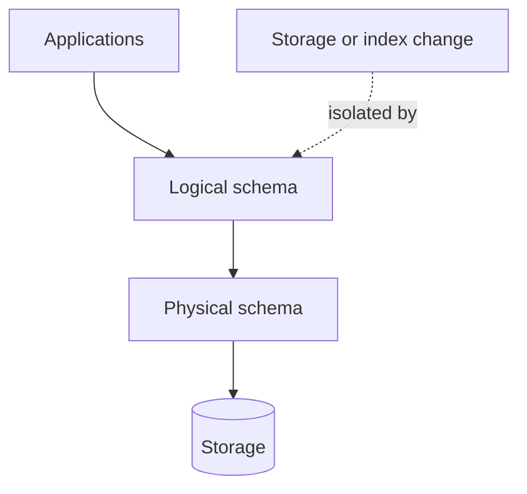

# Data Independence

Data independence হলো database এর ability যেখানে higher level এর structure বা application lower level এর change দ্বারা affected হয় না।

## ৯. What is data independence?

**Data Independence** হলো database system এর একটি fundamental property যা ensure করে যে database এর এক level এ change করা হলে অন্য level গুলো unaffected থাকে।

#### Data Independence এর মূল ধারণা:
- **Separation of Concerns**: বিভিন্ন level এর functionality আলাদা রাখা
- **Change Isolation**: একটি level এর modification অন্য level এ impact না করা
- **Backward Compatibility**: Existing application এবং interface preserve করা
- **Flexibility**: System evolution এবং optimization এর সুবিধা

#### উদাহরণ:
```sql
-- Physical level change (storage optimization)
-- Database admin decides to change index structure
DROP INDEX idx_customer_name;
CREATE INDEX idx_customer_name ON customers(name) USING HASH; -- Changed from B-tree to Hash

-- Logical level remains unchanged
SELECT * FROM customers WHERE name = 'John Doe'; -- Same query works

-- View level remains unchanged  
CREATE VIEW active_customers AS
SELECT customer_id, name, email 
FROM customers 
WHERE status = 'active'; -- Same view definition
```

#### Benefits:
- **Reduced Maintenance Cost**: Change এর impact limited থাকে
- **Improved Flexibility**: System easily adaptable
- **Better Performance**: Lower level optimization upper level affect করে না
- **Enhanced Security**: Layer-wise access control maintain করা যায়

### Difference between physical and logical data independence?

Database system এ দুই ধরনের data independence আছে:

#### ১. **Physical Data Independence**:

Physical data independence হলো logical level এবং application level কে physical storage change থেকে protect করা।

```sql
-- Example: Physical storage changes that don't affect logical level

-- BEFORE: Table stored as heap file
CREATE TABLE products (
    product_id INT PRIMARY KEY,
    name VARCHAR(200),
    price DECIMAL(10,2),
    category VARCHAR(50)
);

-- Physical level changes (invisible to applications):
-- 1. Storage engine change
ALTER TABLE products ENGINE=InnoDB; -- From MyISAM to InnoDB

-- 2. Index optimization
CREATE INDEX idx_products_category ON products(category) USING BTREE;
CREATE INDEX idx_products_price ON products(price) USING HASH;

-- 3. Partitioning implementation
ALTER TABLE products PARTITION BY RANGE(product_id) (
    PARTITION p1 VALUES LESS THAN (1000),
    PARTITION p2 VALUES LESS THAN (2000),
    PARTITION p3 VALUES LESS THAN MAXVALUE
);

-- 4. Compression enabling
ALTER TABLE products ROW_FORMAT=COMPRESSED;

-- APPLICATION LEVEL: No change needed
SELECT * FROM products WHERE category = 'Electronics'; -- Same query
INSERT INTO products VALUES (1001, 'Laptop', 999.99, 'Electronics'); -- Same insert
```

#### ২. **Logical Data Independence**:

Logical data independence হলো view level এবং application কে logical schema change থেকে protect করা।

```sql
-- Example: Logical schema changes that don't affect view level

-- ORIGINAL LOGICAL SCHEMA
CREATE TABLE customers (
    customer_id INT PRIMARY KEY,
    name VARCHAR(100),
    email VARCHAR(100),
    phone VARCHAR(15),
    address TEXT
);

-- Application view
CREATE VIEW customer_contact AS
SELECT customer_id, name, email, phone
FROM customers;

-- LOGICAL LEVEL CHANGES:
-- 1. Adding new columns
ALTER TABLE customers 
ADD COLUMN date_of_birth DATE,
ADD COLUMN registration_source VARCHAR(50) DEFAULT 'website';

-- 2. Splitting columns
ALTER TABLE customers 
ADD COLUMN first_name VARCHAR(50),
ADD COLUMN last_name VARCHAR(50);

-- Update the view to maintain compatibility
CREATE OR REPLACE VIEW customer_contact AS
SELECT 
    customer_id, 
    COALESCE(CONCAT(first_name, ' ', last_name), name) AS name,
    email, 
    phone
FROM customers;

-- 3. Adding new tables
CREATE TABLE customer_preferences (
    customer_id INT,
    preference_key VARCHAR(50),
    preference_value TEXT,
    FOREIGN KEY (customer_id) REFERENCES customers(customer_id)
);

-- APPLICATION LEVEL: No change needed
SELECT * FROM customer_contact; -- Same query still works
```

#### **Comparison Table**:

| Aspect | Physical Data Independence | Logical Data Independence |
|--------|---------------------------|--------------------------|
| **Level** | Physical ↔ Logical | Logical ↔ View |
| **Changes** | Storage, indexing, partitioning | Schema, table structure, relationships |
| **Impact** | Database performance | Application interface |
| **Frequency** | More common | Less common but more complex |
| **Examples** | Index creation, compression | Adding columns, table splitting |

#### **Real-world Examples**:

#### Physical Data Independence Example:
```sql
-- E-commerce database performance optimization

-- Initial setup
CREATE TABLE orders (
    order_id INT PRIMARY KEY,
    customer_id INT,
    order_date DATE,
    total_amount DECIMAL(10,2),
    status VARCHAR(20)
);

-- Physical optimizations (no application change needed):

-- 1. Add indexes for common queries
CREATE INDEX idx_orders_customer ON orders(customer_id);
CREATE INDEX idx_orders_date ON orders(order_date);
CREATE INDEX idx_orders_status ON orders(status);

-- 2. Partition large table by date
ALTER TABLE orders PARTITION BY RANGE(YEAR(order_date)) (
    PARTITION p2022 VALUES LESS THAN (2023),
    PARTITION p2023 VALUES LESS THAN (2024),
    PARTITION p2024 VALUES LESS THAN (2025),
    PARTITION pmax VALUES LESS THAN MAXVALUE
);

-- 3. Move to faster storage
-- This is handled at storage/OS level, transparent to database

-- Applications continue to work unchanged:
SELECT * FROM orders WHERE customer_id = 12345; -- Same performance benefit
INSERT INTO orders VALUES (1001, 500, '2024-01-15', 99.99, 'pending'); -- Same operation
```

#### Logical Data Independence Example:
```sql
-- User management system evolution

-- PHASE 1: Simple user table
CREATE TABLE users (
    user_id INT PRIMARY KEY,
    username VARCHAR(50),
    email VARCHAR(100),
    full_name VARCHAR(100),
    password_hash VARCHAR(255)
);

-- Application view
CREATE VIEW user_profile AS
SELECT user_id, username, email, full_name
FROM users;

-- PHASE 2: Enhanced user structure (logical changes)
-- Split name into components
ALTER TABLE users 
ADD COLUMN first_name VARCHAR(50),
ADD COLUMN last_name VARCHAR(50),
ADD COLUMN middle_name VARCHAR(50);

-- Add user metadata table
CREATE TABLE user_metadata (
    user_id INT PRIMARY KEY,
    date_of_birth DATE,
    phone VARCHAR(15),
    address TEXT,
    registration_date TIMESTAMP DEFAULT CURRENT_TIMESTAMP,
    FOREIGN KEY (user_id) REFERENCES users(user_id)
);

-- Update view to maintain compatibility
CREATE OR REPLACE VIEW user_profile AS
SELECT 
    u.user_id,
    u.username,
    u.email,
    COALESCE(
        CONCAT(u.first_name, ' ', COALESCE(u.middle_name + ' ', ''), u.last_name),
        u.full_name
    ) AS full_name
FROM users u;

-- Enhanced view with new data (optional for new applications)
CREATE VIEW enhanced_user_profile AS
SELECT 
    u.user_id,
    u.username,
    u.email,
    u.first_name,
    u.middle_name,
    u.last_name,
    um.phone,
    um.date_of_birth,
    um.registration_date
FROM users u
LEFT JOIN user_metadata um ON u.user_id = um.user_id;

-- OLD APPLICATIONS: Continue to work unchanged
SELECT * FROM user_profile WHERE user_id = 123;

-- NEW APPLICATIONS: Can use enhanced features
SELECT * FROM enhanced_user_profile WHERE user_id = 123;
```

### Why is data independence important for applications?

Data independence application development এবং maintenance এ crucial role play করে:

#### ১. **Reduced Development Cost**:

```sql
-- Without data independence:
-- Every database change requires application modification

-- With data independence:
-- Database optimization doesn't affect application code

-- Example: Performance improvement without code change
-- Database team adds index
CREATE INDEX idx_product_search ON products(name, category, price);

-- Application code remains same but gets performance boost
-- SELECT * FROM products WHERE name LIKE '%laptop%' AND category = 'Electronics';
-- No application deployment needed
```

#### ২. **Easier System Evolution**:

```sql
-- System can evolve incrementally

-- PHASE 1: Basic e-commerce
CREATE TABLE products (product_id INT, name VARCHAR(200), price DECIMAL(10,2));
CREATE TABLE orders (order_id INT, customer_id INT, product_id INT, quantity INT);

-- View for applications
CREATE VIEW order_details AS
SELECT o.order_id, o.customer_id, p.name AS product_name, 
       o.quantity, p.price, (o.quantity * p.price) AS total
FROM orders o JOIN products p ON o.product_id = p.product_id;

-- PHASE 2: Advanced features (logical evolution)
-- Normalize order structure
CREATE TABLE order_headers (order_id INT, customer_id INT, order_date DATE);
CREATE TABLE order_items (order_id INT, product_id INT, quantity INT, unit_price DECIMAL(10,2));

-- Update view to maintain compatibility
CREATE OR REPLACE VIEW order_details AS
SELECT oh.order_id, oh.customer_id, p.name AS product_name,
       oi.quantity, oi.unit_price AS price, (oi.quantity * oi.unit_price) AS total
FROM order_headers oh
JOIN order_items oi ON oh.order_id = oi.order_id
JOIN products p ON oi.product_id = p.product_id;

-- Applications using order_details view continue to work unchanged
```

#### ৩. **Multiple Application Support**:

```sql
-- Same database supporting different applications

-- Core database structure
CREATE TABLE employees (
    emp_id INT PRIMARY KEY,
    name VARCHAR(100),
    department_id INT,
    salary DECIMAL(10,2),
    hire_date DATE,
    status VARCHAR(20)
);

-- HR Application View
CREATE VIEW hr_employee_view AS
SELECT emp_id, name, department_id, salary, hire_date, status
FROM employees;

-- Payroll Application View  
CREATE VIEW payroll_view AS
SELECT emp_id, name, salary, department_id
FROM employees
WHERE status = 'active';

-- Directory Application View
CREATE VIEW employee_directory AS
SELECT emp_id, name, department_id
FROM employees
WHERE status = 'active';

-- Each application can evolve independently
-- Database changes don't break multiple applications simultaneously
```

#### ৪. **Performance Optimization Freedom**:

```sql
-- Database team can optimize without affecting applications

-- Application uses logical interface
CREATE VIEW sales_report AS
SELECT 
    product_id,
    SUM(quantity) AS total_sold,
    SUM(quantity * unit_price) AS total_revenue,
    COUNT(*) AS transaction_count
FROM order_items
GROUP BY product_id;

-- Database team can optimize underlying structure:

-- Option 1: Create materialized view
CREATE MATERIALIZED VIEW sales_summary_cache AS
SELECT 
    product_id,
    SUM(quantity) AS total_sold,
    SUM(quantity * unit_price) AS total_revenue,
    COUNT(*) AS transaction_count
FROM order_items
GROUP BY product_id;

-- Update main view to use cache
CREATE OR REPLACE VIEW sales_report AS
SELECT * FROM sales_summary_cache;

-- Option 2: Partition large tables
ALTER TABLE order_items PARTITION BY RANGE(YEAR(order_date)) (...);

-- Option 3: Add summary tables
CREATE TABLE daily_sales_summary (
    date DATE,
    product_id INT,
    total_sold INT,
    total_revenue DECIMAL(12,2),
    PRIMARY KEY (date, product_id)
);

-- Applications get performance benefit without code changes
```

#### ৫. **Technology Migration Support**:

```sql
-- Database platform migration with minimal application impact

-- BEFORE: MySQL-specific features
CREATE TABLE user_sessions (
    session_id VARCHAR(64) PRIMARY KEY,
    user_id INT,
    session_data JSON,  -- MySQL JSON type
    created_at TIMESTAMP DEFAULT CURRENT_TIMESTAMP,
    expires_at TIMESTAMP
);

-- Application view (database-agnostic)
CREATE VIEW active_sessions AS
SELECT 
    session_id,
    user_id,
    created_at,
    expires_at,
    CASE WHEN expires_at > NOW() THEN 'active' ELSE 'expired' END AS status
FROM user_sessions;

-- AFTER: Migration to PostgreSQL
-- Table structure might change slightly
CREATE TABLE user_sessions (
    session_id VARCHAR(64) PRIMARY KEY,
    user_id INT,
    session_data JSONB,  -- PostgreSQL JSONB type
    created_at TIMESTAMP DEFAULT CURRENT_TIMESTAMP,
    expires_at TIMESTAMP
);

-- Update view to handle platform differences
CREATE OR REPLACE VIEW active_sessions AS
SELECT 
    session_id,
    user_id,
    created_at,
    expires_at,
    CASE WHEN expires_at > CURRENT_TIMESTAMP THEN 'active' ELSE 'expired' END AS status
FROM user_sessions;

-- Applications continue to work with minimal changes
```

#### ৬. **Security and Compliance Evolution**:

```sql
-- Compliance requirements change over time

-- INITIAL: Basic user data
CREATE TABLE customers (
    customer_id INT PRIMARY KEY,
    name VARCHAR(100),
    email VARCHAR(100),
    phone VARCHAR(15),
    address TEXT
);

-- Application view
CREATE VIEW customer_info AS
SELECT customer_id, name, email, phone, address
FROM customers;

-- COMPLIANCE UPDATE: GDPR requires data anonymization
-- Add anonymization support
ALTER TABLE customers 
ADD COLUMN is_anonymized BOOLEAN DEFAULT FALSE,
ADD COLUMN anonymized_date TIMESTAMP NULL;

-- Update view to handle anonymization
CREATE OR REPLACE VIEW customer_info AS
SELECT 
    customer_id,
    CASE WHEN is_anonymized THEN 'Anonymous User' ELSE name END AS name,
    CASE WHEN is_anonymized THEN 'anonymous@domain.com' ELSE email END AS email,
    CASE WHEN is_anonymized THEN NULL ELSE phone END AS phone,
    CASE WHEN is_anonymized THEN NULL ELSE address END AS address
FROM customers;

-- Applications automatically get GDPR-compliant behavior
```

#### **Data Independence Best Practices**:

| Practice | Description | Benefit |
|----------|-------------|---------|
| **Use Views** | Create logical interfaces for applications | Flexibility in schema changes |
| **Avoid Direct Table Access** | Applications should use views or procedures | Better change isolation |
| **Standard Interfaces** | Define consistent API across applications | Easier maintenance |
| **Version Control** | Track schema changes and view definitions | Better change management |
| **Testing Strategy** | Test applications against schema changes | Prevent breaking changes |
| **Documentation** | Document abstraction layers and dependencies | Better team coordination |

#### **Summary**:
Data independence এর জন্য applications পায়:
- **Lower Maintenance Cost** - কম code change প্রয়োজন
- **Better Performance** - Database optimization থেকে automatic benefit
- **Easier Evolution** - System gradually improve করা যায়
- **Technology Flexibility** - Database platform change সহজ
- **Multiple Application Support** - Same data, different interfaces
- **Compliance Adaptability** - Regulation change easily handle করা যায়
