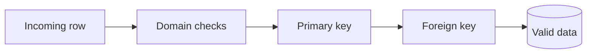

Data integrity হলো database এ stored data এর accuracy, consistency এবং reliability maintain করার process, যা business rule এবং constraint enforcement এর মাধ্যমে achieve করা হয়।

## ৭. What is data integrity?



**Data Integrity** হলো database এ data এর correctness, consistency এবং validity ensure করার mechanism যা data quality এবং reliability maintain করে।

#### Data Integrity এর মূল উপাদান:

- **Accuracy** → Data সঠিক এবং error-free
- **Consistency** → System জুড়ে একই তথ্য একইভাবে present থাকে
- **Validity** → Defined rules এবং constraints অনুসরণ করে
- **Completeness** → Required field missing নয়
- **Reliability** → Data trusted এবং dependable  

#### উদাহরণ (MySQL 8+):

```sql
-- Data integrity constraint example
CREATE TABLE departments (
    dept_id INT PRIMARY KEY,
    dept_name VARCHAR(100) NOT NULL UNIQUE
);

CREATE TABLE employees (
    emp_id INT PRIMARY KEY AUTO_INCREMENT,
    name VARCHAR(100) NOT NULL,                    -- Required attribute
    email VARCHAR(100) UNIQUE NOT NULL,            -- Key/domain rule
    age INT CHECK (age >= 18 AND age <= 65),       -- Domain integrity
    department_id INT,
    salary DECIMAL(10,2) CHECK (salary > 0),       -- Domain integrity
    hire_date DATE DEFAULT CURRENT_DATE,
    FOREIGN KEY (department_id) REFERENCES departments(dept_id) -- Referential integrity
);
```

#### Data Integrity এর গুরুত্ব:

- **Business Decision**: Reliable data দিয়ে সঠিক decision নেওয়া
- **Legal Compliance**: Regulatory requirement meet করা
- **Customer Trust**: Accurate information provide করা
- **System Reliability**: Consistent application behavior
- **Cost Reduction**: Data error correction এর cost কমানো

### Types of Integrity (Entity, Referential, Domain)

Database system এ তিন ধরনের integrity constraint আছে যা collectively data quality ensure করে:

#### ১. Entity Integrity

Entity integrity ensure করে যে প্রতিটি table এর প্রতিটি row uniquely identifiable।

```sql
-- Entity integrity rules:
-- 1. Primary key cannot be NULL
-- 2. Primary key must be unique
-- 3. Each row must be uniquely identifiable

CREATE TABLE customers (
    customer_id INT PRIMARY KEY AUTO_INCREMENT,    -- Cannot be NULL, must be unique
    name VARCHAR(100) NOT NULL,                    -- Required field
    email VARCHAR(100) UNIQUE NOT NULL,            -- Unique constraint
    phone VARCHAR(15) UNIQUE,                      -- Optional but if provided, must be unique
    created_at TIMESTAMP DEFAULT CURRENT_TIMESTAMP
);

-- These operations violate entity integrity:
-- INSERT INTO customers (customer_id, name) VALUES (NULL, 'John'); 
-- ERROR: Primary key cannot be NULL
-- INSERT INTO customers (customer_id, name) VALUES (1, 'John'); 
-- INSERT INTO customers (customer_id, name) VALUES (1, 'Jane'); 
-- ERROR: Duplicate primary key
```

#### ২. Referential Integrity

Referential integrity maintain করে table গুলোর মধ্যে relationship এর consistency।

```sql
-- Parent table
CREATE TABLE departments (
    dept_id INT PRIMARY KEY,
    dept_name VARCHAR(100) NOT NULL,
    manager_id INT
);

-- Child table
CREATE TABLE employees (
    emp_id INT PRIMARY KEY,
    name VARCHAR(100) NOT NULL,
    department_id INT,
    FOREIGN KEY (department_id) REFERENCES departments(dept_id)
        ON DELETE CASCADE         -- Child records delete হবে parent delete হলে
        ON UPDATE CASCADE         -- Child records update হবে parent update হলে
);

-- Referential integrity rules:
-- 1. Foreign key value must exist in referenced table
-- 2. Cannot delete parent record if child records exist (unless CASCADE)
-- 3. Cannot insert child record with non-existent parent reference

-- Valid operations:
INSERT INTO departments (dept_id, dept_name) VALUES (1, 'IT');
INSERT INTO employees (emp_id, name, department_id) VALUES (101, 'John', 1); -- OK

-- Invalid operations:
-- INSERT INTO employees (emp_id, name, department_id) VALUES (102, 'Jane', 999); 
-- ERROR: Department 999 doesn't exist
-- DELETE FROM departments WHERE dept_id = 1; 
-- OK if CASCADE, ERROR if RESTRICT
```

#### ৩. Domain Integrity

Domain integrity ensure করে যে column value গুলো defined range বা format এর মধ্যে আছে।

```sql
-- Domain integrity constraints
CREATE TABLE products (
    product_id INT PRIMARY KEY,
    name VARCHAR(200) NOT NULL,
    price DECIMAL(10,2) CHECK (price > 0),                    -- Price must be positive
    category ENUM('electronics', 'clothing', 'books'),         -- Limited valid values
    rating DECIMAL(2,1) CHECK (rating >= 0 AND rating <= 5),  -- Rating between 0-5
    stock_quantity INT DEFAULT 0 CHECK (stock_quantity >= 0), -- Non-negative stock
    manufacture_date DATE,                                      -- Current-date rule app/trigger-এ check করুন
    expiry_date DATE CHECK (expiry_date > manufacture_date),   -- Expiry after manufacture
    sku VARCHAR(20) NOT NULL UNIQUE,
    is_active BOOLEAN DEFAULT TRUE
);

-- Domain-specific validation examples
CREATE TABLE users (
    user_id INT PRIMARY KEY,
    username VARCHAR(50) NOT NULL CHECK (LENGTH(username) >= 3), -- Minimum length
    email VARCHAR(100) NOT NULL CHECK (email LIKE '%@%.%'),      -- Basic email format
    age INT CHECK (age >= 13 AND age <= 120),                   -- Reasonable age range
    gender ENUM('M', 'F', 'Other'),                             -- Predefined values
    registration_date DATE DEFAULT CURRENT_DATE
);
```

#### Integrity Types Comparison

| Integrity Type | Purpose | Implementation | Example |
|----------------|---------|----------------|---------|
| **Entity** | Unique row identification | PRIMARY KEY, UNIQUE, NOT NULL | customer_id cannot be NULL |
| **Referential** | Relationship consistency | FOREIGN KEY constraints | Order must have valid customer |
| **Domain** | Value validation | CHECK constraints, Data types | Age must be between 0-120 |

### How Does DBMS Enforce Referential Integrity?

DBMS মূলত **Foreign Key Constraints** এবং কিছু **Referential Actions**-এর মাধ্যমে referential integrity নিশ্চিত করে। সহজ কথায়, এটি নিশ্চিত করে যে Child টেবিলের প্রতিটি রেকর্ড যেন Parent টেবিলের একটি বৈধ রেকর্ডের সাথে যুক্ত থাকে।

নিচে DBMS-এর এই এনফোর্সমেন্ট মেকানিজমগুলো বিস্তারিত আলোচনা করা হলো:


#### Foreign Key Constraints (মূল ভিত্তি)

যখন আপনি একটি টেবিলের কলামকে অন্য টেবিলের প্রাইমারি কী-এর সাথে Foreign Key হিসেবে ডিফাইন করেন, তখন DBMS একটি ইন্টারনাল "পাহারাদার" সেট করে দেয়। এটি প্রতিটি **INSERT** এবং **UPDATE** অপারেশন মনিটর করে।

**বিহেভিয়ার:** আপনি যদি child টেবিলে এমন কোনো ভ্যালু ইনসার্ট করতে চান যা parent টেবিলে নেই, তবে DBMS সাথে সাথে সেটি ব্লক করে দেয়।


#### Referential Actions (ডেটা পরিবর্তনের রুলস)

parent টেবিলের ডেটা যখন delete বা update করা হয়, তখন child টেবিলের ওপর তার প্রভাব কেমন হবে তা DBMS ৪টি উপায়ে নিয়ন্ত্রণ করে:

| Action | বর্ণনা (How it works) |
|--------|------------------------|
| **CASCADE** | parent টেবিলে কোনো আইডি update বা delete করলে child টেবিলের সংশ্লিষ্ট রেকর্ডগুলো **অটোমেটিক** update বা delete হয়ে যায়। |
| **SET NULL** | parent রো delete হলে child টেবিলের foreign কি কলামটিকে **NULL** করে দেয়। (কলামটি Nullable হতে হবে)। |
| **RESTRICT / NO ACTION** | যদি child টেবিলে কোনো ডিপেন্ডেন্ট ডেটা থাকে, তবে parent ডেটা delete করতে দেয় না (Error দেয়)। এটিই ডিফল্ট। |
| **SET DEFAULT** | parent রো delete হলে child টেবিলের ভ্যালুটিকে একটি **Default** ভ্যালুতে সেট করে দেয়। |


#### Triggers (কাস্টম এনফোর্সমেন্ট)

কখনও কখনও foreign কি কনস্ট্রেইন্ট যথেষ্ট হয় না। ধরুন, আপনি চান delete করার আগে আরও জটিল কোনো কন্ডিশন চেক করতে। তখন DBMS **Before Delete** বা **Before Update** ট্রিগার ব্যবহার করে এই লজিক এনফোর্স করে। এটি কনস্ট্রেইন্টের চেয়েও ফ্লেক্সিবল কিন্তু কিছুটা স্লো।


#### Indexing (দ্রুত চেক করার জন্য)

referential integrity এনফোর্স করা কস্টলি হতে পারে। Foreign key থাকলেই সব DBMS referencing (child) column-এ index বানায় না—PostgreSQL বানায় না, আর MySQL/InnoDB-তে প্রয়োজনীয় index থাকতে হয় এবং প্রয়োজনে তৈরি হয়। তাই workload দেখে child foreign-key column-এ index আছে কি না যাচাই করা জরুরি।


#### ACID Compliance (ট্রানজ্যাকশন কন্ট্রোল)

DBMS referential integrity নিশ্চিত করার সময় **Atomicity** ফলো করে। যদি আপনি ক্যাসকেডিং delete (Cascade Delete) করেন এবং মাঝপথে সার্ভার বন্ধ হয়ে যায়, তবে DBMS পুরো অপারেশনটি **Rollback** করে। এটি নিশ্চিত করে যে কোনোভাবেই ডাটাবেজে অর্ধেক delete হওয়া বা অনাথ (Orphaned) রেকর্ড থাকবে না।


#### একটি প্র্যাকটিক্যাল উদাহরণ:

```sql
ALTER TABLE Orders
ADD CONSTRAINT fk_customer
FOREIGN KEY (customer_id) 
REFERENCES Customers(id)
ON DELETE CASCADE; -- এখানে DBMS অটোমেশন এনফোর্স করছে
```

এখন যদি আপনি `Customers` টেবিল থেকে কোনো কাস্টমার delete করেন, DBMS অটোমেটিক তার সব `Orders` delete করে integrity বজায় রাখবে।

### What Happens When Foreign Key Constraint is Violated?

যখন আপনি কোনো **Foreign Key Constraint** ভায়োলেট বা লঙ্ঘন করেন, তখন ডাটাবেজ ইঞ্জিন একটি এরর মেসেজ দেয় এবং আপনার করা অপারেশনটি (INSERT, UPDATE, বা DELETE) আটকে দেয়। এটি মূলত ডাটাবেজের **Referential Integrity** বা তথ্যের নির্ভুলতা রক্ষা করার জন্য করা হয়।

নিচে বিস্তারিত আলোচনা করা হলো কী কী কারণে এই ভায়োলেশন হতে পারে এবং তখন ডাটাবেজ কীভাবে রিঅ্যাক্ট করে:


#### কখন Foreign Key Constraint ভায়োলেট হয়?

Foreign Key মূলত দুটি টেবিলের মধ্যে সম্পর্ক তৈরি করে: একটি **Parent Table** (যেখানে মূল ডেটা থাকে) এবং একটি **Child Table** (যেখানে রেফারেন্স থাকে)। ভায়োলেশন প্রধানত দুটি ক্ষেত্রে ঘটে:

##### Child Table-এ এমন ডেটা যোগ করা যা Parent Table-এ নেই (Insert/Update Violation):

ধরুন আপনার কাছে `Departments` (Parent) এবং `Employees` (Child) টেবিল আছে। `Employees` টেবিলে `dept_id` হলো Foreign Key। আপনি যদি এমন একজন এমপ্লয়ি ইনসার্ট করতে চান যার `dept_id` হলো **১০**, কিন্তু `Departments` টেবিলে ১০ নম্বর আইডিটি নেই, তবে ডাটাবেজ এই অপারেশনটি করতে দেবে না।

##### Parent Table থেকে ডেটা মুছে ফেলা যা Child Table-এ ব্যবহৃত হচ্ছে (Delete/Update Violation):

আপনি যদি `Departments` টেবিল থেকে আইডি **১০** মুছে ফেলতে চান, কিন্তু অলরেডি কিছু এমপ্লয়ি সেই ১০ নম্বর ডিপার্টমেন্টে অ্যাসাইন করা থাকে, তবে ডাটাবেজ সেই ডিলিট অপারেশনটি ভায়োলেশন হিসেবে গণ্য করবে।


#### ডাটাবেজ কীভাবে রেসপন্স করে?

যখনই কোনো ভায়োলেশন ধরা পড়ে, ডাটাবেজ নিচের পদক্ষেপগুলো নেয়:

1. **Operation Blocked:** ডাটাবেজ কোয়েরিটি রান করতে দেয় না।
2. **Error Message:** একটি এরর কোড জেনারেট করে (যেমন MySQL-এ এরর কোড `1451` বা `1452`)।
3. **Rollback:** যদি এটি কোনো ট্রানজ্যাকশনের অংশ হয়, তবে পুরো প্রসেসটি রোলব্যাক হয় যাতে ডেটা ইনকনসিস্টেন্ট না হয়।


#### ভায়োলেশন এড়ানোর উপায় (Referential Actions)

ডেটা ডিলিট বা আপডেট করার সময় এই ভায়োলেশন যেন না হয়, সেজন্য ডাটাবেজে কিছু 'Actions' সেট করা যায়:

- **RESTRICT/NO ACTION (Default):** কোনো পরিবর্তন করতে দেয় না, সরাসরি এরর দেয়।
- **CASCADE:** প্যারেন্ট টেবিলের ডেটা ডিলিট করলে চাইল্ড টেবিলের রিলেটেড সব ডেটা অটোমেটিক ডিলিট হয়ে যায়।
- **SET NULL:** প্যারেন্ট টেবিলের ডেটা ডিলিট করলে চাইল্ড টেবিলের রেফারেন্স কলামটি `NULL` হয়ে যায়।
- **SET DEFAULT:** এটি ডিলিট করা ডেটার জায়গায় একটি ডিফল্ট ভ্যালু বসিয়ে দেয়।


#### কেন এটি গুরুত্বপূর্ণ?

Foreign Key Constraint না থাকলে ডাটাবেজে **"Orphaned Records"** তৈরি হতো। অর্থাৎ এমন কিছু রেকর্ড থাকতো যাদের কোনো অস্তিত্বশীল প্যারেন্ট নেই (যেমন এমন একজন কর্মচারী যার কোনো ডিপার্টমেন্ট নেই)। এটি ডাটাবেজ রিপোর্টিং এবং অ্যাপ্লিকেশনের লজিক নষ্ট করে দেয়।

#### Best Practices for Handling Violations

1. **Prevention** - Validate data before database operations
2. **Graceful Error Handling** - Catch and handle constraint violations properly
3. **User-Friendly Messages** - Convert technical errors to meaningful messages
4. **Logging** - Log constraint violations for debugging
5. **Recovery** - Provide options for users to correct invalid data
6. **Testing** - Test constraint violations in development environment
