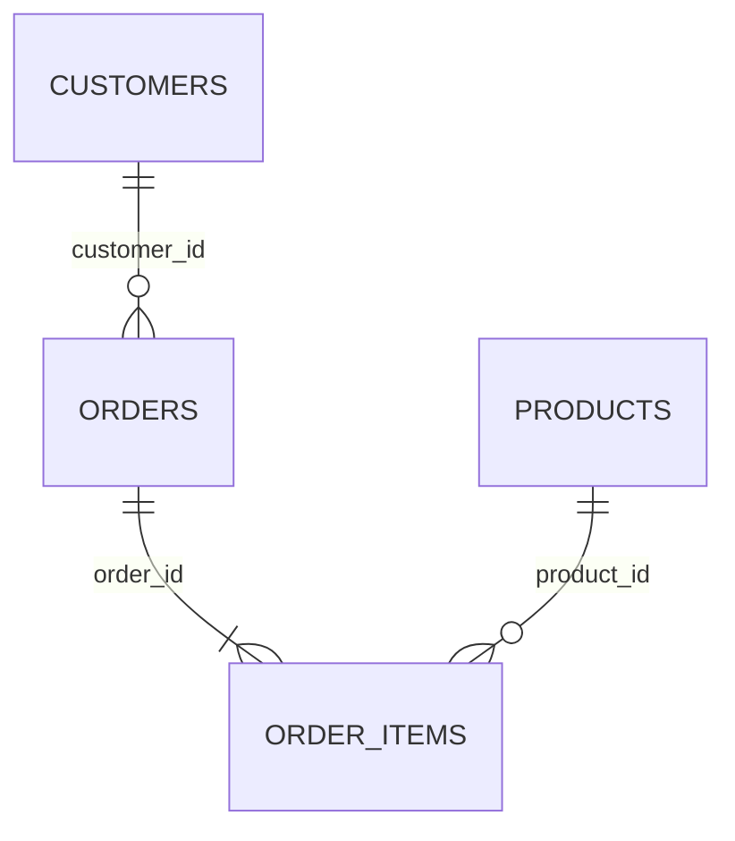

# Database Keys

Database key হলো table এর row গুলোকে uniquely identify করার mechanism এবং table গুলোর মধ্যে relationship establish করার fundamental component।

ডাটাবেস design এবং data integrity নিশ্চিত করার জন্য key অত্যন্ত গুরুত্বপূ

## ৫. What are keys in databases?



**Database Key** হলো একটি column বা column এর combination যা table এর প্রতিটি row কে uniquely identify করে এবং data integrity maintain করে।

#### Key এর মূল বৈশিষ্ট্য:
- **Uniqueness**: প্রতিটি key value unique হতে হবে
- **Non-null**: Key value NULL হতে পারে না (primary key এর ক্ষেত্রে)
- **Immutable**: Key value সাধারণত change করা উচিত নয়
- **Minimal**: Unnecessary column key তে include করা উচিত নয়

#### Key এর প্রকারভেদ:

#### ১. **Primary Key**:
Primary Key হলো table-এর main identifier। একটি table-এ শুধুমাত্র একটি primary key থাকতে পারে।
```sql
-- Single column primary key
CREATE TABLE users (
    user_id INT PRIMARY KEY AUTO_INCREMENT,
    name VARCHAR(100),
    email VARCHAR(100)
);

-- Composite primary key
CREATE TABLE order_items (
    order_id INT,
    product_id INT,
    quantity INT,
    PRIMARY KEY (order_id, product_id)
);
```

#### ২. **Foreign Key**:
Foreign key একটি table-কে অন্য table-এর primary key-এর সাথে connect করে।
```sql
CREATE TABLE orders (
    order_id INT PRIMARY KEY,
    user_id INT,
    order_date DATE,
    FOREIGN KEY (user_id) REFERENCES users(user_id)
);
```

#### ৩. **Unique Key**:
Unique key duplicate value prevent করে, কিন্তু primary key-এর মতো main identifier নয়।
```sql
CREATE TABLE users (
    user_id INT PRIMARY KEY,
    username VARCHAR(50) UNIQUE,
    email VARCHAR(100) UNIQUE,
    phone VARCHAR(15)
);
```

#### ৪. **Candidate Key**:
Table-এর যেকোনো column বা column combination যা uniquely identify করতে পারে, সেটি candidate key।
```sql
-- Multiple columns can serve as candidate keys
CREATE TABLE employees (
    emp_id INT UNIQUE NOT NULL,           -- Candidate key 1
    email VARCHAR(100) UNIQUE NOT NULL,   -- Candidate key 2
    ssn VARCHAR(11) UNIQUE NOT NULL,      -- Candidate key 3
    name VARCHAR(100),
    department VARCHAR(50)
);
```

### Difference between primary key vs unique key?

Primary key এবং unique key দুটোই uniqueness ensure করে, কিন্তু তাদের মধ্যে গুরুত্বপূর্ণ পার্থক্য আছে:

| **বিষয়** | **Primary Key** | **Unique Key** |
|-----------|-----------------|----------------|
| **NULL Value** | NULL value allow করে না | NULL handling DBMS-ভেদে ভিন্ন; PostgreSQL/MySQL সাধারণত একাধিক NULL allow করে, SQL Server সাধারণ unique constraint সাধারণত একটি NULL allow করে |
| **Quantity per Table** | একটি table এ শুধুমাত্র একটি | একটি table এ multiple unique key থাকতে পারে |
| **Index Creation** | Supporting unique index সাধারণত তৈরি হয়; clustered হওয়া DBMS/storage engine-নির্ভর | Supporting unique index সাধারণত তৈরি হয়; index type DBMS-নির্ভর |
| **Purpose** | Table এর main identifier | Additional uniqueness constraint |
| **Modification** | Generally immutable | Can be modified |
| **Performance** | Faster query performance | Good performance but not primary identifier |

#### Practical Example:

```sql
CREATE TABLE customers (
    customer_id INT PRIMARY KEY AUTO_INCREMENT,  -- Primary key
    email VARCHAR(100) UNIQUE NOT NULL,          -- Unique key 1
    phone VARCHAR(15) UNIQUE,                    -- Unique key 2 (can be NULL)
    username VARCHAR(50) UNIQUE,                 -- Unique key 3
    name VARCHAR(100),
    address TEXT
);

-- Valid data insertion
INSERT INTO customers (email, phone, username, name) 
VALUES ('john@example.com', '123-456-7890', 'johndoe', 'John Doe');

-- This will fail - email already exists
INSERT INTO customers (email, phone, username, name) 
VALUES ('john@example.com', '098-765-4321', 'john_d', 'John Smith'); -- ERROR

-- This is valid - phone can be NULL for unique key
INSERT INTO customers (email, phone, username, name) 
VALUES ('jane@example.com', NULL, 'janedoe', 'Jane Doe'); -- OK
```

#### Use Cases:

**Primary Key Use Cases**:
- Main record identifier
- Foreign key reference থেকে
- Clustering এবং indexing optimization
- Replication এবং synchronization

**Unique Key Use Cases**:
- Email address validation
- Username uniqueness
- Product code uniqueness
- Alternative identification method

### What is candidate key vs alternate key?

Database design এ key এর hierarchy বোঝা data modeling এর জন্য গুরুত্বপূর্ণ:

#### **Candidate Key**:
Table এর যেকোনো column বা column combination যা uniquely identify করতে পারে, সেটি candidate key।

সব possible unique identifiers গুলো candidate key।


```sql
-- Example table with multiple candidate keys
CREATE TABLE employees (
    emp_id INT,           -- Candidate key 1
    email VARCHAR(100),   -- Candidate key 2
    ssn VARCHAR(11),      -- Candidate key 3
    passport VARCHAR(20), -- Candidate key 4
    name VARCHAR(100),
    department VARCHAR(50),
    salary DECIMAL(10,2)
);
```

#### **Alternate Key**:
Candidate key গুলোর মধ্যে যেটি primary key হিসেবে select করা হয়নি, বাকি গুলো alternate key।

```sql
-- If emp_id is chosen as primary key
ALTER TABLE employees ADD PRIMARY KEY (emp_id);

-- Then these become alternate keys:
ALTER TABLE employees ADD UNIQUE KEY uk_email (email);
ALTER TABLE employees ADD UNIQUE KEY uk_ssn (ssn);  
ALTER TABLE employees ADD UNIQUE KEY uk_passport (passport);
```

#### Key Selection Process:

| Step | Action | Example |
|------|--------|---------|
| **1. Identify Candidate Keys** | Find all columns that can uniquely identify | emp_id, email, ssn, passport |
| **2. Select Primary Key** | Choose best candidate based on criteria | emp_id (simple, stable, meaningful) |
| **3. Implement Alternate Keys** | Add unique constraints to remaining candidates | UNIQUE constraint on email, ssn, passport |
| **4. Document Decision** | Record why specific key was chosen as primary | emp_id is sequential and never changes |

#### Primary Key Selection Criteria:

ভালো primary key-এর বৈশিষ্ট্য:

* Simple
* Short
* Stable
* Never changes
* Meaningless (business data নয়)

```sql
-- Good primary key characteristics
CREATE TABLE products (
    -- ✅ Good: Simple, stable, meaningless surrogate identifier
    product_id INT PRIMARY KEY AUTO_INCREMENT,
    
    -- Alternative candidates
    sku VARCHAR(20) UNIQUE,        -- Alternate key 1
    barcode VARCHAR(13) UNIQUE,    -- Alternate key 2
    
    name VARCHAR(200),
    price DECIMAL(10,2)
);

-- Poor primary key example
CREATE TABLE bad_example (
    -- ❌ Poor: Complex composite key
    PRIMARY KEY (customer_name, order_date, product_name),
    
    -- ✅ Better approach
    order_id INT AUTO_INCREMENT,   -- Simple primary key
    customer_name VARCHAR(100),
    order_date DATE,
    product_name VARCHAR(200)
);
```

### Can a primary key be NULL? Can it be changed?

#### **Primary Key এবং NULL Value**:

**Answer: না, primary key কখনো NULL হতে পারে না।**

```sql
-- This will fail
CREATE TABLE users (
    user_id INT PRIMARY KEY,
    name VARCHAR(100)
);

INSERT INTO users (user_id, name) VALUES (NULL, 'John'); -- ERROR!
-- ERROR: Column 'user_id' cannot be null

-- Correct approach
INSERT INTO users (user_id, name) VALUES (1, 'John'); -- OK
```

#### **Why Primary Key Cannot be NULL**:
- **Unique Identification**: NULL value দিয়ে record uniquely identify করা impossible
- **Indexing Issues**: Database index NULL value efficiently handle করতে পারে না
- **Referential Integrity**: Foreign key NULL primary key কে reference করতে পারে না
- **ACID Compliance**: Data consistency maintain করতে NOT NULL required

#### **Primary Key Modification**:

**Answer: Technically possible কিন্তু strongly discouraged।**

```sql
-- Example of primary key modification (NOT RECOMMENDED)
CREATE TABLE orders (
    order_id INT PRIMARY KEY,
    customer_id INT,
    order_date DATE
);

INSERT INTO orders VALUES (1001, 500, '2024-01-15');

-- This is possible but risky
UPDATE orders SET order_id = 2001 WHERE order_id = 1001;
```

#### **Primary Key Modification এর সমস্যা**:

#### ১. **Referential Integrity Issues**:
```sql
-- Parent table
CREATE TABLE customers (
    customer_id INT PRIMARY KEY,
    name VARCHAR(100)
);

-- Child table with foreign key
CREATE TABLE orders (
    order_id INT PRIMARY KEY,
    customer_id INT,
    FOREIGN KEY (customer_id) REFERENCES customers(customer_id)
);

-- If we change primary key in customers table
UPDATE customers SET customer_id = 999 WHERE customer_id = 1;
-- This might break foreign key references in orders table
```

#### ২. **Application Logic Issues**:
```sql
-- Application code might cache primary key values
// JavaScript example
const userId = 1001;
localStorage.setItem('currentUser', userId);

// If primary key changes, cached references become invalid
// Application logic might fail
```

#### ৩. **Performance Impact**:
```sql
-- Primary key change triggers index rebuilding
-- On large tables, this can be very slow
UPDATE large_table SET id = new_value WHERE id = old_value;
-- This might lock table and affect performance
```

#### **Best Practices for Primary Key Management**:

#### ১. **Use Immutable Primary Keys**:
```sql
-- ✅ Good: Auto-increment ID (never changes)
CREATE TABLE users (
    user_id INT PRIMARY KEY AUTO_INCREMENT,
    username VARCHAR(50) UNIQUE,
    email VARCHAR(100) UNIQUE
);

-- ❌ Avoid: Using changeable business data as primary key
CREATE TABLE bad_users (
    email VARCHAR(100) PRIMARY KEY,  -- Email might change!
    name VARCHAR(100)
);
```

#### ২. **Surrogate vs Natural Keys**:
```sql
-- ✅ Surrogate key (recommended)
CREATE TABLE products (
    product_id INT PRIMARY KEY AUTO_INCREMENT,  -- Surrogate key
    sku VARCHAR(20) UNIQUE,                     -- Natural key as alternate
    name VARCHAR(200)
);

-- ⚠️ Natural key (use carefully)
CREATE TABLE countries (
    country_code CHAR(3) PRIMARY KEY,  -- ISO country code (stable)
    country_name VARCHAR(100)
);
```

#### ৩. **UUID as Primary Key**:
```sql
-- For distributed systems
CREATE TABLE distributed_users (
    user_id VARCHAR(36) PRIMARY KEY,  -- UUID format
    name VARCHAR(100),
    created_at TIMESTAMP DEFAULT CURRENT_TIMESTAMP
);

-- Example UUID insertion
INSERT INTO distributed_users (user_id, name) 
VALUES ('550e8400-e29b-41d4-a716-446655440000', 'John Doe');
```

#### ৪. **Composite Primary Key Considerations**:
```sql
-- When composite key is necessary
CREATE TABLE enrollment (
    student_id INT,
    course_id INT,
    semester VARCHAR(20),
    grade CHAR(2),
    PRIMARY KEY (student_id, course_id, semester),
    FOREIGN KEY (student_id) REFERENCES students(student_id),
    FOREIGN KEY (course_id) REFERENCES courses(course_id)
);

-- Alternative with surrogate key
CREATE TABLE enrollment_v2 (
    enrollment_id INT PRIMARY KEY AUTO_INCREMENT,  -- Surrogate key
    student_id INT,
    course_id INT,
    semester VARCHAR(20),
    grade CHAR(2),
    UNIQUE KEY uk_enrollment (student_id, course_id, semester),
    FOREIGN KEY (student_id) REFERENCES students(student_id),
    FOREIGN KEY (course_id) REFERENCES courses(course_id)
);
```

#### **Summary**:
- Primary key **never NULL** - database design এর fundamental rule
- Primary key modification **technically possible but avoid করুন**
- **Surrogate key** use করুন business data এর পরিবর্তে
- **Immutable value** primary key হিসেবে choose করুন
- **Application design** এ primary key dependency minimize করুন
