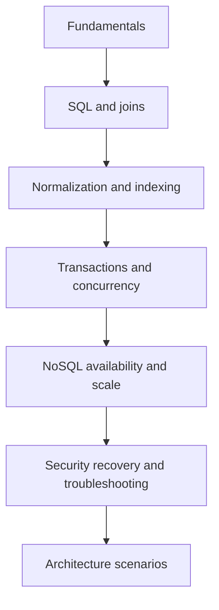

# 🚀 Complete Database Interview Questions Guide
*Master Database Interviews with 200+ Questions & Follow-ups*

---

## 📚 **1. Database Fundamentals**

### **1. What is a database?**
- **Follow-up**: How is a database different from a file system?
- **Follow-up**: What are the advantages of databases over flat files?
- **Follow-up**: Examples of different types of databases (relational, NoSQL, graph)?

### **2. What is DBMS?**
- **Follow-up**: Difference between DBMS and RDBMS?
- **Follow-up**: Examples of DBMS used in real world?
- **Follow-up**: What is the role of database administrator (DBA)?

### **3. What are ACID properties?**
- **Follow-up**: Why are they important?
- **Follow-up**: Which ACID property is most critical in banking systems?
- **Follow-up**: Can you give an example where each property is violated?

### **4. What is a schema in databases?**
- **Follow-up**: Difference between schema and instance?
- **Follow-up**: Can a database have multiple schemas?
- **Follow-up**: What is schema evolution and versioning?

### **5. What are keys in databases?**
- **Follow-up**: Difference between primary key vs unique key?
- **Follow-up**: What is candidate key vs alternate key?
- **Follow-up**: Can a primary key be NULL? Can it be changed?

### **6. What is data redundancy?**
- **Follow-up**: Why is redundancy bad?
- **Follow-up**: How can redundancy be reduced?
- **Follow-up**: When might controlled redundancy be beneficial?

### **7. What is data integrity?**
- **Follow-up**: Types of integrity (entity, referential, domain)?
- **Follow-up**: How does DBMS enforce referential integrity?
- **Follow-up**: What happens when foreign key constraint is violated?

### **8. What is data abstraction?**
- **Follow-up**: What are the three levels of abstraction (physical, logical, view)?
- **Follow-up**: How does abstraction help in database design?

### **9. What is data independence?**
- **Follow-up**: Difference between physical and logical data independence?
- **Follow-up**: Why is data independence important for applications?

### **10. What is a database buffer pool?**
- **Follow-up**: How does it improve performance?
- **Follow-up**: What happens when buffer pool is full?

---

## 🔍 **2. SQL Fundamentals**

### **11. What is SQL?**
- **Follow-up**: Difference between SQL, MySQL, PostgreSQL, Oracle?
- **Follow-up**: Is SQL case-sensitive?
- **Follow-up**: What are SQL standards (ANSI SQL)?

### **12. Types of SQL commands?**
- **Follow-up**: Give examples of DDL, DML, DCL, TCL?
- **Follow-up**: Which commands require COMMIT?

### **13. What is SELECT statement?**
- **Follow-up**: Difference between SELECT * and SELECT column_name?
- **Follow-up**: Why is SELECT * considered bad practice?

### **14. Difference between DELETE, TRUNCATE, DROP?**
- **Follow-up**: Which is faster and why?
- **Follow-up**: Which operations can be rolled back?
- **Follow-up**: What happens to indexes when you TRUNCATE?

### **15. What are constraints in SQL?**
- **Follow-up**: NOT NULL vs CHECK constraint?
- **Follow-up**: Can you have multiple CHECK constraints on same column?
- **Follow-up**: What is DEFAULT constraint?

### **16. What is a subquery?**
- **Follow-up**: Difference between subquery and correlated subquery?
- **Follow-up**: When would you use EXISTS vs IN with subqueries?
- **Follow-up**: Performance comparison: JOIN vs subquery?

### **17. What is HAVING vs WHERE clause?**
- **Follow-up**: Can HAVING be used without GROUP BY?
- **Follow-up**: Can you use column aliases in HAVING clause?

### **18. What is UNION vs UNION ALL?**
- **Follow-up**: When would you use UNION ALL instead of UNION?
- **Follow-up**: Performance difference between them?
- **Follow-up**: What is INTERSECT and EXCEPT?

### **19. What is DISTINCT keyword?**
- **Follow-up**: Can DISTINCT be used across multiple columns?
- **Follow-up**: How does DISTINCT work internally?

### **20. What is ORDER BY and GROUP BY?**
- **Follow-up**: Can we use both together?
- **Follow-up**: What is the execution order of SQL clauses?

### **21. What are aggregate functions in SQL?**
- **Follow-up**: Examples like COUNT, AVG, MAX, MIN, SUM?
- **Follow-up**: What happens when you use aggregate functions with NULL values?

### **22. What is a window function?**
- **Follow-up**: Difference between ROW_NUMBER(), RANK(), DENSE_RANK()?
- **Follow-up**: What is PARTITION BY vs GROUP BY?
- **Follow-up**: Examples of LAG() and LEAD() functions?

### **23. What is a Common Table Expression (CTE)?**
- **Follow-up**: Difference between CTE and subquery?
- **Follow-up**: What is recursive CTE?
- **Follow-up**: Can CTEs improve performance?

### **24. What are temporary tables?**
- **Follow-up**: Difference between temp table and table variable?
- **Follow-up**: When are temporary tables automatically dropped?

### **25. What is CASE statement in SQL?**
- **Follow-up**: Difference between simple CASE and searched CASE?
- **Follow-up**: Can CASE be used in WHERE clause?

---

## 🔗 **3. Joins & Relationships**

### **26. What are SQL joins?**
- **Follow-up**: Explain INNER JOIN with example
- **Follow-up**: Difference between LEFT JOIN and RIGHT JOIN?
- **Follow-up**: What happens when join condition returns NULL?

### **27. What is FULL OUTER JOIN?**
- **Follow-up**: How is it different from UNION?
- **Follow-up**: Which databases support FULL OUTER JOIN?

### **28. What is CROSS JOIN?**
- **Follow-up**: Why is it rarely used in practice?
- **Follow-up**: How many rows does CROSS JOIN return?

### **29. What is SELF JOIN?**
- **Follow-up**: Give a real-world use case (employee-manager relationship)?
- **Follow-up**: Why do we need table aliases in SELF JOIN?

### **30. What is the difference between INNER JOIN and WHERE clause for joining tables?**
- **Follow-up**: Which is more readable?
- **Follow-up**: Performance difference between them?

### **31. What is a cartesian product?**
- **Follow-up**: When does it occur?
- **Follow-up**: How do you avoid it?

---

## 📊 **4. Normalization & Database Design**

### **32. What is normalization?**
- **Follow-up**: Why is it needed?
- **Follow-up**: What problems does it solve?

### **33. Explain 1NF, 2NF, 3NF?**
- **Follow-up**: What is partial dependency?
- **Follow-up**: What is transitive dependency?
- **Follow-up**: Give examples of violations for each normal form?

### **34. What is BCNF (Boyce-Codd Normal Form)?**
- **Follow-up**: When is BCNF required beyond 3NF?
- **Follow-up**: Give an example where 3NF doesn't prevent anomalies?

### **35. What is 4NF and 5NF?**
- **Follow-up**: What is multi-valued dependency?
- **Follow-up**: Are higher normal forms practical in real applications?

### **36. What is denormalization?**
- **Follow-up**: When would you prefer denormalization?
- **Follow-up**: Trade-offs of denormalization?

### **37. What are anomalies in database design?**
- **Follow-up**: Explain insertion, update, and deletion anomaly with examples?
- **Follow-up**: How does normalization prevent these anomalies?

### **38. What is functional dependency?**
- **Follow-up**: How do you identify functional dependencies?
- **Follow-up**: What is trivial vs non-trivial functional dependency?

---

## ⚡ **5. Indexing & Performance**

### **39. What is an index?**
- **Follow-up**: Why do we need indexes?
- **Follow-up**: Can indexes slow down write operations?
- **Follow-up**: How does database choose which index to use?

### **40. Difference between clustered and non-clustered index?**
- **Follow-up**: Which is faster for SELECT queries?
- **Follow-up**: How many clustered indexes can a table have?
- **Follow-up**: What determines the physical order of data?

### **41. What is a composite index?**
- **Follow-up**: When is it useful?
- **Follow-up**: Does order of columns matter in composite index?
- **Follow-up**: What is index selectivity?

### **42. What is a covering index?**
- **Follow-up**: How does it improve performance?
- **Follow-up**: What is the downside of too many covering indexes?

### **43. What is a unique index?**
- **Follow-up**: Difference between unique index and unique constraint?
- **Follow-up**: Can you have NULL values in unique index?

### **44. What is a partial index?**
- **Follow-up**: When would you use it?
- **Follow-up**: How does it save storage space?

### **45. What is a bitmap index?**
- **Follow-up**: When is it used?
- **Follow-up**: Why is it not suitable for OLTP systems?

### **46. What is index fragmentation?**
- **Follow-up**: How does it affect performance?
- **Follow-up**: How do you rebuild fragmented indexes?

### **47. What is query optimization?**
- **Follow-up**: What are some ways to optimize a slow query?
- **Follow-up**: Role of database optimizer?

### **48. What is query execution plan?**
- **Follow-up**: How do you read an execution plan?
- **Follow-up**: What is cost-based optimization?

### **49. What are database statistics?**
- **Follow-up**: How does outdated statistics affect query performance?
- **Follow-up**: How often should statistics be updated?

### **50. What is database caching?**
- **Follow-up**: Difference between DB caching and application-level caching?
- **Follow-up**: What is query result caching?

---

## 🔄 **6. Transactions & Concurrency**

### **51. What is a transaction?**
- **Follow-up**: Why are transactions important?
- **Follow-up**: What makes a transaction atomic?

### **52. What is COMMIT and ROLLBACK?**
- **Follow-up**: Can you rollback after commit?
- **Follow-up**: What is auto-commit mode?

### **53. What is SAVEPOINT in SQL?**
- **Follow-up**: When is it used?
- **Follow-up**: Can you have nested savepoints?

### **54. What are isolation levels?**
- **Follow-up**: Explain READ UNCOMMITTED, READ COMMITTED, REPEATABLE READ, SERIALIZABLE?
- **Follow-up**: Which isolation level does your database use by default?

### **55. What is dirty read?**
- **Follow-up**: How can it be avoided?
- **Follow-up**: Which isolation levels prevent dirty reads?

### **56. What is non-repeatable read?**
- **Follow-up**: Example in real-world banking scenario?
- **Follow-up**: How is it different from dirty read?

### **57. What is phantom read?**
- **Follow-up**: Which isolation level prevents phantom reads?
- **Follow-up**: How does it differ from non-repeatable read?

### **58. What is deadlock?**
- **Follow-up**: How can DBMS resolve deadlock?
- **Follow-up**: How can developers prevent deadlocks?
- **Follow-up**: What is deadlock detection vs prevention?

### **59. Difference between optimistic and pessimistic locking?**
- **Follow-up**: Which is better for high-traffic systems?
- **Follow-up**: When would you use each approach?

### **60. What is two-phase locking (2PL)?**
- **Follow-up**: What are growing and shrinking phases?
- **Follow-up**: How does it prevent inconsistencies?

### **61. What is multi-version concurrency control (MVCC)?**
- **Follow-up**: Which databases use MVCC?
- **Follow-up**: How does it handle concurrent reads and writes?

---

## 📋 **7. Views, Stored Procedures & Triggers**

### **62. What is a view?**
- **Follow-up**: Advantages of using views?
- **Follow-up**: Can views be updated?
- **Follow-up**: What is an updatable view?

### **63. What is a materialized view?**
- **Follow-up**: How is it different from normal view?
- **Follow-up**: When would you use materialized views?
- **Follow-up**: How do you refresh materialized views?

### **64. What is a stored procedure?**
- **Follow-up**: Advantages over normal SQL queries?
- **Follow-up**: Can stored procedures return values?

### **65. What is difference between stored procedure and function?**
- **Follow-up**: When to use procedures vs functions?
- **Follow-up**: Can functions modify database state?

### **66. What is a trigger?**
- **Follow-up**: Difference between BEFORE and AFTER trigger?
- **Follow-up**: Can triggers call other triggers?
- **Follow-up**: What is cascading triggers?

### **67. What is an INSTEAD OF trigger?**
- **Follow-up**: When would you use it?
- **Follow-up**: How is it different from BEFORE/AFTER triggers?

### **69. What is a cursor in SQL?**
- **Follow-up**: When would you use cursors instead of set-based operations?
- **Follow-up**: Types of cursors (forward-only, static, dynamic)?

### **70. What is user-defined function (UDF)?**
- **Follow-up**: Difference between scalar and table-valued functions?
- **Follow-up**: Can UDFs be used in WHERE clauses?

---

## 🏗️ **8. Database Architecture & Internals**

### **71. What is write-ahead logging (WAL)?**
- **Follow-up**: How does it ensure durability?
- **Follow-up**: What happens during database recovery?

### **72. What is database checkpointing?**
- **Follow-up**: Why is it necessary?
- **Follow-up**: How often should checkpoints occur?

### **73. How does database storage work internally?**
- **Follow-up**: What are pages and blocks?
- **Follow-up**: How are B-trees used in databases?

### **74. What is difference between B-tree and B+ tree?**
- **Follow-up**: Why do databases prefer B+ trees?
- **Follow-up**: How do they handle range queries?

### **75. What are LSM trees?**
- **Follow-up**: How do they differ from B-trees?
- **Follow-up**: Which databases use LSM trees?

### **76. What is database connection pooling?**
- **Follow-up**: Why is it important?
- **Follow-up**: What happens when pool is exhausted?

### **77. What is query parser and optimizer?**
- **Follow-up**: How does cost-based optimization work?
- **Follow-up**: What are optimizer hints?

### **78. What is database lock manager?**
- **Follow-up**: Types of locks (shared, exclusive, intention)?
- **Follow-up**: What is lock escalation?

---

## 🌐 **9. NoSQL Databases**

### **79. What is NoSQL?**
- **Follow-up**: How does it differ from relational databases?
- **Follow-up**: When should you choose NoSQL over SQL?

### **80. Types of NoSQL databases?**
- **Follow-up**: Give examples of each type (document, key-value, column-family, graph)?
- **Follow-up**: Which type fits which use case?

### **81. What is a key-value store?**
- **Follow-up**: Examples like Redis, DynamoDB?
- **Follow-up**: What are the limitations?

### **82. What is a document database?**
- **Follow-up**: Why is MongoDB considered schema-less?
- **Follow-up**: How do you handle relationships in document stores?

### **83. What is a column-family database?**
- **Follow-up**: How is Cassandra different from traditional RDBMS?
- **Follow-up**: What is wide column store?

### **84. What is a graph database?**
- **Follow-up**: Examples like Neo4j, Amazon Neptune?
- **Follow-up**: What kind of queries are efficient in graph DBs?

### **85. What is CAP theorem?**
- **Follow-up**: How do NoSQL databases handle the trade-offs?
- **Follow-up**: Examples of CP, AP, and CA systems?

### **86. What is BASE property in NoSQL?**
- **Follow-up**: Compare BASE with ACID?
- **Follow-up**: What is "basically available"?

### **87. What is eventual consistency?**
- **Follow-up**: Which NoSQL databases use this model?
- **Follow-up**: How long does "eventually" take?

### **88. What is sharding in NoSQL?**
- **Follow-up**: How does MongoDB implement auto-sharding?
- **Follow-up**: What is shard key selection strategy?

### **89. What is replication in NoSQL?**
- **Follow-up**: Difference between master-slave and master-master?
- **Follow-up**: How does MongoDB replica set work?

### **90. What is MapReduce?**
- **Follow-up**: When would you prefer aggregation pipeline instead?
- **Follow-up**: Is MapReduce still relevant today?

---

## 🔒 **10. Security & Backup**

### **91. What is SQL injection?**
- **Follow-up**: How do you prevent it?
- **Follow-up**: What are parameterized queries?
- **Follow-up**: Examples of SQL injection attacks?

### **92. What is database encryption?**
- **Follow-up**: Difference between encryption at rest and in transit?
- **Follow-up**: What is Transparent Data Encryption (TDE)?

### **93. What is database authentication vs authorization?**
- **Follow-up**: What are database roles and permissions?
- **Follow-up**: Principle of least privilege?

### **94. What is database auditing?**
- **Follow-up**: What activities should be logged?
- **Follow-up**: How does auditing affect performance?

### **95. What is a database backup?**
- **Follow-up**: Difference between full, incremental, and differential backups?
- **Follow-up**: What is backup retention policy?

### **96. What is logical vs physical backup?**
- **Follow-up**: Tools for each type (mysqldump, pg_dump vs file system backup)?
- **Follow-up**: Which is faster for large databases?

### **97. What is hot backup vs cold backup?**
- **Follow-up**: Which is safer for production systems?
- **Follow-up**: What is warm backup?

### **98. What is point-in-time recovery (PITR)?**
- **Follow-up**: How does it work with transaction logs?
- **Follow-up**: What is Recovery Point Objective (RPO)?

### **99. What is database replication for backup purposes?**
- **Follow-up**: How is it different from regular backups?
- **Follow-up**: Can replication replace backups entirely?

### **100. What is snapshot in databases?**
- **Follow-up**: How does filesystem snapshot work?
- **Follow-up**: Limitations of snapshot-based backups?

---

## 🏢 **11. High Availability & Scalability**

### **101. What is database clustering?**
- **Follow-up**: Difference between active-active and active-passive clustering?
- **Follow-up**: How does failover work in clusters?

### **102. What is database replication?**
- **Follow-up**: Types of replication (synchronous vs asynchronous)?
- **Follow-up**: What is replication lag and how to minimize it?

### **103. What is database sharding?**
- **Follow-up**: Horizontal vs vertical partitioning?
- **Follow-up**: How do you handle cross-shard queries?

### **104. What is read replica?**
- **Follow-up**: How does it improve read performance?
- **Follow-up**: What about eventual consistency issues?

### **105. What is load balancing for databases?**
- **Follow-up**: How do you distribute read and write operations?
- **Follow-up**: What is connection pooling at load balancer level?

### **106. What is failover and failback?**
- **Follow-up**: How does automatic failover work?
- **Follow-up**: What is split-brain problem?

### **107. What is disaster recovery (DR)?**
- **Follow-up**: Difference between RPO and RTO?
- **Follow-up**: What is cold, warm, and hot DR site?

### **108. What is database federation?**
- **Follow-up**: When would you use federated databases?
- **Follow-up**: Challenges with federated queries?

### **109. What is multi-master replication?**
- **Follow-up**: How do you handle write conflicts?
- **Follow-up**: Examples of databases supporting multi-master?

### **110. What is distributed database?**
- **Follow-up**: CAP theorem implications?
- **Follow-up**: What is distributed transaction (2PC)?

---

## 📈 **12. Data Warehousing & Analytics**

### **111. What is OLTP vs OLAP?**
- **Follow-up**: Key differences in design and usage?
- **Follow-up**: Why can't OLTP handle analytical queries well?

### **112. What is a data warehouse?**
- **Follow-up**: How is it different from operational database?
- **Follow-up**: What is ETL process?

### **113. What is ETL vs ELT?**
- **Follow-up**: When would you choose ELT over ETL?
- **Follow-up**: Tools for ETL/ELT processes?

### **114. What is star schema vs snowflake schema?**
- **Follow-up**: Advantages and disadvantages of each?
- **Follow-up**: What is fact table and dimension table?

### **115. What is data lake?**
- **Follow-up**: Data lake vs data warehouse comparison?
- **Follow-up**: What is schema-on-read vs schema-on-write?

### **116. What is dimensional modeling?**
- **Follow-up**: What is Kimball methodology?
- **Follow-up**: Types of dimensions (conformed, slowly changing)?

### **117. What is columnar database?**
- **Follow-up**: Why is it better for analytics?
- **Follow-up**: Examples like Redshift, BigQuery?

### **118. What is data mart?**
- **Follow-up**: How does it relate to data warehouse?
- **Follow-up**: Top-down vs bottom-up approach?

---

## ☁️ **13. Cloud & Modern Databases**

### **119. What is Database as a Service (DBaaS)?**
- **Follow-up**: Examples like RDS, Cloud SQL, Azure SQL?
- **Follow-up**: Advantages over self-managed databases?

### **120. What is serverless database?**
- **Follow-up**: How does Aurora Serverless work?
- **Follow-up**: When is serverless appropriate?

### **121. What is multi-cloud database strategy?**
- **Follow-up**: Challenges with multi-cloud databases?
- **Follow-up**: How do you handle data consistency across clouds?

### **122. What is database containerization?**
- **Follow-up**: Running databases in Docker/Kubernetes?
- **Follow-up**: Challenges with stateful containers?

### **123. What is database migration to cloud?**
- **Follow-up**: Strategies to minimize downtime?
- **Follow-up**: What is Database Migration Service (DMS)?

### **124. What is hybrid cloud database?**
- **Follow-up**: On-premise + cloud architecture?
- **Follow-up**: Data synchronization challenges?

### **125. What is edge database?**
- **Follow-up**: Why do you need databases at edge locations?
- **Follow-up**: How do you sync edge databases with central database?

---

## 🔧 **14. Database Tools & Ecosystem**

### **126. What is ORM (Object-Relational Mapping)?**
- **Follow-up**: Examples like Hibernate, Django ORM, SQLAlchemy?
- **Follow-up**: Advantages and disadvantages of ORMs?

### **127. What is database schema migration?**
- **Follow-up**: Tools like Flyway, Liquibase?
- **Follow-up**: How do you handle rollbacks?

### **128. What is database version control?**
- **Follow-up**: How do you version database schemas?
- **Follow-up**: What is database branching strategy?

### **129. What is database testing?**
- **Follow-up**: How do you test database changes?
- **Follow-up**: What is test data management?

### **130. What is database monitoring?**
- **Follow-up**: Key metrics to monitor (CPU, memory, I/O, connections)?
- **Follow-up**: Tools like New Relic, DataDog, Prometheus?

### **131. What is Change Data Capture (CDC)?**
- **Follow-up**: How does it work?
- **Follow-up**: Use cases for CDC?

### **132. What is database proxy?**
- **Follow-up**: Examples like ProxySQL, PgBouncer?
- **Follow-up**: Benefits of using database proxy?

---

## 🎯 **15. Advanced & Modern Concepts**

### **133. What is temporal database?**
- **Follow-up**: Valid-time vs transaction-time tables?
- **Follow-up**: How do you query historical data?

### **134. What is in-memory database?**
- **Follow-up**: Examples like Redis, SAP HANA?
- **Follow-up**: When would you choose in-memory over disk-based?

### **135. What is time-series database?**
- **Follow-up**: Examples like InfluxDB, TimescaleDB?
- **Follow-up**: Why are they optimized for time-series data?

### **136. What is blockchain database?**
- **Follow-up**: How is it different from traditional databases?
- **Follow-up**: Use cases beyond cryptocurrency?

### **137. What is database as code?**
- **Follow-up**: Infrastructure as Code for databases?
- **Follow-up**: GitOps for database deployments?

### **138. What is CQRS (Command Query Responsibility Segregation)?**
- **Follow-up**: How does it differ from traditional CRUD?
- **Follow-up**: When would you implement CQRS?

### **139. What is event sourcing?**
- **Follow-up**: How is it different from traditional state storage?
- **Follow-up**: What are event stores?

### **140. What is polyglot persistence?**
- **Follow-up**: Using multiple databases in one application?
- **Follow-up**: How do you maintain consistency across different databases?

### **141. What is database mesh?**
- **Follow-up**: How does it relate to service mesh?
- **Follow-up**: What problems does it solve?

### **142. What is NewSQL?**
- **Follow-up**: Examples like CockroachDB, TiDB?
- **Follow-up**: How does it combine benefits of SQL and NoSQL?

---

## 🛠️ **16. Scenario-Based Questions**

### **143. Design a chat application database**
- **Follow-up**: How would you handle message history efficiently?
- **Follow-up**: How do you implement read receipts?
- **Follow-up**: How to handle group chats vs direct messages?

### **144. Design a ride-sharing app database (Uber-style)**
- **Follow-up**: How do you handle real-time driver location updates?
- **Follow-up**: How do you implement surge pricing?
- **Follow-up**: How do you match drivers with riders efficiently?

### **145. Design an e-commerce database**
- **Follow-up**: How do you handle shopping carts and abandoned carts?
- **Follow-up**: How do you manage inventory across multiple warehouses?
- **Follow-up**: How do you handle product recommendations?

### **146. Design a social media platform database**
- **Follow-up**: How do you implement follow/unfollow efficiently?
- **Follow-up**: How do you generate news feed?
- **Follow-up**: How do you handle trending topics?

### **147. Design a banking system database**
- **Follow-up**: How do you ensure ACID properties for money transfers?
- **Follow-up**: How do you handle transaction history and auditing?
- **Follow-up**: How do you prevent double spending?

### **148. Design a video streaming platform database**
- **Follow-up**: How do you store video metadata vs actual video files?
- **Follow-up**: How do you handle user viewing history and recommendations?
- **Follow-up**: How do you implement content delivery and caching?

### **149. Design a stock trading system database**
- **Follow-up**: How do you handle high-frequency trading requirements?
- **Follow-up**: How do you ensure data consistency for real-time prices?
- **Follow-up**: How do you handle order matching?

### **150. Design a hospital management system database**
- **Follow-up**: How do you handle patient privacy (HIPAA compliance)?
- **Follow-up**: How do you manage appointment scheduling?
- **Follow-up**: How do you handle medical records and history?

---

## 🚨 **17. Troubleshooting & Performance**

### **151. Database suddenly became slow after deployment. How do you debug?**
- **Follow-up**: What are the first things you would check?
- **Follow-up**: How do you identify if it's a query or infrastructure issue?
- **Follow-up**: What tools would you use for diagnosis?

### **152. How do you identify and fix a slow query?**
- **Follow-up**: What is query profiling?
- **Follow-up**: How do you use EXPLAIN plan?
- **Follow-up**: Common causes of slow queries?

### **153. Database is running out of disk space. What do you do?**
- **Follow-up**: Short-term vs long-term solutions?
- **Follow-up**: How do you identify what's consuming space?
- **Follow-up**: Database maintenance tasks to free up space?

### **154. Too many database connections error. How to resolve?**
- **Follow-up**: How do you identify connection leaks?
- **Follow-up**: What is connection pooling and how does it help?
- **Follow-up**: How do you tune max_connections parameter?

### **155. Replication lag is very high. What would you do?**
- **Follow-up**: How do you measure replication lag?
- **Follow-up**: Common causes of high replication lag?
- **Follow-up**: How do you reduce it?

### **156. Database crashed and won't start. Troubleshooting steps?**
- **Follow-up**: How do you check database logs?
- **Follow-up**: What is database recovery process?
- **Follow-up**: When would you restore from backup vs repair?

### **157. Deadlocks are occurring frequently. How do you resolve?**
- **Follow-up**: How do you identify which queries are causing deadlocks?
- **Follow-up**: Application-level vs database-level solutions?
- **Follow-up**: How do you prevent deadlocks in code?

### **158. Database backup is taking too long. How to optimize?**
- **Follow-up**: Parallel backup strategies?
- **Follow-up**: Incremental vs full backup trade-offs?
- **Follow-up**: How to backup without affecting production?

---

## 🏗️ **18. Architecture & Design Decisions**

### **159. When would you choose NoSQL over SQL database?**
- **Follow-up**: Specific use cases for each type?
- **Follow-up**: Can you give examples of wrong choices?
- **Follow-up**: How do you handle transactions in NoSQL?

### **160. Microservices: shared database vs database per service?**
- **Follow-up**: Trade-offs of each approach?
- **Follow-up**: How do you handle cross-service transactions?
- **Follow-up**: What is database-per-service pattern?

### **161. How do you handle soft deletes vs hard deletes?**
- **Follow-up**: Which is better for auditing requirements?
- **Follow-up**: Performance implications of soft deletes?
- **Follow-up**: How do you clean up old soft-deleted records?

### **162. How do you design for multi-tenancy?**
- **Follow-up**: Shared database vs separate database per tenant?
- **Follow-up**: Row-level security implementation?
- **Follow-up**: How do you handle tenant-specific customizations?

### **163. How do you handle large file storage (images, videos)?**
- **Follow-up**: Database BLOB vs file system vs object storage?
- **Follow-up**: What are the trade-offs of each approach?
- **Follow-up**: How do you ensure consistency between database and file storage?

### **164. How do you implement audit trails in database?**
- **Follow-up**: Trigger-based vs application-level auditing?
- **Follow-up**: What is the performance overhead?
- **Follow-up**: How do you handle audit data growth?

### **165. How do you handle time zones in global applications?**
- **Follow-up**: Store UTC vs local time?
- **Follow-up**: How do you handle daylight saving time changes?
- **Follow-up**: Database functions for timezone conversion?

### **166. How do you implement database versioning for SaaS applications?**
- **Follow-up**: Blue-green deployment for databases?
- **Follow-up**: How do you handle schema migrations with zero downtime?
- **Follow-up**: Rollback strategies for database changes?

### **167. How do you design databases for high write throughput?**
- **Follow-up**: Write-optimized storage engines?
- **Follow-up**: Partitioning strategies for writes?
- **Follow-up**: When to consider write-through vs write-back caching?

---

## 📊 **19. Data Modeling & Advanced Design**

### **168. How do you model hierarchical data?**
- **Follow-up**: Adjacency list vs nested set vs closure table?
- **Follow-up**: Performance comparison of different approaches?
- **Follow-up**: How do you query hierarchical data efficiently?

### **169. How do you handle many-to-many relationships?**
- **Follow-up**: Junction table design best practices?
- **Follow-up**: Additional attributes in junction tables?
- **Follow-up**: How do you query many-to-many efficiently?

### **170. How do you design for storing JSON data in SQL databases?**
- **Follow-up**: Native JSON support vs TEXT column?
- **Follow-up**: Indexing strategies for JSON columns?
- **Follow-up**: When to use JSON vs separate tables?

### **171. How do you handle polymorphic associations?**
- **Follow-up**: Single table inheritance vs class table inheritance?
- **Follow-up**: Trade-offs of each approach?
- **Follow-up**: How do you maintain referential integrity?

### **172. How do you design for storing geospatial data?**
- **Follow-up**: PostGIS vs other spatial extensions?
- **Follow-up**: Indexing strategies for location queries?
- **Follow-up**: How do you handle "find nearby" queries efficiently?

### **173. How do you model temporal data (time-sensitive information)?**
- **Follow-up**: Bitemporal tables design?
- **Follow-up**: How do you query "as of" a specific date?
- **Follow-up**: Storage implications of temporal data?

### **174. How do you design for storing configuration/settings data?**
- **Follow-up**: EAV (Entity-Attribute-Value) model pros and cons?
- **Follow-up**: JSON configuration vs separate tables?
- **Follow-up**: How do you handle schema evolution for settings?

---

## 🔄 **20. Data Integration & Migration**

### **175. How do you migrate from one database to another (e.g., Oracle to PostgreSQL)?**
- **Follow-up**: What are the main challenges?
- **Follow-up**: How do you handle data type differences?
- **Follow-up**: Testing strategies for migration?

### **176. How do you handle database synchronization between environments?**
- **Follow-up**: Dev/staging/production data sync strategies?
- **Follow-up**: How do you handle sensitive data in non-production?
- **Follow-up**: What is data masking and anonymization?

### **177. How do you implement real-time data replication across different database systems?**
- **Follow-up**: Change Data Capture (CDC) tools and techniques?
- **Follow-up**: How do you handle schema differences?
- **Follow-up**: Conflict resolution in bidirectional replication?

### **178. How do you design ETL pipelines for large datasets?**
- **Follow-up**: Batch vs streaming ETL?
- **Follow-up**: Error handling and data quality checks?
- **Follow-up**: How do you handle incremental loads?

### **179. How do you handle data lineage and data governance?**
- **Follow-up**: Tools for tracking data lineage?
- **Follow-up**: How do you implement data quality rules?
- **Follow-up**: What is a data catalog?

### **180. How do you implement master data management (MDM)?**
- **Follow-up**: Golden record creation strategies?
- **Follow-up**: How do you handle data deduplication?
- **Follow-up**: Data stewardship processes?

---

## 🧪 **21. Testing & Quality Assurance**

### **181. How do you test database performance?**
- **Follow-up**: Load testing vs stress testing?
- **Follow-up**: What metrics do you measure?
- **Follow-up**: Tools for database performance testing?

### **182. How do you test database migrations?**
- **Follow-up**: How do you test rollback procedures?
- **Follow-up**: What is migration testing in CI/CD?
- **Follow-up**: How do you handle migration testing with large datasets?

### **183. How do you implement database unit testing?**
- **Follow-up**: Testing stored procedures and functions?
- **Follow-up**: Mock data vs real data for testing?
- **Follow-up**: How do you test database constraints and triggers?

### **184. How do you ensure data quality?**
- **Follow-up**: Data validation rules and constraints?
- **Follow-up**: How do you detect data anomalies?
- **Follow-up**: Data profiling and cleansing techniques?

### **185. How do you test database security?**
- **Follow-up**: SQL injection testing?
- **Follow-up**: Access control testing?
- **Follow-up**: Encryption and data protection testing?

---

## 📈 **22. Monitoring & Observability**

### **186. What database metrics should you monitor in production?**
- **Follow-up**: Database-specific vs infrastructure metrics?
- **Follow-up**: How do you set up alerting for critical metrics?
- **Follow-up**: What is acceptable performance baseline?

### **187. How do you monitor query performance in production?**
- **Follow-up**: Query execution time tracking?
- **Follow-up**: How do you identify N+1 query problems?
- **Follow-up**: Slow query log analysis?

### **188. How do you implement database health checks?**
- **Follow-up**: What should health checks verify?
- **Follow-up**: Health check frequency and timeout considerations?
- **Follow-up**: How do you handle health check failures?

### **189. How do you monitor database security events?**
- **Follow-up**: Login attempts and access patterns?
- **Follow-up**: Data access auditing?
- **Follow-up**: How do you detect suspicious database activity?

### **190. How do you implement database capacity planning?**
- **Follow-up**: Growth prediction models?
- **Follow-up**: When to scale up vs scale out?
- **Follow-up**: Cost optimization strategies?

---

## 🚀 **23. Emerging Technologies & Trends**

### **191. How do you implement database operations in Kubernetes?**
- **Follow-up**: StatefulSets vs Deployments for databases?
- **Follow-up**: Persistent volume management?
- **Follow-up**: Database operators (e.g., PostgreSQL Operator)?

### **192. What is the role of AI/ML in database management?**
- **Follow-up**: Automated query optimization?
- **Follow-up**: Predictive capacity planning?
- **Follow-up**: Anomaly detection in database performance?

### **193. How do you handle databases in a serverless architecture?**
- **Follow-up**: Connection pooling challenges in serverless?
- **Follow-up**: Cold start implications?
- **Follow-up**: Serverless database options?

### **194. What is the impact of quantum computing on databases?**
- **Follow-up**: Quantum-resistant encryption for databases?
- **Follow-up**: Potential for quantum database algorithms?
- **Follow-up**: Timeline for practical quantum database applications?

### **195. How do you implement database operations for IoT applications?**
- **Follow-up**: Handling high-volume sensor data?
- **Follow-up**: Edge computing database requirements?
- **Follow-up**: Time-series data optimization for IoT?

---

## 🎯 **24. Final Advanced Scenarios**

### **196. Design a database system that can handle 1 million writes per second**
- **Follow-up**: Architecture choices and trade-offs?
- **Follow-up**: Consistency vs availability decisions?
- **Follow-up**: How do you measure and verify performance?

### **197. How do you design a database for a global application with users across continents?**
- **Follow-up**: Multi-region deployment strategies?
- **Follow-up**: Data residency and compliance requirements?
- **Follow-up**: Conflict resolution in distributed writes?

### **198. How do you implement GDPR compliance in your database design?**
- **Follow-up**: Right to be forgotten implementation?
- **Follow-up**: Data portability requirements?
- **Follow-up**: Consent management in databases?

### **199. Design a database disaster recovery solution with 99.99% availability**
- **Follow-up**: RPO and RTO requirements?
- **Follow-up**: Multi-cloud disaster recovery?
- **Follow-up**: Cost vs availability trade-offs?

### **200. How do you future-proof your database architecture?**
- **Follow-up**: Technology evolution planning?
- **Follow-up**: Vendor lock-in mitigation strategies?
- **Follow-up**: How do you balance innovation with stability?

---

## 🎉 **Bonus: Interview Success Tips**

### **💡 Before the Interview:**
- **Practice**: Go through these questions and practice explaining concepts clearly
- **Hands-on**: Actually implement the concepts you're discussing
- **Current Knowledge**: Stay updated with latest database trends and technologies
- **Company Research**: Understand what databases the company uses

### **🗣️ During the Interview:**
- **Think Aloud**: Explain your thought process
- **Ask Clarifications**: Don't hesitate to ask for requirements clarification
- **Trade-offs**: Always discuss pros and cons of different approaches
- **Real Examples**: Use concrete examples from your experience
- **Admit Gaps**: It's okay to say "I don't know, but here's how I would find out"

### **🎯 Key Areas to Focus On:**
1. **SQL Mastery**: Be extremely comfortable with complex queries
2. **Performance Optimization**: Understanding indexes, query plans, and optimization
3. **System Design**: How databases fit into larger system architecture
4. **Trade-offs**: Always think about consistency, availability, partition tolerance
5. **Real-world Experience**: Be ready to discuss actual problems you've solved

### **🔥 Most Commonly Asked Topics:**
- SQL joins and complex queries
- Database indexing and performance optimization  
- ACID properties and transaction isolation
- Normalization and database design
- Scaling strategies (replication, sharding)
- NoSQL vs SQL trade-offs
- System design with databases

---

## 📚 **Recommended Study Resources:**

### **Books:**
- "Database System Concepts" by Silberschatz, Galvin, and Gagne
- "Designing Data-Intensive Applications" by Martin Kleppmann
- "High Performance MySQL" by Baron Schwartz
- "Learning SQL" by Alan Beaulieu

### **Online Resources:**
- SQL practice: LeetCode Database problems, HackerRank SQL
- System Design: High Scalability blog, AWS Architecture Center
- Database Documentation: PostgreSQL, MySQL, MongoDB official docs

### **Practice Platforms:**
- LeetCode Database section
- HackerRank SQL domain
- SQLBolt for SQL fundamentals
- DB Fiddle for testing queries

---

**🚀 Remember**: The goal isn't to memorize all answers, but to understand the concepts deeply so you can think through problems logically and explain your reasoning clearly. Good luck with your interview!
