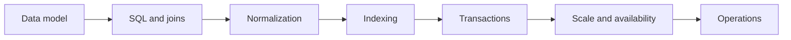

# Database Interview Guide

Database interview-এ SQL লিখতে পারার পাশাপাশি data model, consistency, concurrency, indexing এবং scale নিয়ে trade-off করতে হয়। এই guide একটি query কীভাবে execute হয় থেকে শুরু করে production database failure diagnose করা পর্যন্ত ধারাবাহিক learning path দেয়।

## Learning path

1. **Foundations:** [Basics](./fundamentals/basics/index.md), [Schema](./fundamentals/schema/index.md), [Keys](./fundamentals/keys/index.md), [Integrity](./fundamentals/integrity/index.md), [ACID](./fundamentals/acid-properties/index.md)
2. **Querying:** [SQL Basics](./sql/sql-basics/index.md), [Advanced Queries](./sql/advanced-queries/index.md), [Joins](./Joins/index.md)
3. **Design and performance:** [Normalization](./normalization/index.md), [Indexing](./Indexing/index.md), [Transactions](./transactions/index.md)
4. **Distributed data:** [NoSQL](./noSql/index.md), [Availability and Scalability](./availability-scalability/index.md)
5. **Production decisions:** [Architecture](./architecture-design-decisions/index.md), [Scenarios](./scenario-based-questions/index.md), [Troubleshooting](./troubleshooting-performance/index.md)

## What you should be able to explain

- একটি schema কোন invariants enforce করে এবং normalization কোথায় helpful
- Composite index-এর column order কেন গুরুত্বপূর্ণ
- Isolation level কোন anomaly প্রতিরোধ করে এবং তার cost কী
- Read replica, partitioning ও caching কোন bottleneck solve করে
- Slow query diagnose করতে execution plan ও runtime metrics কীভাবে ব্যবহার করবেন

একটি answer-এ workload assumptions স্পষ্ট করুন: read/write ratio, data volume, consistency requirement, latency target এবং failure tolerance না জানলে database choice অসম্পূর্ণ থাকে।
