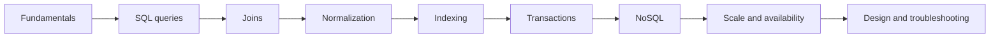

# 🚀 Complete Database Interview Questions Guide
*Master Database Interviews with 200+ Questions & Follow-ups*

## Chapters

- **Fundamentals:** [Basics](./fundamentals/basics/index.md), [ACID](./fundamentals/acid-properties/index.md), [Schema](./fundamentals/schema/index.md), [Keys](./fundamentals/keys/index.md), [Redundancy](./fundamentals/redundancy/index.md), [Integrity](./fundamentals/integrity/index.md), [Abstraction](./fundamentals/abstraction/index.md), [Independence](./fundamentals/independence/index.md), [Buffer Pool](./fundamentals/buffer-pool/index.md)
- **SQL:** [SQL Basics](./sql/sql-basics/index.md), [Advanced Queries](./sql/advanced-queries/index.md), [Functions and Operations](./sql/functions-operations/index.md)
- [Joins and Relationships](./Joins/index.md)
- [Normalization and Database Design](./normalization/index.md)
- [Indexing and Query Optimization](./Indexing/index.md)
- [Transactions and Concurrency](./transactions/index.md)
- **Views, procedures and triggers:** [Views](./views-procedures-triggers/views-materialized-views.md), [Stored Procedures and Functions](./views-procedures-triggers/stored-procedures-functions.md), [Triggers and Cursors](./views-procedures-triggers/triggers-cursors.md)
- [NoSQL Databases](./noSql/index.md)
- [Availability and Scalability](./availability-scalability/index.md)
- [Architecture and Design Decisions](./architecture-design-decisions/index.md)
- [Scenario-Based Design Questions](./scenario-based-questions/index.md)
- [Troubleshooting and Performance](./troubleshooting-performance/index.md)

## Suggested study order

Fundamentals ও SQL দিয়ে শুরু করুন, তারপর joins, normalization, indexing এবং transactions পড়ুন। NoSQL ও distributed availability শেষ করার পরে scenario/design questions দিয়ে trade-off reasoning practice করুন।
