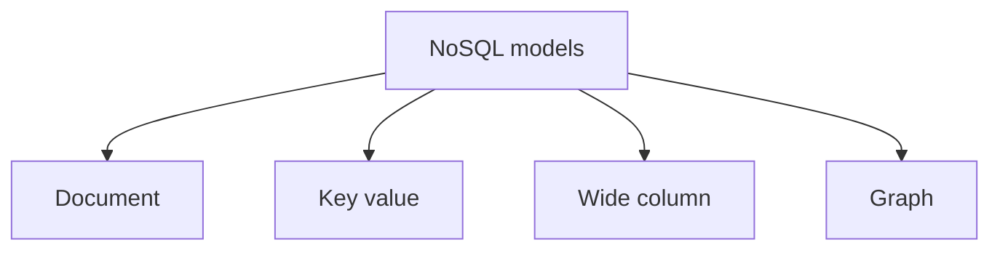

## 🌐 **8. NoSQL Databases**

## **79. What is NoSQL?**

**NoSQL** হলো ডাটাবেস ম্যানেজমেন্ট সিস্টেমের একটি আধুনিক পদ্ধতি, যা প্রথাগত (traditional) রিলেশনাল ডাটাবেস (RDBMS) এর মতো ডেটাকে টেবিল, রো (row), এবং কলামের ফিক্সড স্ট্রাকচারে সেভ করে না। এটি তৈরি করা হয়েছে বিপুল পরিমাণ আনস্ট্রাকচার্ড (Unstructured) বা সেমি-স্ট্রাকচার্ড (Semi-structured) ডেটা খুব দ্রুত এবং ফ্লেক্সিবল উপায়ে হ্যান্ডেল করার জন্য। 

সহজ কথায়, আপনি যখন জানেন না আপনার ডেটার স্ট্রাকচার কেমন হবে, অথবা প্রতিদিন আপনার ডেটার ভলিউম এমনভাবে বাড়ছে যা একটি সিঙ্গেল সার্ভারে রাখা সম্ভব নয়, তখন NoSQL ব্যবহার করা হয়।

**Technical definition:** NoSQL (often interpreted as "Not Only SQL") is a broad class of non-relational database management systems that do not rely on rigid schemas (like traditional SQL databases) and are specifically designed to be distributed, highly scalable, and capable of handling massive volumes of structured, semi-structured, and unstructured data.

### How does it differ from relational databases?

NoSQL এবং SQL এর মধ্যে বেশ কিছু মৌলিক পার্থক্য রয়েছে:

| Feature | SQL Databases (RDBMS) | NoSQL Databases |
|---------|-----------------------|-----------------|
| **Data Storage Model** | টেবিল-ভিত্তিক (Rows and Columns)। ডেটা রিলেশনাল মডেলে থাকে। | Document, Key-Value, Graph, বা Wide-column স্টোরেজ ব্যবহার করে। |
| **Schema** | Declared schema ও constraints সাধারণত write-এর সময় enforce হয় | Flexible record shape common; তবে validation/schema rule-ও enforce করা যায় |
| **Scaling Strategy** | Vertical ও horizontal—দুটিই সম্ভব; sharding complexity product-ভেদে ভিন্ন | অনেক product শুরু থেকেই partitioning/scale-out-এর জন্য designed |
| **Transactions/Consistency** | সাধারণত multi-row ACID transaction শক্তিশালী | Product-ভেদে single-record বা multi-record ACID, tunable/eventual consistency—সবই পাওয়া যায় |
| **Relationships/Joins** | Foreign key এবং JOIN first-class feature | সাধারণত embedding/application-side lookup; কিছু product join/lookup/traversal support করে |

### When should you choose NoSQL over SQL?

আপনার প্রজেক্টে NoSQL বেছে নেওয়া উচিত যখন নিচের পরিস্থিতিগুলো দেখা যায়:

* **১. বিশাল ডেটা ভলিউম (Huge Data Growth):** আপনার অ্যাপ্লিকেশন যদি প্রতিদিন টেরাবাইট স্তরের ডেটা জেনারেট করে (যেমন: সোশ্যাল মিডিয়া ফিড, আইওটি সেন্সরের ডেটা), তবে এটি হরিজন্টাল স্কেলিংয়ের মাধ্যমে সহজে হ্যান্ডেল করা যায়।
* **২. স্কিমাতে বারবার পরিবর্তন (Frequent Schema Changes):** যখন আপনার ডেটার কোনো ফিক্সড স্ট্রাকচার নেই (Agile development)। যেমন: ই-কমার্সে একেক প্রোডাক্টের একেক রকম বৈশিষ্ট্য (ক্যামেরার লেন্স সাইজ, কিন্তু শার্টের সাইজ) থাকতে পারে।
* **৩. উচ্চ পারফরম্যান্স ও স্পিড (High Performance):** રিয়েল-টাইম গেমিং, লাইভ চ্যাট, বা রিয়েল-টাইম এনালাইটিক্স যেখানে ফ্র্যাকশন-অফ-সেকেন্ডে রিড/রাইট রেসপন্স প্রয়োজন।
* **৪. ডিস্ট্রিবিউটেড আর্কিটেকচার (Distributed Architecture):** যখন আপনার সিস্টেমকে বিশ্বের বিভিন্ন প্রান্তের ডেটা সেন্টারে ডেটা ডিস্ট্রিবিউট করতে হয় এবং সিঙ্গেল পয়েন্ট অফ ফেইলিয়র (Single Point of Failure) এড়াতে হয়।

---

## **80. Types of NoSQL databases?**

NoSQL কোনো একক প্রযুক্তির নাম নয়; এটি একটি ছাতা-পরিভাষা (Umbrella term)। ডেটা স্টোর করার পদ্ধতির ওপর ভিত্তি করে NoSQL ডাটাবেসকে প্রধানত ৪টি শ্রেণিতে ভাগ করা যায়। 

### Give examples of each type (document, key-value, column-family, graph)?

#### **১. Document-oriented Database**
এখানে ডেটাকে JSON, BSON বা XML ফরমেটে "ডকুমেন্ট" হিসেবে সংরক্ষণ করা হয়। প্রতিটি ডকুমেন্ট স্বয়ংসম্পূর্ণ এবং এদের স্ট্রাকচার নিজেদের মতো আলাদা হতে পারে।
* **উদাহরণ:** MongoDB, CouchDB, Amazon DocumentDB.

#### **২. Key-Value Store**
এটি সবচেয়ে সরল NoSQL মডেল। এখানে ডেটাকে একটি ডিকশনারির (Dictionary) মতো রাখা হয়, যেখানে একটি ইউনিক `Key` এর বিপরীতে একটি `Value` থাকে। ভ্যালুটি সাধারণ টেক্সট থেকে শুরু করে একটি আস্ত অবজেক্ট বা JSON হতে পারে।
* **উদাহরণ:** Redis, Amazon DynamoDB, Memcached, Riak.

#### **৩. Column-family Store (Wide-column)**
এটি ডেটাকে সারি (Row) এর বদলে কলাম (Column) হিসেবে গ্রুপ করে রাখে। এটি বিশাল পরিমাণ ডেটার ওপর দ্রুত রাইট (Write) অপারেশন করতে খুব পারদর্শী।
* **উদাহরণ:** Apache Cassandra, HBase, ScyllaDB.

#### **৪. Graph Database**
গ্রাফ ডাটাবেস ডেটার চেয়েও ডেটার মধ্যকার সম্পর্ক (Relationship) এর ওপর বেশি জোর দেয়। এখানে ডেটাকে "Node" এবং সম্পর্ককে "Edge" হিসেবে প্রকাশ করা হয়।
* **উদাহরণ:** Neo4j, Amazon Neptune, ArangoDB.

### Which type fits which use case?

কোন প্রজেক্টে কোন টাইপ ব্যবহার করবেন তা নির্ভর করে ইউজ কেসের ওপর:

| Database Type | Perfect For (Use Cases) | Real-world Example |
|---------------|-------------------------|--------------------|
| **Document** | Content Management Systems (CMS), E-commerce Catalogs, User Profiles, Blogging platforms | প্রোফাইল ডাটা যেখানে ইউজারের সোশ্যাল লিংক, এড্রেস সব এক জায়গায় JSON ফর্মেটের মতো রাখতে হয়। |
| **Key-Value** | Session Management, User Preferences, Shopping Carts, In-memory Caching | ইউজার লগইন করার পর সেশন আইডি দিয়ে দ্রুত তার ডিটেলস আনা (ক্যাশিং)। |
| **Column-family** | Time-series data, Event logs, IoT Sensor Data, Fraud detection | একটি ওয়েবসাইটের লাখ লাখ ইউজারের ক্লিক স্ট্রিম (Click-stream) হিস্ট্রি একসাথে জমিয়ে রাখা। |
| **Graph** | Social Networks (Friends connection), Recommendation Engines, Fraud Rings | "কে কাকে চেনে" বা "যিনি এই ল্যাপটপ কিনেছেন, তিনি আর কি কি মাউস কিনেছেন"—এ ধরনের ডিপ রিলেশন বের করা। |

---

## **81. What is a key-value store?**

**Key-value store** হলো NoSQL ডাটাবেসের সবচেয়ে সরল এবং ফাস্টেস্ট টাইপ। এটি মূলত একটি বিশাল হ্যাশ টেবিল (Hash Table) বা ডিকশনারি (Dictionary) হিসেবে কাজ করে। প্রতিটি রেকর্ড একটি ইউনিক **Key** (যেমন আইডি বা নাম) এবং তার সাথে সম্পর্কিত একটি **Value** দিয়ে গঠিত হয়।

Pure key-value model-এ value সাধারণত opaque এবং primary access key দিয়ে হয়। তবে Redis-এর hashes/search module বা DynamoDB secondary index-এর মতো product-specific feature থাকায় capability যাচাই করে সিদ্ধান্ত নিতে হয়।

**Technical definition:** A Key-Value store is a simple database model designed for storing, retrieving, and managing associative arrays where each record is securely identified by a unique key. It optimizes specifically for highly concurrent and extremely fast read/write operations by retrieving data directly via primary keys.

### Examples like Redis, DynamoDB?

* **Redis (Remote Dictionary Server):** এটি একটি অত্যন্ত জনপ্রিয় ইন-মেমরি (In-memory) কী-ভ্যালু স্টোর। মেমরিতে ডেটা রাখার কারণে এটি সাধারণ ডাটাবেসের তুলনায় গুণগতভাবে অনেক ফাস্ট (মিলিসেকেন্ডের চেয়েও কম সময়ে রেসপন্স দেয়)। এটি মূলত Caching, Session store, এবং Rate limiting এর জন্য ব্যবহৃত হয়।
  
* **Amazon DynamoDB:** এটি AWS এর একটি ফুল্লি-ম্যানেজড (Fully managed) সার্ভারলেস ডাটাবেস। যদিও এটি ডকুমেন্টের মতো কাজ করতে পারে, এর কোর আর্কিটেকচার একটি হাইপাস-স্কেলড কী-ভ্যালু স্টোর। গেমিং লেডারবোর্ড বা শপিং কার্টের মতো হাই-ট্রাফিক সিস্টেমে এটি দারুণ কাজ করে।

### What are the limitations?

কী-ভ্যালু স্টোরের বেশ কিছু বড় সীমাবদ্ধতা আছে:

**১. Complex Queries করা যায় না:**
আপনি শুধু Key দিয়ে ডেটা খুঁজতে পারবেন। আপনি যদি বলেন, "ওইসব ইউজারদের দাও যাদের বয়স ২৫ এর বেশি"—কী-ভ্যালু স্টোর তা পারবে না, কারণ সে ভ্যালুর ভেতরের অংশ পড়ে ফিল্টার করতে পারে না।

**২. No Relationships (No Joins):**
দুটি ভিন্ন ডেটার মধ্যে কোনো ফরেন-কী (Foreign Key) বা রিলেশনশিপ মেইনটেইন করা যায়বিধা নেই। জয়েনিং এর কাজ অ্যাপ্লিকেশন লেভেলে (Backend code) ম্যানুয়ালি করতে হয়।

**৩. Partial Updates কঠিন:**
সাধারণত পুরো ভ্যালুটাকে মেমরিতে এনে পরিবর্তন করে আবার পুরোটাকে রিপ্লেস করতে হয় (Update the whole object)। যদিও Redis-এর মতো কিছু স্টোর পার্শিয়াল আপডেট সাপোর্ট করে, কিন্তু রিলাশনাল ডাটাবেসের মতো সহজ নয়।

---

## **82. What is a document database?**

**Document database** হলো এমন এক ধরণের NoSQL ডাটাবেস, যা ডেটাকে টেবিলের বদলে JSON (বা BSON/XML) এর মতো "ডকুমেন্ট" আকারে সেভ করে। এখানে প্রতিটি ডকুমেন্ট একটি স্বয়ংসম্পূর্ণ রেকর্ড হিসেবে কাজ করে, যার ভেতরে অন্যান্য সাব-ডকুমেন্ট বা অ্যারে (Array) থাকতে পারে। 

সহজ কথায়, অ্যাপ্লিকেশন কোডে (যেমন JavaScript এ Object বা Python এ Dictionary) ডেটা যেভাবে হ্যান্ডেল করা হয়, ডাটাবেসে অবিকল সেভাবেই ডেটা সেভ হয়।

**Technical definition:** A document-oriented database is a computer program and data storage system designed for storing, retrieving, and managing document-oriented information directly aligning with object-oriented programming methodologies, typically using JSON-like formats.

### Why is MongoDB considered schema-less?

**MongoDB**-কে schema-flexible বলা বেশি নির্ভুল: collection-এর document shape এক হতে বাধ্য নয়, কিন্তু application schema এবং MongoDB JSON Schema validation দিয়ে required field/type enforce করা যায়।

**উদাহরণস্বরূপ:**
ধরা যাক একটি `users` কালেকশনে আপনি নিচের দুটি ভিন্ন স্ট্রাকচারের ডকুমেন্ট রাখতে পারবেন কোনো এরর ছাড়াই:

```javascript
// User 1 (Minimal data)
{
  "_id": ObjectId("64a1b2c3d4..."),
  "name": "করিম",
  "email": "karim@email.com"
}

// User 2 (Complex data in the same collection)
{
  "_id": ObjectId("64a1b2c3d5..."),
  "name": "রহিম",
  "phone": "017XXXXXXX",
  "blood_group": "O+",
  "address": {
      "city": "Dhaka", 
      "zip": "1000"
  },
  "hobbies": ["Cricket", "Reading"]
}
```
এখানে প্রথম ডকুমেন্টে এড্রেস বা হবি নেই, এবং এর জন্য কোনো `NULL` কলামও তৈরি হয়নি। যখন যেভাবে খুশি নতুন ফিল্ড এড করা যায়। 

### How do you handle relationships in document stores?

ডকুমেন্ট ডাটাবেসে জয়েন (JOIN) করা খুব এক্সপেন্সিভ বা সব সময় সাপোর্ট করে না। তাই রিলেশনশিপ মেইনটেইন করতে সাধারণত দুটি প্যাটার্ন ফলো করা হয়:

#### **১. Embedding (Denormalization - "One-to-Few"):** 
যখন একটি এন্টিটির সাথে সম্পর্কিত ডেটা খুব বেশি বড় হয় না, তখন রিলেটেড ডেটাকে মূল ডকুমেন্টের ভেতরেই (Embedded array বা sub-document হিসেবে) ঢুকিয়ে দেওয়া হয়। 
* **উদাহরণ:** একটি ব্লগের পোস্ট এবং তার ১০-২০টি কমেন্ট।
```javascript
{
  "_id": 101,
  "title": "NoSQL Guide",
  "content": "Deep dive into NoSQL...",
  "comments": [
      {"user": "আলী", "text": "খুব সুন্দর পোস্ট!"},
      {"user": "রানা", "text": "ধন্যবাদ।"}
  ]
}
```
* **সুবিধা:** একটিমাত্র ডাটাবেস কুয়েরিতেই পোস্ট এবং কমেন্ট সব একসাথে লোড হয়ে যায় (দ্রুত Read)।

#### **২. Referencing (Normalization - "One-to-Many" or "Many-to-Many"):** 
যখন রিলেটেড ডেটা অনেক বড় হতে পারে বা বারবার পরিবর্তন হয়, তখন ডেটাকে আলাদা কালেকশনে রাখা হয় এবং শুধুমাত্র তার `_id` (রেফারেন্স) সেভ করে রাখা হয় (Foreign Key এর মতো)।
* **উদাহরণ:** একটি পাবলিশার এবং তার হাজার হাজার বই।
```javascript
// Publisher Document
{ 
  "_id": "pub_1", 
  "name": "Tech Books BD" 
}

// Books Document
{ 
  "_id": "book_1", 
  "title": "Learn MongoDB", 
  "publisher_id": "pub_1"  // Reference
}
```
* **সুবিধা:** ডেটা ডুপ্লিকেশন হয় না এবং লার্জ স্কেল ডেটা হ্যান্ডেল করা সহজ হয়। (MongoDB তে এগুলো জোড়া লাগানোর জন্য `$lookup` এগ্রিগেশন ব্যবহার করা হয়)।

---

## **83. What is a column-family database?**

**Wide-column/column-family database** row key, partition এবং column family-কেন্দ্রিক sparse data model ব্যবহার করে। এটি analytical columnar database-এর সমার্থক নয়। Cassandra/HBase-এর physical layout আলাদা হলেও query আগে থেকে access pattern ও partition key ধরে design করা হয়।

**Technical definition:** A wide-column store (or column-family database) is a two-dimensional key-value store where rows and columns form the keys, and the resulting multi-dimensional map is partitioned across multiple nodes for extreme scalability and write-throughput.

### How is Cassandra different from traditional RDBMS?

Apache Cassandra একটি বিখ্যাত কলাম ফ্যামিলি ডাটাবেস। RDBMS এর সাথে এর বিশাল পার্থক্য রয়েছে:

| Feature | Traditional RDBMS (e.g., MySQL) | Apache Cassandra |
|---------|--------------------------------|------------------|
| **Architecture** | Primary/replica, shared storage বা distributed—product/configuration অনুযায়ী | Cassandra-তে peer-to-peer; অন্য NoSQL product-এ primary/replica-ও common |
| **Storage Engine** | B-Tree (ভালো Read পারফরম্যান্স এর জন্য)। | **LSM-Tree** (Log-Structured Merge-Tree)। এটি মূলত বিশাল পরিমাণ Write অপারেশনের জন্য অপ্টিমাইজড। |
| **Scaling** | Scale-up ও scale-out দুটোই সম্ভব; distributed SQL/sharding operational complexity বাড়ায় | Scale-out common, কিন্তু coordination, replication ও hot partition-এর কারণে scaling পুরোপুরি linear নয় |
| **Querying** | Complex `JOIN`, `GROUP BY`, `ORDER BY` সাপোর্ট করে | Cassandra query partition key-কেন্দ্রিক; অন্য NoSQL model-এর query capability আলাদা |
| **Flexibility** | Rigid Schema। সব রো-তে সমান কলাম থাকতে হবে। | Flexible। প্রতিটি রো-তে আলাদা সংখ্যক কলাম থাকতে পারে। |

### What is wide column store?

একটি **Wide column store** হলো এমন একটি ডাটাবেস টেবিল যেখানে একটি নির্দিষ্ট রো (Row) এর আন্ডারে কয়েক ডজন থেকে শুরু করে কয়েক মিলিয়ন (Million) পর্যন্ত ডাইনামিক কলাম থাকতে পারে। 

সাধারণ রিলেশনাল ডাটাবেসে আপনি যদি ১০০০টি কলাম বানান এবং অনেক রো তে সেগুলো ফাঁকা (NULL) থাকে, তবে তা প্রচুর স্টোরেজ স্পেস নষ্ট করে। কিন্তু Wide Column Store এ, **যে কলামে ডেটা নেই, তার কোনো অস্তিত্বই নেই** (Sparse Data)।

**উদাহরণ:** একটি ইভেন্ট ট্র্যাকিং সিস্টেমে "ইউজার ১" এর রো-তে আজকের ডেটে ১০০টি পেজভিজিট কলাম থাকতে পারে, আবার "ইউজার ২" এর রো-তে মাত্র ২টি কলাম থাকতে পারে। Cassandra বা HBase এগুলোকে অত্যন্ত নিখুঁতভাবে এবং কম স্পেসে ম্যানেজ করতে পারে।

---

## **84. What is a graph database?**

**Graph Database** হলো এমন এক বিশেষ ডাটাবেস যা ডেটার চেয়েও **ডেটার ভেতরের সম্পর্ক (Relationships)** এর ওপর সবচেয়ে বেশি জোর দেয়। সাধারণ ডাটাবেস যেখানে ফরেন-কি এবং জয়েন (Join) ব্যবহার করে সম্পর্ক খোঁজে, গ্রাফ ডাটাবেস সেখানে সম্পর্কগুলোকে ফার্স্ট-ক্লাস সিটিজেন (First-class citizen) হিসেবে ফিজিক্যালি সেভ করে রাখে।

এটি ডেটাকে নোড (**Nodes** - যেমন: একজন মানুষ বা একটি প্রোডাক্ট) এবং সেই নোডগুলোর মধ্যকার সম্পর্ককে এজ (**Edges** - যেমন: "বন্ধুত্ব" বা "কিনেছে") হিসেবে সংরক্ষণ করে। 

**Technical definition:** A graph database is a type of NoSQL database that utilizes graph mathematical structures equipped with nodes, edges, and properties to represent and store highly interconnected data. It heavily optimizes relationship traversals (graph hops) without expensive index lookups or table joins.

### Examples like Neo4j, Amazon Neptune?

* **Neo4j:** এটি বর্তমান বিশ্বের সবচেয়ে জনপ্রিয় এবং বহুল ব্যবহৃত গ্রাফ ডাটাবেস। এতে ডেটা কোয়ারি করার জন্য **Cypher** নামক অত্যন্ত শক্তিশালী এবং সহজে বোঝা যায় এমন একটি ল্যাঙ্গুয়েজ ব্যবহার করা হয়।
* **Amazon Neptune:** এটি AWS এর ক্লাউড নেটিভ গ্রাফ ডাটাবেস। এটি Apache TinkerPop (Gremlin) এবং W3C এর RDF/SPARQL সমর্থন করে। এটি মূলত এন্টারপ্রাইজ স্কেলে নলেজ গ্রাফ বা রেকমেন্ডেশন ইঞ্জিন বানাতে ব্যবহৃত হয়।

### What kind of queries are efficient in graph DBs?

গ্রাফ ডাটাবেস সেই সব কুয়েরির ক্ষেত্রে ম্যাজিকের মতো কাজ করে, যেখানে রিলেশনাল ডাটাবেস একাধিক জটিল `JOIN` করতে গিয়ে স্লো হয়ে যায়। এগুলোকে **Deep Traversal** বলা হয়।

**১. প্যাটার্ন ম্যাচিং ও রেকমেন্ডেশন (Recommendation Engines):**
* *"রহিম যে ফোনটি কিনেছে, সেই একই ফোন আর যারা কিনেছে, তারা ফোনের সাথে কী কী এক্সেসরিজ কিনেছে?"* 
* (এটি ই-কমার্সে People who bought this also bought... ফিচার তৈরিতে কাজে লাগে)।

**২. সোশ্যাল নেটওয়ার্কিং (Social Networks):**
* *"আপনার বন্ধুদের মধ্যে কে কে আবার আপনার আরেক বন্ধুর সাথে মিউচুয়াল ফ্রেন্ড?"* (Friend of a Friend বা FoF query)।
* LinkedIn বা Facebook এই ধরণের গ্রাফ মডেল ব্যবহার করেই ফ্রেন্ড সাজেশন দেয়।

**৩. ফ্রড ডিটেকশন (Fraud Detection):**
* ব্যাংকগুলো গ্রাফ ডাটাবেস ব্যবহার করে দেখে যে—একটি ক্রেডিট কার্ড, যা থেকে স্ক্যাম হয়েছে, সেটি অন্য কোন কোন অ্যাকাউন্ট, আইপি এড্রেস বা ফোন নাম্বারের সাথে সংযুক্ত।

---

## **85. What is CAP theorem?**

**CAP Theorem** (যা Brewer's Theorem নামে পরিচিত) হলো ডিস্ট্রিবিউটেড ডাটাবেস (Distributed Database) সিস্টেমের একটি মৌলিক এবং অত্যন্ত গুরুত্বপূর্ণ থিওরিম। 

CAP theorem বলে network partition ঘটলে distributed system একই operation-এর জন্য strong consistency এবং availability—দুটিই একসাথে guarantee করতে পারে না। “সবসময় যেকোনো দুটি বেছে নিন” বলা অসম্পূর্ণ, কারণ partition না থাকলে C ও A দুটোই পাওয়া সম্ভব এবং P বাস্তব network-এ design concern হিসেবেই থাকে।

**CAP তিনটি শব্দের সংক্ষিপ্ত রূপ:**
* **C - Consistency (ধারাবাহিকতা/সঠিকতা):** ডাটাবেসের যেকোনো নোড বা সার্ভারে ইউজারের করা লেটেস্ট আপডেটটি সাথে সাথেই পাওয়া যাবে। অর্থাৎ, সবগুলো সার্ভার সবসময় একই ডেটা দেখাবে।
* **A - Availability (প্রাপ্যতা):** ডাটাবেস সবসময় এক্টিভ থাকবে। ইউজার ডাটাবেসে রিকোয়েস্ট পাঠালে সে সবসময় একটি রেসপন্স (Failure মেসেজ নয়) পাবে, ডাটা লেটেস্ট হোক বা একটু পুরোনো হোক।
* **P - Partition Tolerance (বিভাজন সহনশীলতা):** দুটি নোড বা সার্ভারের মধ্যে নেটওয়ার্ক সংযোগ বিচ্ছিন্ন (Network Partition বা Communication drop) হয়ে গেলেও পুরো ডাটাবেস সিস্টেম কাজ করা বন্ধ করবে না।

### How do NoSQL databases handle the trade-offs?

যেহেতু ডিস্ট্রিবিউটেড সিস্টেমে নেটওয়ার্ক তার ছিঁড়ে যাওয়া বা রাউটার নষ্ট হওয়া (Partition) অত্যন্ত সাধারণ একটি ঘটনা, তাই **"P" (Partition Tolerance)** কে বাদ দেয়ার কোনো সুযোগ নেই। সিস্টেমকে "P" রাখতেই হয়।

এরপর ডাটাবেসকে বাধ্য হয়ে সিদ্ধান্ত নিতে হয় নেটওয়ার্ক ফেইল করলে তারা কী করবে—তারা কি **Consistency (C)** ধরে রাখবে নাকি **Availability (A)** ধরে রাখবে?

* **যদি Consistency (C) বেছে নেয়:** নেটওয়ার্ক সংযোগ বিচ্ছিন্ন থাকা অবস্থায়, ডেটার অমিল এড়াতে সিস্টেম আপডেট নেয়া বন্ধ করে দেবে। ইউজার এরর মেসেজ পাবে (Unavailable)।
* **যদি Availability (A) বেছে নেয়:** নেটওয়ার্ক সংযোগ বিচ্ছিন্ন থাকা অবস্থায়ও সিস্টেম রেসপন্স করবে। কিন্তু সমস্যা হলো, ইউজার হয়তো পুরোনো ডেটা (Inconsistent data) দেখতে পারে।

### Examples of CP, AP, and CA systems?

* **CP Systems (Consistency & Partition Tolerance):** 
  * *উদাহরণ:* MongoDB, HBase, Redis (Cluster)।
  * *কাজ:* নেটওয়ার্ক পার্টিশন হলে, এই সিস্টেমগুলো অমিল এড়ানোর জন্য মাইনরিটি নোডগুলোকে শাটডাউন বা রিড-অনলি মোডে নিয়ে যায়, যতক্ষণ না আবার সঠিক ডেটা সিঙ্ক করা যায়। অর্থাৎ এরা ভুল ডেটা দেয়ার চেয়ে সিস্টেমকে Unavailable রাখা শ্রেয় মনে করে।

* **AP Systems (Availability & Partition Tolerance):** 
  * *উদাহরণ:* Apache Cassandra, CouchDB, DynamoDB (Default)।
  * *কাজ:* এরা সবসময় রেসপন্স করবে সিস্টেম যাই ঘটুক না কেন। নেটওয়ার্ক বিভাজনের সময় একটি নোড হয়তো পুরোনো ডেটা দিতে পারে, কিন্তু কাজ কখনো বন্ধ হবে না। (High Availability)।

* **CA Systems (Consistency & Availability):** 
  * *উদাহরণ:* Traditional RDBMS (MySQL, Oracle) যখন সিঙ্গেল সার্ভারে রান করে।
  * *কাজ:* এরা ডিস্ট্রিবিউটেড সিস্টেম নয়, তাই পার্টিশন হওয়ার প্রশ্ন নেই। তবে ক্লাস্টারিং করলে এরা সাধারণত CP তে পরিণত হয়।

---

## **86. What is BASE property in NoSQL?**

রিলেশনাল ডাটাবেস (RDBMS) যেখানে ডেটার নিখুঁত গ্যারান্টির জন্য **ACID** (Atomicity, Consistency, Isolation, Durability) প্রপার্টি মেনে চলে, অনেক ডিস্ট্রিবিউটেড NoSQL ডাটাবেস সেখানে পারফরম্যান্স এবং স্কেলিং এর সুবিধার্থে **BASE** প্রপার্টি ফলো করে। 

BASE মডেলটি Strict Consistency (কঠোর সঠিকতা) এর ওপর ছাড় দিয়ে Availability (প্রাপ্যতা) এর ওপর বেশি জোর দেয়।

**B.A. - Basically Available:**
সিস্টেম সবসময় এভেইল্যাবল থাকবে। ডাটাবেসের মধ্যে যদি কোনো একটি বা কয়েকটি সার্ভার ক্র্যাশও করে, পুরো সিস্টেম ডাউন হবে না। ইউজার সবসময় কোনো না কোনো একটি রেসপন্স পাবেই।

**S - Soft State:**
যেহেতু Strict Consistency নেই, তাই সিস্টেমের সামগ্রিক স্টেট (State) স্থির থাকে না। বাইরে থেকে কোনো নতুন ডেটা ইনপুট না দিলেও ব্যাকগ্রাউন্ডে নোডগুলো নিজেদের মধ্যে ডেটা সিঙ্ক্রোনাইজেশনের কাজ চালাতে থাকে, যার ফলে সময়ের সাথে ডেটার ভিউ পরিবর্তন হতে পারে।

**E - Eventual Consistency:**
এটি গ্যারান্টি দেয় যে, সাময়িকভাবে ডেটায় অমিল থাকলেও, শেষ পর্যন্ত (Eventually) সবগুলো সার্ভারে ডেটা আপডেট হয়ে যাবে এবং ডাটাবেস কনসিস্টেন্ট হবে।

### Compare BASE with ACID?

| Feature | ACID Properties (SQL) | BASE Properties (NoSQL) |
|---------|-----------------------|-------------------------|
| **Core Philosophy** | Data Integrity above all (সঠিকতা সবার আগে)। | High Availability and Scale (সার্ভিস চালু রাখা সবার আগে)। |
| **Consistency** | **Strong Consistency**। ট্রানজেকশন শেষ হওয়া মাত্রই সবাই নতুন ডেটা দেখবে। | **Eventual Consistency**। কিছু সময় পর সবাই নতুন ডেটা দেখবে। |
| **Locking Mechanism** | ডেটা এডিট করার সময় পেসিমিস্টিক বা অপটিমিস্টিক লক করে যাতে অন্যরা এডিট করতে না পারে। | সাধারণত কোনো লকিং থাকে না (Optimistic / Conflict resolution)। |
| **Primary Focus** | ফিন্যান্সিয়াল বা ব্যাংকিং সিস্টেম, যেখানে ১ টাকার হিসাবেও ভুল হওয়া যাবে না। | সোশ্যাল মিডিয়া, ক্যাশিং, লগিং, যেখানে ১-২ সেকেন্ড লেটে ডেটা দেখালেও সমস্যা নেই। |

### What is "basically available"?

**Basically Available** মানে হলো ডিস্ট্রিবিউটেড সিস্টেমটি আংশিক ফেইলিয়রের সময়ও (Partial Failures) কাজ চালিয়ে যাওয়ার গ্যারান্টি দেয়। 

ধরুন, একটি ক্লাস্টারে ৫টি ডাটাবেস নোড আছে। আপনি একটি ডেটা খুঁজছেন যা ৩ নম্বর নোডে আছে, কিন্তু ৩ নম্বর নোডটি হঠাৎ ডাউন হয়ে গেল। এ অবস্থায় "Basically Available" সিস্টেম আপনাকে পুরো ডাটাবেস ডাউন না দেখিয়ে, অন্যান্য নোড থেকে ক্যাশ করা বা রেপ্লিকা (Replica) করা ডেটা দেখানোর চেষ্টা করবে। এটি "১০০% গ্যারান্টিযুক্ত" নয়, তবে সিস্টেমটি কাজ করার সর্বোচ্চ চেষ্টা করে।

---

## **87. What is eventual consistency?**

**Eventual Consistency** হলো ডিস্ট্রিবিউটেড কম্পিউটিং এর একটি ডেটা কনসিস্টেন্সি মডেল। এটি নিশ্চিত করে যে যদি কোনো ডেটা আইটেমে নতুন করে কোনো আপডেট না আসে, তবে "চূড়ান্ত পর্যায়ে" (Eventually) ডাটাবেসের সবগুলো কপিতে (Nodes) এই একই ডেটা আপডেট হয়ে যাবে এবং সব নোড অভিন্ন ডেটা প্রদান করবে।

সহজ কথায়, আপনি যখন আপনার প্রোফাইলের ছবি আপডেট করে সেভ করেন, সেই ডেটা প্রথমে হয়তো সিঙ্গাপুরের ডাটাবেস নোডে আপডেট হলো। ঠিক ওই সেকেন্ডেই যদি কেউ আমেরিকার সার্ভার থেকে আপনার ছবি দেখে, সে হয়তো আগের ছবিটিই দেখতে পাবে। কিন্তু ডাটাবেস ব্যাকগ্রাউন্ডে খুব দ্রুত সিঙ্গাপুরের ডেটা আমেরিকার সার্ভারে পাঠিয়ে দেবে। কিছু সময় পর আমেরিকার নোডটিও আপডেট হয়ে যাবে। এই সাময়িক অমিল (Delay) মেনে নেয়াটাই হলো Eventual Consistency।

### Which NoSQL databases use this model?

অনেক বিখ্যাত NoSQL ডাটাবেস এই মডেল ব্যবহার করে, কারণ এটি পারফরম্যান্স অনেক বাড়িয়ে দেয়:
* **Apache Cassandra:** (এটি AP সিস্টেম, Eventual Consistency এর একটি দারুণ উদাহরণ)।
* **Amazon DynamoDB:** (এটি ডিফল্ট হিসেবে Eventual Consistency ব্যবহার করে, তবে চাইলে Strong Consistency এনেবল করা যায়)।
* **CouchDB**
* **Riak**

### How long does "eventually" take?

"Eventually" হতে ঠিক কতক্ষণ লাগবে তার কোনো ফিক্সড টাইমফ্রেম নেই। এটি সম্পূর্ণভাবে নিচের বিষয়গুলোর ওপর নির্ভর করে:
1. **Network Latency:** সার্ভারগুলোর মধ্যকার ভৌগোলিক দূরত্ব এবং ইন্টারনেটের স্পিড।
2. **Server Load:** ডাটাবেস প্রসেসরের কাজের চাপ।
3. **Replication Configuration:** ডাটাবেস ইঞ্জিন কীভাবে কনফিগার করা হয়েছে।

তবে আধুনিক সিস্টেমে, সাধারণত এটি কয়েক **মিলি-সেকেন্ড (Milli-seconds)** এর মধ্যেই হয়ে যায়। বড়জোর কয়েক সেকেন্ড লাগতে পারে। 

**বাস্তব উদাহরণ:** 
ইউটিউবে কোনো ভিডিওতে আপনি কমেন্ট করলে আপনি সাথে সাথেই দেখতে পান, কিন্তু অন্য ডিভাইস বা ব্রাউজার থেকে রিফ্রেশ করলে কমেন্টটি আসতে একটু সময় লাগে। কারণ সেই কমেন্টটি পৃথিবীর সবগুলো সার্ভারে সিঙ্ক্রোনাইজ হতে একটু "সময়" (Eventually) নিচ্ছে।

---

## **88. What is sharding in NoSQL?**

**Sharding** হলো ডেটাবেস স্কেলিংয়ের একটি আর্কিটেকচারাল কনসেপ্ট (যা Horizontal Partitioning নামেও পরিচিত), যেখানে একটি বিশাল ডেটাসেটকে ছোট ছোট অনেকগুলো টুকরোতে ভাগ করা হয়। এই ছোট টুকরোগুলোকে **Shard** বলা হয়। 

এরপর এই Shard গুলোকে একটি সিঙ্গেল সার্ভারে না রেখে, একাধিক সার্ভারের (Nodes) হার্ডডিস্কে ছড়িয়ে বা ডিস্ট্রিবিউট করে রাখা হয়। এর ফলে ডেটা স্টোর করার ক্ষমতা এবং কুয়েরি প্রোসেসিং ক্ষমতা রৈখিকভাবে (Linearly) বাড়তে থাকে।

**Technical definition:** Sharding is a database architecture pattern related to horizontal partitioning that separates one very large global database into smaller, faster, more easily managed functional units (shards), each residing on a separate physical server instance to distribute load.

### How does MongoDB implement auto-sharding?

MongoDB তে Sharding প্রসেসটি স্বয়ংক্রিয় বা **Auto-sharding**। ম্যানুয়াল শার্ডিং এর বিপরীতে, ডেটাবেস নিজেই ঠিক করে রিয়েল টাইমে কোন ডেটা কোন সার্ভারে (Shard) যাবে, এবং সে নিজেই ডেটা ব্যালেন্স করে। এটি ৩টি মূল উপাদানের সাহায্যে কাজ করে:

1. **Shards (Data Nodes):** যেখানে আসল ডেটাগুলো টুকরো টুকরো হয়ে জমা থাকে (এগুলো সাধারণত নিজেদের মধ্যে রেপ্লিকা সেট হিসেবে থাকে)।
2. **Config Servers:** এগুলো ডাটাবেসের "ম্যাপ" বা রুলস ধরে রাখে। কোন ডেটা বা எந்த Shard এ আছে, তার ডিরেক্টরি এখানে থাকে।
3. **Mongos (Query Router):** এটি ট্রাফিক পুলিশের মতো কাজ করে। ক্লায়েন্ট বা অ্যাপ্লিকেশন সরাসরি Shard এ নক করে না, নক করে Mongos এ। 

**কীভাবে কাজ করে?**
* ক্লায়েন্ট একটি কুয়েরি (যেমন: "ইউজার আইডি ৫ খুঁজছি") `mongos` এ পাঠায়।
* `mongos` কনফিগ সার্ভারের কাছে ম্যাপ জানতে চায় (আইডি ৫ কোন সার্ভারে আছে?)।
* কনফিগ সার্ভার বলে দেয় "এটি Shard 2 এ আছে"। 
* `mongos` তখন Shard 2 থেকে ডাটা এনে ক্লায়েন্টকে ফেরত দেয়। যদি কোনো Shard এ ডাটা অতিরিক্ত হয়ে যায়, তবে 백গ্রাউন্ডে MongoDB এর ব্যালেন্সার (Balancer) ডেটার "Chunk" গুলো অন্য খালি Shard এ পাঠিয়ে লোড ব্যালেন্স করে।

### What is shard key selection strategy?

**Shard Key** হলো সেই ফিল্ড বা কলাম যার ওপর ভিত্তি করে ডাটাবেস ঠিক করে ডেটাকে কীভাবে টুকরো করা হবে। একটি ভুল Shard Key পুরো ক্লাস্টারের পারফরম্যান্স ধ্বংস করে দিতে পারে (যাকে Hotspotting বলে)। সঠিক Shard Key বাছাই করার মূলত ৩টি স্ট্র্যাটেজি আছে:

1. **Hashed Sharding:** 
Shard Key এর ভ্যালুকে হ্যাশ (Hash ফাংশন) করে তারপর ডেটা ডিস্ট্রিবিউট করা হয়। 
* *সুবিধা:* এটি ডেটাকে সবগুলো সার্ভারে একদম সমানভাবে ভাগ করে দেয় (Even distribution)। 
* *অসুবিধা:* Range query (যেমন "ID ১ থেকে ১০০ ডাটা দাও") খুব স্লো হয়, কারণ ডাটা সব সার্ভারে ছড়ানো থাকে।

2. **Ranged Sharding:** 
Shard Key এর ভ্যালুর রেঞ্জ অনুযায়ী ডেটা ভাগ হয়। (যেমন A-M নামের মানুষ Shard 1 এ, N-Z নামের মানুষ Shard 2 এ)।
* *সুবিধা:* shard key-এর range-কেন্দ্রিক query efficient হতে পারে। তবে monotonic key hot shard তৈরি করতে পারে, তাই “সবচেয়ে fast” universally সত্য নয়।
* *অসুবিধা:* ডেটা আন-ইভেনলি ডিস্ট্রিবিউট হতে পারে। (ধরি A-M নামের মানুষ বেশি, তখন Shard 1 এ ওভারলোড হয়ে যাবে)।

3. **Choosing the Right Key (মৌলিক নিয়ম):** 
Shard key এমন হওয়া উচিত যার প্রচুর আলাদা আলাদা ভ্যালু আছে (**High cardinality**) এবং ডেটাবেসের বেশিরভাগ কুয়েরিতেই ফিল্টার হিসেবে ঐ Key ব্যবহৃত হয়।

---

## **89. What is replication in NoSQL?**

**Replication** হলো ডেটাবেসের একই ডেটাকে হুবহু একাধিক সার্ভারে (Nodes) কপি (Copy) বা ক্লোন করে রাখার একটি প্রক্রিয়া। 

Sharding এর মূল উদ্দেশ্য হলো "স্কেলিং বা ক্যাপাসিটি বাড়ানো", অন্যদিকে Replication এর মূল উদ্দেশ্য হলো **High Availability (প্রাপ্যতা)** এবং **Fault Tolerance (ক্র্যাশ সামলানোর ক্ষমতা)** নিশ্চিত করা। যদি কোনো কারণে আপনার মেইন সার্ভার পুড়ে যায় বা হার্ডডিস্ক ক্র্যাশ করে, তবে অন্য সার্ভারে থাকা কপি থেকে মুহূর্তেই ডেটা রিকভার বা এক্সেস করা সম্ভব হয়।

### Difference between master-slave and master-master?

ডাটাবেস নোড গুলোর মধ্যে ডেটা কীভাবে ছড়াবে, তার ওপর ভিত্তি করে রেপ্লিকেশনকে প্রধানত দুটি ভাগে ভাগ করা যায়:

| Feature | Master-Slave (Primary-Secondary) | Master-Master (Peer-to-Peer / Multi-Leader) |
|---------|----------------------------------|---------------------------------------------|
| **Write Operations** | শুধুমাত্র একটি মাত্র নোডে (Master) রাইট (Insert/Update) করা যায়। | ক্লাস্টারের যেকোনো নোডে রাইট করা যায়। সবাই একাধারে Master। |
| **Read Operations** | Slave নোডগুলো থেকে সাধারণত শুধু ডেটা রিড করা যায়। (রিড পারফরম্যান্স বাড়ায়)। | যেকোনো নোড থেকে রিড ও রাইট দুটিই করা যায়। |
| **Data Flow** | One-way। Master এ ডেটা ঢোকে, তারপর ব্যাকগ্রাউন্ডে তা Slave গুলোতে কপি হয়। | Two-way বা Multi-way। ডাটা নোডগুলো নিজেদের মধ্যে ডেটা সিঙ্ক করে। |
| **Conflict Resolution** | যেহেতু একজনই রাইট করে, তাই কনফ্লিক্ট বা ডেটার সাংঘর্ষিক অবস্থা তৈরি হয়ীবিকা তৈরি হয় না। | একই ডেটা যদি দুজন ইউজার দুটি ভিন্ন নোডে একই সময়ে আপডেট করে, কনফ্লিক্ট তৈরি হয়। তখন ভার্শন কন্ট্রোল বা লাস্ট-রাইট-উইনস (LWW) লজিক দিয়ে ঝামেলা মেটাতে হয়। |
| **Best Used For** | Read-heavy অ্যাপ্লিকেশন। | Write-heavy অ্যাপ্লিকেশন এবং ಗ্লোবাল ডেটা সেন্টার সেটআপ। |
| **Examples** | MongoDB, MySQL, PostgreSQL | Apache Cassandra, Amazon DynamoDB, CouchDB |

### How does MongoDB replica set work?

MongoDB-তে replication ব্যবস্থাটিকে **Replica Set** বলা হয়। এতে একটি elected primary ও secondary node থাকে; eligible node election-এর মাধ্যমে primary failure-এর পরে failover করতে পারে।

* একটি டிப்பিকেল Replica Set এ একটি **Primary (Master)** নোড এবং একাধিক **Secondary (Slave)** নোড থাকে।
* অ্যাপ্লিকেশনের সব রাইট (Write) অপারেশন শুধুমাত্র Primary নোডেই আসে। 
* Primary নোড তার কাজগুলোর একটি রেকর্ড বা লগ তৈরি করে, যাকে বলা হয় **Oplog** (Operations Log)।
* Secondary নোডগুলো সবসময় Primary এর Oplog চেক করতে থাকে এবং নতুন পরিবর্তনগুলো নিজেদের মধ্যে জানিয়ে ডেটা সিঙ্ক বা আপডেট করে নেয়।
* **Automatic Failover:** যদি কোনো কারণে Primary নোড ডাউন হয়ে যায়, তবে বাকি Secondary নোডগুলো নিজেদের মধ্যে কয়েক সেকেন্ডের মধ্যে একটি ভোটাভুটির (Automatic Election) আয়োজন করে। যে নোডের কাছে সবচেয়ে লেটেস্ট ডেটা আছে, সে নতুন Primary হিসেবে নির্বাচিত হয় এবং সিস্টেম পুনরায় এক্টিভ হয়ে যায়।

---

## **90. What is MapReduce?**

**MapReduce** হলো বিশাল পরিমাণ (Petabytes) ডেটা অত্যন্ত দ্রুত প্রসেস এবং এনালাইসিস করার জন্য একটি প্রোগ্রামিং মডেল। এটি শুরুতে Google উদ্ভাবন করেছিল এবং পরবর্তীতে হাডুপ (Hadoop) ও অন্যান্য NoSQL ডাটাবেসগুলোতে ব্যাপকভাবে ব্যবহৃত হয়। 

এটি ডিস্ট্রিবিউটেড সার্ভারের ডেটাকে প্রসেস করতে মূলত দুটি ধাপে কাজ করে:
1. **Map Phase (ম্যাপিং):** বিশাল ডেটাসেটকে অনেকগুলো সার্ভারের মধ্যে ভাগ করে দেয়া হয়। প্রতিটি সার্ভার তার ভাগের ডেটা থেকে প্রয়োজনীয় জিনিস বের করে (Filter) এবং তাকে কি-ভ্যালু (Key-Value) পেয়ারে রূপান্তর করে।
2. **Reduce Phase (রিডিউসিং):** Map ফেজ থেকে প্রাপ্ত কি-ভ্যালু ডেটাগুলোকে একসাথে যোগ করে, গুণ করে বা এগ্রিগেট (গ্রুপিং) করে একটি চূড়ান্ত সামারি ফলাফল তৈরি করে।

**উদাহরণ:** ধরুন আপনি লক্ষ লক্ষ আর্টিকেলে কোন শব্দ কতবার আছে তা গুনতে চান। 
* Map ফাংশন প্রতিটি আর্টিকেলের শব্দগুলোকে লাইন বাই লাইন `("শব্দ", 1)` হিসেবে আলাদা করবে। 
* Reduce ফাংশন সেই স্পেসিফিক শব্দগুলোর সবগলো `1` কে যোগ করে টোটাল নাম্বার আউটপুট দেবে।

### When would you prefer aggregation pipeline instead?

MongoDB-তে একসময় MapReduce বেশ জনপ্রিয় থাকলেও, বর্তমানে **Aggregation Pipeline** (এগ্রিগেশন পাইপলাইন) সবচাইতে বেশি ব্যবহৃত হয় এবং MapReduce কে পরিহার করার পরামর্শ দেয়া হয়। এর কারণগুলো হলো:

* **পারফরম্যান্স (Efficiency):** Aggregation pipeline সরাসরি ডাটাবেস ইঞ্জিনে C++ দিয়ে লেখা, তাই এটি অত্যন্ত ফাস্ট। অন্যদিকে MapReduce সাধারণত JavaScript ইন্টারপ্রেটার ব্যবহার করে কাজ করতো, যা পারফরম্যান্সে অনেক স্লো।
* **ব্যবহারযোগ্যতা (Usability/Simplicity):** Aggregation pipeline এ `$match`, `$group`, `$project`, `$sort` নামক স্টেজগুলো ব্যবহার করে লেগোর (Lego) ব্লকের মতো একটির পর একটি ডেটা প্রসেসিং পাইপলাইন তৈরি করা যায়, যা বোঝা এবং ডিবাগ করা কোডিংয়ের তুলনায় অনেক সহজ। 
* **কখন প্রেফার করবেন?** যখন আপনাকে খুব স্ট্রেট-ফরওয়ার্ড ফিল্টারিং, গ্রুপিং বা ডেটা ম্যানিপুলেশন করতে হবে, তখন Aggregation Pipeline ই হলো বেস্ট চয়েস।

### Is MapReduce still relevant today?

NoSQL ডাটাবেসের (যেমন MongoDB) নিজস্ব ইকোসিস্টেমে MapReduce এর ব্যবহার এখন প্রায় নেই বললেই চলে (MongoDB 5.0 এ এটি ডেপ্রিকেট করা হয়েছে)। আধুনিক ডাটাবেসগুলোর নিজস্ব শক্তিশালী ইঞ্জিন সেই জায়গা দখল করে নিয়েছে।

তবে, ডাটাবেসের বাইরে **বিগ-ডেটা এনভায়রনমেন্টে (Big Data Ecosystem)** এর কনসেপ্ট আজও অত্যন্ত প্রাসঙ্গিক।
* **Apache HadoopFramework (HDFS)** বা ক্লাউড কম্পিউটিংয়ে, যেখানে PetaBytes স্কেলে ডেটা একটি ডাটাবেসে না থেকে ফ্ল্যাট ফাইল বা ক্লাস্টারে ছড়ানো থাকে।
* যেখানে স্ট্যান্ডার্ড গ্রুপিংয়ের বাইরে কাস্টম মেশিন লার্নিং লজিক (Custom logic/algorithms) প্রয়োগ করার প্রয়োজন হয়, সেখানে MapReduce-এর কনসেপ্ট বা এর উত্তরসূরি **Apache Spark** ব্যাপকভাবে ব্যবহৃত হচ্ছে।
