## 🛠️ **16. Scenario-Based Questions (System Design)**

## **143. Design a chat application database (WhatsApp/Messenger)**

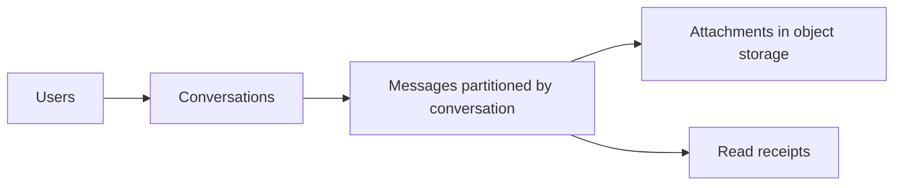

একটি চ্যাট অ্যাপ্লিকেশন ডিজাইন করার সময় সিস্টেমকে রিয়েল-টাইম রেসপন্স (Low Latency) এবং প্রতিদিন জেনারেট হওয়া বিলিয়ন বিলিয়ন ম্যাসেজ (High Write Throughput) সামলাতে হয়। 

**Database Technology Choices:**
* **ইউজার প্রোফাইল ও রিলেশনাল ডেটা:** PostgreSQL বা MySQL।
* **ম্যাসেজ স্টোর:** Apache Cassandra (কারণ এর Write স্পিড অসাধারণ এবং টাইম-সিরিজ ডেটা রাখতে খুব পারদর্শী) অথবা NoSQL ডকুমেন্ট স্টোর।
* **সেশন ও অনলাইন স্ট্যাটাস:** Redis (In-memory key-value store)।

### How would you handle message history efficiently?
চ্যাট হিস্ট্রি রাখার জন্য ডাটাবেসকে এমনভাবে সাজাতে হয় যেন কুয়েরি করার সময় শুধু নির্দিষ্ট চ্যাটের ডেটা দ্রুত উঠে আসে।

**Cassandra Table Design Example:**
```sql
CREATE TABLE messages (
    conversation_id UUID,
    message_id TIMEUUID,     -- অটোমেটিক্যালি সময়ের ক্রম রক্ষা করে
    sender_id UUID,
    message_text TEXT,
    created_at TIMESTAMP,
    PRIMARY KEY (conversation_id, message_id) 
) WITH CLUSTERING ORDER BY (message_id DESC);
```
এখানে `conversation_id` হলো Partition Key (অর্থাৎ একটি চ্যাটের সব ম্যাসেজ হার্ডডিস্কের একই জায়গায় থাকবে), আর `message_id` হলো Clustering Key (যা মেসেজগুলোকে সময়ের ক্রমানুসারে সাজাবে)। যখন ইউজার চ্যাটবক্স খোলে, তখন `SELECT * FROM messages WHERE conversation_id=X LIMIT 50;` চালালে মুহূর্তেই লেটেস্ট ৫০টি ম্যাসেজ চলে আসবে। ইউজার ওপরে তুললে (Scroll), `message_id < Last_Message_ID` ধরে পেছনের মেসেজ আনা হয়।

### How do you implement read receipts?
রিড রিসিপ্ট (Send, Delivered, Seen) রিয়েল-টাইমে পরিচালিত হয়। ডাটাবেসে লেখার আগে এগুলো মেসেজ কিউ বা ক্যাশের মাধ্যমে দ্রুত আপডেট করতে হয়।
* ডাটাবেসে `status` (TINYINT: 0=sent, 1=delivered, 2=seen) ফিল্ড থাকে।
* যেহেতু একই মেসেজের স্ট্যাটাস বারবার আপডেট হয়, সরাসরি মেইন ডাটাবেসে আপডেট না করে প্রথমে **Redis/Kafka** তে ইভেন্ট পাঠানো হয়। ব্যাকগ্রাউন্ড ওয়ার্কার কিছু সময় পর পর ব্যাচ (Batch) করে ডাটাবেসকে আপডেট করে, যাতে ডাটাবেস ক্র্যাশ না করে।

### How to handle group chats vs direct messages?
* **Direct Messages:** দুজন ইউজারের আইডির মাধ্যমে একটি ইউনিক `conversation_id` তৈরি হয় (যেমন `user1_user2`)। 
* **Group Chats:** একটি মেসেজ যখন গ্রুপে আসে, তখন তা গ্রুপের ১০ হাজার মেম্বারকে আলাদা করে ডাটাবেসে পাঠানোর প্রয়োজন নেই। ডাটাবেসে শুধু একবার মেসেজটি স্টোর হয় (`group_id` অধীনে)। এরপর একটি **Pub/Sub (Publish/Subscribe)** ব্রোকার (যেমন Redis Pub/Sub বা RabbitMQ) ওই গ্রুপের সকল লাইভ/অনলাইন মেম্বারের ওয়েব-সকেট (WebSocket) কানেকশনে মেসেজটি ব্রডকাস্ট করে দেয়।

---

## **144. Design a ride-sharing app database (Uber-style)**

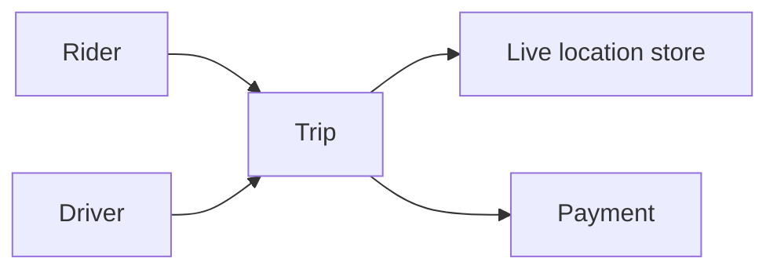

রাইড শেয়ারিং সার্ভিসে রিয়েল-টাইমে চলন্ত গাড়ির ট্র্যাকিং এবং প্যাসেঞ্জারের লোকেশন ম্যাচ করানো সবচেয়ে জটিল কাজ (Geospatial Data Processing)।

**Database Technology Choices:**
* **কোর ট্রানজেকশন (ইউজার, রেটিং, পেমেন্ট):** PostgreSQL.
* **লোকেশন ট্র্যাকিং ও ম্যাচিং:** Redis (Geohash) বা PostgreSQL এর **PostGIS** এক্সটেনশন।
* **এনালাইটিক্স (Historical Data):** Hadoop বা Data Warehouse।

### How do you handle real-time driver location updates?
ড্রাইভার যখন চলছে, তার অ্যাপ প্রতি ৩-৪ সেকেন্ডে জিপিএস কোঅর্ডিনেট পাঠায় সার্ভারে। 
* এটি সরাসরি মেইন ডাটাবেসে লেখা একদম বোকামি, ডাটাবেস লক হয়ে ক্র্যাশ করবে।
* তাই লোকেশন আপডেটগুলো **Redis Geo** ডাটা স্ট্রাকচারে লেখা হয়। Redis মেমরিতে থাকায় এটি সেকেন্ডে লাখ লাখ আপডেট নিতে পারে।
```bash
# Redis এ ড্রাইভারের লোকেশন আপডেট করার কমান্ড
GEOADD drivers 90.4125 23.8103 "driver_101"
```
* দীর্ঘস্থায়ী রাইড হিস্ট্রির জন্য, প্রতি ৩০ সেকেন্ড বা ১ মিনিট পর পর এই লোকেশনগুলো একত্রে ব্যাচ করে Cassandra বা PostgreSQL-এ সেভ করা হয়।

### How do you implement surge pricing?
Surge Pricing মূলত রিয়েল-টাইম সাপ্লাই এবং ডিমান্ডের ম্যাথমেটিকাল ক্যালকুলেশন।
* একটি নির্দিষ্ট এলাকার (Geo-fence) জন্য **Apache Flink** বা **Spark Streaming** ব্যবহার করে একটি টাইম-উইন্ডোতে (যেমন শেষ ৫ মিনিটে) কয়জন রাইড খুঁজছে এবং কয়টি গাড়ি ফ্রি আছে তার হিসাব করা হয়।
* যদি ডিমান্ড সাপ্লাইয়ের চেয়ে বেশি হয়, তবে মেশিন লার্নিং অ্যালগরিদম প্রাইস মাল্টিপ্লায়ার (যেমন 1.5x, 2x) সেট করে দেয় এবং সেটি রেডিসে ক্যাশ করে রাখে যেন ইউজার রিকোয়েস্ট করা মাত্রই প্রাইস দেখতে পারে।

### How do you match drivers with riders efficiently?
ম্যাচিংয়ের জন্য পৃথিবীকে ছোট ছোট গ্রিড বা বাক্সে ভাগ করা হয়। এই মেকানিজমে **Geohash** (যেমন UBER এর H3 অ্যালগরিদম) বা **Quadtree** ব্যবহার করা হয়।
* যখন ইউজার রিকোয়েস্ট করে, সিস্টেম দেখে ইউজার কোন গ্রিডে বা জোন-এ আছে (যেমন "Gulshan")।
* এরপর Redis ডাটাবেসে কুয়েরি করা হয় ওই নির্দিষ্ট এলাকার গ্রিডে থাকা ফ্রি (Idle) ড্রাইভারদের জন্য।
```bash
# Redis এ ২ কিলোমিটারের মধ্যে থাকা ড্রাইভারদের খোঁজা
GEORADIUS drivers 90.4125 23.8103 2 km
```
* এরপর পাওয়া ড্রাইভারগুলোর কারেন্ট স্পিড এবং ম্যাপ রাউটিং (Traffic condition) ক্যালকুলেট করে সবচেয়ে দ্রুত পৌঁছাতে পারা ড্রাইভারকে রিকোয়েস্ট পাঠানো হয়।

---

## **145. Design an e-commerce database (Amazon-style)**

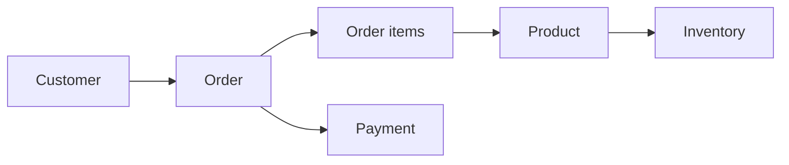

ই-কমার্স সিস্টেম একটি বিশাল মনোলিথ নয়; এটি অসংখ্য ছোট ছোট মাইক্রোসার্ভিসের (Microservices) সমন্বয়, যেখানে প্রতিটির ডাটাবেস রিকয়ারমেন্ট আলাদা থাকে।

**Database Technology Choices:**
* **প্রোডাক্ট ক্যাটালগ (Inventory Search):** Elasticsearch (টেক্সট সার্চের জন্য) এবং MongoDB (প্রোডাক্টের বিচিত্র ডাইনামিক এট্রিবিউট রাখার জন্য)।
* **অর্ডার ও পেমেন্ট (Transactions):** MySQL বা PostgreSQL (যেখানে ACID গ্যারান্টি মাস্ট)।
* **ইউজার কার্ট ও সেশন:** Redis.

### How do you handle shopping carts and abandoned carts?
* **শপিং কার্ট:** কার্টের ডেটা রিয়েল-টাইমে ইউজার মিনিটে কয়েকবার চেঞ্জ করতে পারে। তাই এটিকে পারমানেন্ট ডাটাবেসে না লিখে **Redis Key-Value** হিসেবে রাখা হয়। 
```json
// Redis এ সেভ থাকা ইউজারের কার্ট 
"cart:user_405": {
  "items": [{"prod_id": 101, "qty": 2}, {"prod_id": 105, "qty": 1}],
  "updated_at": 1690002100
}
```
* **এবান্ডনড কার্ট (Abandoned Cart):** Redis ডেটায় একটি TTL (Time-To-Live) সেট করা থাকে (যেমন ২৪ ঘণ্টা)। এর আগে ইউজার পেমেন্ট না করলে একটি ব্যাকগ্রাউন্ড জব (Cron) এই কার্ট ডেটাকে Redis থেকে সরিয়ে পারমানেন্ট ডাটাবেসে সেভ করে এবং ইউজারকে ইমেইল রিমাইন্ডার দেয়।

### How do you manage inventory across multiple warehouses?
ই-কমার্সে একই প্রোডাক্ট অনেকেই কিনতে চায়। রেস কন্ডিশন (Race Condition) এড়াতে ডাটাবেসে Row-level Lock বা Pessimistic Locking ব্যবহার করা হয়।
* যখন কেউ চেকআউট করে, ডাটাবেস ওই প্রোডাক্টের রো (Row) কে ফর-আপডেট লক করে: 
```sql
SELECT quantity FROM inventory WHERE product_id=101 FOR UPDATE;
UPDATE inventory SET quantity = quantity - 1 WHERE product_id=101;
```
* এটি নিশ্চিত করে যে ইনভেন্টরি যদি ১টি থাকা অবস্থায় ২ জন একসাথে পেমেন্ট করে, তবে ডাটাবেস একজনকে এরর দেবে এবং মাইনাস কোয়ান্টিটিতে প্রোডাক্ট বিক্রি হবে না।

### How do you handle product recommendations?
রেকমেন্ডেশন ইঞ্জিন সাধারণত **Graph Databases (Neo4j)** বা বিগ ডেটা এনালাইটিক্স (Apache Spark) এর ওপর নির্ভর করে। 
* নোড হিসেবে থাকে "User" এবং "Product", আর এজ (Edge) হয় "Viewed", "Purchased"।
* গ্রাফ ডাটাবেসে কুয়েরি হয়: "রহিমের মতো অন্য ইউজাররা যারা এই জুতোটি দেখেছে, তারা আর কোন প্যান্ট কিনেছে?" সেই প্যান্টগুলোকে হোম পেজে সাজেশন হিসেবে পাঠানো হয়।

---

## **146. Design a social media platform database (Facebook/Twitter)**

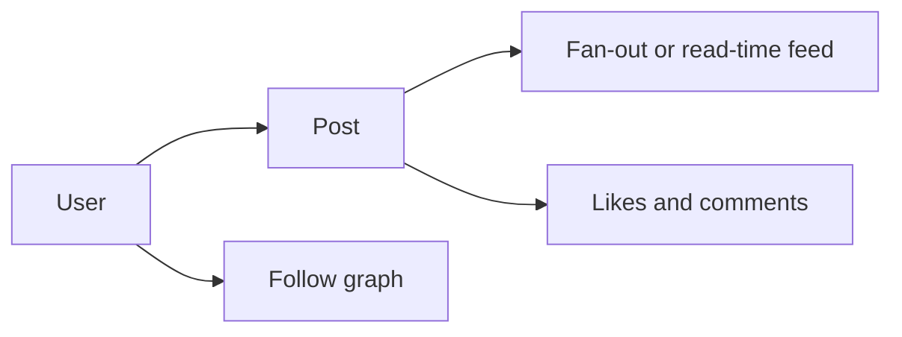

সোশ্যাল মিডিয়া সিস্টেমে ডেটার ট্রাফিক রিড (Read)-হেভি হয়ে থাকে (১ জন পোস্ট করে, ১ লাখ মানুষ দেখে)। তাই হাইলি এভেইল্যাবল এবং এভেনচুয়াল কনসিস্টেন্ট (Eventual Consistency) সিস্টেম ডিজাইন করা হয়। 

### How do you implement follow/unfollow efficiently?
এখানে গ্রাফ ডাটাবেস বা সিম্পল রিলাশনাল টেবিলের জয়েন ব্যবহার করা যায়। 
* একটি RDBMS এ টেবিল থাকবে `users` এবং আরেকটি টেবিল `follows (follower_id, followee_id)`।
* রিয়েল-টাইমে "Mutual Friends" বা "People you may know" সাজেস্ট করার জন্য **Neo4j** সেরা পছন্দ। 
```cypher
// Neo4j Query: জন এর বন্ধুদের বন্ধু বের করার কুয়েরি 
MATCH (john:User {name: 'John'})-[:FRIEND]->(friend)-[:FRIEND]->(fof)
WHERE NOT (john)-[:FRIEND]->(fof)
RETURN fof
```

### How do you generate news feed?
নিউজ ফিড জেনারেট করা সবচেয়ে কঠিন কাজ। এটি করার দুটি অ্যাপ্রোচ আছে:
1. **Pull Model (On-Demand):** যখন আপনি ফিড লড করেন, সিস্টেম আপনার ফলো করা হাজার মানুষের লেটেস্ট পোস্টগুলো ডাটাবেস থেকে কুয়েরি করে এনে অর্ডার (Sort) করে। সাধারণ ইউজারদের জন্য এটি কাজ করলেও সেলিব্রিটিদের ক্ষেত্রে এই কুয়েরি ডাটাবেসকে ফ্রিজ করে দেয়।
2. **Push Model (Fan-out on Write):** কেউ যখন স্ট্যাটাস দেয়, ব্যাকগ্রাউন্ড ওয়ার্কার (Celery/Sidekiq) সেই স্ট্যাটাসটিকে তার সকল ফলোয়ারের প্রি-কম্পিউটেড নিউজফিড (যা Redis লিস্টে সংরক্ষিত) টেবিলে পুশ করে দেয়। 
* **হাইব্রিড সলিউশন:** সাধারণ মানুষের জন্য Push Model এবং সেলিব্রিটিদের (যাদের ফলোয়ার ১ লাখের বেশি) জন্য Pull Model একসাথে মিক্স করে হাই-স্কেলে কাজ করা হয়।

### How do you handle trending topics?
ট্রেন্ডিং টপিকস বের করার কাজ মূলত **Stream Processing** এর হাতে থাকে।
* হ্যাসট্যাগগুলো মেসেজ ব্রোকার **Apache Kafka** তে পাঠানো হয়। 
* Apache Flink একটি ফিক্সড টাইমফ্রেমের মধ্যে (গত ৩০ মিনিট) কোন হ্যাসট্যাগ কতবার এসেছে তা গুনে (Count-Min Sketch অ্যালগরিদম) ফলাফলটিকে রিয়েল-টাইমে Redis ZSET (Sorted List) এ আপডেট করে। টপ ১০ লিস্ট ডাটাবেস না ছুঁয়ে সরাসরি Redis থেকেই ফ্রন্টএন্ডে শো করানো হয়।

---

## **147. Design a banking system database**

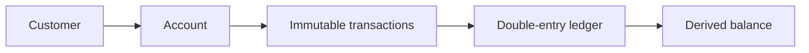

ব্যাংকিং সিস্টেম আর সোশ্যাল মিডিয়া এক জিনিস নয়। এখানে ১ সেকেন্ড ডাটা স্লো আসলেও সমস্যা নেই, কিন্তু ১ টাকার ব্যালেন্স ভুল হলে পুরো কোম্পানি ধ্বংস হয়ে যাবে। 

**Database Choices:** 
PostgreSQL, Oracle, অথবা Spanner এর মতো ফুল্লি ACID কমপ্লায়েন্ট SQL ডাটাবেস মাস্ট!

### How do you ensure ACID properties for money transfers?
মানি ট্রান্সফারে **Atomicity** কঠোরভাবে নিয়ন্ত্রণ করা হয়, অর্থাৎ হয় সব কাজ হবে, না হয় কিছুই হবে না।
* এর জন্য সিস্টেম **Double Entry Accounting** ফলো করে। একটি টেবিল `accounts` এবং আরেকটি টেবিল `ledger_entries` রাখা হয়।
* ডাটাবেস থেকে যখনই টাকা ট্রান্সফার হবে, এটি নির্দিষ্ট ব্লকের ভেতর হবে:
```sql
BEGIN TRANSACTION;
-- সেন্ডারের ব্যালেন্স লক এবং কমানো
UPDATE accounts SET balance = balance - 1000 WHERE id = 1 FOR UPDATE;
-- রিসিভারের ব্যালেন্স লক এবং বাড়ানো
UPDATE accounts SET balance = balance + 1000 WHERE id = 2 FOR UPDATE;
-- অডিট টেবিলে লগ রাখা
INSERT INTO ledger (from_ac, to_ac, amount) VALUES (1, 2, 1000);
COMMIT; 
-- ফেইল করলে ROLLBACK করা হবে
```

### How do you handle transaction history and auditing?
Banking ledger entry সাধারণত append-only এবং correction reversal entry দিয়ে করা হয়। অন্য operational/PII table-এর update বা delete retention, audit এবং privacy policy অনুযায়ী হতে পারে।
* এর জন্য **Event Sourcing Pattern** ব্যবহার করা হয়। আপনার বর্তমান ব্যালেন্স মূলত অগণিত জমা এবং খচর হিসেবের (Ledgers) যোগফল। 
* প্রতিটি ট্রানজেকশনে Immutable, Append-only (শুধু মাত্র নিচে লেখা হবে) ডাটাবেস স্ট্রাকচার ব্যবহার করা হয়, যাতে কেউ ডেটা টেম্পার করলে তা সাথে সাথে ধরা পড়ে। 

### How do you prevent double spending?
যাতে একই পেমেন্ট রিকোয়েস্ট দুবার এক্সিকিউট না হয়, তার জন্য তিনটি লেয়ার রাখা হয়:
1. **Idempotency Key:** ক্লায়েন্ট অ্যাপ থেকে যখন টাকা পাঠানোর রিকোয়েস্ট আসে, তখন একটি ইউনিক টোকেন বা কী (Key) আসে। এই কী ডাটাবেসের `transactions` টেবিলে UNIQUE কলাম হিসেবে সেট করা হয়। ডাটাবেস একই কী পেলেই রিজেক্ট করে দেয় (Duplicate Key Error)।
2. **Pessimistic Locking:** ট্রান্সফার চলাকালীন স্পেসিফিক রো-কে `FOR UPDATE` এর মাধ্যমে লক করে রাখা হয়।

---

## **148. Design a video streaming platform database (Netflix/YouTube)**

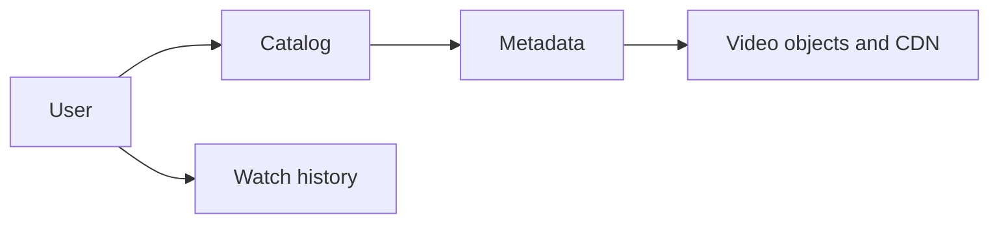

ভিডিও স্ট্রিমিংয়ে ডাটাবেস খুব ছোট থাকে, কারণ অরিজিনাল ভিডিও ফাইলগুলো ডাটাবেসে থাকে না। 

### How do you store video metadata vs actual video files?
* **মেটাডেটা (Metadata):** ভিডিওর টাইটেল, ডেসক্রিপশন, ট্যাগ, লাইক-ডিসলাইক, কমেন্ট—এগুলো **PostgreSQL** বা **MongoDB** তে রাখা হয়, কারণ এগুলো টেক্সট ডেটা এবং প্রচুর কুয়েরি হয়।
* **ভিডিও ফাইল (Blob Storage):** ভিডিও ফাইলকে বিভিন্ন রেজুলেশনে (১০৮০পি, ৭২০পি) কনভার্ট করে **Object Storage** (Amazon S3 বা GCS) এ সংরক্ষণ করা হয়। 
* মেটাডেটা ডাটাবেসে শুধুমাত্র ওই ফাইলের একটি CDN লিংক (যেমন `https://cdn.example.com/video123_720p.mp4`) রাখা হয়।

### How do you handle user viewing history and recommendations?
ভিডিও হিস্ট্রি একটি কন্টিনিউয়াস ডেটা স্ট্রিম বা লগ (Log)।
* ইউজার যখন ভিডিও দেখে, ব্রাউজার থেকে প্রতি ১০ সেকেন্ড পর পর একটি "Heartbeat" সিগন্যাল আসে ("ইউজার ১২ মিনিট ১০ সেকেন্ডে আছে")। 
* এই বিপুল সংখ্যক হার্টবিট **Cassandra**-র মতো হাই-স্কেল ডাটাবেসে অথবা **HDFS (Hadoop)** এ ডাম্প করা হয়। 
* এই ডেটাসেটের ওপর Machine Learning (Collaborative Filtering) চালিয়ে মেশিন ঠিক করে ওই ইউজারের জন্য নেক্সট রেকমেন্ডেশন কী হবে।

### How do you implement content delivery and caching?
ডেলিভারির জন্য ডাটাবেস দায়ী নয়, এটি মূলত নেটওয়ার্ক আর্কিটেকচার।
* **CDN (Content Delivery Network):** Netflix এর মতো সিস্টেম তাদের ভিডিওর ক্যাশ কপিগুলো বিশ্বের বিভিন্ন দেশের ইন্টারনেট প্রোভাইডারের (ISP) লোকাল সার্ভারে (Netflix Open Connect) বসিয়ে রাখে। 
* যখন কোনো বাংলাদেশি ইউজার রিকোয়েস্ট করে, সিস্টেম তার মেটাডেটা ডাটাবেস (আমেরিকায় থাকা) থেকে ভেরিফাই করে, কিন্তু ডাটাবেস বলে দেয়—"আমি পাঠাচ্ছি না, তুমি ঢাকার ওই ক্যাশ সার্ভার থেকে ভিডিওটি টানো।"

---

## **149. Design a stock trading system database**

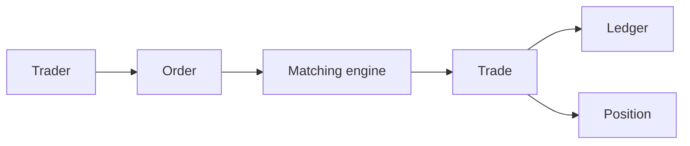

স্টক মার্কেট হচ্ছে একটি আল্ট্রা-লো-লেটেন্সি, সুপার ফাস্ট ট্রানজেকশনাল সিস্টেম। এখানে ট্রেড মিলতে হয় মাইক্রো-সেকেন্ডে। 

### How do you handle high-frequency trading requirements?
রেগুলার ডিস্ক ভিত্তিক ডাটাবেস (SQL) এর লেটেন্সি মিলি-সেকেন্ডে হয়, যা ট্রেডিংয়ের জন্য অনেক স্লো।
* তাই পুরো কোর ম্যাচিং ইঞ্জিন **In-Memory Database** (সম্পূর্ণ RAM এ চলে), যেমন Redis Enterprise বা kdb+ এ চালানো হয়। 
* মেমরি অত্যন্ত ফাস্ট হওয়ায় লেটেন্সি ন্যানো-সেকেন্ডে নেমে আসে। তবে দিন শেষে (Market close হলে) এই মেমরি ডেটাগুলো হার্ডডিস্ক ভিত্তিক ট্র্যাডিশনাল এন্টারপ্রাইজ ডাটাবেসে (Oracle/DB2) স্থায়ীভাবে স্টোর (Archive) করা হয়।

### How do you ensure data consistency for real-time prices?
স্টকের টিক (Tick) প্রাইস প্রতি ফ্র্যাকশন অফ সেকেন্ডে চেঞ্জ হয়। 
* এর কনসিস্টেন্সি রাখতে প্রাইস টিকগুলো **Stream Processing (Kafka / Flink)** এর মাধ্যমে হ্যান্ডেল করা হয়।
* ডাটাবেসে স্টোর করার সময় Time-series Database (যেমন InfluxDB) ব্যবহার করা হয়, যাতে সময়ের নিখুঁত ট্র্যাকিং থাকে এবং ফ্রন্টএন্ডে ওয়েবসকেটের মাধ্যমে পুশ করা হয়।

### How do you handle order matching?
এটি মূলত ডাটাবেস নয়, বরং একটি স্পেশাল সফটওয়্যার কনসেপ্ট, যাকে **Limit Order Book** বলা হয়।
* এটি দুটি Priority Queues (Max-heap for Bids, Min-heap for Asks) নিয়ে গঠিত। 
* যখন নতুন বাই (Buy) বা সেল (Sell) রিকোয়েস্ট আসে, RAM এ থাকা এই অর্ডার বুক সাথে সাথে চেক করে (Pro-Rata বা First-In-First-Out বেসিসে)। 
* ম্যাচ হলে একটি Trade ইভেন্ট উৎপন্ন হয় এবং তা Kafka এর মাধ্যমে এসিঙ্ক্রোনাসলি পার্মানেন্ট ডাটাবেস বা লেজারে সেভ হতে চলে যায়।

---

## **150. Design a hospital management system database**

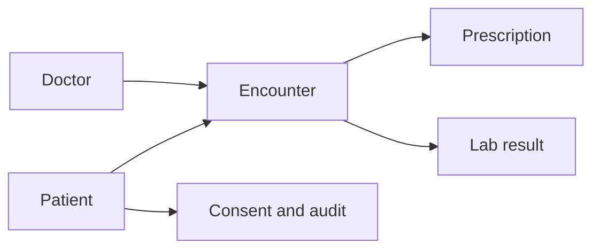

হসপিটাল সিস্টেমে স্পিড বা রিয়েল-টাইমের চেয়ে ডাটা প্রাইভেসি, সিকিউরিটি এবং ডেটার অথেন্টিসিটি সবার ওপরে থাকে।

### How do you handle patient privacy (HIPAA compliance)?
HIPAA(Health Insurance Portability and Accountability Act) আইন মেনে চলার জন্য ডেটার সুরক্ষায় জিরো টলারেন্স নীতি মানতে হয়।
* **Encryption Always:** ডাটাবেসে ডেটা (At-rest) এবং ইন্টারনেটে ডেটা (In-transit) সব সময় হায়েস্ট লেভেলের এনক্রিপশন (যেমন AES-256) থাকতে হয়।
* **Data Masking ও Column Level Encryption:** রোগীর নাম, ব্লাড রিপোর্ট, স্পেসিফিক সেনসিটিভ কলামগুলো এমনভাবে ডাটাবেসে এনক্রিপ্ট করা থাকে যে, ডাটাবেস অ্যাডমিনেস্ট্রেটর নিজেও সরাসরি কুয়েরি করে তা পড়তে পারে না। শুধুমাত্র অথরাইজড অ্যাপ্লিকেশনের কাছে ডিক্রিপশন-কি (Key) থাকে। 
* **Audit Logs:** প্রত্যেকটি Read/Write এর জন্য একটি অপরিবর্তনীয় লগ টেবিল রাখা হয় (কে, কখন, কোন আইপি থেকে রোগীর রিপোর্ট দেখেছে বা চেঞ্জ করেছে)।

### How do you manage appointment scheduling?
* ডাটাবেসে `doctors`, `patients`, `appointments`, এবং `time_slots` টেবিল থাকে। 
* একজন ডাক্তার একই সময়ে দুজনকে সময় দিতে পারে না, তাই ডাবল বুকিং ঠেকাতে ডাটাবেস লেভেলে `UNIQUE(doctor_id, appointment_date, time_slot_id)` কনস্ট্রেইন্ট ব্যবহার করা হয়, পাশাপাশি রিলাশনাল ডাটাবেসের লক মেকানিজম প্রয়োগ করে ট্রানজেকশনাল ইন্টেগ্রিটি নিশ্চিত করা হয়।

### How do you handle medical records and history?
রোগীর মেডিকেল রেকর্ড সাধারণত দুটি অংশে বিভক্ত:
* **EHR (Electronic Health Record):** প্রেসক্রিপশন, অবজারভেশন, ডায়াগনোসিস এসব স্ট্রাকচার্ড ডেটা RDBMS এ রোগীর প্রোফাইলে সংরক্ষণ করা হয়। 
* **মিডিয়া ফাইল (X-Ray, MRI Scans):** এগুলো বিশাল সাইজের ফাইল। এগুলো ডাটাবেসে না রেখে Secure Object Storage বা PACS (Picture Archiving and Communication System) এ সেভ করা হয় এবং মূল ডাটাবেসে ওই ফাইলের এনক্রিপ্টেড লোকেশন ও পারমিশন টোকেন রাখা হয়। 

---

## **196. Design a database system that can handle 1 million writes per second**

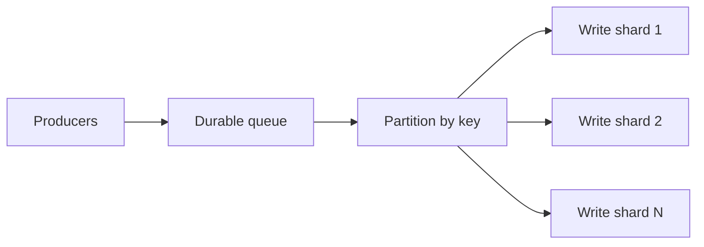

সাধারণ একটি RDBMS (যেমন MySQL বা PostgreSQL) সর্বোচ্চ ৫ হাজার থেকে ১০ হাজার রাইট/সেকেন্ড হ্যান্ডেল করতে পারে। একে ১ মিলিয়ন (১০ লাখ) এ নিতে হলে আর্কিটেকচার পুরোপুরি চেঞ্জ করতে হবে।

### Architecture choices and trade-offs?
১ মিলিয়ন রাইট হ্যান্ডেল করতে হলে আমাদের **Distributed NoSQL Database** এর দিকে ঝুঁকতে হবে।
* **ডাটাবেস সিলেক্ট:** **Apache Cassandra** বা **ScyllaDB** (LSM-Tree ডাটা স্ট্রাকচার)। এরা মেমরিতে (MemTable) রাইট করে এবং পরে হার্ডডিস্কে সিকুয়েন্সিয়ালি লেখে (SSTable), যা বিশাল পরিমাণ রাইট নেয়ার জন্য বেস্ট।
* **মেসেজ কিউ বাফার:** ক্লায়েন্টরা সরাসরি ডাটাবেসে ডেটা না পাঠিয়ে **Apache Kafka** এর মতো হাই পারফরম্যান্স মেসেজ ব্রোকারে ডেটা পাঠায়। কাফকা আরামসে মিলিয়ন ইভেন্ট ইনজেস্ট (Ingest) করতে পারে। 
* এরপর কনজিউমারগুলো কাফকা থেকে ডেটা নিয়ে ব্যাচ (Batch) তৈরি করে ক্যাসান্ড্রাতে এসিঙ্ক্রোনাসলি রাইট করে।
* **Trade-offs:** এত হাই রাইটে Strong Consistency নিশ্চিত করা অসম্ভব। তাই Eventual Consistency (দেরিতে ডেটা আপডেট শো করা) মেনে নিতে হবে। পাশাপাশি জয়েন (Join) বা ফ্লেক্সিবল কুয়েরি এর আশা ছেড়ে দিয়ে ডিনর্মালাইজড (Denormalized) মডেল ফলো করতে হবে।

### Consistency vs availability decisions?
CAP Theorem অনুযায়ী ডিস্ট্রিবিউটেড ডাটাবেস হয় CP অথবা AP হবে। ১০ লাখ রাইটের সিস্টেমে ডাটাবেস যেন কখনো ডাউন না হয়, তাই এটিকে **AP (Availability & Partition Tolerance)** বানানো হয়। অর্থাৎ, নেটওয়ার্কে সমস্যা হলেও ডাটা রিসিভ করা বন্ধ হবে না।

### How do you measure and verify performance?
প্রোডাকশনে যাওয়ার আগে ব্যাপক স্ট্রেস টেস্টিং করতে হয়।
* **Tools:** `YCSB (Yahoo! Cloud Serving Benchmark)` বা `Apache JMeter` দিয়ে লাখ লাখ ফেইক রিকোয়েস্ট জেনারেট করে ডাটাবেসের ক্ষমতা মাপা হয়। 
* **Metrics:** 
  1. Throughput (Writes per second).
  2. P99 Latency (৯৯% রিকোয়েস্ট কত মিলি-সেকেন্ডে সলভ হলো)।
  3. CPU, RAM, Disk I/O (সিস্টেমের কোথায় বটলনেক হচ্ছে তা দেখা)। 

---

## **197. Database design for a global app (Users across continents)**

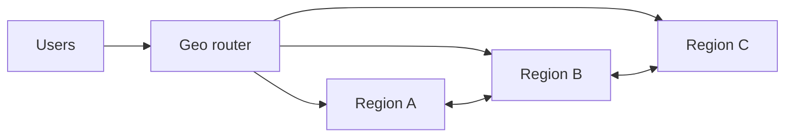

যখন একটি অ্যাপ আমেরিকায় হোস্ট করা থাকে এবং বাংলাদেশের ইউজার সেটি ব্যবহার করে, তখন ডেটা ট্রাভেল করার জন্য প্রায় ২৫০ মিলি-সেকেন্ড নেটওয়ার্ক লেটেন্সি হয়, যা ইউজার এক্সপেরিয়েন্স চরমভাবে নষ্ট করে। 

### Multi-region deployment strategies?
এর সমাধান হলো গ্লোবালি ডিস্ট্রিবিউটেড ডাটাবেস তৈরি করা।
* ডাটাবেসের কপি (Replicas) পৃথিবীর বিভিন্ন প্রান্তে (যেমন: আমেরিকা, ইউরোপ, এশিয়া) স্থাপন করা। 
* **Google Cloud Spanner, CockroachDB বা Amazon DynamoDB (Global Tables)** এর মতো গ্লোবাল ক্লাউড-নেটিভ ডাটাবেস ব্যবহার করা হয়, যারা ডাটাবেসের ডেটাকে রিয়েল টাইমে একাধিক রিজিওনে সিঙ্ক (Replicate) করে রাখে। এশিয়ার ইউজার যখন ডাটাবেসে রিকোয়েস্ট করে, তখন তা আমেরিকার সার্ভারে যায় না, বরং সিঙ্গাপুর বা মুম্বাইয়ের লোকাল সার্ভারে গিয়ে পড়ে, ফলে মিলি-সেকেন্ডে রেসপন্স আসে।

### Data residency and compliance requirements?
কিছু কিছু দেশের (যেমন ইউরোপিয়ান ইউনিয়নের) আইন আছে যে, তাদের নাগরিকদের ডেটা তাদের ভৌগোলিক সীমানার বাইরে সেভ করা যাবে না। 
* এর জন্য ডাটাবেসে **Geo-partitioning (বা Row-level pinning)** স্ট্র্যাটেজি ব্যবহার করা হয়। 
* ডাটাবেস কোর লেভেলেই এমনভাবে কনফিগার করা হয় যে, যদি ইউজারের `country_code` = "জার্মানি" হয়, তবে তার ডেটা শুধুমাত্র ইউরোপের ডাটাবেস ক্লাস্টারেই সেভ হবে, অন্য কোনো ক্লাস্টারে তার রেপ্লিকা বা কপি যাবে না।

### Conflict resolution in distributed writes?
আমেরিকার সার্ভারে এক ইউজার একটি ডকুমেন্টে লিখলো "A", ঠিক একই মিলি-সেকেন্ডে এশিয়ার ইউজার একই ডকুমেন্টে লিখলো "B"। এখন গ্লোবাল ডাটাবেসে কার রাইটটা গ্রহণ করা হবে? 
* **সমাধান ১ (TrueTime):** Google Spanner এর মতো সিস্টেম ফিজিক্যাল অ্যাটমিক ঘড়ি ও জিপিএস ব্যবহার করে গ্লোবাল টাইম নিখুঁত রাখে (TrueTime API), যার ফলে একদম মিলি-সেকেন্ডের হিসাব অনুযায়ী সিরিয়ালাইজ করা যায় (Strict Consistency)।
* **সমাধান ২ (LWW / Vector Clocks):** Cassandra বা অন্যান্য সিস্টেমে Last-Writer-Wins টাইমস্ট্যাম্প বা Vector Clocks ব্যবহার করে কনফ্লিক্ট সলভ করে, অথবা অ্যাপ্লিকেশন লেভেলে দুটো ডেটাই পাঠিয়ে দিয়ে ডেভেলপারকে ডিসিশন নিতে বলে।

---

## **198. How do you implement GDPR compliance in database design?**

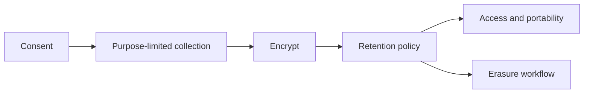

GDPR (General Data Protection Regulation) ইউরোপের সবচেয়ে কঠোর নিয়ম। এটি ভেঙে ফেললে কোম্পানির আয়ের একটি বিশাল অংশ জরিমানা হতে পারে। ডাটাবেস লেভেল থেকেই "Privacy by Design" বাস্তবায়ন করতে হয়।

### Right to be forgotten (Right to erasure) implementation?
জিডিপিআর এর ধারা অনুযায়ী, ইউজার চাইলে কোম্পানিকে তার যাবতীয় ডেটা চিরতরে মুছে ফেলার নির্দেশ দিতে পারে।
* **Soft Delete চলবে না:** আমরা অনেক সময় ডাটাবেস ডিজাইনে `deleted_at` ফিল্ড দিয়ে ডেটা হাইড করে রাখি (Soft Delete), কিন্তু ডেটা হার্ডডিস্কেই থেকে যায়। জিডিপিআর-এ এটি অবৈধ।
* **Hard Delete Mechanism:** রিকোয়েস্ট আসলে ইউজারের PII (Personally Identifiable Information যেমন নাম, ইমেইল, ঠিকানা) প্রাইমারি ডাটাবেস, থার্ড-পার্টি সিস্টেম, এবং ক্যাশ থেকে সম্পূর্ণ ডিলিট বা স্ক্রাব (Scrubbed) করতে হয়। 
* **বিদেশি লিগ্যাল ইস্যু:** যদি ইউজারের আইডির সাথে ফাইনান্সিয়াল হিস্ট্রি (যা আবার ব্যাংকিং আইনে সংরক্ষণ করা বাধ্যতামূলক) জড়িয়ে থাকে, তবে ইউজারের নাম/ইমেইল মুছে ফেলে তাকে **Anonymize** (অজ্ঞাতনামা আইডিতে কনভার্ট) বা Hash করে দেয়া হয়, যাতে বোঝা না যায় ডেটাটি কার। 

### Data portability requirements?
ইউজার তার সব ডেটা দেখতে বা অন্য প্ল্যাটফর্মে নেয়ার জন্য পোর্টেবল (JSON/XML) ফরম্যাটে ডাউনলোড করার ক্ষমতা রাখে।
* **সমাধান:** ব্যাকএন্ডে একটি স্ক্রিপ্ট লিখতে হয়, যা ইউজারের আইডি ধরে ডাটাবেস, অবজেক্ট স্টোরেজ সবখানে কুয়েরি করে তার ডেটার একটি কমপ্লিট জিপ (Zip) বা JSON ফাইল জেনারেট করে তাকে ডাউনলোডের ব্যবস্থা করে দেয়।

### Consent management in databases?
ডাটাবেসে প্রমাণ রাখতে হবে যে ইউজার কবে, কোন ডেটা প্রসেস করার সম্মতি দিয়েছে।
* একটি `user_consents` টেবিল থাকবে। টেবিলটিতে শুধু হ্যাঁ/না নয়, বরং টাইমস্ট্যাম্প এবং সম্মতির ভার্শন থাকবে। 유জার যদি পরবর্তীতে তার সম্মতি রিমুভ বা উইথড্র (Withdraw consent) করে, সেটি ডাটাবেসের অডিট লগে সেভ রাখতে হবে। ডাটা প্রসেস করার কুয়েরি চালানোর আগে সবসময় এই টেবিলের ভিউ থেকে পারমিশন চেক করতে হয়। 

---

## **199. Design a database disaster recovery solution with 99.99% availability**

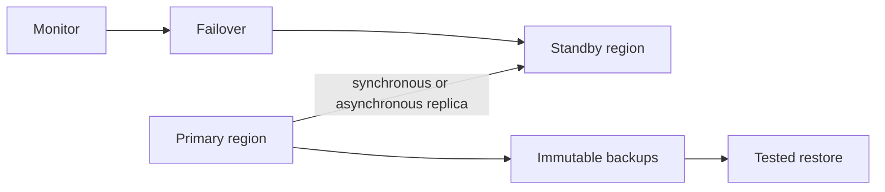

99.99% Availability (যাকে বলা হয় "Four Nines") মানে হলো আপনার সিস্টেমটি বছরে ম্যাক্সিমাম **৫২ মিনিট** ডাউন থাকার অনুমতি পাবে। এর বেশি ডাউন হলে কোম্পানির বিশাল লস হবে।

### RPO and RTO requirements?
ডিজাস্টার রিকভারির ক্ষেত্রে সিস্টেম ফেইল করলে দুইটা জিনিস নিয়ে ভাবতে হয়: 
* **RTO (Recovery Time Objective):** সিস্টেম ক্র্যাশ করার পর কত দ্রুত আবার রিকভার হয়ে লাইভ হবে? (ফোর নাইনস এচিভ করতে এই টাইম কয়েক সেকেন্ড থেকে ম্যাক্সিমাম ৫ মিনিট হতে পারবে)। 
* **RPO (Recovery Point Objective):** ক্র্যাশ করার কারণে কতক্ষণের ডেটা লস হয়েছে? (আদর্শ ডিজাইনে এটি "Zero Data Loss" হবে)। 

### Multi-cloud/Multi-region disaster recovery?
একটি পুরো ডেটা সেন্টার বা ক্লাউড রিজিওন (যেমন: AWS `us-east-1` এ জেনারেটর ফেইল করে আগুন লাগলে) ডাউন হয়ে গেলে বাঁচার উপায় কী? 
* **Active-Active Multi-Region Setup:** ডাটাবেসের প্রাইমারি এবং সেকেন্ডারি ক্লাস্টার আলাদা আলাদা রিজিওনে (যেমন একটি আমেরিকায়, আরেকটি এশিয়ায়) বা আলাদা ক্লাউড প্রোভাইডারে (একটি AWS এ, আরেকটি Azure এ) রাখতে হবে। 
* মেইন ডাটাবেস থেকে রিয়েল টাইমে (Synchronous বা ফাস্ট Asynchronous) রেপ্লিকেশন চলতে থাকবে অন্য ক্লাউডের ডাটাবেসে। 
* মেইন সার্ভার ডাউন হলে **DNS Failover Route (যেমন Route53)** স্বয়ংক্রিয়ভাবে ইউজারের সব রিকোয়েস্টকে সেকেন্ডারি ক্লাউড সার্ভারে ডাইরেক্ট করে দেবে। ফলে ইউজার ফেইল হওয়ার টেরই পাবে না। 

### Cost vs availability trade-offs?
* 99.99% এভেইল্যাবিলিটি অর্জন করতে গেলে অবকাঠামো (Infrastructure) ব্যয় তিন থেকে চার গুণ বেড়ে যায় (উচ্চ গতির প্রাইভেট নেটওয়ার্কিং, একাধিক ক্লাউড ডেটা সেন্টার, এক্সট্রা ডিস্ক স্পেস)। 
* তাই ডিজাইনারকে সিদ্ধান্ত নিতে হয়—বিজনেসে সিস্টেম ১০ মিনিট ডাউন থাকলে যে পরিমাণ ক্ষতি হবে, তার চেয়ে কি এই এক্সট্রা সার্ভার মেইনটেনেন্স খরচ বেশি নাকি কম? যদি ডাউনটাইমের ক্ষতিই বেশি হয়, তবেই এই আর্কিটেকচার সার্থক।

---

## **200. How do you future-proof your database architecture?**

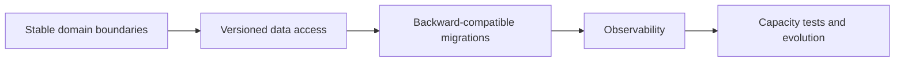

"Future-proofing" মানে হলো এমনভাবে প্রথম দিনেই সিস্টেমের আর্কিটেকচার সাজানো, যেন ৫-১০ বছর পর কোম্পানির ডেটা ১০০ গুণ বেড়ে গেলেও বা নতুন প্রযুক্তি আসলেও পুরো সিস্টেম রিবিল্ড করতে না হয়। 

### Technology evolution planning?
টেকনোলজির পরিবর্তন অবশ্যম্ভাবী। ডাটাবেসকে এর থেকে বাঁচাতে **Microservices architecture** ব্যবহার করা হয়।
* একটি মনোলিথিক সিস্টেমকে ছোট ছোট সার্ভিসে ভাগ করা। যেমন বিলিং সার্ভিস, ইউজার সার্ভিস, প্রোডাক্ট সার্ভিস।
* প্রতিটি মাইক্রোসার্ভিসের নিজস্ব আলাদা ডাটাবেস (Database per service) রাখা। এতে ভবিষ্যতে প্রোডাক্ট সার্ভিসের সার্চ উন্নত করতে চাইলে শুধুমাত্র ওই ডাটাবেস পরিবর্তন করে Elasticsearch বসালেই চলবে, পুরো সিস্টেমকে ছুতে হবে না।

### Vendor lock-in mitigation strategies?
যদি সব কাজ ক্লাউড স্পেসিফিক সার্ভিসের (যেমন DynamoDB বা AWS Aurora এর নিজস্ব ফিচার) ওপর নির্ভর করে করেন, তবে কাল যদি তারা দাম ৩ গুণ বাড়িয়ে দেয়, আপনার অন্য কোথাও চলে যাওয়ার স্বাধীনতা থাকবে না। এই ফাঁদকে Vendor lock-in বলে।
* **Data Access Layer / Repository Pattern:** ব্যাকএন্ড অ্যাপ্লিকেশনের কোর লজিকের ভেতরে সরাসরি SQL কোয়ারি না লিখে, একটি লেয়ার তৈরি করা হয় (Interface / Abstract Layer)। কোড শুধু সেই ইন্টারফেসের সাথে কথা বলে। 
* আজ ইন্টারফেসটি হয়তো MySQL এর সাথে কানেক্টেড, ভবিষ্যতে যদি PostgreSQL বা NoSQL এ শিফট করতে হয়, তবে অ্যাপের মেইন কোড পরিবর্তন করার দরকার নেই, শুধু ইন্টারফেসের কানেকশন লজিকটুকু পাল্টলেই কাজ হয়ে যাবে। 

### How do you balance innovation with stability?
* **Core vs Edge Strategy:** আপনার কোর বিজনেসের ডেটা (পেমেন্ট, ইউজার ব্যালেন্স, ক্রিটিক্যাল লজিক) সবসময় প্রমাণিত, স্থিতিশীল, বোরিং কিন্তু ১০০% রিলায়েবল ডাটাবেসে (যেমন PostgreSQL) রাখবেন। 
* অন্যদিকে ইনোভেশন, রেকমেন্ডেশন বা সার্চ ফিচারের (Edge services) জন্য নতুন প্রজন্মের ডাটাবেস (Vector Databases, AI Search) ব্যবহার করুন, কারণ এগুলো ক্র্যাশ করলেও ইউজারের খুব বেশি ক্ষতি হবে না। এতে স্ট্যাবিলিটির পাশাপাশি মডার্ন টেকনোলজিও উপভোগ করা যায়।

---
