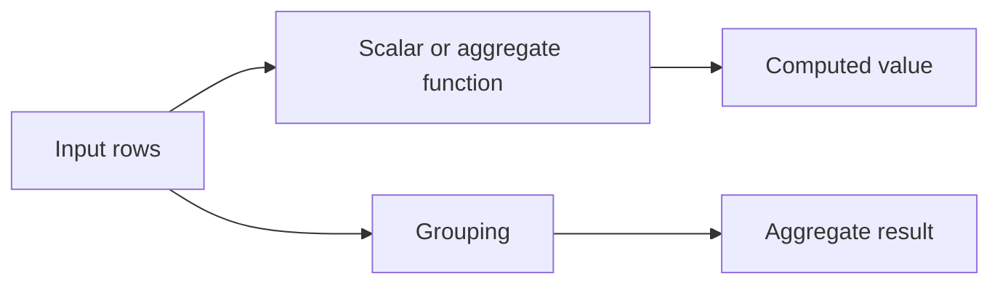

## **20. What is ORDER BY and GROUP BY?**

ORDER BY এবং GROUP BY SQL এর দুটি গুরুত্বপূর্ণ clauses যা data organization এবং analysis এর জন্য ব্যবহৃত হয়।

#### ORDER BY Clause:

ORDER BY clause result set কে specific column(s) অনুযায়ী sort করে। এটি data এর display order নিয়ন্ত্রণ করে।

```sql
-- Single column sorting (ascending by default)
SELECT name, salary FROM employees ORDER BY salary;

-- Descending order
SELECT name, salary FROM employees ORDER BY salary DESC;

-- Multiple column sorting
SELECT name, department, salary 
FROM employees 
ORDER BY department ASC, salary DESC;

-- Sorting by column position
SELECT name, salary FROM employees ORDER BY 2 DESC;  -- Sort by 2nd column (salary)
```

#### GROUP BY Clause:

GROUP BY clause rows গুলোকে group করে যাদের same values আছে specified columns এ। এটি aggregate functions এর সাথে ব্যবহৃত হয়।


```sql
-- Group by single column
SELECT department, COUNT(*) as employee_count
FROM employees
GROUP BY department;

-- Group by multiple columns
SELECT department, job_title, AVG(salary) as avg_salary
FROM employees
GROUP BY department, job_title;

-- Group with conditions
SELECT department, COUNT(*) as count
FROM employees
WHERE salary > 50000
GROUP BY department
HAVING COUNT(*) > 5;
```

### Can we use both together?

**হ্যাঁ, ORDER BY এবং GROUP BY একসাথে ব্যবহার করা যায়।** ORDER BY সবসময় GROUP BY এর পরে execute হয়।

#### **Combined Usage Examples:**

```sql
-- Department wise employee count, sorted by count
SELECT department, COUNT(*) as employee_count
FROM employees
GROUP BY department
ORDER BY employee_count DESC;

-- Region wise sales, sorted by region name
SELECT region, SUM(sale_amount) as total_sales
FROM sales
GROUP BY region
ORDER BY region ASC;

-- Complex example with multiple sorting
SELECT 
    department,
    job_title,
    COUNT(*) as emp_count,
    AVG(salary) as avg_salary
FROM employees
GROUP BY department, job_title
HAVING COUNT(*) > 2
ORDER BY department ASC, avg_salary DESC;
```

### What is the execution order of SQL clauses?

SQL clauses এর execution order নির্দিষ্ট এবং এটি query optimization এবং performance এর জন্য গুরুত্বপূর্ণ।

#### **SQL Execution Order:**

```
1. FROM        - Table selection and JOINs
2. WHERE       - Row filtering (before grouping)
3. GROUP BY    - Grouping rows
4. HAVING      - Group filtering (after grouping)
5. SELECT      - Column selection and calculations
6. DISTINCT    - Remove duplicates
7. ORDER BY    - Sort results
8. LIMIT/TOP   - Limit result count
```

#### **Detailed Explanation:**

**1. FROM Clause:**
```sql
-- First: Identify tables and perform JOINs
FROM employees e
JOIN departments d ON e.dept_id = d.dept_id
```

**2. WHERE Clause:**
```sql
-- Second: Filter individual rows
WHERE e.salary > 50000 AND d.location = 'Dhaka'
```

**3. GROUP BY Clause:**
```sql
-- Third: Group the filtered rows
GROUP BY d.dept_name
```

**4. HAVING Clause:**
```sql
-- Fourth: Filter the groups
HAVING COUNT(*) > 5
```

**5. SELECT Clause:**
```sql
-- Fifth: Select columns and perform calculations
SELECT d.dept_name, COUNT(*) as emp_count, AVG(e.salary) as avg_salary
```

**6. DISTINCT:**
```sql
-- Sixth: Remove duplicates (if specified)
SELECT DISTINCT d.dept_name, AVG(e.salary) as avg_salary
```

**7. ORDER BY Clause:**
```sql
-- Seventh: Sort the final result
ORDER BY avg_salary DESC
```

**8. LIMIT/TOP:**
```sql
-- Eighth: Limit the number of rows returned
LIMIT 10
```

#### **Complete Example:**

```sql
-- Full query showing execution order
SELECT                          -- 5. Select and calculate
    d.dept_name,
    COUNT(*) as emp_count,
    AVG(e.salary) as avg_salary
FROM employees e                -- 1. From tables
JOIN departments d ON e.dept_id = d.dept_id
WHERE e.hire_date > '2020-01-01'    -- 2. Filter rows
GROUP BY d.dept_name                -- 3. Group rows
HAVING COUNT(*) > 3                 -- 4. Filter groups
ORDER BY avg_salary DESC            -- 6. Sort results  
LIMIT 5;                           -- 7. Limit output

-- Execution flow:
-- 1. Join employees with departments
-- 2. Keep only employees hired after 2020
-- 3. Group by department name
-- 4. Keep only departments with more than 3 employees
-- 5. Calculate count and average salary for each group
-- 6. Sort by average salary (highest first)
-- 7. Return only top 5 results
```

#### **Why Order Matters:**

**Performance Impact:**
```sql
-- Good: WHERE filters before GROUP BY (fewer rows to group)
SELECT department, COUNT(*)
FROM employees
WHERE salary > 50000      -- Filters 10,000 rows to 3,000
GROUP BY department;      -- Groups only 3,000 rows

-- Bad: HAVING filters after GROUP BY (more processing)
SELECT department, COUNT(*)
FROM employees
GROUP BY department       -- Groups all 10,000 rows
HAVING AVG(salary) > 50000;  -- Then filters the groups
```

**Alias Usage:**
```sql
-- This works because ORDER BY executes after SELECT
SELECT name, salary * 12 as annual_salary
FROM employees
ORDER BY annual_salary DESC;  -- Can use alias

-- This doesn't work because WHERE executes before SELECT
SELECT name, salary * 12 as annual_salary
FROM employees
WHERE annual_salary > 600000;  -- ❌ Error: alias not available yet
```

---

## **21. What are Aggregate Functions in SQL?**

Aggregate functions SQL এ এমন functions যা multiple rows এর উপর calculation perform করে এবং single result return করে। এগুলো data analysis এবং reporting এর জন্য অত্যন্ত গুরুত্বপূর্ণ।

#### Common Aggregate Functions:

##### **1. COUNT() - Counting Rows**

```sql
-- Count all rows
SELECT COUNT(*) FROM employees;

-- Count non-NULL values
SELECT COUNT(email) FROM employees;

-- Count distinct values
SELECT COUNT(DISTINCT department) FROM employees;
```

##### **2. SUM() - Addition**

```sql
-- Total sales
SELECT SUM(sale_amount) FROM sales;

-- Sum with condition
SELECT SUM(CASE WHEN status = 'completed' THEN amount ELSE 0 END) as completed_sales
FROM orders;
```

##### **3. AVG() - Average**

```sql
-- Average salary
SELECT AVG(salary) FROM employees;

-- Average by group
SELECT department, AVG(salary) as avg_dept_salary
FROM employees
GROUP BY department;
```

##### **4. MIN() and MAX() - Minimum and Maximum**

```sql
-- Minimum and maximum salary
SELECT MIN(salary) as min_salary, MAX(salary) as max_salary
FROM employees;

-- Earliest and latest hire dates
SELECT MIN(hire_date) as first_hire, MAX(hire_date) as latest_hire
FROM employees;
```

#### Real-world Examples:

##### **Sales Analytics:**

```sql
-- Comprehensive sales report
SELECT 
    region,
    COUNT(*) as total_orders,
    COUNT(DISTINCT customer_id) as unique_customers,
    SUM(order_amount) as total_revenue,
    AVG(order_amount) as avg_order_value,
    MIN(order_amount) as min_order,
    MAX(order_amount) as max_order
FROM orders
WHERE order_date >= '2023-01-01'
GROUP BY region
ORDER BY total_revenue DESC;
```

##### **Employee Statistics:**

```sql
-- Department-wise employee analysis
SELECT 
    department,
    COUNT(*) as employee_count,
    AVG(salary) as avg_salary,
    MIN(salary) as min_salary,
    MAX(salary) as max_salary,
    SUM(salary) as total_payroll
FROM employees
WHERE status = 'active'
GROUP BY department
HAVING COUNT(*) > 5
ORDER BY avg_salary DESC;
```

### What happens when you use aggregate functions with NULL values?

Aggregate functions সাধারণত NULL values ignore করে, কিন্তু different functions এর behavior আলাদা।

#### **COUNT() with NULL:**

```sql
-- Sample data with NULLs
CREATE TABLE test_employees (
    id INT,
    name VARCHAR(50),
    email VARCHAR(100),  -- Some emails are NULL
    salary DECIMAL(10,2)
);

INSERT INTO test_employees VALUES
(1, 'আলী', 'ali@company.com', 50000),
(2, 'ফাতেমা', NULL, 45000),           -- NULL email
(3, 'করিম', 'karim@company.com', 55000),
(4, 'রহিম', NULL, 48000),            -- NULL email
(5, 'আয়েশা', 'ayesha@company.com', 52000);

-- Different COUNT results
SELECT 
    COUNT(*) as total_rows,           -- 5 (counts all rows)
    COUNT(email) as emails_provided,  -- 3 (ignores NULLs)
    COUNT(DISTINCT email) as unique_emails  -- 3 (ignores NULLs, counts distinct)
FROM test_employees;
```

#### **SUM(), AVG(), MIN(), MAX() with NULL:**

```sql
-- These functions ignore NULL values
SELECT 
    COUNT(*) as total_employees,      -- 5
    COUNT(salary) as salary_records,  -- 5 (no NULLs in salary)
    SUM(salary) as total_payroll,     -- 250000 (ignores NULLs if any)
    AVG(salary) as avg_salary         -- 50000 (sum/count of non-NULLs)
FROM test_employees;

-- Example with NULL salaries
INSERT INTO test_employees VALUES (6, 'নাসির', 'nasir@company.com', NULL);

SELECT 
    COUNT(*) as total_employees,      -- 6
    COUNT(salary) as salary_records,  -- 5 (NULL ignored)
    SUM(salary) as total_payroll,     -- 250000 (NULL ignored)
    AVG(salary) as avg_salary         -- 50000 (250000/5, not 250000/6)
FROM test_employees;
```

## **22. What is a Window Function?**

Window function related row-এর ওপর calculation করে, কিন্তু `GROUP BY`-এর মতো row collapse করে না। `OVER()` clause দিয়ে window define করা হয়।

### ROW_NUMBER, RANK এবং DENSE_RANK

```sql
WITH scores(name, score) AS (
    VALUES ('Asha', 95), ('Rafi', 90), ('Mina', 90), ('Nabil', 80)
)
SELECT name,
       score,
       ROW_NUMBER() OVER (ORDER BY score DESC) AS row_no,
       RANK()       OVER (ORDER BY score DESC) AS rank_no,
       DENSE_RANK() OVER (ORDER BY score DESC) AS dense_rank_no
FROM scores
ORDER BY score DESC, name;
```

**Sample response:**

```text
name  | score | row_no | rank_no | dense_rank_no
------+-------+--------+---------+--------------
Asha  | 95    | 1      | 1       | 1
Mina  | 90    | 2      | 2       | 2
Rafi  | 90    | 3      | 2       | 2
Nabil | 80    | 4      | 4       | 3
```

`ROW_NUMBER()` প্রতিটি row-কে আলাদা sequence দেয়। `RANK()` tie-এর পরে gap রাখে, আর `DENSE_RANK()` gap রাখে না। Tie-এর মধ্যে deterministic `ROW_NUMBER()` চাইলে window-এর `ORDER BY`-তে unique tie-breaker যোগ করতে হবে।

### PARTITION BY বনাম GROUP BY

```sql
WITH sales(employee, department, amount) AS (
    VALUES ('Asha', 'Engineering', 500),
           ('Rafi', 'Engineering', 300),
           ('Mina', 'Sales', 700)
)
SELECT employee,
       department,
       amount,
       SUM(amount) OVER (PARTITION BY department) AS department_total
FROM sales
ORDER BY department, employee;
```

**Sample response:**

```text
employee | department  | amount | department_total
---------+-------------+--------+-----------------
Asha     | Engineering | 500    | 800
Rafi     | Engineering | 300    | 800
Mina     | Sales       | 700    | 700
```

এখানে প্রতিটি employee row থাকে; `GROUP BY department` ব্যবহার করলে department-পিছু একটি row হতো।

### LAG এবং LEAD

```sql
WITH monthly_sales(month_no, amount) AS (
    VALUES (1, 1000), (2, 1250), (3, 1100)
)
SELECT month_no,
       amount,
       LAG(amount)  OVER (ORDER BY month_no) AS previous_amount,
       LEAD(amount) OVER (ORDER BY month_no) AS next_amount
FROM monthly_sales
ORDER BY month_no;
```

**Sample response:**

```text
month_no | amount | previous_amount | next_amount
---------+--------+-----------------+------------
1        | 1000   | NULL            | 1250
2        | 1250   | 1000            | 1100
3        | 1100   | 1250            | NULL
```


## **23. What is CTE (Common Table Expression)?**

CTE (Common Table Expression) হলো একটি temporary named result set যা একটি single SQL statement এর scope এর মধ্যে exist করে। এটি complex queries কে more readable এবং maintainable বানায়।


### Simple CTE Example:

```sql
-- Without CTE (complex subquery)
SELECT *
FROM (
    SELECT 
        department,
        AVG(salary) as avg_salary
    FROM employees
    GROUP BY department
) dept_avg
WHERE avg_salary > 50000;

-- With CTE (more readable)
WITH department_averages AS (
    SELECT 
        department,
        AVG(salary) as avg_salary
    FROM employees
    GROUP BY department
)
SELECT *
FROM department_averages
WHERE avg_salary > 50000;
```

### Types of CTEs:

#### **1. Simple CTE:**

```sql
WITH high_performers AS (
    SELECT 
        employee_id,
        name,
        department,
        salary,
        performance_rating
    FROM employees
    WHERE performance_rating >= 4.0
)
SELECT 
    department,
    COUNT(*) as high_performer_count,
    AVG(salary) as avg_salary
FROM high_performers
GROUP BY department;
```

#### **2. Multiple CTEs:**

```sql
WITH 
dept_stats AS (
    SELECT 
        department,
        COUNT(*) as employee_count,
        AVG(salary) as avg_salary
    FROM employees
    GROUP BY department
),
high_salary_depts AS (
    SELECT department
    FROM dept_stats
    WHERE avg_salary > 60000
)
SELECT 
    e.name,
    e.department,
    e.salary,
    ds.avg_salary as dept_average
FROM employees e
JOIN dept_stats ds ON e.department = ds.department
JOIN high_salary_depts hsd ON e.department = hsd.department
ORDER BY e.department, e.salary DESC;
```

## **24. What are Temporary Tables?**

Temporary tables হলো এমন tables যা database session এর duration এর জন্য temporarily exist করে। Session শেষ হলে এগুলো automatically drop হয়ে যায়।

### Types of Temporary Tables:

#### **1. Local Temporary Tables (Single Connection):**

```sql
-- Create local temporary table (prefix with #)
CREATE TABLE #temp_employees (
    employee_id INT,
    name VARCHAR(50),
    department VARCHAR(50),
    salary DECIMAL(10,2)
);

-- Insert data
INSERT INTO #temp_employees VALUES
(1, 'আলী', 'IT', 75000),
(2, 'ফাতেমা', 'HR', 65000),
(3, 'করিম', 'Finance', 80000);

-- Use the temporary table
SELECT 
    department,
    COUNT(*) as employee_count,
    AVG(salary) as avg_salary
FROM #temp_employees
GROUP BY department;

-- Table automatically drops when session ends
```

#### **2. Global Temporary Tables (Multiple Connections):**

```sql
-- Create global temporary table (prefix with ##)
CREATE TABLE ##global_temp_sales (
    sale_id INT,
    product_name VARCHAR(100),
    sale_amount DECIMAL(10,2),
    sale_date DATE
);

-- Accessible from multiple connections
-- Drops when last connection using it closes
```

#### **3. Table Variables:**

```sql
-- Table variable (exists only in current batch)
DECLARE @temp_products TABLE (
    product_id INT,
    product_name VARCHAR(100),
    price DECIMAL(10,2),
    category VARCHAR(50)
);

-- Insert data
INSERT INTO @temp_products VALUES
(1, 'ল্যাপটপ', 75000, 'Electronics'),
(2, 'মোবাইল', 25000, 'Electronics'),
(3, 'বই', 500, 'Education');

-- Use table variable
SELECT category, AVG(price) as avg_price
FROM @temp_products
GROUP BY category;
```

### When to use Temporary Tables vs CTEs?

#### **Use Temporary Tables When:**

**1. Multiple References Needed:**
```sql
-- Temporary table for multiple uses
CREATE TABLE #monthly_sales_summary (
    month DATE,
    total_sales DECIMAL(15,2),
    total_orders INT,
    avg_order_value DECIMAL(10,2)
);

INSERT INTO #monthly_sales_summary
SELECT 
    DATE_TRUNC('month', order_date) as month,
    SUM(order_amount) as total_sales,
    COUNT(*) as total_orders,
    AVG(order_amount) as avg_order_value
FROM orders
WHERE order_date >= '2023-01-01'
GROUP BY DATE_TRUNC('month', order_date);

-- Use multiple times
SELECT * FROM #monthly_sales_summary WHERE total_sales > 100000;
SELECT * FROM #monthly_sales_summary WHERE total_orders > 1000;
SELECT * FROM #monthly_sales_summary ORDER BY avg_order_value DESC;
```

**2. Complex Processing with Indexes:**
```sql
-- Temporary table with index for performance
CREATE TABLE #large_dataset_processed (
    customer_id INT,
    total_purchases DECIMAL(15,2),
    purchase_count INT,
    avg_purchase DECIMAL(10,2),
    last_purchase_date DATE
);

-- Create index for better performance
CREATE INDEX IX_temp_customer ON #large_dataset_processed(customer_id);

-- Process large dataset
INSERT INTO #large_dataset_processed
SELECT 
    customer_id,
    SUM(order_amount),
    COUNT(*),
    AVG(order_amount),
    MAX(order_date)
FROM orders
WHERE order_date >= '2020-01-01'
GROUP BY customer_id;

-- Multiple complex queries using indexed temp table
SELECT * FROM #large_dataset_processed 
WHERE total_purchases > 50000 
ORDER BY last_purchase_date DESC;
```

**3. Step-by-Step Data Processing:**
```sql
-- Multi-step data processing
CREATE TABLE #sales_analysis (
    product_id INT,
    product_name VARCHAR(100),
    total_sales DECIMAL(15,2),
    total_quantity INT,
    performance_score DECIMAL(5,2)
);

-- Step 1: Basic aggregation
INSERT INTO #sales_analysis (product_id, product_name, total_sales, total_quantity)
SELECT 
    p.product_id,
    p.product_name,
    SUM(oi.quantity * oi.price),
    SUM(oi.quantity)
FROM products p
JOIN order_items oi ON p.product_id = oi.product_id
GROUP BY p.product_id, p.product_name;

-- Step 2: Calculate performance score
UPDATE #sales_analysis
SET performance_score = (total_sales / 1000) + (total_quantity / 100);

-- Step 3: Final analysis
SELECT 
    product_name,
    total_sales,
    performance_score,
    CASE 
        WHEN performance_score > 100 THEN 'Excellent'
        WHEN performance_score > 50 THEN 'Good'
        ELSE 'Needs Improvement'
    END as performance_category
FROM #sales_analysis
ORDER BY performance_score DESC;
```

#### **Use CTEs When:**

**1. Single Use, Simple Logic:**
```sql
-- CTE for single use with immediate consumption
WITH high_value_customers AS (
    SELECT customer_id, SUM(order_amount) as total_spent
    FROM orders
    WHERE order_date >= '2023-01-01'
    GROUP BY customer_id
    HAVING SUM(order_amount) > 10000
)
SELECT 
    c.customer_name,
    hvc.total_spent
FROM high_value_customers hvc
JOIN customers c ON hvc.customer_id = c.customer_id
ORDER BY hvc.total_spent DESC;
```

**2. Readability and Maintainability:**
```sql
-- CTE makes complex query more readable
WITH 
monthly_sales AS (
    SELECT 
        DATE_TRUNC('month', order_date) as month,
        SUM(order_amount) as total_sales
    FROM orders
    GROUP BY DATE_TRUNC('month', order_date)
),
sales_growth AS (
    SELECT 
        month,
        total_sales,
        LAG(total_sales) OVER (ORDER BY month) as prev_month_sales
    FROM monthly_sales
)
SELECT 
    month,
    total_sales,
    prev_month_sales,
    ROUND(
        (total_sales - prev_month_sales) * 100.0 / prev_month_sales, 2
    ) as growth_percentage
FROM sales_growth
WHERE prev_month_sales IS NOT NULL
ORDER BY month;
```

### Comparison Table:

| Feature | Temporary Tables | CTEs |
|---------|------------------|------|
| **Scope** | Session/Batch level | Single statement |
| **Reusability** | Multiple references | Single use |
| **Indexing** | Supported | Not supported |
| **Statistics** | Available | Not available |
| **Memory Usage** | Can use disk | Memory only |
| **Performance** | Better for complex/large data | Better for simple operations |
| **Recursive Support** | No | Yes |

### Real-world Decision Examples:

#### **Use Temporary Table:**
```sql
-- Complex monthly report with multiple sections
CREATE TABLE #monthly_report_data (
    metric_name VARCHAR(100),
    metric_value DECIMAL(15,2),
    previous_month DECIMAL(15,2),
    growth_rate DECIMAL(5,2)
);

-- Populate with various metrics
INSERT INTO #monthly_report_data VALUES
('Total Sales', 150000, 140000, 7.14),
('New Customers', 250, 200, 25.00),
('Average Order Value', 600, 580, 3.45);

-- Generate multiple report sections
SELECT * FROM #monthly_report_data WHERE growth_rate > 5;
SELECT * FROM #monthly_report_data ORDER BY metric_value DESC;
SELECT AVG(growth_rate) as overall_growth FROM #monthly_report_data;
```

#### **Use CTE:**
```sql
-- One-time analysis with clear logic flow
WITH customer_segments AS (
    SELECT 
        customer_id,
        CASE 
            WHEN total_orders > 20 THEN 'VIP'
            WHEN total_orders > 10 THEN 'Regular'
            ELSE 'New'
        END as segment
    FROM (
        SELECT customer_id, COUNT(*) as total_orders
        FROM orders
        GROUP BY customer_id
    ) customer_order_counts
)
SELECT 
    segment,
    COUNT(*) as customer_count,
    COUNT(*) * 100.0 / SUM(COUNT(*)) OVER() as percentage
FROM customer_segments
GROUP BY segment;
```

---

## **25. What is CASE Statement?**

CASE statement SQL এর conditional logic implement করার জন্য ব্যববহৃত একটি powerful construct। এটি if-else logic এর মতো কাজ করে এবং values বা conditions এর উপর ভিত্তি করে different results return করে।

### Types of CASE Statements:

#### **1. Simple CASE (Value-based):**

```sql
-- Basic syntax
CASE column_name
    WHEN value1 THEN result1
    WHEN value2 THEN result2
    ELSE default_result
END
```

**Example:**
```sql
SELECT 
    employee_id,
    name,
    department,
    CASE department
        WHEN 'IT' THEN 'Technology'
        WHEN 'HR' THEN 'Human Resources'
        WHEN 'Finance' THEN 'Financial Services'
        ELSE 'Other Department'
    END as department_full_name
FROM employees;
```

#### **2. Searched CASE (Condition-based):**

```sql
-- Basic syntax
CASE 
    WHEN condition1 THEN result1
    WHEN condition2 THEN result2
    ELSE default_result
END
```

**Example:**
```sql
SELECT 
    employee_id,
    name,
    salary,
    CASE 
        WHEN salary >= 80000 THEN 'High'
        WHEN salary >= 50000 THEN 'Medium'
        WHEN salary >= 30000 THEN 'Low'
        ELSE 'Entry Level'
    END as salary_grade
FROM employees;
```

### Real-world CASE Statement Examples:

#### **1. Sales Performance Analysis:**

```sql
SELECT 
    salesperson_id,
    name,
    total_sales,
    target_sales,
    
    -- Performance category
    CASE 
        WHEN total_sales >= target_sales * 1.2 THEN 'Excellent (120%+)'
        WHEN total_sales >= target_sales THEN 'Target Met (100%+)'
        WHEN total_sales >= target_sales * 0.8 THEN 'Close (80%+)'
        ELSE 'Below Expectations (<80%)'
    END as performance_category,
    
    -- Bonus calculation
    CASE 
        WHEN total_sales >= target_sales * 1.2 THEN salary * 0.15
        WHEN total_sales >= target_sales THEN salary * 0.10
        WHEN total_sales >= target_sales * 0.8 THEN salary * 0.05
        ELSE 0
    END as bonus_amount,
    
    -- Achievement percentage
    CASE 
        WHEN target_sales > 0 THEN ROUND(total_sales * 100.0 / target_sales, 2)
        ELSE 0
    END as achievement_percentage
    
FROM sales_performance
ORDER BY achievement_percentage DESC;
```

#### **2. Customer Segmentation:**

```sql
SELECT 
    customer_id,
    customer_name,
    total_orders,
    total_spent,
    
    -- Customer tier based on multiple criteria
    CASE 
        WHEN total_spent > 100000 AND total_orders > 50 THEN 'Platinum'
        WHEN total_spent > 50000 OR total_orders > 25 THEN 'Gold'
        WHEN total_spent > 20000 OR total_orders > 10 THEN 'Silver'
        ELSE 'Bronze'
    END as customer_tier,
    
    -- Discount eligibility
    CASE 
        WHEN total_spent > 100000 THEN 15
        WHEN total_spent > 50000 THEN 10
        WHEN total_spent > 20000 THEN 5
        ELSE 0
    END as discount_percentage,
    
    -- Marketing message
    CASE 
        WHEN total_orders = 0 THEN 'Welcome offer available!'
        WHEN total_orders = 1 THEN 'Come back for more!'
        WHEN total_orders < 5 THEN 'Become a regular customer'
        WHEN total_orders < 20 THEN 'You are a valued customer'
        ELSE 'Thank you for your loyalty!'
    END as marketing_message
    
FROM customer_summary;
```

#### **3. Inventory Management:**

```sql
SELECT 
    product_id,
    product_name,
    current_stock,
    reorder_level,
    max_stock_level,
    
    -- Stock status
    CASE 
        WHEN current_stock <= 0 THEN 'Out of Stock'
        WHEN current_stock <= reorder_level THEN 'Low Stock - Reorder Needed'
        WHEN current_stock >= max_stock_level THEN 'Overstock'
        ELSE 'Normal Stock'
    END as stock_status,
    
    -- Priority level
    CASE 
        WHEN current_stock <= 0 THEN 'Critical'
        WHEN current_stock <= reorder_level THEN 'High'
        WHEN current_stock <= reorder_level * 1.5 THEN 'Medium'
        ELSE 'Low'
    END as reorder_priority,
    
    -- Recommended action
    CASE 
        WHEN current_stock <= 0 THEN 'URGENT: Purchase immediately'
        WHEN current_stock <= reorder_level THEN 'Place order for ' || (max_stock_level - current_stock) || ' units'
        WHEN current_stock >= max_stock_level THEN 'Consider promotion or reduce ordering'
        ELSE 'No action needed'
    END as recommended_action
    
FROM inventory
ORDER BY 
    CASE 
        WHEN current_stock <= 0 THEN 1
        WHEN current_stock <= reorder_level THEN 2
        ELSE 3
    END, product_name;
```

### Advanced CASE Statement Usage:

#### **1. Nested CASE Statements:**

```sql
SELECT 
    employee_id,
    name,
    department,
    years_of_experience,
    performance_rating,
    
    -- Complex promotion eligibility
    CASE department
        WHEN 'IT' THEN 
            CASE 
                WHEN years_of_experience >= 5 AND performance_rating >= 4.0 THEN 'Senior Developer'
                WHEN years_of_experience >= 3 AND performance_rating >= 3.5 THEN 'Mid-level Developer'
                WHEN years_of_experience >= 1 THEN 'Junior Developer'
                ELSE 'Trainee Developer'
            END
        WHEN 'Sales' THEN
            CASE 
                WHEN years_of_experience >= 7 AND performance_rating >= 4.5 THEN 'Sales Director'
                WHEN years_of_experience >= 4 AND performance_rating >= 4.0 THEN 'Senior Sales Manager'
                WHEN years_of_experience >= 2 AND performance_rating >= 3.5 THEN 'Sales Manager'
                ELSE 'Sales Representative'
            END
        ELSE 
            CASE 
                WHEN years_of_experience >= 5 THEN 'Senior'
                WHEN years_of_experience >= 2 THEN 'Mid-level'
                ELSE 'Junior'
            END
    END as suggested_position
    
FROM employees;
```

#### **2. CASE in Aggregations:**

```sql
-- Conditional aggregation using CASE
SELECT 
    department,
    
    -- Count employees by salary range
    COUNT(CASE WHEN salary >= 80000 THEN 1 END) as high_salary_count,
    COUNT(CASE WHEN salary BETWEEN 50000 AND 79999 THEN 1 END) as medium_salary_count,
    COUNT(CASE WHEN salary < 50000 THEN 1 END) as low_salary_count,
    
    -- Sum salaries by experience level
    SUM(CASE WHEN years_of_experience >= 5 THEN salary ELSE 0 END) as senior_payroll,
    SUM(CASE WHEN years_of_experience < 5 THEN salary ELSE 0 END) as junior_payroll,
    
    -- Average performance by gender
    AVG(CASE WHEN gender = 'M' THEN performance_rating END) as male_avg_performance,
    AVG(CASE WHEN gender = 'F' THEN performance_rating END) as female_avg_performance,
    
    -- Percentage calculations
    ROUND(
        COUNT(CASE WHEN salary >= 80000 THEN 1 END) * 100.0 / COUNT(*), 2
    ) as high_salary_percentage
    
FROM employees
GROUP BY department;
```

#### **3. CASE in WHERE Clause:**

```sql
-- Dynamic filtering based on user input
DECLARE @filter_type VARCHAR(20) = 'performance';  -- Could be 'salary', 'experience', 'performance'
DECLARE @filter_value DECIMAL(10,2) = 4.0;

SELECT *
FROM employees
WHERE 
    CASE @filter_type
        WHEN 'salary' THEN 
            CASE WHEN salary >= @filter_value THEN 1 ELSE 0 END
        WHEN 'experience' THEN 
            CASE WHEN years_of_experience >= @filter_value THEN 1 ELSE 0 END
        WHEN 'performance' THEN 
            CASE WHEN performance_rating >= @filter_value THEN 1 ELSE 0 END
        ELSE 1
    END = 1;
```

#### **4. CASE in ORDER BY:**

```sql
-- Custom sorting logic
SELECT 
    product_name,
    category,
    price,
    stock_status
FROM products
ORDER BY 
    -- Priority sorting: Out of stock first, then low stock, then normal
    CASE stock_status
        WHEN 'Out of Stock' THEN 1
        WHEN 'Low Stock' THEN 2
        WHEN 'Normal' THEN 3
        ELSE 4
    END,
    -- Then by category priority
    CASE category
        WHEN 'Electronics' THEN 1
        WHEN 'Clothing' THEN 2
        WHEN 'Books' THEN 3
        ELSE 4
    END,
    price DESC;  -- Finally by price (highest first)
```

### CASE Statement Performance Tips:

#### **1. Use Simple CASE When Possible:**

```sql
-- Efficient: Simple CASE
SELECT 
    status,
    CASE status
        WHEN 'A' THEN 'Active'
        WHEN 'I' THEN 'Inactive'
        WHEN 'P' THEN 'Pending'
        ELSE 'Unknown'
    END as status_description
FROM records;

-- Less efficient: Searched CASE for simple comparisons
SELECT 
    status,
    CASE 
        WHEN status = 'A' THEN 'Active'
        WHEN status = 'I' THEN 'Inactive'
        WHEN status = 'P' THEN 'Pending'
        ELSE 'Unknown'
    END as status_description
FROM records;
```

#### **2. Order Conditions by Frequency:**

```sql
-- Order WHEN clauses by most common to least common
SELECT 
    customer_type,
    CASE 
        WHEN customer_type = 'Regular' THEN 'Standard Service'  -- Most common first
        WHEN customer_type = 'Premium' THEN 'Priority Service'
        WHEN customer_type = 'VIP' THEN 'Exclusive Service'     -- Least common last
        ELSE 'Basic Service'
    END as service_level
FROM customers;
```

#### **3. Avoid Repeated CASE Logic:**

```sql
-- Instead of repeating CASE logic, use CTEs or temp tables
WITH customer_tiers AS (
    SELECT 
        customer_id,
        total_spent,
        CASE 
            WHEN total_spent > 100000 THEN 'Platinum'
            WHEN total_spent > 50000 THEN 'Gold'
            WHEN total_spent > 20000 THEN 'Silver'
            ELSE 'Bronze'
        END as tier
    FROM customer_totals
)
SELECT 
    tier,
    COUNT(*) as customer_count,
    AVG(total_spent) as avg_spent_per_tier
FROM customer_tiers
GROUP BY tier;
```

This comprehensive documentation covers all the fundamental SQL concepts with Bengali-English explanations, practical examples, and real-world applications. Each section provides both theoretical understanding and hands-on examples that developers can use in their daily work.
