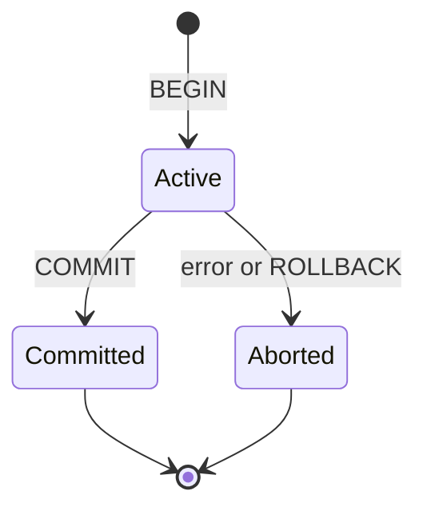

## **51. What is a transaction?**

Transaction হল database operations এর একটি logical unit যা complete হতে হবে as a whole অথবা একেবারেই হবে না। এটি database consistency এবং integrity maintain করার জন্য অত্যন্ত গুরুত্বপূর্ণ।

**Technical definition:** Transaction হল এক বা একাধিক SQL statements এর একটি sequence যা একসাথে execute হয় এবং সফল হলে সব changes permanent হয়, আর fail হলে সব changes undo হয়ে যায়।

### Why are transactions important?

Transactions গুরুত্বপূর্ণ কয়েকটি কারণে:

**1. Data Consistency:**
```sql
-- Bank transfer example
BEGIN TRANSACTION
    UPDATE accounts SET balance = balance - 1000 WHERE account_id = 'A001';  -- Debit
    UPDATE accounts SET balance = balance + 1000 WHERE account_id = 'A002';  -- Credit
COMMIT;
```
যদি first UPDATE successful হয় কিন্তু second UPDATE fail হয়, transaction rollback হবে। এতে data inconsistent হবে না।

**2. Business Logic Protection:**
```sql
-- E-commerce order processing
BEGIN TRANSACTION
    INSERT INTO orders (customer_id, total_amount) VALUES (123, 500);
    UPDATE inventory SET stock = stock - 1 WHERE product_id = 'P001';
    INSERT INTO order_items (order_id, product_id, quantity) VALUES (LAST_INSERT_ID(), 'P001', 1);
    
    -- If any operation fails, entire order is cancelled
COMMIT;
```

**3. Multi-user Environment:**
- একই সময়ে multiple users যখন same data modify করে
- Transaction isolation প্রদান করে
- Data corruption prevent করে

### What makes a transaction atomic?

**Atomicity** হল ACID properties এর মধ্যে প্রথমটি। এর মানে transaction এর সব operations either completely successful হবে অথবা completely fail হবে।

**All-or-Nothing Principle:**
```sql
-- Atomic transaction example
BEGIN TRANSACTION
    DELETE FROM order_items WHERE order_id = 12345;     -- Step 1
    DELETE FROM payments WHERE order_id = 12345;        -- Step 2  
    DELETE FROM orders WHERE order_id = 12345;          -- Step 3
    
    -- If Step 2 fails, Step 1 will be rolled back automatically
COMMIT;
```

**Implementation Mechanisms:**
- **Write-Ahead Logging (WAL):** Changes log এ লেখা হয় before actual data modification
- **Shadow Paging:** Original data copy রাখা হয় until transaction commits
- **Rollback Segments:** Undo information store করা হয় automatic rollback এর জন্য

---

## **52. What is COMMIT and ROLLBACK?**

**COMMIT** এবং **ROLLBACK** হল transaction control করার জন্য দুটি fundamental commands।

### COMMIT Statement:

**COMMIT** transaction এর সব changes কে permanent করে database এ।

```sql
BEGIN TRANSACTION
    INSERT INTO employees (name, department, salary) VALUES ('রহিম', 'IT', 50000);
    UPDATE employees SET salary = salary * 1.1 WHERE department = 'IT';
COMMIT;  -- এখন সব changes permanent
```

**COMMIT এর পরে কী হয়:**
- সব changes physical storage এ write হয়
- Transaction locks release হয়
- Other transactions এখন এই changes দেখতে পাবে
- Rollback আর possible না

### ROLLBACK Statement:

**ROLLBACK** transaction এর সব changes কে undo করে দেয়।

```sql
BEGIN TRANSACTION
    DELETE FROM products WHERE category = 'Electronics';
    -- Oops! এটা ভুল হয়েছে
ROLLBACK;  -- সব deletions undo হবে
```

**ROLLBACK এর পরে কী হয়:**
- সব uncommitted changes undo হয়
- Database আগের state এ ফিরে যায়
- Transaction locks release হয়
- Memory থেকে temporary changes clear হয়

### Can you rollback after commit?

**না, COMMIT এর পরে ROLLBACK করা যায় না।** COMMIT একবার execute হলে changes permanent হয়ে যায়।

```sql
BEGIN TRANSACTION
    UPDATE products SET price = price * 0.5;  -- 50% discount
COMMIT;  -- Changes are now permanent

ROLLBACK;  -- ❌ This will give error: "No active transaction to rollback"
```

**তবে alternatives আছে:**

**1. Explicit Reverse Operations:**
```sql
-- Manual undo through reverse operations
UPDATE products SET price = price * 2;  -- Reverse the 50% discount
```

**2. Database Backup Recovery:**
```sql
-- Restore from backup (if available)
RESTORE DATABASE mydb FROM BACKUP_FILE = 'backup_before_changes.bak';
```

**3. Point-in-Time Recovery:**
```sql
-- MySQL example
mysqlbinlog --start-datetime="2023-12-01 10:00:00" 
           --stop-datetime="2023-12-01 09:59:59" 
           binlog_file | mysql -u root -p
```

### What is auto-commit mode?

**Auto-commit mode** হল database এর একটি setting যেখানে প্রতিটি individual SQL statement automatically commit হয়ে যায়।

**Auto-commit ON (Default in most databases):**
```sql
-- Each statement commits automatically
INSERT INTO users (name) VALUES ('আলী');      -- Automatically committed
UPDATE users SET name = 'আলী আহমেদ' WHERE id = 1;  -- Automatically committed
DELETE FROM users WHERE id = 1;                -- Automatically committed
```

**Auto-commit OFF:**
```sql
-- Disable auto-commit
SET autocommit = 0;  -- MySQL
-- SET AUTOCOMMIT OFF;  -- Oracle/PostgreSQL

INSERT INTO users (name) VALUES ('করিম');
UPDATE users SET age = 25 WHERE name = 'করিম';
-- Changes are not permanent yet

COMMIT;  -- Now both changes are committed together
```

**When to use Auto-commit OFF:**
- Complex business operations
- Multiple related changes
- Error handling scenarios
- Performance optimization (batch operations)

**Example: Bank Transfer with Auto-commit OFF:**
```sql
SET autocommit = 0;

BEGIN TRANSACTION;
    -- Deduct from source account  
    UPDATE bank_accounts 
    SET balance = balance - 5000 
    WHERE account_number = 'ACC001';
    
    -- Check if sufficient balance
    IF (SELECT balance FROM bank_accounts WHERE account_number = 'ACC001') < 0 THEN
        ROLLBACK;
        SELECT 'Insufficient funds' as error_message;
    ELSE
        -- Credit to destination account
        UPDATE bank_accounts 
        SET balance = balance + 5000 
        WHERE account_number = 'ACC002';
        
        COMMIT;
        SELECT 'Transfer successful' as success_message;
    END IF;
```

---

## **53. What is SAVEPOINT in SQL?**

**SAVEPOINT** মূলত একটি বড় বা জটিল ট্রানজেকশনের ভেতরে ছোট ছোট "চেকপয়েন্ট" (checkpoints) তৈরি করতে ব্যবহৃত হয়। এটি আপনাকে পুরো ট্রানজেকশনটি বাতিল না করে কেবল একটি নির্দিষ্ট অংশ পর্যন্ত **Partial Rollback** করার সুবিধা দেয়।

### Basic SAVEPOINT Syntax:

```sql
BEGIN TRANSACTION;
    -- Some operations
    SAVEPOINT savepoint_name;
    -- More operations
    ROLLBACK TO savepoint_name;  -- Rollback to savepoint only
    -- Continue with transaction
COMMIT;
```

### When is SAVEPOINT used?
SAVEPOINT সাধারণত নিচের ৩টি পরিস্থিতিতে সবচেয়ে বেশি ব্যবহৃত হয়
#### ১.Complex Business Logic

অনেক সময় একটি ট্রানজেকশনে একাধিক কাজ থাকে। যেমন—একটি ই-কমার্স অর্ডারে কাস্টমার প্রোফাইল তৈরি করা এবং সাবস্ক্রিপশন কেনা। যদি সাবস্ক্রিপশন পেমেন্ট ফেইল করে, আপনি হয়তো পুরো transaction বাতিল না করে কেবল সাবস্ক্রিপশন অংশটুকু রোলব্যাক করতে চান এবং কাস্টমার প্রোফাইলটি সেভ রাখতে চান।

#### ২.Error Recovery

বাল্ক ডেটা ইমপোর্ট বা বড় কোনো প্রসেসিংয়ের সময় যদি কোনো একটি নির্দিষ্ট ধাপে এরর আসে, তবে সেই ধাপ থেকে পুনরায় চেষ্টা করার জন্য সেভপয়েন্ট ব্যবহৃত হয়। এতে করে আগের সফল কাজগুলো নষ্ট হয় না।

```sql
BEGIN TRANSACTION;
    INSERT INTO table1 VALUES (...);
    SAVEPOINT sp1; -- প্রথম ধাপ শেষে চেকপয়েন্ট

    INSERT INTO table2 VALUES (...); -- এখানে এরর হলে
    ROLLBACK TO sp1; -- কেবল table2 এর কাজ বাতিল হবে, table1 ঠিক থাকবে
COMMIT;

```

#### ৩.Nested Operations

লুপ বা ফাংশনের ভেতরে যখন একাধিক অপারেশন চলে, তখন প্রতিটি লুপের শুরুতে একটি সেভপয়েন্ট রাখা বুদ্ধিমানের কাজ। এতে কোনো একটি আইটেম প্রসেস করতে সমস্যা হলে কেবল ওই আইটেমটি স্কিপ করে পরের আইটেমে যাওয়া সম্ভব হয়।

**মনে রাখা জরুরি:**

* **ROLLBACK TO SAVEPOINT** করার পর transaction কিন্তু শেষ হয়ে যায় না; আপনাকে সবশেষে **COMMIT** অথবা একটি ফাইনাল **ROLLBACK** করতে হবে।
* একবার **COMMIT** বা পুরো transaction **ROLLBACK** হয়ে গেলে ওই ট্রানজেকশনের সকল সেভপয়েন্ট মুছে যায়।


### Can you have nested savepoints?

**হ্যাঁ, nested savepoints support করা হয় কিন্তু implementation database specific।**

**Important Notes about Nested Savepoints:**
- Savepoint names must be unique within same transaction
- Outer savepoint-এ rollback করলে পরের savepoint-এর lifecycle DBMS-ভেদে ভিন্ন; একই নাম reuse-এর behavior-ও যাচাই করতে হবে
- Memory usage increases with nested savepoints
- Performance impact grows with nesting depth

## **54. What are isolation levels?**

**Isolation levels** হলো ডেটাবেস ম্যানেজমেন্ট সিস্টেমের (DBMS) একটি গুরুত্বপূর্ণ কনসেপ্ট যা নির্ধারণ করে যে, একটি transaction চলাকালীন অন্য transaction গুলো ওই ডেটা কীভাবে দেখতে পাবে। এটি ACID প্রপার্টিজের **'I' (Isolation)** নিশ্চিত করে।

সহজ কথায়, একাধিক ইউজার যখন একই সময়ে একই ডেটা নিয়ে কাজ করেন, তখন তাদের কাজের মধ্যে যেন conflict না হয় এবং ডেটার নির্ভুলতা বজায় থাকে, সেটিই isolation লেভেল নিয়ন্ত্রণ করে
### Four Standard Isolation Levels:

#### **1. READ UNCOMMITTED (Level 0):**

এটি সবচেয়ে নিচু স্তরের আইসোলেশন। এখানে একটি transaction অন্য ট্রানজেকশনের **Uncommitted** বা সেভ না হওয়া ডেটাও পড়তে পারে।

* **সমস্যা:** এতে **Dirty Read** ঘটে। অর্থাৎ, ডেটা সেভ হওয়ার আগেই আপনি তা দেখছেন, যা পরে বাতিল (Rollback) হতে পারে।
* **ব্যবহার:** যেখানে ডেটার ১০০% নির্ভুলতার চেয়ে পারফরম্যান্স বেশি জরুরি (যেমন- অ্যানালিটিক্স)

#### **2. READ COMMITTED (Level 1):**

এটি অধিকাংশ ডেটাবেসের (যেমন- PostgreSQL, SQL Server, Oracle) default লেভেল। এখানে একটি transaction কেবল তখনই ডেটা পড়তে পারে যখন অন্য ট্রানজেকশনটি তা **Commit** করে।

* **সুবিধা:** Dirty Read প্রতিরোধ করে।
* **সমস্যা:** এতে **Non-repeatable Read** হতে পারে (একই ট্রানজেকশনে দুবার পড়লে ডেটা বদলে যেতে পারে)।

#### **3. REPEATABLE READ (Level 2):**

এই লেভেলে একই transaction থেকে একই row পুনরায় পড়লে পরিবর্তিত committed value দেখা ঠেকানো হয়। এটি lock বা MVCC দিয়ে হতে পারে; অন্য transaction update করতে পারবে কি না implementation-নির্ভর।

* **সুবিধা:** Non-repeatable Read প্রতিরোধ করে।
* **সমস্যা:** এতে **Phantom Read** হতে পারে (নতুন রো ইনসার্ট হলে তা আগের কুয়েরিতে ধরা পড়ে না কিন্তু পরেরবার পড়ে)।
* **নোট:** MySQL-এর ডিফল্ট ইঞ্জিন InnoDB এই লেভেলে ফ্যান্টম রিডও প্রতিরোধ করতে পারে।
- ✅ Phantom Reads (allowed in some databases)

#### **4. SERIALIZABLE (Level 3):**

এটি সর্বোচ্চ standard isolation level। Concurrent transaction-এর ফল কোনো serial order-এর সমতুল্য হয়; transaction বাস্তবে একটির পর একটি চলতেই হবে এমন নয় এবং serialization failure হলে retry লাগতে পারে।

* **সুবিধা:** সকল কনকারেন্সি সমস্যা (Dirty, Non-repeatable, Phantom Read) সমাধান করে।
* **অসুবিধা:** এটি সিস্টেমকে ধীর করে দেয় কারণ ট্রানজেকশনগুলোকে একে অপরের জন্য অপেক্ষা করতে হয়।


### Which isolation level does your database use by default?

**Database-wise Default Isolation Levels:**

| Database | Default Level | Can be Changed |
|----------|--------------|----------------|
| **MySQL InnoDB** | REPEATABLE READ | ✅ Yes |
| **PostgreSQL** | READ COMMITTED | ✅ Yes |
| **SQL Server** | READ COMMITTED | ✅ Yes |
| **Oracle** | READ COMMITTED | ✅ Yes |
| **SQLite** | SERIALIZABLE | ❌ Limited |

## **55. What is dirty read?**

**Dirty read** হলো ডাটাবেসের একটি concurrency problem, যা তখন ঘটে যখন একটি transaction এমন কিছু ডেটা পড়ে ফেলে যা অন্য একটি transaction পরিবর্তন করেছে কিন্তু এখনও **Commit** (স্থায়ীভাবে সেভ) করেনি।

সহজ কথায়, আপনি এমন একটি ডেটা দেখছেন যা ডাটাবেসে এখনও কাঁচা বা "অপরিষ্কার" (dirty), কারণ এটি যেকোনো মুহূর্তে বাতিল বা **Rollback** হয়ে যেতে পারে।

### Dirty Read Example:

ধরুন, আপনার ব্যাংক অ্যাকাউন্টে ১,০০০ টাকা আছে। এখন দুটি transaction একসাথে ঘটছে:

1. **transaction A (টাকা জমা দিচ্ছে):** এটি আপনার অ্যাকাউন্টে আরও ৫,০০০ টাকা যোগ করল। এখন ব্যালেন্স দেখাবে ৬,০০০ টাকা। কিন্তু ট্রানজেকশনটি এখনও **Commit** করেনি (অর্থাৎ চূড়ান্তভাবে সেভ হয়নি)।
2. **transaction B (ব্যালেন্স চেক করছে):** এই অবস্থায় transaction B ব্যালেন্স চেক করল এবং দেখল ৬,০০০ টাকা আছে (এটিই **Dirty Read**)। এই তথ্যের ওপর ভিত্তি করে সে হয়তো আপনার একটি ৪,০০০ টাকার পেমেন্ট অ্যাপ্রুভ করে দিল।
3. **ফলাফল:** হঠাৎ কোনো টেকনিক্যাল সমস্যার কারণে transaction A ফেইল করল এবং **Rollback** হয়ে গেল। আপনার ব্যালেন্স আবার আগের মতো ১,০০০ টাকায় ফিরে গেল।

**সমস্যাটি কী হলো?** transaction B এমন একটি ডেটার (৬,০০০ টাকা) ওপর ভিত্তি করে সিদ্ধান্ত নিয়েছে যার অস্তিত্বই এখন আর নেই। এর ফলে ডাটাবেসে ইনকনসিস্টেন্সি তৈরি হয়।


### How can dirty reads be avoided?

Dirty Read বন্ধ করার প্রধান উপায় হলো ডাটাবেসের **Isolation Level** পরিবর্তন করা। নিচের লেভেলগুলো ব্যবহার করলে Dirty Read ঘটে না:

* **READ COMMITTED:** এটি নিশ্চিত করে যে একটি transaction কেবল তখনই ডেটা পড়তে পারবে যখন তা অন্য transaction দ্বারা সফলভাবে Commit হবে।
* **REPEATABLE READ:** এটি রো-লেভেলে লক ব্যবহার করে ডেটার নির্ভুলতা নিশ্চিত করে।
* **SERIALIZABLE:** এটি সর্বোচ্চ নিরাপত্তা দেয় এবং সব ধরণের রিড এরর প্রতিরোধ করে।

অধিকাংশ আধুনিক ডাটাবেস (যেমন- SQL Server, PostgreSQL, Oracle) ডিফল্টভাবেই **Read Committed** আইসোলেশন লেভেল ব্যবহার করে, যাতে Dirty Read না ঘটে। তবে **MySQL** এর কিছু কনফিগারেশনে এটি ম্যানুয়ালি চেক করতে হতে পারে।

### Which isolation levels prevent dirty reads?

| Isolation Level | Prevents Dirty Reads | Example |
|----------------|---------------------|---------|
| **READ UNCOMMITTED** | ❌ No | ```SET TRANSACTION ISOLATION LEVEL READ UNCOMMITTED;``` |
| **READ COMMITTED** | ✅ Yes | ```SET TRANSACTION ISOLATION LEVEL READ COMMITTED;``` |
| **REPEATABLE READ** | ✅ Yes | ```SET TRANSACTION ISOLATION LEVEL REPEATABLE READ;``` |
| **SERIALIZABLE** | ✅ Yes | ```SET TRANSACTION ISOLATION LEVEL SERIALIZABLE;``` |


### Performance vs Consistency Trade-off:

**READ UNCOMMITTED (Allows Dirty Reads):**
- ✅ **Pros:** Highest performance, no locking overhead
- ❌ **Cons:** Data inconsistency, unreliable results

**READ COMMITTED (Prevents Dirty Reads):**
- ✅ **Pros:** Good balance of performance and consistency
- ❌ **Cons:** Slight performance overhead due to locking

## **56. What is non-repeatable read?**

**Non-repeatable read** হলো এমন একটি ডেটাবেস সমস্যা যেখানে একটি ট্রানজেকশনের ভেতরে একই ডেটা দুইবার পড়লে দুইবার দুই রকম রেজাল্ট পাওয়া যায়।

এটি সাধারণত **READ COMMITTED** আইসোলেশন লেভেলে ঘটে। যখন একটি transaction চলাকালীন অন্য একটি transaction ওই একই ডেটা পরিবর্তন (Update) করে **Commit** করে দেয়, তখনই এই সমস্যাটি দেখা দেয়।

### Non-repeatable Read Example:

ধরুন, একটি ব্যাংকিং সিস্টেমে নিচের ধাপগুলো ঘটছে:

1. **transaction A (ইউজার):** আপনি আপনার অ্যাকাউন্টের ব্যালেন্স চেক করলেন। কুয়েরি দেখালো আপনার ব্যালেন্স **৫,০০০ টাকা**।
2. **transaction B (সিস্টেম):** ঠিক ওই মুহূর্তেই আপনার একটি অটো-ডেবিট (যেমন: নেটফ্লিক্স সাবস্ক্রিপশন) প্রসেস হলো এবং ৫০০ টাকা কেটে নিয়ে ট্রানজেকশনটি **Commit** হলো। এখন প্রকৃত ব্যালেন্স ৪,৫০০ টাকা।
3. **transaction A (ইউজার):** ট্রানজেকশনটি এখনো শেষ হয়নি। আপনি একই স্ক্রিনে থাকা অবস্থায় আবার 'Refresh' বা রি-চেক করলেন। এবার কুয়েরি দেখালো আপনার ব্যালেন্স **৪,৫০০ টাকা**।

**সমস্যাটি কী?** transaction A-এর কাছে মনে হবে ডেটা ইনকনসিস্টেন্ট, কারণ একই ট্রানজেকশনের ভেতরে সে একবার দেখল ৫,০০০ আর একটু পরেই দেখল ৪,৫০০।

### How is it different from dirty read?

অনেকে Dirty Read এবং Non-repeatable Read গুলিয়ে ফেলেন। মূল পার্থক্য হলো:

* **Dirty Read:** আপনি এমন ডেটা পড়ছেন যা অন্য কেউ পরিবর্তন করেছে কিন্তু এখনো **সেভ (Commit) করেনি**।
* **Non-repeatable Read:** আপনি এমন ডেটা পড়ছেন যা অন্য কেউ পরিবর্তন করেছে এবং সফলভাবে **সেভ (Commit) করে ফেলেছে**।


### How to Prevent Non-repeatable Reads:

Non-repeatable read প্রতিরোধ করার জন্য নিচের আইসোলেশন লেভেলগুলো ব্যবহার করা হয়:

* **REPEATABLE READ:** এটি নিশ্চিত করে যে একটি transaction চলাকালীন কোনো রো (Row) একবার পড়া হলে, transaction শেষ না হওয়া পর্যন্ত অন্য কেউ ওই রো পরিবর্তন করতে পারবে না। (MySQL-এর ডিফল্ট লেভেল এটিই)।
* **SERIALIZABLE:** এটি সর্বোচ্চ পর্যায়ের নিরাপত্তা দেয়, যেখানে ট্রানজেকশনগুলো একে অপরের সিরিয়ালি সম্পন্ন হয়।

**সহজ কথায়:** যদি আপনি চান যে আপনার transaction চলাকালীন ডেটা স্থির থাকুক এবং অন্য কারো পরিবর্তনের ফলে আপনার রিপোর্টে গড়মিল না হোক, তবে আপনাকে **Repeatable Read** লেভেল ব্যবহার করতে হবে।

## **57. What is phantom read?**

**Phantom read** হলো এমন একটি কনকারেন্সি সমস্যা যেখানে একটি ট্রানজেকশনের ভেতরে একই কুয়েরি (Query) দুইবার চালালে দ্বিতীয়বার ভিন্ন সংখ্যক রো (Rows) বা ডেটা পাওয়া যায়। এটি সাধারণত ঘটে যখন একটি transaction চলাকালীন অন্য একটি transaction নতুন কোনো ডেটা **Insert** করে বা কোনো ডেটা **Delete** করে।

সহজ কথায়, আপনি যখন একটি নির্দিষ্ট রেঞ্জের ডেটা খোঁজেন (যেমন: "IT ডিপার্টমেন্টের সব এমপ্লয়ি"), তখন প্রথমবার ৫ জন পেলেও একটু পরে আবার খুঁজলে হয়তো ৬ জন বা ৪ জন দেখতে পান। এই নতুন যোগ হওয়া বা হারিয়ে যাওয়া রো-টিকেই বলা হয় **"Phantom"** (ভৌতিক বা ছায়া)।

### Phantom Read Example:
- **transaction A (ম্যানেজার):** ম্যানেজার একটি কুয়েরি চালালেন—"যাদের স্যালারি ৫০,০০০ টাকার বেশি তাদের সংখ্যা কত?" ডাটাবেস রেজাল্ট দিল: **১০ জন**।

- **transaction B (HR):** ঠিক ওই সময়ে HR নতুন একজন এমপ্লয়িকে জয়েন করালো যার স্যালারি ৬০,০০০ টাকা এবং ট্রানজেকশনটি **Commit** করল।

- **transaction A (ম্যানেজার):** ম্যানেজার রিপোর্টটি ফাইনাল করার আগে আবার একই কুয়েরি চালালেন। এবার রেজাল্ট এল: **১১ জন**।

এখানে ম্যানেজার বিভ্রান্ত হবেন কারণ একই ট্রানজেকশনের ভেতরে ডেটার সংখ্যা বদলে গেছ

### Which isolation level prevents phantom reads?

| Isolation Level | Prevents Phantom Reads | Example |
|----------------|----------------------|---------|
| **READ UNCOMMITTED** | ❌ No | Allows all concurrency problems |
| **READ COMMITTED** | ❌ No | ```SELECT COUNT(*) FROM products WHERE price > 100;``` |
| **REPEATABLE READ** | ⚠️ Database Dependent | MySQL: ✅ Yes, PostgreSQL: ❌ No |
| **SERIALIZABLE** | ✅ Yes | ```SET TRANSACTION ISOLATION LEVEL SERIALIZABLE;``` |


### How does it differ from non-repeatable read?

অনেকে এই দুটির মধ্যে গুলিয়ে ফেলেন। মূল পার্থক্য হলো:

* **Non-repeatable Read:** এখানে একটি নির্দিষ্ট রো-এর **ভ্যালু পরিবর্তন** হয় (Update)।
* **Phantom Read:** এখানে রো-এর সংখ্যা বা **পুরো সেটটি পরিবর্তন** হয় (Insert/Delete)।

### How to Prevent Phantom Reads:

Phantom read প্রতিরোধ করা বেশ কঠিন কারণ এটি কেবল নির্দিষ্ট রো লক করে সমাধান করা যায় না (যেহেতু নতুন রোটি আগে থেকেই ছিল না)। এটি সমাধানের উপায়গুলো হলো:

* **SERIALIZABLE Isolation Level:** এটি সর্বোচ্চ স্তরের আইসোলেশন। এটি কুয়েরির পুরো রেঞ্জটিকেই (Range Lock) লক করে দেয় যাতে অন্য কেউ সেখানে নতুন ডেটা যোগ করতে না পারে।
* **Snapshot Isolation:** কিছু ডাটাবেস (যেমন PostgreSQL বা SQL Server) স্ন্যাপশট ব্যবহার করে এই সমস্যা সমাধান করে।

## **58. What is deadlock?**

**Deadlock** হলো ডাটাবেস বা অপারেটিং সিস্টেমের এমন একটি অবস্থা যেখানে দুটি বা তার বেশি transaction একে অপরের জন্য অপেক্ষা করতে করতে চিরস্থায়ীভাবে আটকে যায়। এটি অনেকটা ট্রাফিক জ্যামের মতো, যেখানে রাস্তার চারদিক থেকে গাড়ি এসে এমনভাবে আটকে গেছে যে কোনো গাড়িই আর নড়তে পারছে না।

সহজ কথায়, transaction A একটি ডেটা লক করে রেখেছে এবং transaction B-এর কাছে থাকা আরেকটি ডেটা পেতে চাইছে। অন্যদিকে, transaction B সেই ডেটাটি ধরে রেখে transaction A-এর লক করা ডেটাটি চাইছে। ফলে কেউ কাউকে ছাড়ছে না এবং কাজও এগোচ্ছে না।এটি database system এর একটি common concurrency problem।


### why deadlock happen?

সাধারণত নিচের পরিস্থিতিগুলো একসাথে ঘটলে deadlock তৈরি হয়:

- **Mutual Exclusion:** একটি ডেটা আইটেম কেবল একজনই ব্যবহার করতে পারে।
- **Hold and Wait:** একটি রিসোর্স ধরে রেখে অন্যটির জন্য অপেক্ষা করা।
- **No Preemption:** জোর করে কারো কাছ থেকে লক কেড়ে নেওয়া যায় না।
- **Circular Wait:** ট্রানজেকশনগুলো একে অপরের ওপর চক্রাকারে নির্ভরশীল হয়ে পড়ে।

### Deadlock Detection Cycle:

```
Transaction 1: Holds Lock(A001) → Wants Lock(A002)
                      ↓                    ↑
Transaction 2: Wants Lock(A001) ← Holds Lock(A002)
```

### Real-world Deadlock Scenarios:

ধরা যাক, ব্যাংক ডাটাবেসে দুটি অ্যাকাউন্ট আছে: **অ্যাকাউন্ট ১** এবং **অ্যাকাউন্ট ২**।

* **ধাপ ১:** transaction A অ্যাকাউন্ট ১-কে লক করল (টাকা কমানোর জন্য)।
* **ধাপ ২:** transaction B অ্যাকাউন্ট ২-কে লক করল (টাকা কমানোর জন্য)।
* **ধাপ ৩:** transaction A এখন অ্যাকাউন্ট ২-কে আপডেট করতে চাইছে, কিন্তু সেটি transaction B-এর লকের নিচে আছে। তাই A অপেক্ষা করছে।
* **ধাপ ৪:** ঠিক একই সময়ে transaction B অ্যাকাউন্ট ১-কে আপডেট করতে চাইছে, কিন্তু সেটি transaction A-এর লকের নিচে আছে। তাই B-ও অপেক্ষা করছে।

এখন A অপেক্ষা করছে B-এর জন্য, আর B অপেক্ষা করছে A-এর জন্য। একেই বলে deadlock.

### How can DBMS resolve deadlock?

আধুনিক ডাটাবেস ইঞ্জিনগুলো (যেমন MySQL, PostgreSQL, SQL Server) ডেডলক নিজে থেকেই হ্যান্ডেল করতে পারে:

1. **Deadlock Detection:** ডাটাবেস প্রতিনিয়ত চেক করে কোনো Circular Wait তৈরি হয়েছে কি না।
2. **Deadlock Victim:** যখন ডেডলক ধরা পড়ে, তখন ডাটাবেস ইঞ্জিন যেকোনো একটি ট্রানজেকশনকে (সাধারণত যেটিতে কাজ কম হয়েছে) জোর করে বন্ধ বা **Rollback** করে দেয়। একে বলা হয় 'Victim Selection'। এতে অন্য ট্রানজেকশনটি তার কাজ শেষ করার সুযোগ পায়।
3. **Timeout:** নির্দিষ্ট সময় পর্যন্ত লক না পেলে ট্রানজেকশনটি অটোমেটিক বাতিল হয়ে যায়
### How can developers prevent deadlocks?

* সব ট্রানজেকশনে টেবিল বা ডেটা একই ক্রমানুসারে (Order) এক্সেস করা।
* transaction যত দ্রুত সম্ভব শেষ করা (ছোট transaction)।
* প্রয়োজন ছাড়া ডেটা লক না করা।
* লো আইসোলেশন লেভেল (যেমন Read Committed) ব্যবহার করা যদি সম্ভব হয়।

### What is deadlock detection vs prevention?

| Approach | How it Works | Pros | Cons | Example |
|----------|-------------|------|------|---------|
| **Detection** | Let deadlocks occur, detect and resolve | Simple to implement, good concurrency | Some transactions will be rolled back | DBMS wait-for graphs |
| **Prevention** | Design system to avoid deadlocks | No rollbacks needed | More complex, may reduce concurrency | Lock ordering, 2PL |


## **59. Difference between optimistic and pessimistic locking?**

ডেটাবেসে যখন একাধিক ইউজার একই সময়ে একই ডেটা এডিট করার চেষ্টা করেন, তখন ডেটার নির্ভুলতা বজায় রাখার জন্য **Locking** ব্যবহার করা হয়। এটি মূলত দুই প্রকার: **Optimistic** এবং **Pessimistic**।

### Pessimistic Locking:

এই পদ্ধতিতে ডাটাবেস ধরে নেয় যে, একাধিক ইউজারের মধ্যে সংঘর্ষ (Conflict) হওয়ার সম্ভাবনা অনেক বেশি। তাই কোনো ইউজার ডেটা পড়া শুরু করলেই ডাটাবেস সেই রেকর্ডটি লক করে দেয়।

* **কীভাবে কাজ করে:** যখন ইউজার A একটি রেকর্ড রিড করে, তখনই ডাটাবেস সেখানে একটি লক বসিয়ে দেয়। ইউজার A-এর কাজ শেষ না হওয়া পর্যন্ত ইউজার B সেই ডেটা এডিট বা ডিলিট করতে পারে না; তাকে অপেক্ষা করতে হয়।
* **কখন ব্যবহার করা হয়:** যেখানে ডেটার কনফ্লিক্ট হওয়ার সম্ভাবনা খুব বেশি এবং ডেটার নির্ভুলতা সবচেয়ে বেশি জরুরি (যেমন- ব্যাংকিং transaction)।

**Characteristics:**
- ✅ **Prevents conflicts:** No other transaction can modify locked data
- ✅ **Data consistency:** Guaranteed no conflicting changes
- ❌ **Reduced concurrency:** Other transactions wait for locks
- ❌ **Potential deadlocks:** Multiple locks can cause deadlock cycles

### Optimistic Locking:

এই পদ্ধতিতে ডাটাবেস ধরে নেয় যে, কনফ্লিক্ট হওয়ার সম্ভাবনা খুব কম। তাই এটি ডেটা পড়ার সময় কোনো লক করে না। পরিবর্তে, ডেটা আপডেট করার ঠিক আগ মুহূর্তে চেক করে দেখে যে এর মধ্যে অন্য কেউ ডেটাটি বদলে ফেলেছে কি না।

* **কীভাবে কাজ করে:** এটি সাধারণত একটি `version` নম্বর বা `timestamp` ব্যবহার করে। ইউজার A যখন ডেটা পড়ে, সে সাথে ভার্সন নম্বরটিও (ধরি, version 1) নিয়ে নেয়। আপডেট করার সময় ডাটাবেস চেক করে দেখে এখনো ভার্সন নম্বর 1 আছে কি না। যদি এর মধ্যে ইউজার B আপডেট করে দেয়, তবে ভার্সন নম্বর বদলে 2 হয়ে যাবে। তখন ইউজার A-এর আপডেট ফেইল করবে এবং তাকে আবার প্রথম থেকে চেষ্টা করতে হবে।

* **কখন ব্যবহার করা হয়:** যেখানে অনেক ইউজার একসাথে ডেটা পড়ে কিন্তু এডিট করার সম্ভাবনা কম (যেমন- উইকিপিডিয়া বা সোশ্যাল মিডিয়া পোস্ট)।

### When would you use each approach?

* আপনার সিস্টেমে যদি এমন হয় যে একই ডেটা নিয়ে অনেক মানুষ মারামারি করছে (High contention), তবে **Pessimistic Locking** নিরাপদ।
* আর যদি আপনার সিস্টেমে রিড বেশি হয় এবং রাইট কম হয়, তবে **Optimistic Locking** সেরা কারণ এটি সিস্টেমের ওপর বাড়তি চাপ সৃষ্টি করে না.


## **60. What is two-phase locking (2PL)?**

**Two-Phase Locking (2PL)** হলো একটি transaction কন্ট্রোল প্রটোকল যা ডাটাবেসে **Serializability** নিশ্চিত করে। এটি নিশ্চিত করে যে একাধিক transaction একসাথে চললেও তাদের ফলাফল এমন হবে যেন তারা one after another চলেছে।

### Two Phases of 2PL:

#### **Phase 1: Growing Phase (Expanding Phase)**
এই ধাপে একটি transaction প্রয়োজনীয় সকল **Lock** (Shared বা Exclusive) গ্রহণ করতে পারে, কিন্তু কোনো লক ছেড়ে দিতে পারে না।

* ট্রানজেকশনটি ডেটা পড়ার বা লেখার জন্য নতুন নতুন পারমিশন সংগ্রহ করে।
* একবার যদি কোনো লক রিলিজ করা শুরু হয়, তবে সেই transaction আর নতুন কোনো লক নিতে পারে না।

#### **Phase 2: Shrinking Phase (Contracting Phase)** 
- Transaction শুধুমাত্র locks release করতে পারে
- কোনো নতুন locks acquire করতে পারে না
- একবার কোনো lock release করলে আর কোনো নতুন lock নেওয়া যাবে না


### How does 2PL prevent inconsistencies?

**Two-Phase Locking (2PL)** ইনকনসিস্টেন্সি প্রতিরোধ করে একটি কঠোর নিয়মের মাধ্যমে: **"একবার কোনো লক রিলিজ (release) করা শুরু করলে, ওই transaction আর নতুন কোনো লক নিতে পারবে না।"**

এই নিয়মটি নিশ্চিত করে যে একটি transaction তার প্রয়োজনীয় সব ডেটা আইটেমের ওপর নিয়ন্ত্রণ পাওয়ার পরই কাজ শেষ করে, যাতে মাঝপথে অন্য কেউ এসে ডেটা বদলে দিয়ে ইনকনসিস্টেন্সি তৈরি করতে না পারে।

নিচে ৩টি প্রধান উপায়ে ২PL ইনকনসিস্টেন্সি প্রতিরোধ করে তা ব্যাখ্যা করা হলো:

#### ১.Serializability নিশ্চিত করে

২PL গ্যারান্টি দেয় যে, একাধিক transaction একসাথে চললেও তাদের চূড়ান্ত ফলাফল এমন হবে যেন তারা একে অপরের পরে (one by one) চলেছে। এটি মূলত ট্রানজেকশনের মধ্যে একটি লজিক্যাল অর্ডার তৈরি করে।

#### ২. কনফ্লিক্টিং অপারেশন নিয়ন্ত্রণ করে

যদি দুটি transaction একই ডেটা নিয়ে কাজ করতে চায় এবং তাদের মধ্যে অন্তত একটি "Write" অপারেশন হয়, তবে ২PL তাদের মধ্যে সংঘর্ষ থামায়:

* **Shared Lock (S):** একাধিক transaction একসাথে ডেটা পড়তে পারে।
* **Exclusive Lock (X):** যদি কেউ ডেটা লিখতে চায়, তবে অন্য কাউকেই সেই ডেটা পড়তে বা লিখতে দেয় না।
২PL-এর **Growing Phase** নিশ্চিত করে যে রাইটার তার প্রয়োজনীয় Exclusive Lock না পাওয়া পর্যন্ত রাইট শুরু করবে না।

#### ৩. "Dirty Read" এবং "Lost Update" প্রতিরোধ করে

২PL-এর মাধ্যমে একটি transaction যতক্ষণ পর্যন্ত তার কাজ শেষ করে লক রিলিজ না করছে, ততক্ষণ অন্য কোনো transaction সেই ডেটা পরিবর্তন করতে পারে না।

**একটি উদাহরণের মাধ্যমে দেখা যাক:**
ধরা যাক, অ্যাকাউন্ট A থেকে ১০০ টাকা অ্যাকাউন্ট B-তে ট্রান্সফার করা হবে।

* **Growing Phase-এ:** ট্রানজেকশনটি প্রথমে অ্যাকাউন্ট A এবং তারপর অ্যাকাউন্ট B-এর ওপর লক নেবে।
* **লক নেওয়ার পর:** সে A থেকে ১০০ টাকা বিয়োগ করবে এবং B-তে ১০০ টাকা যোগ করবে।
* **Shrinking Phase-এ:** কাজ শেষ হলে সে লকগুলো ছাড়তে শুরু করবে।

**২PL না থাকলে কী হতো?**
যদি ট্রানজেকশনটি A-তে বিয়োগ করার পরপরই লক ছেড়ে দিত (এবং B-তে যোগ করার আগে নতুন কোনো লক নিত), তবে মাঝখানের এই সময়ে অন্য কেউ এসে অ্যাকাউন্ট B-এর ব্যালেন্স ভুল দেখতে পারতো অথবা আপডেট করে দিতে পারতো। ২PL এই "মাঝপথে লক ছাড়া" বন্ধ করে ইনকনসিস্টেন্সি রুখে দেয়।

#### Strict 2PL: আরও এক ধাপ এগিয়ে

সাধারণ ২PL-এ একটি সমস্যা হতে পারে—যাকে বলে **Cascading Rollback**। এটি এড়াতে আধুনিক ডাটাবেসগুলো **Strict 2PL** ব্যবহার করে। এখানে নিয়ম হলো:

> "transaction পুরোপুরি Commit বা Rollback না হওয়া পর্যন্ত কোনো Exclusive Lock ছাড়া যাবে না।"
### Types of Two-Phase Locking:
Two-Phase Locking (2PL) এর মূল উদ্দেশ্য হলো ডাটাবেসে ডেটার নির্ভুলতা (Consistency) নিশ্চিত করা। তবে কাজের ধরন এবং লকের স্থায়িত্বের ওপর ভিত্তি করে ২PL মূলত চার প্রকার।

নিচে সহজভাবে এগুলোর বর্ণনা দেওয়া হলো:

#### ১. Basic 2PL 

এটি ২PL-এর সবচেয়ে সাধারণ নিয়ম অনুসরণ করে।

* **নিয়ম:** একটি ট্রানজেকশন দুটি ধাপে চলে। Growing Phase-এ লক নেয় এবং Shrinking Phase-এ লক ছাড়ে।
* **বৈশিষ্ট্য:** একবার লক ছাড়া শুরু করলে আর কোনো নতুন লক নেওয়া যায় না।
* **সমস্যা:** এতে **Cascading Rollback** হতে পারে। অর্থাৎ, একটি ট্রানজেকশন ফেইল করলে তার ওপর নির্ভরশীল অন্যান্য ট্রানজেকশনগুলোকেও রোলব্যাক করতে হয়।


#### ২. Strict 2PL 

এটি আধুনিক ডাটাবেসে সবচেয়ে বেশি ব্যবহৃত হয়।

* **নিয়ম:** এই পদ্ধতিতে ট্রানজেকশন শেষ (Commit বা Rollback) না হওয়া পর্যন্ত **Exclusive (Write) Lock** গুলো ছাড়া হয় না। তবে Shared (Read) Lock গুলো Shrinking Phase-এ ছাড়া যেতে পারে।
* **সুবিধা:** এটি Cascading Rollback প্রতিরোধ করে। ফলে সিস্টেমের রিকভারি সহজ হয়।


#### ৩. Rigorous 2PL 

এটি স্ট্রিক্ট ২পিএল-এর চেয়েও অনেক বেশি কঠোর।

* **নিয়ম:** এখানে ট্রানজেকশন Commit বা Rollback না হওয়া পর্যন্ত **সব ধরণের লক** (Shared এবং Exclusive উভয়ই) ধরে রাখা হয়।
* **সুবিধা:** ট্রানজেকশনগুলোকে একটি সিরিয়াল অর্ডারে সাজানো খুব সহজ হয়।
* **অসুবিধা:** কনকারেন্সি অনেক কমিয়ে দেয় কারণ অন্য ট্রানজেকশনগুলোকে দীর্ঘক্ষণ অপেক্ষা করতে হয়।


#### ৪. Conservative 2PL 

একে **Static 2PL**-ও বলা হয়। এটি ডেডলক এড়ানোর জন্য ডিজাইন করা হয়েছে।

* **নিয়ম:** ট্রানজেকশন শুরু করার আগেই তাকে ডিক্লেয়ার করতে হয় তার কী কী লক প্রয়োজন। যদি সব লক পাওয়া যায়, কেবল তখনই ট্রানজেকশন শুরু হয়। আর যদি একটি লকও না পাওয়া যায়, তবে কোনো লকই দেওয়া হয় না।
* **সুবিধা:** এতে কোনো **Deadlock** হয় না।
* **অসুবিধা:** প্র্যাকটিক্যালি এটি ব্যবহার করা কঠিন কারণ ট্রানজেকশন শুরু হওয়ার আগেই সব প্রয়োজনীয় ডেটা আইটেম সম্পর্কে জানা সম্ভব হয় না।


২PL (Two-Phase Locking) বা যেকোনো লকিং মেকানিজম ব্যবহার করার সময় **Deadlock** হওয়া একটি সাধারণ সমস্যা। যখন দুটি ট্রানজেকশন একে অপরের কাছে থাকা রিসোর্সের জন্য অপেক্ষা করতে করতে আটকে যায়, তখনই ডেডলক তৈরি হয়।

নিচে এটি কেন হয় এবং তা থেকে বাঁচার উপায়গুলো আলোচনা করা হলো:

### ২PL-এ ডেডলক কেন তৈরি হয়?

২PL-এর নিয়ম অনুযায়ী, একটি ট্রানজেকশনকে তার প্রয়োজনীয় সব লক না পাওয়া পর্যন্ত অপেক্ষা করতে হয়।

**উদাহরণ:**
১. ট্রানজেকশন **A** টেবিল ১-এ লক নিল।
২. ট্রানজেকশন **B** টেবিল ২-এ লক নিল।
৩. এখন **A** টেবিল ২-এর লক চাইছে (যা B ধরে রেখেছে)।
৪. একই সময়ে **B** টেবিল ১-এর লক চাইছে (যা A ধরে রেখেছে)।

এখন কেউই কারো লক ছাড়ছে না, আর নতুন লকও পাচ্ছে না। এই চক্রাকার অবস্থাই হলো ডেডলক।


#### ডেডলক থেকে বাঁচার উপায় (Deadlock Prevention & Handling)

ডেডলক এড়ানোর জন্য মূলত তিনটি প্রধান কৌশল ব্যবহার করা হয়:

#### ১. ডেডলক প্রিভেনশন (Deadlock Prevention)

এটি ট্রানজেকশন শুরু হওয়ার আগেই এমন নিয়ম তৈরি করে যাতে ডেডলক হওয়ার সুযোগই না থাকে।

* **Conservative 2PL:** ট্রানজেকশন শুরুর আগেই ঘোষণা করতে হবে সব কী কী লক লাগবে। সব পাওয়া গেলেই কেবল কাজ শুরু হবে।
* **Wait-Die Scheme:** যদি একটি পুরোনো (Old) ট্রানজেকশন নতুন ট্রানজেকশনের লক করা ডেটা চায়, তবে সে অপেক্ষা করবে। কিন্তু নতুন কেউ পুরোনো কারো লক করা ডেটা চাইলে, নতুনটি নিজেকে 'Die' বা রোলব্যাক করে দেবে।
* **Wound-Wait Scheme:** পুরোনো ট্রানজেকশন নতুন কারো লক করা ডেটা চাইলে সে নতুনটিকে 'Wound' বা রোলব্যাক করে দেবে এবং লক কেড়ে নেবে।

#### ২. ডেডলক ডিটেকশন এবং রিকভারি (Detection & Recovery)

অধিকাংশ আধুনিক ডাটাবেস (যেমন PostgreSQL, MySQL) এই পদ্ধতি ব্যবহার করে।

* **Wait-for Graph:** ডাটাবেস ব্যাকগ্রাউন্ডে একটি গ্রাফ তৈরি করে দেখে কোনো চক্র (Cycle) তৈরি হয়েছে কি না।
* **Victim Selection:** চক্র ধরা পড়লে ডাটাবেস একটি ট্রানজেকশনকে 'Victim' হিসেবে বেছে নেয় এবং সেটিকে **Rollback** করে দেয়। এতে বাকিরা কাজ করার সুযোগ পায়।

#### ৩. টাইমআউট (Lock Timeout)

এটি সবচেয়ে সহজ উপায়। প্রতিটি ট্রানজেকশনের জন্য একটি নির্দিষ্ট সময় (যেমন ৫০ মিলিসেকেন্ড) সেট করা থাকে। যদি ওই সময়ের মধ্যে লক না পাওয়া যায়, তবে ট্রানজেকশনটি অটোমেটিক বাতিল হয়ে যায়। এতে ডেডলক দীর্ঘস্থায়ী হয় না।


#### ডেভেলপার হিসেবে আপনার করণীয় (Best Practices):

ডেডলক কমানোর জন্য কোডিং করার সময় নিচের বিষয়গুলো খেয়াল রাখা উচিত:

* **একই ক্রমে ডেটা এক্সেস করা:** সবসময় টেবিলগুলোকে একটি নির্দিষ্ট অর্ডারে (যেমন: প্রথমে Customer টেবিল, তারপর Order টেবিল) আপডেট করার চেষ্টা করুন। এতে চক্রাকার অপেক্ষার সম্ভাবনা কমে যায়।
* **ট্রানজেকশন ছোট রাখা:** যত দ্রুত সম্ভব কাজ শেষ করে `COMMIT` করা উচিত যাতে লক বেশিক্ষণ ধরে রাখতে না হয়।
* **প্রয়োজন ছাড়া Exclusive Lock না নেওয়া:** কেবল রিড করার জন্য Shared Lock ব্যবহার করুন।
### 2PL Benefits and Limitations:

**Benefits:**
- ✅ **Serializability:** Guarantees equivalent serial execution
- ✅ **Consistency:** Prevents data inconsistencies  
- ✅ **Isolation:** Proper transaction isolation
- ✅ **Standard Implementation:** Used by most databases

**Limitations:**
- ❌ **Deadlocks:** Can still occur with multiple transactions
- ❌ **Reduced Concurrency:** Locks limit parallel execution
- ❌ **Cascading Rollbacks:** In basic 2PL (solved by strict 2PL)


## **61. What is multi-version concurrency control (MVCC)?**

**Multi-Version Concurrency Control (MVCC)** হলো ডেটাবেসে কনকারেন্সি (একসাথে একাধিক ইউজারের কাজ করা) কন্ট্রোল করার একটি অত্যন্ত জনপ্রিয় এবং আধুনিক পদ্ধতি। এটি ডেটাবেসের পারফরম্যান্স অনেক বাড়িয়ে দেয়, বিশেষ করে যেখানে একই সময়ে প্রচুর Read এবং Write অপারেশন হয়।

এর সবচেয়ে বড় মূলনীতি হলো: **"Readers don't block writers, and writers don't block readers."** অর্থাৎ, ডেটা পড়ার সময় কেউ লক করে বসে থাকে না, এবং আপডেট করার সময়ও অন্য কেউ সেই ডেটার পুরোনো ভার্সন পড়তে পারে।

### MVCC Core Concept:

সাধারণ লকিং সিস্টেমে (যেমন Pessimistic Locking বা 2PL) কেউ একটি ডেটা আপডেট করলে তা লক হয়ে যায়, ফলে অন্য কেউ আপডেট শেষ না হওয়া পর্যন্ত তা পড়তে বা লিখতে পারে না।

কিন্তু MVCC-তে ডেটা আপডেট করার সময় ডাটাবেস আসল ডেটাটি মুছে বা ওভাররাইট না করে, ওই ডেটার একটি **নতুন ভার্সন (New Version)** তৈরি করে। একই সময়ে ডাটাবেসে একই ডেটার একাধিক ভার্সন থাকে (এজন্যই একে Multi-Version বলা হয়)।

### How MVCC Works:

MVCC মূলত **Snapshot Isolation** এবং transaction আইডি (Transaction ID) ব্যবহার করে কাজ করে:

- **Transaction ID (TXID):** ডাটাবেসে প্রতিটি নতুন transaction শুরু হলে তাকে একটি ইউনিক এবং সিরিয়াল নম্বর (যেমন: ১০০, ১০১, ১০২) দেওয়া হয়।

- **Hidden Columns:** ডাটাবেসের প্রতিটি রো (Row) এর সাথে ব্যাকএন্ডে কিছু হিডেন কলাম থাকে (যেমন— `created_by_txid` এবং `deleted_by_txid`)।

- **Snapshot Read:** যখন কোনো ইউজার ডেটা পড়তে চায়, ডাটাবেস তাকে ওই মুহূর্তের একটি "স্ন্যাপশট" (Snapshot) দেয়। ইউজার কেবল সেই ডেটাগুলোই দেখতে পায় যেগুলো তার transaction শুরু হওয়ার আগে সফলভাবে **Commit** হয়েছে।

- **Update Operation:** যখন transaction ১০২ কোনো ডেটা আপডেট করে, ডাটাবেস পুরোনো ডেটাটি মার্ক করে দেয় যে এটি ১০২ দ্বারা ডিলিট হয়েছে, এবং নতুন আপডেটেড ডেটা সম্বলিত একটি নতুন রো তৈরি করে যার `created_by_txid` হয় ১০২। আগের ইউজাররা তখনও পুরোনো ডেটাটিই দেখতে থাকে।

### Which databases use MVCC?

| Database | MVCC Implementation | Storage Method |
|----------|-------------------|----------------|
| **PostgreSQL** | ✅ Full MVCC | Row versions in main table |
| **MySQL InnoDB** | ✅ MVCC + Locking | Undo logs for old versions |
| **Oracle** | ✅ MVCC | Undo tablespaces |
| **SQL Server** | ✅ Snapshot Isolation (optional) | Version store in tempdb |
| **SQLite** | ✅ MVCC | WAL mode |
| **MongoDB** | ✅ MVCC | WiredTiger storage engine |


### How does MVCC handle concurrent reads and writes?

**Multi-Version Concurrency Control (MVCC)**-তে concurrent (একই সময়ে ঘটা) Read এবং Write অপারেশনগুলো খুব চমৎকারভাবে হ্যান্ডেল করা হয়। এর মূল ভিত্তি হলো ডেটার কোনো একটি মাত্র কপি না রেখে, সময়ের সাথে সাথে ডেটার **একাধিক ভার্সন (Multiple Versions)** তৈরি করা।

MVCC-এর গোল্ডেন রুল হলো: **"Readers do not block writers, and writers do not block readers."** (অর্থাৎ, রিডাররা রাইটারদের বাধা দেয় না, এবং রাইটাররা রিডারদের বাধা দেয় না)।

নিচে ধাপে ধাপে ব্যাখ্যা করা হলো এটি কীভাবে কাজ করে:

#### ১. Transaction ID (TXID) এবং Row Versioning

ডাটাবেসে যখনই কোনো নতুন transaction শুরু হয়, সিস্টেম তাকে একটি ইউনিক এবং ক্রমানুসারে বাড়তে থাকা নম্বর দেয়, যাকে **Transaction ID (TXID)** বলা হয় (যেমন: TXID 100, 101, 102)।

প্রতিটি রো (Row)-এর সাথে ডাটাবেস গোপনে দুটি জিনিস সেভ করে রাখে:

* **Created_by (xmin):** কোন ট্রানজেকশনটি এই রো তৈরি করেছে।
* **Deleted_by (xmax):** কোন ট্রানজেকশনটি এই রো ডিলিট বা আপডেট করেছে।

#### ২. How Reads Work (Concurrent Reads)

MVCC-তে রিড অপারেশনগুলো **Snapshot Isolation** ব্যবহার করে।
যখন একটি transaction (ধরি TXID 105) কোনো ডেটা পড়তে যায়, ডাটাবেস ওই মুহূর্তের একটি "স্ন্যাপশট" তৈরি করে।

* TXID 105 কেবল সেই ডেটাগুলোই দেখতে পাবে যেগুলো TXID 105 শুরু হওয়ার আগে সফলভাবে **Commit** হয়েছে।
* যদি অন্য কোনো transaction (ধরি TXID 106) ওই মুহূর্তে ডেটা এডিট করতে থাকে, TXID 105 সেটি দেখতে পাবে না; সে ডেটার পুরোনো ভার্সনটিই পড়বে।
* **ফলাফল:** ডেটা পড়ার জন্য কোনো **Lock**-এর প্রয়োজন হয় না। তাই রিডাররা রাইটারদের জন্য অপেক্ষা করে না।

#### ৩. How Writes Work (Concurrent Writes)

MVCC-তে ডেটা আপডেট করার মানে হলো **পুরোনো ডেটার ওপর ওভাররাইট না করা**।
যখন একটি transaction (ধরি TXID 106) কোনো রো আপডেট করে:

1. সিস্টেম আগের রো-টিকে মার্ক করে দেয় যে এটি TXID 106 দ্বারা "Deleted" হয়েছে (xmax আপডেট করে)।
2. সিস্টেম আপডেটেড ডেটা নিয়ে একটি সম্পূর্ণ **নতুন রো** তৈরি করে, যার "Created_by" (xmin) হয় 106।

যেহেতু আসল ডেটাটি মুছে ফেলা হয়নি, তাই যারা আগে থেকে ডেটা পড়ছিল (যেমন TXID 105), তারা পুরোনো ভার্সনটি নির্বিঘ্নে পড়তে পারে।

#### একটি প্র্যাকটিক্যাল উদাহরণ:

ধরা যাক, একটি ব্যাংকের ব্যালেন্স ১০০ টাকা।

* **Transaction 1 (Reader - TXID 50):** ব্যালেন্স চেক করতে শুরু করল। সে দেখল ১০০ টাকা।
* **Transaction 2 (Writer - TXID 51):** একই সময়ে অ্যাকাউন্টে ৫০ টাকা জমা করল। MVCC এখন ডাটাবেসে নতুন একটি রো তৈরি করবে যেখানে ব্যালেন্স ১৫০ টাকা। কিন্তু পুরোনো ১০০ টাকার রো-টিও ডাটাবেসে থেকে যাবে।
* **Transaction 1 (Reader):** transaction শেষ না হওয়া পর্যন্ত সে যদি আবার রিফ্রেশ করে ব্যালেন্স চেক করে, সে ওই **১০০ টাকাই দেখতে পাবে** (পুরোনো ভার্সন)। কারণ তার স্ন্যাপশট অনুযায়ী ১৫০ টাকার ট্রানজেকশনটি তার পরে এসেছে।
* Transaction 1 এর কাজ শেষ হলে, ডাটাবেসের "Garbage Collector" (যেমন PostgreSQL-এর VACUUM) পুরোনো ১০০ টাকার রো-টি ডিলিট করে দেবে, কারণ সেটি আর কারও দরকার নেই।

#### Write-Write Conflict হলে কী হয়?

MVCC রিডার এবং রাইটারদের মধ্যে কনফ্লিক্ট সমাধান করে, কিন্তু যদি **দুজন রাইটার একই সাথে একই রো আপডেট করতে চায়**, তখন কী হবে?
এক্ষেত্রে MVCC সাধারণ লকিংয়ের আশ্রয় নেয়। প্রথম রাইটার রো-টির ওপর একটি **Row-level Lock** নিয়ে নেয়। দ্বিতীয় রাইটারকে তখন প্রথম জনের transaction শেষ হওয়া (Commit বা Rollback) পর্যন্ত অপেক্ষা করতে হয়।

সংক্ষেপে, MVCC প্রতিটি ট্রানজেকশনকে তার নিজস্ব একটি "টাইম মেশিন" দেয়, যাতে তারা অন্যের কাজের দ্বারা ডিস্টার্বড না হয়ে নিজেদের স্ন্যাপশট অনুযায়ী স্বাধীনভাবে কাজ করতে পারে।
### MVCC Benefits and Trade-offs:

**Benefits:**
- **High Concurrency:** রিডার এবং রাইটার একে অপরের জন্য অপেক্ষা করে না, ফলে সিস্টেম অনেক ফাস্ট হয়।
-  **No Read Locks:** ডেটা পড়ার জন্য কোনো লকের প্রয়োজন হয় না।
-  **Deadlock Reduction:** যেহেতু লকিং অনেক কম হয়, তাই ডেডলক (Deadlock) হওয়ার সম্ভাবনাও অনেক কমে যায়।
- **Consistent Backups:** ডাটাবেস রানিং থাকা অবস্থাতেই কোনো ডেটা ব্লক না করে ফুল ব্যাকআপ নেওয়া সম্ভব হয়।

**Trade-offs:**
-  **Storage Overhead:** একই ডেটার অনেকগুলো ভার্সন ডাটাবেসে সেভ থাকার কারণে ডিস্ক স্পেস বা স্টোরেজ অনেক বেশি লাগে।
-  **Garbage Collection (অতিরিক্ত কাজ):** পুরোনো বা অপ্রয়োজনীয় ভার্সনগুলো (যেগুলো আর কোনো ট্রানজেকশনের দরকার নেই) মুছতে ডাটাবেসকে ব্যাকগ্রাউন্ডে অতিরিক্ত কাজ করতে হয়। একে PostgreSQL-এ **VACUUM** এবং MySQL/InnoDB-তে **Purge** বলা হয়। এটি ঠিকমতো ম্যানেজ না করলে ডাটাবেস স্লো হয়ে যেতে পারে (যাকে Database Bloat বলে)।

### Real-world MVCC Applications:

MVCC (Multi-Version Concurrency Control) আধুনিক ডাটাবেস ম্যানেজমেন্ট সিস্টেমের মেরুদণ্ড হিসেবে কাজ করে। বাস্তব জীবনে আমরা যেসব অ্যাপ্লিকেশন ব্যবহার করি, সেগুলোতে নিরবচ্ছিন্ন পারফরম্যান্স নিশ্চিত করতে MVCC নিচের ক্ষেত্রগুলোতে ব্যাপকভাবে ব্যবহৃত হয়:

#### ১. অনলাইন ব্যাংকিং এবং ফিন্যান্সিয়াল সিস্টেম

ব্যাংকিং সিস্টেমে একই সময়ে হাজার হাজার মানুষ ব্যালেন্স চেক (Read) করে এবং টাকা ট্রান্সফার (Write) করে।

* **প্রয়োগ:** আপনি যখন আপনার স্টেটমেন্ট জেনারেট করছেন (দীর্ঘ প্রক্রিয়া), তখন যদি আপনার একাউন্টে নতুন কোনো টাকা জমা হয়, MVCC নিশ্চিত করে যে আপনার স্টেটমেন্টটি জেনারেট শুরু হওয়ার মুহূর্তের ডেটা দিয়েই শেষ হবে। রাইটার (টাকা জমা দেওয়া) আপনার রিড অপারেশনকে ব্লক করবে না।
* **সুবিধা:** ব্যাংকের গ্রাহকদের ব্যালেন্স দেখার জন্য কোনো রাইট অপারেশনের অপেক্ষা করতে হয় না।

#### ২. ই-কমার্স প্ল্যাটফর্ম (Amazon, Flipkart)

বড় বড় সেল বা ব্ল্যাক ফ্রাইডে সেলের সময় লাখ লাখ মানুষ একসাথে ইনভেন্টরি চেক করে এবং অর্ডার প্লেস করে।

* **প্রয়োগ:** একজন ইউজার যখন কোনো প্রোডাক্টের ডিটেইলস পড়ছে, তখন অন্য একজন ইউজার হয়তো সেটি কিনে স্টক কমিয়ে দিচ্ছে। MVCC-র কারণে প্রথম ইউজার কোনো এরর মেসেজ ছাড়াই প্রোডাক্টটি দেখতে পারে। অর্ডার চূড়ান্ত করার সময় ডাটাবেস কেবল লেটেস্ট ভার্সন চেক করে আপডেট করে।
* **সুবিধা:** হাই-ট্রাফিক সিচুয়েশনেও ওয়েবসাইট স্লো হয় না।

#### ৩. কনটেন্ট ম্যানেজমেন্ট সিস্টেম (Wikipedia, WordPress)

উইকিপিডিয়ার মতো সাইটে একই আর্টিকেলে একাধিক এডিটর কাজ করতে পারেন।

* **প্রয়োগ:** আপনি যখন একটি আর্টিকেল পড়ছেন, পর্দার আড়ালে হয়তো অন্য কেউ সেটি আপডেট করছে। MVCC নিশ্চিত করে যে আপনি যতক্ষণ আর্টিকেলটি পড়ছেন, ততক্ষণ আপনি একটি কনসিস্টেন্ট ভার্সনই দেখবেন। নতুন ভার্সনটি সেভ হওয়ার পর কেবল নতুন রিডাররা তা দেখতে পাবে।
* **সুবিধা:** আর্টিকেলের রিভিশন হিস্ট্রি মেইনটেইন করা সহজ হয়, কারণ ডাটাবেসে ডেটার একাধিক ভার্সন এমনিতেই সংরক্ষিত থাকে।

#### ৪. ডাটা ওয়্যারহাউজিং এবং অ্যানালিটিক্স (Reporting)

বড় বড় কোম্পানিগুলোতে দিনের শেষে সেলস রিপোর্ট বা বিজনেস অ্যানালিটিক্স রান করা হয়। এই কুয়েরিগুলো চলতে অনেক সময় লাগে।

* **প্রয়োগ:** রিপোর্টটি যখন কয়েক ঘণ্টা ধরে ডাটাবেস থেকে ডেটা রিড করে, তখন ওই একই সময়ে লাইভ transaction (নতুন সেল) চলতে থাকে। MVCC-র কারণে রিপোর্টটি শুরুর সময়ের একটি "Point-in-time" স্ন্যাপশট পায়, ফলে চলমান transaction রিপোর্টের ডেটাতে কোনো গড়মিল তৈরি করে না।
* **সুবিধা:** ডাটাবেস লক না করেই লাইভ ডেটার ওপর অ্যানালিটিক্স চালানো সম্ভব হয়।

#### ৫. গিট এবং ভার্সন কন্ট্রোল সিস্টেম (Git)

সরাসরি ডাটাবেস না হলেও, গিটের কাজের ধরন MVCC-র ধারণার সাথে অনেক মিলে যায়।

* **প্রয়োগ:** গিট প্রতিটি কমিটকে (Commit) একটি স্ন্যাপশট হিসেবে সেভ করে। যখন আপনি একটি ব্রাঞ্চে কাজ করছেন, আপনি ফাইলগুলোর একটি নির্দিষ্ট ভার্সন দেখছেন, যদিও অন্য ডেভেলপাররা অন্য ব্রাঞ্চে ফাইলগুলো পরিবর্তন করে ফেলেছে।
* **সুবিধা:** কনফ্লিক্ট ছাড়া মাল্টি-ইউজার কোলাবোরেশন সম্ভব হয়।

#### ৬. রিয়েল-টাইম ড্যাশবোর্ড (Stock Market)

শেয়ার বাজারের ড্যাশবোর্ডে প্রতি সেকেন্ডে হাজার হাজার প্রাইস আপডেট হয়।

* **প্রয়োগ:** ইনভেস্টররা যখন গ্রাফ বা চার্ট দেখেন, তখন wright অপারেশন (প্রাইস আপডেট) read অপারেশনকে ব্লক করলে ড্যাশবোর্ডটি হ্যাং হয়ে যেত। MVCC-র কারণে রিডাররা সবসময় একটি স্থিতিশীল snapshot দেখতে পায়।
