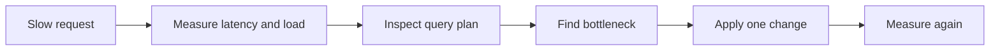

## 🛑 151. Database suddenly became slow after deployment. How do you debug?

প্রোডাকশন ডেপ্লয়মেন্টের পর ডাটাবেস হঠাৎ স্লো হয়ে যাওয়া সফটওয়্যার ইঞ্জিনিয়ারিংয়ের সবচেয়ে কমন ইমার্জেন্সি (P0 Incident) গুলোর একটি। 

**কীভাবে ডিবাগ করবেন?**
নতুন ডেপ্লয়মেন্টের পর ডাটাবেস স্লো হলে প্রথমেই কোড রোলব্যাক করার কথা চিন্তা করতে হবে। এর পাশাপাশি ডাটাবেসের কানেকশন লিক, দীর্ঘসময় ধরে চলা স্লো কুয়েরি, এবং নতুন রিলিজের গিট কমিটে কোনো আন-অপ্টিমাইজড `JOIN` বা ইনডেক্সিং ছাড়া কুয়েরি আছে কি না তা আইডেন্টিফাই করে ফিক্স করতে হয়।

**Technical summary:** Debugging a slow database after a deployment involves immediately checking resource metrics, identifying unoptimized or new slow queries introduced in the release, analyzing active connections for potential leaks, and rolling back the deployment if the system is completely unresponsive.

### 🔍 What are the first things you would check?
1. **CPU ও Memory Usage:** সার্ভারের রিসোর্স হঠাৎ করে ১০০% হয়ে গেছে কি না তা চেক করা (যেমন: `htop`, `top`, বা CloudWatch দিয়ে)।
2. **Active Connections & Locks:** নতুন কোড হয়তো ডাটাবেসের সেশন বা কানেকশন ঠিকমতো ক্লোজ করছে না। সবগুলো কানেকশন ফুল হয়ে গেছে কি না তা চেক করা (যেমন: `pg_stat_activity` বা `SHOW PROCESSLIST` দিয়ে)।
3. **Recent Commits:** লেটেস্ট রিলিজের গিট কমিট চেক করা। নতুন কোনো কোয়ারি, `JOIN`, বা ORM আপডেট এসেছে কি না, যা ডাটাবেসকে অতিরিক্ত প্রেশার দিচ্ছে। 
4. **Quick Rollback:**
   > 💡 **Important Note:** যদি সার্ভিস পুরোপুরি ডাউন হয়ে যায় এবং কারণ বের করতে দেরি হয়, তবে রিস্ক না নিয়ে সর্বশেষ স্ট্যাবল বা আগের ভার্সনে কোডটি **Rollback** করে ফেলা সবার প্রথম ডিসিশন হওয়া উচিত।

### 🧩 How do you identify if it's a query or infrastructure issue?
* **Infrastructure Issue:** যদি দেখেন ডাটাবেসের পাশাপাশি ক্যাশ সার্ভার, অ্যাপ্লিকেশন সার্ভার—সবগুলোরই লোড বেশি, তবে এটি ইনফ্রাস্ট্রাকচার বা নেটওয়ার্ক ইস্যু (বা হঠাৎ ট্রাফিক স্পাইক/DDoS অ্যাটাক) হতে পারে। ডাটাবেসের **Disk I/O** বা **I/O Wait time** অনেক বেশি থাকা মানে হার্ডডিস্কে সমস্যা হচ্ছে।
* **Query Issue:** যদি ইনফ্রাস্ট্রাকচারের মেট্রিক্স (CPU/RAM) নরমাল থাকে কিন্তু স্পেসিফিক পেজ লোড হতে দেরি হয়, এবং নির্দিষ্ট কিছু ডাটাবেস লকেজ (Deadlocks বা Long waiting transactions) দেখা যায়, তবে এটি নিশ্চিতভাবে ব্যাড কোয়ারি বা কোডিং ইস্যু।

### 🛠️ What tools would you use for diagnosis?
* **APM Tools:** Datadog, New Relic, বা AppDynamics (যা থেকে এন্ড-টু-এন্ড রিকোয়েস্ট ট্রেসিং করা যায়)।
* **DB Metrics:** Prometheus + Grafana ড্যাশবোর্ড।
* **Native DB Commands:** MySQL এর `EXPLAIN`, PostgreSQL এর `pg_stat_statements` এক্সটেনশন।

---

## 🐢 152. How do you identify and fix a slow query?

ডাটাবেসে স্লো কোয়ারি (Slow Query) একটি নিরব ঘাতক, যা পুরো সিস্টেমকে অচল করে দিতে পারে। 

**শনাক্তকরণ এবং সমাধান:**
স্লো কুয়েরি শনাক্ত করার জন্য ডাটাবেসের `slow_query_log` বা ক্লাউডের পারফরম্যান্স মেট্রিক্স চেক করা হয়। শনাক্ত করার পর `EXPLAIN` বা `EXPLAIN ANALYZE` কমান্ড চালিয়ে এর এক্সিকিউশন প্ল্যান (Execution Plan) দেখতে হয় এবং প্রয়োজনীয় ইনডেক্স যোগ করা, N+1 ইস্যু সমাধান, অথবা কুয়েরি রিরাইট করার মাধ্যমে এটি ফিক্স করা হয়।

**Technical summary:** Identifying a slow query involves monitoring the database's slow query logs. Fixing it requires running the `EXPLAIN` command to analyze the query execution path and applying optimizations such as creating missing indexes, refactoring the query, or resolving ORM N+1 issues.

### ⏱️ What is query profiling?
কোয়ারি প্রোফাইলিং হলো এমন একটি প্রসেস যা ডাটাবেস ইঞ্জিনকে নির্দেশ দেয় প্রতিটি কোয়ারি এক্সিকিউট হতে কত মিলি-সেকেন্ড সময় লাগছে তার একটি লিস্ট তৈরি করতে। 

> 📌 **Note:** ডাটাবেসে সাধারণত `slow_query_log` কনফিগ করা থাকে (যেমন: ১ সেকেন্ডের বেশি লাগলে সেটি লগে এন্ট্রি হবে)। ডাটাবেস অ্যাডমিনরা `pt-query-digest` বা AWS Performance Insights ব্যবহার করে সবচেয়ে বেশি সময় নেয়া টপ কোয়ারিগুলো বের করেন।

### 🔬 How do you use EXPLAIN plan?
যখন আপনি স্লো কোয়ারিটি আইডেন্টিফাই করে ফেলবেন, তখন তার সামনে `EXPLAIN` বা `EXPLAIN ANALYZE` লিখে রান করবেন।

```sql
EXPLAIN ANALYZE SELECT * FROM users WHERE status='active';
```

* **EXPLAIN কী করে?** এটি কোয়ারিটি রান না করে শুধু ডাটাবেস ইঞ্জিনকে জিজ্ঞেস করে—"তুমি কোন প্রক্রিয়ায় ডেটাটি খুঁজবে?"
* এটি যে আউটপুট দেয় তাতে বোঝা যায় ইঞ্জিন কি **Index Scan** (সঠিকভাবে ইনডেক্স ধরে ডেটা খুঁজছে) নাকি **Seq Scan / Full Table Scan** (ইনডেক্স না পেয়ে টেবিলের লাখ লাখ রো একটি একটি করে চেক করছে) করছে। 

### ⚠️ Common causes of slow queries?
1. **Missing Indexes (Most Common):** `WHERE` বা `JOIN` ক্লজে ব্যবহৃত কলামগুলোতে ইনডেক্স না থাকা।
2. **N+1 Problem in ORM:** কোডের ভুলের কারণে ১টি বড় কোয়ারির বদলে ডাটাবেসে ১০০টি ছোট কোয়ারি পাঠানো (বিশেষ করে Laravel/Django-তে)।
3. **Full Table Scans:** ডাটাবেস বাধ্য হয়ে ইনডেক্স ইগনোর করা (যেমন `LIKE '%name%'` ফাংশন ব্যবহার করা)।
4. **Data Volume Limit:** এক কোয়ারিতে লাখ লাখ ডেটা আনা (Pagination ব্যবহার না করা)।

---

## 💾 153. Database is running out of disk space. What do you do?

ডাটাবেসের স্পেস ১০০% ফুল হয়ে গেলে ডাটাবেস পুরোপুরি ফ্রিজ হয়ে যায়, কোনো Insert বা Update কাজ করে না। 

**কীভাবে স্পেস রিকভার করবেন?**
তাৎক্ষণিক সমাধান হিসেবে ক্লাউডের স্টোরেজ স্কেল-আপ করতে হয় বা অপ্রয়োজনীয় টেম্পোরারি লগ ডিলিট করতে হয়। দীর্ঘমেয়াদী সমাধানের জন্য পুরানো অডিট বা হিস্টোরিক্যাল ডেটাকে সস্তা অবজেক্ট স্টোরেজে (যেমন: S3) আর্কাইভ করতে হয় এবং ডাটাবেস টেবিল পার্টিশনিং ও নিয়মিত VACUUM/OPTIMIZE চালিয়ে স্টোরেজ ক্লিন রাখতে হয়।

**Technical summary:** Handling low database disk space involves immediate mitigation by scaling up the volume storage or deleting safe temporary logs. Long-term strategies include data archiving to cheaper storage, setting up table partitioning, and performing routine database maintenance like VACUUM to reclaim space from dead rows.

### ⏳ Short-term vs long-term solutions?

**Short-Term (তাত্ক্ষণিক সমাধান):**
* ক্লাউড পরিবেশে (AWS/GCP) তাৎক্ষণিকভাবে হার্ডডিস্কের (EBS Volume) স্টোরেজ বাড়িয়ে (Scale up storage) ডাটাবেস সচল করা।
* ডাটাবেসের পুরোনো আনইউজড লগ ফাইল (`WAL logs` বা `Error logs`), Temporary Tables বা ফেইল হওয়া ট্রানজেকশনের টেম্পোরারি ডেটা (VACUUM করে) ডিলিট করে ইমার্জেন্সি স্পেস বের করা।

**Long-Term (দীর্ঘমেয়াদী সমাধান):**
* **Data Archiving:** ৫ বা ৩ বছরের পুরোনো লেনদেন (Historical Data / Audit Logs) মেইন ডাটাবেস থেকে সরিয়ে সস্তা স্টোরেজ (যেমন: Amazon S3 বা Glacier) এ আর্কাইভ করা। 
* **Table Partitioning:** বিশাল টেবিলগুলোকে মাস বা বছর অনুযায়ী পার্টিশন করা, যাতে পুরোনো ডেটা মুছে ফেলা বা আর্কাইভ করা সহজ হয়।

### 🔍 How do you identify what's consuming space?
ডাটাবেসের নিজস্ব মেটাডেটা টেবিলগুলোতে কোয়ারি চালিয়ে বের করতে হয়। 

```sql
-- PostgreSQL Example
SELECT pg_total_relation_size('table_name');
```

> 💡 **Tip:** এটি ব্যবহার করে টেবিলের আসল সাইজ, ইনডেক্সের সাইজ, এবং "Bloat" (মৃত ডেটার সাইজ) দেখা হয়। অনেক সময় ডাটাবেসে অপ্রয়োজনীয় প্রচুর ইনডেক্স থাকে, যা আসল ডেটার চেয়েও বেশি স্পেস খায়।

### 🧹 Database maintenance tasks to free up space?
* **VACUUM / OPTIMIZE TABLE:** রিলেশনাল ডাটাবেস থেকে কোনো Row ডিলিট করলে তা হার্ডডিস্ক থেকে সাথে সাথে মুছে যায় সাসপেন্ড হয় না (Soft dead rows)। `VACUUM` (Postgres) বা `OPTIMIZE TABLE` (MySQL) কমাণ্ড চালালে ডাটাবেস মেমরি রি-অর্গানাইজ করে ডিস্ক স্পেস ফ্রি করে।

---

## 🔌 154. Too many database connections error. How to resolve?

> ⚠️ **Error:** `FATAL: sorry, too many clients already`
> এই এররটির মানে হলো আপনার অ্যাপ্লিকেশন লিমিট পার করে এত বেশি কানেকশন ডাটাবেসে খুলেছে যে ডাটাবেস নতুন রিকোয়েস্ট রিজেক্ট করে দিচ্ছে। 

**কীভাবে সমাধান করবেন?**
এই এরর থেকে বাঁচার সবচেয়ে কার্যকরী উপায় হলো অ্যাপ্লিকেশন এবং ডাটাবেসের মাঝে **Connection Pool** (যেমন: PgBouncer বা HikariCP) যুক্ত করা। এর মাধ্যমে নির্দিষ্ট সংখ্যক ডাটাবেস কানেকশন রি-ইউজ করা যায়। ডাটাবেসের ম্যাক্সিমাম কানেকশন লিমিট (max_connections) হুট করে বাড়িয়ে দিলে RAM ফুল হয়ে ডাটাবেস ক্র্যাশ করতে পারে।

**Technical summary:** Resolving the "too many connections" error requires implementing connection pooling at the application or middleware layer to reuse a limited number of active connections. Blindly increasing the database `max_connections` parameter is discouraged as it often leads to Out of Memory (OOM) crashes.

### 🕵️ How do you identify connection leaks?
Connection Leak হয় যখন অ্যাপ্লিকেশন ডাটাবেসের একটি সেশন খোলে কিন্তু ডেটা রিড করার পর কোডে সেই কানেকশনটি `close()` করতে ভুলে যায় বা এরর হয়ে আটকে থাকে। 
* সনাক্ত করতে ডাটাবেসের অ্যাক্টিভ সেশনগুলোতে (যেমন `pg_stat_activity`) আইডল ট্রানজেকশন (Idle transactions) খুঁজতে হয় যা অনেক সময় ধরে শুধু ওপেন হয়ে বসে আছে কিন্তু কোনো কোয়ারি রান করছে না।

### 🏊‍♂️ What is connection pooling and how does it help?
ডাটাবেসের সাথে কানেকশন ওপেন করা (TCP Handshake, Authentication) অত্যন্ত সময়সাপেক্ষ এবং খরুচে। 
* **Connection Pooling:** (যেমন: PgBouncer, HikariCP) হলো অ্যাপ্লিকেশন এবং ডাটাবেসের মাঝখানে থাকা একটি লেয়ার। এটি ডাটাবেসের সাথে অল্প কিছু (ধরি ৫০টি) পার্মানেন্ট কানেকশন খুলে রাখে (Pool)।
* অ্যাপ্লিকেশন থেকে ৫ হাজার ইউজার রিকোয়েস্ট এলেও pool সীমিত connection reuse করে। তবে pool size, queue limit, timeout বা leaked connection ভুল হলে `Too many connections` এখনও হতে পারে—pooling ঝুঁকি কমায়, guarantee নয়।

### ⚙️ How do you tune max_connections parameter?
ডাটাবেসের `max_connections` ভ্যালুটি হুট করে অনেক বাড়িয়ে দেয়া একটি মারাত্মক ভুল। 

> 🚨 **Warning:** প্রতি কানেকশন সাধারণত ২-১০ মেগাবাইট মেমরি খায়। কানেকশন লিমিট বেশি বাড়ালে ডাটাবেসের RAM ফুল (Out of Memory - OOM) হয়ে ডাটাবেস ক্র্যাশ করবে। 

* **Calculation Formula:** `Number of CPU Cores × 2 + Effective Spindle Count` (Disk I/O ক্ষমতা)। 
* তাই লিমিট বাড়ানোর বদলে সবসময় **Connection Pool** ব্যবহার করা উচিত।

---

## ⏱️ 155. Replication lag is very high. What would you do?

Replication Lag বা রেপ্লিকেশন ডিলে তখন হয়, যখন Primary (Master) ডাটাবেস থেকে ডেটা Secondary (Slave) ডাটাবেসে আসতে এবং আপডেট হতে অনেক বেশি সময় নিচ্ছে। ফলে ইউজার Secondary থেকে ডেটা পড়লে পুরোনো ভুল ডেটা দেখতে পায়। 

**কীভাবে রিকভার করবেন?**
রেপ্লিকেশন ল্যাগ কমানোর জন্য Slave নোডে মাল্টি-থ্রেডেড (Parallel) রেপ্লিকেশন চালু করা হয়, যেন এটি মাস্টারের মতই দ্রুত স্পিডে ডেটা রাইট করতে পারে। এছাড়াও যদি মাস্টারে বিশাল কোনো ব্যাচ ডেটা আপডেট (Bulk Update) চলে, তবে তা ছোট ছোট ব্যাচে ভাগ করে রান করলে ল্যাগ তৈরি হয় না।

**Technical summary:** High replication lag is fixed by enabling multi-threaded parallel replication on the secondary nodes, upgrading the read-replica's I/O throughput to match the primary, and avoiding massive bulk writes on the primary database by breaking them down into smaller periodic batches.

### 📏 How do you measure replication lag?
* **MySQL:** 
```sql
SHOW SLAVE STATUS\G;
-- Check the 'Seconds_Behind_Master' field. (0 = no lag).
```
* **PostgreSQL:** `pg_stat_replication` ভিউ থেকে ল্যাগ মাপা যায়।

### 🚧 Common causes of high replication lag?
1. **Network Latency:** মাস্টার এবং স্লেভের মধ্যে ইন্টারনেট স্পিড বা ব্যান্ডউইথ স্লো হওয়া।
2. **Heavy DDL Operations:** প্রাইমারি ডাটাবেসে বড় টেবিলের ইনডেক্স তৈরি (`CREATE INDEX`) করা বা স্কিমা চেঞ্জ (`ALTER TABLE`) করা। এটি স্লেভ নোডে গিয়ে পুরোপুরি আপডেট না হওয়া পর্যন্ত রেপ্লিকেশন ব্লক করে রাখে।
3. **Massive Batch Writes:** একসাথে মাস্টার ডাটাবেসে ১০ লাখ ডেটা আপডেট করলে তা রেপ্লিকেশন লগে ওভারলোড তৈরি করে। 
4. **Single-threaded Slave:** মাস্টার ডাটাবেস মাল্টি-কোর সিপিইউ দিয়ে প্যারালাল রাইট করে, কিন্তু পুরোনো ডাটাবেস ইঞ্জিনে Slave ডাটাবেস সিঙ্গল-থ্রেডে একটি কোয়ারির পর অপরটি প্রসেস করে।

### ⚡ How do you reduce it?
* **Parallel Replication:** ডাটাবেস কনফিগারেশনে (MySQL 5.7+ বা Postgres) `Multi-threaded replication` চালু করা, যাতে স্লেভ নোডগুলোও একাধিক কোয়ারি একসাথে রান করতে পারে।
* **Batch Splitting:** একবারে ১০ লাখ ডেটা আপডেট না করে, ক্রন জবের মাধ্যমে ৫ হাজার করে ব্যাচ হিসেবে আপডেট করা।
* **Hardware Upgrade:** রিড রেপ্লিকার ডিস্কের স্পিড (IOPS) এবং ইঞ্জিন ক্যাপাসিটি মাস্টারের সমান বা তার চেয়ে ভালো রাখা। 

---

## 💥 156. Database crashed and won't start. Troubleshooting steps?

ডাটাবেস ক্র্যাশ করে স্টার্ট না হওয়া সার্ভার এডমিনদের জন্য সবচেয়ে ভীতিকর নাইটমেয়ার। 

**কীভাবে ট্রাবলশুট করবেন?**
সবচেয়ে আগে ডাটাবেসের এরর লগ (Error log) চেক করে ক্র্যাশের মূল কারণ (যেমন: OOM Killer, Disk I/O Failure, বা Corrupted Data) বের করতে হবে। যদি এরর সাধারণ কিছু হয় তবে সেটি ফিক্স করে রিস্টার্স দিলেই ডাটাবেসের অটোমেটিক রিকভারি মেকানিজম (WAL/Redo log) ডেটা সেফ করে পুনরায় চালু হবে। মারাত্মক করাপশন হলে ব্যাকআপ থেকে Point-In-Time Recovery (PITR) করে ডেটা রিস্টোর করতে হবে।

**Technical summary:** Troubleshooting a crashed database starts with analyzing the system and database error logs to identify the root cause (OOM, hardware failure, data corruption). Depending on the severity, the database might auto-recover using Write-Ahead Logs (WAL) upon restart, or it may require point-in-time recovery from the latest backup.

### 📜 How do you check database logs?
সবচেয়ে প্রথম কাজ হলো ডাটাবেস কেন মারা গেল তা জানা। 

```bash
# Check MySQL error log
tail -n 100 /var/log/mysql/error.log

# Or use journalctl for PostgreSQL
journalctl -u postgresql
```

> 💡 **Tip:** লগ থেকেই জানা যাবে ডাটাবেস কি **OOM (Out Of Memory) Killer** এর হাতে মারা গেছে (কারণ RAM শেষ), নাকি হার্ডডিস্ক নষ্ট (Disk I/O Error), নাকি কনফিগারেশনে সিনট্যাক্স ভুল হয়েছে।

### 🔄 What is database recovery process?
বেশিরভাগ মডার্ন ডাটাবেসে (MySQL InnoDB বা Postgres) অটোমেটিক ক্র্যাশ রিকভারি মেকানিজম থাকে।
* ডাটাবেস রিস্টার্ট নেয়ার সময় সে প্রথমেই **WAL (Write-Ahead Log) বা Redo Logs** পড়ে। 
* ক্র্যাশ করার ঠিক মিলি-সেকেন্ড আগ পর্যন্ত যেসব ট্রানজেকশনের কমিট সাইন হার্ডডিস্কে লিখতে পারেনি, ডাটাবেস লগ থেকে সেগুলো পুনরায় (Replay) রান করে ডেটা রিকভার করে এবং করাপ্ট হওয়া ডেটা রোলব্যাক করে সার্ভিস লাইভ করে।

### 🛠️ When would you restore from backup vs repair?
* **Repairing Database:** ডাটাবেসের এরর লগে যদি দেখা যায় যে শুধুমাত্র একটি ইনডেক্স ফাইল বা নির্দিষ্ট টেবিল পেজ করাপ্ট (Data corruption) হয়েছে, তখন ইনডেক্স রিবিল্ড বা ইঞ্জিন রিপেয়ার টুলস দিয়ে ডাটাবেস ঠিক করা যায়।
* **Restore from Backup:** যদি হার্ডডিস্ক ফিজিক্যালি পুড়ে যায়, Ransomware অ্যাটাক হয় বা ভুলে কেউ পুরো প্রোডাকশন টেবিল `DROP` করে দেয়—তখন রিপেয়ারের প্রশ্নই আসেলগ্ন না। তখন স্টোরেজ পরিষ্কার করে সর্বশেষ ব্যাকআপ ফাইল (Full Dump + WAL logs) থেকে **Point-In-Time Recovery (PITR)** করে ডাটাবেসকে জীবিত করতে হয়।

---

## 🔄 157. Deadlocks are occurring frequently. How do you resolve?

ডেডলক (Deadlock) হলো এমন একটি অবস্থা যেখানে দুটি আলাদা ট্রানজেকশন নিজেদের লকের (Lock) কাজ শেষ করার জন্য অনন্তকাল একে অপরের জন্য অপেক্ষা করতে থাকে। 

> 📌 **Example:** ট্রানজেকশন A টেবিল-১ লক করেছে এবং টেবিল-২ খুঁজছে। এদিকে ট্রানজেকশন B টেবিল-২ লক করেছে এবং টেবিল-১ খুঁজছে। কেউই লক ছাড়বে না, তাই সৃষ্টি হয় ডেডলক। শেষমেশ ডাটাবেস ইঞ্জিন এক ট্রানজেকশনকে ফেইল (Kill) করে দিয়ে ডেডলক ভাঙতে বাধ্য হয়।

**কীভাবে সমাধান করবেন?**
ডেডলক কমানোর প্রধান উপায় হলো ব্যাকএন্ড অ্যাপ্লিকেশনের কোড রিফ্যাক্টর করা। কোডে অবশ্যই খেয়াল রাখতে হবে যে ভিন্ন ট্রানজেকশনগুলো যেন সবসময় একই সিকোয়েন্সে (Sequentially) টেবিলগুলো এক্সেস করে এবং ডাটাবেস ট্রানজেকশনগুলো যতটা সম্ভব ছোট ও দ্রুত হয়।

**Technical summary:** Resolving frequent deadlocks primarily requires an application-level refactoring to ensure that all concurrent transactions access database tables or rows in exactly the same deterministic order. Additionally, minimizing transaction duration and employing optimistic locking can significantly reduce deadlock occurrences.

### 🔍 How do you identify which queries are causing deadlocks?
ডাটাবেসের লগে ডেডলক ডিটেক্ট হলে তা প্রিন্ট হয়। 

```sql
-- For MySQL
SHOW ENGINE INNODB STATUS;
```
আউটপুট থেকে সর্বশেষ ডেডলক ঘটা কোয়ারি এবং ট্রানজেকশনগুলোর বিস্তারিত দেখা যায়।

### ⚙️ Application-level vs database-level solutions?
* **Database-level:** ডাটাবেস লেভেলে কিছুই করার নেই; ডাটাবেস নিজে থেকে একটি শিকার (Victim) বেছে নিয়ে তাকে রোলব্যাক বা কিল করে ডেডলক ভাঙে।
* **Application-level:** আসল সমাধান এখানেই। ডেভেলপারদের কোড রিফ্যাক্টর করে টেবিল আপডেটের সিকোয়েন্স (Sequence) ঠিক করতে হয়, যাতে দুটি ভিন্ন প্রসেস সবসময় একই সিরিয়ালে টেবিলগুলো এক্সেস করে।

### 🛡️ How do you prevent deadlocks in code?
1. **অর্ডার ঠিক করা (Sorting):** যদি একাধিক রো বা টেবিল আপডেট করার থাকে, তবে কোডে সব সময় প্রাইমারি-কি (Primary Key) বা নাম অনুসারে সর্ট (Sort) করে আপডেট লুপ চালানো উচিত। 
2. **ছোট ট্রানজেকশন:** ট্রানজেকশন ব্লক যত বড় হবে, ডেডলক হওয়ার সম্ভাবনা তত বাড়বে। তাই ট্রানজেকশন যতটা সম্ভব ছোট রাখা। 
3. **Optimistic Locking:** টেবিল বা রো-কে শক্তভাবে লক (`FOR UPDATE`) না করে, ডেটার সাথে একটি `version_number` রাখা, যাতে লক ছাড়াই শুধুমাত্র ভার্সন মিললেই আপডেট হয়।

---

## 📦 158. Database backup is taking too long. How to optimize?

টেরাবাইট স্কেলের ডেটাবেস ব্যাকআপ নিতে কয়েক ঘণ্টা থেকে দিন পর্যন্ত সময় লাগতে পারে, যা প্রোডাকশন সিস্টেমে মারাত্মক ড্রপ বা স্লো-নেসের সৃষ্টি করে।

**কীভাবে অপটিমাইজ করবেন?**
ব্যাকআপ প্রসেসকে ফাস্ট করার জন্য প্যারালাল বা মাল্টি-থ্রেডেড ব্যাকআপ (Parallel Backups) টুলস ব্যবহার করা হয়। এছাড়া প্রোডাকশনের পারফরম্যান্সে প্রভাব না ফেলতে প্রাইমারি ডাটাবেসের বদলে রিড-রেপ্লিকা বা স্লেভ ডাটাবেস থেকে ব্যাকআপ রান করা হয় এবং ফিজিক্যাল স্ন্যাপশট (EBS Snapshot) ব্যবহার করা হয়। প্রতিদিন সম্পূর্ণ ডেটা ব্যাকআপ না নিয়ে, ইনক্রিমেন্টাল বা ডেল্টা ব্যাকআপ নেয়া একটি বেস্ট প্র্যাকটিস।

**Technical summary:** Optimizing slow database backups involves switching to parallel or multi-threaded backup tools and running the process on a read-replica node to offload the primary database. Using incremental backups instead of daily full backups, or utilizing fast physical storage snapshots (like AWS EBS snapshots), can significantly reduce backup duration.

### 🚀 Parallel backup strategies?
* ডাটাবেসের নেটিভ ডাম্প টুল (যেমন MySQL এর `mysqldump` বা Postgres এর `pg_dump`) সাধারণত সিঙ্গল-থ্রেডে সিকুয়েন্সিয়ালি ডেটা রিড করে, তাই অনেক স্লো। 
* এর পরিবর্তে **Parallel Backups** বা মাল্টি-থ্রেডিং ব্যবহার করা হয় (যেমন: `pg_dump -j 4` বা Percona XtraBackup)। এতে ব্যাকআপ প্রসেস এক সাথে একাধিক টেবিল ডাম্প করতে পারে এবং ব্যাকআপের সময় কয়েক গুণ কমে আসে।

### ⚖️ Incremental vs full backup trade-offs?
* **Full Backup:** ডাটাবেসের সমস্ত ডেটার আস্ত কপি করা হয়। এটি অনেক স্টোরেজ খায় এবং অনেক স্লো। কিন্তু ক্রাইসিসের সময় রিস্টোর করতে এটি সবচেয়ে ফাস্ট। 
* **Incremental Backup:** প্রতিদিন ফুল ব্যাকআপ না নিয়ে, গত পরশু থেকে আজ পর্যন্ত ডাটাবেসে শুধু যেটুকু ডেটা চেঞ্জ হয়েছে (Write-Ahead Logs/BinLogs), শুধুমাত্র সেই লগগুলো কপি করা। এটি সাইজে ছোট এবং কয়েক মিনিটেই ব্যাকআপ হয়ে যায়। তবে রিস্টোর করার সময় ফুল ব্যাকআপের সাথে সব ইনক্রিমেন্টাল ফাইল জোড়া লাগিয়ে রান করতে হয়, যা রিস্টোরেশনকে স্লো করে। 
  > 💡 **Best Practice:** সপ্তাহে একদিন ফুল ব্যাকআপ এবং বাকি ৬ দিন ইনক্রিমেন্টাল ব্যাকআপ নেয়া। 

### 🛡️ How to backup without affecting production?
ব্যাকআপ নেয়ার সময় ডাটাবেস ইঞ্জিন ডিস্ক পারফরম্যান্সে (I/O) প্রেশার দেয় এবং টেবিলও লক (Table Locking) করতে পারে। 

* **Solution 1 (Physical Snapshot):** AWS (EBS Snapshot) বা LVM (Logical Volume Manager) এর মাধ্যমে হার্ডডিস্কের স্ন্যাপশট নেওয়া, যা ফ্র্যাকশন অফ সেকেন্ডে হয়ে যায়। সিস্টেম কোনো ইফেক্টই অনুভব করে না।
* **Solution 2 (Replica Backup):** উপযুক্ত replica থেকে backup নিলে primary-এর load কমে। তবে replication lag, consistency point এবং replica I/O impact যাচাই করতে হবে; critical backup restore-test ছাড়া নির্ভরযোগ্য ধরা যাবে না।
��় Connection Pool ব্যবহার করা উচিত।

---
