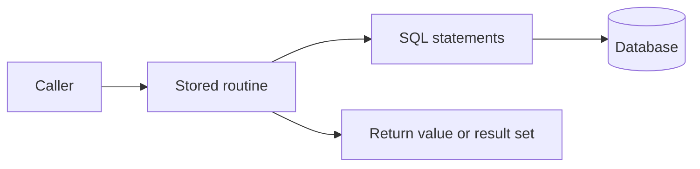

# Stored Procedures & Functions

## **64. What is a stored procedure?**



**Stored Procedure** হলো একগুচ্ছ SQL স্টেটমেন্টের একটি কালেকশন বা গ্রুপ, যা ডাটাবেজে একটি নির্দিষ্ট নামে সেভ করে রাখা হয়। সহজ কথায়, এটি ডাটাবেজের ভেতর তৈরি করা একটি **Function**-এর মতো, যা আপনি একবার লিখে রাখলে বারবার কল করে ব্যবহার করতে পারেন।

**Technical Definition:** Stored Procedure হলো database-এ সংরক্ষিত reusable routine। এটি parameter নিতে এবং result/output দিতে পারে। Engine execution plan cache করতে পারে, কিন্তু procedure হওয়াই ad-hoc query-এর চেয়ে দ্রুত হওয়ার guarantee নয়।

### Basic Stored Procedure Syntax (MySQL):

#### **No parameter:**

সব active কর্মচারীদের লিস্ট দেখার জন্য একটি সহজ procedure:

```sql
DELIMITER //

CREATE PROCEDURE GetAllActiveEmployees()
BEGIN
    SELECT * FROM employees WHERE status = 'ACTIVE';
END //

DELIMITER ;

-- কল করার নিয়ম:
CALL GetAllActiveEmployees();

```

#### **IN Parameter:**

নির্দিষ্ট ডিপার্টমেন্টের কর্মচারীদের বেতন আপডেট করার জন্য:

```sql
DELIMITER //

CREATE PROCEDURE UpdateDeptSalary(
    IN dept_name VARCHAR(50), 
    IN increment_pct DECIMAL(5,2)
)
BEGIN
    UPDATE employees 
    SET salary = salary + (salary * increment_pct / 100)
    WHERE department = dept_name;
END //

DELIMITER ;

-- কল করার নিয়ম (IT ডিপার্টমেন্টের বেতন ৫% বৃদ্ধি):
CALL UpdateDeptSalary('IT', 5.00);

```

#### **OUT Parameter:**

টোটাল কর্মচারীর সংখ্যা একটি ভ্যারিয়েবলে ব্যাক পাওয়ার জন্য:

```sql
DELIMITER //

CREATE PROCEDURE GetEmployeeCount(OUT total INT)
BEGIN
    SELECT COUNT(*) INTO total FROM employees;
END //

DELIMITER ;

-- কল করার নিয়ম:
CALL GetEmployeeCount(@employee_total);
SELECT @employee_total;

```


### ⚖️ View বনাম Stored Procedure (পার্থক্য)

| ফিচার | View | Stored Procedure |
| --- | --- | --- |
| **মূল কাজ** | শুধু ডেটা দেখানোর (Select) জন্য। | ডেটা দেখানো ও ম্যানিপুলেট (Insert/Update/Delete) করার জন্য। |
| **প্যারামিটার** | প্যারামিটার গ্রহণ করতে পারে না। | ইনপুট এবং আউটপুট প্যারামিটার নিতে পারে। |
| **জটিলতা** | শুধু SQL Query ধারণ করে। | লজিক, লুপ (Loops), এবং কন্ডিশন (If-Else) ধারণ করতে পারে। |
| **ব্যবহার** | সাধারণ টেবিলের মতো ব্যবহার হয়। | `CALL` কমান্ডের মাধ্যমে রান করতে হয়। |


* **Debugging:** Procedure ডিবাগ করা সাধারণ SQL-এর চেয়ে কিছুটা কঠিন।
* **Vendor Lock-in:** MySQL-এর Procedure লজিক হুবহু Oracle বা SQL Server-এ চলবে না (সিনট্যাক্স আলাদা)।
* **Memory Usage:** অনেক বেশি Procedure ডাটাবেজ সার্ভারের মেমোরিতে চাপ সৃষ্টি করতে পারে।

## **65. Difference between stored procedures and functions?**

### Key Differences Summary:


| Aspect | Stored Procedure  | Function  |
| --- | --- | --- |
| **Return Value** | Result set, OUT parameter বা status দিতে পারে—DBMS-ভেদে syntax ভিন্ন | Scalar বা table/set return করতে পারে—DBMS-ভেদে capability ভিন্ন |
| **Parameter** | `IN`, `OUT`, এবং `INOUT` support DBMS-ভেদে ভিন্ন | অনেক DBMS-এ input parameter; PostgreSQL-সহ কিছু system-এ richer modes আছে |
| **DML অপারেশন** | procedure ভেতর `INSERT`, `UPDATE`, `DELETE` করা যায়। | সাধারণত শুধু ডেটা ক্যালকুলেট বা রিড করার জন্য ব্যবহৃত হয়। (DML এলাউড না অনেক DB-তে)। |
| **Use case** | `CALL` কমান্ড দিয়ে আলাদাভাবে রান করতে হয়। | `SELECT`, `WHERE`, বা `HAVING` ক্লজের ভেতরে ব্যবহার করা যায়। |
| **Calling** | procedure থেকে অন্য procedure বা function কল করা যায়। | function থেকে অন্য function কল করা গেলেও procedure কল করা যায় না। |
| **Transaction** | Routine কোথা থেকে call হয়েছে ও DBMS rule অনুযায়ী transaction control সীমিত বা allowed হতে পারে | Query-called function-এ transaction control সাধারণত allowed নয় |

### When to Use Each:

#### **Use Stored Procedures When:**
* আপনাকে ডেটাবেজে কোনো অ্যাকশন নিতে হবে (যেমন: নতুন রেকর্ড ইনসার্ট বা আপডেট করা)।
* অনেকগুলো জটিল লজিক ধাপে ধাপে এক্সিকিউট করতে হবে।
* বড় ধরনের বিজনেস লজিক হ্যান্ডেল করতে হবে যেখানে ট্রানজ্যাকশন (Commit/Rollback) প্রয়োজন।

#### **Use Functions When:**
* আপনাকে কোনো নির্দিষ্ট ক্যালকুলেশন করতে হবে (যেমন: বয়স বের করা, কারেন্সি কনভার্ট করা)।
* সেই ক্যালকুলেশনটি সরাসরি আপনার SQL `SELECT` স্টেটমেন্টের ভেতরে দরকার।
* আপনার কোডটি ছোট এবং ইনপুট নিয়ে একটি রেজাল্ট দেওয়াই এর প্রধান কাজ।

**Summary:** Query-এর ভেতরে ব্যবহৃত function side-effect-free রাখলে reasoning ও optimization সহজ হয়। তবে function/procedure capability vendor-specific—target DBMS-এর rule যাচাই করতে হবে।

---

## **70. What are User-Defined Functions (UDFs)?**

**User-Defined Functions (UDFs)** হলো এমন কিছু ফাংশন যা ইউজার বা ডেভেলপাররা তাদের নিজস্ব প্রয়োজন অনুযায়ী ডাটাবেজে তৈরি করে নেয়। ডাটাবেজে আগে থেকে কিছু built-in ফাংশন থাকে (যেমন: `SUM()`, `AVG()`, `UPPER()`), কিন্তু যখন আপনার বিশেষ কোনো ক্যালকুলেশনের প্রয়োজন হয় যা এই built-in ফাংশন দিয়ে সম্ভব নয়, তখনই আপনি **UDF** তৈরি করেন।

### 💡 UDF কেন ব্যবহার করবেন? (Key Benefits)

১. **Custom Logic:** আপনার অ্যাপ্লিকেশনের বিশেষ কোনো বিজনেস ক্যালকুলেশন (যেমন: ডিসকাউন্ট বা ট্যাক্স ক্যালকুলেশন) একবার লিখে সব কুয়েরিতে ব্যবহার করা যায়।
২. **Readability:** বড় বড় এবং জটিল ফর্মুলা বারবার কুয়েরিতে না লিখে একটি ছোট ফাংশনের নাম ব্যবহার করলে কোড অনেক পরিষ্কার দেখায়।
৩. **Modular Code:** কোডকে ছোট ছোট লজিক্যাল ভাগে ভাগ করা যায়, যা মেইনটেইন করা সহজ।


### Types of UDFs:

সাধারণত কাজের ধরন অনুযায়ী UDF-কে দুই ভাগে ভাগ করা যায়:

#### **Scalar Functions:**

এই ফাংশনটি ইনপুট নিয়ে প্রসেসিং শেষে শুধুমাত্র একটি **সিঙ্গেল ভ্যালু** (যেমন: String, Integer, বা Date) রিটার্ন করে।

```sql
-- উদাহরণ: একজন কর্মচারীর জন্মতারিখ থেকে বয়স বের করার ফাংশন
DELIMITER //

CREATE FUNCTION CalculateAge(birth_date DATE) 
RETURNS INT
DETERMINISTIC
BEGIN
    DECLARE age INT;
    SET age = TIMESTAMPDIFF(YEAR, birth_date, CURDATE());
    RETURN age;
END //

DELIMITER ;

-- ব্যবহার (SELECT এর ভেতরে সরাসরি):
SELECT name, CalculateAge(dob) AS age FROM employees;

```

#### **Table-Valued Functions:**

এটি কোনো সিঙ্গেল ভ্যালুর বদলে পুরো একটি **রেজাল্ট সেট বা টেবিল** রিটার্ন করে। (এটি SQL Server বা PostgreSQL-এ বেশি ব্যবহৃত হয়, MySQL-এ সরাসরি সাপোর্ট নেই)।


### 🛠️ UDF তৈরি করার সময় মনে রাখার মতো বিষয় (Components)

* **Parameters:** ফাংশন ইনপুট হিসেবে কি কি ভ্যালু নেবে।
* **Returns Clause:** ফাংশনটি কি ধরনের ডেটা (Data Type) রিটার্ন করবে তা আগে থেকেই বলে দিতে হয়।
* **Deterministic vs Non-Deterministic:** * **Deterministic:** একই ইনপুটের জন্য সব সময় একই আউটপুট দেয়।
* **Non-Deterministic:** একই ইনপুটে ভিন্ন ভিন্ন আউটপুট দিতে পারে (যেমন: যা কারেন্ট টাইম বা রেন্ডম নাম্বারের ওপর নির্ভর করে)।


#### ⚖️ UDF বনাম Built-in Function

| ফিচার | Built-in Function | User-Defined Function (UDF) |
| --- | --- | --- |
| **তৈরি করে কে?** | ডাটাবেজ ইঞ্জিন (MySQL, Oracle)। | ডাটাবেজ ডেভেলপার বা ইউজার। |
| **উপলব্ধতা** | সব ডেটাবেজে ডিফল্টভাবে থাকে। | নির্দিষ্ট ডাটাবেজ বা প্রোজেক্টের জন্য তৈরি করতে হয়। |
| **উদাহরণ** | `COUNT()`, `MAX()`, `ROUND()`। | `CalculateTax()`, `FormatPhoneNumber()`। |


#### ⚠️ UDF ব্যবহারের কিছু সতর্কতা

* **Performance:** কুয়েরির `SELECT` বা `WHERE` ক্লজে UDF ব্যবহার করলে, এটি টেবিলের প্রতিটি রো-এর (row) জন্য আলাদাভাবে এক্সিকিউট হয়। বিশাল বড় টেবিলে এটি কুয়েরিকে স্লো করে দিতে পারে।
* **Limited Operations:** ফাংশনের ভেতর সাধারণত ডাটাবেজের স্টেট পরিবর্তনকারী কমান্ড (যেমন: `INSERT`, `UPDATE`, `DELETE`) ব্যবহার করা যায় না।
