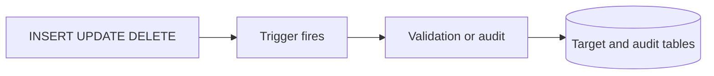
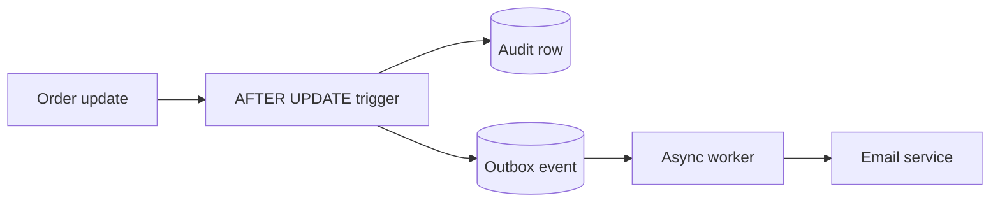

# Triggers & Cursors

## **66. What is a trigger?**



**Trigger** হলো ডাটাবেজের একটি বিশেষ ধরনের Stored Procedure, যা নির্দিষ্ট ডাটাবেজ ইভেন্ট (INSERT, UPDATE, DELETE) ঘটার সাথে সাথে **স্বয়ংক্রিয়ভাবে (automatically)** এক্সিকিউট হয়। এটিকে ম্যানুয়ালি কল করা যায় না।

**Technical Definition:** Trigger হলো একটি ইভেন্ট-ড্রিভেন (event-driven) প্রসিডিউর যা ডাটাবেজ টেবিলে কোনো পরিবর্তন হলে Data Integrity রক্ষা, Business Rules প্রয়োগ এবং Auditing এর জন্য স্বয়ংক্রিয়ভাবে রান হয়

### Basic Trigger Syntax:

```sql
-- MySQL
CREATE TRIGGER trigger_name
{BEFORE | AFTER} {INSERT | UPDATE | DELETE}
ON table_name
FOR EACH ROW
BEGIN
    -- Trigger logic
END;

-- PostgreSQL
CREATE OR REPLACE FUNCTION trigger_function()
RETURNS TRIGGER AS $$
BEGIN
    -- Trigger logic
    RETURN NEW; -- or OLD for DELETE
END;
$$ LANGUAGE plpgsql;

CREATE TRIGGER trigger_name
    {BEFORE | AFTER} {INSERT | UPDATE | DELETE}
    ON table_name
    FOR EACH ROW
    EXECUTE FUNCTION trigger_function();
```

### BEFORE vs AFTER Triggers:

#### **BEFORE Triggers:**
- Execute **before** the triggering event
- Can **modify** the NEW values
- Can **prevent** the operation by raising an error
- Used for **validation** and **data transformation**

#### **AFTER Triggers:**
- Triggering statement-এর row/statement action-এর পরে execute হয়, কিন্তু সাধারণত একই transaction-এর ভেতরে COMMIT-এর আগে
- **Cannot modify** the row being changed
- Used for **logging**, **notifications**, and **cascading operations**

| ফিচার | BEFORE Triggers | AFTER Triggers |
| --- | --- | --- |
| **কখন এক্সিকিউট হয়?** | মেইন row/statement action-এর আগে। | Action-এর পরে, সাধারণত transaction commit হওয়ার আগে। |
| **ডেটা মডিফিকেশন** | `NEW` ভ্যালুকে পরিবর্তন (Modify) করতে পারে। | যে রো-টি পরিবর্তন হচ্ছে, তাকে আর মডিফাই করতে পারে না। |
| **অপারেশন বাতিল** | Error জেনারেট করে operation আটকাতে পারে। | Error দিলে সাধারণত statement/transaction rollback হতে পারে। |
| **Use Case** | Data Validation এবং Data Transformation. | Logging, Notifications এবং Cascading Operations. |


### BEFORE Trigger Examples:

- **Data Validation and Transformation:**
ডেটাবেজে ইনসার্ট হওয়ার আগেই ডেটা চেক করা এবং ঠিক করে নেওয়া।

- **Business Rule Enforcement:**
লজিক দিয়ে বিজনেস রুলস নিশ্চিত করা (যেমন: শিফট হয়ে যাওয়া অর্ডার পরিবর্তন করতে না দেওয়া)।

### AFTER Trigger Examples:

- **Audit Trail and Logging:**
কে, কখন, কী পরিবর্তন করেছে তার হিস্ট্রি সেভ করে রাখা।

- **Inventory Management:**
অর্ডার হওয়ার সাথে সাথে অটোমেটিক ইনভেন্টরি কমানো।


### Cascading Triggers:

**Cascading Triggers** বলতে বোঝায় যখন একটি trigger কাজের ফলে অন্য আরেকটি trigger অটোমেটিক fire হয়।

**উদাহরণ (Complex Cascading):**

1. **Level 1:** `products` টেবিলে দাম আপডেট হলো trigger ফায়ার হয়ে `price_history` টেবিলে ডেটা ইনসার্ট করলো।
2. **Level 2:** `price_history` টেবিলে ইনসার্ট হওয়ার কারণে  আরেকটি trigger ফায়ার হয়ে `price_change_notifications` তৈরি করলো।
3. **Level 3:** নোটিফিকেশন তৈরি হওয়ার কারণে  আরেকটি trigger কাস্টমারদের ইমেইল বা ফ্ল্যাশ সেলের ক্যাম্পেইন তৈরি করে দিলো।


#### **Preventing Infinite Cascading:**
cascading trigger যেন ডাটাবেজকে ক্র্যাশ না করে, সেজন্য একটি সেশন ভ্যারিয়েবল (`@cascade_level`) ব্যবহার করে লিমিট সেট করে দেওয়া যায়.


### Trigger Performance Optimization:
trigger ডাটাবেজের পারফরম্যান্স স্লো করে দিতে পারে। তাই trigger লেখার সময় খেয়াল রাখতে হয় যেন অযথাই হেভি অপারেশন না হয়।

#### **Efficient Trigger Design:**
 শুধুমাত্র ডেটা পরিবর্তন হলেই অডিট করা উচিত
```sql
DELIMITER //
CREATE TRIGGER efficient_audit_trigger
AFTER UPDATE ON orders
FOR EACH ROW
BEGIN
    -- Only audit significant changes (avoid unnecessary work)
    IF (OLD.status != NEW.status) OR (ABS(OLD.total_amount - NEW.total_amount) > 0.01) THEN
        
        INSERT INTO order_audit (order_id, new_values, change_time)
        VALUES (
            NEW.order_id,
            JSON_OBJECT('status', NEW.status, 'total_amount', NEW.total_amount),
            NOW()
        );
    END IF;
END //
DELIMITER ;

```

## **67. What is an INSTEAD OF trigger?**

**INSTEAD OF Trigger** মূল DML অপারেশনের (INSERT, UPDATE, DELETE) **পরিবর্তে** custom logic চালায়। এটি complex view update করতে বেশি ব্যবহৃত হয়; support DBMS-ভেদে ভিন্ন—SQL Server table ও view দুটিতেই দেয়, PostgreSQL/SQLite মূলত view-তে দেয়।

**Technical Definition:** INSTEAD OF trigger হলো একটি ভিউ-স্পেসিফিক trigger, যা ভিউয়ের ওপর চালানো কোনো DML কমান্ডের ডিফল্ট আচরণকে বাতিল করে দেয় এবং তার বদলে ইউজারের লিখে দেওয়া custom logic or command রান করে।

### Key Characteristics:

- কোন object-এ ব্যবহার করা যায় তা DBMS-নির্ভর
- Original operation **replace** করে, supplement করে না
- এর প্রধান কাজ হলো এমন **Complex Views**-কে Updatable করা, যেগুলো সাধারণত সরাসরি আপডেট করা যায় না (যেমন: Join করা ভিউ)।
- এটি **FOR EACH ROW** বেসিসে কাজ করে।

### Making Complex Views Updatable:

#### **Complex Join View with INSTEAD OF:**
একটি view যা একাধিক টেবিল (`employees` এবং `departments`) join করে তৈরি। সরাসরি এই view আপডেট করা যায় না, তাই আমরা INSTEAD OF ট্রিগার দিয়ে backend আসল table গুলো আপডেট করব।

```sql
-- Create complex view that's not naturally updatable
CREATE VIEW employee_department_view AS
SELECT 
    e.employee_id,
    e.name as employee_name,
    e.email,
    e.salary,
    d.department_name,
    d.location as department_location,
    d.budget as department_budget
FROM employees e
JOIN departments d ON e.department_id = d.department_id;

-- INSTEAD OF UPDATE trigger
CREATE OR REPLACE FUNCTION update_employee_department_view()
RETURNS TRIGGER AS $$
BEGIN
    -- Update employee table
    UPDATE employees
    SET name = NEW.employee_name,
        email = NEW.email,
        salary = NEW.salary
    WHERE employee_id = NEW.employee_id;
    
    -- Update department table if department info changed
    UPDATE departments
    SET department_name = NEW.department_name,
        location = NEW.department_location,
        budget = NEW.department_budget
    WHERE department_id = (
        SELECT department_id FROM employees WHERE employee_id = NEW.employee_id
    );
    
    RETURN NULL;
END;
$$ LANGUAGE plpgsql;

CREATE TRIGGER employee_department_update_trigger
    INSTEAD OF UPDATE
    ON employee_department_view
    FOR EACH ROW
    EXECUTE FUNCTION update_employee_department_view();

-- Now the view can be updated
UPDATE employee_department_view 
SET salary = 65000, department_location = 'Dhaka'
WHERE employee_id = 123;
```

#### **Business Logic Enforcement in Views:**
view য়ের মাধ্যমে ডেটা ইনসার্ট করার সময় অটোমেটিক বিজনেস রুলস চেক এবং নোটিফিকেশন পাঠানো।

```sql
-- Order summary view with complex business rules
CREATE VIEW order_summary_view AS
SELECT 
    o.order_id,
    c.customer_name,
    o.order_date,
    o.total_amount,
    o.status,
    COUNT(oi.item_id) as item_count
FROM orders o
JOIN customers c ON o.customer_id = c.customer_id
LEFT JOIN order_items oi ON o.order_id = oi.order_id
GROUP BY o.order_id, c.customer_name, o.order_date, o.total_amount, o.status;

-- INSTEAD OF INSERT with business logic
CREATE OR REPLACE FUNCTION insert_order_summary()
RETURNS TRIGGER AS $$
DECLARE
    new_order_id INT;
    customer_id INT;
BEGIN
    -- Get customer ID from name
    SELECT c.customer_id INTO customer_id
    FROM customers c
    WHERE c.customer_name = NEW.customer_name;
    
    IF customer_id IS NULL THEN
        RAISE EXCEPTION 'Customer % not found', NEW.customer_name;
    END IF;
    
    -- Insert into orders table
    INSERT INTO orders (customer_id, order_date, total_amount, status)
    VALUES (customer_id, NEW.order_date, NEW.total_amount, NEW.status)
    RETURNING order_id INTO new_order_id;
    
    -- Apply business rules
    IF NEW.total_amount > 10000 THEN
        -- Large orders need approval
        UPDATE orders SET status = 'PENDING_APPROVAL' 
        WHERE order_id = new_order_id;
        
        -- Notify management
        INSERT INTO notifications (type, message, created_at)
        VALUES ('LARGE_ORDER', 
                format('Large order %s requires approval: $%s', new_order_id, NEW.total_amount),
                NOW());
    END IF;
    
    -- Log order creation
    INSERT INTO order_audit (order_id, action, performed_by, performed_at)
    VALUES (new_order_id, 'CREATED_VIA_VIEW', current_user, NOW());
    
    RETURN NULL;
END;
$$ LANGUAGE plpgsql;

CREATE TRIGGER order_summary_insert_trigger
    INSTEAD OF INSERT
    ON order_summary_view
    FOR EACH ROW
    EXECUTE FUNCTION insert_order_summary();

-- Insert through view with automatic business logic
INSERT INTO order_summary_view (customer_name, order_date, total_amount, status)
VALUES ('John Doe', CURRENT_DATE, 15000, 'PENDING');
```

### Data Transformation Through Views:
user ফ্রন্টএন্ড থেকে একটি  Denormalized ফর্মে ডেটা দিবে, আর ট্রিগার সেটাকে ভেঙে ভেঙে Normalized টেবিলগুলোতে পাঠাবে।


#### **Normalized Data Entry Through Denormalized View:**
```sql
-- Denormalized view for easy data entry
CREATE VIEW customer_contact_view AS
SELECT 
    c.customer_id,
    c.first_name,
    c.last_name,
    c.email,
    ca.street_address,
    ca.city,
    ca.postal_code,
    co.country_name,
    cp.phone_number,
    cp.phone_type
FROM customers c
LEFT JOIN customer_addresses ca ON c.customer_id = ca.customer_id
LEFT JOIN countries co ON ca.country_id = co.country_id
LEFT JOIN customer_phones cp ON c.customer_id = cp.customer_id;

-- INSTEAD OF INSERT with data transformation
CREATE OR REPLACE FUNCTION insert_customer_contact()
RETURNS TRIGGER AS $$
DECLARE
    new_customer_id INT;
    country_id INT;
BEGIN
    -- Validate and transform email
    IF NEW.email !~ '^[A-Za-z0-9._%-]+@[A-Za-z0-9.-]+\.[A-Za-z]{2,4}$' THEN
        RAISE EXCEPTION 'Invalid email format: %', NEW.email;
    END IF;
    
    -- Insert customer with normalized data
    INSERT INTO customers (first_name, last_name, email)
    VALUES (INITCAP(NEW.first_name), INITCAP(NEW.last_name), LOWER(NEW.email))
    RETURNING customer_id INTO new_customer_id;
    
    -- Get or create country
    SELECT country_id INTO country_id FROM countries WHERE country_name = NEW.country_name;
    IF country_id IS NULL THEN
        INSERT INTO countries (country_name) VALUES (NEW.country_name)
        RETURNING country_id INTO country_id;
    END IF;
    
    -- Insert address if provided
    IF NEW.street_address IS NOT NULL THEN
        INSERT INTO customer_addresses (customer_id, street_address, city, postal_code, country_id)
        VALUES (new_customer_id, NEW.street_address, NEW.city, NEW.postal_code, country_id);
    END IF;
    
    -- Insert phone with cleaning
    IF NEW.phone_number IS NOT NULL THEN
        INSERT INTO customer_phones (customer_id, phone_number, phone_type)
        VALUES (new_customer_id, 
                REGEXP_REPLACE(NEW.phone_number, '[^0-9]', '', 'g'),  -- Clean phone
                COALESCE(NEW.phone_type, 'PRIMARY'));
    END IF;
    
    -- Create welcome notification
    INSERT INTO customer_notifications (customer_id, type, message, created_at)
    VALUES (new_customer_id, 'WELCOME', 
            format('Welcome %s %s!', NEW.first_name, NEW.last_name), NOW());
    
    RETURN NULL;
END;
$$ LANGUAGE plpgsql;

CREATE TRIGGER customer_contact_insert_trigger
    INSTEAD OF INSERT
    ON customer_contact_view
    FOR EACH ROW
    EXECUTE FUNCTION insert_customer_contact();

-- Simple insert handles complex normalization
INSERT INTO customer_contact_view (
    first_name, last_name, email, 
    street_address, city, postal_code, country_name,
    phone_number, phone_type
) VALUES (
    'জন', 'ডো', 'JOHN.DOE@EXAMPLE.COM',
    '123 Main St', 'Dhaka', '1000', 'Bangladesh',
    '+880-171-234-5678', 'MOBILE'
);
```

### INSTEAD OF vs BEFORE/AFTER Triggers:

| Aspect | BEFORE/AFTER Triggers | INSTEAD OF Triggers |
| --- | --- | --- |
| **কোথায় ব্যবহৃত হয়?** | DBMS অনুযায়ী table/view। | DBMS অনুযায়ী view, কখনও table-ও। |
| **কাজের ধরন** | অরিজিনাল অপারেশনের সাথে যুক্ত হয়ে কাজ করে। | অরিজিনাল অপারেশনকে পুরোপুরি রিপ্লেস করে দেয়। |
| **কখন রান হয়?** | অরিজিনাল DML-এর আগে বা পরে। | অরিজিনাল DML-এর পরিবর্তে। |
| **মূল উদ্দেশ্য** | ভ্যালিডেশন, অডিটিং বা অতিরিক্ত অ্যাকশন নেওয়া। | কমপ্লেক্স ভিউয়ের মাধ্যমে ডেটাবেজ আপডেট করার কাস্টম লজিক তৈরি করা। |
| **অরিজিনাল অপারেশন** | সম্পন্ন হয় (যদি এরর না দেয়)। | সম্পন্ন হয় না (শুধু ট্রিগারের ভেতরের লজিক রান করে)। |

## **68. What are the Advantages and Disadvantages of Triggers?**

**Advantages:**

- Application bypass করেও database-level audit বা invariant enforce করা যায়।
- একই rule একাধিক application/client-এর জন্য central থাকে।
- Base-table change-এর সঙ্গে audit row একই transaction-এ লেখা যায়।

**Disadvantages:**

- Hidden side effect debugging ও change impact বোঝা কঠিন করে।
- প্রতি write-এ extra query/lock যোগ হয়ে latency ও deadlock risk বাড়তে পারে।
- Cascading/recursive trigger unexpected work করতে পারে এবং vendor syntax portable নয়।

**Concrete example:** `orders.status` বদলালে ছোট audit row লেখা trigger-এর ভালো use case। Email/API call trigger-এর মধ্যে করা ভালো নয়; external side effect transaction rollback-এর সঙ্গে atomic নয়। Transactional outbox table-এ event লিখে worker দিয়ে email পাঠানো নিরাপদ pattern।



## **69. What is a cursor? When would you use it?**

**Cursor** হলো একটি ডাটাবেজ object যা কোনো SQL query রেজাল্ট সেট থেকে Row-by-Row প্রসেস করার জন্য ব্যবহৃত হয়। সাধারণ SQL যেখানে সেট হিসেবে (সব row একসাথে) কাজ করে, cursor সেখানে একটি **Pointer** হিসেবে কাজ করে যা বর্তমানে কোন row প্রসেস হচ্ছে তা নির্দেশ করে।

**Technical Definition:** Cursor হলো একটি মেকানিজম যার মাধ্যমে একটি query রেজাল্ট সেটের প্রতিটি রেকর্ডে সিকোয়েন্সিয়ালি অ্যাক্সেস করা যায় এবং ইন্ডিভিজুয়াল row-এর ওপর জটিল লজিক অ্যাপ্লাই করা যায়।

### Basic Cursor Syntax:

একটি cursor মূলত ৪টি ধাপে কাজ করে:

1. **DECLARE:** cursor কোন কুয়েরির ওপর কাজ করবে তা ডিফাইন করা।
2. **OPEN:** কুয়েরিটি এক্সিকিউট করা এবং রেজাল্ট সেট মেমোরিতে লোড করা।
3. **FETCH:** cursor থেকে এক এক করে row রিড করা এবং ভেরিয়েবলে ডেটা রাখা।
4. **CLOSE:** কাজ শেষ হলে cursor বন্ধ করে মেমোরি খালি করা।

### Complex Business Logic with Cursors:

#### **Annual Salary Review Process:**
যখন কর্মচারীদের বেতন বাড়ানোর জন্য মাল্টিপল টেবিল থেকে ডেটা নিয়ে কন্ডিশনাল ক্যালকুলেশন করতে হয়, যা সাধারণ `UPDATE` কুয়েরি দিয়ে সম্ভব নয়।

#### **Data Migration with Transformation:**
যখন পুরোনো ফরম্যাটের ডেটাকে ক্লিন করে এবং ফরম্যাট চেঞ্জ করে নতুন টেবিলে পাঠাতে হয়।

### When to Use Cursors:

#### **✅ Good Use Cases:**
* **Complex Calculations:** যখন প্রতিটি row-এর জন্য আলাদা এবং জটিল লজিক্যাল ক্যালকুলেশন দরকার।
* **Sequential Processing:** যখন ডেটা প্রসেস করার একটি নির্দিষ্ট সিকোয়েন্স মেইনটেইন করা জরুরি।
* **Batch Transformation:** ডেটা মাইগ্রেশন বা ডেটা ক্লিন-আপের সময় যেখানে `Regex` বা কাস্টম পার্সিং দরকার।
* **Admin Tasks:** যেমন টেবিল মেইনটেন্যান্স, ব্যাকআপ বা অটোমেটেড ইমেইল পাঠানো।

#### **❌ Avoid Cursors For (কখন এড়িয়ে চলবেন):**

সাধারণ রিলেশনাল অপারেশনের জন্য কারসর ব্যবহার করা অত্যন্ত খারাপ অভ্যাস।

```sql
-- ❌ BAD (Slow): কারসর দিয়ে বেতন ১০% বাড়ানো
-- ✅ GOOD (Fast): সাধারণ সেট-বেজড কোয়েরি
UPDATE employees SET salary = salary * 1.1;

```


### 🚀 Cursor Performance Optimization

cursor ডাটাবেজ সার্ভারের মেমোরি এবং CPU-তে চাপ সৃষ্টি করে। এটি অপ্টিমাইজ করার কিছু টিপস:

- **Batch Processing:** বিশাল ডেটাসেটের ক্ষেত্রে ১০০০ row পর পর `COMMIT` করুন যাতে লক রিলিজ হয়।

    ```sql
    IF processed_count MOD 1000 = 0 THEN
        COMMIT;
    END IF;

    ```

- **Limit Columns:** cursor শুধুমাত্র সেই কলামগুলোই ডিক্লেয়ার করুন যেগুলো আপনার লজিকের জন্য প্রয়োজন (`SELECT *` এড়িয়ে চলুন)।
- **Index Usage:** cursor কুয়েরিতে ব্যবহৃত কলামগুলোর ওপর ইনডেক্স ব্যবহার করুন যাতে ডেটা দ্রুত মেমোরিতে লোড হয়।
