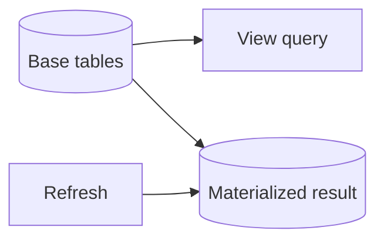

# Views & Materialized Views

## **62. What is a view in database?**



**View** হলো ডাটাবেজের একটি virtual table, যা এক বা একাধিক মূল table থেকে ডেটা নিয়ে তৈরি হয়। এটি physically কোনো ডেটা স্টোর করে না; বরং এটি মূলত একটি সেভ করা SQL query, যা কল করা হলে রান হয়ে ডেটা প্রদর্শন করে।

**Technical Definition:** View হলো একটি pre-defined SQL query যা অবিকল একটি সাধারণ টেবিলের মতো আচরণ করে, কিন্তু নিজে কোনো ডেটা ধারণ করে না। এটি শুধুমাত্র underlying (মূল) base tables থেকে ডেটা fetch করে display করে।

### Types of Views:

#### **1. Simple Views (Single Table):**
যখন View শুধুমাত্র একটি মাত্র টেবিলের ওপর ভিত্তি করে তৈরি হয় এবং এতে কোনো জটিল ফাংশন (যেমন: GROUP BY, HAVING) থাকে না।
```sql
-- Simple view from one table
CREATE VIEW high_salary_employees AS
SELECT 
    employee_id,
    name,
    email,
    salary,
    department
FROM employees
WHERE salary > 50000;

-- Usage
SELECT * FROM high_salary_employees WHERE department = 'Engineering';
```

#### **2. Complex Views (Multiple Tables/Joins):**
যখন View একাধিক টেবিল (JOIN ব্যবহার করে) অথবা এগ্রিগেট ফাংশন ব্যবহার করে তৈরি হয়।
```sql
-- Complex view with joins and calculations
CREATE VIEW employee_department_details AS
SELECT 
    e.employee_id,
    e.name as employee_name,
    e.email,
    e.salary,
    d.department_name,
    d.location as department_location,
    d.budget as department_budget,
    m.name as manager_name,
    YEAR(CURDATE()) - YEAR(e.hire_date) as years_of_service,
    CASE 
        WHEN e.salary > 80000 THEN 'Senior'
        WHEN e.salary > 50000 THEN 'Mid-level'
        ELSE 'Junior'
    END as level_category
FROM employees e
JOIN departments d ON e.department_id = d.department_id
LEFT JOIN employees m ON e.manager_id = m.employee_id
WHERE e.status = 'ACTIVE';

-- Usage with additional filtering
SELECT 
    employee_name,
    department_name,
    salary,
    level_category,
    manager_name
FROM employee_department_details
WHERE years_of_service > 2
ORDER BY salary DESC;
```

### Benefits of Views:

- **Security:** ইউজারদের মূল টেবিলের অ্যাক্সেস না দিয়ে, শুধু প্রয়োজনীয় কলামগুলো নিয়ে View তৈরি করে অ্যাক্সেস দেওয়া যায়।
- **Abstraction:** অনেকগুলো Join এবং Complex Business Logic লুকিয়ে রেখে একটি সিম্পল ইন্টারফেস প্রদান করে।
- **Simplicity:** বারবার বড় এবং জটিল query লেখার বদলে একবার View তৈরি করে সেটি সাধারণ টেবিলের মতো `SELECT` করা যায়।

### Updatable vs Non-Updatable Views:

সব View আপডেট করা যায় না। View এর ধরন অনুযায়ী এটি নির্ভর করে।

#### **Updatable Views:**

Simple view-গুলোর মাধ্যমে মূল টেবিলে ডেটা Insert, Update বা Delete করা সম্ভব (যদি তাতে কোনো Primary Key বা Not Null কলাম বাদ না পড়ে)।

```sql
CREATE VIEW active_employees AS
SELECT employee_id, name, email, department, salary
FROM employees
WHERE status = 'ACTIVE';

-- These operations work directly on the base table through the view
INSERT INTO active_employees (name, email, department, salary)
VALUES ('নতুন কর্মচারী', 'new@company.com', 'IT', 55000);

UPDATE active_employees SET salary = 60000 WHERE employee_id = 123;

```

#### **Non-Updatable Views:**

Complex view (যেগুলোতে JOIN, GROUP BY, DISTINCT, বা Aggregate Functions থাকে) সাধারণত সরাসরি আপডেট করা যায় না।

```sql
CREATE VIEW department_statistics AS
SELECT 
    d.department_name,
    COUNT(e.employee_id) as employee_count,
    AVG(e.salary) as avg_salary
FROM departments d
LEFT JOIN employees e ON d.department_id = e.department_id
GROUP BY d.department_id, d.department_name;

-- These operations will FAIL ❌
-- UPDATE department_statistics SET avg_salary = 70000;

```
### Advanced View Examples:
#### **Data Access Control (Role-based security):**

সেনসিটিভ ডেটা (যেমন: বেতন বা পাসওয়ার্ড) লুকিয়ে রেখে সাধারণ ইউজারদের জন্য View তৈরি করা।

```sql
CREATE VIEW public_employee_info AS
SELECT 
    employee_id,
    name,
    department,
    email,
    -- Hide actual salary logically
    CASE 
        WHEN department = 'HR' THEN 'Confidential'
        ELSE 'Not Disclosed'
    END as salary_info
FROM employees;

-- Grant access to view ONLY, not the main table
GRANT SELECT ON public_employee_info TO 'intern_user'@'%';

```

#### **Real-time Dashboard View:**

ড্যাশবোর্ডের জন্য একাধিক মেট্রিক্স একসাথে ক্যালকুলেট করে একটি View এ রাখা, যাতে ফ্রন্টএন্ড থেকে শুধু একটি কুয়েরি করলেই সব ডেটা পাওয়া যায়।

```sql
CREATE VIEW business_dashboard AS
SELECT 
    (SELECT COUNT(*) FROM orders WHERE DATE(order_date) = CURDATE()) as today_orders,
    (SELECT COALESCE(SUM(total_amount), 0) FROM orders WHERE DATE(order_date) = CURDATE()) as today_revenue,
    (SELECT COUNT(*) FROM products WHERE stock_quantity < 10) as low_stock_items;

-- Dashboard UI can just run:
SELECT * FROM business_dashboard;

```
## **63. What is a materialized view?**

**Materialized View** হল একটি view যার result set physically stored থাকে database এ। Regular view এর মতো এটি virtual নয়, বরং actual data store করে এবং periodic refresh করা হয় performance improvement এর জন্য।

**Technical definition:** Materialized view হল pre-computed result set যা disk এ stored থাকে এবং underlying data change হলে manually বা automatically refresh করা হয়।

### Regular View vs Materialized View:

| Aspect | Regular View | Materialized View |
|--------|-------------|------------------|
| **Storage** | Virtual (no storage) | Physical storage required |
| **Performance** | Query executed each time | Pre-computed, fast access |
| **Data Freshness** | Always current | May be stale, needs refresh |
| **Memory Usage** | Minimal | Requires storage space |
| **Maintenance** | No maintenance needed | Requires refresh strategy |

### Basic Materialized View Creation:

#### **1. Creating a Materialized View:**

ধরা যাক, আমাদের মিলিয়ন মিলিয়ন সেলস রেকর্ড আছে। আমরা মাস-ভিত্তিক একটি রিপোর্ট তৈরি করতে চাই।

```sql
-- Creating the Materialized View
CREATE MATERIALIZED VIEW monthly_sales_summary AS
SELECT 
    DATE_TRUNC('month', order_date) as sales_month,
    d.department_name,
    COUNT(s.order_id) as total_orders,
    SUM(s.total_amount) as total_revenue
FROM sales s
JOIN departments d ON s.department_id = d.department_id
WHERE s.status = 'COMPLETED'
GROUP BY sales_month, d.department_name;

-- Querying (It will return data instantly as it's pre-calculated)
SELECT * FROM monthly_sales_summary WHERE department_name = 'Electronics';

```

#### **2. Refreshing the Data (ডেটা আপডেট করা):**

যেহেতু Materialized View ফিজিক্যাল ডেটা স্টোর করে, তাই মূল টেবিলে (sales) নতুন ডেটা আসলে ভিউটি নিজে নিজে আপডেট হয় না (যতক্ষণ না আপনি ইনস্ট্রাকশন দিচ্ছেন)। একে আপডেট করতে হয়:

```sql
-- Manual refresh (সব ডেটা নতুন করে ক্যালকুলেট করে রিপ্লেস করবে)
REFRESH MATERIALIZED VIEW monthly_sales_summary;

-- Concurrent Refresh (ভিউ লক না করেই ব্যাকগ্রাউন্ডে আপডেট করবে, তবে এর জন্য ইনডেক্স থাকতে হবে)
REFRESH MATERIALIZED VIEW CONCURRENTLY monthly_sales_summary;

```
* **Data Staleness (পুরোনো ডেটা):** Refresh করার আগ পর্যন্ত আপনি পুরোনো ডেটাই দেখতে পাবেন। রিয়েল-টাইম ট্রানজেকশনের (যেমন: ব্যাংকিং ব্যালেন্স চেক) জন্য এটি উপযুক্ত নয়।
* **Storage Space:** যেহেতু এটি ফিজিক্যালি ডেটা স্টোর করে, তাই সাধারণ ভিউয়ের তুলনায় এটি ডাটাবেজে স্টোরেজ স্পেস দখল করে।
* **MySQL Support:** আপনি যদি **MySQL** ব্যবহার করে থাকেন, তবে জেনে রাখা ভালো যে MySQL-এ সরাসরি (Native) `CREATE MATERIALIZED VIEW` কমান্ড নেই। MySQL-এ একটি সাধারণ টেবিল তৈরি করে Stored Procedures, Triggers অথবা Events (Cron jobs) এর মাধ্যমে ডেটা ইনসার্ট/আপডেট করে Materialized View-এর কনসেপ্টটি ইমপ্লিমেন্ট করতে হয়

### When to Use Materialized Views:

#### **Good Use Cases:**
- **Performance Optimization:** বড় বড় ডেটাবেজে মিলিয়ন মিলিয়ন রো (Rows) এর ওপর JOIN বা GROUP BY চালানো অনেক সময়সাপেক্ষ। Materialized View এই ক্যালকুলেশন আগে থেকেই করে রাখে বলে রিপোর্ট বা ড্যাশবোর্ড লোড হতে সময় লাগে না।
- **Reduced Database Load:** একই ভারী কুয়েরি বারবার রান না করে, সেভ করা রেজাল্ট দেখায় বলে ডাটাবেজ সার্ভারের ওপর প্রসেসিং লোড অনেক কমে যায়।
- **Data Warehousing & Analytics:** হিস্টোরিক্যাল ডেটা অ্যানালাইসিস এবং রিপোর্টিংয়ের জন্য এটি সবচেয়ে বেশি ব্যবহৃত হয়।

#### **Avoid When:**
- Data changes very frequently (refresh overhead)
- Storage space is limited
- Real-time accuracy is critical
- Simple queries that are already fast

Materialized views হল performance optimization এর powerful tool, কিন্তু proper refresh strategy এবং maintenance planning প্রয়োজন।

---
