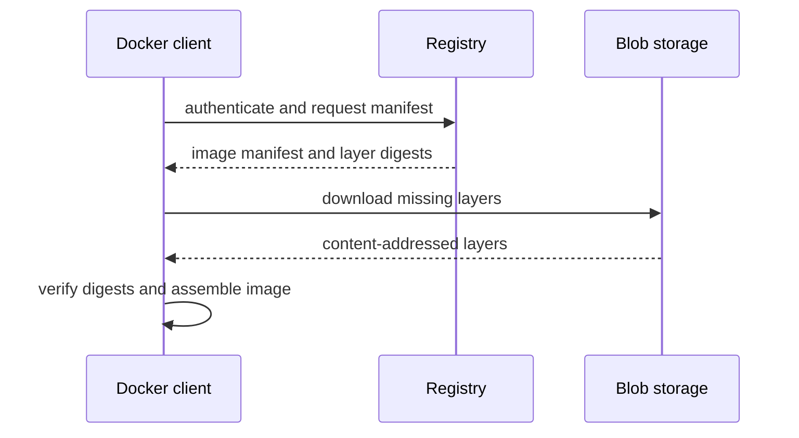
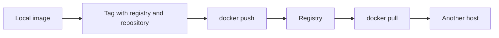
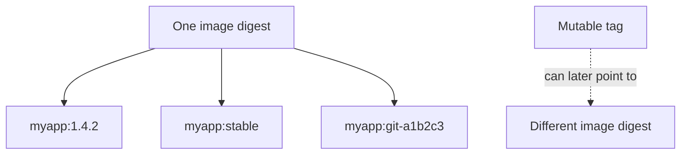
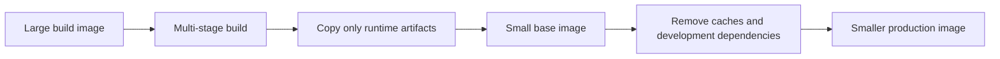
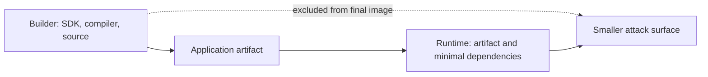

## 6. What is Docker Hub, and how do image registries work?


**Docker Hub** হলো Docker-এর official **public container registry** — মূলত এটি Docker Image-এর জন্য একটি cloud-based repository। GitHub যেমন source code store এবং share করার জায়গা, Docker Hub তেমনি Docker Image store এবং share করার জায়গা।

```
GitHub    : Source Code → Push/Pull → github.com
Docker Hub: Docker Image → Push/Pull → hub.docker.com

**Image Registry** কাজ করে অনেকটা GitHub-এর মতো, তবে code-এর বদলে এখানে Docker images থাকে।
```

#### Registry-র কাজের ধারা:

```
Developer → docker build → Local Image
Local Image → docker push → Registry (Docker Hub)
অন্য Server → docker pull → Registry থেকে Image নামিয়ে আনে
অন্য Server → docker run → Container চালু হয়
```

Registry মূলত একটি **HTTP-based storage server** যেখানে:
- প্রতিটি image একটি **repository**-তে থাকে
- প্রতিটি repository-তে একাধিক **tag** থাকতে পারে
- Images আসলে একাধিক **layer** দিয়ে তৈরি, যা আলাদাভাবে store হয়

---

### What is the difference between a public and private Docker registry?

| বিষয় | Public Registry | Private Registry |
|-------|----------------|-----------------|
| **Access** | যে কেউ `pull` করতে পারে | শুধু authorized user-রা access পায় |
| **Visibility** | সবার কাছে দৃশ্যমান | শুধু নির্দিষ্ট team/org দেখতে পায় |
| **ব্যবহার** | Open-source projects, official images | Proprietary codebase, internal tools |
| **খরচ** | বিনামূল্যে | Docker Hub-এ paid plan লাগে (self-hosted হলে infrastructure খরচ) |
| **উদাহরণ** | `nginx`, `ubuntu`, `python` | কোম্পানির নিজস্ব app image |

```bash
# Public image pull (কোনো authentication লাগে না)
docker pull nginx

# Private image pull (login করতে হয়)
docker pull mycompany.registry.io/backend-api:v2.1
```

---

### How do you push and pull images from Docker Hub?



**ধাপ ১ — Docker Hub-এ Login করো**

```bash
docker login
# Username এবং Password চাইবে
```

**ধাপ ২ — Image Build করো**

```bash
docker build -t my-app:1.0 .
```

**ধাপ ৩ — Image-কে Proper Tag দাও**

Docker Hub-এ push করতে image-এর নাম হতে হবে:
`<dockerhub-username>/<repository-name>:<tag>`

```bash
docker tag my-app:1.0 johndoe/my-app:1.0
```

**ধাপ ৪ — Docker Hub-এ Push করো**

```bash
docker push johndoe/my-app:1.0
```

**ধাপ ৫ — যেকোনো জায়গা থেকে Pull করো**

```bash
docker pull johndoe/my-app:1.0
```

> **মনে রাখো:** Pull করতে public image হলে login লাগে না, কিন্তু private image হলে অবশ্যই `docker login` করতে হবে।

---

### What is the difference between Docker Hub and a self-hosted registry like Harbor?

| বিষয় | Docker Hub | Harbor (Self-Hosted) |
|-------|-----------|----------------------|
| **Host করে** | Docker Inc. (cloud) | তুমি নিজে (on-premise / cloud VM) |
| **Control** | সীমিত control | সম্পূর্ণ নিজের নিয়ন্ত্রণ |
| **Security Scanning** | সীমিত (paid plan-এ ভালো) | Built-in Trivy/Clair scanner |
| **Rate Limit** | আছে (anonymous pull সীমিত) | নেই |
| **RBAC** | সীমিত | Granular Role-Based Access Control |
| **খরচ** | Free tier আছে, paid plan লাগে বড় ব্যবহারে | Infrastructure খরচ, কিন্তু software free |
| **Compliance** | Data বাইরে থাকে | Data নিজের infrastructure-এ থাকে |
| **উপযুক্ত** | ছোট টিম, open-source | Enterprise, regulated industries |

### Harbor ব্যবহার করবে যখন:
- Data sovereignty দরকার (data দেশের বাইরে যেতে পারবে না)
- Advanced security scanning চাই
- Docker Hub-এর rate limit সমস্যা হচ্ছে
- বড় organization যেখানে fine-grained access control দরকার

---

### How do image tags work, and what is the significance of the `latest` tag?

**Tag** হলো একটি image-এর **label বা version identifier**। একই image-এর বিভিন্ন version আলাদা tag দিয়ে চেনা যায়।

```bash
myapp:1.0      # Version 1.0
myapp:1.1      # Version 1.1
myapp:stable   # Stable release
myapp:latest   # সর্বশেষ (?)
```

#### Tag-এর সাথে Image Push করা

```bash
docker build -t johndoe/myapp:2.5 .
docker push johndoe/myapp:2.5

# একই image-এ একাধিক tag দেওয়া যায়
docker tag johndoe/myapp:2.5 johndoe/myapp:stable
docker push johndoe/myapp:stable
```

---

#### `latest` Tag — একটি বিপজ্জনক ভুল ধারণা

`latest` tag **automatically update হয় না।** এটি শুধুমাত্র তখনই update হয় যখন তুমি manually সেই tag দিয়ে push করো।

```bash
# এটি করলে latest update হয়
docker tag myapp:3.0 johndoe/myapp:latest
docker push johndoe/myapp:latest
```

#### `latest` ব্যবহারের সমস্যা

```bash
# Production-এ এটি করা বিপজ্জনক!
docker pull johndoe/myapp:latest
# কোন version পাবে? নিশ্চিত না!
```

| সমস্যা | ব্যাখ্যা |
|--------|----------|
| **Reproducibility নেই** | দুইবার pull করলে ভিন্ন image পেতে পারো |
| **Debugging কঠিন** | কোন exact version চলছে বোঝা যায় না |
| **Unexpected Breakage** | নতুন `latest` হঠাৎ production ভেঙে দিতে পারে |

#### Best Practice — Semantic Versioning ব্যবহার করো

```bash
# ভালো পদ্ধতি
docker push johndoe/myapp:2.5.1
docker push johndoe/myapp:2.5
docker push johndoe/myapp:2

# Production-এ সবসময় specific tag ব্যবহার করো
docker run johndoe/myapp:2.5.1
```

> `latest` ট্যাগ development বা quick testing-এ ঠিক আছে, কিন্তু **production environment-এ কখনো `latest` ব্যবহার করবে না।** সবসময় specific, immutable version tag ব্যবহার করো।
---

## 🏷️ 7. What is image tagging and versioning in Docker?


Docker-এ **tag** হলো একটি image-এর human-readable **label**, যা দিয়ে একই image-এর বিভিন্ন version আলাদা করা যায়।

একটি Docker image-এর পূর্ণ নামের গঠন এরকম:

```
registry/username/repository:tag
│         │         │          └── Version label (যেমন: 1.0, stable, latest)
│         │         └──────────── Image-এর নাম (যেমন: my-app)
│         └────────────────────── Docker Hub username বা org
└──────────────────────────────── Registry host (না দিলে Docker Hub default)
```

**উদাহরণ:**

```bash
nginx:1.25.3          # Nginx-এর specific version
python:3.12-slim      # Python 3.12, slim variant
johndoe/myapp:2.1.0   # নিজের app-এর version 2.1.0
```

#### Versioning কেন দরকার?

```
myapp:1.0  →  myapp:1.1  →  myapp:2.0
   │              │              │
Bug fix হলো   Feature যোগ    Breaking change —
               হলো            পুরনো API গেল
```

Tagging ছাড়া তুমি জানতে পারবে না কোন version production-এ চলছে, rollback করতে পারবে না, এবং team-এর সবাই ভিন্ন version চালাতে পারে।

---

### What is a digest (SHA256) in Docker images and how is it used?

```mermaid
flowchart LR
    Content[Image content] --> Hash[SHA256 digest]
    Hash --> Ref[repository@sha256:digest]
    Ref --> Verify[Pull exact immutable content]
```

**Digest** হলো একটি Docker image-এর **cryptographic fingerprint** — SHA256 hash দিয়ে তৈরি। এটি image-এর content থেকে generate হয়, তাই image একটুও বদলালে digest সম্পূর্ণ আলাদা হয়ে যায়।

```bash
sha256:a3b1c2d4e5f6...  ← এটিই digest (64 character hex string)
```

#### Digest দিয়ে Image Pull করা

```bash
# Tag-এর বদলে digest দিয়ে pull — 100% exact image পাবে
docker pull nginx@sha256:a3b1c2d4e5f67890abcdef1234567890abcdef1234567890abcdef1234567890ab
```

#### Tag বনাম Digest — কোনটা কী করে?

| বিষয় | Tag (`nginx:1.25.3`) | Digest (`nginx@sha256:...`) |
|-------|---------------------|---------------------------|
| **Mutable?** | হ্যাঁ, tag পরিবর্তন হতে পারে | না, সবসময় একই image |
| **Human-readable** | হ্যাঁ | না (64-char hex) |
| **Exact image গ্যারান্টি** | নেই | আছে |
| **ব্যবহার** | Development, সাধারণ কাজ | Production, security-critical |

#### Digest কেন গুরুত্বপূর্ণ?

```bash
# আজকে এই pull করলে nginx 1.25.3 পেলে
docker pull nginx:1.25.3

# ১ মাস পরে কেউ আবার pull করলে —
# tag একই, কিন্তু Docker Hub-এ image update হয়ে থাকতে পারে!
docker pull nginx:1.25.3  # ভিন্ন image আসতে পারে!

# কিন্তু digest দিলে সবসময় একই image
docker pull nginx@sha256:a3b1c2...  # সবসময় same image ✓
```

> **Real-world use case:** CI/CD pipeline এবং Kubernetes production deployment-এ digest ব্যবহার করলে **supply chain attack** থেকে রক্ষা পাওয়া যায়। কেউ যদি registry-তে same tag-এ malicious image push করেও দেয়, তোমার deployment বদলাবে না।

---

### Why is using the `latest` tag in production considered a bad practice?

`latest` কোনো magic tag না — এটি শুধু একটি সাধারণ tag যার নাম "latest"। Docker automatically এটি update করে না।

```bash
# তুমি যখন tag না দিয়ে build করো
docker build -t myapp .
# Docker নিজে থেকে :latest লাগিয়ে দেয়
# অর্থাৎ → myapp:latest হয়
```

#### সমস্যা ১ — `latest` মানে সর্বশেষ না-ও হতে পারে

```bash
docker build -t johndoe/myapp:3.0 .
docker push johndoe/myapp:3.0
# latest এখনো 2.0-তে আছে! 3.0 push করা হয়নি latest-এ
```

```bash
# Correct উপায় — explicitly latest update করো
docker tag johndoe/myapp:3.0 johndoe/myapp:latest
docker push johndoe/myapp:latest
```

#### সমস্যা ২ — Reproducibility নষ্ট হয়

```bash
# জানুয়ারিতে deploy হলো
docker pull johndoe/myapp:latest  # → আসলে v2.1 এলো

# মার্চে নতুন server-এ deploy হলো
docker pull johndoe/myapp:latest  # → আসলে v3.5 এলো!

# দুটো server ভিন্ন version চালাচ্ছে — কেউ জানে না
```

#### সমস্যা ৩ — Rollback করা যায় না

```bash
# Production ভেঙে গেছে, rollback করতে চাও
docker pull johndoe/myapp:latest  # কোন version-এ ফিরবে??
# জানার কোনো উপায় নেই!

# Specific tag হলে সহজ ছিল
docker pull johndoe/myapp:2.9.1  # নিশ্চিত পুরনো stable version
```

#### সমস্যা ৪ — Debugging কঠিন হয়ে যায়

```bash
docker ps
# CONTAINER ID   IMAGE              COMMAND
# a1b2c3d4e5f6   myapp:latest      ...
# ↑ কোন exact version চলছে? বোঝার উপায় নেই
```

### How do you tag an existing image without rebuilding it?

`docker tag` command দিয়ে existing image-এ নতুন tag দেওয়া যায় — image rebuild করতে হয় না। এটি মূলত একটি **alias** তৈরি করে, নতুন কোনো copy তৈরি হয় না।

```bash
docker tag SOURCE_IMAGE[:TAG] TARGET_IMAGE[:TAG]
```

#### উদাহরণ ১ — নতুন version tag দাও

```bash
# আগে image আছে
docker images
# REPOSITORY      TAG     IMAGE ID
# johndoe/myapp   2.5     a1b2c3d4e5f6

# নতুন tag দাও
docker tag johndoe/myapp:2.5 johndoe/myapp:stable

# এখন দুটো tag একই image point করছে
docker images
# REPOSITORY      TAG      IMAGE ID
# johndoe/myapp   2.5      a1b2c3d4e5f6  ← same IMAGE ID
# johndoe/myapp   stable   a1b2c3d4e5f6  ← same IMAGE ID
```

#### উদাহরণ ২ — Image ID দিয়ে tag করো

```bash
# Image ID দিয়েও করা যায়
docker tag a1b2c3d4e5f6 johndoe/myapp:2.5.1
docker tag a1b2c3d4e5f6 johndoe/myapp:latest
```

#### উদাহরণ ৩ — ভিন্ন Registry-তে পাঠাতে tag করো

```bash
# Docker Hub থেকে নিজের private registry-তে পাঠাবে
docker pull nginx:1.25.3

# নিজের registry-র নাম দিয়ে tag করো
docker tag nginx:1.25.3 myregistry.company.com/infra/nginx:1.25.3

# এখন নিজের registry-তে push করো
docker push myregistry.company.com/infra/nginx:1.25.3
```

#### উদাহরণ ৪ — CI/CD Pipeline-এ Real-world ব্যবহার

```bash
#!/bin/bash
VERSION="2.5.1"
REPO="johndoe/myapp"

# একবার build করো
docker build -t $REPO:$VERSION .

# একাধিক tag দাও — rebuild লাগছে না
docker tag $REPO:$VERSION $REPO:2.5      # Minor alias
docker tag $REPO:$VERSION $REPO:2        # Major alias
docker tag $REPO:$VERSION $REPO:latest   # Latest alias

# সব tag push করো
docker push $REPO:$VERSION
docker push $REPO:2.5
docker push $REPO:2
docker push $REPO:latest
```

#### গুরুত্বপূর্ণ বিষয়

```bash
# docker tag শুধু local alias তৈরি করে
# Registry-তে পাঠাতে অবশ্যই docker push করতে হবে

docker tag myapp:old myapp:new   # শুধু local-এ নতুন tag হলো
docker push myapp:new            # এখন registry-তে গেল ✓
```

> **মনে রাখো:** `docker tag` কোনো নতুন image তৈরি করে না — শুধু একই image-এ একটি নতুন label যোগ করে। তাই এটি খুব দ্রুত এবং কোনো extra disk space নেয় না।

---

## 🧹 8. How do you manage and optimize Docker image sizes?


বড় Docker image মানে:
- **Slow deployment** — pull করতে বেশি সময়
- **বেশি bandwidth** খরচ — CI/CD pipeline ধীর হয়
- **বেশি storage** — registry এবং server-এ
- **বড় attack surface** — অপ্রয়োজনীয় package মানে বেশি vulnerability

```
একটি Node.js app-এর উদাহরণ:
node:latest base    →  1.1 GB   😱
node:slim base      →  240 MB   😐
node:alpine base    →  180 MB   🙂
Multi-stage build   →   85 MB   ✅
```

---

### What are some techniques to reduce Docker image size?

#### Technique ১ — সঠিক Base Image বেছে নাও

```dockerfile
# ❌ খারাপ — পুরো OS নিয়ে আসে
FROM node:20

# ✅ ভালো — শুধু দরকারি অংশ
FROM node:20-alpine
```

#### Technique ২ — .dockerignore ব্যবহার করো

`.dockerignore` ফাইল ছাড়া `COPY . .` করলে অপ্রয়োজনীয় সব ফাইল image-এ ঢোকে।

#### Technique ৩ — RUN Command একত্রিত করো

Docker-এ প্রতিটি `RUN` instruction একটি নতুন **layer** তৈরি করে। আলাদা `RUN` মানে আলাদা layer, মানে বেশি size।

```dockerfile
# ❌ খারাপ — ৩টি আলাদা layer তৈরি হয়
RUN apt-get update
RUN apt-get install -y curl wget git
RUN rm -rf /var/lib/apt/lists/*

# ✅ ভালো — একটিই layer, এবং cleanup একই layer-এ
RUN apt-get update && \
    apt-get install -y curl wget git && \
    rm -rf /var/lib/apt/lists/*
```

> **গুরুত্বপূর্ণ:** cleanup (`rm -rf /var/lib/apt/lists/*`) অবশ্যই **একই** `RUN` command-এ করতে হবে। আলাদা layer-এ করলে পুরনো layer-এ ফাইল থেকে যায়, size কমে না।

#### Technique ৪ — শুধু Production Dependency Install করো

```dockerfile
# Node.js-এ
RUN npm ci --only=production
# devDependencies বাদ যাবে → অনেক MB বাঁচবে

# Python-এ
COPY requirements-prod.txt .
RUN pip install --no-cache-dir -r requirements-prod.txt
# --no-cache-dir → pip cache image-এ রাখবে না
```

#### Technique ৫ — Unnecessary Tool বাদ দাও

```dockerfile
# ❌ Build tool production image-এ রাখার দরকার নেই
RUN apt-get install -y gcc make build-essential curl vim

# ✅ শুধু runtime-এ যা লাগে
RUN apt-get install -y libpq5
# অথবা multi-stage build ব্যবহার করো (নিচে দেখো)
```

#### Technique ৬ — Layer Cache সঠিকভাবে ব্যবহার করো

```dockerfile
# ❌ খারাপ — কোড বদলালেই dependencies আবার install হবে
COPY . .
RUN npm install

# ✅ ভালো — package.json আলাদা copy করো
# dependencies শুধু তখনই reinstall হবে যখন package.json বদলাবে
COPY package*.json ./
RUN npm ci --only=production
COPY . .
```

---

### How does multi-stage build reduce final image size?



App build করতে অনেক tool লাগে (compiler, test framework, build tools) — কিন্তু production-এ এগুলো দরকার নেই। Multi-stage build ছাড়া সব tool final image-এ থেকে যায়।

```
Build time লাগে:    gcc, make, npm, webpack, test libraries ...
Runtime-এ লাগে:    শুধু compiled output / bundled files
```

### Multi-Stage Build কীভাবে কাজ করে?

```dockerfile
# ── Stage 1: Builder ──────────────────────────────────
FROM node:20 AS builder
# ↑ এই stage-এর নাম "builder"

WORKDIR /app
COPY package*.json ./
RUN npm ci                    # dev dependencies সহ সব install
COPY . .
RUN npm run build             # TypeScript compile, webpack bundle ইত্যাদি
# এই stage-এ node_modules, source files, build tools সব আছে → বড়

# ── Stage 2: Production ───────────────────────────────
FROM node:20-alpine AS production
# ↑ একদম নতুন, পরিষ্কার image — আগের stage-এর কিছুই নেই

WORKDIR /app
COPY package*.json ./
RUN npm ci --only=production  # শুধু production dependencies

# Builder stage থেকে শুধু compiled output নিয়ে আসো
COPY --from=builder /app/dist ./dist
#    ↑ এই syntax দিয়ে আগের stage থেকে file copy হয়

EXPOSE 3000
CMD ["node", "dist/index.js"]

# Final image-এ আছে: alpine + prod dependencies + dist/
# Final image-এ নেই: source code, dev tools, node_modules (full), webpack...
```

---
