## 🔗 10. What are Docker network drivers, and what are their types?
Docker-এ **network driver** হলো একটি pluggable system যা নির্ধারণ করে containers কীভাবে একে অপরের সাথে এবং বাইরের world-এর সাথে communicate করবে। Docker-এর **Container Network Model (CNM)** এর উপর ভিত্তি করে এই driver-গুলো কাজ করে।

প্রতিটি network-এর তিনটি মূল component আছে — **Sandbox** (container-এর network stack), **Endpoint** (virtual network interface), এবং **Network** (driver-managed connectivity layer)।



#### 1. `bridge` (Default Driver)

এটি Docker-এর **default network driver**। যখন কোনো network specify না করে container run করা হয়, তখন automatically `bridge` ব্যবহার হয়।

**কীভাবে কাজ করে:** Docker একটি virtual `bridge` interface (`docker0`) তৈরি করে। প্রতিটি container একটি **veth pair** দিয়ে এই bridge-এ connect হয়। Container-গুলো নিজেদের মধ্যে communicate করতে পারে, কিন্তু host এবং বাইরের network থেকে isolated থাকে।

```bash
# Default bridge-এ run করা
docker run -d nginx

# Custom bridge network তৈরি
docker network create --driver bridge my-network
docker run -d --network my-network nginx
```

**কখন ব্যবহার করবে:** Single host-এ multiple container-এর মধ্যে communication দরকার হলে।

---

#### 2. `host`

Container-টি host machine-এর **network stack সরাসরি ব্যবহার করে** — কোনো network isolation নেই।

**কীভাবে কাজ করে:** Container-এর নিজস্ব কোনো IP address থাকে না। Host-এর IP এবং port সরাসরি ব্যবহার হয়।

```bash
docker run -d --network host nginx
# এখন nginx host-এর port 80-তে সরাসরি accessible
```

**কখন ব্যবহার করবে:** High-performance networking দরকার হলে, যেমন network monitoring tools বা performance-critical applications।

**সতর্কতা:** Port conflicts হতে পারে। Linux-only (Mac/Windows-এ কাজ করে না properly)।

---

#### 3. `none`

Container-এর **কোনো network interface থাকে না** — সম্পূর্ণ isolated।

```bash
docker run -d --network none alpine
# এই container ইন্টারনেটেও যেতে পারবে না, অন্য container-এও না
```

**কখন ব্যবহার করবে:** Batch processing jobs বা maximum security sandbox দরকার হলে।

---

#### 4. `overlay`

**Multi-host networking** এর জন্য। Docker Swarm বা Kubernetes cluster-এ বিভিন্ন host-এ থাকা container-গুলোকে একই network-এ আনে।

**কীভাবে কাজ করে:** VXLAN tunneling ব্যবহার করে physically আলাদা host-এর মধ্যে একটি virtual network তৈরি করে।

```bash
# Swarm mode-এ overlay network
docker network create --driver overlay my-overlay
docker service create --network my-overlay nginx
```

**কখন ব্যবহার করবে:** Docker Swarm cluster, distributed applications, microservices architecture।

---

#### 5. `macvlan`

প্রতিটি container একটি **আলাদা MAC address** পায় এবং physical network-এ directly appear করে — যেন এটি একটি আলাদা physical device।

```bash
docker network create \
  --driver macvlan \
  --subnet=192.168.1.0/24 \
  --gateway=192.168.1.1 \
  -o parent=eth0 \
  my-macvlan
```

**কখন ব্যবহার করবে:** Legacy applications যেগুলো directly physical network-এ থাকা দরকার, অথবা network monitoring।

**সমস্যা:** Host এবং container-এর মধ্যে direct communication করা কঠিন।

---

#### 6. `ipvlan`

`macvlan`-এর মতোই, কিন্তু সব container **একই MAC address share করে**, শুধু আলাদা IP পায়।

```bash
docker network create \
  --driver ipvlan \
  --subnet=192.168.1.0/24 \
  -o parent=eth0 \
  my-ipvlan
```

**কখন ব্যবহার করবে:** Wireless environments অথবা যেখানে MAC address restriction আছে (যেমন cloud providers)।

---

### `bridge`, `host`, `none`, এবং `overlay` — পার্থক্য ও ব্যবহার 

চারটি network-এর মূল পার্থক্যটা বোঝার সবচেয়ে ভালো উপায় হলো দেখা — প্রতিটিতে container, host machine, এবং বাইরের internet-এর মধ্যে relation কেমন। নিচে সেটা diagram আকারে দেখানো হলো, তারপর বিস্তারিত ব্যাখ্যা।



এবার প্রতিটি network mode-এর মূল পার্থক্যগুলো বিস্তারিত দেখি।

---

#### `bridge` — আংশিক isolation, port mapping দরকার

`bridge` হলো Docker-এর **default network mode**। Docker একটি virtual switch (`docker0`) তৈরি করে এবং প্রতিটি container-কে একটি **veth pair** দিয়ে সেই switch-এ connect করে।

Container-গুলো নিজেদের মধ্যে কথা বলতে পারে, কিন্তু বাইরের world থেকে access করতে হলে **NAT (Network Address Translation)** এবং explicit port mapping দরকার।

```bash
# container-এর port 80 কে host-এর port 8080-এ map করা
docker run -d -p 8080:80 nginx
```

Host machine-এর বাইরে থেকে `http://host-ip:8080` দিয়ে access করতে হবে — সরাসরি container-এর IP দিয়ে না।

---

#### `host` — কোনো isolation নেই, সর্বোচ্চ performance

`host` mode-এ container-টি host-এর **network stack সরাসরি share করে** — আলাদা কোনো virtual network interface নেই, আলাদা IP নেই।

Container যদি port `80` listen করে, সেটা সরাসরি host-এর port `80` — কোনো NAT বা port mapping ছাড়াই।

```bash
docker run -d --network host nginx
# এখন host-এর port 80-এ সরাসরি accessible, -p flag লাগবে না
```

**দুটো বড় সীমাবদ্ধতা আছে:**
- Host-এ যদি port `80` already ব্যবহার হচ্ছে, **port conflict** হবে
- Linux-only — Docker Desktop (Mac/Windows)-এ ঠিকমতো কাজ করে না

---

#### `none` — সম্পূর্ণ isolation

`none` mode-এ container-এর কোনো network interface থাকে না — শুধু `loopback` (`lo`) থাকে। Internet নেই, অন্য container-এও যোগাযোগ নেই।

```bash
docker run -d --network none alpine sleep 3600

# container-এর ভেতরে গিয়ে দেখলে:
# ip addr → শুধু lo: 127.0.0.1 দেখাবে
```

এই mode-টি **security sandbox** হিসেবে ব্যবহার হয় — যেমন untrusted code চালানো বা cryptographic key processing যেখানে network access দেওয়া বিপজ্জনক।

---

#### `overlay` — multi-host networking

`overlay` network-এ physically আলাদা আলাদা host-এ থাকা container-গুলো একই virtual network-এ থাকতে পারে। **VXLAN tunneling** ব্যবহার করে দুটি host-এর মধ্যে একটি encrypted tunnel তৈরি হয়।

এই mode টি primarily **Docker Swarm** বা **Kubernetes**-এর জন্য।

```bash
# Swarm mode initialize করতে হবে আগে
docker swarm init

# তারপর overlay network তৈরি
docker network create --driver overlay my-cluster-net

# service deploy করা
docker service create --network my-cluster-net --replicas 3 nginx
```

`bridge`-এর মতোই দেখতে, কিন্তু পার্থক্য হলো — container গুলো ভিন্ন physical machine-এ থাকলেও একে অপরকে **directly** ping করতে পারে।

---

### `When would you use the `host` network mode?

`host` mode ব্যবহারের সিদ্ধান্ত নেওয়ার আগে মূল প্রশ্ন হলো — **NAT-এর overhead কি সত্যিই সমস্যা করছে?**

তিনটি concrete scenario-তে `host` mode যুক্তিসংগত:

**১. High-throughput networking দরকার:** যেমন প্রতি সেকেন্ডে লক্ষাধিক packet process করা network monitoring tool, IDS (Intrusion Detection System), বা packet sniffer। NAT-এর extra hop এখানে measurable latency যোগ করে।

**২. Raw socket বা প্রচুর dynamic port দরকার:** যেমন `tcpdump`, `Wireshark`, বা WebRTC-based application যেগুলো অনেকগুলো ephemeral port খোলে — `-p` flag দিয়ে সবগুলো map করা practical না।

**৩. Host-এর network interface সরাসরি দেখা দরকার:** যেমন DHCP server, VPN gateway, বা network configuration tool যেগুলো host-এর actual NIC-এর সাথে কাজ করে।

সাধারণ web application বা microservice-এর জন্য `host` mode দরকার নেই — `bridge`ই যথেষ্ট এবং বেশি secure।

### What is the default network mode for a Docker container?

Docker container-এর default network mode হলো **`bridge`**। যখন তুমি কোনো `--network` flag ছাড়া container run করো, Docker automatically সেটাকে `docker0` নামের default bridge network-এ যুক্ত করে।

```bash
# এই দুটো command একই কাজ করে
docker run nginx
docker run --network bridge nginx
```

```bash
# verify করতে
docker inspect <container_id> | grep NetworkMode
# output: "NetworkMode": "bridge"
```

তবে **default bridge** আর **user-defined bridge**-এর মধ্যে একটা গুরুত্বপূর্ণ পার্থক্য আছে — সেটা হলো DNS resolution, যেটা দ্বিতীয় প্রশ্নে বিস্তারিত আলোচনা করা হয়েছে।

---

### How does DNS resolution work between containers on the same bridge network?

এখানে **default bridge** আর **user-defined bridge** আলাদাভাবে আচরণ করে।



**Default Bridge-এ DNS কাজ করে না — কেন?**

Default `bridge` network (`docker0`) পুরনো design-এর। এখানে Docker কোনো embedded DNS server চালায় না। Container গুলো শুধুমাত্র IP address দিয়ে একে অপরকে চেনে।

```bash
# default bridge-এ run করলে
docker run -d --name web nginx
docker run -d --name db postgres

# web থেকে db-তে name দিয়ে ping করলে FAIL হবে
docker exec web ping db
# ping: db: Name or service not known  ❌
```

একমাত্র উপায় ছিল `--link` flag, কিন্তু সেটা এখন **deprecated**।

---

**User-defined Bridge-এ DNS কীভাবে কাজ করে?**

User-defined bridge network তৈরি করলে Docker automatically একটি **embedded DNS server** চালায় — `127.0.0.11:53`। প্রতিটি container-এর `/etc/resolv.conf`-এ এই address থাকে।

```bash
# network তৈরি করো
docker network create my-net

# container run করো
docker run -d --name web --network my-net nginx
docker run -d --name db  --network my-net postgres

# এখন name দিয়েই communicate করা যাবে
docker exec web ping db         # ✅ কাজ করবে
docker exec web curl http://db  # ✅ কাজ করবে
```

Container-এর ভেতরে গিয়ে দেখলে —

```bash
docker exec web cat /etc/resolv.conf
# nameserver 127.0.0.11
# options ndots:0
```

---

**DNS Resolution-এর ধাপগুলো**

`web` container থেকে `db`-কে call করলে যা হয়:

```
web container
  └── "db" নামটা resolve করতে হবে
       └── /etc/resolv.conf → nameserver 127.0.0.11
            └── Docker embedded DNS server
                 └── "db" → 172.18.0.3
                      └── packet চলে যায় db container-এ ✅
```

Container restart হলেও `db` নামটা same থাকে — শুধু IP পেছনে internally update হয়। তোমার code-এ কোনো পরিবর্তন লাগে না।

---

**Default vs User-defined Bridge — একটু তুলনা**

| বিষয় | `default bridge` | `user-defined bridge` |
|---|---|---|
| DNS by container name | ✗ নেই | ✅ আছে |
| Communication | IP দিয়ে | Name দিয়ে |
| `--link` দরকার | হ্যাঁ (deprecated) | না |
| Isolation | সব container একসাথে | Network অনুযায়ী আলাদা |
| Production ready | না | হ্যাঁ |

> **Best practice:** Production বা Docker Compose-এ সবসময় user-defined bridge ব্যবহার করো। Docker Compose এটা automatically করে — প্রতিটি `docker-compose.yml` একটি আলাদা network তৈরি করে যেখানে service name-ই hostname হিসেবে কাজ করে।

## 🛡️ 11. How does Docker container networking work internally?

#### Linux Networking Primitives — Docker-এর ভিত্তি

Docker নিজে কোনো নতুন networking system তৈরি করেনি। এটি Linux kernel-এর তিনটি existing feature একসাথে ব্যবহার করে:

**Network Namespace** — প্রতিটি container একটি আলাদা isolated network stack পায় (নিজস্ব routing table, iptables rules, interfaces)।

**veth pair** — দুটি virtual NIC যেগুলো একটি "wire" দিয়ে সংযুক্ত — একটিতে যা ঢোকে অন্যটি থেকে বের হয়।

**Linux bridge (`docker0`)** — একটি software-based Layer 2 switch যেটি veth pair-গুলোকে একসাথে connect করে।



###  What is a `veth` pair and how does Docker use it?

`veth` মানে **virtual ethernet**। এটা সবসময় জোড়ায় আসে — একটা end container-এর ভেতরে (`eth0`), অন্যটা host-এ (`vethXXXXXX`)। একটায় কিছু ঢুকলে অন্যটায় বেরোয় — ঠিক একটা physical cable-এর মতো, কিন্তু software-এ।Docker প্রতিটি container তৈরির সময় automatically এই কাজগুলো করে:

```bash
# Docker যা করে (internally):
ip link add veth3f2a1b type veth peer name eth0   # pair তৈরি
ip link set eth0 netns <container-pid>            # eth0 কে container-এ দিয়ে দেওয়া
ip addr add 172.17.0.2/16 dev eth0               # container-এ IP assign
ip link set veth3f2a1b up                         # host-side চালু করা

# verify করতে:
ip link show type veth                            # সব veth pair দেখা যাবে
```

### What is the `docker0` bridge interface?


`docker0` হলো Linux-এর `bridge` module দিয়ে তৈরি একটি **virtual network switch**। এটি Layer 2-এ কাজ করে — MAC address দেখে packet forward করে, ঠিক physical switch-এর মতো।

`veth`-এর host-side end গুলো কোথাও connect হতে হবে। `docker0` হলো সেই **virtual switch (Linux bridge)** — সব container-এর `vethXXXX` গুলো এই bridge-এ plug in হয়।
```bash
# docker0 দেখা:
ip addr show docker0
# → inet 172.17.0.1/16 — এটাই সব container-এর default gateway

# bridge-এ কোন কোন veth attached আছে দেখা:
bridge link show
# → veth3f2a1b master docker0 state forwarding

# container-এর routing table:
docker exec mycontainer ip route
# → default via 172.17.0.1 dev eth0   ← docker0-কেই gateway হিসেবে দেখে
```

`docker0` একটি **Layer 2 switch** হিসেবে কাজ করে — same network-এ থাকা container-গুলোর মধ্যে frame forward করে। Internet-এ যেতে হলে packet `docker0` → host `eth0` → NAT → internet পথে যায়।

---

### How does Docker implement inter-container communication (ICC)?

দুটি container যখন same bridge network-এ থাকে, তখন তারা `docker0`-এর মাধ্যমে সরাসরি কথা বলতে পারে। Kernel-এ এটি implement হয় **iptables FORWARD chain** দিয়ে।

```
Container A (172.17.0.2) → vethA → docker0 → vethB → Container B (172.17.0.3)
```



Docker daemon দুটি mode support করে:

```bash
# ICC enable (default) — FORWARD chain-এ ACCEPT rule
dockerd --icc=true

# ICC disable — FORWARD chain-এ DROP rule, explicit --link ছাড়া কথা হবে না
dockerd --icc=false
```

`iptables`-এ এটি এভাবে দেখা যায়:

```bash
iptables -L FORWARD -n
# Chain FORWARD (policy DROP)
# DOCKER-USER          all  -- 0.0.0.0/0  0.0.0.0/0
# DOCKER-ISOLATION-STAGE-1  all  -- ...
# ACCEPT  all  -- 0.0.0.0/0  0.0.0.0/0   ctstate RELATED,ESTABLISHED
# DOCKER   all  -- 0.0.0.0/0  0.0.0.0/0
# ACCEPT  all  -- 0.0.0.0/0  0.0.0.0/0   (icc=true হলে)
```

আলাদা network-এ থাকা container-গুলো by default একে অপরের সাথে কথা বলতে **পারে না** — তাদের মধ্যে কোনো bridge connection নেই।

---

### How does port mapping (`-p`) work at the kernel level?

`-p 8080:80` দিলে মনে হয় Docker কিছু magic করছে — আসলে এটি সম্পূর্ণভাবে **iptables NAT rules** দিয়ে implement করা।

```bash
docker run -d -p 8080:80 nginx
```



এই command-টি চালালে Docker পর্দার আড়ালে দুটি iptables rule যোগ করে:

```bash
# Rule ১ — Inbound: DNAT (Destination NAT)
# বাইরে থেকে host:8080 আসা packet-এর destination বদলে দাও → container:80
iptables -t nat -A DOCKER \
  -p tcp --dport 8080 \
  -j DNAT --to-destination 172.17.0.2:80

# Rule ২ — Outbound: MASQUERADE
# container থেকে বাইরে যাওয়া packet-এর source IP বদলে host-এর IP দাও
iptables -t nat -A POSTROUTING \
  -s 172.17.0.2/32 \
  -d 172.17.0.2/32 \
  -p tcp --dport 80 \
  -j MASQUERADE
```

Packet journey টা step-by-step:

```
Client → host:8080
  ↓ iptables PREROUTING (DNAT)
  ↓ destination বদলে → 172.17.0.2:80
  ↓ kernel routing → docker0 bridge
  ↓ veth pair → container-এর eth0
  ↓ nginx process port 80-এ receive করে
```

তুমি নিজে এই rules দেখতে পারবে:

```bash
iptables -t nat -L -n --line-numbers
# Chain DOCKER (2 references)
# num  target  prot  opt  source     destination
# 1    DNAT    tcp   --   0.0.0.0/0  0.0.0.0/0   tcp dpt:8080 to:172.17.0.2:80
```
---
>মূল কথা হলো — Docker networking মূলত **তিনটি Linux kernel feature-এর orchestration**: `network namespace` দিয়ে isolation, `veth pair` দিয়ে connectivity, এবং `iptables` দিয়ে NAT ও access control। Docker daemon শুধু এই tools-গুলো সঠিক সময়ে সঠিকভাবে configure করে।

## 🌍 12. How do containers communicate with each other and with the outside world?

**Path A — Container ↔ Container (same network):**
একই bridge network-এ থাকলে traffic সরাসরি `docker0` bridge দিয়ে যায়। NAT লাগে না, internet-এ যায় না। User-defined network-এ container name দিয়েই reach করা যায়।

**Path B — Container → Internet (outbound):**
Container-এর packet `docker0` → `eth0` পথে যায়। `iptables POSTROUTING` chain-এ `MASQUERADE` rule container-এর private IP (172.17.x.x) কে host-এর public IP-তে বদলে দেয়।

**Path C — Internet → Container (inbound):**
`-p 8080:80` দিলে `iptables PREROUTING`-এ `DNAT` rule তৈরি হয়। Host-এর `8080`-এ আসা packet-এর destination `172.17.0.2:80`-এ rewrite হয়।

---

### What is the difference between exposing a port (`EXPOSE`) and publishing a port (`-p`)?
এটা শুধুমাত্র **documentation** — container কোন port-এ listen করার ইচ্ছা রাখে সেটা জানায়। কোনো actual binding হয় না, host-এ কোনো port খোলে না। Same network-এর অন্য container এই port reach করতে পারে, কিন্তু বাইরের world পারে না।

```dockerfile
# Dockerfile
EXPOSE 80        # শুধু বলছে — "আমি 80-এ listen করব"
EXPOSE 80/tcp
EXPOSE 53/udp
```

**`-p` (docker run):**
এটা **actual action** — host-এ port bind করে এবং `iptables`-এ `DNAT` rule তৈরি করে। এছাড়া `docker-proxy` process-ও start হয়।

```bash
# Syntax
docker run -p [host_ip:]<host_port>:<container_port>[/protocol]

docker run -p 8080:80 nginx          # 0.0.0.0:8080 → container:80
docker run -p 127.0.0.1:8080:80 nginx  # শুধু localhost থেকে
docker run -p 80 nginx               # random host port → container:80
docker run -P nginx                  # সব EXPOSE করা port publish করো
```
---

### How does Docker handle container-to-container communication across hosts?

Single host-এ `docker0` bridge কাজ করে, কিন্তু **আলাদা host**-এ থাকা container গুলো নিজেরা নিজেরা reach করতে পারে না — কারণ `172.17.x.x` address গুলো private এবং host-এর বাইরে routable না।

সমাধানের উপায়:

```
১. Overlay Network    → Docker Swarm / Kubernetes (সবচেয়ে native)
২. Host Network       → container-এর port directly expose করো, IP দিয়ে reach করো
৩. External Load Balancer → HAProxy, Nginx, Traefik
৪. Service Mesh       → Consul, Istio (advanced)
```

Overlay network ছাড়া manually করতে হলে:
```bash
# Host A-তে container run করো, port publish করো
docker run -p 5432:5432 postgres

# Host B-তে container থেকে Host A-কে IP দিয়ে reach করো
docker run -e DB_HOST=192.168.1.10 -e DB_PORT=5432 my-app
```
এটা brittle — overlay network-ই সঠিক সমাধান।

---

### How do you connect a container to multiple networks?

একটি container একসাথে একাধিক network-এ থাকতে পারে। এটা দরকার হয় যখন container-কে **bridge** হিসেবে কাজ করতে হয় — যেমন একটি `api` container যেটা `frontend-net` থেকেও accessible, আবার `backend-net`-এও আছে।

**Docker Compose-এ:**

```yaml
services:
  nginx:
    image: nginx
    networks:
      - frontend-net      # শুধু frontend-এ

  api:
    image: my-api
    networks:
      - frontend-net      # nginx থেকে reach করতে পারবে
      - backend-net       # db-কেও reach করতে পারবে

  db:
    image: postgres
    networks:
      - backend-net       # শুধু backend-এ (nginx reach করতে পারবে না)

networks:
  frontend-net:
  backend-net:
```
---

> **মূল takeaway:** `EXPOSE` হলো blueprint, `-p` হলো actual wiring। Overlay network-ই multi-host communication-এর সঠিক সমাধান। আর multiple network দিয়ে fine-grained isolation তৈরি করা যায় — যেটা production architecture-এর best practice।

## 13. How do you disable inter-container communication on a custom bridge network?

    

---
