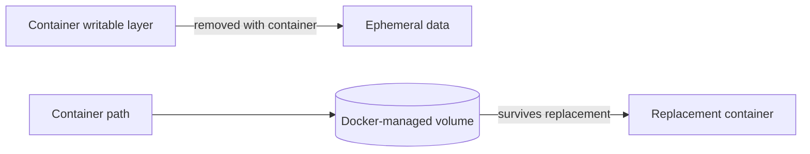
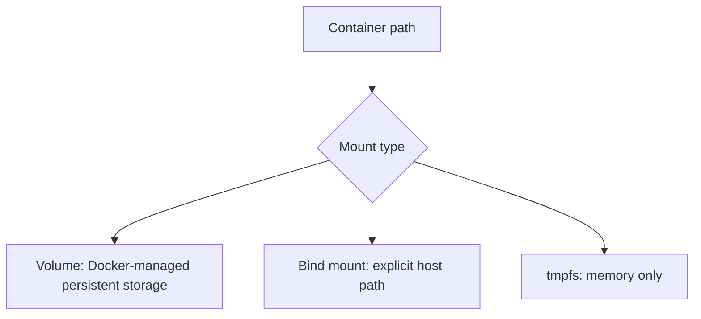
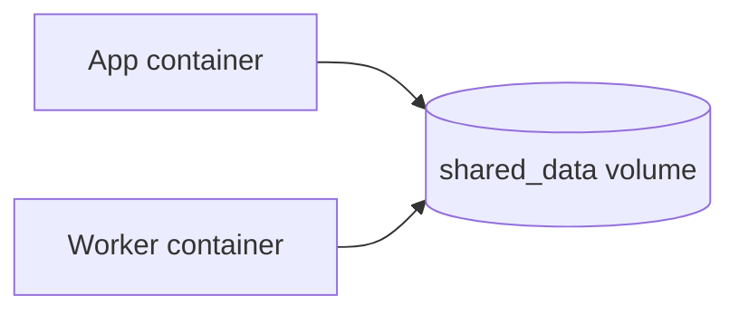
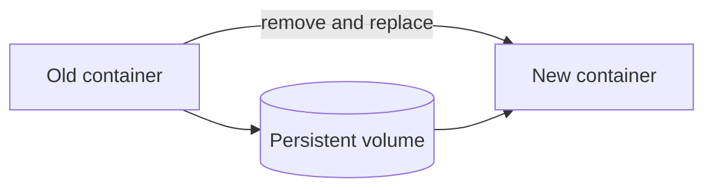
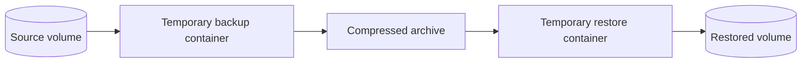

## 📁 14. What are Docker volumes, and why are they needed?


**Docker volume** হলো Docker-এর manage করা একটি persistent storage mechanism, যা container-এর বাইরে data সংরক্ষণ করে।

**কেন দরকার?**
Container-এর writable layer **ephemeral lifecycle-এর অংশ**—container শুধু stop করলে data থাকে, কিন্তু container delete করলে সেই layer-এর data মুছে যায়। Real-world application-এ database, log file, বা user-uploaded content-এর মতো data replacement-এর পরেও রাখা জরুরি।
**Volume ব্যবহার করলে:**
- Container delete হলেও data থাকে
- একাধিক container একই data share করতে পারে
- Data backup ও migrate করা সহজ হয়
- Host filesystem থেকে independent থাকে, তাই portable

---

### What is the difference between a volume, a bind mount, and a tmpfs mount?



| বৈশিষ্ট্য | **Volume** | **Bind Mount** | **tmpfs Mount** |
|---|---|---|---|
| Storage location | Docker-managed directory | Host-এর যেকোনো path | RAM (memory) |
| Portability | বেশি portable | Host path-এর উপর নির্ভরশীল | N/A |
| Data persistence | হ্যাঁ | হ্যাঁ | না (container বন্ধে মুছে যায়) |
| Performance | ভালো | OS-dependent | সবচেয়ে দ্রুত |
| ব্যবহারের ক্ষেত্র | Production data, database | Development, source code | Sensitive/temporary data |

**Volume** — Docker নিজে manage করে, সবচেয়ে recommended approach।

**Bind Mount** — Host machine-এর specific directory সরাসরি container-এ mount করা হয়। Development-এ source code share করতে কাজে লাগে।

**tmpfs Mount** — শুধুমাত্র memory-তে থাকে, disk-এ লেখে না। Sensitive data (যেমন secret, token) temporary রাখার জন্য উপযুক্ত।

---

### Where does Docker store volume data on the host filesystem?

Linux host-এ Docker volume-এর data সংরক্ষিত হয়:

```
/var/lib/docker/volumes/<volume_name>/_data
```

উদাহরণ, `myapp_data` নামের volume-এর data থাকবে:

```
/var/lib/docker/volumes/myapp_data/_data
```

> **নোট:** Windows বা macOS-এ Docker একটি Linux VM-এর ভেতরে চলে, তাই এই path সরাসরি host থেকে accessible নাও হতে পারে।

Volume inspect করতে:

```bash
docker volume inspect myapp_data
```

---

### What is the difference between named volumes and anonymous volumes?

**Named Volume:**
- Explicitly একটি নাম দিয়ে তৈরি করা হয়
- সহজে পুনরায় reference করা যায়
- `docker volume ls`-এ clearly দেখা যায়
- Recommended for production use

```bash
# Named volume তৈরি
docker volume create myapp_data

# Container-এ ব্যবহার
docker run -v myapp_data:/app/data myimage
```

**Anonymous Volume:**
- কোনো নাম দেওয়া হয় না, Docker automatically একটি random ID assign করে
- Container delete হলে এটি orphaned হয়ে যায়
- Track করা কঠিন, সাধারণত avoid করা উচিত

```bash
# Anonymous volume (নাম নেই)
docker run -v /app/data myimage
```

> **সহজ নিয়ম:** Production-এ সবসময় **named volume** ব্যবহার করুন।

---

### How do you share a volume between multiple containers?



একই **named volume** একাধিক container-এ mount করলেই তারা একই data access করতে পারে।

**উদাহরণ — দুটি container একই volume share করছে:**

```bash
# প্রথমে volume তৈরি করুন
docker volume create shared_data

# প্রথম container চালু করুন
docker run -d \
  --name container_one \
  -v shared_data:/app/data \
  myimage

# দ্বিতীয় container একই volume mount করুন
docker run -d \
  --name container_two \
  -v shared_data:/app/data \
  myimage
```

এখন `container_one` যা `/app/data`-তে লিখবে, `container_two`-ও সেটা read করতে পারবে।

**Docker Compose-এ:**

```yaml
version: "3.8"

services:
  app:
    image: myimage
    volumes:
      - shared_data:/app/data

  worker:
    image: myworker
    volumes:
      - shared_data:/app/data

volumes:
  shared_data:
```

> **সতর্কতা:** একাধিক container একই সময়ে একই file-এ write করলে **race condition** হতে পারে। এক্ষেত্রে application-level locking বা database ব্যবহার করুন।


## 🔄 15. How do you persist data in Docker containers?


Container-এ data persist করার তিনটি প্রধান উপায় আছে:

**Volume ব্যবহার করে (সবচেয়ে recommended):**

```bash
# Volume তৈরি করে run করুন
docker run -d \
  --name myapp \
  -v myapp_data:/app/data \
  myimage
```

**Bind Mount ব্যবহার করে (development-এ উপযোগী):**

```bash
docker run -d \
  --name myapp \
  -v /host/path:/container/path \
  myimage
```

**Docker Compose-এ:**

```yaml
version: "3.8"

services:
  db:
    image: postgres
    volumes:
      - postgres_data:/var/lib/postgresql/data

volumes:
  postgres_data:
```

---

### What happens to data inside a container when it is removed?

এটি নির্ভর করে data কোথায় ছিল তার উপর:

| Data কোথায় ছিল | Container remove হলে কী হয় |
|---|---|
| Container layer (volume ছাড়া) | **সম্পূর্ণ মুছে যায়** |
| Named volume | **থেকে যায়**, volume আলাদাভাবে exist করে |
| Bind mount | **থেকে যায়**, host filesystem-এ সংরক্ষিত |
| Anonymous volume | Orphaned হয়, manually cleanup না করলে disk ভরে যায় |

> **গুরুত্বপূর্ণ:** `docker rm -v` দিলে container-এর সাথে anonymous volume-ও delete হয়। Named volume কখনো automatically delete হয় না।

---

### How would you back up and restore a Docker volume?



**Backup করার পদ্ধতি:**

একটি temporary container তৈরি করে volume mount করুন, তারপর `tar` দিয়ে compress করুন:

> Database volume হলে শুধু live files archive করলে consistent backup নিশ্চিত হয় না। আগে database-এর native backup tool ব্যবহার করুন, অথবা application quiesce/stop করে storage snapshot নিন। নিচের `tar` example সাধারণ file volume-এর জন্য।

```bash
docker run --rm \
  -v myapp_data:/data \
  -v $(pwd):/backup \
  ubuntu \
  tar czf /backup/myapp_backup.tar.gz -C /data .
```

এই command-টি `myapp_backup.tar.gz` নামে current directory-তে backup file তৈরি করবে।

**Restore করার পদ্ধতি:**

```bash
# প্রথমে নতুন volume তৈরি করুন
docker volume create myapp_data_restored

# Backup থেকে data restore করুন
docker run --rm \
  -v myapp_data_restored:/data \
  -v $(pwd):/backup \
  ubuntu \
  tar xzf /backup/myapp_backup.tar.gz -C /data
```

**অন্য machine-এ migrate করতে:**

```bash
# ১. Backup নিন (আগের command)

# ২. File transfer করুন (scp বা অন্য উপায়ে)
scp myapp_backup.tar.gz user@remote-server:/path/

# ৩. Remote server-এ restore করুন
docker volume create myapp_data
docker run --rm \
  -v myapp_data:/data \
  -v /path:/backup \
  ubuntu \
  tar xzf /backup/myapp_backup.tar.gz -C /data
```

---

### What is the difference between using volumes and writing to the container layer?

**Container layer** হলো container-এর নিজস্ব writable layer, যা image-এর উপরে থাকে।

| বিষয় | **Volume** | **Container Layer** |
|---|---|---|
| Persistence | Container delete হলেও থাকে | Container delete হলে মুছে যায় |
| Performance | Native disk speed | **Copy-on-Write (CoW)** overhead আছে, তুলনামূলক ধীর |
| Sharing | একাধিক container share করতে পারে | শুধু ঐ container-ই access পায় |
| Backup | সহজ | কঠিন (`docker export` লাগে) |
| Image size | Image বড় হয় না | বারবার write করলে image layer বড় হয় |

**কেন Container Layer-এ লেখা উচিত নয়:**

Docker image **Copy-on-Write** strategy ব্যবহার করে। Container layer-এ কিছু লিখলে Docker প্রথমে পুরো file-টি image layer থেকে copy করে তারপর modify করে — এটি I/O intensive operation, বিশেষত database বা large file-এর ক্ষেত্রে significant performance hit হয়।

> **নিয়ম:** যেকোনো data যা persist বা share করতে হবে, সবসময় **volume**-এ রাখুন।

---

### How do you manage volume permissions for non-root users inside containers?

Container-এর ভেতরে non-root user দিয়ে চালালে volume-এর directory-তে write permission না থাকলে **"Permission denied"** error আসে।

**সমস্যার কারণ:**

Volume-এর directory default-এ `root` owner হয়। কিন্তু application non-root user হিসেবে চললে সে write করতে পারে না।

**সমাধান ১ — Dockerfile-এ permission set করুন:**

```dockerfile
FROM node:18

# Non-root user তৈরি করুন
RUN groupadd -r appgroup && useradd -r -g appgroup appuser

# Directory তৈরি করে ownership দিন
RUN mkdir -p /app/data && chown -R appuser:appgroup /app/data

# Non-root user হিসেবে switch করুন
USER appuser

WORKDIR /app
CMD ["node", "server.js"]
```

**সমাধান ২ — Entrypoint script দিয়ে runtime-এ fix করুন:**

```bash
#!/bin/sh
# entrypoint.sh

# Volume directory-র ownership ঠিক করুন
chown -R appuser:appgroup /app/data

# এরপর non-root user হিসেবে app চালু করুন
exec su-exec appuser "$@"
```

```dockerfile
COPY entrypoint.sh /entrypoint.sh
RUN chmod +x /entrypoint.sh
ENTRYPOINT ["/entrypoint.sh"]
CMD ["node", "server.js"]
```

**সমাধান ৩ — `docker run`-এ user specify করুন:**

```bash
# Host user-এর UID দিয়ে container চালান
docker run -d \
  --user $(id -u):$(id -g) \
  -v myapp_data:/app/data \
  myimage
```

**সমাধান ৪ — Docker Compose-এ explicit UID/GID:**

```yaml
version: "3.8"

services:
  app:
    image: myimage
    user: "1000:1000"  # UID:GID
    volumes:
      - myapp_data:/app/data

volumes:
  myapp_data:
```

শুধু `user: "1000:1000"` volume-এর ownership পরিবর্তন করে না। Image-এর mount-point ownership আগে ঠিক করুন, অথবা privileged one-time init step/entrypoint দিয়ে volume directory-র owner নির্ধারণ করে তারপর non-root process চালান। `local` volume-এর `driver_opts` platform ও mount filesystem অনুযায়ী বদলে যায়, তাই generic `uid/gid` option-এর উপর নির্ভর করা portable নয়।

> **Best practice:** Production-এ কখনো `root` user দিয়ে container চালাবেন না। সবসময় dedicated non-root user তৈরি করুন এবং Dockerfile-এই permission ঠিক করুন — এটি security এবং permission উভয় সমস্যার সমাধান করে।

## ⚙️ 16. How do bind mounts work, and when should you use them?

A **bind mount** maps an existing host file or directory directly into a container. Docker does not copy or manage that data; both the host and container see the same underlying files.


Use bind mounts when the container must access a host-controlled file or directory—for example, source code during development, a read-only configuration file, or generated output that host tools must consume. Prefer a Docker volume for portable application data and databases.

```bash
# Development source directory; changes are visible immediately
docker run --rm \
  --mount type=bind,src="$(pwd)",dst=/app \
  -w /app node:20 npm test
```

### What is the risk of using bind mounts in production?

- The deployment depends on an exact host path, so it is less portable.
- A writable mount lets a compromised container modify or delete host files.
- Host UID/GID, permissions, SELinux labels, and file ownership can differ between servers.
- Mounting over a non-empty container directory hides the image's existing files at that path.

Use the narrowest possible path and make configuration mounts read-only:

```bash
docker run -d \
  --name myapp \
  --mount type=bind,src=/srv/myapp/config.yml,dst=/app/config.yml,readonly \
  myapp:1.0
```

### How does a bind mount differ from a volume in terms of Docker management?

| বিষয় | Bind mount | Docker volume |
|---|---|---|
| Source | Existing absolute host path | Docker-created storage object |
| Lifecycle | Managed by host/user | Managed with `docker volume` |
| Portability | Host layout-dependent | Easier to move between Docker hosts |
| Backup | Back up the host path | Mount volume into a backup container |
| Typical use | Development/config integration | Persistent application data |

### How do you mount a configuration file from the host into a container?

With `--mount` (clearer and safer than ambiguous `-v` syntax):

```bash
docker run -d \
  --name api \
  --mount type=bind,src=/srv/api/config.yml,dst=/app/config.yml,readonly \
  my-api:1.0
```

Docker Compose example:

```yaml
services:
  api:
    image: my-api:1.0
    volumes:
      - type: bind
        source: /srv/api/config.yml
        target: /app/config.yml
        read_only: true
```

The source file must already exist. Verify the resolved mount with `docker inspect api` before relying on it in production.

---
