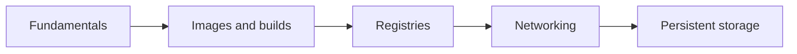

# Docker Interview Guide

Docker application এবং তার dependencies-কে repeatable image হিসেবে package করে। Interview-এ শুধু command নয়—image layering, container isolation, networking, persistent data এবং production lifecycle কীভাবে কাজ করে তা ব্যাখ্যা করতে হয়।

## What you will learn

- Container ও virtual machine-এর isolation model
- Image layer, build cache এবং secure Dockerfile তৈরি
- Container lifecycle, resource limits এবং graceful shutdown
- Bridge networking, DNS এবং port-publishing flow
- Volume, bind mount এবং stateful workload-এর trade-off

## Chapters

1. [Docker Fundamentals](./1-fundamentals/index.md)
2. [Images, Containers, Dockerfiles, and Lifecycle](./1-basic/index.md)
3. [Images and Registries](./2-images-registry/index.md)
4. [Docker Networking](./3-networking/index.md)
5. [Volumes and Storage](./4-volumes-storage/index.md)

## Interview focus

একটি backend service containerize করার scenario দিয়ে practice করুন: multi-stage build কেন দরকার, secret image-এ রাখা যাবে না কেন, container crash করলে data কোথায় থাকবে, host port থেকে packet container পর্যন্ত কীভাবে যায়, এবং production-এ health check ও resource limit কীভাবে দেবেন।
