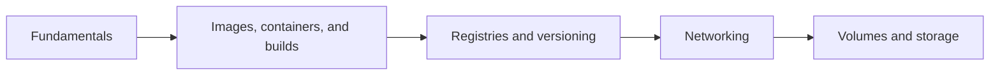

# 🐳 Docker: Backend Developer Interview Questions

- [Docker fundamentals](./1-fundamentals/index.md)
- [Images, containers, Dockerfiles, and lifecycle](./1-basic/index.md)
- [Images and registries](./2-images-registry/index.md)
- [Docker networking](./3-networking/index.md)
- [Volumes and storage](./4-volumes-storage/index.md)
