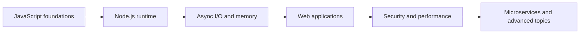

# Node.js Interview Guide

Node.js interview-এ JavaScript syntax-এর পাশাপাশি runtime behavior বোঝা জরুরি। Event loop কীভাবে non-blocking I/O চালায়, CPU-heavy কাজ কেন throughput কমায়, streams কীভাবে backpressure সামলায় এবং production service কীভাবে secure ও observable থাকে—এই section সেই mental model তৈরি করে।

## Start with the runtime

1. [Node.js Core Concepts](./core-concepts/)
2. [Node.js Fundamentals](./fundamentals/)
3. [Modules and Packages](./modules-packages/)
4. [Async Programming](./async-programming/)
5. [Memory Management](./memory-management/)

এই chapters শেষ করার পর আপনি event loop, task queues, asynchronous I/O, module resolution, garbage collection এবং process lifecycle ব্যাখ্যা করতে পারবেন।

## Strengthen JavaScript fundamentals

- [Closures and Scope](./closures-scope/)
- [`this` Keyword](./this-keyword/)
- [Hoisting](./hoisting/)
- [Equality and Type](./equality-type/)
- [Functional Programming](./functional-programming/)

এই topics Node.js-specific নয়, কিন্তু callback behavior, module state, object method এবং asynchronous bug বুঝতে সরাসরি প্রয়োজন হয়।

## Build production services

1. [Express Framework](./express-framework/)
2. [Authentication and Authorization](./auth/)
3. [Security](./security/)
4. [Performance](./performance/)
5. [Node.js Microservices](./microservices/)
6. [Advanced Topics](./advanced-topics/)

## What a strong interview answer includes

- **Mechanism:** Node.js internally কী করছে
- **Workload:** I/O-bound নাকি CPU-bound
- **Failure mode:** timeout, memory leak, unhandled rejection বা process crash হলে কী হবে
- **Trade-off:** simplicity, latency, throughput ও operational complexity
- **Evidence:** কোন metric, profile বা trace দিয়ে সিদ্ধান্ত যাচাই করবেন

## Suggested practice

একটি HTTP request receive হওয়া থেকে database response পাঠানো পর্যন্ত execution flow আঁকুন। কোথায় event loop কাজ করে, কোন কাজ libuv/OS-এ যায়, কোথায় backpressure বা connection limit তৈরি হতে পারে এবং graceful shutdown-এ in-flight request কীভাবে handle করবেন—এসব ব্যাখ্যা করুন।
