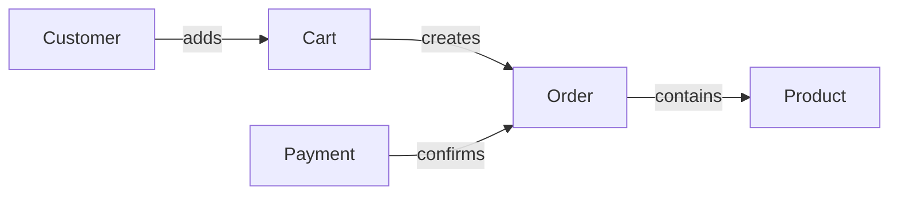

## 1. What is Object-Oriented Programming, and what problems does it solve?

**Object-Oriented Programming (OOP)** হলো এমন একটি programming paradigm যেখানে software-কে কিছু collaborating **object** হিসেবে model করা হয়। প্রতিটি object নিজের **state** ধারণ করে এবং সেই state নিয়ে কাজ করার **behavior** প্রকাশ করে। State এবং behavior-কে একসাথে বেঁধে রাখাটাই OOP-এর মূল idea — আলাদা data structure আর তার ওপর ছড়িয়ে থাকা function-এর বদলে, প্রতিটি object তার নিজের data এবং সেই data manipulate করার নিয়মের জন্য দায়ী থাকে।

উদাহরণ হিসেবে একটি e-commerce system-এ `Customer`, `Product`, `Cart` এবং `Order` আলাদা object হতে পারে। `Order` তার items ও status ধরে রাখে এবং `confirm()` বা `cancel()`-এর মতো behavior নিয়ন্ত্রণ করে। এতে data ও সংশ্লিষ্ট rule একই boundary-এর মধ্যে থাকে — অর্থাৎ "একটি order কীভাবে confirm হবে" জানার জন্য পুরো codebase খুঁজতে হয় না, `Order` class-টি দেখলেই হয়।



OOP মূলত কয়েকটি recurring software problem সামলাতে সাহায্য করে:

- **Complexity management:** বড় system-কে ছোট responsibility-ভিত্তিক object-এ ভাগ করা যায়, ফলে একবারে পুরো system না বুঝেও একটি অংশ নিয়ে কাজ করা যায় (এটিকে **cognitive load reduction**-ও বলা হয়)।
- **Data protection:** object নিজের invariant রক্ষা করতে পারে; caller ইচ্ছামতো internal state corrupt করতে পারে না। যেমন balance কখনো negative হবে না — এই rule একটাই জায়গায় enforce হয়।
- **Change isolation:** implementation বদলালেও stable public behavior অপরিবর্তিত রাখা যায় — caller না জেনেই internal algorithm বদলাতে পারা যায়।
- **Extensibility:** common abstraction-এর নতুন implementation যোগ করা যায় — existing code না ছুঁয়েই নতুন behavior add করা সম্ভব হয় (এটিই পরবর্তীতে "Open/Closed Principle" নামে পরিচিত)।
- **Domain modeling:** business concept ও relationship code-এ স্পষ্টভাবে প্রকাশ করা যায়, যাতে non-technical stakeholder-ও code-এর structure পড়ে domain বুঝতে পারে।

OOP নিজে ভালো design নিশ্চিত করে না। ভুল responsibility, deep inheritance বা অতিরিক্ত mutable state থাকলে OOP code-ও tightly coupled এবং কঠিন হতে পারে। এই কারণেই ভালো OOP developer শুধু syntax নয়, বরং **responsibility assignment** নিয়ে যত্নশীল হন — কোন data ও logic কোন object-এর মধ্যে থাকবে, সেটাই আসল design decision।

### How is OOP different from procedural programming?

Procedural programming সাধারণত **data** এবং সেই data নিয়ে কাজ করা **procedure/function** আলাদাভাবে organize করে। Data সাধারণত plain structure/record আকারে থাকে এবং যেকোনো function সেই data নিয়ে কাজ করতে পারে — কোনো enforced boundary থাকে না। OOP data ও behavior-কে object boundary-তে একত্র করে এবং objectগুলোর collaboration দিয়ে flow তৈরি করে, যেখানে data-তে access করার একমাত্র বৈধ পথ হলো সেই object-এরই method।

| বিষয় | Procedural approach | Object-oriented approach |
|---|---|---|
| প্রধান unit | Function/procedure | Object/class |
| Organization | Operation অনুযায়ী | Responsibility/domain concept অনুযায়ী |
| State | আলাদা structure বা shared data | Object-এর controlled state |
| Data access | সাধারণত open, যেকোনো function access করতে পারে | Encapsulated, নির্দিষ্ট method দিয়ে controlled |
| Extension | নতুন case-এ function modify হতে পারে | নতুন implementation যোগ করা যায় |
| উপযুক্ত ক্ষেত্র | Linear transformation, algorithm, script | Rich domain, long-lived evolving system |

একই system-এ দুই style একসঙ্গে থাকতে পারে। একটি object method-এর ভেতরে procedural algorithm থাকা স্বাভাবিক (যেমন sorting বা validation logic); OOP ও procedural programming পরস্পরবিরোধী নয় — বরং OOP একটি **organizing layer**, আর procedural code সেই layer-এর ভেতরে actual computation করে।

### What are the advantages and disadvantages of OOP?

**সুবিধা:**

- Responsibility অনুযায়ী modular structure তৈরি হয়, যা team-ভিত্তিক ownership সহজ করে (একটি team `Payment` module, আরেকটি team `Inventory` module owns করতে পারে)।
- Encapsulation object invariant রক্ষা করে — invalid state তৈরি হওয়ার সুযোগ কমে যায়।
- Polymorphism caller-কে concrete implementation থেকে আলাদা রাখে, ফলে নতুন implementation যোগ করলে caller-এর code অপরিবর্তিত থাকে।
- Composition দিয়ে behavior reuse ও replace করা যায় — inheritance ছাড়াও flexible design সম্ভব।
- Domain language code-এ দৃশ্যমান হওয়ায় communication সহজ হয়, business analyst ও developer একই vocabulary ব্যবহার করতে পারে।
- ছোট, focused object unit test করা সহজ হতে পারে, কারণ dependency mock/replace করা সহজ।

**অসুবিধা:**

- ছোট problem-এ class/interface boilerplate অপ্রয়োজনীয় complexity আনে — একটি simple script-এ পাঁচটা class লেখা overkill হতে পারে।
- অতিরিক্ত inheritance fragile hierarchy তৈরি করে — parent class-এ একটি ছোট পরিবর্তন unexpected ভাবে সব child-কে প্রভাবিত করতে পারে (একে **fragile base class problem** বলা হয়)।
- অনেক ছোট object-এর indirect call execution flow বোঝা কঠিন করতে পারে — debugger-এ step করে আসল logic খুঁজে পেতে অনেক layer পার হতে হয়।
- Shared mutable object concurrency bug তৈরি করতে পারে — multiple thread একই object modify করলে race condition হতে পারে।
- Poor abstraction পরিবর্তনকে সহজ না করে আরও ব্যয়বহুল করে — ভুল abstraction, no abstraction-এর চেয়েও খারাপ হতে পারে।
- Object allocation ও dynamic dispatch কিছু performance-sensitive system-এ overhead যোগ করতে পারে (যেমন game engine বা low-latency trading system, যেখানে data-oriented design প্রায়ই preferred)।

### When is OOP a good choice, and when might another paradigm be better?

OOP ভালো fit যখন domain-এ দীর্ঘদিন বেঁচে থাকা entity, state transition, invariant এবং একাধিক interchangeable behavior আছে — যেমন order management, banking, inventory বা GUI application। এই ধরনের system-এ entity-গুলোর নিজস্ব lifecycle থাকে এবং তাদের behavior সময়ের সাথে সাথে state অনুযায়ী বদলায়।

অন্য approach ভালো হতে পারে যখন:

- Data transformation pipeline হলে functional style পরিষ্কার — input থেকে output-এ একাধিক pure transformation ধাপে ধাপে apply করা সহজ হয় (যেমন `map`, `filter`, `reduce` chain)।
- একটি ছোট automation script হলে procedural code যথেষ্ট, class hierarchy তৈরি করার দরকার নেই।
- Numerical/HPC workload হলে data-oriented design cache locality ভালো দিতে পারে — object-এর পরিবর্তে array-of-structs ব্যবহার CPU cache-friendly হয়।
- Stateless validation বা conversion হলে plain function class-এর চেয়ে সহজ ও testable হয়।
- Event-heavy system-এ event-driven architecture primary organizing model হতে পারে, যেখানে object শুধু event handler হিসেবে কাজ করে।

সঠিক সিদ্ধান্ত paradigm-এর popularity দিয়ে নয়; problem-এর state, change pattern, performance এবং team constraints দিয়ে নিতে হয়। বাস্তবে বেশিরভাগ আধুনিক codebase multi-paradigm — OOP structure-এর ভেতরে functional-style pure function এবং procedural algorithm একসাথে ব্যবহৃত হয়।

---

## 2. What are the four main pillars of OOP?

OOP-এর চারটি পরিচিত pillar হলো **Encapsulation, Abstraction, Inheritance** এবং **Polymorphism**। এগুলো আলাদা feature হলেও ভালো object design-এ একে অপরকে support করে। এদের মধ্যে Encapsulation ও Abstraction হলো "কীভাবে data ও detail লুকাবো" সংক্রান্ত, আর Inheritance ও Polymorphism হলো "কীভাবে related type-এর মধ্যে সম্পর্ক ও variation প্রকাশ করবো" সংক্রান্ত।

| Pillar | মূল উদ্দেশ্য | সহজ উদাহরণ |
|---|---|---|
| Encapsulation | State ও rule একই boundary-তে রাখা | `Account.withdraw()` balance rule enforce করে |
| Abstraction | প্রয়োজনীয় contract দেখানো | `PaymentGateway.pay()` |
| Inheritance | সত্যিকারের subtype relationship প্রকাশ | `SavingsAccount` is an `Account` |
| Polymorphism | একই contract-এর ভিন্ন behavior | Card ও mobile payment আলাদাভাবে `pay()` করে |

### What are Encapsulation, Abstraction, Inheritance, and Polymorphism?

- **Encapsulation:** object-এর state এবং সেই state পরিবর্তনের rule একসঙ্গে রাখা; internal representation uncontrolled access থেকে লুকানো। Practical ভাবে এর মানে হলো field-গুলো `private` রাখা এবং শুধু meaningful method দিয়ে বাইরের world-কে interact করতে দেওয়া। এটি শুধু "hiding" নয় — এটি **invariant protection**, অর্থাৎ object যেন কখনো invalid state-এ না যেতে পারে তা নিশ্চিত করা।
- **Abstraction:** caller-এর প্রয়োজনীয় behavior প্রকাশ করে implementation detail আড়াল করা। যেমন `PaymentGateway.pay()` caller-কে জানায় "টাকা charge হবে", কিন্তু network call, retry logic বা third-party API-এর detail caller-কে জানার দরকার নেই। Abstraction-এর ফলে system-এর দুই অংশ শুধু একটি **contract** দিয়ে যুক্ত থাকে।
- **Inheritance:** একটি subtype parent type-এর contract গ্রহণ বা specialize করে। এটি reuse-এর tool হলেও মূল অর্থ substitutable **is-a** relationship — অর্থাৎ যেখানে parent type ব্যবহার করা যায়, সেখানে child type-ও নির্ভুলভাবে ব্যবহার করা যাওয়া উচিত (এটিকে **Liskov Substitution Principle** বলা হয়)। শুধু code reuse-এর জন্য inheritance ব্যবহার করা একটি common mistake — যদি সম্পর্কটি সত্যিকারের is-a না হয়, তাহলে composition বেশি উপযুক্ত।
- **Polymorphism:** caller একটি common abstraction ব্যবহার করে, কিন্তু runtime বা compile time-এ ভিন্ন implementation কাজ করতে পারে। এর দুটি সাধারণ রূপ আছে: **runtime (dynamic) polymorphism** — যেমন interface implementation বা method overriding, যেখানে actual behavior runtime-এ নির্ধারিত হয়; এবং **compile-time (static) polymorphism** — যেমন method overloading বা generics, যেখানে behavior compile time-এই নির্ধারিত হয়।

### How do these four concepts work together in real applications?

Payment system-এ `PaymentMethod` একটি abstraction। `CardPayment` এবং `MobilePayment` সেই contract implement করে polymorphism দেয়। প্রতিটি implementation credentials ও validation rule encapsulate করে। যদি language/interface design inheritance hierarchy ব্যবহার করে, implementationগুলো common type-এর subtype হয়।

```java
interface PaymentMethod {
    PaymentResult pay(Money amount);
}

final class CardPayment implements PaymentMethod {
    private final PaymentGateway gateway;

    CardPayment(PaymentGateway gateway) {
        this.gateway = gateway;
    }

    @Override
    public PaymentResult pay(Money amount) {
        if (amount.isNegative()) {
            throw new IllegalArgumentException("Amount must be positive");
        }
        return gateway.charge(amount);
    }
}

final class MobilePayment implements PaymentMethod {
    private final WalletProvider wallet;

    MobilePayment(WalletProvider wallet) {
        this.wallet = wallet;
    }

    @Override
    public PaymentResult pay(Money amount) {
        if (amount.isNegative()) {
            throw new IllegalArgumentException("Amount must be positive");
        }
        return wallet.deduct(amount);
    }
}
```

Checkout service শুধু `PaymentMethod` জানে — কোন concrete class ব্যবহৃত হচ্ছে তা জানার দরকার নেই:

```java
class CheckoutService {
    PaymentResult checkout(PaymentMethod method, Money amount) {
        return method.pay(amount); // polymorphic call
    }
}
```

ফলে নতুন provider (যেমন `BankTransferPayment`) যোগ করলে checkout logic বদলাতে হয় না; abstraction dependency কমায়, polymorphism extension দেয় এবং encapsulation provider-specific rule রক্ষা করে। এই চারটি pillar একসাথে কাজ করার ফলেই OOP-এর মূল প্রতিশ্রুতি পূরণ হয়: **নতুন feature add করলে পুরনো code না ভাঙা।**

---

## 3. What is a class?

**Class** হলো programmer-defined type যা একটি category-এর object-এর state structure, allowed behavior এবং construction rule নির্ধারণ করে। Class নিজে সাধারণত business entity নয়; এটি object তৈরির definition — একটি template যা থেকে বাস্তব, runtime-এ বেঁচে থাকা object তৈরি হয়।

```java
class BankAccount {
    private final String accountNumber;
    private long balance;

    BankAccount(String accountNumber, long openingBalance) {
        if (openingBalance < 0) throw new IllegalArgumentException();
        this.accountNumber = accountNumber;
        this.balance = openingBalance;
    }

    void deposit(long amount) {
        if (amount <= 0) throw new IllegalArgumentException();
        balance += amount;
    }

    long getBalance() {
        return balance;
    }
}
```

এখানে classটি valid account কীভাবে তৈরি হবে (constructor-এর validation) এবং balance কীভাবে বদলাবে (`deposit()`-এর validation)—দুটিই সংজ্ঞায়িত করছে। লক্ষণীয় যে constructor এবং `deposit()` উভয় জায়গাতেই validation আছে — এর মানে হলো class-টি নিশ্চিত করছে যে account কখনো negative balance নিয়ে তৈরি হবে না বা negative amount দিয়ে deposit হবে না। এটাই **encapsulation-এর বাস্তব প্রয়োগ।**

### Why is a class often called a blueprint?

Blueprint analogy বোঝায় যে class একটি common structure/behavior define করে, আর সেই definition থেকে একাধিক object তৈরি হয় — যেমন একটি বাড়ির blueprint থেকে একাধিক বাড়ি তৈরি করা যায়, প্রতিটি বাড়ি নিজের ঠিকানা ও বাসিন্দা (state) নিয়ে আলাদা থাকে কিন্তু কাঠামো (structure) একই। তবে analogy-টির সীমা আছে: class শুধু field layout নয়; validation, invariant, access rule এবং polymorphic contract-ও নির্ধারণ করতে পারে, যা একটি static physical blueprint-এর তুলনায় অনেক বেশি "behavioral"। তাই **user-defined type** বলা আরও নির্ভুল।

### What can a class contain?

Language অনুযায়ী class-এ থাকতে পারে:

- **Instance field/property** — প্রতিটি object-এর নিজস্ব data
- **Static/class field** — সব instance-এর মধ্যে shared data
- **Constructor** — object তৈরির সময় initial valid state নিশ্চিত করার logic
- **Instance ও static method** — behavior
- **Access modifier** (`public`, `private`, `protected`, ইত্যাদি) — কে কোন member access করতে পারবে তার নিয়ন্ত্রণ
- **Constant** — অপরিবর্তনীয় value (যেমন `MAX_LIMIT`)
- **Nested type** — class-এর ভেতরে আরেকটি class/interface, যখন সেটি শুধু outer class-এর context-এই অর্থবহ
- **Generic type parameter** — একই class বিভিন্ন type-এর সাথে reusable করার জন্য (যেমন `List<T>`)
- **Interface implementation বা inheritance declaration**
- **Operator/property/event-এর মতো language-specific member** (যেমন C#-এ operator overloading, property getter/setter)

সব feature এক class-এ থাকা উচিত নয়। ভালো class focused responsibility রাখে এবং প্রয়োজনের চেয়ে বেশি public API প্রকাশ করে না — একে **minimal public surface** বলা যায়। একটি class যত কম জিনিস public করবে, তত সহজে internal implementation পরে পরিবর্তন করা যাবে।

---

## 4. What is an object?

**Object** হলো class/type-এর runtime instance যার identity, বর্তমান state এবং behavior আছে। `new BankAccount("A-101", 5000)` execute করলে memory-তে একটি নির্দিষ্ট account object তৈরি হয়, যার নিজস্ব memory address (identity), নিজস্ব balance value (state), এবং class-এ definition করা method-গুলো (behavior) ব্যবহারের সুযোগ থাকে।

Conceptually:

```text
Class: BankAccount
        fields + rules + methods

Objects:
accountA -> { accountNumber: A-101, balance: 5000 }
accountB -> { accountNumber: B-205, balance: 9000 }
```

**Identity** একটি গুরুত্বপূর্ণ কিন্তু প্রায়ই উপেক্ষিত ধারণা: দুটি object-এর সব field value সমান হলেও, তারা দুটি ভিন্ন object হতে পারে (ভিন্ন identity), ঠিক যেমন দুই ব্যক্তির নাম এক হলেও তারা ভিন্ন মানুষ। Java-তে এটি `==` (identity check) বনাম `.equals()` (value check)-এর পার্থক্য দিয়ে বোঝা যায়।

### What is the difference between a class and an object?

| Class | Object |
|---|---|
| Type/definition | সেই type-এর runtime instance |
| Common structure ও behavior define করে | নির্দিষ্ট state ধারণ করে |
| সাধারণত একবার declare করা হয় (source code-এ) | বহু instance তৈরি হতে পারে (runtime-এ) |
| Compile time-এ বিদ্যমান | Runtime-এ তৈরি ও destroy হয় |
| `BankAccount` | `accountA`, `accountB` |

### What is an instance of a class?

কোনো object যদি একটি class-এর definition অনুযায়ী তৈরি হয়, objectটি সেই class-এর **instance**। Subtyping থাকা language-এ derived object parent type-এর instance হিসেবেও বিবেচিত হতে পারে। যেমন `SavingsAccount` object একটি `SavingsAccount` এবং একটি `Account`—দুই type-এর সঙ্গেই compatible হতে পারে (`instanceof` check উভয় ক্ষেত্রেই true দেবে)।

### Can multiple objects be created from the same class?

হ্যাঁ। প্রতিটি object সাধারণত নিজের instance state রাখে, কিন্তু class-defined behavior share করে — অর্থাৎ method-এর code memory-তে একবারই থাকে, প্রতিটি object আলাদা copy রাখে না, শুধু data আলাদা থাকে। একটি object-এর balance বদলালে অন্য account-এর balance বদলায় না—যদি না তারা ইচ্ছাকৃতভাবে কোনো shared/static mutable state ব্যবহার করে।

---

## 5. What is the difference between object state and object behavior?

**State** হলো কোনো নির্দিষ্ট মুহূর্তে object-এর সংরক্ষিত তথ্য — এটি সময়ের সাথে সাথে বদলাতে পারে। **Behavior** হলো object কী করতে পারে এবং কোন নিয়মে state observe বা পরিবর্তন করে। State হলো "object এখন কী", behavior হলো "object কী করতে পারে এবং কীভাবে সেই state-কে বদলায়"।

একটি `Order`-এর state হতে পারে `items`, `status`, `total`; behavior হতে পারে `addItem()`, `confirm()`, `cancel()`। ভালো design-এ behavior state transition-এর rule enforce করে — অর্থাৎ শুধু নির্দিষ্ট behavior-ই state বদলাতে পারবে, যাতে কোনো invalid transition (যেমন `CANCELLED` অবস্থা থেকে সরাসরি `SHIPPED`-এ যাওয়া) সম্ভব না হয়।

```text
CREATED --confirm()--> CONFIRMED --ship()--> SHIPPED
   |
   +------cancel()--> CANCELLED
```

এই diagram থেকে বোঝা যায় যে `CONFIRMED` state থেকে `ship()` call করলেই কেবল `SHIPPED`-এ যাওয়া যায়; `CREATED` state-এ থাকা অবস্থায় সরাসরি `ship()` call করলে সেটি রিজেক্ট হওয়া উচিত — এই rule enforce করাটাই behavior-এর দায়িত্ব।

### How are fields/properties used to represent state?

Field object-এর internal value store করে। Property অনেক language-এ controlled access syntax দেয় (যেমন C#-এর `get`/`set`, বা Python-এর `@property`), যা caller-এর কাছে plain field-এর মতো দেখতে হলেও ভেতরে validation বা computation চালাতে পারে। সব field public করলে caller invalid combination তৈরি করতে পারে; তাই state সাধারণত private রেখে meaningful operation expose করা ভালো।

উদাহরণ: caller যেন সরাসরি `order.status = SHIPPED` না করতে পারে; `ship()` method payment ও current status যাচাই করে transition করবে:

```java
void ship() {
    if (this.status != OrderStatus.CONFIRMED) {
        throw new IllegalStateException("Order must be confirmed before shipping");
    }
    this.status = OrderStatus.SHIPPED;
}
```

### How are methods used to represent behavior?

Method object-এর capability প্রকাশ করে এবং তার invariant বজায় রেখে কাজ সম্পন্ন করে। Meaningful method business intent প্রকাশ করে—`withdraw(amount)` সাধারণত `setBalance(value)`-এর চেয়ে ভালো, কারণ withdrawal limit ও insufficient-fund rule একই জায়গায় থাকে। যদি শুধু `setBalance()` expose করা হয়, তাহলে caller ইচ্ছামতো balance যেকোনো value-তে সেট করতে পারবে, এবং rule enforcement caller-এর দায়িত্বে চলে যাবে — যা encapsulation-এর উদ্দেশ্যকেই ব্যর্থ করে।

Method সবসময় state change করে না। Query method যেমন `getTotal()` শুধু derived information return করতে পারে — এই ধরনের method-কে **command-query separation** নীতি অনুযায়ী পৃথকভাবে চিন্তা করা হয়: **command** (যেমন `confirm()`) state বদলায়, **query** (যেমন `getTotal()`) শুধু information দেয়, state বদলায় না।

---

## 6. What is the difference between an instance variable and a class/static variable?

**Instance variable** প্রতিটি object-এর আলাদা state। **Class/static variable** class-এর সঙ্গে যুক্ত একটি shared value, যা সেই class-এর সব instance সাধারণত একইভাবে দেখে। মেমরির দিক থেকে বললে: প্রতিটি object তৈরি হওয়ার সময় instance variable-এর জন্য নতুন memory allocate হয়, কিন্তু static variable-এর জন্য class load হওয়ার সময় একবারই memory allocate হয় — তারপর সব instance সেই একই memory location share করে।

```java
class UserSession {
    private static int activeSessions = 0; // shared
    private final String userId;           // per object

    UserSession(String userId) {
        this.userId = userId;
        activeSessions++;
    }
}
```

| বিষয় | Instance variable | Static/class variable |
|---|---|---|
| Copies | প্রতি object-এ আলাদা | class প্রতি একটি shared copy |
| Access context | Instance method | Static ও instance context |
| Typical use | Object identity/state | Constant, metadata, shared counter |
| Lifetime | Object-এর সাথে তৈরি ও destroy হয় | Class load হওয়ার সাথে তৈরি, program শেষ হওয়া পর্যন্ত থাকে |
| Concurrency | Object sharing-এর ওপর নির্ভর | Mutable হলে synchronization দরকার |

### Which data belongs to each object?

যে value objectভেদে আলাদা এবং object-এর identity বা lifecycle-এর অংশ, সেটি instance data। যেমন account number, balance, order status বা user email। একটি instance destroy হলে তার instance state-ও আর প্রয়োজন থাকে না — garbage collector (বা manual memory management-এ programmer) সেই memory reclaim করে।

### Which data is shared among all objects?

Class-wide constant, factory metadata বা সত্যিকারের global-to-type information static হতে পারে। Mutable static state সাবধানে ব্যবহার করতে হয়—এটি hidden global state তৈরি করে, test isolation নষ্ট করে (একটি test-এর পরিবর্তন আরেকটি test-কে প্রভাবিত করতে পারে) এবং concurrent update-এ race condition আনতে পারে। Database-backed total user count-এর মতো distributed data static field-এ রাখা সঠিক নয়, কারণ static field শুধু একটি process/JVM-এর মধ্যে valid — multiple server instance-এর মধ্যে সেটি sync থাকবে না।

---

## 7. What is the difference between an instance method and a class/static method?

**Instance method** একটি নির্দিষ্ট receiver object-এর ওপর চলে এবং তার instance state access করতে পারে। **Static method** class/namespace-এর সঙ্গে যুক্ত; call করার জন্য নির্দিষ্ট object দরকার হয় না। এই পার্থক্যটি আরও স্পষ্ট হয় যদি চিন্তা করি: instance method call করতে একটি "কার ওপর" (receiver) লাগে, static method-এ তা লাগে না — শুধু class name দিয়েই call করা যায়।

```java
class Temperature {
    private final double celsius;

    private Temperature(double celsius) {
        this.celsius = celsius;
    }

    double toFahrenheit() {               // instance method
        return celsius * 9 / 5 + 32;
    }

    static Temperature fromFahrenheit(double value) { // static factory
        return new Temperature((value - 32) * 5 / 9);
    }
}
```

এখানে `fromFahrenheit()` একটি common pattern দেখায়: **static factory method** — যা constructor-এর বিকল্প হিসেবে ব্যবহৃত হয়, বিশেষত যখন constructor-এর নাম object তৈরির intent স্পষ্টভাবে প্রকাশ করতে পারে না (constructor overloading-এর সীমাবদ্ধতা এড়াতে এটি খুবই common)।

### Why can a static method usually not directly access instance data?

Static method call-এর সঙ্গে কোনো receiver object বা `this`/`self` reference থাকে না। একই class-এর হাজার object থাকলে static method কোন object-এর field পড়বে তা নির্ধারণের উপায় নেই — compiler-এর কাছে এই প্রশ্নের কোনো নির্দিষ্ট উত্তর নেই যে "কোন instance-এর balance?"। তাই instance data access করতে হলে object explicitly parameter হিসেবে দিতে হয় বা instance method call করতে হয়।

### When should a method be static?

Static method উপযুক্ত যখন operation:

- কোনো instance state-এর ওপর নির্ভর করে না
- Pure utility calculation (যেমন `Math.max(a, b)`)
- Named factory method (যেমন উপরের `fromFahrenheit()`)
- Class-wide immutable metadata access করে

শুধু "methodটি এখন field ব্যবহার করছে না" বলে static করা সবসময় ঠিক নয়। Operationটি conceptually object-এর responsibility হলে future polymorphism ও testability বিবেচনা করতে হবে — static method override করা যায় না, তাই polymorphic behavior দরকার হলে instance method-ই একমাত্র উপায়। External dependency ব্যবহারকারী static method mock/replace করা কঠিন করতে পারে, কারণ static call সরাসরি bind হয়ে যায় এবং test-এর সময় সহজে substitute করা যায় না — এই কারণে অনেক dependency-injection-based design static method এড়িয়ে চলে।

---

## 8. What is the difference between an object and a reference to an object?

Object হলো actual runtime entity; **reference** হলো এমন একটি value/handle যা সেই object-কে locate বা access করতে ব্যবহৃত হয়। Reference objectটি নিজে নয় — এটি objectটির দিকে "নির্দেশ" করে, ঠিক যেমন একটি ঠিকানা কোনো বাড়ি নয়, কিন্তু বাড়িটি কোথায় আছে তা বলে দেয়। Java/C#/Python-এর object variable সাধারণত reference-like value ধরে; C++-এ value object, pointer ও reference আলাদা semantics দেয় — সেখানে programmer explicitly বেছে নিতে পারেন object copy হবে নাকি shared reference থাকবে।

```text
reference a ----+
                |
                v
             +------------------+
reference b -> | Account object  |
               | balance = 5000  |
               +------------------+
```

Reference অন্য object-কে point করতে পারে বা language অনুযায়ী `null`/`None` হতে পারে — যা "কোনো object-কেই নির্দেশ করছে না" বোঝায়, এবং সেই reference-এর ওপর method call করলে সাধারণত runtime error (যেমন `NullPointerException`) হয়। Object unreachable হলে (অর্থাৎ কোনো active reference তার দিকে না থাকলে) garbage-collected language পরে সেটির memory reclaim করতে পারে; C++-এর মতো manual-memory language-এ programmer-কেই explicitly deallocate করতে হয়, নাহলে memory leak হতে পারে।

### Can multiple references point to the same object?

হ্যাঁ; একে **aliasing** বলা হয়। Assignment অনেক language-এ object copy না করে reference copy করে।

```java
Account first = new Account(5000);
Account second = first;

// first এবং second একই object নির্দেশ করে
```

Value equality এবং reference identity আলাদা বিষয়। দুটি আলাদা object-এর content সমান হতে পারে, আবার দুটি variable একই object-ও নির্দেশ করতে পারে। Java-তে `==` operator reference identity check করে (দুটি variable কি একই object নির্দেশ করছে), আর `.equals()` সাধারণত value equality check করার জন্য override করা হয় (দুটি object-এর content কি সমান)। এই পার্থক্য না বুঝলে খুবই common একটি bug হয় — `if (a == b)` লিখে content compare করার চেষ্টা করা, যেখানে আসলে `a.equals(b)` দরকার ছিল।

### What happens when one reference modifies a shared mutable object?

এক reference দিয়ে shared mutable object পরিবর্তন করলে অন্য reference দিয়েও updated state দেখা যায়, কারণ object একটিই — দুটি reference শুধু একই memory location-এর দিকে নির্দেশ করছে, তাদের নিজেদের কোনো আলাদা copy নেই।

```java
Account first = new Account(5000);
Account second = first;

second.deposit(1000);
System.out.println(first.getBalance()); // 6000
```

এটি intentional collaboration হতে পারে (যেমন একটি shared cache বা registry, যেখানে সব caller-এর একই latest state দেখা দরকার), আবার surprising side effect-ও হতে পারে (যেমন একটি function-এ object parameter হিসেবে পাঠানো হলো, ভাবা হলো "শুধু পড়া হবে", কিন্তু function ভেতরে object mutate করে দিলো এবং caller-এর কাছে সেই পরিবর্তন visible হয়ে গেলো)। Risk কমাতে immutable value object (যেখানে object তৈরির পর আর বদলানো যায় না), defensive copy (object পাঠানোর আগে তার একটি duplicate তৈরি করা), clear ownership (কোন অংশ object-টির "মালিক" এবং কে শুধু ব্যবহার করছে তা স্পষ্ট রাখা), encapsulated mutation (mutation শুধু নির্দিষ্ট controlled method দিয়েই হতে পারে) এবং concurrent code-এ synchronization ব্যবহার করা হয়। Method parameter objectটিকে mutate করে কি না—API contract-এ (documentation বা type system দিয়ে) সেটিও পরিষ্কার থাকা উচিত, যাতে caller আগে থেকেই জানতে পারে কী আশা করা উচিত।

---