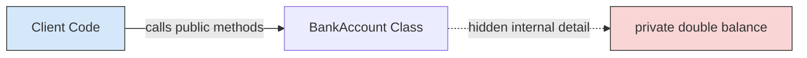
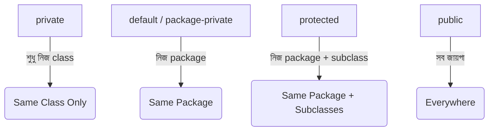
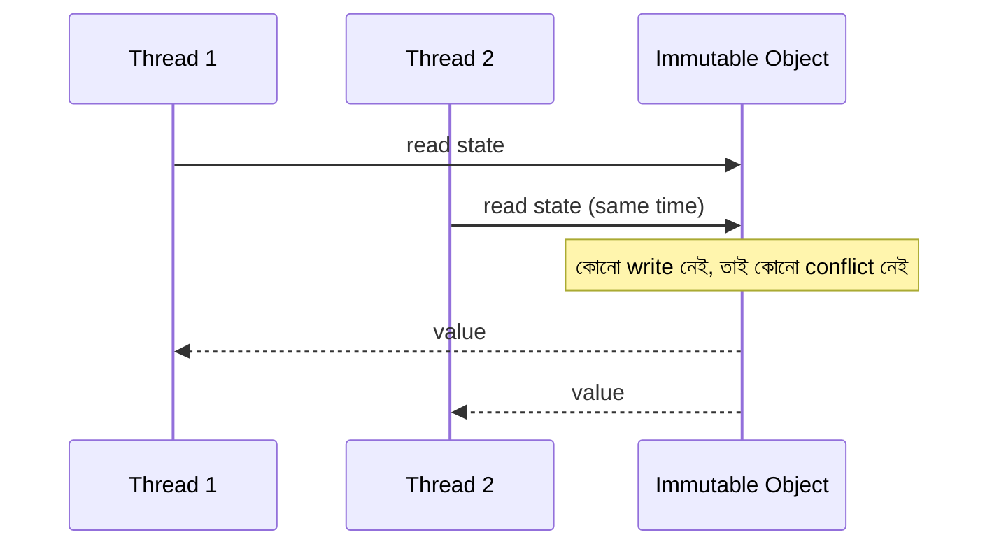
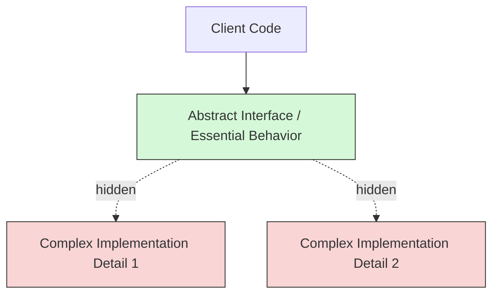
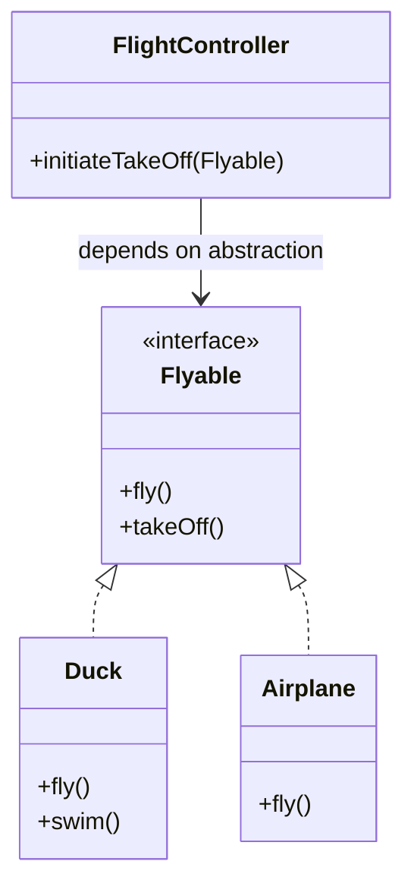
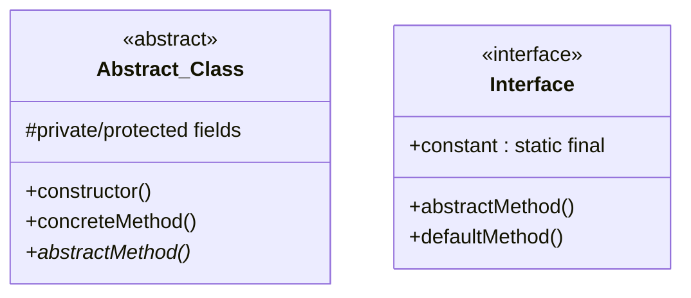

## 9. What is encapsulation?

**Encapsulation** হলো একটি OOP (Object-Oriented Programming) principle, যেখানে একটি object-এর data (fields) এবং সেই data-কে manipulate করার জন্য প্রয়োজনীয় methods-কে একসাথে একটি single unit (class)-এর মধ্যে bundle করা হয়। এর সাথে সাথে object-এর internal state-কে বাইরের world থেকে সরাসরি access করতে না দিয়ে, শুধুমাত্র controlled interface (public methods)-এর মাধ্যমে access দেওয়া হয়।

সহজভাবে বললে, encapsulation মানে হলো একটি "capsule"-এর মতো data এবং behavior-কে wrap করে রাখা, যাতে বাইরে থেকে কেউ সরাসরি internal অবস্থা নষ্ট করতে না পারে।

```java
public class BankAccount {
    // fields encapsulated (hidden) using private access modifier
    private double balance;

    public BankAccount(double initialBalance) {
        if (initialBalance < 0) {
            throw new IllegalArgumentException("Initial balance cannot be negative");
        }
        this.balance = initialBalance;
    }

    // controlled access through public method
    public void deposit(double amount) {
        if (amount <= 0) {
            throw new IllegalArgumentException("Deposit amount must be positive");
        }
        this.balance += amount;
    }

    public void withdraw(double amount) {
        if (amount > this.balance) {
            throw new IllegalStateException("Insufficient balance");
        }
        this.balance -= amount;
    }

    public double getBalance() {
        return this.balance;
    }
}
```

এখানে `balance` field-টি সরাসরি বাইরে থেকে পরিবর্তন করা যাবে না। কেউ চাইলেও `account.balance = -5000;` এভাবে সরাসরি set করতে পারবে না — শুধুমাত্র `deposit()` এবং `withdraw()` method-এর মাধ্যমেই balance পরিবর্তন করতে হবে, এবং সেখানে validation logic থাকায় invalid state তৈরি হওয়া প্রতিরোধ করা যায়।

### Why is encapsulation important?

Encapsulation গুরুত্বপূর্ণ কারণ এটি একাধিক সমস্যার সমাধান দেয়:

1. **Data protection / integrity** — internal state সরাসরি বাইরে থেকে modify করা যায় না, ফলে invalid বা inconsistent state তৈরি হওয়ার সম্ভাবনা কমে যায়।
2. **Controlled access** — validation, business logic, বা side-effect যোগ করার সুযোগ থাকে method-এর ভিতরে।
3. **Flexibility ও maintainability** — internal implementation পরিবর্তন করলেও, external API (public method signature) same থাকলে caller code-এ কোনো পরিবর্তন করতে হয় না।
4. **Modularity** — প্রতিটি class একটি self-contained unit হিসেবে কাজ করে, যা বড় system-কে ছোট ছোট independent অংশে ভাগ করতে সাহায্য করে।
5. **Security** — sensitive data (যেমন password, balance) বাইরের unauthorized access থেকে সুরক্ষিত থাকে।

### How does encapsulation reduce coupling?

**Coupling** মানে হলো একটি class অন্য class-এর internal implementation বা structure-এর উপর কতটা নির্ভরশীল। Encapsulation একটি class-এর internal details (fields, helper logic) হাইড করে শুধু একটি public interface (methods) expose করে। এর ফলে:

- অন্য class গুলো শুধু public method-এর মাধ্যমে interact করে, internal field structure জানার প্রয়োজন হয় না।
- যদি internal implementation পরিবর্তন হয় (যেমন `balance` field-এর data type `double` থেকে `BigDecimal`-এ পরিবর্তন), তাহলে যতক্ষণ public method signature same থাকে, বাইরের code-এ কোনো পরিবর্তন লাগে না।
- এটি **tight coupling**-কে **loose coupling**-এ পরিণত করে, কারণ classes একে অপরের implementation-এর উপর নির্ভরশীল না হয়ে শুধু contract (interface)-এর উপর নির্ভর করে।



উপরের diagram-এ দেখা যাচ্ছে, `Client Code` শুধুমাত্র public method-এর সাথে interact করছে, internal field `balance`-এর সাথে সরাসরি কোনো সংযোগ নেই — এটাই loose coupling।

### Is encapsulation only about making variables private?

**না**, encapsulation শুধু variable-কে `private` করা নয়। `private` করা encapsulation implement করার একটি common technique মাত্র, কিন্তু encapsulation-এর মূল ধারণা হলো:

- data এবং behavior-কে একসাথে bundle করা (শুধু data hide করা নয়)
- একটি well-defined, controlled interface (API) provide করা
- internal implementation detail-কে বাইরের world থেকে abstract রাখা

যদি একটি class-এর সব field `private` থাকে কিন্তু প্রতিটি field-এর জন্য trivial getter/setter থাকে (কোনো validation বা logic ছাড়াই), তাহলে সেটি technically private হলেও encapsulation-এর প্রকৃত সুবিধা (data protection, business rule enforcement) দেয় না। প্রকৃত encapsulation মানে হলো **meaningful behavior** এবং **invariant** (business rule) maintain করা, শুধু access modifier পরিবর্তন করা নয়।

---

## 10. What is data hiding?

**Data hiding** হলো এমন একটি technique, যেখানে একটি class-এর internal data (fields)-কে বাইরের code থেকে সরাসরি access করার সুযোগ বন্ধ করে দেওয়া হয় — সাধারণত `private` access modifier ব্যবহার করে। এর মূল লক্ষ্য হলো object-এর internal state-কে অনিচ্ছাকৃত বা ভুল পরিবর্তন থেকে রক্ষা করা।

```java
public class Employee {
    private String name;
    private double salary; // hidden from outside — no direct access

    public Employee(String name, double salary) {
        this.name = name;
        this.salary = salary;
    }

    public double getSalary() {
        return salary;
    }
}
```

এখানে `salary` field সরাসরি বাইরে থেকে access করা সম্ভব নয়; শুধু `getSalary()` method-এর মাধ্যমে read করা যাবে, কিন্তু কোনো setter না থাকায় বাইরে থেকে modify করা যাবে না।

### What is the difference between data hiding and encapsulation?

এই দুটি concept খুব কাছাকাছি এবং প্রায়ই একসাথে ব্যবহৃত হয়, কিন্তু তাদের মধ্যে সূক্ষ্ম পার্থক্য আছে:

| বিষয় | Data Hiding | Encapsulation |
|---|---|---|
| Scope | শুধুমাত্র data (fields)-কে বাইরের world থেকে লুকানো | Data + behavior (methods) একসাথে bundle করা |
| Goal | Security ও protection — unauthorized access প্রতিরোধ করা | Modularity, maintainability এবং controlled access প্রদান |
| সম্পর্ক | Encapsulation-এর একটি **অংশ বা result** | একটি বৃহত্তর OOP principle, যার মধ্যে data hiding একটি উপাদান |
| Implementation | Access modifier (`private`) ব্যবহার করে | Class design, method structure, access modifier — সবকিছু মিলিয়ে |

সংক্ষেপে বলা যায়, **data hiding হলো encapsulation-এর একটি subset বা consequence** — encapsulation একটি broader design principle, যেখানে data hiding হলো সেই principle-এর একটি specific technique।

### Can encapsulation exist without strict private fields?

হ্যাঁ, technically সম্ভব — যদিও এটি ideal practice নয়। উদাহরণস্বরূপ:

- Java-তে `record` বা immutable class-এ fields `public final` হতে পারে, কিন্তু যেহেতু object তৈরি হওয়ার পর data পরিবর্তন করা যায় না, তাই এখনো একটি নির্দিষ্ট মাত্রার protection বজায় থাকে।
- কিছু language (যেমন Python) convention-based encapsulation ব্যবহার করে (`_field` বা `__field`), যেখানে technically বাইরে থেকে access করা সম্ভব, কিন্তু convention অনুযায়ী করা উচিত নয়।

তবে মূল কথা হলো: encapsulation-এর মূল উদ্দেশ্য হলো **controlled, predictable access** নিশ্চিত করা। Strict `private` না থাকলেও, যদি object-এর design এমনভাবে করা হয় যে internal state accidentally corrupt হতে না পারে (যেমন immutability দিয়ে), তাহলে encapsulation-এর spirit বজায় থাকে।

---

## 11. What are access modifiers?

**Access modifiers** হলো keyword, যা একটি class, method, বা field-এর **visibility/accessibility** নির্ধারণ করে — অর্থাৎ কোন কোন class বা package থেকে সেই member access করা যাবে তা নিয়ন্ত্রণ করে। Java-তে চারটি প্রধান access modifier আছে:

```java
public class AccessModifierExample {
    public int publicField;          // যেকোনো জায়গা থেকে accessible
    protected int protectedField;    // same package + subclasses (even in other packages)
    int packagePrivateField;         // শুধু same package-এর মধ্যে (default, কোনো modifier নেই)
    private int privateField;        // শুধু এই class-এর মধ্যেই accessible
}
```

### What is the difference between public, private, protected, and internal/package-private access?

| Modifier | Same Class | Same Package | Subclass (Different Package) | Everywhere |
|---|---|---|---|---|
| `public` | ✅ | ✅ | ✅ | ✅ |
| `protected` | ✅ | ✅ | ✅ | ❌ |
| default (package-private) | ✅ | ✅ | ❌ | ❌ |
| `private` | ✅ | ❌ | ❌ | ❌ |

- **`public`**: সম্পূর্ণভাবে open — যেকোনো class, package, বা module থেকে access করা যায়। এটি একটি class-এর "public API" define করে।
- **`private`**: সবচেয়ে বেশি restrictive — শুধুমাত্র সেই class-এর ভিতর থেকেই access করা যায়। মূলত internal implementation detail hide করতে ব্যবহৃত হয়।
- **`protected`**: same package-এর সব class, এবং different package-এর subclass থেকে access করা যায় (inheritance-এর জন্য দরকারি)।
- **Package-private (default)**: কোনো modifier না দিলে, সেই member শুধুমাত্র same package-এর ভিতরের class গুলো থেকে access করা যায়। একে "internal" visibility হিসেবেও ভাবা যায়, যা অন্য কিছু language-এ (যেমন C#-এর `internal`) explicit keyword হিসেবে থাকে।



### Why do access rules differ across programming languages?

ভিন্ন ভিন্ন programming language-এ access modifier-এর নিয়ম আলাদা হওয়ার কারণ হলো প্রতিটি language-এর **design philosophy এবং module system** ভিন্ন:

1. **Language design goals** — কিছু language (যেমন Java, C++) class ও inheritance-centric OOP model অনুসরণ করে, তাই তাদের `protected`, `private` ইত্যাদি class-level granularity-তে কাজ করে।
2. **Module/namespace system** — C#-এর `internal` modifier পুরো assembly-এর জন্য visibility control করে, যা Java-এর package-private-এর সাথে conceptually কাছাকাছি হলেও implementation ভিন্ন। Python-এ কোনো true access modifier নেই — শুধু naming convention (`_`, `__`) ব্যবহার করা হয়, কারণ Python-এর philosophy হলো "we are all consenting adults here" — অর্থাৎ developer-দের উপর বিশ্বাস রাখা।
3. **Compile-time vs runtime enforcement** — কিছু language compile-time-এ strictly enforce করে (Java, C#), আবার কিছু language শুধু convention-based বা runtime-এ soft enforcement করে (Python, JavaScript-এর পুরনো ভার্সন)।
4. **Historical evolution** — object-oriented paradigm বিভিন্ন সময়ে বিভিন্ন language-এ যুক্ত হয়েছে, এবং প্রতিটি ভাষা তার নিজস্ব ইতিহাস ও community need অনুযায়ী access control model design করেছে।

সংক্ষেপে, access modifier-এর পার্থক্য মূলত language-এর **encapsulation philosophy**, **module system**, এবং **trust model**-এর উপর নির্ভর করে।

---

## 12. What are getters and setters?

**Getters** এবং **setters** হলো special method, যেগুলো একটি class-এর `private` field-এর value read (get) এবং modify (set) করার জন্য ব্যবহৃত হয়। এগুলো encapsulation বাস্তবায়নের একটি common technique।

```java
public class Person {
    private String name;
    private int age;

    // Getter
    public String getName() {
        return name;
    }

    // Setter with validation
    public void setName(String name) {
        if (name == null || name.trim().isEmpty()) {
            throw new IllegalArgumentException("Name cannot be empty");
        }
        this.name = name;
    }

    public int getAge() {
        return age;
    }

    public void setAge(int age) {
        if (age < 0 || age > 150) {
            throw new IllegalArgumentException("Invalid age value");
        }
        this.age = age;
    }
}
```

### Why are they used instead of direct field access?

সরাসরি field access-এর বদলে getter/setter ব্যবহার করার কারণ:

1. **Validation** — setter-এ invalid value assign হওয়া থেকে আটকানো যায় (যেমন negative age)।
2. **Encapsulation বজায় রাখা** — internal representation পরিবর্তন করলেও (যেমন field-এর data type বদলানো) public interface একই থাকে, caller code-এ কোনো break হয় না।
3. **Read-only / Write-only control** — শুধুমাত্র getter দিয়ে read-only field তৈরি করা যায় (setter না দিয়ে), বা reverse।
4. **Side-effects বা logic যোগ করা** — যেমন value set করার সময় logging, caching invalidation, বা derived field আপডেট করা।
5. **Debugging সহজ হয়** — যেহেতু সব modification একটি নির্দিষ্ট method দিয়ে হয়, breakpoint বসিয়ে track করা সহজ হয় কোথা থেকে value পরিবর্তন হচ্ছে।

### Should every private field always have a getter and setter?

**না, অবশ্যই না।** এটি একটি সাধারণ ভুল practice, যাকে "anemic domain model" বলা হয় — যেখানে class শুধু data container হয়ে যায়, কোনো real behavior থাকে না। প্রতিটি field-এর জন্য blindly getter/setter তৈরি করা encapsulation-এর মূল উদ্দেশ্যকে নষ্ট করে দেয়।

Best practice হলো:
- শুধু সেই field-এর জন্য getter দিন, যেটা বাইরে থেকে read করার প্রকৃত প্রয়োজন আছে।
- setter শুধু তখনই দিন, যখন field-টি সত্যিই mutable হওয়া দরকার। অনেক ক্ষেত্রে constructor বা business method-এর মাধ্যমে state পরিবর্তন করাই ভালো (উদাহরণ: `deposit()`, `withdraw()` — direct `setBalance()` না দিয়ে)।
- Internal/helper field-এর জন্য কোনো getter/setter না দেওয়াই ভালো।

### How can excessive getters/setters weaken encapsulation?

যখন একটি class-এর সব field-এর জন্য public getter/setter থাকে, তখন কার্যত সেই field গুলো `public` field-এর মতোই আচরণ করে — শুধু syntax আলাদা, কিন্তু encapsulation-এর প্রকৃত সুবিধা (behavior protection, invariant enforcement) হারিয়ে যায়। এর ফলে সৃষ্ট সমস্যা:

- **Business logic ছড়িয়ে যায়** — validation এবং rule client code-এ চলে যায়, class নিজে আর তার নিজের integrity রক্ষা করতে পারে না।
```java
// Anti-pattern: anemic model, no real encapsulation
account.setBalance(account.getBalance() - amount); // validation caller-এর দায়িত্ব হয়ে যায়!
```
- **Tight coupling বেড়ে যায়** — client code internal structure-এর উপর নির্ভরশীল হয়ে পড়ে।
- **Invariant maintain করা কঠিন হয়ে যায়** — কারণ কোনো central place নেই যেখানে rule enforce হচ্ছে।

সঠিক approach হলো method design করা behavior-centric, শুধু data-centric নয় — যেমন `deposit()`, `withdraw()`, `promote()` ইত্যাদি meaningful business operation, শুধু `setX()`/`getX()` নয়।

---

## 13. What is an immutable object?

**Immutable object** হলো এমন একটি object, যার state (field values) একবার তৈরি হওয়ার পর আর কখনো পরিবর্তন করা যায় না। Object তৈরি হওয়ার সময় যে data দেওয়া হয়, সেটাই তার সম্পূর্ণ jীবনচক্র জুড়ে অপরিবর্তিত থাকে।

```java
public final class Point {
    private final int x;
    private final int y;

    public Point(int x, int y) {
        this.x = x;
        this.y = y;
    }

    public int getX() {
        return x;
    }

    public int getY() {
        return y;
    }

    // কোনো setter নেই — state পরিবর্তন করা যায় না

    // পরিবর্তনের প্রয়োজন হলে নতুন object তৈরি করতে হয়
    public Point translate(int dx, int dy) {
        return new Point(this.x + dx, this.y + dy);
    }
}
```

Java-তে সবচেয়ে পরিচিত immutable class হলো `String`। যখন আমরা `str.toUpperCase()` call করি, এটি একটি নতুন `String` object return করে, original object-টি পরিবর্তন হয় না।

### How is immutability achieved?

Java-তে immutable class তৈরি করতে সাধারণত নিচের নিয়মগুলো মানা হয়:

1. Class-কে `final` declare করুন, যাতে subclass তৈরি করে behavior override করা না যায়।
2. সব field `private` এবং `final` declare করুন।
3. Constructor-এর মাধ্যমে সব field initialize করুন, এবং কোনো setter method রাখবেন না।
4. যদি field mutable object (যেমন `List`, `Date`) হয়, তাহলে:
   - Constructor-এ deep copy তৈরি করুন (defensive copy)।
   - Getter থেকেও original reference return না করে copy বা unmodifiable view return করুন।

```java
import java.util.Collections;
import java.util.List;
import java.util.ArrayList;

public final class Team {
    private final String name;
    private final List<String> members;

    public Team(String name, List<String> members) {
        this.name = name;
        // defensive copy — বাইরের list পরিবর্তন হলেও এই object-এর state অক্ষুণ্ণ থাকে
        this.members = new ArrayList<>(members);
    }

    public String getName() {
        return name;
    }

    public List<String> getMembers() {
        // unmodifiable view return করা হচ্ছে, যাতে caller list modify করতে না পারে
        return Collections.unmodifiableList(members);
    }
}
```

### What are the benefits of immutable objects?

1. **Thread safety** — immutable object-এ কোনো state পরিবর্তন হয় না, তাই একাধিক thread একসাথে safely access করতে পারে, কোনো synchronization প্রয়োজন হয় না।
2. **Predictability ও reliability** — একবার object তৈরি হলে তার state নিয়ে চিন্তা করার দরকার নেই, এটি সবসময় একই থাকবে।
3. **Safe to share** — একই object multiple জায়গায় reference হিসেবে share করা যায়, কোনো side-effect-এর ভয় ছাড়াই।
4. **Caching / hashing-friendly** — যেহেতু state পরিবর্তন হয় না, `hashCode()` cache করা যায়, এবং `HashMap`-এর key হিসেবে safely ব্যবহার করা যায়।
5. **সহজে debug করা যায়** — object-এর state যেহেতু পরিবর্তন হয় না, bug track করা সহজ হয়।

### Why are immutable objects useful in multithreaded systems?

Multithreaded environment-এ সবচেয়ে বড় সমস্যা হলো **race condition** — যখন একাধিক thread একই mutable data একসাথে read/write করার চেষ্টা করে, তখন data corruption বা unpredictable behavior হতে পারে।

Immutable object-এর ক্ষেত্রে যেহেতু কোনো state পরিবর্তনই হয় না, তাই:

- একাধিক thread একই object simultaneously read করলেও কোনো conflict হয় না, কারণ write operation নেই।
- `synchronized` keyword, lock, বা অন্য কোনো concurrency control mechanism ব্যবহার করার প্রয়োজন হয় না, যা performance-ও বাড়ায় এবং code simple রাখে।
- Deadlock বা race condition-এর মতো bug হওয়ার সম্ভাবনা শূন্যের কাছাকাছি চলে আসে।



এই কারণেই functional programming style এবং modern concurrent system (যেমন Java-এর `record`, immutable DTO) design করার সময় immutability একটি গুরুত্বপূর্ণ best practice হিসেবে বিবেচিত হয়।

---

## 14. What is abstraction?

**Abstraction** হলো একটি OOP principle, যেখানে একটি object বা system-এর **essential/relevant features** expose করা হয়, এবং **complex implementation detail** hide করে রাখা হয়। এর মূল উদ্দেশ্য হলো ব্যবহারকারীকে (client code) শুধু "কী করতে হবে (what)" জানানো, "কীভাবে করা হচ্ছে (how)" সেই detail থেকে দূরে রাখা।

```java
abstract class PaymentProcessor {
    // abstract method — শুধু "what" define করা হয়েছে, "how" নয়
    public abstract void processPayment(double amount);

    // common template method যা abstraction ব্যবহার করে
    public void executeTransaction(double amount) {
        System.out.println("Transaction শুরু হচ্ছে...");
        processPayment(amount); // implementation detail hidden
        System.out.println("Transaction সম্পন্ন হয়েছে।");
    }
}

class CreditCardProcessor extends PaymentProcessor {
    @Override
    public void processPayment(double amount) {
        // জটিল implementation detail এখানে hidden থাকে
        System.out.println("Credit card দিয়ে " + amount + " টাকা প্রসেস করা হচ্ছে...");
    }
}
```

Client code শুধু `executeTransaction()` call করে, কিন্তু credit card validation, bank API call, encryption ইত্যাদি জটিল বিষয় সম্পর্কে জানার প্রয়োজন হয় না।

### What does "hide implementation details and expose essential behavior" mean?

এর মানে হলো — একটি class বা module ব্যবহারকারীকে শুধুমাত্র সেই তথ্য/functionality দেখানো, যা তার প্রয়োজন, এবং বাকি জটিল internal logic লুকিয়ে রাখা। উদাহরণস্বরূপ, গাড়ি চালানোর সময় একজন driver শুধু steering wheel, accelerator, এবং brake ব্যবহার করে — কিন্তু engine-এর ভিতরে ঠিক কীভাবে combustion হচ্ছে, সেটা জানার প্রয়োজন হয় না। এটাই abstraction-এর মূল ধারণা।

Programming-এ এটি সাধারণত করা হয়:
- **Abstract class** বা **interface**-এর মাধ্যমে — শুধু method signature (contract) expose করা হয়, actual implementation subclass-এ থাকে।
- **Public API design**-এর মাধ্যমে — library বা framework শুধু ব্যবহারযোগ্য method প্রদান করে, internal algorithm hidden থাকে।

### How does abstraction reduce complexity?

Abstraction complexity কমায় এভাবে:

1. **Mental load কমায়** — developer-কে পুরো system-এর প্রতিটি খুঁটিনাটি জানার দরকার হয় না, শুধু relevant interface জানলেই কাজ চালানো যায়।
2. **Layered thinking সম্ভব করে** — একটি বড় system-কে বিভিন্ন abstraction layer-এ ভাগ করা যায় (যেমন UI layer, business logic layer, database layer), প্রতিটি layer শুধু নিচের layer-এর abstraction ব্যবহার করে, internal detail না জেনেই।
3. **Code reusability বাড়ায়** — common abstraction (interface/abstract class) থাকলে বিভিন্ন implementation সহজে swap করা যায়, client code পরিবর্তন ছাড়াই।
4. **Change isolation** — implementation পরিবর্তন হলে, যতক্ষণ abstraction (contract) same থাকে, বাকি system-এ কোনো প্রভাব পড়ে না।



---

## 15. What is the difference between abstraction and encapsulation?

যদিও এই দুটি concept প্রায়ই একসাথে ব্যবহৃত হয় এবং একে অপরের সাথে জড়িত, তাদের মূল উদ্দেশ্য আলাদা:

| বিষয় | Abstraction | Encapsulation |
|---|---|---|
| Focus | **"What"** — কী কী functionality expose করা হবে, তার design-এর উপর জোর | **"How"** — data ও behavior-কে কীভাবে bundle ও protect করা হবে, তার উপর জোর |
| উদ্দেশ্য | Complexity hide করে শুধু essential feature দেখানো | Data এবং implementation detail-কে বাইরের অনাকাঙ্ক্ষিত access থেকে রক্ষা করা |
| Level | Design-level concept — সাধারণত interface/abstract class দিয়ে বাস্তবায়িত হয় | Implementation-level concept — সাধারণত access modifier (private) ও method দিয়ে বাস্তবায়িত হয় |
| উদাহরণ | গাড়ি চালানোর জন্য শুধু steering, brake জানা যথেষ্ট, engine internals জানার দরকার নেই | Engine-এর internal parts একটি sealed compartment-এর মধ্যে থাকা, বাইরে থেকে সরাসরি touch করা যায় না |
| Achieved by | Interface, Abstract Class | Access Modifiers (`private`), Getter/Setter |

সংক্ষেপে: **Abstraction হলো "problem-solving" perspective (কী করা দরকার তা define করা)**, আর **Encapsulation হলো "implementation" perspective (সেটা কীভাবে সুরক্ষিতভাবে বাস্তবায়ন করা হবে)**।

### Can abstraction and encapsulation work together?

হ্যাঁ, বাস্তবে এই দুটি concept প্রায় সবসময় একসাথে কাজ করে এবং একে অপরকে complement করে। একটি ভালোভাবে design করা class সাধারণত:

- **Abstraction** ব্যবহার করে একটি clean, simple public interface তৈরি করে (কী করা যাবে তা define করে)।
- **Encapsulation** ব্যবহার করে সেই interface-এর পেছনের internal data এবং logic-কে সুরক্ষিত রাখে (কীভাবে করা হচ্ছে তা hide করে)।

### Can you give an example where both concepts are used?

```java
// ABSTRACTION: interface শুধু essential behavior define করছে
interface Shape {
    double calculateArea();
    double calculatePerimeter();
}

// ENCAPSULATION + ABSTRACTION একসাথে
class Rectangle implements Shape {
    // ENCAPSULATION: fields private, বাইরে থেকে সরাসরি access নেই
    private final double length;
    private final double width;

    public Rectangle(double length, double width) {
        if (length <= 0 || width <= 0) {
            throw new IllegalArgumentException("Dimensions must be positive");
        }
        this.length = length;
        this.width = width;
    }

    // ABSTRACTION: implementation detail hidden, শুধু result expose করা হচ্ছে
    @Override
    public double calculateArea() {
        return length * width;
    }

    @Override
    public double calculatePerimeter() {
        return 2 * (length + width);
    }
}
```

এই উদাহরণে:
- **Abstraction**: `Shape` interface client-কে বলছে "কী করা যাবে" (`calculateArea`, `calculatePerimeter`), কিন্তু "কীভাবে" সেটা calculate হচ্ছে তা জানার দরকার নেই।
- **Encapsulation**: `Rectangle` class-এর `length` এবং `width` field `private` ও `final`, তাই বাইরে থেকে সরাসরি পরিবর্তন করা যায় না, এবং constructor-এ validation থাকায় invalid object তৈরি হতে পারে না।

---

## 16. What is an abstract class?

**Abstract class** হলো এমন একটি class, যেটি সরাসরি instantiate (object তৈরি) করা যায় না। এটি সাধারণত একটি "partial implementation" বা "blueprint" হিসেবে কাজ করে, যেখানে কিছু method-এর সম্পূর্ণ implementation থাকে, আবার কিছু method শুধু declare করা থাকে (abstract method), যেগুলোর implementation subclass-এ দিতে হয়।

```java
abstract class Animal {
    protected String name;

    // constructor আছে
    public Animal(String name) {
        this.name = name;
    }

    // concrete method — সম্পূর্ণ implementation আছে
    public void sleep() {
        System.out.println(name + " ঘুমাচ্ছে।");
    }

    // abstract method — কোনো implementation নেই, subclass-এ implement করতে হবে
    public abstract void makeSound();
}

class Dog extends Animal {
    public Dog(String name) {
        super(name);
    }

    @Override
    public void makeSound() {
        System.out.println(name + " বলছে: Bark!");
    }
}

class Cat extends Animal {
    public Cat(String name) {
        super(name);
    }

    @Override
    public void makeSound() {
        System.out.println(name + " বলছে: Meow!");
    }
}
```

```java
public class Main {
    public static void main(String[] args) {
        // Animal animal = new Animal("X"); // ❌ Error: abstract class instantiate করা যায় না

        Animal dog = new Dog("Tommy");
        Animal cat = new Cat("Kitty");

        dog.makeSound(); // Tommy বলছে: Bark!
        dog.sleep();     // Tommy ঘুমাচ্ছে।

        cat.makeSound(); // Kitty বলছে: Meow!
    }
}
```

### Can an abstract class have a constructor?

**হ্যাঁ**, abstract class-এর constructor থাকতে পারে। যদিও abstract class সরাসরি instantiate করা যায় না, কিন্তু যখন কোনো subclass object তৈরি হয়, তখন `super()` call-এর মাধ্যমে abstract class-এর constructor automatically call হয়, common initialization logic execute করার জন্য (উপরের উদাহরণে `Animal(String name)` constructor)।

### Can it contain fields and concrete methods?

**হ্যাঁ**, abstract class-এ:
- Regular (concrete) fields থাকতে পারে (উপরের উদাহরণে `name` field)।
- সম্পূর্ণ implementation সহ concrete method থাকতে পারে (`sleep()` method)।
- Static method এবং static field-ও থাকতে পারে।

এই সুবিধার কারণেই abstract class ব্যবহার করা হয় যখন related class-গুলোর মধ্যে কিছু **common state বা shared logic** থাকে, যা প্রতিটি subclass-এ আলাদাভাবে লেখার দরকার নেই।

### Can an abstract class exist without abstract methods?

**হ্যাঁ**, সম্পূর্ণভাবে সম্ভব। একটি class শুধুমাত্র `abstract` keyword দিয়ে declare করলেই সেটা abstract হয়ে যায়, এমনকি যদি তার ভিতরে কোনো abstract method না থাকে।

```java
abstract class Logger {
    public void log(String message) {
        System.out.println("[LOG]: " + message);
    }
    // কোনো abstract method নেই, তারপরও class-টি abstract
}
```

এমন করার কারণ সাধারণত হয় — developer ইচ্ছাকৃতভাবে এই class-কে সরাসরি instantiate হতে দিতে চান না, বরং শুধু subclass-এর মাধ্যমে ব্যবহার করাতে চান (design decision হিসেবে)।

### Why can an abstract class usually not be instantiated?

Abstract class instantiate করা যায় না, কারণ এটি সংজ্ঞাগতভাবে **incomplete**। যদি এতে abstract method থাকে, তাহলে সেই method-গুলোর কোনো implementation নেই — তাই যদি আমরা সরাসরি `new Animal()` করার চেষ্টা করি এবং `makeSound()` call করি, তাহলে JVM জানবে না কোন code execute করতে হবে, কারণ কোনো actual implementation-ই নেই।

এছাড়াও, design-এর দিক থেকে, abstract class সাধারণত একটি **conceptual/generic idea** represent করে (যেমন "Animal" একটি generic concept, কিন্তু বাস্তবে সব সময় একটি নির্দিষ্ট animal — Dog, Cat — থাকে, শুধুমাত্র "Animal" থাকে না)। তাই ভাষাগতভাবে (compile-time) এটাকে instantiate করা নিষিদ্ধ করে দেওয়া হয়েছে, যাতে developer ভুলবশত একটি incomplete/generic object তৈরি করতে না পারে।

---

## 17. What is an interface?

**Interface** হলো একটি সম্পূর্ণ abstract contract/blueprint, যা define করে একটি class **কী কী method** implement করতে বাধ্য থাকবে, কিন্তু কোনো implementation দেয় না (Java 8-এর আগে পর্যন্ত এটাই ছিল নিয়ম; বর্তমানে `default` এবং `static` method-ও থাকতে পারে)। একটি class একাধিক interface implement করতে পারে, যা Java-তে multiple inheritance-এর মতো সুবিধা দেয়।

```java
interface Flyable {
    void fly(); // implicitly public abstract

    default void takeOff() {
        System.out.println("উড়াল শুরু হচ্ছে...");
    }
}

interface Swimmable {
    void swim();
}

class Duck implements Flyable, Swimmable {
    @Override
    public void fly() {
        System.out.println("হাঁস উড়ছে।");
    }

    @Override
    public void swim() {
        System.out.println("হাঁস সাঁতার কাটছে।");
    }
}
```

```java
public class Main {
    public static void main(String[] args) {
        Duck duck = new Duck();
        duck.takeOff(); // default method
        duck.fly();
        duck.swim();
    }
}
```

### What problem does an interface solve?

Interface মূলত নিচের সমস্যাগুলো সমাধান করে:

1. **Multiple inheritance-এর সীমাবদ্ধতা দূর করে** — Java-তে একটি class শুধুমাত্র একটি class extend করতে পারে (single inheritance), কিন্তু একাধিক interface implement করতে পারে। এতে একটি class একসাথে একাধিক "capability" পেতে পারে।
2. **Contract enforcement** — interface নিশ্চিত করে যে, যেকোনো class যেটি সেই interface implement করে, সে নির্দিষ্ট method গুলো অবশ্যই define করবে, নাহলে compile error হবে।
3. **Unrelated class-দের মধ্যে common behavior define করা** — সম্পূর্ণ ভিন্ন hierarchy-এর class গুলোও একই interface implement করে একই ধরনের capability পেতে পারে।

### How does an interface help achieve abstraction and loose coupling?

Interface abstraction achieve করে কারণ এটি শুধুমাত্র **"what"** define করে (method signature), **"how"** define করে না (implementation)। Client code শুধু interface-এর সাথে কাজ করে, actual concrete class সম্পর্কে জানার প্রয়োজন হয় না।

```java
public class FlightController {
    public void initiateTakeOff(Flyable flyingObject) {
        flyingObject.fly(); // Duck, Airplane, Bird — যেকোনো Flyable object হতে পারে
    }
}
```

এখানে `FlightController` জানে না ঠিক কোন concrete class (`Duck` নাকি অন্য কিছু) ব্যবহার হচ্ছে — এটি শুধু `Flyable` interface-এর সাথে interact করছে। এর ফলে:

- **Loose coupling** তৈরি হয়, কারণ `FlightController` কোনো specific implementation-এর উপর নির্ভরশীল নয়।
- নতুন implementation (যেমন `Airplane implements Flyable`) যোগ করলে `FlightController`-এর কোনো code পরিবর্তন করতে হয় না — এটি **Open/Closed Principle**-কেও সমর্থন করে।



### Can unrelated classes implement the same interface?

**হ্যাঁ, এবং এটাই interface-এর একটি বড় শক্তি।** সম্পূর্ণ ভিন্ন hierarchy-এর, একে অপরের সাথে কোনো সম্পর্ক নেই এমন class-ও একই interface implement করতে পারে, যদি তাদের মধ্যে একই ধরনের behavior/capability থাকে।

```java
interface Comparable2<T> {
    int compareTo(T other);
}

class Employee implements Comparable2<Employee> {
    private double salary;
    @Override
    public int compareTo(Employee other) {
        return Double.compare(this.salary, other.salary);
    }
}

class Product implements Comparable2<Product> {
    private double price;
    @Override
    public int compareTo(Product other) {
        return Double.compare(this.price, other.price);
    }
}
```

এখানে `Employee` এবং `Product` সম্পূর্ণ ভিন্ন domain-এর class, তাদের মধ্যে কোনো inheritance সম্পর্ক নেই, তবুও দুটোই `Comparable2` interface implement করছে, কারণ উভয়েরই "comparable" হওয়ার capability দরকার।

---

## 18. What is the difference between an interface and an abstract class?

| বিষয় | Interface | Abstract Class |
|---|---|---|
| Method implementation | সাধারণত কোনো implementation থাকে না (Java 8+ এ `default`/`static` method ব্যতিক্রম) | Concrete এবং abstract — দুই ধরনের method-ই থাকতে পারে |
| Fields | শুধুমাত্র `public static final` (constant) থাকতে পারে | যেকোনো ধরনের instance field থাকতে পারে (private, protected ইত্যাদি) |
| Constructor | কোনো constructor থাকতে পারে না | Constructor থাকতে পারে |
| Inheritance | একটি class একাধিক interface implement করতে পারে | একটি class শুধুমাত্র একটি abstract class extend করতে পারে (single inheritance) |
| Access modifier (method) | Method গুলো implicitly `public` | Method-এ যেকোনো access modifier (`private`, `protected`, `public`) ব্যবহার করা যায় |
| উদ্দেশ্য | Capability/contract define করা ("can do") | Common base এবং shared implementation প্রদান করা ("is a") |



### When should you choose an interface?

Interface তখন ব্যবহার করা উচিত যখন:

- আপনি শুধুমাত্র একটি **capability বা contract** define করতে চান, কোনো shared state বা implementation ছাড়াই (যেমন `Comparable`, `Runnable`, `Flyable`)।
- Unrelated class-দের মধ্যে common behavior দরকার, যাদের মধ্যে কোনো "is-a" hierarchy সম্পর্ক নেই।
- আপনার multiple inheritance-এর মতো সুবিধা দরকার (একটি class একাধিক interface implement করতে পারবে)।
- আপনি একটি flexible, loosely-coupled API design করতে চান।

### When should you choose an abstract class?

Abstract class তখন ব্যবহার করা উচিত যখন:

- একাধিক related class-এর মধ্যে **common state (fields)** বা **shared implementation logic** আছে, যা বারবার লিখতে চান না (code duplication এড়াতে)।
- Class-গুলোর মধ্যে সত্যিকারের **"is-a" সম্পর্ক** আছে (যেমন `Dog is an Animal`)।
- আপনি constructor logic বা non-public method দরকার এমন design চান।
- আপনি চান কিছু method সব subclass-এ same থাকুক (template method pattern), আর কিছু method subclass-specific হোক।

### Which is better for representing capabilities?

**Interface** capabilities represent করার জন্য বেশি উপযুক্ত, কারণ capability (যেমন `Flyable`, `Comparable`, `Serializable`) সম্পূর্ণ ভিন্ন ধরনের, সম্পর্কহীন class-এর মধ্যেও common হতে পারে। যেহেতু একটি class একাধিক interface implement করতে পারে, একটি object একসাথে একাধিক capability ধারণ করতে পারে (যেমন একটি `Duck` class একইসাথে `Flyable` এবং `Swimmable` হতে পারে) — যা শুধুমাত্র single inheritance-based abstract class দিয়ে সম্ভব নয়।

### Which is better for sharing common state or implementation?

**Abstract class** common state এবং shared implementation-এর জন্য বেশি উপযুক্ত। যেহেতু abstract class-এ instance field এবং concrete method থাকতে পারে, related class-এর হায়ারার্কির মধ্যে duplicate code এড়ানো যায় — common logic একবার abstract class-এ লিখলেই সব subclass সেটা inherit করে ব্যবহার করতে পারে (উদাহরণ: `Animal` class-এর `sleep()` method সব animal subclass-এর জন্য common)।

**সংক্ষিপ্ত সিদ্ধান্ত নেওয়ার নিয়ম:**
- "**Is-a** সম্পর্ক + shared code" → **Abstract Class**
- "**Can-do** capability + multiple behavior" → **Interface**
