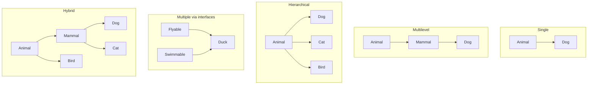
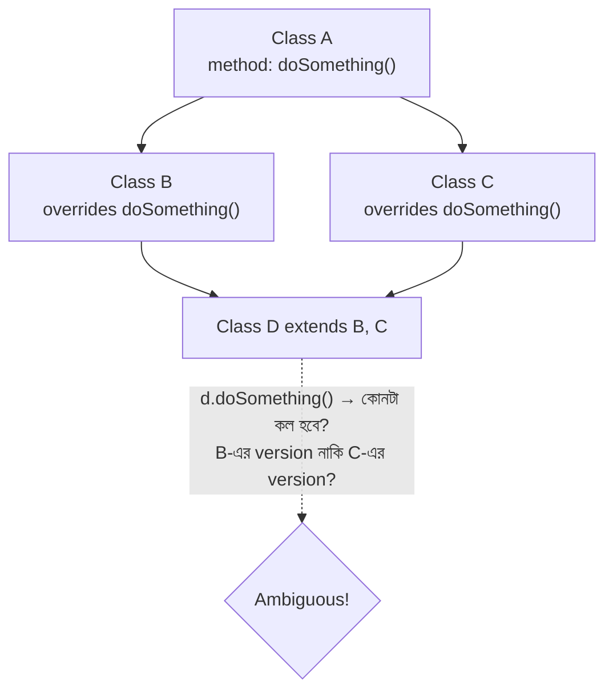
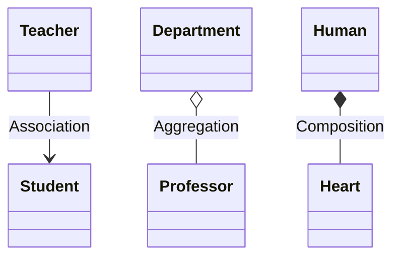

## 19. What is inheritance?

**Inheritance** হলো Object-Oriented Programming (OOP)-এর একটি core mechanism, যার মাধ্যমে একটি class (subclass) অন্য একটি class (superclass)-এর fields এবং methods reuse করতে পারে, এবং প্রয়োজনে সেগুলোর নিজস্ব extension বা modification যোগ করতে পারে। এটি Java-তে `extends` keyword দিয়ে implement করা হয়।

### What problem does inheritance solve?

মূল সমস্যা যেটা inheritance সমাধান করে সেটা হলো **code duplication এবং poor maintainability**। ধরুন আপনার কাছে `Car`, `Bike`, `Truck` — এই তিনটি class আছে, প্রতিটির মধ্যেই `brand`, `speed` এর মতো field এবং `startEngine()`, `stopEngine()` এর মতো method বারবার লিখতে হচ্ছে। এই duplicate logic-এর কারণে:

- কোনো bug fix করতে হলে সব class-এ আলাদা আলাদা করে fix করতে হবে
- নতুন কোনো common feature যোগ করতে হলে প্রতিটি class-এ আলাদাভাবে যোগ করতে হবে
- Code বড়, error-prone, এবং অসামঞ্জস্যপূর্ণ (inconsistent) হয়ে যায়

Inheritance দিয়ে একটি common superclass (যেমন `Vehicle`) তৈরি করে shared logic একবার লিখে রাখা যায়, এবং সব subclass সেটা reuse করে। এতে যা লাভ হয়:

1. **Code reusability** — একই code বারবার লিখতে হয় না
2. **Single point of maintenance** — একটি জায়গায় change করলেই তা সব subclass-এ propagate হয়
3. **Polymorphism-এর ভিত্তি তৈরি হয়** — parent type reference দিয়ে child object handle করা যায়
4. Real-world hierarchical relationship logically model করা যায়

```java
class Vehicle {
    protected String brand;
    protected int speed;

    public Vehicle(String brand, int speed) {
        this.brand = brand;
        this.speed = speed;
    }

    public void startEngine() {
        System.out.println(brand + " engine started.");
    }
}

class Car extends Vehicle { // reusing Vehicle's logic, no duplication
    private int numberOfDoors;

    public Car(String brand, int speed, int numberOfDoors) {
        super(brand, speed);
        this.numberOfDoors = numberOfDoors;
    }
}
```

### What is a base/superclass?

**Superclass** (এটিকে **base class** বা **parent class**-ও বলা হয়) হলো সেই class যেটি থেকে অন্য class(গুলো) properties এবং behavior inherit করে। এটি সাধারণত সব child class-এর জন্য common/general behavior ধারণ করে। উপরের উদাহরণে `Vehicle` হলো superclass — এতে থাকা `brand`, `speed`, এবং `startEngine()` সব vehicle-এর জন্য common।

superclass-এর নিজস্ব বৈশিষ্ট্য:
- এটি স্বাধীনভাবে instantiate করা যায় (যদি না এটি `abstract` করা হয়)
- এতে `protected` বা `public` member রাখা হয় যাতে subclass সেগুলো access করতে পারে
- এটি একাধিক subclass-এর জন্য common contract বা default implementation দেয়

### What is a derived/subclass?

**Subclass** (এটিকে **derived class** বা **child class**-ও বলা হয়) হলো সেই class যেটি একটি superclass থেকে `extends` করে এবং:
1. Superclass-এর সব non-private fields/methods automatically পায় (inherit করে)
2. প্রয়োজনে নিজস্ব additional fields/methods যোগ করতে পারে
3. প্রয়োজনে superclass-এর কোনো method-এর নিজস্ব ভিন্ন implementation দিতে পারে (**method overriding**)

উপরের উদাহরণে `Car` হলো subclass — এটি `Vehicle`-এর সব property/method পায় এবং নিজস্ব `numberOfDoors` field যোগ করে।

```java
public class Main {
    public static void main(String[] args) {
        Car myCar = new Car("Toyota", 180, 4);
        myCar.startEngine(); // inherited from Vehicle (superclass)
    }
}
```

---

## 20. What are the different types of inheritance?

### What are single, multilevel, hierarchical, multiple, and hybrid inheritance?

**1. Single Inheritance** — একটি subclass শুধুমাত্র একটি superclass থেকে inherit করে (A → B)।

```java
class Animal {
    void eat() { System.out.println("Eating..."); }
}
class Dog extends Animal { // single inheritance
    void bark() { System.out.println("Barking..."); }
}
```

**2. Multilevel Inheritance** — একটি class অন্য একটি class থেকে inherit করে, আর সেই class আবার আরেকটি class-এর superclass হিসেবে কাজ করে, একটি chain তৈরি হয় (A → B → C)।

```java
class Animal {
    void eat() { System.out.println("Eating..."); }
}
class Mammal extends Animal {
    void breathe() { System.out.println("Breathing..."); }
}
class Dog extends Mammal { // Dog gets Animal's + Mammal's members
    void bark() { System.out.println("Barking..."); }
}
```

**3. Hierarchical Inheritance** — একটি superclass থেকে একাধিক subclass inherit করে (A থেকে B, C, D আলাদাভাবে)।

```java
class Animal {
    void eat() { System.out.println("Eating..."); }
}
class Dog extends Animal { void bark() {} }
class Cat extends Animal { void meow() {} }
```

**4. Multiple Inheritance** — একটি subclass একইসাথে একাধিক superclass থেকে inherit করে (class-level এ B ও C দুই class থেকে D inherit করে)। Java class-level এ এটি সরাসরি সমর্থন করে না (diamond problem এড়াতে), কিন্তু interface দিয়ে simulate করা যায়।

```java
interface Flyable { void fly(); }
interface Swimmable { void swim(); }

class Duck implements Flyable, Swimmable { // multiple inheritance via interfaces
    public void fly() { System.out.println("Duck flies."); }
    public void swim() { System.out.println("Duck swims."); }
}
```

**5. Hybrid Inheritance** — উপরের দুই বা তার বেশি ধরনের combination, যেমন hierarchical + multilevel একসাথে থাকা একটি structure।



### Which inheritance types are supported differently across languages?

| Language | Single | Multilevel | Hierarchical | Multiple (class-level) |
|---|---|---|---|---|
| **Java** | ✅ | ✅ | ✅ | ❌ (শুধু interface দিয়ে simulate করা যায়) |
| **C#** | ✅ | ✅ | ✅ | ❌ (Java-এর মতোই, শুধু interface দিয়ে) |
| **C++** | ✅ | ✅ | ✅ | ✅ (সরাসরি সমর্থিত, `virtual inheritance` দিয়ে diamond problem handle করা হয়) |
| **Python** | ✅ | ✅ | ✅ | ✅ (সরাসরি সমর্থিত, MRO/C3 linearization দিয়ে ambiguity resolve করা হয়) |

Java এবং C# ডিজাইনাররা ইচ্ছাকৃতভাবে class-level multiple inheritance বাদ দিয়েছেন কারণ এটি **diamond problem** এবং complexity তৈরি করে। এর বদলে তারা **interface** (Java 8+ এ default method সহ) ব্যবহার করার সুযোগ দিয়েছে, যা type-level multiple inheritance দেয় কিন্তু state/field inherit করার সমস্যা এড়ায়।

---

## 21. What is the diamond problem?

**Diamond problem** হলো multiple inheritance-এর একটি classic ambiguity সমস্যা, যেখানে একটি class দুইটি ভিন্ন path দিয়ে একই common ancestor থেকে একই method/field দুইবার inherit করে, ফলে compiler বুঝতে পারে না কোনটা ব্যবহার করবে। Class hierarchy-এর shape টা দেখতে হীরা (diamond)-এর মতো হয় বলেই এই নাম।



### Why can multiple inheritance create ambiguity?

যখন `Class D`, `Class B` এবং `Class C` — দুইটি থেকেই inherit করে, এবং উভয় class-ই `Class A`-এর `doSomething()` method-কে নিজের মতো করে override করেছে, তখন `D`-এর object থেকে `doSomething()` call করলে compiler-এর কাছে দুইটি সম্পূর্ণ বৈধ (valid) কিন্তু ভিন্ন implementation পাওয়া যায়। এই দ্ব্যর্থতা (ambiguity)-ই মূল সমস্যা — কোনটা "সঠিক" version তা ভাষাগতভাবে স্পষ্ট নয়, বিশেষ করে যদি field-ও duplicate হয় (memory-তে একাধিক copy তৈরি হওয়ার সমস্যাও দেখা দিতে পারে, যাকে "state diamond problem"-ও বলা হয়)।

### How do different languages handle or avoid this problem?

**Java** — class-level multiple inheritance সম্পূর্ণভাবে **disallow** করে দিয়ে এই সমস্যা মূল থেকেই এড়িয়ে যায় (`class D extends B, C` — এটি Java-তে compile-time error)। তবে interface-এর ক্ষেত্রে যদি দুইটি interface-এই একই signature-এর **default method** থাকে এবং কোনো class দুইটাই implement করে, তাহলে সেই class-কে বাধ্যতামূলকভাবে explicitly override করে ambiguity resolve করতে হয়:

```java
interface A {
    default void greet() { System.out.println("Hello from A"); }
}
interface B {
    default void greet() { System.out.println("Hello from B"); }
}

class C implements A, B {
    @Override
    public void greet() {
        A.super.greet();      // explicitly choosing which one to call
        B.super.greet();
        System.out.println("Custom logic in C");
    }
}
```

যদি `C` class এই override না করে, তাহলে Java compiler এটাকে **compile-time error** হিসেবে ধরবে ("class C inherits unrelated defaults for greet() from types A and B")।

**C++** — class-level multiple inheritance সরাসরি সমর্থন করে, এবং diamond problem সমাধানের জন্য **`virtual inheritance`** ব্যবহার করা হয়, যাতে common ancestor (`A`)-এর একটিমাত্র shared copy তৈরি হয়, একাধিক copy না হয়ে।

**Python** — multiple inheritance সরাসরি সমর্থন করে, এবং **MRO (Method Resolution Order)**-এর জন্য **C3 linearization algorithm** ব্যবহার করে একটি deterministic, consistent order নির্ধারণ করে যে কোন class-এর method আগে call হবে (`ClassName.__mro__` দিয়ে দেখা যায়)।

---

## 22. What is an "is-a" relationship?

**"is-a" relationship** বোঝায়, একটি subclass আসলে superclass-এরই একটি বিশেষায়িত (specialized) type। এটি inheritance দিয়ে model করা হয়। যেমন — "A `Dog` **is-a** `Animal`", "A `Car` **is-a** `Vehicle`"।

### When does inheritance correctly represent an "is-a" relationship?

Inheritance তখন সঠিকভাবে "is-a" represent করে যখন subclass, সব দিক দিয়ে superclass-এর একটি সত্যিকারের specialization হয়, এবং **Liskov Substitution Principle (LSP)** মেনে চলে — অর্থাৎ যেখানে superclass-এর object ব্যবহার করার কথা, সেখানে subclass-এর object বসিয়ে দিলেও program সঠিকভাবে কাজ করবে, কোনো unexpected behavior তৈরি হবে না।

```java
class Animal {
    void eat() { System.out.println("Eating..."); }
}

class Dog extends Animal { // Dog IS-A Animal ✅ — সব জায়গায় Animal-এর বদলে Dog ব্যবহার করা যায়
    void bark() { System.out.println("Barking..."); }
}

public class Main {
    static void feed(Animal a) { a.eat(); }
    public static void main(String[] args) {
        feed(new Dog()); // Animal-এর জায়গায় Dog দিব্যি কাজ করছে ✅
    }
}
```

### Why is every conceptual "is-a" relationship not necessarily good inheritance?

ভাষাগতভাবে "is-a" মনে হলেও, বাস্তবে সেটা সবসময় ভালো inheritance design হয় না। ক্লাসিক উদাহরণ — mathematically "A `Square` **is-a** `Rectangle`" সত্যি, কিন্তু OOP-তে এটি সমস্যাযুক্ত।

```java
class Rectangle {
    protected int width, height;
    void setWidth(int w)  { this.width = w; }
    void setHeight(int h) { this.height = h; }
    int getArea() { return width * height; }
}

class Square extends Rectangle {
    @Override
    void setWidth(int w) {
        this.width = w;
        this.height = w; // forced constraint, breaks Rectangle's expected independent behavior
    }
    @Override
    void setHeight(int h) {
        this.width = h;
        this.height = h;
    }
}

public class Main {
    static void resize(Rectangle r) {
        r.setWidth(5);
        r.setHeight(10);
        System.out.println(r.getArea()); // Rectangle হলে expect করে 50
    }
    public static void main(String[] args) {
        resize(new Square(10)); // কিন্তু আসল output হবে 100 — অপ্রত্যাশিত!
    }
}
```

এখানে `resize()` method `Rectangle` type আশা করে যে `width` এবং `height` স্বাধীনভাবে set করা যাবে, কিন্তু `Square`-এর constraint (width সবসময় = height) সেই ধারণা ভেঙে দেয়। এতে **Liskov Substitution Principle** ভঙ্গ হয় — যদিও "conceptually" Square is-a Rectangle, বাস্তবে OOP inheritance হিসেবে এটি খারাপ design। এই ধরনের ক্ষেত্রে composition বা আলাদা interface ব্যবহার করা ভালো।

---

## 23. What is a "has-a" relationship?

**"has-a" relationship** বোঝায় একটি class অন্য class-এর object কে তার একটি অংশ/member হিসেবে ধারণ করে, কিন্তু নিজে সেই object-এর type-এর কোনো specialization নয়। যেমন — "A `Car` **has-a** `Engine`"।

### How does a "has-a" relationship differ from "is-a"?

| দিক | "is-a" | "has-a" |
|---|---|---|
| Represent করে | Type hierarchy / specialization | Ownership / part-whole সম্পর্ক |
| Java-তে implement | `extends` (inheritance) | class-এর ভেতরে field হিসেবে অন্য object রাখা (composition/aggregation) |
| উদাহরণ | `Dog is-a Animal` | `Car has-a Engine` |
| ভুল ব্যবহার হলে | Liskov Substitution ভাঙে | Over-engineering হতে পারে, কিন্তু কম risky |

`Car is-a Engine` — এটা ভুল ও অর্থহীন একটি statement, কারণ Car আসলে Engine-এর কোনো specialized version নয়, বরং Car-এর ভেতরে একটি Engine থাকে — এটাই "has-a"।

### Why is composition usually associated with "has-a"?

Composition-এ একটি class অন্য class-এর object কে instance variable/field হিসেবে ধারণ করে, যেটা সরাসরি "has-a" সম্পর্ক তৈরি করে — কারণ container object, contained object-কে সত্যিকারভাবে "নিজের অংশ" হিসেবে own করে (delegates কাজ তার কাছে), কিন্তু নিজে সেই type-এর subtype হয় না।

```java
class Engine {
    void start() { System.out.println("Engine starting..."); }
}

class Car {
    private Engine engine; // Car HAS-A Engine (composition)

    public Car() {
        this.engine = new Engine();
    }

    void startCar() {
        engine.start(); // delegating work to the "part" it owns
        System.out.println("Car is moving.");
    }
}
```

এখানে `Car` নিজে `Engine`-এর behavior override করছে না বা `Engine`-এর subtype নয় — বরং সে তার কাজের জন্য `Engine`-এর উপর নির্ভর করছে (delegation), যেটা composition/has-a-এর মূল বৈশিষ্ট্য।

---

## 24. What is association?

**Association** হলো দুইটি সম্পূর্ণ স্বাধীন class-এর object-এর মধ্যে একটি সাধারণ সম্পর্ক, যেখানে একটি object অন্য object-কে জানে বা ব্যবহার করে, কিন্তু এখানে কোনো ownership বা lifecycle dependency থাকে না।

### What does association mean between two objects?

Association মানে হলো দুইটি object একে অপরের সাথে interact করে, কিন্তু উভয়ই সম্পূর্ণ স্বাধীনভাবে exist করে — একটি object destroy হলে অন্যটির কোনো প্রভাব পড়ে না। উদাহরণ: `Teacher` এবং `Student` — একজন teacher একাধিক student-কে পড়ায়, একজন student একাধিক teacher-এর কাছে পড়তে পারে, কিন্তু কেউ কাউকে "own" করে না।

```java
class Student {
    String name;
    Student(String name) { this.name = name; }
}

class Teacher {
    String name;
    Teacher(String name) { this.name = name; }

    void teach(Student student) { // association through method parameter
        System.out.println(this.name + " is teaching " + student.name);
    }
}

public class Main {
    public static void main(String[] args) {
        Teacher t = new Teacher("Mr. Hasan");
        Student s = new Student("Rafi");
        t.teach(s); // temporary association, no ownership
    }
}
```

### Can association be one-way or two-way?

হ্যাঁ, association দুই ধরনের হতে পারে:

**1. Unidirectional (one-way) association** — শুধুমাত্র একটি class অন্য class সম্পর্কে জানে। উপরের উদাহরণে `Teacher` class `Student`-কে জানে (method parameter হিসেবে ব্যবহার করে), কিন্তু `Student` class-এ `Teacher`-এর কোনো reference নেই।

**2. Bidirectional (two-way) association** — দুই class-ই একে অপরকে reference হিসেবে ধারণ করে:

```java
class Student {
    String name;
    Teacher teacher; // Student জানে তার Teacher-কে

    Student(String name) { this.name = name; }
}

class Teacher {
    String name;
    List<Student> students = new ArrayList<>(); // Teacher জানে তার Students-দের

    Teacher(String name) { this.name = name; }

    void addStudent(Student s) {
        students.add(s);
        s.teacher = this; // দুই দিক থেকেই reference তৈরি হচ্ছে — bidirectional
    }
}
```

এখানে `Student` object থেকে তার `Teacher`-কে access করা যায়, আবার `Teacher` object থেকে তার সব `Student`-কেও access করা যায় — এটাই bidirectional/two-way association।

---

## 25. What is aggregation?

**Aggregation** হলো একটি বিশেষ ধরনের "has-a" relationship, যেখানে একটি container/whole object একটি contained/part object কে ধারণ করে, কিন্তু contained object-টি container-এর বাইরেও স্বাধীনভাবে exist করতে পারে। এটি UML-এ **hollow/empty diamond (◇)** দিয়ে represent করা হয়।

### Why is aggregation considered a weak "has-a" relationship?

এটিকে **"weak" has-a**/weak ownership বলা হয় কারণ:

1. Contained object সাধারণত container-এর **বাইরে তৈরি হয়** এবং পরে reference হিসেবে পাস করে দেওয়া হয় (container নিজে তাকে তৈরি করে না)
2. Container object destroy/garbage-collected হয়ে গেলেও, contained object অন্য কোথাও reference থাকলে বেঁচে থাকতে পারে — তাদের **lifecycle একে অপরের থেকে independent**
3. Ownership টা loose — এক container বাদ দিয়ে সেই একই child object অন্য container-এও ব্যবহার করা যেতে পারে (উদাহরণ: একজন Professor একাধিক Department-এর সাথেও associate থাকতে পারেন)

উদাহরণ: `Department` এবং `Professor` — professor department ছেড়ে গেলেও, professor একজন human হিসেবে independently exist করতেই থাকবেন।

### Can the child object exist independently of the parent object?

হ্যাঁ, এবং এটাই aggregation-এর মূল সংজ্ঞায়িত বৈশিষ্ট্য। Child object parent object তৈরি হওয়ার আগেও exist করতে পারে, এবং parent destroy হয়ে গেলেও child বেঁচে থাকতে পারে।

```java
class Professor {
    String name;
    Professor(String name) { this.name = name; }
}

class Department {
    private List<Professor> professors;

    Department(List<Professor> professors) {
        this.professors = professors; // Department নিজে Professor তৈরি করছে না, বাইরে থেকে পাচ্ছে
    }
}

public class Main {
    public static void main(String[] args) {
        // Professor objects Department-এর বাইরে তৈরি হচ্ছে
        Professor p1 = new Professor("Dr. Rahman");
        Professor p2 = new Professor("Dr. Karim");

        Department cse = new Department(new ArrayList<>(List.of(p1, p2)));

        cse = null; // Department object destroy হয়ে গেলেও...
        // p1 এবং p2 (Professor objects) এখনও স্বাধীনভাবে exist করছে, ব্যবহারযোগ্য
        System.out.println(p1.name); // এখনও কাজ করবে ✅
    }
}
```

---

## 26. What is composition?

**Composition** হলো "has-a" relationship-এর সবচেয়ে strict/strong রূপ, যেখানে contained object-এর lifecycle সম্পূর্ণভাবে container object-এর উপর নির্ভরশীল। এটি UML-এ **filled/solid diamond (◆)** দিয়ে represent করা হয়।

### Why is composition considered a strong "has-a" relationship?

একে **"strong" has-a** বলা হয় কারণ:

1. Contained object সাধারণত **container-এর ভেতরেই তৈরি হয়** (container নিজেই তার "part"-গুলো তৈরি করে, বাইরে থেকে পায় না)
2. Contained object container-এর বাইরে **অর্থপূর্ণভাবে exist করতে পারে না** — এটি সত্যিকারের একটি "part-of" সম্পর্ক
3. Container destroy হলে, contained object-ও automatically destroy হয়ে যায় (Java-তে garbage collected হয়, কারণ আর কোনো external reference থাকে না)

উদাহরণ: `Human` এবং `Heart` — একটি heart, human শরীরের বাইরে স্বাধীনভাবে কার্যকরী অর্থে exist করে না।

```java
class Heart {
    void pump() { System.out.println("Heart is pumping."); }
}

class Human {
    private final Heart heart; // Heart সম্পূর্ণভাবে Human-এর ভেতরে তৈরি ও owned

    public Human() {
        this.heart = new Heart(); // Human নিজেই তার Heart তৈরি করছে
    }

    void live() {
        heart.pump();
    }
}

public class Main {
    public static void main(String[] args) {
        Human h = new Human();
        h.live();
        h = null; // Human object destroy হলে, তার Heart-এরও আর কোনো reference থাকে না
                  // — Heart object-ও effectively destroy হয়ে যায়
    }
}
```

### How does lifecycle ownership differ from aggregation?

| দিক | Aggregation | Composition |
|---|---|---|
| Object কোথায় তৈরি হয় | Container-এর বাইরে তৈরি হয়ে পাস করা হয় | Container-এর ভেতরেই তৈরি হয় |
| Lifecycle | Independent — parent ছাড়াও child বাঁচতে পারে | Dependent — parent destroy হলে child-ও destroy হয় |
| Coupling | Loose coupling | Tight coupling |
| উদাহরণ | Department–Professor | Human–Heart |

সংক্ষেপে: aggregation-এ ownership থাকলেও lifecycle-এ কোনো বাধ্যবাধকতা নেই, কিন্তু composition-এ ownership-এর সাথে lifecycle-ও সম্পূর্ণভাবে bind হয়ে যায়।

---

## 27. What is the difference between association, aggregation, and composition?

তিনটিই object-দের মধ্যে সম্পর্ক বর্ণনা করে, কিন্তু ownership এবং lifecycle dependency-এর মাত্রায় (degree) ভিন্ন — Association সবচেয়ে loose, তারপর Aggregation, এবং Composition সবচেয়ে tight।

### How do ownership and lifecycle differ among them?

| বিষয় | Association | Aggregation | Composition |
|---|---|---|---|
| Relationship strength | সাধারণ, loosely coupled | Weak "has-a" | Strong "has-a" |
| Ownership | কোনো ownership নেই | Ownership আছে, কিন্তু loose | Full/exclusive ownership |
| Object কোথায় তৈরি হয় | সম্পর্কহীনভাবে আলাদা তৈরি হয় | বাইরে তৈরি হয়ে পাস করা হয় | Container-এর ভেতরেই তৈরি হয় |
| Lifecycle dependency | সম্পূর্ণ independent | Independent (child বাইরে exist করে) | Dependent (parent destroy হলে child-ও destroy হয়) |
| উদাহরণ | Teacher–Student | Department–Professor | Human–Heart |
| UML notation | সাধারণ line (—) | Hollow diamond (◇——) | Filled diamond (◆——) |



সহজে মনে রাখার উপায়:
- **Association** = "I know you" — দুইজন সম্পূর্ণ স্বাধীন, শুধু interact করছে
- **Aggregation** = "I have you, but you can survive without me" — ownership আছে, কিন্তু lifecycle independent (hollow ◇)
- **Composition** = "I have you, and you cannot exist without me" — ownership ও lifecycle দুটোই bound (filled ◆)

---

## 28. What does "favor composition over inheritance" mean?

এটি একটি বিখ্যাত OOP design principle (Gang of Four-এর *Design Patterns* বই থেকে জনপ্রিয় হয়েছে), যা বলে — code reuse করার প্রয়োজনে, যেখানে সম্ভব সেখানে class inheritance-এর বদলে object composition ব্যবহার করা উচিত।

### Why is composition often more flexible than inheritance?

1. **Compile-time vs runtime binding** — Inheritance একটি **compile-time**, static সম্পর্ক তৈরি করে — একবার class define হয়ে গেলে সেই relationship পরিবর্তন করা যায় না। Composition দিয়ে **runtime**-এ behavior পরিবর্তন করা যায় (dependency injection দিয়ে ভিন্ন implementation পাস করে)।
2. **Fragile base class problem এড়ানো যায়** — Inheritance-এ superclass-এর কোনো পরিবর্তন সব subclass-এ অনাকাঙ্ক্ষিত ripple effect ফেলতে পারে। Composition-এ, একটি component class পরিবর্তন করলে শুধু সেই interface/contract বজায় থাকলেই container class প্রভাবিত হয় না।
3. **Encapsulation ভালোভাবে বজায় থাকে** — Inheritance subclass-কে superclass-এর internal implementation-এর উপর নির্ভরশীল করে তোলে (subclass superclass-এর protected/internal detail সম্পর্কে জানে)। Composition-এ শুধু public interface-এর মাধ্যমেই interact করা হয়, internal detail সম্পূর্ণ hidden থাকে।
4. **Single inheritance-এর সীমাবদ্ধতা এড়ানো যায়** — Java-তে একটি class শুধুমাত্র একটি superclass extend করতে পারে, কিন্তু composition দিয়ে একই class-এর ভেতরে একাধিক ভিন্ন class-এর behavior একসাথে combine করা যায় কোনো বাধা ছাড়াই।

```java
interface PaymentMethod {
    void pay(double amount);
}

class CreditCardPayment implements PaymentMethod {
    public void pay(double amount) {
        System.out.println("Paid " + amount + " using Credit Card");
    }
}

class MobileBankingPayment implements PaymentMethod {
    public void pay(double amount) {
        System.out.println("Paid " + amount + " using Mobile Banking");
    }
}

class ShoppingCart {
    private PaymentMethod paymentMethod; // composition — flexible

    public ShoppingCart(PaymentMethod paymentMethod) {
        this.paymentMethod = paymentMethod;
    }

    void checkout(double amount) {
        paymentMethod.pay(amount); // runtime-এ behavior পরিবর্তনযোগ্য
    }
}

public class Main {
    public static void main(String[] args) {
        ShoppingCart cart = new ShoppingCart(new MobileBankingPayment());
        cart.checkout(1500.0);

        // ShoppingCart-এর structure না বদলিয়েই behavior পরিবর্তন করা গেল
        ShoppingCart cart2 = new ShoppingCart(new CreditCardPayment());
        cart2.checkout(2500.0);
    }
}
```

যদি এটি inheritance দিয়ে করা হতো (`ShoppingCart extends CreditCardPayment`), তাহলে runtime-এ payment method পরিবর্তন করা সম্ভবই হতো না, এবং একইসাথে একাধিক payment behavior combine করাও কঠিন হতো।

### Does this mean inheritance should never be used?

না, এটি একটি absolute rule নয়, বরং একটি **default guideline/heuristic**। এর মানে এই না যে inheritance খারাপ বা এড়িয়ে চলতে হবে — বরং এর মানে হলো, যখন সন্দেহ থাকে (uncertain থাকেন কোনটা ব্যবহার করবেন), তখন প্রথমে composition বিবেচনা করুন। যেখানে সত্যিকারের, স্থায়ী "is-a" সম্পর্ক আছে এবং Liskov Substitution Principle পুরোপুরি মেনে চলে (যেমন প্রশ্ন ২৯-এ আলোচিত ক্ষেত্রগুলো), সেখানে inheritance এখনও সঠিক ও কার্যকর সমাধান।

---

## 29. When should you choose inheritance instead of composition?

### What signs indicate inheritance is appropriate?

Inheritance তখন উপযুক্ত যখন নিচের সবগুলো (বা অধিকাংশ) শর্ত পূরণ হয়:

1. একটি সত্যিকারের, স্থায়ী **"is-a" relationship** বিদ্যমান (যেমন `Dog is-a Animal`), শুধু ভাষাগত মিল নয়
2. Subclass, superclass-এর প্রতিটি ক্ষেত্রেই নিরাপদে substitute করা যায় — **Liskov Substitution Principle** সম্পূর্ণভাবে মেনে চলে
3. সম্পর্কটি **compile-time-এ fixed** থাকবে বলে আশা করা যায়, runtime-এ পরিবর্তনের প্রয়োজন নেই
4. আপনি polymorphism-এর মাধ্যমে একটি **common contract/base behavior** define করতে চান (abstract class/method দিয়ে)
5. Hierarchy ছোট, সহজবোধ্য এবং স্থিতিশীল (stable) — future-এ বড় ধরনের পরিবর্তনের সম্ভাবনা কম

```java
abstract class Shape {
    abstract double calculateArea(); // common contract enforced

    void printArea() {
        System.out.println("Area: " + calculateArea());
    }
}

class Circle extends Shape {
    double radius;
    Circle(double radius) { this.radius = radius; }

    @Override
    double calculateArea() { return Math.PI * radius * radius; }
}

class Rectangle extends Shape {
    double width, height;
    Rectangle(double width, double height) {
        this.width = width;
        this.height = height;
    }

    @Override
    double calculateArea() { return width * height; }
}
```

এখানে `Circle is-a Shape` এবং `Rectangle is-a Shape` — উভয়ই সত্যিকারের, স্থায়ী "is-a" সম্পর্ক, এবং polymorphism-এর মাধ্যমে `printArea()` উভয়ের জন্যই সঠিকভাবে কাজ করে — এটি inheritance-এর একটি আদর্শ প্রয়োগ।

### What problems can deep inheritance hierarchies create?

1. **Fragile base class problem** — hierarchy-এর উপরের দিকের কোনো class-এ পরিবর্তন করলে নিচের সব subclass-এ unpredictable, cascading ripple effect তৈরি হতে পারে, এমনকি যেসব subclass-এর author সেই change সম্পর্কে জানেও না।
2. **Tight coupling** — subclass গুলো superclass-এর internal implementation-এর উপর অতিরিক্ত নির্ভরশীল হয়ে পড়ে, encapsulation দুর্বল হয়ে যায়।
3. **কম flexibility** — একবার hierarchy compile হয়ে গেলে, runtime-এ behavior পরিবর্তন করার কোনো সুযোগ থাকে না।
4. **কম readability/maintainability** — বহু-স্তরের hierarchy (যেমন A → B → C → D → E) থাকলে কোনো নির্দিষ্ট method আসলে কোথা থেকে এসেছে তা track করা কঠিন হয়ে পড়ে ("যদুবংশ" সমস্যা — কোন ancestor-এ কী define হয়েছে তা মনে রাখা কঠিন)।
5. **Diamond problem-এর ঝুঁকি** বেড়ে যায় (এমন language-এ যেখানে multiple inheritance সমর্থিত)।
6. **Testing কঠিন হয়ে যায়** — deep hierarchy-এর প্রতিটি level আলাদাভাবে এবং তাদের interaction-ও test করতে হয়, যা complexity অনেক বাড়িয়ে দেয়।

---

## 30. What does it mean to make a class or method final/sealed/non-inheritable?

Java-তে `final` keyword দিয়ে একটি class বা method-কে non-inheritable/non-overridable বানানো যায়।

- **`final class`** — এই class-কে কোনো subclass extend করতে পারবে না।
- **`final method`** — এই method-কে কোনো subclass override করতে পারবে না (তবে inherit করে সরাসরি ব্যবহার করতে পারবে)।

```java
final class MathConstants {
    public static final double PI = 3.14159;
}
// class ExtendedMath extends MathConstants {} // ❌ Compile-time error

class Vehicle {
    final void startEngine() { // override করা যাবে না
        System.out.println("Engine starting sequence...");
    }
}

class Car extends Vehicle {
    // void startEngine() { } // ❌ Compile-time error
}
```

### Why would you prevent inheritance or overriding?

1. **Security ও integrity বজায় রাখা** — কিছু class-এর behavior এতটাই critical/sensitive যে সেটাকে override/modify হতে দেওয়া নিরাপদ নয়। উদাহরণ: Java-এর নিজস্ব `String` class `final`, যাতে কেউ malicious subclass বানিয়ে `String`-এর expected behavior (যেমন immutability) পরিবর্তন করতে না পারে।
2. **Immutability নিশ্চিত করা** — Immutable class ডিজাইন করার সময় (value object) class-কে `final` রাখা হয়, যাতে কোনো subclass অতিরিক্ত mutable state যোগ করে সেই immutability guarantee ভেঙে না ফেলতে পারে।
3. **Design intent স্পষ্ট করা** — Developer যখন নিশ্চিত করতে চান যে কোনো critical algorithm/logic-এর implementation পরিবর্তনযোগ্য নয় (যেমন **Template Method design pattern**-এ skeleton algorithm-এর কোনো fixed step)।
4. **Performance optimization** — `final` method-এর জন্য JVM বেশি aggressive optimization (যেমন method inlining) করতে পারে, কারণ compiler নিশ্চিতভাবে জানে যে runtime-এ এই method-এর কোনো ভিন্ন override version আসবে না, তাই dynamic dispatch (vtable lookup)-এর প্রয়োজন হয় না।
5. **Fragile base class problem প্রতিরোধ করা** — class-কে `final` রেখে নিশ্চিত করা যায় যে ভবিষ্যতে অন্য কোনো developer ভুলভাবে বা অসাবধানে extend করে unexpected bug তৈরি করবে না — এটি একধরনের defensive design decision।
6. **API design-এ backward compatibility রক্ষা করা** — Library/framework author-রা প্রায়ই তাদের class `final` রাখেন যাতে ভবিষ্যতে internal implementation পরিবর্তন করলেও, বাইরের কোনো subclass সেই পরিবর্তনের কারণে ভেঙে না যায়।

> **নোট:** C#-এ একই উদ্দেশ্যে `sealed` keyword ব্যবহার হয় (`sealed class`, `sealed override method`)। Kotlin-এ সব class **default-ভাবেই final** (non-inheritable) থাকে — inheritance allow করতে হলে explicitly `open` keyword ব্যবহার করতে হয়, যা মূলত Java/C#-এর বিপরীত approach এবং "favor composition, be explicit about inheritance" দর্শনকে ভাষার স্তরেই enforce করে।