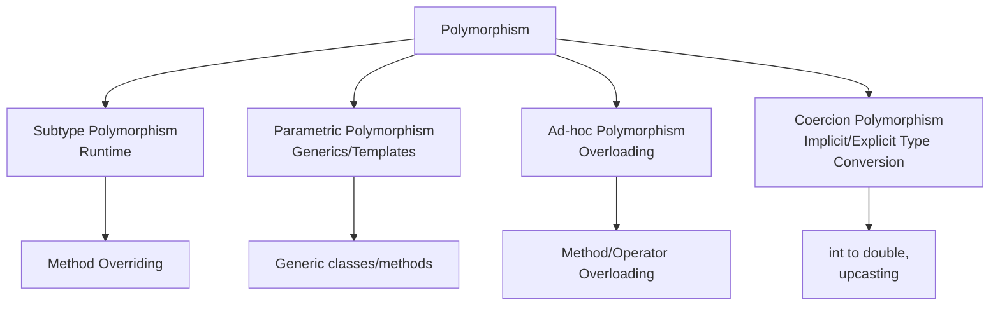
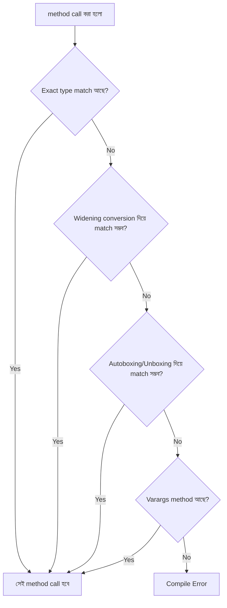
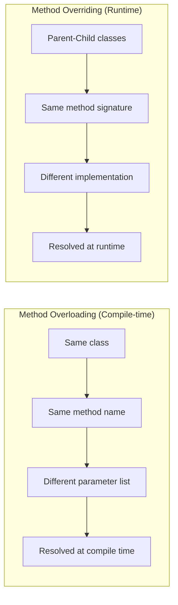
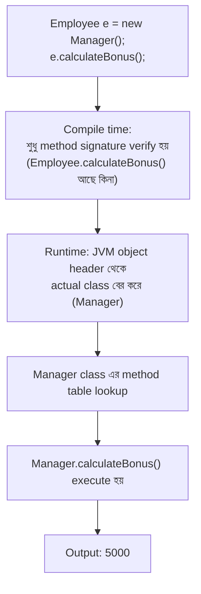

## 31. What is polymorphism?

**Polymorphism** (গ্রিক শব্দ থেকে এসেছে — "poly" মানে অনেক, "morph" মানে রূপ) হলো Object-Oriented Programming (OOP)-এর একটি core principle, যার মাধ্যমে একই **interface**, **method name**, বা **operation** বিভিন্ন **object** বা **data type**-এর ক্ষেত্রে ভিন্ন ভিন্নভাবে (different behavior-এ) কাজ করতে পারে।

সহজ ভাষায় বললে — "One name, many forms" (একটি নাম, কিন্তু একাধিক রূপ)।

উদাহরণস্বরূপ, `Shape` নামে একটি class-এর `draw()` method আছে। এখন `Circle`, `Rectangle`, `Triangle` — এই সব class যদি `Shape`-কে extend করে এবং প্রত্যেকে নিজের মতো করে `draw()` method implement করে, তাহলে `draw()` কল করলে object অনুযায়ী আলাদা আলাদা আচরণ (behavior) দেখা যাবে।

```java
abstract class Shape {
    abstract void draw();
}

class Circle extends Shape {
    void draw() {
        System.out.println("Drawing a Circle");
    }
}

class Rectangle extends Shape {
    void draw() {
        System.out.println("Drawing a Rectangle");
    }
}

public class Main {
    public static void main(String[] args) {
        Shape s1 = new Circle();
        Shape s2 = new Rectangle();

        s1.draw(); // Drawing a Circle
        s2.draw(); // Drawing a Rectangle
    }
}
```

এখানে `s1.draw()` এবং `s2.draw()` — একই method call, কিন্তু ভিন্ন ভিন্ন object-এর জন্য ভিন্ন output দিচ্ছে। এটাই polymorphism।

### Why is polymorphism useful?

Polymorphism ব্যবহারের কারণ বা উপকারিতা:

1. **Code reusability** — একই method বা interface বারবার লেখার দরকার হয় না; parent class-এর reference দিয়ে সব child object handle করা যায়।
2. **Flexibility & maintainability** — নতুন class যোগ করলেও পুরনো code পরিবর্তন করতে হয় না (Open/Closed Principle মেনে চলে)।
3. **Loose coupling** — client code শুধুমাত্র abstract type বা interface-এর উপর নির্ভর করে, concrete implementation-এর উপর না। ফলে system-এর অংশগুলো একে অপরের সাথে কম dependent থাকে।
4. **Simplified code** — একগুচ্ছ `if-else` বা `switch` statement দিয়ে object type check করার বদলে, polymorphism দিয়ে সরাসরি সঠিক method call হয়ে যায়।
5. **Readability** — কোড অনেক বেশি natural এবং real-world concept-এর কাছাকাছি হয় (যেমন সব `Animal`-এর `makeSound()` আছে, কিন্তু `Dog` আর `Cat`-এর sound আলাদা)।

### How does polymorphism improve extensibility?

**Extensibility** মানে হলো — existing code পরিবর্তন না করে নতুন functionality যোগ করার ক্ষমতা।

Polymorphism এই extensibility বাড়ায় কারণ:

- নতুন subclass তৈরি করলেই, সেই subclass automatically polymorphic behavior পেয়ে যায় — parent class বা client code-এ কোনো পরিবর্তন করতে হয় না।
- এটি সরাসরি **Open/Closed Principle** (SOLID-এর একটি principle) সমর্থন করে: "software entities should be open for extension, but closed for modification"।

```java
// পুরনো কোড পরিবর্তন না করেই নতুন Shape যোগ করা যাচ্ছে
class Triangle extends Shape {
    void draw() {
        System.out.println("Drawing a Triangle");
    }
}

public class Main2 {
    static void render(Shape shape) {
        shape.draw(); // এই method কখনো পরিবর্তন করার দরকার নেই
    }

    public static void main(String[] args) {
        render(new Circle());
        render(new Triangle()); // নতুন class, কিন্তু render() method অপরিবর্তিত
    }
}
```

`render()` method-টি কোনোদিন পরিবর্তন না করেই আমরা যতগুলো নতুন `Shape` subclass ইচ্ছা যোগ করতে পারি। এটাই polymorphism-এর মাধ্যমে extensibility।

---

## 32. What are the main types of polymorphism?

Polymorphism প্রধানত দুইভাগে ভাগ করা হয় — **compile-time (static) polymorphism** এবং **runtime (dynamic) polymorphism**। কিন্তু programming language theory-তে আরও বিস্তারিতভাবে polymorphism-কে ৪টি ভাগে ভাগ করা হয়:



Java-এর context-এ:
- **Subtype polymorphism** → runtime polymorphism (method overriding)
- **Parametric polymorphism** → Generics (`List<T>`, `Box<T>`)
- **Ad-hoc polymorphism** → compile-time polymorphism (method overloading)
- **Coercion polymorphism** → implicit type conversion (widening) বা explicit casting

### What are subtype polymorphism, parametric polymorphism, ad-hoc polymorphism, and coercion polymorphism?

**1. Subtype Polymorphism (Inclusion Polymorphism)**

একটি parent type-এর reference দিয়ে যেকোনো child (subtype) object-কে handle করা যায়, এবং actual method call হয় object-এর প্রকৃত (actual) type অনুযায়ী।

```java
class Animal {
    void sound() { System.out.println("Some sound"); }
}
class Dog extends Animal {
    void sound() { System.out.println("Bark"); }
}

Animal a = new Dog(); // Dog is a subtype of Animal
a.sound(); // Output: Bark (runtime এ decide হয়)
```

**2. Parametric Polymorphism (Generics)**

একই code বিভিন্ন data type-এর জন্য কাজ করে, type-টি parameter হিসেবে দেওয়া হয়। Java-তে এটি **Generics** দিয়ে implement হয়।

```java
class Box<T> {
    private T item;
    void set(T item) { this.item = item; }
    T get() { return item; }
}

Box<Integer> intBox = new Box<>();
intBox.set(10);

Box<String> strBox = new Box<>();
strBox.set("Hello");
```

এখানে `Box<T>` একই class, কিন্তু `Integer` এবং `String` — দুই ধরনের type-এর জন্যই কাজ করছে, কোনো code duplication ছাড়াই।

**3. Ad-hoc Polymorphism (Overloading)**

একই নামের method বিভিন্ন parameter list অনুযায়ী ভিন্ন ভিন্ন কাজ করে। প্রতিটি case-এর জন্য আলাদা implementation লিখতে হয় (তাই একে "ad-hoc" বা "case-by-case" বলা হয়)।

```java
class Calculator {
    int add(int a, int b) { return a + b; }
    double add(double a, double b) { return a + b; }
    int add(int a, int b, int c) { return a + b + c; }
}
```

**4. Coercion Polymorphism (Implicit/Explicit Type Conversion)**

একটি type-কে automatically বা explicitly অন্য type-এ convert করে একই operation ব্যবহার করা।

```java
int i = 10;
double d = i; // implicit coercion: int -> double (widening)

double x = 9.7;
int y = (int) x; // explicit coercion (narrowing) -> 9
```

এছাড়াও upcasting (child object কে parent reference-এ assign করা) কেও এক ধরনের coercion polymorphism বলা যায়:

```java
Dog dog = new Dog();
Animal a = dog; // upcasting, implicit coercion
```

---

## 33. What is compile-time polymorphism?

**Compile-time polymorphism** (যাকে **static polymorphism**-ও বলা হয়) হলো এমন এক ধরনের polymorphism যেখানে কোন method call হবে, তা **compiler** compile করার সময়েই (runtime-এ নয়) নির্ধারণ করে ফেলে — method-এর নাম, parameter-এর সংখ্যা, বা parameter-এর type দেখে।

Java-তে এটি মূলত **method overloading** এবং **operator overloading** (Java-তে সীমিত, যেমন `+` operator string concatenation এবং addition দুইটার জন্যই কাজ করে) দিয়ে অর্জিত হয়।

```java
class Printer {
    void print(String s) {
        System.out.println("String: " + s);
    }
    void print(int i) {
        System.out.println("Integer: " + i);
    }
}

public class Main {
    public static void main(String[] args) {
        Printer p = new Printer();
        p.print("Hello"); // Compiler compile time এ ঠিক করে ফেলে কোনটি call হবে
        p.print(100);
    }
}
```

এখানে `p.print("Hello")` লেখার সাথে সাথেই compiler বুঝে যায় যে `print(String)` version-টি call হবে — এটা কোনো runtime decision না, তাই একে **static binding** (compile-time binding)-ও বলা হয়।

### How does method/function overloading relate to compile-time polymorphism?

Method overloading হলো compile-time polymorphism বাস্তবায়নের প্রধান মাধ্যম। যখন একই class-এ একই নামের একাধিক method থাকে কিন্তু তাদের **method signature** (parameter type, number, order) ভিন্ন হয়, তখন compiler:

1. method call-টি দেখে,
2. argument-এর type ও সংখ্যা যাচাই করে,
3. সবচেয়ে matching method signature বেছে নেয়, এবং
4. সেই method call-টিকে compiled bytecode-এ **bind** করে দেয় — এটি compile time-এই ঘটে।

যেহেতু কোন method call হবে তা runtime-এ কোনো object-এর actual type-এর উপর নির্ভর করে না, বরং compile-time-এ argument দেখেই ঠিক হয়ে যায়, তাই এটি compile-time polymorphism।

### How do generics/templates relate to parametric polymorphism?

**Generics** (Java) বা **Templates** (C++) হলো parametric polymorphism-এর বাস্তবায়ন। এখানে একটি class বা method **type parameter** (`T`, `E`, `K`, `V` ইত্যাদি) নিয়ে লেখা হয়, যেটি ব্যবহারের সময় (instantiate করার সময়) নির্দিষ্ট (concrete) type দিয়ে replace হয়।

```java
// Generic method - parametric polymorphism
public static <T> void printArray(T[] array) {
    for (T item : array) {
        System.out.print(item + " ");
    }
}

Integer[] intArr = {1, 2, 3};
String[] strArr = {"A", "B", "C"};

printArray(intArr); // T = Integer
printArray(strArr); // T = String
```

**Note (Java-specific detail):** Java-এর generics **type erasure** ব্যবহার করে বাস্তবায়িত হয় — অর্থাৎ, compile করার পর generic type information bytecode থেকে মুছে যায় এবং `Object` দিয়ে replace হয় (প্রয়োজনে automatic casting যোগ করা হয়)। এটি C++ templates-এর মতো নয়, যেখানে প্রতিটি type-এর জন্য আলাদা code generate হয় (template instantiation)।

---

## 34. What is runtime polymorphism?

**Runtime polymorphism** (বা **dynamic polymorphism**) হলো এমন polymorphism যেখানে কোন method call actually execute হবে, তা **compile-time-এ নয়, বরং program run হওয়ার সময় (runtime-এ)** নির্ধারিত হয় — object-এর **actual (runtime) type** দেখে, reference variable-এর declared type দেখে নয়।

Java-তে এটি **method overriding** এবং **dynamic method dispatch** এর মাধ্যমে বাস্তবায়িত হয়।

```java
class Animal {
    void sound() {
        System.out.println("Animal makes a sound");
    }
}

class Cat extends Animal {
    @Override
    void sound() {
        System.out.println("Cat meows");
    }
}

class Cow extends Animal {
    @Override
    void sound() {
        System.out.println("Cow moos");
    }
}

public class Main {
    public static void main(String[] args) {
        Animal a; // reference type: Animal

        a = new Cat();
        a.sound(); // Runtime এ decide হয় -> "Cat meows"

        a = new Cow();
        a.sound(); // Runtime এ decide হয় -> "Cow moos"
    }
}
```

এখানে `a` variable-এর declared type সবসময় `Animal`, কিন্তু runtime-এ কোন `sound()` execute হবে তা নির্ভর করে `a`-তে actually কোন object (Cat/Cow) আছে তার উপর।

### How does method overriding enable runtime polymorphism?

**Method overriding** হলো — parent class-এর একটি method-কে child class একই signature (নাম, parameter list, return type) দিয়ে পুনরায় (নতুনভাবে) implement করা।

যখন overriding হয়, JVM একটি বিশেষ mechanism ব্যবহার করে — **Virtual Method Table (vtable)**-এর মাধ্যমে (JVM-এ একে বলা হয় **method table**) — যাতে child class-এর overridden version parent-এর version-কে override করে দেয় object hierarchy-তে।

তাই যখন parent reference দিয়ে overridden method call করা হয়, JVM object-এর actual class দেখে এবং সেই class-এর method table থেকে সঠিক method খুঁজে বের করে call করে — এভাবেই runtime polymorphism সম্ভব হয়।

### Why is dynamic dispatch required?

**Dynamic dispatch** ছাড়া runtime polymorphism সম্ভবই না। কারণগুলো হলো:

1. **Compile-time-এ object-এর actual type জানা সম্ভব নয় সবসময়।** একটি method যদি `Animal` reference নেয়, তাহলে সেটা `Cat`, `Cow`, বা অন্য কোনো subclass-এর object হতে পারে — এটা শুধু runtime-এই জানা যায়।

2. **Extensibility বজায় রাখতে** — নতুন subclass তৈরি হলে existing code পরিবর্তন না করেই সঠিক behavior পেতে হলে, method resolution অবশ্যই runtime-এ হতে হবে।

3. **Behavior সঠিকভাবে object-specific রাখতে** — যদি static binding ব্যবহার করা হতো (যেমন C++-এ non-virtual method), তাহলে সবসময় parent class-এর method-ই call হতো, child-এর override কখনো কাজ করত না।

```mermaid
sequenceDiagram
    participant Client
    participant JVM
    participant Object as "Cat object (heap)"

    Client->>JVM: Animal a = new Cat();<br/>a.sound();
    JVM->>Object: actual class জানার জন্য object header check
    Object-->>JVM: actual class = Cat
    JVM->>JVM: Cat class এর method table থেকে<br/>sound() খুঁজে বের করা
    JVM-->>Client: "Cat meows" execute হয়
```

---

## 35. What is method overloading?

**Method overloading** হলো একই class-এর মধ্যে একই নামের একাধিক method থাকা, কিন্তু তাদের **parameter list** ভিন্ন হওয়া (parameter-এর সংখ্যা, type, অথবা order ভিন্ন)। এটি compile-time polymorphism-এর একটি উদাহরণ।

```java
class MathUtils {
    int multiply(int a, int b) {
        return a * b;
    }

    double multiply(double a, double b) {
        return a * b;
    }

    int multiply(int a, int b, int c) {
        return a * b * c;
    }
}
```

উপরের তিনটি `multiply` method-ই overloaded, কারণ প্রত্যেকটির parameter list ভিন্ন।

### What rules govern method overloading?

Method overloading-এর জন্য নিচের যেকোনো একটি (বা একাধিক) শর্ত পূরণ করতে হবে:

1. **Number of parameters ভিন্ন হতে হবে**
   ```java
   void show(int a) {}
   void show(int a, int b) {}
   ```

2. **Parameter-এর data type ভিন্ন হতে হবে**
   ```java
   void show(int a) {}
   void show(String a) {}
   ```

3. **Parameter-এর order (sequence) ভিন্ন হতে হবে** (যদি type ভিন্ন হয়)
   ```java
   void show(int a, String b) {}
   void show(String a, int b) {}
   ```

**যেগুলো method overloading-এর জন্য যথেষ্ট নয়:**
- শুধুমাত্র **return type** ভিন্ন হওয়া যথেষ্ট নয় (নিচে বিস্তারিত)।
- শুধুমাত্র parameter-এর **নাম** ভিন্ন হওয়া কোনো ভূমিকা রাখে না (compiler parameter name দেখে না, শুধু type/order দেখে)।

### Can methods be overloaded based only on return type?

**না, শুধুমাত্র return type ভিন্ন হলে method overloading সম্ভব না।** এটি করলে compile-time error আসবে: `"method already defined"`।

```java
class Test {
    int getValue() { return 1; }
    // double getValue() { return 1.0; } // ❌ Compile Error!
    // কারণ শুধু return type ভিন্ন, parameter list একই (empty)
}
```

**কারণ:** Java-তে method call resolve করার সময় compiler শুধু method-এর নাম আর argument (parameter) দেখে, return type ব্যবহার হবে কিনা তার উপর নির্ভর করে সেটা জানা যায় না, বিশেষত যখন method call-এর result কোথাও assign না করে শুধু call করা হয়:

```java
getValue(); // এখানে return value ব্যবহারই হচ্ছে না — 
            // compiler বুঝবে কীভাবে কোন version call করতে হবে?
```

তবে, যদি parameter list ভিন্ন থাকে এবং সাথে return type-ও ভিন্ন হয়, সেটা বৈধ:

```java
int getValue() { return 1; }
double getValue(int x) { return 1.0; } // ✅ বৈধ, কারণ parameter list ভিন্ন
```

### How does the compiler choose the correct overloaded method?

Compiler একটি নির্দিষ্ট ধাপে ধাপে (phase-wise) প্রক্রিয়া অনুসরণ করে **Overload Resolution** করতে:

1. **Phase 1 — Exact match:** কোনো widening বা boxing/unboxing ছাড়াই যদি exact type match পাওয়া যায়, সেটাই ব্যবহার হয়।
2. **Phase 2 — Widening primitive conversion:** exact match না পেলে, widening conversion (যেমন `int` → `long` → `double`) allow করে match খোঁজে।
3. **Phase 3 — Autoboxing/Unboxing:** তারপরও match না পেলে, primitive-কে wrapper class-এ (বা উল্টো) convert করে (`int` → `Integer`) match খোঁজে।
4. **Phase 4 — Varargs:** সবশেষে, varargs (`...`) method থাকলে সেটা বিবেচনা করা হয়।

```java
class Demo {
    void show(long x)   { System.out.println("long version: " + x); }
    void show(int x)    { System.out.println("int version: " + x); }
    void show(Integer x){ System.out.println("Integer version: " + x); }
    void show(int... x) { System.out.println("varargs version"); }

    public static void main(String[] args) {
        Demo d = new Demo();
        d.show(5); // int version কল হবে -> exact match (Phase 1)
    }
}
```

যদি exact `int` version না থাকত, তাহলে compiler প্রথমে `long` (widening) খুঁজত, তারপর `Integer` (autoboxing), সবশেষে varargs।



---

## 36. What is method overriding?

**Method overriding** হলো — যখন একটি **subclass**, তার **superclass**-এ থাকা একটি method-কে **same signature** (একই নাম, একই parameter list, এবং compatible return type) দিয়ে পুনরায় implement (redefine) করে, নিজের প্রয়োজন অনুযায়ী নতুন behavior দেওয়ার জন্য।

এটি runtime polymorphism-এর ভিত্তি।

```java
class Vehicle {
    void start() {
        System.out.println("Vehicle is starting");
    }
}

class Car extends Vehicle {
    @Override
    void start() {
        System.out.println("Car starts with key ignition");
    }
}
```

### What rules normally apply to overriding?

Method overriding-এর জন্য নিচের নিয়মগুলো মানতে হয়:

1. **Method-এর নাম, parameter list, এবং parameter type হুবহু একই হতে হবে** (parent এবং child উভয় জায়গায়)।
2. **Return type একই হতে হবে, অথবা covariant হতে পারে** (নিচে বিস্তারিত, প্রশ্ন ৩৯ দেখুন)।
3. **Access modifier** — overriding method-এর access level parent-এর তুলনায় **সমান বা বেশি permissive (wider)** হতে হবে, কমানো যাবে না।
   ```java
   class Parent {
       protected void show() {}
   }
   class Child extends Parent {
       public void show() {} // ✅ protected -> public ঠিক আছে (widening)
       // private void show() {} // ❌ Compile Error (narrowing হচ্ছে)
   }
   ```
4. **Static method override করা যায় না** — এটাকে বলে **method hiding** (প্রশ্ন ৩৮ দেখুন)।
5. **final method override করা যায় না**, এবং **private method inherited হয় না**, তাই overriding প্রযোজ্যই না।
6. **Constructor কখনো override হয় না।**
7. **Checked exception** — overriding method parent-এর method-এর তুলনায় নতুন বা broader checked exception throw করতে পারবে না; একই বা narrower (subclass) exception throw করতে পারবে।
8. **`@Override` annotation** — বাধ্যতামূলক না, কিন্তু ব্যবহার করা উচিত (best practice), কারণ এটি compiler-কে বলে দেয় যে আপনি overriding করছেন — যদি ভুল করে signature না মেলে, তাহলে compiler error দেখাবে, যা bug ধরতে সাহায্য করে।

### How does overriding enable runtime polymorphism?

Overriding-এর মাধ্যমে parent এবং child class-এর একই method signature-এর জন্য **আলাদা আলাদা implementation** থাকে। যখন parent-type reference দিয়ে সেই method call করা হয়, JVM **runtime-এ object-এর actual class** পরীক্ষা করে এবং সেই class-এর নির্দিষ্ট (most specific/overridden) version execute করে — একে **dynamic method dispatch** বলে (প্রশ্ন ৪১ দেখুন)।

### Can return types differ when overriding?

সাধারণভাবে return type **same** হতে হয়, তবে Java 5 থেকে **covariant return type** allow করা হয়েছে — অর্থাৎ child class-এর overriding method একটি **subtype** return করতে পারে parent-এর return type-এর তুলনায় (প্রশ্ন ৩৯-এ বিস্তারিত)।

```java
class Parent {
    Object getData() { return "parent data"; }
}
class Child extends Parent {
    @Override
    String getData() { return "child data"; } // String is a subtype of Object ✅
}
```

কিন্তু সম্পূর্ণ অসম্পর্কিত (unrelated) type হলে চলবে না:

```java
class Parent {
    String getData() { return "data"; }
}
class Child extends Parent {
    // Integer getData() { return 1; } // ❌ Compile Error, Integer is not subtype of String
}
```

---

## 37. What is the difference between method overloading and method overriding?

| বিষয় | Method Overloading | Method Overriding |
|---|---|---|
| সংজ্ঞা | একই class-এ একই নামের একাধিক method, ভিন্ন parameter list | Parent class-এর method, child class-এ একই signature দিয়ে redefine করা |
| Polymorphism type | Compile-time (static) polymorphism | Runtime (dynamic) polymorphism |
| Inheritance দরকার? | না, একই class-এর মধ্যেই সম্ভব | হ্যাঁ, parent-child সম্পর্ক (inheritance) থাকতে হবে |
| Method signature | ভিন্ন হতে হবে (parameter list) | একই থাকতে হবে |
| Return type | ভিন্ন হতে পারে (তবে শুধু এটা দিয়ে overload হয় না) | একই বা covariant হতে হবে |
| Binding | Static/Early binding | Dynamic/Late binding |
| Access modifier | কোনো নিয়ম নেই | Narrow করা যাবে না (widen করা যায়) |
| Performance | তুলনামূলক দ্রুত (compile-time resolve) | সামান্য overhead (runtime lookup) |



### Which occurs at compile time?

**Method Overloading** কম্পাইল টাইমে resolve হয়। Compiler argument-এর type/সংখ্যা দেখে ঠিক করে ফেলে কোন method-টি call হবে, এবং সেই সিদ্ধান্তটি bytecode-এ fix হয়ে যায়। তাই একে **static binding**-ও বলে।

### Which occurs at runtime?

**Method Overriding** রানটাইমে resolve হয়। JVM object-এর actual (runtime) type দেখে ঠিক করে কোন overridden version execute হবে — একে **dynamic binding** বলে।

### Does inheritance have to exist for both?

**না।**

- **Overloading**-এর জন্য inheritance থাকা **আবশ্যক না** — একই class-এর মধ্যেই একাধিক overloaded method থাকতে পারে (যদিও subclass-এ inherited method-কেও overload করা সম্ভব)।
- **Overriding**-এর জন্য inheritance **আবশ্যক** — একটি parent class এবং একটি child (subclass) থাকতেই হবে, কারণ overriding মানেই হলো parent-এর method-কে child পুনরায় implement করছে।

---

## 38. What is method hiding?

**Method hiding** ঘটে যখন একটি subclass, parent class-এর একটি **static method**-কে ঠিক একই signature দিয়ে পুনরায় define করে। এক্ষেত্রে এটি overriding নয়, বরং parent-এর static method-টিকে child class-এ "hide" (আড়াল) করা হয়।

```java
class Parent {
    static void display() {
        System.out.println("Static method in Parent");
    }
}

class Child extends Parent {
    static void display() {
        System.out.println("Static method in Child");
    }
}

public class Main {
    public static void main(String[] args) {
        Parent p = new Child();
        p.display(); // Output: "Static method in Parent" !!

        Parent.display(); // Static method in Parent
        Child.display();  // Static method in Child
    }
}
```

লক্ষ্যণীয়: `p.display()` — যদিও `p`-এর ভিতরে আসলে একটি `Child` object আছে, তারপরও output আসছে **"Static method in Parent"** — কারণ static method call resolve হয় **reference type (declared type)** দেখে, object-এর actual type দেখে নয়। এটাই প্রমাণ করে যে static method-এ polymorphism (dynamic dispatch) কাজ করে না — এটা method hiding, overriding না।

### How is method hiding different from overriding?

| বিষয় | Method Overriding | Method Hiding |
|---|---|---|
| প্রযোজ্য method type | Instance (non-static) method | Static method |
| Resolve হয় কীভাবে | Object-এর runtime (actual) type দেখে | Reference variable-এর declared (compile-time) type দেখে |
| Binding | Dynamic (late) binding | Static (early) binding |
| Polymorphism | Runtime polymorphism প্রদর্শন করে | Polymorphism প্রদর্শন করে না |

### Why are static/class methods often hidden instead of overridden?

Static method গুলো **class-এর সাথে associated (bound)**, কোনো object instance-এর সাথে না। যেহেতু static method call করার জন্য object-এর দরকারই হয় না (`ClassName.method()` দিয়ে সরাসরি call করা যায়), তাই:

1. Static method-এর জন্য **কোনো object/vtable lookup দরকার হয় না** — এটি compile-time-এই class অনুযায়ী resolve হয়ে যায়, কারণ এটি class-level behavior, instance-level না।
2. Runtime polymorphism (dynamic dispatch)-এর ধারণাটাই object-এর actual type-এর উপর নির্ভরশীল — কিন্তু static method কোনো object-এর সাথে bound না, তাই "actual type" concept-টি static context-এ প্রযোজ্য না।
3. JVM design-wise, static method call resolve হয় compile time-এ (reference type অনুযায়ী), যা performance-এর দিক থেকেও efficient — কারণ runtime-এ dynamic lookup করার দরকার নেই।

---

## 39. What is a covariant return type?

**Covariant return type** হলো এমন একটি feature (Java 5 থেকে চালু) যেখানে একটি **overriding method**, parent class-এর method-এর return type-এর তুলনায় একটি **more specific (subtype/narrower) type** return করতে পারে।

"Covariant" শব্দের অর্থ হলো — return type override করার সময় সেটি **একই দিকে (same direction)** পরিবর্তিত হয় (parent → child সম্পর্ক বজায় রেখে), অর্থাৎ subtype-এর দিকে যায়, supertype-এর দিকে না।

```java
class Animal {
    Animal reproduce() {
        System.out.println("Animal reproduces");
        return new Animal();
    }
}

class Dog extends Animal {
    @Override
    Dog reproduce() {   // return type: Dog, যা Animal-এর subtype
        System.out.println("Dog reproduces a puppy");
        return new Dog();
    }
}

public class Main {
    public static void main(String[] args) {
        Animal a = new Dog();
        Animal result = a.reproduce(); // "Dog reproduces a puppy" print হবে
    }
}
```

এখানে `Dog`-এর `reproduce()` method `Dog` return করছে, যেখানে parent `Animal`-এর `reproduce()` method `Animal` return করে। যেহেতু `Dog` হলো `Animal`-এর subtype, তাই এটি বৈধ overriding (covariant return type)।

### How does it relate to overriding?

Covariant return type সরাসরি **overriding rule-এর একটি relaxation (শিথিলকরণ)**। সাধারণ overriding rule বলে return type হুবহু একই হতে হবে, কিন্তু covariant return type rule বলে:

- Return type **একই** হতে পারে, **অথবা**
- Return type parent-এর return type-এর একটি **subtype** হতে পারে

এর সুবিধা হলো — client code-কে explicit casting করতে হয় না। যেমন উপরের উদাহরণে, যদি সরাসরি `Dog d = new Dog().reproduce();` লেখা হয়, তাহলে `Dog` type-ই পাওয়া যাবে, `Animal`-কে `Dog`-এ cast করার দরকার নেই — এটি বিশেষভাবে useful **builder pattern** এবং **`clone()`** method override করার সময়।

```java
class Document {
    Document copy() { return new Document(); }
}
class Report extends Document {
    @Override
    Report copy() { return new Report(); } // covariant, no casting needed
}

Report r = new Report().copy(); // সরাসরি Report পাওয়া যাচ্ছে, cast লাগছে না
```

---

## 40. What is static binding or early binding?

**Static binding** (বা **early binding**, বা **compile-time binding**) হলো এমন একটি প্রক্রিয়া যেখানে একটি method call কোন actual method-এর সাথে যুক্ত (bind) হবে, তা **compile time-এই** নির্ধারিত হয়ে যায় — program run হওয়ার আগেই।

Static binding সাধারণত ব্যবহার হয় যখন compiler-এর কাছে method call resolve করার জন্য প্রয়োজনীয় সব তথ্য (type information) compile-time-এই পাওয়া যায়।

```java
class Demo {
    private void greet() {           // private method
        System.out.println("Hello from Demo");
    }
    static void staticMethod() {     // static method
        System.out.println("Static Method");
    }
    final void finalMethod() {       // final method
        System.out.println("Final Method");
    }

    void callGreet() {
        greet(); // static binding - compile time এ resolve হয়ে যায়
    }
}
```

### Which method calls are commonly resolved statically?

নিচের ধরনের method call গুলো static binding-এর মাধ্যমে resolve হয়:

1. **Private methods** — কারণ এগুলো inherit হয় না, override করা যায় না, তাই child class দিয়ে আচরণ পরিবর্তনের কোনো সুযোগ নেই।
2. **Static methods** — কারণ এগুলো class-level, instance-level না (প্রশ্ন ৩৮-এ আলোচনা করা হয়েছে, method hiding)।
3. **final methods** — কারণ `final` method override করা যায় না, তাই compiler নিশ্চিত থাকে এই method-টি কখনো পরিবর্তিত হবে না।
4. **Overloaded methods** — কারণ argument-এর type/সংখ্যা দেখে compile-time-এই সঠিক method নির্বাচিত হয়ে যায়।
5. **Variables (fields)** — Java-তে field access সবসময় static binding-এর মাধ্যমে resolve হয়, কারণ fields polymorphic নয় (field hiding হয়, overriding না)।

```java
class Parent {
    int value = 10;
}
class Child extends Parent {
    int value = 20;
}

Parent p = new Child();
System.out.println(p.value); // Output: 10 (static binding — reference type অনুযায়ী)
```

---

## 41. What is dynamic binding or late binding?

**Dynamic binding** (বা **late binding**, বা **runtime binding**) হলো এমন একটি প্রক্রিয়া যেখানে একটি method call কোন actual (overridden) implementation-এর সাথে যুক্ত হবে, তা **runtime-এ, object-এর actual type দেখে** নির্ধারিত হয় — compile time-এ নয়।

Java-তে এটি **non-static, non-private, non-final instance method**-এর ক্ষেত্রে প্রযোজ্য, এবং এই mechanism-কেই বলা হয় **Dynamic Method Dispatch**।

```java
class Employee {
    double calculateBonus() {
        return 1000;
    }
}

class Manager extends Employee {
    @Override
    double calculateBonus() {
        return 5000;
    }
}

public class Main {
    public static void main(String[] args) {
        Employee e = new Manager(); // reference type: Employee, actual type: Manager
        System.out.println(e.calculateBonus()); // Output: 5000 (dynamic binding)
    }
}
```

এখানে compile-time-এ compiler শুধু জানে যে `e`-এর type `Employee`, কিন্তু runtime-এ JVM দেখে যে `e`-এর ভিতরে actually `Manager` object আছে, এবং সেই অনুযায়ী `Manager`-এর `calculateBonus()` call করে।

### How does runtime dispatch choose an overridden method?

JVM নিচের পদ্ধতিতে dynamic method dispatch সম্পন্ন করে:

1. প্রতিটি class-এর জন্য JVM (internally) একটি **method table (vtable-এর মতো structure)** তৈরি করে, যেখানে সব non-static, non-private, non-final instance method-এর entry থাকে।
2. যখন একটি child class parent-এর একটি method override করে, তখন child-এর method table-এ সেই entry parent-এর version-কে replace করে দেয়।
3. যখন কোনো object-এর reference দিয়ে method call করা হয়, JVM (heap-এ থাকা) object-এর **object header** থেকে তার **actual class**-এর তথ্য বের করে।
4. তারপর সেই actual class-এর method table থেকে সংশ্লিষ্ট method-এর সঠিক (most derived/overridden) implementation খুঁজে বের করে execute করে।



---

## 42. What happens when a parent/base-type reference points to a child/derived object?

যখন একটি parent (base) type-এর reference variable একটি child (derived) class-এর object-কে point করে (একে **upcasting** বলে), তখন একটি গুরুত্বপূর্ণ নিয়ম কাজ করে:

> **"Reference-এর type নির্ধারণ করে কোন কোন member (method/field) access করা যাবে (compile-time), কিন্তু object-এর actual type নির্ধারণ করে overridden method-এর কোন version execute হবে (runtime)।"**

```java
class Parent {
    int x = 10;
    void show() {
        System.out.println("Parent's show()");
    }
    void parentOnlyMethod() {
        System.out.println("Only in Parent");
    }
}

class Child extends Parent {
    int x = 20; // field hiding
    @Override
    void show() {
        System.out.println("Child's show()");
    }
    void childOnlyMethod() {
        System.out.println("Only in Child");
    }
}

public class Main {
    public static void main(String[] args) {
        Parent ref = new Child(); // parent reference, child object

        ref.show();               // Output: "Child's show()" -> runtime polymorphism
        System.out.println(ref.x); // Output: 10 -> field, static binding (reference type অনুযায়ী)

        ref.parentOnlyMethod();   // ✅ চলবে, Parent-এ defined
        // ref.childOnlyMethod(); // ❌ Compile Error! Parent reference এ এই method নেই

        // Downcasting করে child-specific method access করা যায়:
        if (ref instanceof Child) {
            Child c = (Child) ref;
            c.childOnlyMethod(); // ✅ এখন চলবে
        }
    }
}
```

### Which members are accessible at compile time?

**শুধুমাত্র সেই সব member (method এবং field) accessible যেগুলো reference variable-এর declared (compile-time) type-এ define করা আছে।**

উপরের উদাহরণে, `ref`-এর type `Parent`, তাই:
- `ref.show()` — ✅ access করা যাবে (Parent-এ আছে)
- `ref.parentOnlyMethod()` — ✅ access করা যাবে
- `ref.childOnlyMethod()` — ❌ access করা যাবে **না**, যদিও runtime-এ actual object `Child`, কারণ **compiler শুধু `Parent` class-এর member list অনুযায়ী check করে** — এটা compile-time type checking।

Child-specific method access করতে হলে explicit **downcasting** করতে হবে (`(Child) ref`), এবং safety-এর জন্য এর আগে `instanceof` চেক করা ভালো অভ্যাস (নাহলে `ClassCastException` হতে পারে runtime-এ)।

### Which overridden method executes at runtime?

**Object-এর actual (runtime) type-এ যে method override করা আছে, সেটাই execute হয়** — reference-এর declared type যাই হোক না কেন। এটাই **dynamic method dispatch**।

উপরের উদাহরণে `ref.show()` কল করলে, যদিও `ref`-এর type `Parent`, তারপরও output আসে **"Child's show()"** — কারণ JVM runtime-এ দেখে যে actual object `Child`, এবং `Child`-এ `show()` override করা আছে।

তবে মনে রাখতে হবে, **field access এই নিয়ম মানে না** — field access সবসময় **static binding** (reference type অনুযায়ী) হয়, কারণ Java-তে field-গুলো polymorphic না (field "override" হয় না, বরং "hide" হয়)। তাই `ref.x` সবসময় `10` (Parent-এর `x`) দেখাবে, `20` (Child-এর `x`) না।

**সংক্ষেপে:**

| Member Type | Resolution | নির্ভর করে |
|---|---|---|
| Instance method (overridden) | Dynamic binding (runtime) | Object-এর actual type |
| Field | Static binding (compile-time) | Reference variable-এর declared type |
| Static method | Static binding (compile-time) | Reference variable-এর declared type |
| যে member reference type-এ নেই | Compile Error | — |