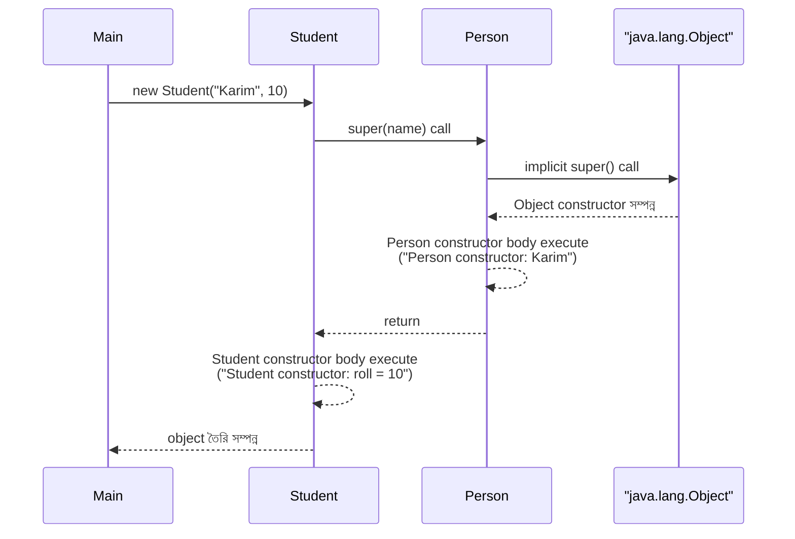
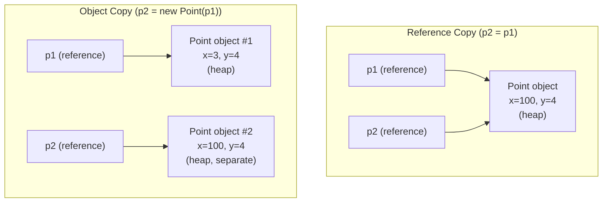
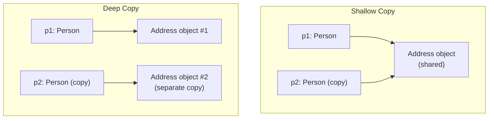
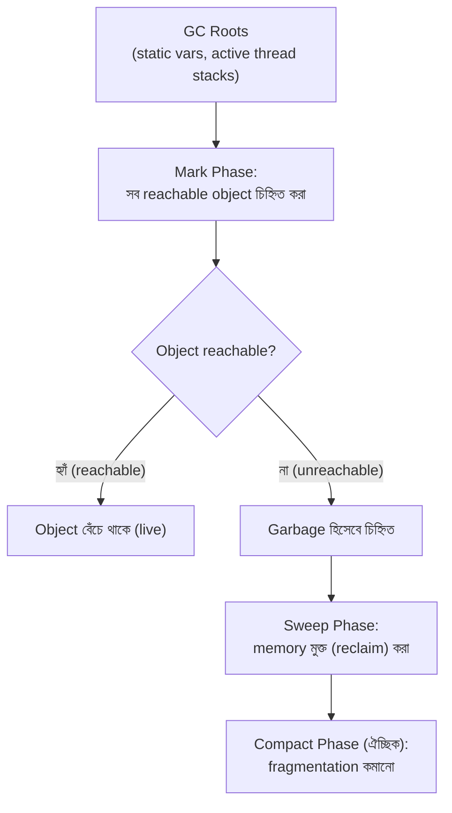
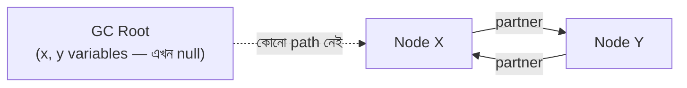
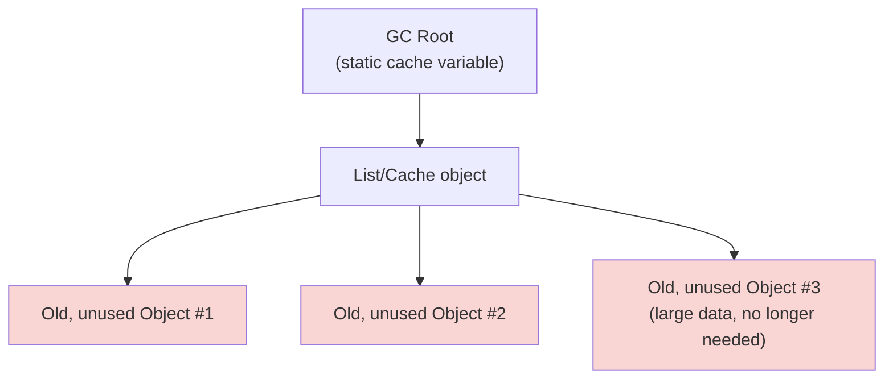

## 43. What is a constructor?

**Constructor** হলো একটি special block/method যা একটি class-এর মধ্যে define করা হয়, এবং এটি **automatically call হয় যখন সেই class-এর একটি নতুন object (instance) তৈরি করা হয় (`new` keyword দিয়ে)**। এর কাজ হলো object-টির **initial state** (fields/attributes-এর প্রাথমিক মান) সেট করে দেওয়া।

Java-তে constructor-এর কিছু বৈশিষ্ট্য:
- Constructor-এর নাম **অবশ্যই class-এর নামের সাথে হুবহু (exactly) মিলতে হবে**।
- এর **কোনো return type নেই**, এমনকি `void`-ও লেখা যায় না।

```java
class Student {
    String name;
    int age;

    // Constructor
    Student(String name, int age) {
        this.name = name;
        this.age = age;
        System.out.println("Student object created!");
    }
}

public class Main {
    public static void main(String[] args) {
        Student s = new Student("Rahim", 20); 
        // Output: Student object created!
    }
}
```

`new Student("Rahim", 20)` লেখার সাথে সাথেই JVM প্রথমে heap-এ memory allocate করে, তারপর constructor call করে fields-গুলো initialize করে দেয়।

### How is a constructor different from a regular method?

| বিষয় | Constructor | Regular Method |
|---|---|---|
| নাম | Class-এর নামের সাথে হুবহু মিলতে হবে | যেকোনো valid identifier হতে পারে |
| Return type | কোনো return type নেই (void-ও না) | অবশ্যই একটি return type থাকবে (`void` সহ) |
| Call হওয়া | শুধু `new` keyword দিয়ে object তৈরি করার সময় automatically call হয় | explicitly, object বা class reference দিয়ে যেকোনো সময় call করা যায় |
| Inheritance | Inherited হয় না | Inherited হতে পারে (এবং override করা যায়) |
| উদ্দেশ্য | Object-এর initial state সেট করা (initialization) | নির্দিষ্ট কোনো কাজ (behavior/logic) সম্পাদন করা |
| Call করার সংখ্যা | Object lifetime-এ শুধু একবার call হয় (object তৈরির সময়) | যতবার ইচ্ছা call করা যায় |
| `this()`/`super()` | constructor-এর প্রথম statement হিসেবে অন্য constructor call করা যায় | এভাবে করা যায় না |

### What is its main purpose?

Constructor-এর প্রধান উদ্দেশ্য হলো:

1. **Object initialization** — object তৈরি হওয়ার সাথে সাথেই তার fields/attributes-এ meaningful, valid initial value সেট করে দেওয়া, যাতে object কখনো **অসামঞ্জস্যপূর্ণ (inconsistent)** বা invalid state-এ না থাকে।
2. **Encapsulation বজায় রাখা** — object তৈরির সময়েই validation logic রাখা যায় (যেমন negative age না নেওয়া)।
3. **Resource setup** — কোনো object তৈরির সময় প্রয়োজনীয় resource (যেমন database connection, file handle) initialize করা।
4. **Guaranteed initialization** — Java নিশ্চিত করে যে object ব্যবহার করার আগে constructor অবশ্যই run হয়ে গেছে, তাই কখনো "uninitialized object" ব্যবহার হওয়ার সুযোগ নেই।

---

## 44. What is a default constructor?

**Default constructor** হলো এমন একটি **no-argument (parameterless) constructor** যা **compiler নিজে থেকে automatically তৈরি করে দেয়**, যদি প্রোগ্রামার নিজে **কোনো constructor একেবারেই define না করে থাকে**।

```java
class Book {
    String title;
    // কোনো constructor লেখা হয়নি
}

public class Main {
    public static void main(String[] args) {
        Book b = new Book(); // compiler-generated default constructor call হচ্ছে
        System.out.println(b.title); // Output: null
    }
}
```

Compiler-এর তৈরি করা default constructor মূলত এরকম দেখতে হয় (bytecode-এ):

```java
Book() {
    super(); // implicitly parent class-এর no-arg constructor call করে
}
```

এটি সব fields-কে তাদের **default value**-এ (যেমন `int` → `0`, `boolean` → `false`, object reference → `null`) সেট করে রাখে (actually এটা JVM object creation-এর সময় automatically হয়, constructor body-এর কারণে না)।

### When is it automatically created?

Compiler default constructor **তখনই** automatically তৈরি করে, যখন:
- একটি class-এ **প্রোগ্রামার নিজে কোনো constructor (parameterized বা no-arg) একেবারেই লিখেননি**।

```java
class Car {
    String model;
    void drive() { System.out.println("Driving " + model); }
    // কোনো constructor নেই -> compiler নিজে default constructor বানিয়ে দেবে
}

Car c = new Car(); // ✅ কাজ করবে, compiler-generated constructor
```

### When might it not be provided?

Compiler default constructor **তৈরি করবে না**, যদি:

1. **প্রোগ্রামার নিজে ইতিমধ্যে অন্তত একটি constructor define করে থাকেন** (parameterized হোক বা no-arg হোক)।

```java
class Car {
    String model;
    Car(String model) {   // programmer-defined parameterized constructor
        this.model = model;
    }
}

Car c1 = new Car("Toyota"); // ✅ ঠিক আছে
// Car c2 = new Car();       // ❌ Compile Error! 
// কারণ programmer একটি constructor define করেছেন, তাই default (no-arg) আর automatically তৈরি হবে না
```

2. যদি একটি class-এর সমস্ত constructor **`private`** হয় (যেমন **Singleton pattern**-এ), তাহলে বাইরে থেকে `new` দিয়ে object তৈরি করা যাবে না, কিন্তু এটা technically "default constructor না থাকা" না, বরং access restriction।

**গুরুত্বপূর্ণ নোট:** যদি parent class-এ কোনো no-argument constructor না থাকে (শুধু parameterized constructor থাকে), তাহলে child class-এর constructor-এ **অবশ্যই explicitly `super(...)` call করতে হবে**, নাহলে compile error আসবে — কারণ child-এর default constructor implicitly `super()` (no-arg) call করার চেষ্টা করে।

---

## 45. What is a parameterized constructor?

**Parameterized constructor** হলো এমন একটি constructor যেটি **এক বা একাধিক parameter (argument)** গ্রহণ করে, যাতে object তৈরি করার সময় প্রোগ্রামার **custom (নির্দিষ্ট) initial value** দিতে পারেন — শুধু default value নির্ভর না করে।

```java
class Rectangle {
    double length;
    double width;

    // Parameterized constructor
    Rectangle(double length, double width) {
        this.length = length;
        this.width = width;
    }

    double area() {
        return length * width;
    }
}

public class Main {
    public static void main(String[] args) {
        Rectangle r = new Rectangle(5.0, 3.0); // custom value দিয়ে object তৈরি
        System.out.println(r.area()); // Output: 15.0
    }
}
```

### What is constructor overloading?

**Constructor overloading** হলো একই class-এ **একাধিক constructor** থাকা, যাদের **parameter list ভিন্ন** (সংখ্যা, type, বা order-এ ভিন্ন) — ঠিক method overloading-এর মতোই নিয়ম প্রযোজ্য (compile-time polymorphism)।

```java
class Rectangle {
    double length;
    double width;

    Rectangle() {                  // no-arg constructor
        this.length = 1.0;
        this.width = 1.0;
    }

    Rectangle(double side) {       // one-arg -> square
        this.length = side;
        this.width = side;
    }

    Rectangle(double length, double width) {  // two-arg -> rectangle
        this.length = length;
        this.width = width;
    }
}

public class Main {
    public static void main(String[] args) {
        Rectangle r1 = new Rectangle();          // 1.0 x 1.0
        Rectangle r2 = new Rectangle(4.0);       // 4.0 x 4.0 (square)
        Rectangle r3 = new Rectangle(5.0, 3.0);  // 5.0 x 3.0
    }
}
```

Constructor overloading-এর সুবিধা হলো — একই class থেকে **বিভিন্নভাবে (flexible ways)** object তৈরি করার সুযোগ দেয়, যা client code-কে আরও সুবিধাজনক করে তোলে।

---

## 46. What is constructor chaining?

**Constructor chaining** হলো একটি constructor থেকে **অন্য একটি constructor-কে call করার প্রক্রিয়া**, যাতে code duplication কমানো যায় এবং initialization logic reuse করা যায়। এটি দুই ধরনের হতে পারে:

1. **একই class-এর অন্য constructor call করা** — `this(...)` keyword দিয়ে।
2. **Parent class-এর constructor call করা** — `super(...)` keyword দিয়ে।

### How does one constructor call another?

**একই class-এর মধ্যে (`this()`)**:

```java
class Employee {
    String name;
    double salary;

    Employee() {
        this("Unknown", 0.0);   // no-arg constructor, one-arg নয়, two-arg constructor কে call করছে
        System.out.println("No-arg constructor called");
    }

    Employee(String name, double salary) {
        this.name = name;
        this.salary = salary;
        System.out.println("Two-arg constructor called");
    }
}

public class Main {
    public static void main(String[] args) {
        Employee e = new Employee();
        // Output:
        // Two-arg constructor called
        // No-arg constructor called
    }
}
```

**নিয়ম:** `this(...)` অথবা `super(...)` — যেকোনো একটি অবশ্যই constructor-এর **প্রথম statement** হতে হবে, এবং একই constructor-এ দুইটাই (this এবং super) একসাথে ব্যবহার করা যাবে না।

**Parent-child class-এর মধ্যে (`super()`)**:

```java
class Person {
    String name;
    Person(String name) {
        this.name = name;
        System.out.println("Person constructor: " + name);
    }
}

class Student extends Person {
    int roll;
    Student(String name, int roll) {
        super(name);   // Parent class-এর constructor call করা হচ্ছে
        this.roll = roll;
        System.out.println("Student constructor: roll = " + roll);
    }
}

public class Main {
    public static void main(String[] args) {
        Student s = new Student("Karim", 10);
        // Output:
        // Person constructor: Karim
        // Student constructor: roll = 10
    }
}
```

**গুরুত্বপূর্ণ:** যদি child class-এর constructor-এ explicitly `super(...)` call করা না হয়, তাহলে Java **implicitly (নিজে থেকে)** parent class-এর **no-argument constructor** call করে দেয় (`super()`, প্রথম statement হিসেবে)। যদি parent class-এ no-arg constructor না থাকে, তাহলে compile error আসবে।

### In what order are parent and child constructors executed?

Constructor execution সবসময় **top-to-bottom (parent থেকে child)** order-এ হয় — অর্থাৎ, **সবচেয়ে উপরের ancestor class-এর constructor সবার আগে সম্পূর্ণভাবে execute হয়**, তারপর ধাপে ধাপে নিচের দিকে child class-এর constructor execute হয়।



**কারণ:** এটি নিশ্চিত করে যে child class initialize হওয়ার আগেই parent class-এর সব fields ও state সঠিকভাবে initialize হয়ে গেছে — কারণ child class প্রায়ই parent-এর fields/behavior-এর উপর নির্ভর করে, তাই আগে parent সম্পূর্ণ প্রস্তুত থাকা জরুরি।

---

## 47. Are constructors inherited or overridden?

**না — Constructor কখনো inherited হয় না, এবং কখনো override করাও যায় না।**

```java
class Parent {
    Parent(int x) {
        System.out.println("Parent constructor: " + x);
    }
}

class Child extends Parent {
    Child(int x) {
        super(x);
        System.out.println("Child constructor: " + x);
    }
    // Parent(int x) constructor -> Child class এ inherit হয় না
    // Child class কে নিজের constructor আলাদাভাবে define করতে হয়
}

public class Main {
    public static void main(String[] args) {
        // Parent p = new Child2(); // এভাবে Parent(int) সরাসরি Child থেকে ব্যবহার করা যাবে না,
        // কারণ Child তা inherit করেনি
    }
}
```

**Constructor overriding** ধারণাটিই ভুল/অপ্রযোজ্য, কারণ:
- Overriding-এর জন্য method-এর নাম একই হতে হয়, কিন্তু constructor-এর নাম **সবসময় নিজের class-এর নাম অনুযায়ী** হয় — তাই parent-এর constructor-এর নাম child-এর constructor-এর নামের সাথে **কখনোই মিলবে না** (কারণ class-এর নামই ভিন্ন)।
- তাই "same signature, different class" — এই শর্তটাই constructor-এর ক্ষেত্রে প্রযোজ্য না।

### Why are constructors treated differently from normal methods?

Constructor-কে ভিন্নভাবে treat করার মূল কারণগুলো:

1. **Constructor object-এর identity-এর সাথে সরাসরি যুক্ত** — এটি নির্দিষ্ট একটি class-এর object কীভাবে তৈরি ও initialize হবে তা নির্ধারণ করে; এটি inherited হলে সাব-ক্লাসের জন্য ভুল ধরনের object তৈরি হওয়ার ঝুঁকি থাকত (যেমন parent-এর constructor child-এর নতুন fields সম্পর্কে জানবে না)।
2. **প্রতিটি class-এর নিজস্ব state আলাদা** — child class-এ নতুন fields যুক্ত হতে পারে, যেগুলো parent-এর constructor জানেই না, তাই parent-এর constructor সরাসরি ব্যবহার করলে child-এর নতুন fields properly initialize নাও হতে পারে।
3. **`super()` মাধ্যমে reuse যথেষ্ট** — Java constructor chaining (`super()`) এর মাধ্যমে parent-এর initialization logic reuse করার সুযোগ দেয়, তাই সরাসরি inheritance-এর দরকার নেই।
4. **নামকরণ regulation (naming rule)** — যেহেতু constructor-এর নাম class-এর নামের সাথে বাঁধা, তাই "inherit" করার ধারণাটাই স্ববিরোধী (contradictory) — একটি `Child` class-এ `Parent()` নামের কোনো method থাকতে পারে না অর্থপূর্ণভাবে।

---

## 48. What is object copying?

**Object copying** হলো একটি বিদ্যমান object-এর মতো **নতুন একটি independent object** তৈরি করার প্রক্রিয়া, যার field values মূল object-এর সমান (একই), কিন্তু এটি memory-তে একটি **আলাদা (separate)** object হিসেবে থাকে।

Java-তে object copying সাধারণত করা হয়:
- `clone()` method ব্যবহার করে (`Cloneable` interface implement করে), অথবা
- একটি **copy constructor** লিখে, অথবা
- manually প্রতিটি field কপি করে একটি নতুন object তৈরি করে।

```java
class Point {
    int x, y;
    Point(int x, int y) {
        this.x = x;
        this.y = y;
    }

    // Copy constructor
    Point(Point other) {
        this.x = other.x;
        this.y = other.y;
    }
}

public class Main {
    public static void main(String[] args) {
        Point p1 = new Point(3, 4);
        Point p2 = new Point(p1); // p1 এর কপি তৈরি হলো, নতুন object

        p2.x = 100;
        System.out.println(p1.x); // Output: 3 (p1 অপরিবর্তিত)
        System.out.println(p2.x); // Output: 100
    }
}
```

### What is the difference between copying an object and copying a reference?

এটি একটি অত্যন্ত গুরুত্বপূর্ণ পার্থক্য — Java-তে সাধারণ assignment (`=`) operator একটি object **কপি করে না**, বরং শুধু **reference (মেমরি address)** কপি করে।

```java
Point p1 = new Point(3, 4);
Point p2 = p1;   // এটি object copy না! শুধু reference কপি হলো

p2.x = 100;
System.out.println(p1.x); // Output: 100 !! p1-ও পরিবর্তিত হয়ে গেছে

System.out.println(p1 == p2); // Output: true, দুইটা reference একই object কে point করছে
```



| বিষয় | Reference Copy (`p2 = p1`) | Object Copy (`new Point(p1)` বা `clone()`) |
|---|---|---|
| Memory-তে object সংখ্যা | একটাই object, দুইটা reference একই object point করে | দুইটা আলাদা (independent) object |
| একটি পরিবর্তন করলে | অন্যটিও প্রভাবিত হয় (কারণ একই object) | অন্যটি প্রভাবিত হয় না (independent) |
| `==` operator result | `true` (একই memory address) | `false` (আলাদা memory address) |
| `.equals()` (যদি override করা থাকে) | `true` | সাধারণত `true` (content একই হলে) |

---

## 49. What is the difference between shallow copy and deep copy?

যখন একটি object copy করা হয় এবং সেই object-এর মধ্যে **অন্য কোনো object-এর reference (mutable field)** থাকে, তখন কপি করার দুইটি পদ্ধতি হতে পারে:

### Shallow Copy

**Shallow copy**-তে মূল object-এর **primitive fields**-এর মান সরাসরি কপি হয়, কিন্তু **reference type fields (nested objects)**-এর ক্ষেত্রে শুধু **reference (address)**-টাই কপি হয় — অন্তর্নিহিত (inner) object-টি কপি হয় না, বরং দুইটি object একই inner object-কে **share** করে।

```java
class Address {
    String city;
    Address(String city) { this.city = city; }
}

class Person implements Cloneable {
    String name;
    Address address;   // reference type field

    Person(String name, Address address) {
        this.name = name;
        this.address = address;
    }

    @Override
    protected Object clone() throws CloneNotSupportedException {
        return super.clone();   // Object.clone() -> shallow copy করে
    }
}

public class Main {
    public static void main(String[] args) throws CloneNotSupportedException {
        Address addr = new Address("Dhaka");
        Person p1 = new Person("Rahim", addr);
        Person p2 = (Person) p1.clone();  // shallow copy

        p2.address.city = "Chittagong";
        System.out.println(p1.address.city); // Output: "Chittagong" !! (p1-ও প্রভাবিত হলো)
    }
}
```

### Deep Copy

**Deep copy**-তে শুধু top-level object-ই না, বরং তার ভিতরের সব **nested (referenced) object-ও পুনরায় (recursively) নতুনভাবে কপি করা হয়** — ফলে দুইটি object সম্পূর্ণ **independent**, কোনো shared reference থাকে না।

```java
class Person implements Cloneable {
    String name;
    Address address;

    Person(String name, Address address) {
        this.name = name;
        this.address = address;
    }

    @Override
    protected Object clone() throws CloneNotSupportedException {
        Person cloned = (Person) super.clone();
        cloned.address = new Address(this.address.city); // nested object টিও নতুনভাবে কপি করা হলো
        return cloned;
    }
}

public class Main {
    public static void main(String[] args) throws CloneNotSupportedException {
        Address addr = new Address("Dhaka");
        Person p1 = new Person("Rahim", addr);
        Person p2 = (Person) p1.clone();  // deep copy

        p2.address.city = "Chittagong";
        System.out.println(p1.address.city); // Output: "Dhaka" (p1 প্রভাবিত হয়নি)
        System.out.println(p2.address.city); // Output: "Chittagong"
    }
}
```



| বিষয় | Shallow Copy | Deep Copy |
|---|---|---|
| Primitive fields | কপি হয় | কপি হয় |
| Reference fields (nested objects) | শুধু reference কপি হয়, object share হয় | Nested object recursively নতুনভাবে কপি হয় |
| Independence | আংশিক independent (nested object shared) | সম্পূর্ণ independent |
| Performance | দ্রুত, কম memory ব্যবহার | তুলনামূলক ধীর, বেশি memory ব্যবহার |
| Default `Object.clone()` | Shallow copy করে | Manually override করতে হয় |

### What problems can shallow copying create with mutable referenced objects?

Shallow copy-এর কারণে যে সমস্যাগুলো হতে পারে:

1. **Unintended side effects (অনিচ্ছাকৃত পরিবর্তন)** — একটি copy-তে nested (mutable) object পরিবর্তন করলে, মূল object-ও (এবং তার সাথে যুক্ত সব অন্য copy-ও) অজান্তেই পরিবর্তিত হয়ে যায়, কারণ তারা সবাই একই inner object share করছে।
2. **Data integrity নষ্ট হওয়া** — যদি একটি object-কে "independent backup" হিসেবে রাখার উদ্দেশ্যে copy করা হয়, কিন্তু shallow copy ব্যবহার করা হয়, তাহলে backup-টি আসলে independent থাকে না — মূল object পরিবর্তিত হলে backup-ও পরিবর্তিত হয়ে যাবে।
3. **Debug করা কঠিন হয়ে যাওয়া** — যেহেতু দুইটি ভিন্ন variable/object দেখতে independent মনে হয়, কিন্তু আসলে shared state আছে, তাই bug খুঁজে বের করা কঠিন হয়ে পড়ে (এক জায়গায় পরিবর্তন করলে অন্য জায়গায় কেন প্রভাব পড়ছে বোঝা যায় না)।
4. **Thread-safety সমস্যা** — multithreaded environment-এ shared mutable nested object-এ race condition তৈরি হতে পারে, যদি একাধিক thread একই সাথে বিভিন্ন "copy" এর মাধ্যমে সেই shared object পরিবর্তন করার চেষ্টা করে।

---

## 50. What is object destruction or resource cleanup?

**Object destruction** হলো একটি object-এর জীবনচক্রের (lifecycle) শেষ ধাপ, যেখানে সেই object আর প্রয়োজন নেই এমন অবস্থায় তার দখলে থাকা **memory এবং অন্যান্য resource** (যেমন file handle, network connection, database connection) মুক্ত (release/free) করে দেওয়া হয়।

কিছু ভাষায় (যেমন C++) এটি explicit **destructor** দিয়ে করা হয় (`~ClassName()`), কিন্তু Java-এর মতো ভাষায় এটি **Garbage Collector (GC)** স্বয়ংক্রিয়ভাবে (automatically) মেমরির ক্ষেত্রে করে দেয় — programmer-কে সাধারণত manually memory free করতে হয় না।

### Why do some languages have destructors while others rely on garbage collection?

| Approach | ভাষা উদাহরণ | কারণ/দর্শন |
|---|---|---|
| **Manual/Destructor-based** | C++, Rust (RAII) | Performance ও predictability-এর উপর সম্পূর্ণ programmer control রাখা — কখন resource release হবে তা exactly জানা যায় (deterministic destruction) |
| **Garbage Collection-based** | Java, Python, C#, Go | Programmer-এর ভুলে হওয়া memory leak এবং dangling pointer-এর মতো সমস্যা কমানো; developer productivity ও safety বাড়ানো |

- **C++**-এর মতো ভাষায় destructor ব্যবহার হয় কারণ সেখানে memory management manual — programmer নিজে `new` দিয়ে allocate করে, তাই `delete` দিয়ে নিজেই free করতে হয়; destructor সেই cleanup logic-এর জায়গা।
- **Java**-এর মতো ভাষায় Garbage Collector ব্যবহার হয় কারণ:
  1. এটি **memory leak** এবং **dangling reference**-এর মতো bug অনেকাংশে কমিয়ে দেয়।
  2. Programmer-কে "কবে/কীভাবে object destroy হবে" তা নিয়ে ভাবতে হয় না — এতে development দ্রুত ও নিরাপদ হয়।
  3. তবে trade-off হলো — GC কখন ঠিক object destroy করবে তা **non-deterministic** (নিশ্চিতভাবে বলা যায় না, ঠিক কোন মুহূর্তে হবে)।

### What resources still require explicit cleanup?

যদিও Java-তে **memory** স্বয়ংক্রিয়ভাবে GC পরিচালনা করে, কিন্তু কিছু resource এমন আছে যেগুলো GC পরিচালনা করে না এবং **explicit (manual) cleanup** দরকার হয়:

1. **File handles / streams** (`FileInputStream`, `FileOutputStream`) — না বন্ধ করলে file lock থেকে যেতে পারে।
2. **Database connections** (JDBC `Connection`, `Statement`, `ResultSet`) — connection pool শেষ হয়ে যেতে পারে।
3. **Network sockets** — port/socket খোলা থেকে যেতে পারে।
4. **Native resources** (JNI-এর মাধ্যমে allocate করা memory) — GC এগুলো জানে না, কারণ এগুলো JVM heap-এর বাইরে।

Java-তে এসব resource properly cleanup করার জন্য ব্যবহার করা হয়:

```java
// try-with-resources (Java 7+) — AutoCloseable resource স্বয়ংক্রিয়ভাবে close হয়ে যায়
try (FileInputStream fis = new FileInputStream("data.txt");
     Connection conn = DriverManager.getConnection(url, user, pass)) {

    // resource ব্যবহার করা হলো
    
} catch (IOException | SQLException e) {
    e.printStackTrace();
}
// try block শেষ হওয়ার সাথে সাথে fis এবং conn স্বয়ংক্রিয়ভাবে close() হয়ে যায়,
// এমনকি exception হলেও
```

**Note:** Java-তে আগে `finalize()` method ছিল (GC destroy করার আগে call হতো), কিন্তু এটি অনির্ভরযোগ্য (unreliable) ও অপ্রত্যাশিত (unpredictable) হওয়ার কারণে **deprecated** করা হয়েছে (Java 9+ থেকে), এবং `try-with-resources` / `AutoCloseable` ব্যবহার করাই recommended।

---

## 51. What is garbage collection?

**Garbage Collection (GC)** হলো একটি **automatic memory management** প্রক্রিয়া, যেখানে runtime environment (যেমন JVM) নিজে থেকেই সেই সব object-এর memory খুঁজে বের করে ও মুক্ত (reclaim) করে দেয়, যেগুলো আর প্রোগ্রামে **reachable (ব্যবহারযোগ্য/accessible) নয়** — অর্থাৎ যাদের কাছে আর কোনো live reference নেই।

```java
public class Main {
    public static void main(String[] args) {
        Student s = new Student("Karim"); // object তৈরি হলো, heap-এ memory allocate হলো
        s = null; // এখন আর কোনো reference নেই এই Student object-এর দিকে
        // এই object টি এখন "garbage" — GC পরবর্তীতে এটি reclaim (মুক্ত) করবে
        System.gc(); // GC কে অনুরোধ (request) করা হচ্ছে, কিন্তু guarantee নেই কখন চলবে
    }
}
```

### How does garbage collection manage object lifecycle?

GC মূলত নিচের ধাপগুলোর মাধ্যমে কাজ করে (JVM-এ সাধারণত **Mark-and-Sweep** বা তার variant algorithm ব্যবহার হয়):

1. **Mark Phase (চিহ্নিতকরণ):** GC **GC Roots** (যেমন static variables, active thread-এর local variables, currently running method-এর stack frame) থেকে শুরু করে, সব **reachable object** খুঁজে বের করে এবং "mark" (চিহ্নিত) করে।
2. **Sweep Phase (পরিষ্কারকরণ):** যেসব object mark হয়নি (অর্থাৎ কোনো reachable path নেই), সেগুলোকে "garbage" হিসেবে চিহ্নিত করে এবং তাদের দখলে থাকা memory মুক্ত করে দেয়।
3. **Compact Phase (ঐচ্ছিক):** কিছু GC algorithm memory fragmentation কমানোর জন্য বেঁচে থাকা object-গুলোকে একসাথে গুছিয়ে (compact করে) রাখে।

Java-তে heap বিভিন্ন **generation**-এ ভাগ করা থাকে (Young Generation, Old/Tenured Generation), এবং GC এই generational hypothesis-এর উপর ভিত্তি করে কাজ করে ("বেশিরভাগ object দ্রুত মারা যায়")।



### Does garbage collection eliminate memory leaks completely?

**না, garbage collection memory leak সম্পূর্ণভাবে দূর করে না।**

GC শুধুমাত্র সেই object-গুলো মুক্ত করে, যেগুলো সত্যিই **unreachable**। কিন্তু যদি একটি object আর প্রয়োজন না থাকা সত্ত্বেও, এখনো **কোনো না কোনো live reference-এর মাধ্যমে reachable থেকে যায়**, তাহলে GC সেটাকে garbage মনে করবে না এবং কখনো মুক্ত করবে না — একে **logical memory leak** বলা হয় (বিস্তারিত প্রশ্ন ৫৩-এ)।

উদাহরণস্বরূপ:
```java
List<Object> cache = new ArrayList<>();

void addToCache(Object obj) {
    cache.add(obj); // object cache list এ যুক্ত হচ্ছে, কিন্তু কখনো remove হচ্ছে না
}
```

এখানে `cache` list-এ যুক্ত হওয়া object-গুলো যদি আর ব্যবহারের প্রয়োজন না থাকে, তারপরও `cache` reference থাকার কারণে GC এগুলো কখনোই reclaim করবে না — এটাই memory leak, যদিও GC সক্রিয় আছে।

---

## 52. What is reference counting?

**Reference counting** হলো memory management-এর একটি পদ্ধতি, যেখানে প্রতিটি object-এর জন্য একটি **counter** রাখা হয়, যেটি বলে দেয় সেই object-কে কতগুলো reference বর্তমানে point করছে। 

- যখন একটি নতুন reference object-টিকে point করে → counter **বৃদ্ধি (increment)** পায়।
- যখন একটি reference মুছে যায়/scope-এর বাইরে চলে যায় → counter **হ্রাস (decrement)** পায়।
- যখন counter **০ (শূন্য)**-তে পৌঁছায়, তার মানে কোনো reference আর নেই — object-টিকে সাথে সাথে মুক্ত (deallocate) করে দেওয়া হয়।

(Java-এর JVM মূলত reference counting ব্যবহার করে না, এটি mark-and-sweep/tracing GC ব্যবহার করে; তবে **Python** (CPython) এবং **Objective-C/Swift (ARC)** reference counting ব্যবহার করে।)

Java-তে concept বোঝার জন্য একটি সরলীকৃত উদাহরণ:

```java
class Node {
    Node next;
}

Node a = new Node();  // Node object তৈরি হলো, reference count = 1 (conceptually)
Node b = a;            // reference count = 2 (দুইটি variable একই object point করছে)
a = null;              // reference count = 1
b = null;              // reference count = 0 -> reference counting system হলে object সাথে সাথেই মুক্ত হতো
```

### How is it different from tracing/mark-and-sweep garbage collection?

| বিষয় | Reference Counting | Tracing (Mark-and-Sweep) GC |
|---|---|---|
| কাজের পদ্ধতি | প্রতিটি object-এর সাথে একটি counter সংযুক্ত থাকে | GC roots থেকে শুরু করে reachability trace/traverse করা হয় |
| Deallocation timing | তাৎক্ষণিক (immediate) — counter 0 হলেই সাথে সাথে মুক্ত হয় | Periodic/batch — GC cycle চলার সময় মুক্ত হয়, deterministic না |
| Overhead | প্রতিটি assignment/reference change-এ counter update করতে হয় (constant overhead) | GC cycle চলার সময় (pause/stop-the-world) বড় overhead হতে পারে |
| Cyclic reference | সমস্যা তৈরি করে (memory leak হতে পারে) | সমস্যা তৈরি করে না (নিচে দেখুন) |
| উদাহরণ ভাষা | Python (CPython), Swift (ARC), Objective-C | Java (JVM), .NET (CLR), Go |

### What problem can cyclic references create?

**Cyclic reference (চক্রাকার reference)** হয় যখন দুই বা ততোধিক object একে অপরকে (সরাসরি বা পরোক্ষভাবে) reference করে, একটি চক্র (cycle) তৈরি করে — এমনকি যদি এই পুরো group-টি বাইরের কোথাও থেকে আর reachable না-ও থাকে।

```java
class Node {
    Node partner;
}

Node x = new Node();
Node y = new Node();
x.partner = y;  // x -> y
y.partner = x;  // y -> x (cycle তৈরি হলো)

x = null;
y = null;
// x এবং y variable আর কিছুকে point করছে না,
// কিন্তু x এর object এবং y এর object এখনো একে অপরকে point করছে (cycle)
```

**সমস্যা (pure reference counting system-এ):**
- `x`-এর object-এর reference count কখনো ০ হবে না, কারণ `y`-এর object এখনো সেটাকে point করছে।
- একইভাবে `y`-এর object-এর reference count-ও ০ হবে না, কারণ `x`-এর object সেটাকে point করছে।
- ফলে যদিও বাইরের জগত থেকে (`x`, `y` variable null হয়ে যাওয়ার পর) এই দুইটি object আর কখনো ব্যবহার করা সম্ভব না, তারপরও pure reference-counting system এদের কখনো মুক্ত (deallocate) করবে না — এটি একটি **memory leak**।

**সমাধান:** এই সমস্যা এড়াতে ব্যবহার করা হয় **weak references** (যেমন Python-এর `weakref`, Java-তে `WeakReference`), অথবা **hybrid approach** (reference counting + periodic cycle-detecting GC, যেমন Python আসলে ব্যবহার করে)। Java-এর tracing GC এই সমস্যায় ভোগে না, কারণ এটি "counter" দেখে না, বরং GC roots থেকে **সত্যিকারের reachability** trace করে — cycle থাকলেও যদি বাইরের কোনো root থেকে সেই cycle-এ পৌঁছানো না যায়, পুরো cycle-টাকেই garbage হিসেবে সঠিকভাবে সনাক্ত করে মুক্ত করে দেয়।



---

## 53. How can memory leaks occur in garbage-collected languages?

যদিও Java-এর মতো garbage-collected ভাষায় **automatic memory management** থাকে, তারপরও **memory leak** ঘটতে পারে। এখানে "leak" মানে C++-এর মতো literal "memory কখনো free না হওয়া" না, বরং **logical memory leak** — যেখানে object-গুলো technically reachable, কিন্তু programmer-এর দৃষ্টিতে সেগুলো আর প্রয়োজন নেই।

সাধারণ কারণগুলো:

1. **Unbounded caches/collections** — একটি `List`, `Map`, বা অন্য collection-এ object যোগ করা হচ্ছে কিন্তু কখনো remove করা হচ্ছে না।
   ```java
   static List<byte[]> cache = new ArrayList<>();
   void process(byte[] data) {
       cache.add(data); // কখনো remove হয় না -> ক্রমাগত memory বাড়তে থাকবে
   }
   ```

2. **Static fields long-lived object ধরে রাখা** — `static` field-এর lifetime পুরো application-এর সমান, তাই এতে কোনো object রাখলে সেটা কখনো GC হবে না যতক্ষণ না explicitly `null` করা হয়।

3. **Unclosed resources / registered listeners** — event listener, observer pattern-এ registration করার পর unregister না করলে, listener object (এবং তার সাথে যুক্ত পুরো object graph) reachable থেকে যায়।
   ```java
   button.addActionListener(myListener); // পরে removeActionListener() না করলে leak হতে পারে
   ```

4. **Inner class-এর implicit reference** — Java-তে non-static (inner) class স্বয়ংক্রিয়ভাবে তার enclosing (outer) class-এর একটি reference ধরে রাখে। যদি inner class instance দীর্ঘদিন বেঁচে থাকে (যেমন একটি thread বা callback-এ), তাহলে পুরো outer object-ও unintentionally reachable থেকে যায়।

5. **ThreadLocal ভুলভাবে ব্যবহার করা** — `ThreadLocal` variable clear (remove) না করলে, thread pool-এর মতো long-lived thread-এর সাথে data আটকে থেকে যেতে পারে।

### What does it mean for an unnecessary object to remain reachable?

**"Unnecessary object remains reachable"** মানে হলো — একটি object, যেটা programmer-এর দৃষ্টিতে (logically) আর কোনো কাজে লাগবে না, তারপরও প্রোগ্রামের **object graph**-এ (GC roots থেকে শুরু করে) এখনো একটি valid reference chain (path) দিয়ে সেটাতে পৌঁছানো সম্ভব — এবং যতক্ষণ এই path বিদ্যমান থাকবে, ততক্ষণ **GC সেটাকে "garbage" মনে করবে না**, কারণ GC শুধু **reachability** (পৌঁছানো যায় কিনা) দেখে, প্রোগ্রামের **business logic** বা "প্রয়োজনীয়তা" বোঝে না।



উপরের diagram-এ, `O1`, `O2`, `O3` — এই object-গুলো programmer-এর মতে "dead" (আর দরকার নেই), কিন্তু যেহেতু `Root` থেকে `List`-এর মাধ্যমে এখনো একটি reachable path আছে, GC এগুলোকে **live** হিসেবেই গণ্য করবে এবং কখনো reclaim করবে না — এভাবেই garbage-collected ভাষাতেও ধীরে ধীরে memory leak হয়ে **`OutOfMemoryError`**-এর মতো সমস্যা তৈরি হতে পারে।

**সমাধান:** যখন কোনো object আর দরকার নেই, তখন সেই reference explicitly সরিয়ে দেওয়া (`list.remove(...)`, `map.clear()`, `reference = null`), অথবা প্রয়োজনে **`WeakReference`/`SoftReference`** ব্যবহার করা, যাতে GC প্রয়োজন হলে সেই object reclaim করতে পারে।
