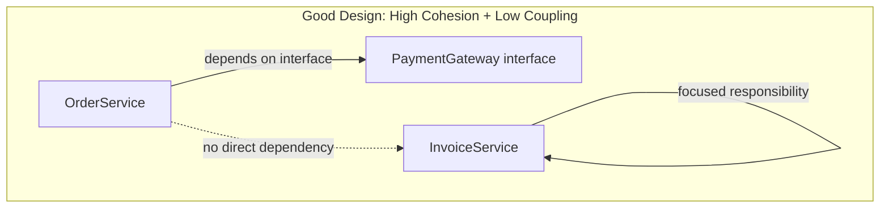
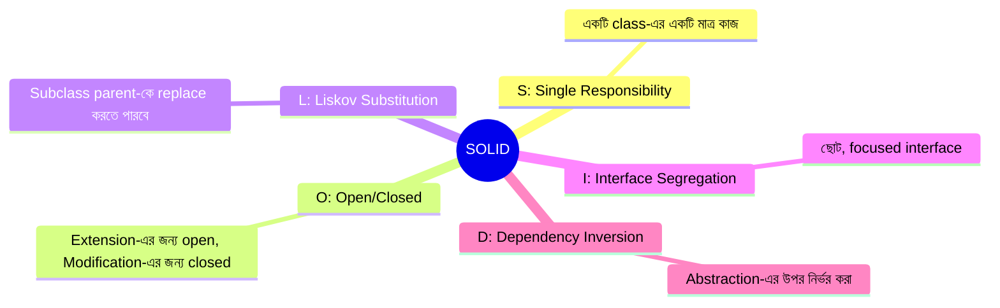
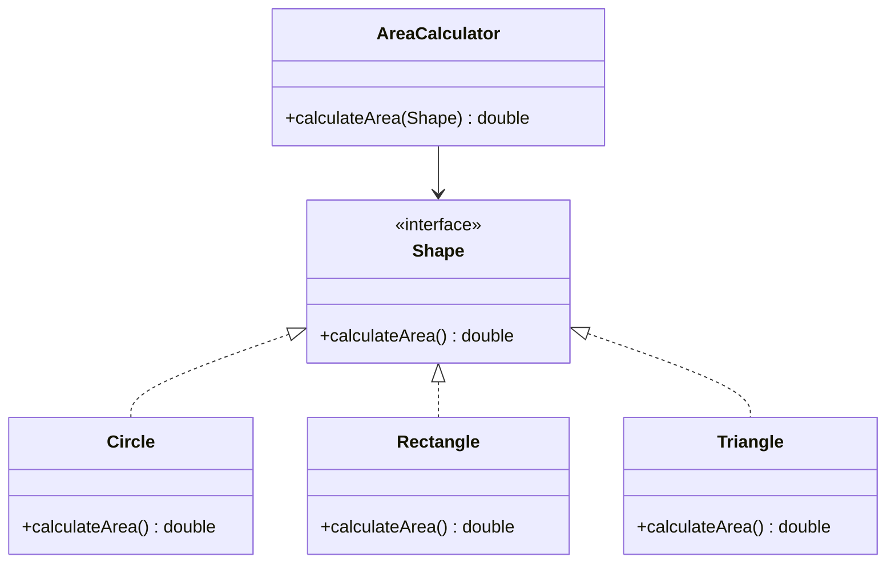
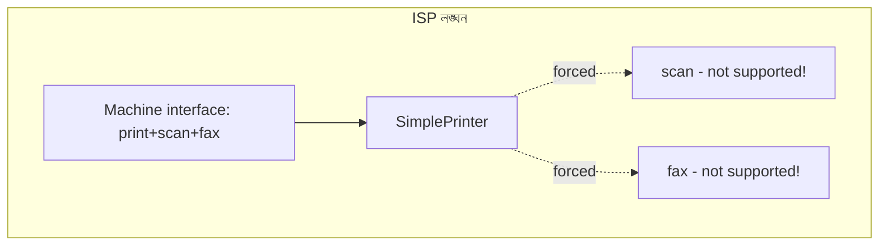
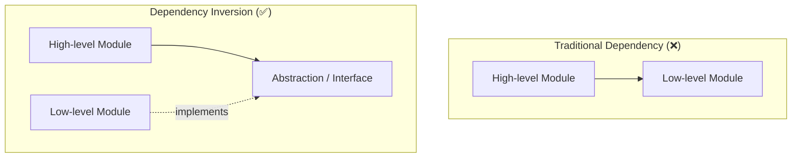
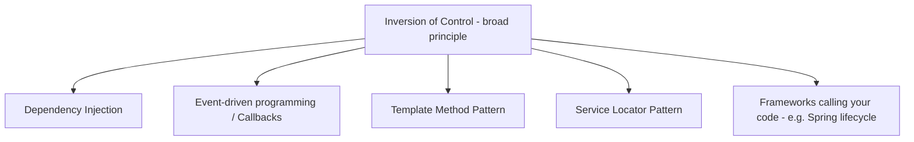

---
sidebar_position: 6
title: 'SOLID'
---

# 6. Good OOP Design and SOLID

## 54. What is coupling?

**Coupling** হলো একটি measurement, যা বলে দেয় একটি module, class, বা component অন্য একটি module/class-এর উপর **কতটা নির্ভরশীল**। অর্থাৎ, একটি class পরিবর্তন করলে অন্য class-এ কতটুকু প্রভাব পড়বে, সেটাই হলো coupling-এর পরিমাপ। Coupling যত বেশি, দুটি component তত বেশি একে অপরের সাথে জড়িয়ে থাকে।

```java
// Tightly coupled example
class Engine {
    void start() {
        System.out.println("Engine চালু হচ্ছে...");
    }
}

class Car {
    private Engine engine = new Engine(); // সরাসরি dependency তৈরি করা হচ্ছে

    void drive() {
        engine.start();
        System.out.println("গাড়ি চলছে...");
    }
}
```

এখানে `Car` class সরাসরি `Engine` class-এর concrete implementation তৈরি করছে (`new Engine()`), তাই এই দুটি class একে অপরের সাথে tightly coupled।

### What is the difference between tight coupling and loose coupling?

| বিষয় | Tight Coupling | Loose Coupling |
|---|---|---|
| Dependency | একটি class সরাসরি অন্য class-এর concrete implementation-এর উপর নির্ভরশীল | একটি class abstraction (interface/abstract class)-এর উপর নির্ভরশীল, concrete implementation-এর উপর নয় |
| Flexibility | Implementation পরিবর্তন করলে অন্য class-এও পরিবর্তন লাগতে পারে | Implementation পরিবর্তন করলেও client code অপরিবর্তিত থাকে |
| Testability | Unit test করা কঠিন, কারণ real dependency দরকার হয় | Mock/stub ব্যবহার করে সহজে test করা যায় |
| উদাহরণ | `Engine engine = new Engine();` | `Engine engine;` (constructor বা setter দিয়ে inject করা হয়, interface-এর মাধ্যমে) |

```java
// Loosely coupled example (Dependency Inversion ব্যবহার করে)
interface Engine {
    void start();
}

class PetrolEngine implements Engine {
    @Override
    public void start() {
        System.out.println("Petrol Engine চালু হচ্ছে...");
    }
}

class ElectricEngine implements Engine {
    @Override
    public void start() {
        System.out.println("Electric Engine চালু হচ্ছে...");
    }
}

class Car {
    private final Engine engine;

    // dependency বাইরে থেকে inject করা হচ্ছে — abstraction-এর উপর নির্ভরশীল
    public Car(Engine engine) {
        this.engine = engine;
    }

    void drive() {
        engine.start();
        System.out.println("গাড়ি চলছে...");
    }
}
```

এখানে `Car` class কোনো নির্দিষ্ট `Engine` implementation-এর উপর নির্ভরশীল নয় — `PetrolEngine`, `ElectricEngine`, বা future-এ যেকোনো নতুন `Engine` implementation ব্যবহার করা যাবে, `Car` class-এ কোনো পরিবর্তন ছাড়াই।

### Why is loose coupling usually preferred?

Loose coupling সাধারণত preferred, কারণ এটি নিচের সুবিধাগুলো প্রদান করে:

1. **Maintainability** — একটি class পরিবর্তন করলে অন্য class-এ break হওয়ার ঝুঁকি কম থাকে।
2. **Testability** — dependency-কে mock বা stub দিয়ে replace করে সহজে unit test লেখা যায়।
3. **Flexibility ও extensibility** — নতুন implementation যোগ করা সহজ, existing code পরিবর্তন করার প্রয়োজন হয় না (Open/Closed Principle-এর সাথে সম্পর্কিত)।
4. **Reusability** — loosely coupled component গুলো অন্য context-এও পুনরায় ব্যবহার করা সহজ হয়, কারণ সেগুলো specific implementation-এর সাথে বাঁধা নয়।
5. **Parallel development** — যেহেতু module গুলো একে অপরের উপর কম নির্ভরশীল, ভিন্ন ভিন্ন team একসাথে আলাদা module-এ কাজ করতে পারে।

---

## 55. What is cohesion?

**Cohesion** হলো একটি measurement, যা বলে দেয় একটি class বা module-এর ভিতরের elements (fields, methods) একে অপরের সাথে **কতটা সম্পর্কিত এবং একই উদ্দেশ্যে কাজ করছে**। উচ্চ cohesion মানে হলো class-এর সব কিছু একটি single, well-defined উদ্দেশ্য পূরণে কাজ করছে।

```java
// High cohesion — সব method একই উদ্দেশ্যে (invoice সংক্রান্ত কাজ) কেন্দ্রীভূত
class InvoiceCalculator {
    private List<Double> itemPrices;

    double calculateSubtotal() { /* ... */ return 0; }
    double calculateTax(double subtotal) { /* ... */ return 0; }
    double calculateTotal() { /* ... */ return 0; }
}
```

### What is the difference between high cohesion and low cohesion?

| বিষয় | High Cohesion | Low Cohesion |
|---|---|---|
| Responsibility | একটি class শুধুমাত্র একটি single, well-defined কাজ করে | একটি class একাধিক অসম্পর্কিত কাজ একসাথে করে |
| Readability | Code বোঝা সহজ, কারণ সব কিছু একই purpose-এর সাথে সম্পর্কিত | Code বোঝা কঠিন, কারণ বিভিন্ন ধরনের কাজ মিশে থাকে |
| Maintainability | Change করা সহজ, কারণ প্রভাব সীমিত থাকে | Change করলে অপ্রত্যাশিত জায়গায় প্রভাব পড়তে পারে |
| Reusability | সহজেই আলাদা context-এ reuse করা যায় | Reuse করা কঠিন, কারণ অপ্রয়োজনীয় functionality জড়িয়ে থাকে |

```java
// Low cohesion — একটি class-এর মধ্যে সম্পূর্ণ ভিন্ন ধরনের দায়িত্ব মিশে আছে
class UserManager {
    void createUser(String name) { /* user তৈরি করা */ }
    void sendEmail(String to, String message) { /* email পাঠানো — unrelated দায়িত্ব */ }
    void generatePdfReport() { /* PDF তৈরি করা — আরও একটি unrelated দায়িত্ব */ }
    void connectToDatabase() { /* DB connection — আরও একটি unrelated দায়িত্ব */ }
}
```

এখানে `UserManager` class-এ user management, email sending, PDF generation, এবং database connection — সম্পূর্ণ ভিন্ন ভিন্ন দায়িত্ব একসাথে মিশে আছে, যা low cohesion-এর একটি ক্লাসিক উদাহরণ।

### Why should a class have a focused responsibility?

একটি class-এর একটি focused (কেন্দ্রীভূত) responsibility থাকা উচিত, কারণ:

1. **সহজে বোঝা যায়** — class-এর নাম দেখেই তার কাজ বোঝা যায়, এবং internal logic follow করা সহজ হয়।
2. **Change-এর প্রভাব সীমিত থাকে** — যদি email পাঠানোর logic পরিবর্তন করতে হয়, তাহলে শুধু email-সম্পর্কিত class পরিবর্তন করলেই হয়, user creation বা report generation-এর কোনো ঝুঁকি থাকে না।
3. **Testing সহজ হয়** — একটি নির্দিষ্ট দায়িত্বের জন্য focused unit test লেখা সহজ, কারণ setup ও mocking কম জটিল হয়।
4. **Single Responsibility Principle মেনে চলা যায়** — high cohesion মূলত SRP-এর একটি প্রকাশ, যা পরবর্তীতে বিস্তারিত আলোচনা করা হবে।

---

## 56. Why do good OOP designs usually aim for high cohesion and low coupling?

ভালো OOP design সবসময় **high cohesion** এবং **low coupling**-কে target করে, কারণ এই দুটি quality একসাথে একটি maintainable, flexible, এবং scalable system তৈরি করতে সাহায্য করে।



- **High cohesion** নিশ্চিত করে যে প্রতিটি class একটি নির্দিষ্ট, well-defined কাজ করছে — এতে code organize করা এবং বোঝা সহজ হয়।
- **Low coupling** নিশ্চিত করে যে class গুলোর মধ্যে dependency ন্যূনতম রাখা হয়েছে — এতে একটি class পরিবর্তন করলে পুরো system ভেঙে পড়ার ঝুঁকি কমে যায়।

এই দুটি একসাথে কাজ করে নিচের সুবিধা দেয়:

1. **Maintainability** — বাগ ফিক্স করা বা নতুন feature যোগ করা সহজ হয়, কারণ পরিবর্তনের প্রভাব সীমিত এবং predictable।
2. **Testability** — focused, loosely coupled class গুলো individual ভাবে test করা সহজ।
3. **Scalability** — team বড় হলেও বিভিন্ন developer বিভিন্ন module-এ স্বাধীনভাবে কাজ করতে পারে, কারণ module গুলো একে অপরের উপর কম নির্ভরশীল।
4. **Reusability** — high cohesion থাকা class সহজেই অন্য project বা context-এ পুনরায় ব্যবহার করা যায়, কারণ এর দায়িত্ব সুনির্দিষ্ট এবং self-contained।

সংক্ষেপে: **high cohesion internal organization ভালো রাখে, আর low coupling external dependency কমিয়ে system-কে flexible রাখে** — একসাথে এই দুটি একটি robust software architecture-এর ভিত্তি তৈরি করে।

---

## 57. What does SOLID stand for?

**SOLID** হলো পাঁচটি OOP design principle-এর সংক্ষিপ্ত রূপ, যেগুলো Robert C. Martin (Uncle Bob) দ্বারা জনপ্রিয় হয়েছে। এই principle গুলো maintainable, flexible, এবং scalable software design তৈরি করতে সাহায্য করে।

| Letter | Principle |
|---|---|
| **S** | Single Responsibility Principle (SRP) |
| **O** | Open/Closed Principle (OCP) |
| **L** | Liskov Substitution Principle (LSP) |
| **I** | Interface Segregation Principle (ISP) |
| **D** | Dependency Inversion Principle (DIP) |



### Why are SOLID principles important?

SOLID principle গুরুত্বপূর্ণ কারণ এগুলো:

1. **Code maintainability বাড়ায়** — সময়ের সাথে সাথে software-এ পরিবর্তন করা সহজ হয়, কারণ code well-organized এবং predictable থাকে।
2. **Technical debt কমায়** — খারাপভাবে design করা code দ্রুত জটিল ও ভঙ্গুর (fragile) হয়ে যায়; SOLID এই সমস্যা প্রতিরোধ করে।
3. **Testability বাড়ায়** — loosely coupled, single-responsibility class গুলো unit test করা সহজ।
4. **Team collaboration সহজ করে** — clear responsibility এবং abstraction থাকায় একাধিক developer একসাথে কাজ করতে পারে conflict ছাড়াই।
5. **Scalability সমর্থন করে** — নতুন feature যোগ করার সময় existing code ভাঙার ঝুঁকি কম থাকে।

### Are SOLID principles strict rules or guidelines?

SOLID principle গুলো **strict, absolute rule নয় — বরং guideline বা best practice**, যেগুলো context অনুযায়ী প্রয়োগ করতে হয়। এগুলো অন্ধভাবে সবসময় অনুসরণ করলে অতিরিক্ত complexity (over-engineering) তৈরি হতে পারে।

- ছোট, simple script বা প্রোটোটাইপ প্রজেক্টে সব SOLID principle কঠোরভাবে মেনে চলা প্রয়োজনীয়তার চেয়ে বেশি overhead তৈরি করতে পারে।
- বড়, দীর্ঘমেয়াদী, বহু-developer প্রজেক্টে SOLID মেনে চলা অনেক বেশি মূল্যবান, কারণ এটি ভবিষ্যতের পরিবর্তন সহজ করে দেয়।
- একজন অভিজ্ঞ developer বুঝে-শুনে সিদ্ধান্ত নেন কোথায় কতটা কঠোরভাবে এই principle প্রয়োগ করা দরকার — **"principle-কে understand করা, dogmatically follow করা নয়"** — এটাই সঠিক approach।

---

## 58. What is the Single Responsibility Principle?

**Single Responsibility Principle (SRP)** বলে: **"A class should have only one reason to change"** — অর্থাৎ, একটি class-এর শুধুমাত্র একটি responsibility বা কাজ থাকা উচিত, এবং সেই একটি কারণেই কেবল class-টি পরিবর্তিত হওয়া উচিত।

```java
// SRP লঙ্ঘন — একাধিক দায়িত্ব একসাথে
class Invoice {
    private List<String> items;

    double calculateTotal() {
        // business logic
        return 0;
    }

    void saveToDatabase() {
        // persistence logic — আলাদা দায়িত্ব!
        System.out.println("Database-এ save করা হচ্ছে...");
    }

    void printInvoice() {
        // presentation logic — আরও একটি আলাদা দায়িত্ব!
        System.out.println("Invoice প্রিন্ট করা হচ্ছে...");
    }
}
```

```java
// SRP মেনে চলা — প্রতিটি class-এর একটি মাত্র দায়িত্ব
class Invoice {
    private List<String> items;

    double calculateTotal() {
        // শুধুমাত্র business logic
        return 0;
    }
}

class InvoiceRepository {
    void save(Invoice invoice) {
        System.out.println("Database-এ save করা হচ্ছে...");
    }
}

class InvoicePrinter {
    void print(Invoice invoice) {
        System.out.println("Invoice প্রিন্ট করা হচ্ছে...");
    }
}
```

এখানে `Invoice` class শুধু business calculation-এর দায়িত্বে থাকে, `InvoiceRepository` persistence-এর দায়িত্বে, এবং `InvoicePrinter` presentation-এর দায়িত্বে — প্রতিটি class-এর একটি single, স্পষ্ট দায়িত্ব।

### What does "one reason to change" mean?

"One reason to change" মানে হলো — একটি class শুধুমাত্র **একটি নির্দিষ্ট stakeholder বা business concern**-এর প্রয়োজনে পরিবর্তিত হবে। যদি একটি class একাধিক কারণে পরিবর্তন হতে পারে (যেমন business logic বদলালে, database schema বদলালে, অথবা UI format বদলালে — সবগুলোই একই class-এ প্রভাব ফেলে), তাহলে সেটি SRP লঙ্ঘন করছে।

উপরের প্রথম উদাহরণে, `Invoice` class তিনটি ভিন্ন কারণে পরিবর্তন হতে পারতো:
1. Invoice calculation logic পরিবর্তন হলে (business concern)।
2. Database technology পরিবর্তন হলে (persistence concern)।
3. Print format পরিবর্তন হলে (presentation concern)।

এই তিনটি সম্পূর্ণ আলাদা কারণ, তাই তাদের আলাদা class-এ ভাগ করাই SRP-এর মূল ধারণা।

### How do you identify a class that violates SRP?

একটি class SRP লঙ্ঘন করছে কিনা তা চেনার কিছু সাধারণ signal:

1. **Class-এর নাম generic বা vague** — যেমন `Manager`, `Handler`, `Processor`, `Utility` — এই ধরনের নাম প্রায়ই ইঙ্গিত দেয় যে class-টি বহুবিধ দায়িত্ব বহন করছে।
2. **Method গুলো সম্পূর্ণ ভিন্ন ধরনের কাজ করছে** — যেমন একই class-এ database access, business logic, এবং UI rendering একসাথে থাকা।
3. **অনেক বেশি import/dependency** — একটি class যদি অনেকগুলো unrelated library বা module import করে, এটি সম্ভবত বেশি দায়িত্ব বহন করছে।
4. **পরিবর্তনের কারণ জিজ্ঞাসা করা** — নিজেকে প্রশ্ন করুন: "এই class পরিবর্তন করার কতগুলো সম্ভাব্য কারণ আছে?" যদি উত্তর একের বেশি হয়, তাহলে সম্ভবত SRP লঙ্ঘন হচ্ছে।
5. **Test লেখা কঠিন হয়ে যাওয়া** — যদি একটি class-এর unit test লিখতে অনেক ধরনের mock/setup দরকার হয়, এটি একটি সংকেত যে class-টি অতিরিক্ত দায়িত্ব বহন করছে।

---

## 59. What is the Open/Closed Principle?

**Open/Closed Principle (OCP)** বলে: **"Software entities (class, module, function) should be open for extension, but closed for modification"** — অর্থাৎ, নতুন functionality যোগ করতে হলে existing, tested code পরিবর্তন না করে, বরং নতুন code যোগ করেই সেই কাজ করা উচিত।

```java
// OCP লঙ্ঘন — নতুন shape যোগ করতে হলে এই method পরিবর্তন করতে হবে
class AreaCalculator {
    double calculateArea(Object shape) {
        if (shape instanceof Circle) {
            Circle c = (Circle) shape;
            return Math.PI * c.radius * c.radius;
        } else if (shape instanceof Rectangle) {
            Rectangle r = (Rectangle) shape;
            return r.length * r.width;
        }
        // নতুন shape যোগ করতে হলে এখানে আরেকটি else-if লিখতে হবে — modification প্রয়োজন!
        return 0;
    }
}
```

```java
// OCP মেনে চলা — polymorphism ব্যবহার করে extension সম্ভব, modification ছাড়াই
interface Shape {
    double calculateArea();
}

class Circle implements Shape {
    private final double radius;
    Circle(double radius) { this.radius = radius; }

    @Override
    public double calculateArea() {
        return Math.PI * radius * radius;
    }
}

class Rectangle implements Shape {
    private final double length, width;
    Rectangle(double length, double width) {
        this.length = length;
        this.width = width;
    }

    @Override
    public double calculateArea() {
        return length * width;
    }
}

// নতুন shape (যেমন Triangle) যোগ করতে হলে শুধু নতুন class লিখলেই হবে
class Triangle implements Shape {
    private final double base, height;
    Triangle(double base, double height) {
        this.base = base;
        this.height = height;
    }

    @Override
    public double calculateArea() {
        return 0.5 * base * height;
    }
}

class AreaCalculator {
    double calculateArea(Shape shape) {
        return shape.calculateArea(); // কোনো পরিবর্তনের প্রয়োজন নেই!
    }
}
```

### What does "open for extension but closed for modification" mean?

- **"Open for extension"** মানে হলো — একটি class/module-এর behavior বাড়ানো (নতুন functionality যোগ করা) সম্ভব হতে হবে।
- **"Closed for modification"** মানে হলো — সেই behavior বাড়াতে existing, ইতিমধ্যে test করা এবং কাজ করা source code পরিবর্তন করতে হবে না।

মূল উদ্দেশ্য হলো: নতুন feature/requirement আসলে, আমরা **নতুন code যোগ করবো** (নতুন class লিখে), কিন্তু **পুরনো, working code স্পর্শ করবো না**। এতে existing functionality ভেঙে যাওয়ার ঝুঁকি (regression bug) কমে যায়।

### How does polymorphism help achieve OCP?

**Polymorphism** OCP achieve করার প্রধান হাতিয়ার। এটি এভাবে কাজ করে:

1. একটি common interface বা abstract class define করা হয়, যা "what" (contract) নির্ধারণ করে।
2. প্রতিটি নির্দিষ্ট behavior একটি আলাদা concrete class-এ implement করা হয়, যা সেই interface/abstract class-কে override বা implement করে।
3. Client code (উদাহরণে `AreaCalculator`) শুধু abstraction (`Shape` interface)-এর সাথে কাজ করে, তাই নতুন concrete implementation (`Triangle`) যোগ করলেও client code পরিবর্তনের প্রয়োজন হয় না — runtime polymorphism (dynamic method dispatch) স্বয়ংক্রিয়ভাবে সঠিক implementation call করে।



এইভাবে polymorphism ব্যবহার করে, `AreaCalculator` class **closed for modification** থাকে (এটি কখনো পরিবর্তন করতে হয় না), অথচ system **open for extension** থাকে (নতুন `Shape` implementation যোগ করা যায় যেকোনো সময়)।

---

## 60. What is the Liskov Substitution Principle?

**Liskov Substitution Principle (LSP)**, Barbara Liskov দ্বারা প্রবর্তিত, বলে: **"Objects of a superclass should be replaceable with objects of a subclass without breaking the correctness of the program"** — অর্থাৎ, যদি `S`, `T`-এর একটি subtype হয়, তাহলে প্রোগ্রামের যেকোনো জায়গায় `T`-type object-কে `S`-type object দিয়ে replace করলেও প্রোগ্রামের সঠিকতা (correctness) বজায় থাকতে হবে।

### What does substitutability mean?

Substitutability মানে হলো — একটি subclass তার parent class-এর জায়গায় ব্যবহার করলে, client code-এ কোনো অপ্রত্যাশিত behavior বা error দেখা দেওয়া উচিত নয়। Subclass-কে অবশ্যই:

1. Parent class-এর **contract (pre-condition, post-condition, invariant)** মেনে চলতে হবে।
2. Method-এর **pre-condition** শক্তিশালী (strengthen) করা যাবে না (client-এর জন্য নতুন restriction যোগ করা যাবে না)।
3. Method-এর **post-condition** দুর্বল (weaken) করা যাবে না (client-এর প্রত্যাশিত result দিতে ব্যর্থ হওয়া যাবে না)।
4. Parent class-এর behavior-এর সাথে সামঞ্জস্যপূর্ণ (consistent) আচরণ করতে হবে, অপ্রত্যাশিত exception ছোঁড়া যাবে না।

### Why is the Square/Rectangle example commonly used to explain LSP?

Square/Rectangle সমস্যা LSP violation-এর একটি ক্লাসিক এবং সহজবোধ্য উদাহরণ, কারণ গাণিতিকভাবে "a square is a rectangle" সত্য মনে হলেও, OOP behavior-এর দিক থেকে এটি সমস্যা তৈরি করে।

```java
class Rectangle {
    protected int width;
    protected int height;

    void setWidth(int width) {
        this.width = width;
    }

    void setHeight(int height) {
        this.height = height;
    }

    int getArea() {
        return width * height;
    }
}

// Square-কে Rectangle-এর subclass বানানো হলো, কারণ গাণিতিকভাবে square একটি বিশেষ rectangle
class Square extends Rectangle {
    @Override
    void setWidth(int width) {
        this.width = width;
        this.height = width; // square-এর জন্য height-ও পরিবর্তন করতে হয়, invariant বজায় রাখতে
    }

    @Override
    void setHeight(int height) {
        this.height = height;
        this.width = height;
    }
}
```

```java
public class Main {
    static void testRectangle(Rectangle r) {
        r.setWidth(5);
        r.setHeight(10);
        // Rectangle-এর জন্য প্রত্যাশিত area = 5 * 10 = 50
        System.out.println("Expected area: 50, Actual area: " + r.getArea());
    }

    public static void main(String[] args) {
        Rectangle rectangle = new Rectangle();
        testRectangle(rectangle); // ঠিকভাবে কাজ করে: 50

        Rectangle square = new Square();
        testRectangle(square); // ❌ ভুল result দেয়: 100 (কারণ height set করলে width-ও বদলে যায়)
    }
}
```

এখানে `Square`, `Rectangle`-এর জায়গায় ব্যবহার করলে (substitute করলে) প্রোগ্রামের প্রত্যাশিত behavior ভেঙে যাচ্ছে — `setHeight()` call করলে `width`-ও পরিবর্তিত হয়ে যাচ্ছে, যা `Rectangle`-এর client code প্রত্যাশা করেনি। এটাই **LSP violation** — যদিও গাণিতিক দিক থেকে "square is-a rectangle" সত্য, প্রোগ্রামিং behavior-এর দিক থেকে `Square`, `Rectangle`-এর সাথে substitutable নয়।

এই উদাহরণটি জনপ্রিয় হওয়ার কারণ এটি স্পষ্টভাবে দেখায় যে — **inheritance hierarchy শুধু বাস্তব-জগতের "is-a" সম্পর্কের উপর ভিত্তি করে design করা উচিত নয়, বরং behavior-এর সামঞ্জস্যতার (behavioral consistency) উপর ভিত্তি করে design করা উচিত।**

---

## 61. What is the Interface Segregation Principle?

**Interface Segregation Principle (ISP)** বলে: **"Clients should not be forced to depend on methods/interfaces they do not use"** — অর্থাৎ, একটি বড়, সাধারণ (general-purpose) interface-এর বদলে, একাধিক ছোট, নির্দিষ্ট (specific) interface তৈরি করা উচিত, যাতে client class শুধুমাত্র তার প্রয়োজনীয় method-এর উপর নির্ভরশীল থাকে।

```java
// ISP লঙ্ঘন — একটি বড় interface, যেখানে সব ধরনের printer-এর জন্য প্রয়োজনীয় নয় এমন method-ও আছে
interface Machine {
    void print(String document);
    void scan(String document);
    void fax(String document);
}

// শুধুমাত্র printing capability আছে এমন একটি সাধারণ printer, কিন্তু scan/fax implement করতে বাধ্য
class SimplePrinter implements Machine {
    @Override
    public void print(String document) {
        System.out.println("প্রিন্ট করা হচ্ছে: " + document);
    }

    @Override
    public void scan(String document) {
        throw new UnsupportedOperationException("এই printer scan করতে পারে না!");
    }

    @Override
    public void fax(String document) {
        throw new UnsupportedOperationException("এই printer fax করতে পারে না!");
    }
}
```

```java
// ISP মেনে চলা — ছোট, focused interface
interface Printer {
    void print(String document);
}

interface Scanner {
    void scan(String document);
}

interface Fax {
    void fax(String document);
}

// শুধুমাত্র প্রয়োজনীয় interface implement করা
class SimplePrinter implements Printer {
    @Override
    public void print(String document) {
        System.out.println("প্রিন্ট করা হচ্ছে: " + document);
    }
}

// একটি multi-function device সব capability implement করতে পারে
class AllInOnePrinter implements Printer, Scanner, Fax {
    @Override
    public void print(String document) {
        System.out.println("প্রিন্ট করা হচ্ছে: " + document);
    }

    @Override
    public void scan(String document) {
        System.out.println("স্ক্যান করা হচ্ছে: " + document);
    }

    @Override
    public void fax(String document) {
        System.out.println("ফ্যাক্স পাঠানো হচ্ছে: " + document);
    }
}
```

### Why are small, focused interfaces usually better than one large interface?

ছোট, focused interface বড়, সাধারণ (monolithic) interface-এর চেয়ে ভালো, কারণ:

1. **অপ্রয়োজনীয় implementation বাধ্যতামূলক হয় না** — উপরের প্রথম উদাহরণে `SimplePrinter`-কে `scan()` এবং `fax()` method implement করতে হয়েছিল, যদিও তার এই capability নেই — এর ফলে `UnsupportedOperationException` ছোঁড়ার মতো "fake implementation" লিখতে হয়েছে, যা খারাপ design-এর লক্ষণ।
2. **Coupling কমে যায়** — একটি class শুধুমাত্র তার প্রয়োজনীয় interface-এর উপর নির্ভরশীল থাকে, ফলে অপ্রাসঙ্গিক পরিবর্তনের প্রভাব থেকে সুরক্ষিত থাকে। যদি বড় `Machine` interface-এ নতুন method যোগ করা হয় (যেমন `emailScannedDocument()`), তাহলে সব implementing class-কেই সেই method implement করতে হবে, এমনকি যাদের প্রয়োজন নেই তাদেরও।
3. **Flexibility ও composability বাড়ে** — ছোট interface গুলো প্রয়োজন অনুযায়ী combine করা যায় (`AllInOnePrinter implements Printer, Scanner, Fax`), যা বড় monolithic interface দিয়ে সম্ভব নয়।
4. **Code readability বাড়ে** — একটি class কোন interface implement করছে তা দেখেই বোঝা যায় তার প্রকৃত capability কী, কোনো "fake" বা "not supported" method থাকে না।



---

## 62. What is the Dependency Inversion Principle?

**Dependency Inversion Principle (DIP)** বলে দুটি মূল কথা:

1. **High-level module কে low-level module-এর উপর নির্ভরশীল হওয়া উচিত নয় — উভয়কেই abstraction-এর উপর নির্ভরশীল হতে হবে।**
2. **Abstraction concrete detail-এর উপর নির্ভরশীল হওয়া উচিত নয় — বরং detail-কে abstraction-এর উপর নির্ভরশীল হতে হবে।**

```java
// DIP লঙ্ঘন — high-level module (NotificationService) সরাসরি low-level module (EmailSender)-এর উপর নির্ভরশীল
class EmailSender {
    void sendEmail(String message) {
        System.out.println("Email পাঠানো হচ্ছে: " + message);
    }
}

class NotificationService {
    private EmailSender emailSender = new EmailSender(); // concrete class-এর উপর সরাসরি নির্ভরতা

    void notifyUser(String message) {
        emailSender.sendEmail(message);
    }
}
```

```java
// DIP মেনে চলা — উভয় module abstraction-এর উপর নির্ভরশীল
interface MessageSender {
    void send(String message);
}

class EmailSender implements MessageSender {
    @Override
    public void send(String message) {
        System.out.println("Email পাঠানো হচ্ছে: " + message);
    }
}

class SmsSender implements MessageSender {
    @Override
    public void send(String message) {
        System.out.println("SMS পাঠানো হচ্ছে: " + message);
    }
}

// high-level module — abstraction (MessageSender)-এর উপর নির্ভরশীল, concrete class-এর উপর নয়
class NotificationService {
    private final MessageSender messageSender;

    public NotificationService(MessageSender messageSender) {
        this.messageSender = messageSender;
    }

    void notifyUser(String message) {
        messageSender.send(message);
    }
}
```

```java
public class Main {
    public static void main(String[] args) {
        NotificationService emailNotification = new NotificationService(new EmailSender());
        emailNotification.notifyUser("আপনার order confirm হয়েছে।");

        NotificationService smsNotification = new NotificationService(new SmsSender());
        smsNotification.notifyUser("আপনার OTP হলো 1234।");
    }
}
```

### What does it mean for high-level modules to depend on abstractions?

**High-level module** হলো সেই module, যা business logic বা policy define করে (যেমন `NotificationService` — কখন এবং কাকে notify করতে হবে, তার সিদ্ধান্ত নেয়)। **Low-level module** হলো সেই module, যা নির্দিষ্ট technical detail implement করে (যেমন `EmailSender` — ঠিক কীভাবে email পাঠানো হয়, SMTP protocol ব্যবহার করে)।

DIP বলে যে, high-level module-কে সরাসরি low-level module-এর concrete implementation জানার প্রয়োজন নেই — বরং উভয়ের মধ্যে একটি **abstraction (interface)** থাকা উচিত, যার উপর উভয় module নির্ভর করবে।



এভাবে dependency-এর direction "invert" হয়ে যায় — traditional approach-এ high-level module সরাসরি low-level module-এর দিকে নির্ভর করে (নিচের দিকে arrow), কিন্তু DIP-এ উভয়েই একটি common abstraction-এর দিকে নির্ভর করে। এর ফলে:

- **NotificationService** (high-level) কখনো জানে না যে actual message কীভাবে পাঠানো হচ্ছে — email, SMS, বা push notification — শুধু `MessageSender` interface-এর সাথে কাজ করে।
- নতুন sending mechanism (যেমন `PushNotificationSender`) যোগ করতে হলে `NotificationService`-এ কোনো পরিবর্তন লাগে না — এটি Open/Closed Principle-কেও সমর্থন করে।
- Unit testing সহজ হয় — test-এর সময় একটি mock `MessageSender` inject করা যায়, real `EmailSender`/`SmsSender` ছাড়াই।

---

## 63. What is Dependency Injection?

**Dependency Injection (DI)** হলো একটি design pattern, যেখানে একটি class তার প্রয়োজনীয় dependency (অন্য object) নিজে তৈরি না করে, বরং বাইরে থেকে (external source থেকে) সেই dependency **পেয়ে যায় (injected হয়)**। এটি Dependency Inversion Principle বাস্তবায়নের একটি common technique।

```java
interface MessageSender {
    void send(String message);
}

class EmailSender implements MessageSender {
    @Override
    public void send(String message) {
        System.out.println("Email পাঠানো হচ্ছে: " + message);
    }
}

class NotificationService {
    private final MessageSender messageSender;

    // Dependency বাইরে থেকে ইনজেক্ট করা হচ্ছে (constructor injection)
    public NotificationService(MessageSender messageSender) {
        this.messageSender = messageSender;
    }

    void notifyUser(String message) {
        messageSender.send(message);
    }
}
```

এখানে `NotificationService` নিজে `new EmailSender()` তৈরি করছে না — বরং বাইরে থেকে (যেমন `main()` method বা একটি DI framework যেমন Spring) `MessageSender` object সরবরাহ করা হচ্ছে।

### How does DI reduce coupling?

DI coupling কমায় এভাবে:

1. Class তার dependency-এর **concrete implementation** সম্পর্কে জানার প্রয়োজন হয় না — শুধু abstraction (interface) জানলেই চলে।
2. Dependency তৈরি করার দায়িত্ব class থেকে সরিয়ে বাইরের কোনো entity (caller, DI container/framework)-এর হাতে দেওয়া হয় — এটাকে **Inversion of Control** বলা হয়।
3. Runtime-এ ভিন্ন ভিন্ন implementation inject করা যায় (যেমন production-এ `EmailSender`, testing-এ `MockMessageSender`) — class-এর কোনো code পরিবর্তন ছাড়াই।
4. প্রতিটি class independently test করা সহজ হয়, কারণ dependency mock করে দেওয়া যায়।

### What are constructor, setter/property, and method injection?

**1. Constructor Injection** — dependency constructor-এর মাধ্যমে দেওয়া হয়। এটি সবচেয়ে বেশি recommended, কারণ এটি নিশ্চিত করে যে object তৈরি হওয়ার সময়ই সব প্রয়োজনীয় dependency present থাকে (immutability এবং mandatory dependency-এর জন্য উপযুক্ত)।

```java
class NotificationService {
    private final MessageSender messageSender;

    public NotificationService(MessageSender messageSender) { // constructor injection
        this.messageSender = messageSender;
    }
}
```

**2. Setter/Property Injection** — dependency একটি setter method-এর মাধ্যমে দেওয়া হয়, object তৈরি হওয়ার পরে। এটি optional dependency-এর জন্য উপযুক্ত, বা যখন dependency পরিবর্তন হতে পারে runtime-এ।

```java
class NotificationService {
    private MessageSender messageSender;

    public void setMessageSender(MessageSender messageSender) { // setter injection
        this.messageSender = messageSender;
    }
}
```

**3. Method Injection** — dependency একটি নির্দিষ্ট method call করার সময় parameter হিসেবে দেওয়া হয়, শুধু সেই নির্দিষ্ট operation-এর জন্য। এটি তখন উপযুক্ত যখন dependency শুধুমাত্র একটি নির্দিষ্ট method-এর জন্য দরকার, পুরো object-এর জীবনচক্র জুড়ে না।

```java
class NotificationService {
    void notifyUser(String message, MessageSender messageSender) { // method injection
        messageSender.send(message);
    }
}
```

| Injection Type | কখন ব্যবহার করা উচিত |
|---|---|
| Constructor | Mandatory dependency, immutability দরকার হলে (সবচেয়ে বেশি recommended) |
| Setter/Property | Optional dependency, বা dependency পরিবর্তনযোগ্য হলে |
| Method | Dependency শুধু একটি নির্দিষ্ট operation-এর জন্য দরকার হলে |

---

## 64. What is Inversion of Control?

**Inversion of Control (IoC)** হলো একটি broader design principle, যেখানে একটি program-এর control flow-এর দায়িত্ব (কখন কোন object তৈরি হবে, কখন কোন method call হবে) traditional program logic থেকে সরিয়ে একটি বাহ্যিক framework, container, বা caller-এর হাতে দেওয়া হয়। সহজভাবে বললে: **"Don't call us, we'll call you"** — অর্থাৎ, class নিজে dependency তৈরি বা control flow নিয়ন্ত্রণ করে না; বরং external entity সেটা নিয়ন্ত্রণ করে।

### How is IoC related to Dependency Injection?

**Dependency Injection হলো Inversion of Control-এর একটি নির্দিষ্ট বাস্তবায়ন (implementation)।** IoC একটি broader concept/principle, আর DI হলো সেই principle প্রয়োগ করার একটি specific technique — যেখানে "control" যেটা invert হচ্ছে তা হলো **dependency creation-এর দায়িত্ব**।



### Is Dependency Injection the only form of IoC?

**না, একদমই না।** DI হলো IoC-এর একটি জনপ্রিয় এবং সাধারণ রূপ, কিন্তু IoC আরও অনেকভাবে প্রকাশিত হতে পারে:

1. **Template Method Pattern** — একটি abstract class সাধারণ algorithm-এর structure define করে (control এটার হাতে), আর subclass শুধু নির্দিষ্ট step-এর implementation দেয়। Control flow-এর নিয়ন্ত্রণ parent class-এর হাতে, subclass শুধু "filled-in detail" দেয়।
2. **Event-driven programming / Callback/Observer pattern** — একটি framework বা library user-এর দেওয়া callback function কখন call করবে তা framework নিজেই নিয়ন্ত্রণ করে (যেমন GUI framework-এ button click handler)।
3. **Service Locator Pattern** — object তার dependency নিজে তৈরি না করে একটি central registry (service locator) থেকে খুঁজে নেয় — এখানেও control (dependency resolution) বাইরে চলে যায়, যদিও DI-এর মতো explicitly injected হয় না।
4. **Framework-driven lifecycle** — যেমন Spring Framework বা Java Servlet-এ, framework নিজেই আপনার code-এর নির্দিষ্ট method (`init()`, `doGet()` ইত্যাদি) সঠিক সময়ে call করে — আপনি `main()` থেকে control flow শুরু করছেন না, framework-ই সেটা করছে।

সংক্ষেপে: **IoC হলো "who controls the flow" সম্পর্কিত একটি broader principle, আর DI হলো "how dependencies are provided" সম্পর্কিত একটি specific technique**, যা IoC-এর একটি subset মাত্র।

---

## 65. What is the difference between Dependency Injection and Service Locator?

**Service Locator** হলো একটি design pattern, যেখানে dependency-গুলো একটি central registry বা "locator" object-এ register করা থাকে, এবং প্রয়োজনের সময় class নিজে সেই locator থেকে **explicitly query করে** dependency খুঁজে নেয়।

```java
// Service Locator pattern
class ServiceLocator {
    private static Map<Class<?>, Object> services = new HashMap<>();

    static void register(Class<?> type, Object service) {
        services.put(type, service);
    }

    static <T> T getService(Class<T> type) {
        return type.cast(services.get(type));
    }
}

class NotificationService {
    void notifyUser(String message) {
        // dependency নিজে খুঁজে নেওয়া হচ্ছে locator থেকে
        MessageSender sender = ServiceLocator.getService(MessageSender.class);
        sender.send(message);
    }
}
```

```java
// Dependency Injection — dependency বাইরে থেকে সরবরাহ করা হয়, class নিজে খুঁজে না
class NotificationService {
    private final MessageSender messageSender;

    public NotificationService(MessageSender messageSender) { // explicitly injected
        this.messageSender = messageSender;
    }

    void notifyUser(String message) {
        messageSender.send(message);
    }
}
```

| বিষয় | Dependency Injection | Service Locator |
|---|---|---|
| Dependency কীভাবে পাওয়া যায় | বাইরে থেকে সরাসরি সরবরাহ (push) করা হয় | Class নিজে locator থেকে খুঁজে (pull) নেয় |
| Dependency visibility | Constructor/setter signature দেখলেই সব dependency স্পষ্ট বোঝা যায় | Dependency method body-তে হারিয়ে যায়, signature দেখে বোঝা যায় না |
| Testability | সহজ — mock সরাসরি inject করা যায় | তুলনামূলক কঠিন — locator নিজেই mock করতে হয় |
| Coupling | শুধু dependency-এর abstraction-এর সাথে coupled | Locator-এর সাথেও coupled থাকে (অতিরিক্ত dependency) |

### Why can Service Locator hide dependencies?

Service Locator pattern-এ একটি class-এর প্রকৃত dependency **method signature বা constructor দেখে বোঝা যায় না** — কারণ dependency আনা হয় method-এর ভিতরে, `ServiceLocator.getService(...)` call করে। এর ফলে:

1. **Dependency implicit হয়ে যায়** — কোনো external observer (যেমন একজন নতুন developer, বা IDE) class-এর public interface দেখে বুঝতে পারে না এই class আসলে কী কী জিনিসের উপর নির্ভরশীল।
2. **Compile-time safety হারিয়ে যায়** — যদি একটি প্রয়োজনীয় service locator-এ register করা না থাকে, তাহলে এটি শুধুমাত্র **runtime**-এ ধরা পড়বে (যেমন `NullPointerException` বা custom exception), compile-time-এ নয়।
3. **Hidden global state তৈরি হয়** — Service Locator প্রায়ই একটি global/static registry হিসেবে কাজ করে, যা এক ধরনের hidden global dependency তৈরি করে, যা test isolation এবং reasoning কঠিন করে তোলে।
4. **"Hollywood Principle" লঙ্ঘন হয়** — DI-তে "Don't call us, we'll call you" নীতি মানা হয় (dependency push করা হয়), কিন্তু Service Locator-এ class নিজেই active ভাবে dependency "call" করে খুঁজে আনে, যা IoC-এর মূল স্পিরিট থেকে কিছুটা সরে যায়।

এই কারণেই আধুনিক software design-এ সাধারণত **Dependency Injection**-কে Service Locator-এর তুলনায় বেশি preferred practice হিসেবে বিবেচনা করা হয়।

---

## 66. What is the Law of Demeter?

**Law of Demeter (LoD)**, যাকে **"Principle of Least Knowledge"**-ও বলা হয়, বলে যে একটি object-এর শুধুমাত্র তার **নিকটতম "friend"** (immediate collaborator)-দের সাথে interact করা উচিত, দূরবর্তী বা indirect object-এর internal structure সম্পর্কে জানা বা তাদের সাথে সরাসরি interact করা উচিত নয়।

```java
// Law of Demeter লঙ্ঘন — "train wreck" / method chaining through unrelated objects
class Engine {
    private FuelTank fuelTank;
    FuelTank getFuelTank() { return fuelTank; }
}

class FuelTank {
    private double fuelLevel;
    double getFuelLevel() { return fuelLevel; }
}

class Car {
    private Engine engine;
    Engine getEngine() { return engine; }
}

class Driver {
    void checkFuel(Car car) {
        // ❌ Car -> Engine -> FuelTank -> fuelLevel — অনেক দূরের object-এর internal structure জানা হচ্ছে
        double fuel = car.getEngine().getFuelTank().getFuelLevel();
        System.out.println("Fuel level: " + fuel);
    }
}
```

```java
// Law of Demeter মেনে চলা — শুধু নিকটতম object-এর সাথে interact করা
class Car {
    private Engine engine;

    // Car নিজেই দায়িত্ব নিচ্ছে fuel level জানানোর, internal structure hide করে
    double getFuelLevel() {
        return engine.getFuelLevel();
    }
}

class Engine {
    private FuelTank fuelTank;

    double getFuelLevel() {
        return fuelTank.getFuelLevel();
    }
}

class Driver {
    void checkFuel(Car car) {
        // ✅ শুধুমাত্র সরাসরি "friend" (Car)-এর সাথে interact করা হচ্ছে
        double fuel = car.getFuelLevel();
        System.out.println("Fuel level: " + fuel);
    }
}
```

### What does "talk only to your immediate friends" mean?

এর মানে হলো, একটি method-এর ভিতরে আমরা শুধুমাত্র নিচের object-গুলোর method call করতে পারি:

1. **নিজের object** (`this`)।
2. Method-এর **parameter** হিসেবে পাওয়া object।
3. Method-এর ভিতরে **তৈরি করা** (created/instantiated) object।
4. নিজের **direct field/instance variable**-এ থাকা object।

কিন্তু, উপরের যেকোনো object-এর মাধ্যমে পাওয়া **আরেকটি object**-এর method call করা (যেমন `car.getEngine().getFuelTank().getFuelLevel()`) নিষিদ্ধ — কারণ এখানে `Driver`, `Engine` এবং `FuelTank`-এর internal structure সম্পর্কে জেনে ফেলছে, যা তার "immediate friend" নয়।

এই ধরনের chained method call-কে প্রায়ই **"train wreck"** বলা হয়, কারণ এটি দেখতে একটার পর একটা জোড়া লাগানো ট্রেনের বগির মতো লম্বা হয়ে যায়, এবং এর ফলে:

- **Tight coupling** তৈরি হয় — `Driver` এখন `Car`, `Engine`, `FuelTank` — তিনটি class-এর internal structure-এর উপর নির্ভরশীল।
- যদি `Engine`-এর ভিতরে `FuelTank`-এর structure পরিবর্তন হয়, তাহলে `Driver` class-এও পরিবর্তন করতে হতে পারে, যদিও `Driver`-এর `Engine` বা `FuelTank` সম্পর্কে জানার কোনো প্রয়োজনই ছিল না।

Law of Demeter মেনে চলার সমাধান হলো প্রতিটি class-কে তার নিজের immediate dependency-এর জন্য একটি "delegating method" (যেমন `Car.getFuelLevel()`) প্রদান করা, যাতে caller-কে কখনো গভীরে গিয়ে অন্য object-এর internal structure জানতে না হয়।

---

## 67. What is the "Tell, Don't Ask" principle?

**"Tell, Don't Ask"** principle বলে: object-কে তার internal state জিজ্ঞাসা করে (ask করে) সেই data নিয়ে বাইরে গিয়ে logic execute করার বদলে, object-কে সরাসরি **বলুন (tell)** কী করতে হবে — object নিজেই তার নিজের data ব্যবহার করে সেই কাজটি সম্পন্ন করবে।

```java
// "Ask" style — খারাপ practice, encapsulation লঙ্ঘন করে
class BankAccount {
    private double balance;

    double getBalance() {
        return balance;
    }

    void setBalance(double balance) {
        this.balance = balance;
    }
}

class Bank {
    void withdraw(BankAccount account, double amount) {
        // caller নিজে balance জিজ্ঞাসা করছে (ask), তারপর নিজে logic execute করছে
        if (account.getBalance() >= amount) {
            account.setBalance(account.getBalance() - amount);
        } else {
            System.out.println("Insufficient funds!");
        }
    }
}
```

```java
// "Tell" style — ভালো practice, encapsulation বজায় থাকে
class BankAccount {
    private double balance;

    // object নিজেই তার business logic নিয়ন্ত্রণ করছে
    void withdraw(double amount) {
        if (balance >= amount) {
            balance -= amount;
        } else {
            throw new IllegalStateException("Insufficient funds!");
        }
    }

    double getBalance() {
        return balance;
    }
}

class Bank {
    void processWithdrawal(BankAccount account, double amount) {
        // caller শুধু "বলছে" কী করতে হবে (tell), কীভাবে করতে হবে জানার প্রয়োজন নেই
        account.withdraw(amount);
    }
}
```

### How does it improve encapsulation?

"Tell, Don't Ask" encapsulation উন্নত করে এভাবে:

1. **Business logic সঠিক জায়গায় থাকে** — data এবং সেই data-কে manipulate করার logic একই class-এর মধ্যে থাকে (যেমন `withdraw()` method balance-এর সাথেই থাকে), caller-এর মধ্যে ছড়িয়ে যায় না।
2. **Invariant রক্ষা করা সহজ হয়** — যেহেতু state পরিবর্তনের সব logic object-এর নিজের ভিতরে কেন্দ্রীভূত, ভুল বা অসামঞ্জস্যপূর্ণ state তৈরি হওয়ার সুযোগ কমে যায়। "Ask" style-এ প্রতিটি caller নিজে নিজে validation logic লিখতে বাধ্য হয়, এবং কোনো caller ভুল করলে (validation বাদ দিলে) invalid state তৈরি হতে পারে।
3. **Code duplication কমে** — যদি withdrawal logic একাধিক জায়গায় দরকার হয়, "ask" style-এ প্রতিটি জায়গায় একই validation logic বারবার লিখতে হয়; "tell" style-এ একবার লিখলেই সব জায়গা থেকে reuse করা যায়।
4. **সরাসরি data hiding আরও শক্তিশালী হয়** — যদি object শুধু data জিজ্ঞাসা করার (ask) সুযোগ দেয়, caller-এর কাছে effectively পুরো internal state exposed হয়ে যায় (getter দিয়ে), যদিও technically field `private`। "Tell" style-এ object তার data বাইরে expose না করেই কাজ সম্পন্ন করতে পারে, ফলে প্রকৃত encapsulation বজায় থাকে।

এই principle মূলত **encapsulation** এবং **Law of Demeter**-এর সাথে ঘনিষ্ঠভাবে সম্পর্কিত — উভয়ই বলে যে object-এর internal data নিয়ে বাইরে গিয়ে সিদ্ধান্ত না নিয়ে, object নিজেই তার নিজের data-এর ভিত্তিতে সিদ্ধান্ত নেওয়া উচিত।

---

## 68. What is the difference between an Entity and a Value Object?

**Entity** এবং **Value Object** হলো Domain-Driven Design (DDD)-এর দুটি মূল concept, যা object-কে categorize করার একটি উপায় প্রদান করে তাদের identity এবং equality-এর ভিত্তিতে।

**Entity** হলো এমন একটি object, যার একটি **unique identity** থাকে, যা তার lifecycle জুড়ে বজায় থাকে — এমনকি যদি তার attribute-এর value পরিবর্তন হয়, তবুও এটি একই entity হিসেবে বিবেচিত হয়।

```java
class Customer { // Entity — identity দ্বারা চিহ্নিত
    private final String customerId; // unique identity
    private String name;
    private String address;

    public Customer(String customerId, String name, String address) {
        this.customerId = customerId;
        this.name = name;
        this.address = address;
    }

    void changeAddress(String newAddress) {
        this.address = newAddress; // state পরিবর্তন হলেও এটি একই Customer থেকে যায়
    }

    @Override
    public boolean equals(Object obj) {
        if (!(obj instanceof Customer)) return false;
        Customer other = (Customer) obj;
        return this.customerId.equals(other.customerId); // শুধু ID দিয়ে equality check
    }

    @Override
    public int hashCode() {
        return customerId.hashCode();
    }
}
```

**Value Object** হলো এমন একটি object, যার কোনো unique identity নেই — এর সমতা (equality) নির্ধারিত হয় তার **সব attribute-এর value** দিয়ে। যদি দুটি Value Object-এর সব field-এর value একই হয়, তাহলে তারা "equal" বলে বিবেচিত হয়, তারা একই object কিনা তা গুরুত্বপূর্ণ নয়।

```java
final class Money { // Value Object — value দ্বারা চিহ্নিত
    private final double amount;
    private final String currency;

    public Money(double amount, String currency) {
        this.amount = amount;
        this.currency = currency;
    }

    @Override
    public boolean equals(Object obj) {
        if (!(obj instanceof Money)) return false;
        Money other = (Money) obj;
        return this.amount == other.amount && this.currency.equals(other.currency); // সব field দিয়ে equality
    }

    @Override
    public int hashCode() {
        return Objects.hash(amount, currency);
    }
}
```

```java
Money m1 = new Money(100, "BDT");
Money m2 = new Money(100, "BDT");
System.out.println(m1.equals(m2)); // true — কারণ value একই, যদিও এরা আলাদা object reference
```

### Why are Value Objects often immutable?

Value Object সাধারণত **immutable** হয়, কারণ:

1. যেহেতু Value Object-এর কোনো identity নেই, এবং এর equality সম্পূর্ণভাবে তার value-এর উপর নির্ভরশীল, তাই যদি এর value পরিবর্তন করা যেত, তাহলে এটি অন্য একটি সম্পূর্ণ ভিন্ন "value" হয়ে যেত — তাই পরিবর্তন করার বদলে নতুন Value Object তৈরি করাই যুক্তিসঙ্গত (যেমন `Money` object-এর amount পরিবর্তন করার বদলে নতুন `Money` object তৈরি করা)।
2. Immutability নিশ্চিত করে যে Value Object নিরাপদে share করা যায় (যেমন multiple `Customer`-এর মধ্যে একই `Address` value object share করা), কোনো একটি জায়গায় accidental modification অন্য জায়গায় প্রভাব ফেলবে না।
3. Immutable Value Object safely `HashMap`-এর key হিসেবে ব্যবহার করা যায়, কারণ এর `hashCode()` কখনো পরিবর্তিত হয় না।
4. এটি thread-safe, যা multi-threaded application-এ গুরুত্বপূর্ণ।

### Why are Entities usually identified by identity rather than field equality?

Entity-কে identity দিয়ে চিহ্নিত করার কারণ হলো — বাস্তব জগতের অনেক concept-এর একটি **স্বতন্ত্র, নিরবচ্ছিন্ন অস্তিত্ব (continuous existence)** থাকে, এমনকি তার বৈশিষ্ট্য (attributes) পরিবর্তন হলেও।

উদাহরণস্বরূপ, একজন `Customer`-এর নাম, ঠিকানা পরিবর্তন হতে পারে, কিন্তু সে এখনও **একই ব্যক্তি** — তার identity (customerId) পরিবর্তন হয় না। যদি আমরা field equality ব্যবহার করতাম (যেমন name এবং address দিয়ে equality check করা), তাহলে:

- একই নাম ও ঠিকানার দুইজন ভিন্ন customer-কে "একই" মনে হতো, যা ভুল।
- একজন customer তার ঠিকানা পরিবর্তন করলে, সিস্টেম তাকে "নতুন customer" মনে করতে পারতো, যদিও বাস্তবে সে একই ব্যক্তি — এটি business logic-এর জন্য বিপর্যয়কর হতে পারে (যেমন তার order history হারিয়ে যাওয়া)।

তাই Entity-এর equality সবসময় তার **unique identifier** (যেমন database primary key, UUID) দিয়ে নির্ধারণ করা হয়, field value দিয়ে নয় — এটি নিশ্চিত করে যে entity-এর "কে" (identity) এবং "কেমন" (state/attribute) — এই দুটি ভিন্ন জিনিসকে সঠিকভাবে আলাদা রাখা যায়।

---

## 69. What is the difference between an anemic domain model and a rich domain model?

**Anemic Domain Model** হলো এমন একটি design, যেখানে domain object গুলো শুধুমাত্র data (fields + getter/setter) ধারণ করে, কোনো meaningful business logic/behavior থাকে না। সব business logic আলাদা "service" class-এ রাখা হয়।

```java
// Anemic Domain Model — শুধু data container, কোনো behavior নেই
class Order {
    private double totalAmount;
    private String status;

    public double getTotalAmount() { return totalAmount; }
    public void setTotalAmount(double totalAmount) { this.totalAmount = totalAmount; }
    public String getStatus() { return status; }
    public void setStatus(String status) { this.status = status; }
}

// সব business logic service class-এ চলে গেছে — object নিজে "কিছু জানে না"
class OrderService {
    void applyDiscount(Order order, double discountPercent) {
        double discountedAmount = order.getTotalAmount() * (1 - discountPercent / 100);
        order.setTotalAmount(discountedAmount);
    }

    void cancelOrder(Order order) {
        if (order.getStatus().equals("SHIPPED")) {
            throw new IllegalStateException("Shipped order বাতিল করা যাবে না!");
        }
        order.setStatus("CANCELLED");
    }
}
```

**Rich Domain Model** হলো এমন একটি design, যেখানে domain object নিজেই তার সম্পর্কিত business logic এবং behavior ধারণ করে — object শুধু data নয়, বরং একটি সম্পূর্ণ, আচরণসম্পন্ন (behavior-rich) entity।

```java
// Rich Domain Model — data ও behavior একসাথে, object নিজেই তার business rule জানে
class Order {
    private double totalAmount;
    private String status;

    public Order(double totalAmount) {
        this.totalAmount = totalAmount;
        this.status = "PENDING";
    }

    // behavior object-এর নিজের ভিতরে
    void applyDiscount(double discountPercent) {
        if (discountPercent < 0 || discountPercent > 100) {
            throw new IllegalArgumentException("Invalid discount percentage");
        }
        this.totalAmount = this.totalAmount * (1 - discountPercent / 100);
    }

    void cancel() {
        if ("SHIPPED".equals(this.status)) {
            throw new IllegalStateException("Shipped order বাতিল করা যাবে না!");
        }
        this.status = "CANCELLED";
    }

    double getTotalAmount() {
        return totalAmount;
    }

    String getStatus() {
        return status;
    }
}
```

```java
public class Main {
    public static void main(String[] args) {
        Order order = new Order(1000);
        order.applyDiscount(10); // object নিজেই জানে কীভাবে discount apply করতে হয়
        order.cancel();          // object নিজেই জানে কখন cancel করা বৈধ
        System.out.println("Total: " + order.getTotalAmount() + ", Status: " + order.getStatus());
    }
}
```

| বিষয় | Anemic Domain Model | Rich Domain Model |
|---|---|---|
| Behavior-এর অবস্থান | আলাদা "Service" class-এ | Domain object-এর নিজের ভিতরে |
| Encapsulation | দুর্বল — data সহজেই বাইরে থেকে manipulate করা যায় | শক্তিশালী — object নিজে তার invariant রক্ষা করে |
| OOP principle | প্রায় procedural programming-এর মতো (data + আলাদা function) | প্রকৃত OOP-এর কাছাকাছি (data + behavior একসাথে) |
| Business rule enforcement | Service layer-এর উপর নির্ভরশীল, ভুলে যাওয়ার ঝুঁকি বেশি | Object নিজেই enforce করে, ভুল state তৈরি হওয়া কঠিন |

### Why can putting behavior close to data improve encapsulation?

Data-এর কাছাকাছি behavior রাখলে encapsulation উন্নত হয়, কারণ:

1. **Invariant একই জায়গায় enforce হয়** — object নিজেই তার নিজের valid state নিশ্চিত করে (যেমন `cancel()` method নিজেই check করে shipped order cancel করা যাবে কিনা), যার ফলে কোনো external caller ভুল করে invalid state তৈরি করতে পারে না।
2. **"Tell, Don't Ask" principle স্বাভাবিকভাবেই অনুসরণ করা হয়** — যেহেতু behavior data-এর সাথেই থাকে, caller শুধু object-কে "বলে" (tell) কী করতে হবে, নিজে data নিয়ে গিয়ে logic execute করতে হয় না।
3. **Business rule ছড়িয়ে যাওয়া রোধ হয়** — anemic model-এ একই ধরনের validation logic একাধিক service class-এ ছড়িয়ে পড়ার সম্ভাবনা থাকে (duplication), যা বিভিন্ন জায়গায় inconsistency তৈরি করতে পারে। Rich model-এ logic একবার, একটি জায়গায় লেখা থাকে।
4. **True data hiding সম্ভব হয়** — rich domain model-এ প্রয়োজন হলে internal field সম্পূর্ণভাবে hide রাখা যায় (কোনো setter না দিয়ে), কারণ external caller-এর data সরাসরি manipulate করার প্রয়োজন নেই — object নিজেই তার behavior-এর মাধ্যমে সব পরিবর্তন সামলায়।

সংক্ষেপে: **rich domain model প্রকৃত OOP-এর মূল দর্শন — "object = data + behavior" — কে সঠিকভাবে বাস্তবায়ন করে, যেখানে anemic domain model মূলত procedural style-কেই OOP syntax-এর মোড়কে উপস্থাপন করে, যা encapsulation-এর প্রকৃত সুবিধা থেকে বঞ্চিত করে।**