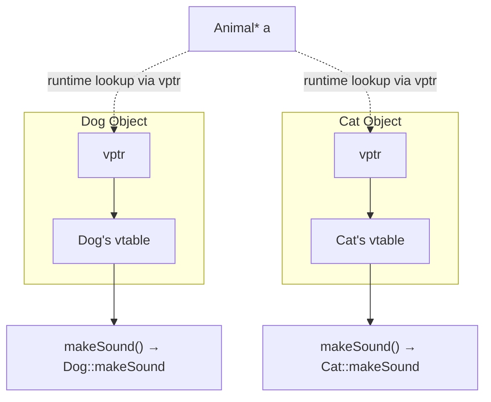
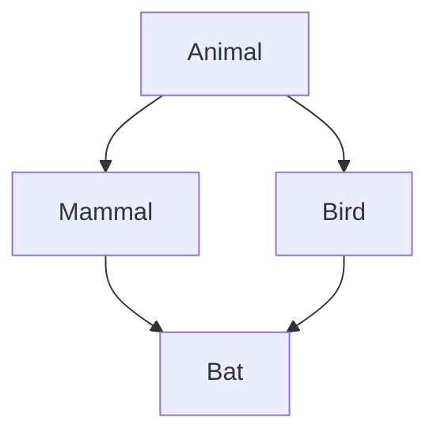
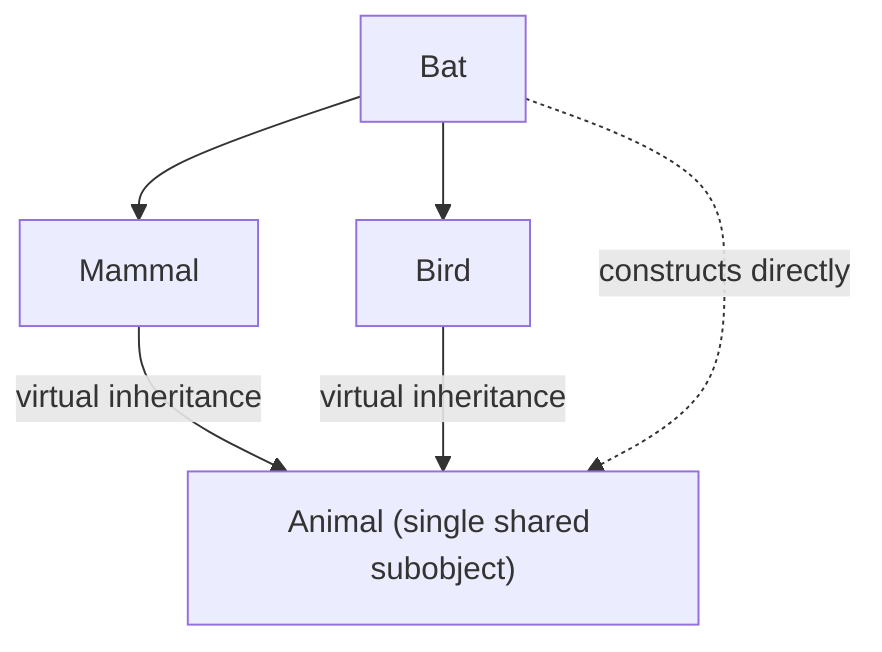
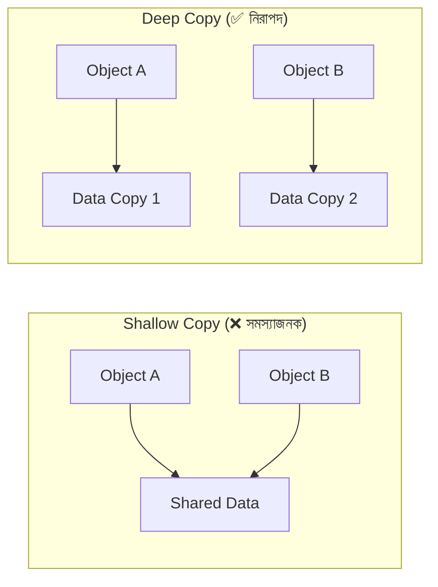
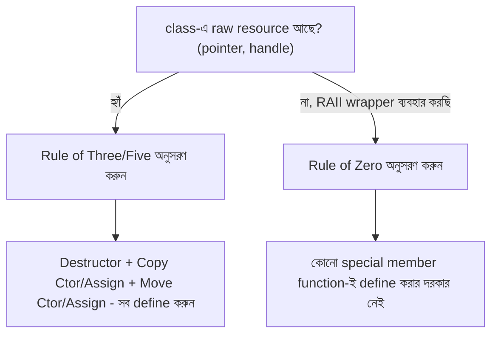
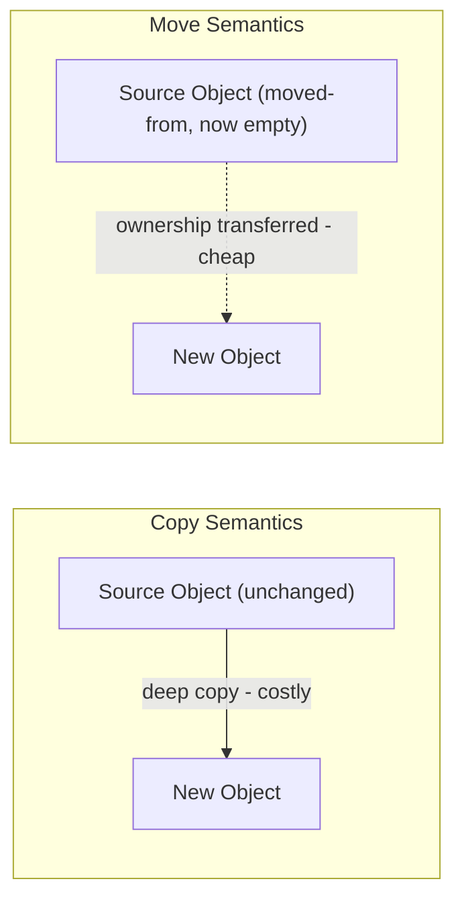

---
sidebar_position: 9
title: 'C++ OOP'
---


## 88. What is a virtual function in C++?

**Virtual function** হলো C++-এর একটি member function, যাকে base class-এ `virtual` keyword দিয়ে declare করা হয়, এবং derived class-এ override করা যায়। যখন একটি virtual function-কে base class pointer বা reference-এর মাধ্যমে call করা হয়, তখন actual object-এর type অনুযায়ী সঠিক (derived class-এর) function call হয় — compile-time-এ নয়, বরং **runtime**-এ এই সিদ্ধান্ত নেওয়া হয়।

```cpp
#include <iostream>
using namespace std;

class Animal {
public:
    virtual void makeSound() {
        cout << "Animal কিছু একটা শব্দ করছে..." << endl;
    }
};

class Dog : public Animal {
public:
    void makeSound() override {
        cout << "Dog বলছে: Bark!" << endl;
    }
};

class Cat : public Animal {
public:
    void makeSound() override {
        cout << "Cat বলছে: Meow!" << endl;
    }
};

int main() {
    Animal* animals[2];
    animals[0] = new Dog();
    animals[1] = new Cat();

    for (Animal* a : animals) {
        a->makeSound(); // runtime-এ সঠিক derived class-এর function call হয়
    }

    delete animals[0];
    delete animals[1];
    return 0;
}
```

**Output:**
```
Dog বলছে: Bark!
Cat বলছে: Meow!
```

### Why is the `virtual` keyword used?

`virtual` keyword ব্যবহার করা হয় compiler-কে বলার জন্য যে, এই function-এর জন্য **dynamic dispatch (late binding)** ব্যবহার করতে হবে, static binding নয়। যদি `virtual` keyword না থাকতো, তাহলে C++ default-ভাবে **static binding** ব্যবহার করতো — অর্থাৎ, pointer-এর **declared type** (static type) অনুযায়ী function call হতো, actual object-এর type (dynamic type) অনুযায়ী নয়।

```cpp
class Animal {
public:
    void makeSound() { // virtual নেই
        cout << "Animal sound" << endl;
    }
};

class Dog : public Animal {
public:
    void makeSound() {
        cout << "Bark!" << endl;
    }
};

Animal* a = new Dog();
a->makeSound(); // যদি virtual না থাকে, এটি "Animal sound" প্রিন্ট করবে, "Bark!" নয় — ভুল/অপ্রত্যাশিত behavior!
```

`virtual` keyword ছাড়া, polymorphism কাজ করে না — base class pointer দিয়ে derived class-এর overridden method call করলে base class-এর version-ই execute হবে, যা প্রায়ই প্রোগ্রামারের প্রত্যাশার বিপরীত।

### How does it enable runtime polymorphism?

`virtual` function runtime polymorphism সম্ভব করে **vtable (virtual table)** নামক একটি mechanism-এর মাধ্যমে। এভাবে কাজ করে:

1. যখন একটি class-এ কমপক্ষে একটি `virtual` function থাকে, compiler সেই class-এর জন্য একটি **vtable** তৈরি করে — এটি একটি array, যেখানে সেই class-এর সব virtual function-এর actual address (pointer) থাকে।
2. প্রতিটি object-এ একটি hidden pointer (**vptr**) থাকে, যা তার class-এর সংশ্লিষ্ট vtable-কে point করে।
3. যখন base class pointer/reference দিয়ে virtual function call করা হয়, compiler সরাসরি function address ব্যবহার না করে, object-এর `vptr` অনুসরণ করে সঠিক vtable-এ গিয়ে, সেখান থেকে সঠিক (derived class-এর) function address খুঁজে বের করে call করে — এটাই **dynamic dispatch**।



এই কারণেই, যদিও `Dog` এবং `Cat` উভয়ই `Animal*` type pointer-এ store করা, তাদের `makeSound()` call করলে প্রতিটি object তার নিজস্ব vtable-এর মাধ্যমে সঠিক (Dog বা Cat-এর) implementation খুঁজে পায় — এটাই runtime polymorphism-এর মূল mechanism।

---

## 89. What is a pure virtual function?

**Pure virtual function** হলো এমন একটি virtual function, যার কোনো implementation (body) base class-এ দেওয়া থাকে না (বা optional ভাবে দেওয়া যায়, কিন্তু directly call করা যায় না object-এর মাধ্যমে) এবং একে `= 0` দিয়ে declare করা হয়। যেকোনো derived class, যদি সে instantiate হতে চায়, তাকে অবশ্যই এই function-টি override/implement করতে হবে।

```cpp
class Shape {
public:
    // Pure virtual function
    virtual double calculateArea() const = 0;

    virtual void display() const {
        cout << "একটি Shape, area = " << calculateArea() << endl;
    }
};

class Circle : public Shape {
private:
    double radius;
public:
    Circle(double r) : radius(r) {}

    double calculateArea() const override {
        return 3.1416 * radius * radius;
    }
};

int main() {
    // Shape s; // ❌ Error: abstract class instantiate করা যায় না
    Circle c(5);
    c.display(); // Output: একটি Shape, area = 78.54
    return 0;
}
```

### How does it make a class abstract?

C++-এ যেকোনো class-এ **কমপক্ষে একটি pure virtual function** থাকলেই সেই class স্বয়ংক্রিয়ভাবে **abstract class** হয়ে যায়। Abstract class-এর নিয়ম:

- এই class-কে সরাসরি `new Shape()` বা `Shape s;` দিয়ে instantiate করা যায় না — compile error দেবে।
- এই class শুধুমাত্র base class হিসেবে ব্যবহার করা যায়, যেখান থেকে derived class তৈরি করে pure virtual function গুলো implement করতে হবে।
- যদি কোনো derived class সব pure virtual function override না করে, তাহলে সেই derived class-ও automatically abstract হয়ে যায় (এটিও instantiate করা যাবে না)।

এইভাবে, pure virtual function C++-এ Java/C#-এর `interface` বা `abstract method`-এর concept-টাকেই প্রকাশ করে — এটি একটি "contract" তৈরি করে, যা প্রতিটি concrete derived class-কে অবশ্যই পূরণ করতে হবে।

### Can an abstract C++ class contain concrete methods and fields?

**হ্যাঁ, সম্পূর্ণভাবে সম্ভব।** একটি abstract class-এ pure virtual function থাকার পাশাপাশি:

- সাধারণ (non-pure) **virtual বা non-virtual method** থাকতে পারে, যার সম্পূর্ণ implementation দেওয়া থাকে (উপরের উদাহরণে `display()` method)।
- সাধারণ **data member (fields)** থাকতে পারে।
- **Constructor** থাকতে পারে (যদিও object সরাসরি তৈরি করা যায় না, derived class-এর constructor থেকে `base()` call-এর মাধ্যমে এটি চলে)।
- **Destructor** থাকতে পারে (এবং এটি সাধারণত `virtual` হওয়া উচিত, যা প্রশ্ন ৯০-এ বিস্তারিত আলোচনা করা হয়েছে)।

```cpp
class Shape {
protected:
    string name; // concrete field

public:
    Shape(const string& n) : name(n) {} // constructor আছে

    virtual double calculateArea() const = 0; // pure virtual — must override

    void printName() const { // concrete method
        cout << "Shape name: " << name << endl;
    }

    virtual ~Shape() {} // concrete (virtual) destructor
};
```

এই flexibility-এর কারণেই C++-এ abstract class, একই সাথে "pure interface" (সব method pure virtual) এবং "partial implementation base class" (কিছু concrete, কিছু pure virtual) — উভয় ভূমিকা পালন করতে পারে।

---

## 90. What is a virtual destructor?

**Virtual destructor** হলো এমন একটি destructor, যাকে `virtual` keyword দিয়ে declare করা হয়, যাতে যখন কোনো derived class object-কে base class pointer-এর মাধ্যমে `delete` করা হয়, তখন সঠিক (derived class-এর) destructor প্রথমে call হয়, তারপর base class-এর destructor — অর্থাৎ পুরো destruction chain সঠিকভাবে সম্পন্ন হয়।

```cpp
class Base {
public:
    virtual ~Base() { // virtual destructor
        cout << "Base destructor called" << endl;
    }
};

class Derived : public Base {
private:
    int* data;
public:
    Derived() {
        data = new int[100]; // resource allocate করা হচ্ছে
        cout << "Derived constructor: memory allocated" << endl;
    }

    ~Derived() override {
        delete[] data; // resource release করা হচ্ছে
        cout << "Derived destructor: memory freed" << endl;
    }
};

int main() {
    Base* obj = new Derived();
    delete obj; // ✅ সঠিকভাবে Derived, তারপর Base destructor call হবে
    return 0;
}
```

**Output (virtual destructor থাকলে):**
```
Derived constructor: memory allocated
Derived destructor: memory freed
Base destructor called
```

### Why should a polymorphic base class usually have a virtual destructor?

যেকোনো class, যা polymorphically ব্যবহার করা হবে (অর্থাৎ base class pointer/reference-এর মাধ্যমে derived class object handle করা হবে), তার destructor `virtual` হওয়া **অত্যাবশ্যক**। কারণ:

1. যদি destructor `virtual` না হয়, তাহলে base class pointer-এর মাধ্যমে derived object `delete` করলে শুধুমাত্র **base class-এর destructor** call হবে, derived class-এর destructor কখনো call হবে না।
2. এর ফলে derived class-এ allocate করা resource (dynamic memory, file handle, network connection ইত্যাদি) কখনো release হবে না — এটি একটি **resource leak (memory leak)** তৈরি করে।
3. C++ standard অনুযায়ী, non-virtual destructor-এর মাধ্যমে base pointer দিয়ে derived object delete করা **undefined behavior** — যদিও বাস্তবে প্রায়ই এটি শুধু derived class-এর destructor skip করার মতো আচরণ করে, তবে এর উপর নির্ভর করা উচিত নয়।

**General rule:** যদি একটি class-এ কমপক্ষে একটি `virtual` function থাকে (অর্থাৎ এটি polymorphic ব্যবহারের উদ্দেশ্যে design করা হয়েছে), তাহলে সেই class-এর destructor-ও `virtual` হওয়া উচিত।

### What can go wrong when deleting a derived object through a base pointer without one?

```cpp
class Base {
public:
    ~Base() { // ❌ virtual নেই!
        cout << "Base destructor called" << endl;
    }
};

class Derived : public Base {
private:
    int* data;
public:
    Derived() {
        data = new int[100];
        cout << "Derived constructor: memory allocated" << endl;
    }

    ~Derived() {
        delete[] data;
        cout << "Derived destructor: memory freed" << endl;
    }
};

int main() {
    Base* obj = new Derived();
    delete obj; // ❌ Undefined Behavior!
    return 0;
}
```

**Output (non-virtual destructor থাকলে — problematic):**
```
Derived constructor: memory allocated
Base destructor called
```

লক্ষ্য করুন — `Derived destructor: memory freed` লাইনটি **কখনো print হয় না**! এর ফলাফল:

1. **Memory leak** — `Derived` class-এর `data` array কখনো `delete[]` হয় না, ফলে সেই memory চিরতরে "leaked" থেকে যায়, program-এর জীবনচক্র জুড়ে।
2. **Resource leak** — যদি `Derived` class-এ file handle, database connection, বা network socket থাকতো, সেগুলোও কখনো সঠিকভাবে বন্ধ হতো না।
3. **Undefined Behavior (UB)** — C++ standard technically এটাকে undefined behavior হিসেবে গণ্য করে, যার মানে compiler-ভেদে ভিন্ন ভিন্ন (এবং সম্ভাব্য আরও খারাপ) আচরণ হতে পারে — শুধু destructor skip হওয়া নয়, বরং crash বা memory corruption-ও ঘটতে পারে বিশেষ ক্ষেত্রে (যেমন multiple inheritance বা virtual inheritance-এর সাথে জড়িত জটিল object layout-এ)।

এই কারণেই, C++-এ যেকোনো base class, যেটি inheritance এবং polymorphism-এর জন্য design করা হয়েছে, তার destructor সবসময় `virtual` রাখা একটি গুরুত্বপূর্ণ best practice।

---

## 91. How does C++ handle the diamond problem?

**Diamond problem** তখন ঘটে, যখন একটি class দুইটি ভিন্ন class থেকে inherit করে, এবং সেই দুইটি class একই common base class থেকে inherit করে থাকে — ফলে ultimate derived class-এ সেই common base class-এর **দুটি আলাদা copy (subobject)** তৈরি হয়ে যায়, যা ambiguity তৈরি করে।



```cpp
class Animal {
public:
    string name = "Animal";
};

class Mammal : public Animal {};
class Bird : public Animal {};

class Bat : public Mammal, public Bird {};

int main() {
    Bat b;
    // b.name = "X"; // ❌ Ambiguous! কম্পাইলার জানে না কোন copy — Mammal::Animal::name নাকি Bird::Animal::name
    b.Mammal::name = "via Mammal"; // explicitly specify করতে হয়
    b.Bird::name = "via Bird";
    return 0;
}
```

এখানে `Bat` object-এর ভিতরে `Animal`-এর **দুটি আলাদা subobject** তৈরি হয়ে যায় (একটি `Mammal`-এর মাধ্যমে, আরেকটি `Bird`-এর মাধ্যমে), যার ফলে `b.name` লিখলে compiler বুঝতে পারে না কোন `name`-এর কথা বলা হচ্ছে — এটাই **diamond problem**।

### What is virtual inheritance?

**Virtual inheritance** হলো C++-এর একটি বিশেষ mechanism, যেখানে `virtual` keyword ব্যবহার করে base class inherit করা হয়, যাতে সেই base class-এর **শুধুমাত্র একটি single, shared copy (subobject)** তৈরি হয়, একাধিক inheritance path থাকলেও।

```cpp
class Animal {
public:
    string name = "Animal";
};

class Mammal : virtual public Animal {}; // virtual inheritance
class Bird : virtual public Animal {};   // virtual inheritance

class Bat : public Mammal, public Bird {};

int main() {
    Bat b;
    b.name = "Bat"; // ✅ এখন কোনো ambiguity নেই, কারণ শুধুমাত্র একটি Animal subobject আছে
    cout << b.name << endl; // Output: Bat
    return 0;
}
```

### How does it prevent duplicate base-class subobjects?

Virtual inheritance ব্যবহার করলে, C++ compiler নিশ্চিত করে যে, inheritance hierarchy-তে যতগুলো path দিয়েই common base class-এ পৌঁছানো হোক না কেন, শুধুমাত্র **একটি single instance** সেই base class-এর তৈরি হবে — একে বলা হয় **shared/virtual base class subobject**।

এটি কাজ করে নিচের mechanism-এর মাধ্যমে:

1. যখন `Mammal` এবং `Bird` উভয়ই `Animal`-কে `virtual` হিসেবে inherit করে, compiler একটি বিশেষ internal pointer (vbase pointer, অনেকটা vtable-এর মতো একটি mechanism) রাখে, যা most-derived class (`Bat`)-এর মধ্যে থাকা shared `Animal` subobject-কে locate করে।
2. Object construction-এর সময়, **most-derived class**-এর constructor-ই দায়িত্ব নেয় virtual base class-কে (এই ক্ষেত্রে `Animal`) initialize করার — intermediate class (`Mammal`, `Bird`)-এর constructor এই দায়িত্ব থেকে bypass হয়ে যায়। এই কারণেই `Bat`-এর constructor-কে explicitly `Animal`-এর constructor call করার সুযোগ (এবং কখনো কখনো প্রয়োজন) থাকে, এমনকি `Animal` তার direct base না হলেও।



এইভাবে virtual inheritance diamond problem-এর মূল সমস্যা — duplicate subobject এবং তার ফলে সৃষ্ট ambiguity — সম্পূর্ণভাবে দূর করে দেয়, যদিও এর ব্যবহার object layout-কে কিছুটা জটিল এবং সামান্য বেশি overhead-যুক্ত করে তোলে (extra pointer indirection-এর কারণে)।

---

## 92. What is object slicing in C++?

**Object slicing** হলো একটি সমস্যা, যা তখন ঘটে যখন একটি derived class object-কে **value দিয়ে (by value)** একটি base class object-এ assign বা copy করা হয় — এর ফলে derived class-এর যেই অতিরিক্ত member (data এবং behavior) base class-এ নেই, সেগুলো "কেটে ফেলা (sliced off)" হয়ে যায়, শুধুমাত্র base class অংশটুকু অবশিষ্ট থাকে।

```cpp
class Animal {
public:
    string name = "Animal";
    virtual void makeSound() const {
        cout << name << " makes a generic sound" << endl;
    }
};

class Dog : public Animal {
public:
    string breed = "Labrador"; // Dog-এর extra member
    void makeSound() const override {
        cout << name << " (" << breed << ") says: Bark!" << endl;
    }
};

void printAnimal(Animal a) { // ❌ by value — object slicing হবে!
    a.makeSound();
}

int main() {
    Dog d;
    d.name = "Tommy";

    printAnimal(d); // Dog object কে Animal (by value) হিসেবে pass করা হচ্ছে

    return 0;
}
```

**Output:**
```
Tommy makes a generic sound
```

লক্ষ্য করুন — যদিও আমরা `Dog` object পাস করেছি, output-এ `Dog::makeSound()`-এর পরিবর্তে `Animal::makeSound()` call হয়েছে, এবং `breed` field সম্পূর্ণভাবে হারিয়ে গেছে — এটাই **object slicing**।

### When does object slicing occur?

Object slicing সাধারণত নিচের পরিস্থিতিতে ঘটে:

1. **Function parameter হিসেবে by-value pass করলে** — যখন একটি derived object-কে base class type parameter-এ (pointer/reference ছাড়া) pass করা হয় (উপরের উদাহরণে `printAnimal(Animal a)`)।
2. **Direct assignment করলে** — `Animal a = derivedObject;` — এভাবে সরাসরি assign করলে।
3. **Container-এ base class object হিসেবে store করলে** — যেমন `vector<Animal> animals;` -এ `Dog` object push করলে, প্রতিটি element base class-এ "sliced" হয়ে store হবে।
4. **Function থেকে base class type by-value return করলে** — যদি একটি function derived object তৈরি করে base class type হিসেবে return করে (pointer/reference ছাড়া)।

মূল কারণ হলো — C++-এ by-value copy করার সময়, compiler শুধুমাত্র destination type (এই ক্ষেত্রে `Animal`)-এর জন্য প্রয়োজনীয় memory allocate করে এবং শুধু সেই অংশটুকুই copy করে — derived class-এর অতিরিক্ত অংশ কপি করার কোনো জায়গাই নেই।

### Why are references or pointers commonly used for polymorphic objects?

Polymorphic object নিয়ে কাজ করার সময় reference বা pointer ব্যবহার করা হয় object slicing এড়ানোর জন্য, কারণ:

1. **Reference/Pointer কখনো object copy করে না** — এটি শুধু existing object-এর একটি "handle" (memory address), তাই কোনো slicing হওয়ার সুযোগই নেই।
2. **vptr (vtable pointer) সংরক্ষিত থাকে** — যেহেতু কোনো নতুন object তৈরি হচ্ছে না, original object-এর vptr অক্ষত থাকে, ফলে virtual function call সঠিকভাবে dynamic dispatch (runtime polymorphism) ব্যবহার করে সঠিক derived class-এর function-কে call করতে পারে।

```cpp
void printAnimal(const Animal& a) { // ✅ reference দিয়ে — slicing হবে না
    a.makeSound();
}

int main() {
    Dog d;
    d.name = "Tommy";
    printAnimal(d); // ✅ সঠিক output: "Tommy (Labrador) says: Bark!"
    return 0;
}
```

এই কারণেই C++-এ polymorphism-নির্ভর কোনো function design করার সময়, parameter type হিসেবে সবসময় base class-এর `reference` (`Animal&` বা `const Animal&`) অথবা `pointer` (`Animal*`) ব্যবহার করা হয়, কখনো by-value (`Animal`) নয় — এটি একটি well-known best practice, যা object slicing-এর সমস্যা সম্পূর্ণভাবে এড়িয়ে যায়।

---

## 93. What is the difference between static binding and dynamic binding in C++?

**Static binding (early binding)** হলো সেই process, যেখানে কোন function call হবে তা **compile-time**-এই নির্ধারিত হয়ে যায়, program-এর actual runtime behavior-এর উপর নির্ভর না করে। **Dynamic binding (late binding)** হলো সেই process, যেখানে কোন function call হবে তা **runtime**-এ, object-এর actual (dynamic) type অনুযায়ী নির্ধারিত হয়।

| বিষয় | Static Binding | Dynamic Binding |
|---|---|---|
| কখন নির্ধারিত হয় | Compile-time | Runtime |
| কীসের উপর নির্ভর করে | Pointer/Reference-এর **declared (static) type** | Object-এর **actual (dynamic) type** |
| Function type | Non-virtual function | Virtual function |
| Performance | দ্রুততর (কোনো runtime lookup নেই) | সামান্য ধীর (vtable lookup প্রয়োজন) |
| Polymorphism | সমর্থন করে না | Runtime polymorphism সমর্থন করে |

### What happens when a function is not virtual?

যদি একটি function `virtual` না হয়, compiler **static binding** ব্যবহার করে — অর্থাৎ, compile-time-এই সিদ্ধান্ত নিয়ে নেয় কোন function call হবে, শুধুমাত্র pointer/reference-এর **declared type** দেখে, object-এর actual type-কে বিবেচনা না করেই।

```cpp
class Base {
public:
    void show() { // non-virtual
        cout << "Base::show()" << endl;
    }
};

class Derived : public Base {
public:
    void show() {
        cout << "Derived::show()" << endl;
    }
};

int main() {
    Base* ptr = new Derived();
    ptr->show(); // Output: "Base::show()" — static binding, declared type (Base*) অনুযায়ী
    delete ptr;
    return 0;
}
```

এখানে যদিও `ptr` আসলে একটি `Derived` object-কে point করছে, `ptr`-এর declared type যেহেতু `Base*`, compile-time-এই compiler সিদ্ধান্ত নিয়ে নেয় যে `Base::show()` call হবে — এটাই static binding।

### What changes when it is virtual?

যদি function-টি `virtual` declare করা হয়, compiler **dynamic binding** ব্যবহার করে — অর্থাৎ, compile-time-এ শুধু vtable lookup করার code বসিয়ে দেয়, কিন্তু actual function selection হয় **runtime**-এ, object-এর প্রকৃত (dynamic) type অনুযায়ী।

```cpp
class Base {
public:
    virtual void show() { // virtual
        cout << "Base::show()" << endl;
    }
};

class Derived : public Base {
public:
    void show() override {
        cout << "Derived::show()" << endl;
    }
};

int main() {
    Base* ptr = new Derived();
    ptr->show(); // Output: "Derived::show()" — dynamic binding, actual type (Derived) অনুযায়ী
    delete ptr;
    return 0;
}
```

এখানে `virtual` keyword যোগ করার ফলে, `ptr`-এর declared type `Base*` হলেও, runtime-এ object-এর actual type (`Derived`) অনুযায়ী সঠিক function call হয়েছে — এটাই dynamic binding, এবং এটাই C++-এ **runtime polymorphism**-এর মূল ভিত্তি।

---

## 94. What is a copy constructor in C++?

**Copy constructor** হলো একটি বিশেষ constructor, যা একই class-এর একটি existing object থেকে একটি নতুন object তৈরি করে, existing object-এর সব member-এর value নতুন object-এ কপি করার মাধ্যমে।

```cpp
class Point {
private:
    int x, y;
public:
    Point(int x, int y) : x(x), y(y) {}

    // Copy constructor
    Point(const Point& other) : x(other.x), y(other.y) {
        cout << "Copy constructor called" << endl;
    }

    void display() const {
        cout << "(" << x << ", " << y << ")" << endl;
    }
};

int main() {
    Point p1(3, 4);
    Point p2 = p1;    // copy constructor call হয় (copy initialization)
    Point p3(p1);     // copy constructor call হয় (direct initialization)

    p2.display(); // (3, 4)
    return 0;
}
```

### When is it called?

Copy constructor স্বয়ংক্রিয়ভাবে (implicitly) call হয় নিচের পরিস্থিতিতে:

1. যখন একটি object-কে একই type-এর আরেকটি existing object দিয়ে **initialize** করা হয় — `Point p2 = p1;` অথবা `Point p3(p1);`।
2. যখন একটি object **function-এ by-value pass** করা হয় — `void func(Point p);` কল করার সময়।
3. যখন একটি function **object by-value return** করে (যদিও modern compiler প্রায়ই Return Value Optimization (RVO) এর মাধ্যমে এই copy এড়িয়ে যায়)।
4. যখন একটি exception object throw বা catch করা হয় by-value।

> লক্ষ্যণীয়: `p2 = p1;` (যদি `p2` ইতিমধ্যে তৈরি করা থাকে) copy constructor নয়, বরং **copy assignment operator** call করে — এই পার্থক্যটি প্রশ্ন ৯৫-এ বিস্তারিত আলোচনা করা হয়েছে।

### How is it related to shallow and deep copying?

Copy constructor-এর default (compiler-generated) behavior হলো **member-wise copy**, যা মূলত **shallow copy** — অর্থাৎ, প্রতিটি member-এর value হুবহু কপি করা হয়, কিন্তু যদি কোনো member একটি **pointer** হয়, তাহলে শুধু pointer-এর address কপি হয়, সেই pointer যে data-কে point করছে সেটা নয়। এর ফলে দুটি object একই memory location-কে share করা শুরু করে, যা বিপজ্জনক (যেমন একটি object destroy হলে সেই memory free হয়ে যায়, কিন্তু অন্য object তখনো সেই freed memory-কে point করে থাকে — **dangling pointer**)।

```cpp
class ShallowBuffer {
private:
    int* data;
public:
    ShallowBuffer(int size) {
        data = new int[size];
    }
    // কোনো custom copy constructor নেই — compiler default shallow copy generate করে
    ~ShallowBuffer() {
        delete[] data; // ❌ সমস্যা: দুটি object একই data point করলে double-delete হবে!
    }
};
```

এই সমস্যা এড়াতে, যেসব class dynamically allocated resource ধারণ করে, তাদের একটি **custom copy constructor** define করে **deep copy** implement করতে হয় — যেখানে pointer-এর মাধ্যমে referenced data-এর একটি সম্পূর্ণ, স্বতন্ত্র (independent) নতুন কপি তৈরি করা হয়।

```cpp
class DeepBuffer {
private:
    int* data;
    int size;
public:
    DeepBuffer(int s) : size(s) {
        data = new int[size];
    }

    // Custom copy constructor — deep copy
    DeepBuffer(const DeepBuffer& other) : size(other.size) {
        data = new int[size]; // নতুন, স্বতন্ত্র memory allocate করা হচ্ছে
        for (int i = 0; i < size; i++) {
            data[i] = other.data[i]; // actual data কপি করা হচ্ছে
        }
    }

    ~DeepBuffer() {
        delete[] data; // ✅ নিরাপদ — প্রতিটি object তার নিজস্ব memory-এর মালিক
    }
};
```



---

## 95. What is the copy assignment operator?

**Copy assignment operator** হলো একটি overloaded `operator=`, যা একটি **already-existing object**-কে আরেকটি existing object-এর value দিয়ে overwrite/update করে।

```cpp
class Point {
private:
    int x, y;
public:
    Point(int x = 0, int y = 0) : x(x), y(y) {}

    // Copy assignment operator
    Point& operator=(const Point& other) {
        cout << "Copy assignment operator called" << endl;
        if (this != &other) { // self-assignment check
            x = other.x;
            y = other.y;
        }
        return *this; // chaining সমর্থন করার জন্য (a = b = c)
    }

    void display() const {
        cout << "(" << x << ", " << y << ")" << endl;
    }
};

int main() {
    Point p1(3, 4);
    Point p2(10, 20);

    p2 = p1; // copy assignment operator call হয় — p2 ইতিমধ্যে তৈরি করা আছে
    p2.display(); // (3, 4)
    return 0;
}
```

### How is copy assignment different from copy construction?

| বিষয় | Copy Constructor | Copy Assignment Operator |
|---|---|---|
| কখন call হয় | যখন একটি **নতুন object তৈরি** হচ্ছে, existing object থেকে | যখন একটি **already-existing object**-কে অন্য object-এর value দিয়ে overwrite করা হয় |
| Syntax | `Point p2 = p1;` অথবা `Point p2(p1);` | `p2 = p1;` (যেখানে `p2` আগে থেকেই তৈরি করা আছে) |
| Old resource handling | কোনো পুরনো resource নেই (নতুন object) | পুরনো resource (যদি থাকে) প্রথমে release করতে হয়, তারপর নতুন value assign করতে হয়, নাহলে memory leak হবে |
| Return type | কিছু return করে না (এটি একটি constructor) | সাধারণত `Point&` return করে, যাতে chaining (`a = b = c`) সম্ভব হয় |
| Self-assignment ঝুঁকি | নেই (নতুন object, তাই self-assignment সম্ভব নয়) | আছে — `p1 = p1;`-এর ক্ষেত্রে সাবধানতা প্রয়োজন (self-assignment check করা উচিত) |

একটি গুরুত্বপূর্ণ পার্থক্য হলো — যদি class dynamically allocated resource (যেমন pointer) ধারণ করে, তাহলে copy assignment operator-কে অবশ্যই প্রথমে **destination object-এর পুরনো resource release** করতে হবে, তারপর নতুন resource-এর deep copy করতে হবে:

```cpp
class DeepBuffer {
private:
    int* data;
    int size;
public:
    DeepBuffer(int s) : size(s) { data = new int[s]; }

    DeepBuffer& operator=(const DeepBuffer& other) {
        if (this == &other) return *this; // self-assignment check

        delete[] data; // ✅ পুরনো resource release করা হচ্ছে, নাহলে memory leak হবে

        size = other.size;
        data = new int[size]; // নতুন resource allocate
        for (int i = 0; i < size; i++) {
            data[i] = other.data[i]; // deep copy
        }
        return *this;
    }

    ~DeepBuffer() { delete[] data; }
};
```

---

## 96. What are the Rule of Three, Rule of Five, and Rule of Zero?

এই তিনটি rule হলো C++-এ resource management (বিশেষ করে dynamic memory বা অন্য কোনো resource-এর ownership) সংক্রান্ত class design করার জন্য সাধারণ guideline।

**Rule of Three:** যদি একটি class-এর নিচের তিনটি special member function-এর যেকোনো **একটি** custom implementation প্রয়োজন হয়, তাহলে সাধারণত **তিনটিই** define করা উচিত:
1. **Destructor**
2. **Copy constructor**
3. **Copy assignment operator**

**Rule of Five:** C++11-এ move semantics চালু হওয়ার পর, Rule of Three আরও দুটি member function দিয়ে বিস্তৃত হয়েছে:
4. **Move constructor**
5. **Move assignment operator**

**Rule of Zero:** সম্ভব হলে, একটি class-এ এই পাঁচটি special member function-এর **কোনোটিই** নিজে থেকে define করা উচিত নয় — বরং resource management-এর দায়িত্ব সম্পূর্ণভাবে existing RAII-compliant type (যেমন `std::vector`, `std::unique_ptr`, `std::string`)-এর উপর ছেড়ে দেওয়া উচিত, যাতে compiler-generated default version গুলোই সঠিকভাবে কাজ করে।

```cpp
// Rule of Zero — কোনো custom special member function দরকার নেই
class Team {
private:
    std::vector<std::string> members; // resource management vector নিজেই সামলায়
    std::unique_ptr<Logger> logger;   // ownership unique_ptr নিজেই সামলায়
public:
    // কোনো destructor, copy/move constructor, copy/move assignment define করার প্রয়োজন নেই
    // compiler-generated default গুলোই সঠিকভাবে কাজ করবে
};
```

```cpp
// Rule of Five — raw pointer দিয়ে resource ownership manage করছি, তাই সব পাঁচটি প্রয়োজন
class Buffer {
private:
    int* data;
    size_t size;
public:
    Buffer(size_t s) : size(s), data(new int[s]) {}

    ~Buffer() { delete[] data; } // 1. Destructor

    Buffer(const Buffer& other) : size(other.size), data(new int[other.size]) { // 2. Copy constructor
        std::copy(other.data, other.data + size, data);
    }

    Buffer& operator=(const Buffer& other) { // 3. Copy assignment
        if (this == &other) return *this;
        delete[] data;
        size = other.size;
        data = new int[size];
        std::copy(other.data, other.data + size, data);
        return *this;
    }

    Buffer(Buffer&& other) noexcept : data(other.data), size(other.size) { // 4. Move constructor
        other.data = nullptr;
        other.size = 0;
    }

    Buffer& operator=(Buffer&& other) noexcept { // 5. Move assignment
        if (this == &other) return *this;
        delete[] data;
        data = other.data;
        size = other.size;
        other.data = nullptr;
        other.size = 0;
        return *this;
    }
};
```

### Why are these rules important for resource-owning classes?

এই rule গুলো গুরুত্বপূর্ণ, কারণ:

1. **Compiler-generated default গুলো raw resource-এর জন্য বিপজ্জনক** — যদি একটি class raw pointer দিয়ে dynamic memory ধারণ করে, এবং আমরা copy constructor/copy assignment custom define না করি, compiler default-ভাবে **shallow copy** generate করবে, যা double-delete, dangling pointer-এর মতো bug তৈরি করে (প্রশ্ন ৯৪-এ আলোচিত)।
2. **"একটি প্রয়োজন হলে, প্রায়ই বাকিগুলোও প্রয়োজন হয়"** — এই পর্যবেক্ষণের ভিত্তিতেই Rule of Three/Five তৈরি হয়েছে। যদি একটি class-এর custom destructor দরকার হয় (কারণ এটি কোনো resource সরাসরি manage করছে), তাহলে প্রায় নিশ্চিতভাবেই copy constructor এবং copy assignment operator-ও custom define করা প্রয়োজন হবে, নাহলে অসামঞ্জস্যপূর্ণ (inconsistent) resource management হবে।
3. **Move semantics performance বাড়ায়** — Rule of Five অনুসরণ করে move constructor/move assignment define করলে, বড় resource (যেমন বড় buffer, container) copy করার বদলে দ্রুত "move" (ownership transfer) করা যায়, যা performance উল্লেখযোগ্যভাবে বাড়ায়। যদি এগুলো define না করা হয়, compiler অনেক ক্ষেত্রে move-এর বদলে copy fall back করে, যা অপ্রয়োজনীয় overhead তৈরি করে।
4. **Rule of Zero সবচেয়ে নিরাপদ এবং maintainable** — যখনই সম্ভব, raw resource ব্যবহার না করে existing RAII wrapper (`std::vector`, `std::unique_ptr`, `std::shared_ptr`) ব্যবহার করে Rule of Zero অনুসরণ করা উচিত। এতে বাগ হওয়ার সম্ভাবনা কমে যায়, কারণ resource management logic আর নিজে লিখতে হয় না — well-tested standard library-এর উপর নির্ভর করা হয়।



---

## 97. What are move constructor and move assignment in C++?

**Move constructor** এবং **move assignment operator** হলো C++11-এ প্রবর্তিত বিশেষ member function, যেগুলো একটি **temporary বা "rvalue" object**-এর resource-এর **ownership স্থানান্তর (transfer)** করে একটি নতুন object-এ (বা existing object-এ), copy না করে — এতে expensive deep copy এড়ানো যায়।

```cpp
class Buffer {
private:
    int* data;
    size_t size;
public:
    Buffer(size_t s) : size(s), data(new int[s]) {
        cout << "Constructor: memory allocated" << endl;
    }

    // Move constructor
    Buffer(Buffer&& other) noexcept : data(other.data), size(other.size) {
        cout << "Move constructor: ownership transferred" << endl;
        other.data = nullptr; // source object-কে "খালি" করে দেওয়া হচ্ছে
        other.size = 0;
    }

    // Move assignment operator
    Buffer& operator=(Buffer&& other) noexcept {
        cout << "Move assignment: ownership transferred" << endl;
        if (this != &other) {
            delete[] data;       // পুরনো resource release
            data = other.data;   // নতুন resource-এর ownership নেওয়া (কপি নয়, শুধু pointer স্থানান্তর)
            size = other.size;
            other.data = nullptr;
            other.size = 0;
        }
        return *this;
    }

    ~Buffer() { delete[] data; }
};

Buffer createBuffer() {
    Buffer b(1000);
    return b; // move হবে (অথবা RVO-এর কারণে সম্পূর্ণ elide-ও হতে পারে)
}

int main() {
    Buffer b1 = createBuffer(); // move constructor call হবে (deep copy নয়)
    Buffer b2(500);
    b2 = createBuffer(); // move assignment call হবে
    return 0;
}
```

### Why were move semantics introduced?

Move semantics C++11-এ যুক্ত হওয়ার মূল কারণ ছিল **অপ্রয়োজনীয় deep copy এড়িয়ে performance বাড়ানো**। C++11-এর আগে, যখনই কোনো object (যেমন একটি বড় `vector` বা dynamic buffer) একটি function থেকে return হতো, বা একটি temporary object অন্য object-এ assign হতো, compiler প্রতিবার একটি সম্পূর্ণ deep copy তৈরি করতো — এমনকি যখন source object (temporary/rvalue) এমনিতেই এর ঠিক পরেই ধ্বংস (destroy) হয়ে যেত!

এটি একটি অপ্রয়োজনীয় ও ব্যয়বহুল operation ছিল — কারণ, যেহেতু source object যাইহোক destroy হয়ে যাবে, তার resource "কপি" করার বদলে সরাসরি "স্থানান্তর (steal/move)" করে নেওয়াই অনেক বেশি efficient।

### How do move operations differ from copying?

| বিষয় | Copy | Move |
|---|---|---|
| Resource handling | Source object-এর resource-এর একটি **নতুন, স্বতন্ত্র কপি** তৈরি করা হয় | Source object-এর resource-এর **ownership সরাসরি স্থানান্তর** করা হয়, কোনো নতুন allocation ছাড়াই |
| Source object-এর অবস্থা | অপরিবর্তিত থাকে (এখনো সম্পূর্ণ valid এবং ব্যবহারযোগ্য) | "খালি" বা "moved-from" অবস্থায় চলে যায় (সাধারণত null/empty, কিন্তু valid destructible state) |
| Cost | Resource-এর আকার অনুযায়ী costly (O(n) বা তার বেশি হতে পারে) | সাধারণত খুবই সস্তা — মাত্র কয়েকটি pointer/primitive সোয়াপ করা হয় (O(1)) |
| কখন ব্যবহৃত হয় | যখন source object পরবর্তীতেও ব্যবহার করা প্রয়োজন | যখন source object temporary (rvalue), যা যাইহোক শীঘ্রই ধ্বংস হয়ে যাবে |
| Parameter type | `const T&` (lvalue reference) | `T&&` (rvalue reference) |



`std::move()` function ব্যবহার করে আমরা একটি lvalue-কে explicitly rvalue হিসেবে "cast" করতে পারি, যাতে move constructor/assignment ব্যবহার করা যায়, এমনকি যখন source object টেকনিক্যালি একটি named variable (lvalue):

```cpp
Buffer b1(1000);
Buffer b2 = std::move(b1); // explicitly move করা হচ্ছে — b1 এখন "moved-from" অবস্থায়
```

---

## 98. What is the `this` pointer in C++?

**`this` pointer** হলো C++-এর একটি implicit (স্বয়ংক্রিয়) pointer, যা প্রতিটি non-static member function-এর ভিতরে automatically পাওয়া যায়, এবং এটি **সেই object-কেই point করে, যার উপর function-টি call করা হয়েছে** (current object-এর নিজের address)।

```cpp
class Point {
private:
    int x, y;
public:
    Point(int x, int y) {
        this->x = x; // parameter এবং member variable-এর নাম একই হওয়ায়, this ব্যবহার করা হচ্ছে
        this->y = y;
    }

    void display() const {
        cout << "(" << this->x << ", " << this->y << ")" << endl;
    }
};
```

### When is it useful?

`this` pointer বিভিন্ন পরিস্থিতিতে ব্যবহার করা হয়:

1. **Parameter name এবং member variable name-এর মধ্যে conflict resolve করতে** — যখন constructor বা setter-এর parameter-এর নাম member field-এর সাথে একই হয় (উপরের উদাহরণে `x`, `y`), `this->x` লিখে স্পষ্টভাবে member variable-কে refer করা যায়।

2. **Method chaining (fluent interface) সমর্থন করতে** — যখন কোনো member function `*this` (dereferenced `this`, অর্থাৎ current object) return করে, একাধিক method call chain করা যায়:

```cpp
class StringBuilder {
private:
    string content;
public:
    StringBuilder& append(const string& text) {
        content += text;
        return *this; // current object-এর reference return করা হচ্ছে
    }

    string build() const {
        return content;
    }
};

int main() {
    StringBuilder sb;
    string result = sb.append("Hello, ").append("World").append("!").build();
    cout << result << endl; // Output: Hello, World!
    return 0;
}
```

3. **Copy assignment operator-এ self-assignment check করতে** — `if (this != &other)` লিখে নিশ্চিত করা হয় যে object নিজেকে নিজের সাথে assign করছে না (প্রশ্ন ৯৫-এ আলোচিত)।

4. **একটি object তার নিজের address অন্য function-এ পাস করতে** — যেমন যখন একটি object-কে কোনো callback-এ বা container-এ নিজের pointer হিসেবে register করতে হয় (`someList.add(this);`)।

---

## 99. What are `override` and `final` in C++?

C++11-এ প্রবর্তিত `override` এবং `final` হলো দুটি **contextual keyword** (identifier hিসেবেও ব্যবহারযোগ্য, শুধু নির্দিষ্ট context-এ special অর্থ বহন করে), যা virtual function-এর সাথে সম্পর্কিত ভুল প্রতিরোধ করতে এবং inheritance নিয়ন্ত্রণ করতে ব্যবহৃত হয়।

**`override`** ব্যবহার করা হয় derived class-এ, নিশ্চিত করতে যে একটি function সত্যিই base class-এর একটি virtual function-কে override করছে।

```cpp
class Base {
public:
    virtual void show(int x) {
        cout << "Base::show(int)" << endl;
    }
};

class Derived : public Base {
public:
    void show(double x) override { // ❌ Compile Error!
        cout << "Derived::show(double)" << endl;
    }
};
```

উপরের উদাহরণে, `override` keyword ছাড়া, `Derived::show(double)` compile হয়ে যেত, কিন্তু এটি আসলে base class-এর `show(int)` কে override না করে একটি সম্পূর্ণ নতুন, unrelated (overloaded) function হয়ে যেত — একটি সূক্ষ্ম কিন্তু বিপজ্জনক bug। `override` keyword ব্যবহার করার ফলে compiler নিজে থেকেই এই ভুল ধরে ফেলে এবং compile error দেয়, কারণ signature (parameter type) mismatch হচ্ছে।

**`final`** ব্যবহার করা হয় দুইভাবে:
1. একটি class-এ, যাতে সেই class থেকে আর কোনো নতুন class inherit (derive) করতে না পারে।
2. একটি virtual function-এ, যাতে derived class-এ সেই function আর override করা না যায়।

```cpp
class Base {
public:
    virtual void show() final { // এই function আর override করা যাবে না
        cout << "Base::show()" << endl;
    }
};

class Derived : public Base {
public:
    void show() override { // ❌ Compile Error! Base::show() final ছিল
        cout << "Derived::show()" << endl;
    }
};

class FinalClass final { // এই class inherit করা যাবে না
    // ...
};

class AnotherClass : public FinalClass { // ❌ Compile Error!
};
```

### Why is `override` safer than relying only on matching method signatures?

`override` ব্যবহার করা শুধুমাত্র function signature ঠিকভাবে match করার উপর নির্ভর করার চেয়ে অনেক বেশি নিরাপদ, কারণ:

1. **Compile-time-এ ভুল ধরা পড়ে** — `override` ছাড়া, যদি কোনো developer ভুলবশত parameter type, `const`-qualifier, বা এমনকি function-এর নাম সামান্য ভুল লেখেন (typo), compiler কোনো error দেয় না — এটি নীরবে একটি নতুন, unrelated function হিসেবে তৈরি হয়ে যায়, এবং base class-এর virtual function অপরিবর্তিত থেকে যায়। এই bug detect করা অনেক সময় খুব কঠিন, কারণ code compile হয়ে যায়, কোনো warning ছাড়াই (compiler-ভেদে ভিন্ন হতে পারে, কিন্তু guaranteed নয়)।
2. **Documentation হিসেবে কাজ করে** — `override` লেখা থাকলে, যেকোনো developer কোড পড়েই সহজে বুঝতে পারেন যে এই function ইচ্ছাকৃতভাবে একটি base class virtual function-কে override করছে, এটি একটি নতুন, স্বতন্ত্র function নয়।
3. **Refactoring safety বাড়ায়** — যদি ভবিষ্যতে base class-এর virtual function-এর signature পরিবর্তন করা হয় (যেমন একটি নতুন parameter যোগ করা), এবং derived class-এ `override` keyword ব্যবহার করা থাকে, compiler তৎক্ষণাৎ error দেবে যে derived class-এর function আর base class-এর কোনো virtual function-কে override করছে না — এতে সেই bug অবিলম্বে ধরা পড়ে, production-এ পৌঁছানোর আগেই।

সংক্ষেপে: **`override` কোনো নতুন functionality যোগ করে না, বরং একটি "intent verification" mechanism হিসেবে কাজ করে, যা compiler-কে দিয়ে developer-এর উদ্দেশ্য যাচাই করিয়ে নেওয়ার একটি নিরাপদ উপায়।**

---

## 100. What is operator overloading in C++?

**Operator overloading** হলো C++-এর একটি feature, যা একটি built-in operator (যেমন `+`, `-`, `==`, `<<`, `[]` ইত্যাদি)-কে user-defined class/type-এর জন্য custom behavior দিয়ে redefine করার সুযোগ দেয়, যাতে সেই class-এর object গুলোর সাথে সেই operator ব্যবহার করা যায় স্বাভাবিক, স্বজ্ঞাত (intuitive) সিনট্যাক্সে।

```cpp
class Complex {
private:
    double real, imag;
public:
    Complex(double r = 0, double i = 0) : real(r), imag(i) {}

    // '+' operator overload করা হচ্ছে
    Complex operator+(const Complex& other) const {
        return Complex(real + other.real, imag + other.imag);
    }

    // '==' operator overload করা হচ্ছে
    bool operator==(const Complex& other) const {
        return real == other.real && imag == other.imag;
    }

    // '<<' operator overload করা হচ্ছে (friend function হিসেবে, output stream-এর জন্য)
    friend ostream& operator<<(ostream& os, const Complex& c) {
        os << c.real << " + " << c.imag << "i";
        return os;
    }
};

int main() {
    Complex c1(3, 4);
    Complex c2(1, 2);

    Complex sum = c1 + c2; // operator+ call হচ্ছে
    cout << sum << endl;   // Output: 4 + 6i (operator<< call হচ্ছে)

    if (c1 == c2) { // operator== call হচ্ছে
        cout << "সমান" << endl;
    } else {
        cout << "সমান নয়" << endl;
    }
    return 0;
}
```

### How does it relate to ad-hoc polymorphism?

**Ad-hoc polymorphism** হলো polymorphism-এর একটি রূপ, যেখানে একই নাম (এই ক্ষেত্রে, একই operator symbol) বিভিন্ন, সম্পূর্ণ unrelated type-এর জন্য **ভিন্ন ভিন্ন, বিশেষায়িত (specific)** implementation থাকতে পারে — এটি runtime polymorphism (যা একটি common interface-এর মাধ্যমে কাজ করে) থেকে আলাদা।

Operator overloading হলো ad-hoc polymorphism-এর একটি classic উদাহরণ, কারণ:

1. `+` operator, `int` type-এর জন্য built-in arithmetic addition করে, কিন্তু `Complex` type-এর জন্য custom complex-number addition করে, আবার `std::string`-এর জন্য concatenation করে — একই operator symbol, কিন্তু type অনুযায়ী **সম্পূর্ণ ভিন্ন, নির্দিষ্টভাবে define করা** behavior।
2. এটি "ad-hoc" (তাৎক্ষণিক/বিশেষ-উদ্দেশ্যমূলক), কারণ প্রতিটি type-এর জন্য implementation আলাদাভাবে, স্বাধীনভাবে লেখা হয় — কোনো একটি common inheritance hierarchy বা interface-এর মাধ্যমে নয় (যা হলে সেটা subtype polymorphism হতো)।
3. Compile-time-এই compiler ঠিক করে দেয় কোন `operator+` implementation call হবে, operand-এর (compile-time) type দেখে — এটি অনেকটা function overloading-এর মতোই কাজ করে (আসলে, operator overloading টেকনিক্যালি function overloading-এরই একটি বিশেষ রূপ)।

### What are the risks of abusing operator overloading?

Operator overloading একটি শক্তিশালী feature, কিন্তু ভুলভাবে বা অতিরিক্ত ব্যবহার করলে বিভিন্ন সমস্যা তৈরি করতে পারে:

1. **Readability হ্রাস পায় (surprising behavior)** — যদি একটি operator-কে তার স্বাভাবিক, প্রচলিত অর্থের সম্পূর্ণ বিপরীত কোনো কাজে ব্যবহার করা হয় (যেমন `+` operator দিয়ে subtraction করা, বা `==` দিয়ে কোনো side-effect তৈরি করা), তাহলে code পড়ে বোঝা কঠিন এবং বিভ্রান্তিকর হয়ে যায় — একে বলা হয় **"principle of least astonishment" লঙ্ঘন**।

```cpp
// ❌ খারাপ practice — '+' operator দিয়ে সম্পূর্ণ অপ্রাসঙ্গিক কাজ করা
class BankAccount {
public:
    BankAccount operator+(const BankAccount& other) {
        // এখানে দুই account merge করার বদলে, hypothetically কিছু অদ্ভুত জিনিস করা,
        // যেমন account বন্ধ করে দেওয়া — completely surprising!
    }
};
```

2. **Performance-এর ভুল ধারণা তৈরি হতে পারে** — যেহেতু operator-এর syntax simple দেখায় (যেমন `a + b`), user ধরে নিতে পারেন এটি একটি সস্তা, দ্রুত operation, কিন্তু বাস্তবে এর ভিতরে ব্যয়বহুল deep copy, memory allocation, বা জটিল computation লুকানো থাকতে পারে — এটি একটি ধরনের "hidden cost"।

3. **Overuse করলে code জটিল হয়ে যায়** — প্রতিটি সম্ভাব্য operator (যেমন `[]`, `()`, `->`, `++`, `--`) overload করার প্রলোভন তৈরি হতে পারে, এমনকি যখন একটি সাধারণ, স্পষ্ট নামের member function (যেমন `getElementAt()`) অনেক বেশি readable এবং maintainable হতো।

4. **Operator precedence এবং associativity পরিবর্তন করা যায় না** — যেহেতু C++ built-in operator-এর precedence rule অপরিবর্তিত থাকে, overloaded operator ব্যবহার করার সময় ভুল ধারণা তৈরি হতে পারে যদি precedence প্রত্যাশিত আচরণের সাথে না মেলে (যেমন `a + b * c` — এখানে `*` এখনো `+`-এর আগে evaluate হবে, এমনকি উভয় operator overload করা থাকলেও)।

**Best practice:** operator overloading তখনই ব্যবহার করা উচিত, যখন সেই operator-এর ব্যবহার class-এর domain-এর জন্য **স্বাভাবিক এবং স্বজ্ঞাত (intuitive)** — যেমন `Complex` number-এর জন্য `+`, `Matrix`-এর জন্য `*`, `Vector`-এর জন্য `+`/`-`, বা custom container-এর জন্য `[]`। যদি operator-এর অর্থ স্পষ্ট এবং প্রচলিত না হয়, তাহলে একটি সাধারণ, named member function ব্যবহার করাই ভালো পছন্দ।